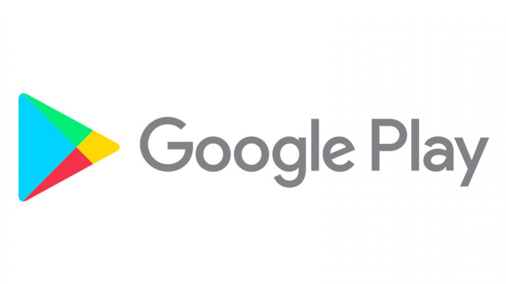

import Tabs from '@theme/Tabs';
import TabItem from '@theme/TabItem';



Publishing an App on PlayStore is an easy task once you are done with your development.
Below we have mentioned few steps which will help you to understand more in detail.

### 1. Reduce App Size.

App Size is a prior concern before publishing App on the Play Store. **Android Studio** provides few plugins and tools that will help you reduce the app size.
One way to reduce app size is to remove unused resources. Android Studio provides an option "**Remove unused Resources**" under "**Refactor**" Menu which will help you to remove unused resources from your app.

Please check below link to get different ways to reduce your app size.

[https://developer.android.com/topic/performance/reduce-apk-size](https://developer.android.com/topic/performance/reduce-apk-size)

---

### 2. Prepare the Signed Release App Bundle.

Before preparing the signed release app bundle, we suggest you to check that the **android:debuggable** attribute should not be present in your manifest file.
Also you need to maintain** versionCode **and **versionName** available in ( app-level ) **build.gradle** for each release.

<Tabs>
<TabItem value="Groovy" label="Groovy">

```groovy
android {
  ...
  defaultConfig {
    ...
    versionCode 2
    versionName "1.1"
  }

}
```
</TabItem>
</Tabs>

After above steps you need to sign your app and upload it to the play store.
Android Studio provides an option to generate a signed app bundle. From the menu bar, click **Build &gt; Build &gt; Generate Signed Bundle/APK**.
After that you can reuse your existing key or create a new one if you don't have one

For more details please check below link.

[https://developer.android.com/studio/publish/app-signing](https://developer.android.com/studio/publish/app-signing)

---

### 3 Upload an App.

To upload an app on Google Play Store, you need google account, sign-in to your google account or create a new if you don't have one. Then click on the below mentioned link.

[https://play.google.com/apps/publish/](https://play.google.com/apps/publish/)

If you already have merchant account then it will show you list of your published apps or else it will tell you to sign as merchant account and you need to pay one-time charge.

:::info
 It will charge you a once in a lifetime fee i.e 25$. Just do it to start uploading your first app. Later you can publish other apps through this account and you won't be charged.
:::

Check below link for more details on how to create and upload app in play store.

[https://developer.android.com/studio/publish/upload-bundle](https://developer.android.com/studio/publish/upload-bundle)