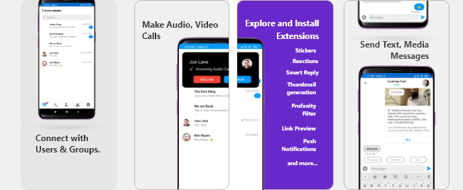
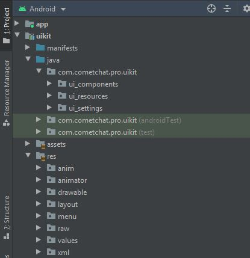
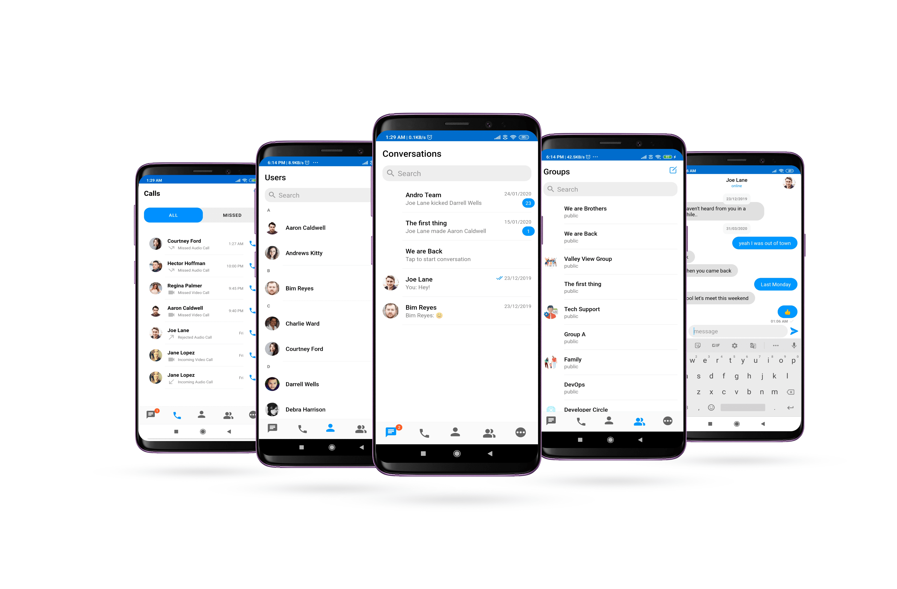

import Tabs from '@theme/Tabs';
import TabItem from '@theme/TabItem';


The CometChat Android Java UI Kit is developed to keep developers in mind and aims to reduce development efforts significantly.



The UI Kit’s customizable UI components simplify the process of integrating text chat and voice/video calling features to your website or mobile application in a few minutes. 

<div style={{ display: 'flex', boxShadow: '0 0 4px 0 rgb(0 0 0 / 18%)', borderRadius: '3px' }}>
  <div style={{ padding: '24px' }}>
    <h4 style={{ fontWeight: 'bold' }}>**I want to checkout Android Java UI Kit**</h4>
    <p>Follow the steps mentioned in the <code>README.md</code> file.</p>
    <p>Kindly, click on below button to download our Android Java Chat UI Kit.</p>
    <a
      style={{
        display: 'inline-block',
        backgroundColor: '#7c55c9',
        padding: '8px',
        textAlign: 'center',
        textTransform: 'uppercase',
        border: '1px solid #e3e5e7',
        borderRadius: '3px',
        color: 'white',
        width: '100%',
        marginBottom: '8px'
      }}
      href="https://github.com/cometchat-pro/android-java-chat-ui-kit/archive/v2.zip"
    >
      Java Chat UI Kit
    </a>
    <a
      style={{
        display: 'inline-block',
        backgroundColor: '#7c55c9',
        padding: '8px',
        textAlign: 'center',
        textTransform: 'uppercase',
        border: '1px solid #e3e5e7',
        borderRadius: '3px',
        color: 'white',
        width: '100%'
      }}
      href="https://github.com/cometchat-pro/android-java-chat-ui-kit/tree/v2"
      target="_blank"
    >
      View on Github
    </a>


  </div>
  <div style={{ padding: '24px', borderLeft: '1px solid #e3e5e7' }}>
    <h4 style={{ fontWeight: 'bold' }}>**I want to explore sample apps.**</h4>
    <p>Import the app into Android Studio and follow the steps mentioned in the <code>README.md</code> file.</p>
    <p>Kindly, click on below button to download our Java Sample App.</p>
    <a
      style={{
        display: 'inline-block',
        backgroundColor: '#7c55c9',
        padding: '8px',
        textAlign: 'center',
        textTransform: 'uppercase',
        border: '1px solid #e3e5e7',
        borderRadius: '3px',
        color: 'white',
        width: '100%',
        marginBottom: '8px'
      }}
      href="https://github.com/cometchat-pro-samples/android-java-chat-app/archive/v2.zip"
    >
      Java Sample App
    </a>
    <a
      style={{
        display: 'inline-block',
        backgroundColor: '#7c55c9',
        padding: '8px',
        textAlign: 'center',
        textTransform: 'uppercase',
        border: '1px solid #e3e5e7',
        borderRadius: '3px',
        color: 'white',
        width: '100%'
      }}
      href="https://github.com/cometchat-pro-samples/android-java-chat-app/tree/v2"
      target="_blank"
    >
      View on Github
    </a>
  </div>
</div>


<div style={{"opacity":"0.2", "width":"100%", "height":"0.5px","background":"#6929CA"}}></div>

## **Prerequisites** ⭐

Before you begin, ensure you have met the following requirements:

 ✅   You have `Android Studio` installed in your machine.

 ✅   You have a `Android Device or Emulator` with Android Version 6.0 or above.

 ✅   You have read [CometChat Key Concepts](./key-concepts)

<div style={{"opacity":"0.2", "width":"100%", "height":"0.5px","background":"#6929CA"}}></div>

## Installing Android Java Chat UI Kit

### **Setup** 🔧

To setup Android Chat UI Kit, you  need to first register on CometChat Dashboard. [Click here to sign up](https://app.cometchat.com/login).

### **Get your Application Keys** 🔑

1. Create a new app: Click **Add App** option available  →  Enter App Name & other information  → Create App
2. You will find `APP_ID`, `AUTH_KEY` and `REGION` key at the top in **QuickStart** section or else go to "API & Auth Keys" section and copy the `APP_ID`, `API_KEY` and `REGION` key from the "Auth Only API Key" tab.

#### **Add the CometChat Dependency**

**Step 1 -** Add the repository URL to the **project level**`build.gradle` file in the repositories block under the `allprojects` section.

<Tabs>
<TabItem value="js" label="build.gradle (project level)">

```gradle
allprojects {
  repositories {
    maven {
      url "https://dl.cloudsmith.io/public/cometchat/cometchat-pro-android/maven/"
    }
  }
}
```

</TabItem>
</Tabs>


**Step 2-** Open the **app level**`build.gradle` file and follow below

1. Add the below line in the dependencies section.

<Tabs>
<TabItem value="js" label="build.gradle (app level)">

```gradle
dependencies {
  implementation 'com.cometchat:pro-android-chat-sdk:2.4.1'
	
	/*v2.4+ onwards, Voice & Video Calling functionality has been 
  moved to a separate library. In case you plan to use the calling feature,
  please add the Calling dependency*/ 
	implementation 'com.cometchat:pro-android-calls-sdk:2.1.0'
}
```

</TabItem>
</Tabs>


2. Add the below lines android section

<Tabs>
<TabItem value="js" label="build.gradle (app level)">

```gradle
android {
  compileOptions {
    sourceCompatibility JavaVersion.VERSION_1_8
    targetCompatibility JavaVersion.VERSION_1_8
  }
}
```

</TabItem>
</Tabs>


You can refer to the below link for instructions on how to do so:

[📝 Add CometChat Dependency](/sdk/android/2.0/setup#add-the-cometchat-dependency) `Documentation`

---

### **Configure CometChat SDK**

#### **Initialize CometChat** 🌟

The init() method initializes the settings required for CometChat. We suggest calling the init() method on app startup, preferably in the onCreate() method of the Application class.

<Tabs>
<TabItem value="js" label="Java">

```java
String appID = "APP_ID"; // Replace with your App ID
String region = "REGION"; // Replace with your App Region ("eu" or "us")
String authKey = "AUTH_KEY"; //Replace with your Auth Key.

AppSettings appSettings=new AppSettings.AppSettingsBuilder().subscribePresenceForAllUsers().setRegion(region).build();

CometChat.init(this, appID,appSettings, new CometChat.CallbackListener<String>() {
  @Override
  public void onSuccess(String successMessage) {
    UIKitSettings.setAuthKey(authKey);
    CometChat.setSource("ui-kit","android","java");
    Log.d(TAG, "Initialization completed successfully");
  }
  @Override
  public void onError(CometChatException e) {
    Log.d(TAG, "Initialization failed with exception: " + e.getMessage());
  }
});
```

</TabItem>
</Tabs>


`Tip` UIKitSettings.setAuthKey(String authKey) is used to pass the Auth Key to uiKit library.

:::info Note
Make sure to replace `region` and `appID` with your credentials in the above code snippet.
:::


#### **Login User** 👤

Once you have created the user successfully, you will need to log the user into CometChat using the login() method.

<Tabs>
<TabItem value="js" label="Java">

```java
String UID = "user1"; // Replace with the UID of the user to login
String authKey = "AUTH_KEY"; // Replace with your App Auth Key

 if (CometChat.getLoggedInUser() == null) {
     CometChat.login(UID, authKey, new CometChat.CallbackListener<User>() {

      @Override
      public void onSuccess(User user) {
        Log.d(TAG, "Login Successful : " + user.toString());
  }

   @Override
    public void onError(CometChatException e) {
        Log.d(TAG, "Login failed with exception: " + e.getMessage());
   }
 });
 } else {
   // User already logged in
 }
```

</TabItem>
</Tabs>


:::info Note
- The `login()` method needs to be called only once.
- Replace `AUTH_KEY` with your App Auth Key in the above code snippet
:::

---

📝 Please refer to our [**SDK Documentation**](/sdk/android/2.0/overview)  for more information on how to configure the CometChat Pro SDK and implement various features using the same.

<div style={{"opacity":"0.2", "width":"100%", "height":"0.5px","background":"#6929CA"}}></div>

### **Add UI Kit Library**

To integrate the UI Kit, please follow the steps below:

- Clone the UI Kit Library from the [**android-chat-ui-kit repository**](https://github.com/cometchat-pro/android-java-chat-ui-kit/tree/v2) or

<p style={{"margin-left":"30px"}}><a class="button" style={{"background":"#6929CA", "color":"#fff"}} href="https://github.com/cometchat-pro/android-java-chat-ui-kit/archive/v2.zip"><i ></i>Download UI Kit Library</a></p>

- Import `uikit` Module from Module Settings.( To know how to import `uikit` as Module visit this [link](https://prodocs.cometchat.com/docs/android-ui-kit-setup) )
- If the Library is added sucessfully, it will look like mentioned in the below image.



### **Configure UI Kit Library**

To use UI Kit you have to add Material Design support in your app as the UI Kit uses Material Design Components.

- Add Material Design Dependency in build.gradle

<Tabs>
<TabItem value="js" label="build.gradle (app level)">

```gradle
dependencies {
  implementation 'com.google.android.material:material:<version>'
}
```

</TabItem>
</Tabs>


- Make sure that your app's theme should extend `Theme.MaterialComponents`.    Follow the guide on [Getting started Material Components](https://material.io/develop/android/docs/getting-started/)

The following is the list of Material Components themes you can use to get the latest component styles and theme-level attributes.

- `Theme.MaterialComponents.NoActionBar`
- Theme.MaterialComponents.Light.NoActionBar
- Theme.MaterialComponents.DayNight.NoActionBar

Update your app theme to inherit from one of these themes, e.g.:

<Tabs>
<TabItem value="js" label="XML">

```xml
<style name="AppTheme" parent="Theme.MaterialComponents.Light.NoActionBar.Bridge">

	    <!-- Customize your theme here. -->
</style>
```

</TabItem>
</Tabs>


:::warning Enable DataBinding
As the UI Kit uses DataBinding you must enable DataBinding
:::

To configure your app to use data binding, add the dataBinding element to your `build.gradle` file in the app module, as shown in the following example:

<Tabs>
<TabItem value="js" label="build.gradle (app level)">

```gradle
android {
    dataBinding {
        enabled = true
    }
}
```

</TabItem>
</Tabs>


:::warning Important

We are using File Provider for storage & file access. So you need to add your application package name in manifestPlaceholders

:::

<Tabs>
<TabItem value="js" label="build.gradle (app level)">

```gradle
android {
		defaultConfig {
			...

			manifestPlaceholders = [file_provider: "YOUR_PACKAGE_NAME"] 
			//add your application package.
		}
	}
```

</TabItem>
</Tabs>


---

### Launch CometChat UI  



**CometChatUI** is a way to launch a fully working chat application using the UI Kit .In UI Unified all the UI Screens and UI Components working together to give the full experience of a chat application with minimal coding effort.*

To use CometChatUI user has to launch `CometChatUI` class. Add the following code snippet to launch `CometChatUI`.

<Tabs>
<TabItem value="js" label="Java">

```java
startActivity(new Intent(YourActivity.this,CometChatUI.class))
```

</TabItem>
</Tabs>


---

## **Checkout our sample app**

Visit our [Java Sample App](https://github.com/cometchat-pro/android-java-chat-app/tree/v2) repository to run the Android Java sample app.