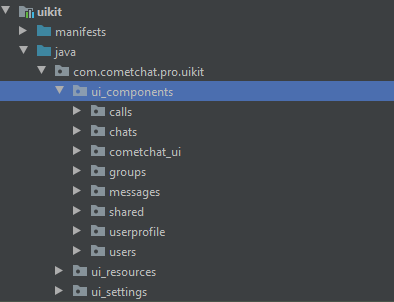

import Tabs from '@theme/Tabs';
import TabItem from '@theme/TabItem';

UI Kit Library is a collection of custom UI Components designed to build text chat and voice/video calling features in your application. It includes three different packages.

## **UI Components**

In Android UI Kit Library it's ui_component package contains list independents packages.

### **CometChat UI**

`ui_components/cometchat_ui` includes a CometChatUI.java file.
Please check below link to learn more about CometChat UI 

`Documentation` [CometChatUI](./ui-components#cometchatui) 

### **Chats**

`ui_components/chats` includes a file which is used to display chat list. 

`Documentation` [CometChatConversationList](./ui-components#cometchatconversationlist)

### **Users**

`ui_components/users` includes a files which are used to display a user list

`Documentation` [CometChatUserList](./ui-components#cometchatuserlist) 

### **Groups**

`ui_components/groups` includes a files which are used to handle group related operations such as Showing Group List, Showing Banned Member List, Showing Group Details.

| Package Name | Description | 
| ---- | ---- | 
| `ui_components/groups/add_members` | It includes files that are used to display "Add Member Screen" and handle certain operations. | 
| `ui_components/groups/admin_moderator_list` | It includes files that are used to display "Admin" or "Moderators" List in group and handle certain operations | 
| `ui_components/groups/banned_members` | It includes files that are used to display "Banned Members" list and handle certain operations | 
| `ui_components/groups/create_group` | It includes file which is used to display "Create Group" Activity/Fragment. Through this user can create groups of their choice. | 
| `ui_components/groups/group_details` | It includes file which is used to launch "Group Details" Activity. It also includes certain opertions such as "Update Group", "Remove Member", "Ban Member", "Leave Group" or "Delete Group" | 
| `ui_components/groups/group_list` | It includes files which is used to show "Group List". `Documentation` [CometChatGroupList](./ui-components#cometchatgrouplist) | 
| `ui_components/groups/group_members` | It includes files that are used to show "Group Members" List in Activity or Fragment. | 

### **Messages**

`ui_components/messages` includes files which are using to handle messages related operations.

| Packages | Description | 
| ---- | ---- | 
| `ui_components/messages/message_list` | It includes files which are used to load 1-1 & group chats. It also the operations such as "edit","delete","forward" and many others.  `Documentation` [CometChatMessageList](./ui-components#cometchatmessagelist) | 
| `ui_components/messages/thread_message_list` | It includes files which are used to load threaded conversation of a messages. It also the operations such as "edit","delete","forward" and many others. | 
| `ui_components/messages/message_information` | It includes file which are used to display message information for group messages only. It show list of members to whom the message is being delivered or read. | 
| `ui_components/messages/message_actions` | It includes file which is used to display options such as "Edit Message","Delete Message", "Message Information", "Start a Thread", "Share Message" & many more in BottomSheetNavigations. It is used in `both message_list` & `thread_message_list` | 
| `ui_components/messages/media_view` | It includes a file which is used to open Image, Video & Audio Message in seperate window when clicked from CometChatMessageList | 
| `ui_components/messages/live_reaction` | It includes a file which are used to handle live reaction that are added in CometChatMessageList. | 
| `ui_components/messages/forward_message` | It includes a file which is used to Forward message to any other conversations. It is been used in CometChatMessageList & CometChatThreadMessageList. | 
| `ui_components/messages/extensions` | It includes a files which are used to handle extensions such as Collaborative Whiteboard, Writeboard, Reactions, etc. | 

### **Calls**

`ui_components/calls` includes the files which are used to handle call related operations. Such as Call Logs, Incoming & Outgoing Call Screens, Listeners ,etc

| Package Name | Description | Descriptions | 
| ---- | ---- | ---- | 
| ui_componets/calls/call_list | It includes files which are used to display calls list  Documentation [CometChatCallList](./ui-components#cometchatcalllist) | 
| ui_components/calls/call_manager | It includes files which are used to handle calls, show incoming & outgoing call screen, join ongoing call. | 

### **User Profile**

`ui_components/user_profile` includes a files which is used to show logged-in user related information. It perform update user operation on logged-in user. It also includes files which display "Block User List"

| Package | Description | 
| ---- | ---- | 
| `ui_components/user_profile/CometChatUserProfile.java` | This file is used to display User Profile. It also perform Update User operations | 
| `ui_components/user_profile/privacy_and_security` | It includes files which is used to display "Block User List" | 

`Documentation` [CometChatUserProfile](./ui-components#cometchatuserprofile) 

### **Shared**

`ui_components/shared` includes a file which has core components that are being used accross UI Kit library.
Please check below link to learn more about "Shared"

`Documentation` [Shared Components](./ui-components#shared)

## **UI Resources**

It includes helper & utils file which are used accross UI Kit library.

:::info Important

This package is important in UI Kit Library. So it needs to be updated

:::

## **UI Settings**

It includes UIKitSettings.java file which is used to modify the uikit features which making any changes at code level.

  

    <a href="./customize-ui-kit">
      <h2>Customize UI Kit</h2>
      <h4>This guide helps you to customize, modify, and enable/disable features present in UIKit.</h4>
    </a>
  

  

    

  

  

:::info Important

This package is important in UI Kit Library. So it needs to be updated

:::