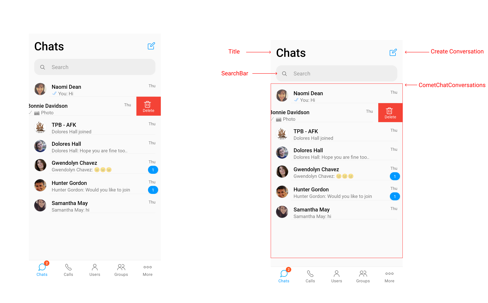

import Tabs from '@theme/Tabs';
import TabItem from '@theme/TabItem';

`ConversationList`is a component that displays lists of recent conversation done by logged-in user. `ConversationList` also handles empty states and loading state if the users has slower internet connection.



Title - It is normal TextView which is used to indicate the purpose of the screen.

CreateConversation - It is option which will help user to intiate conversation with user or a group.

SearchBar - It is TextInputEditText which is used to filter conversation list based on text entered in it. It is handled internally by `ConversationList.`

CometChatConversations - It is custom recyclerview which helps to handle the list of conversations, where each item in the list Conversation and it includes:

- Conversation Name
- Last Message
- Last Message Timestamp
- Read / Delivery Receipt
- Unread Count of particular conversation


Please check [Retrieve List of Conversations](/sdk/android/3.0/messaging-retrieve-conversations#retrieve-list-of-conversations)

## Usage

<Tabs>
<TabItem value="js" label="xml">

```xml
<com.cometchat.pro.uikit.ui_components.chats.ConversationList
    android:id="@+id/cometchatConversationList"
    android:layout_width="match_parent"
    app:createConversation="true"
    app:conversationType="user"
    app:title="Chats"
    app:searchBarCornerRadius="24dp"
    app:searchBarBackgroundColor="@color/red"
    app:searchBarTextColor="@color/blue"
    app:searchBarVisible="true"
    android:layout_height="match_parent" />
```

</TabItem>
</Tabs>

To use `ConversationList`, include it in your XML layout as shown above.

There are various XML attributes that can be used to customize the appearance of the conversation list. The most useful ones include:

- `app:createConversation="true"`: It is used to hide/show create conversation option available in conversation list.
- `app:conversationType="user"`: It is used to set conversation types based on it conversationlist will be filtered.
- `app:title="Chats"`: It is used to set title available in conversation list.
- `app:searchBarCornerRadius="24dp"`: It is used to set radius of search bar available in conversation list.
- `app:searchBarBackgroundColor="@color/red"`: It is used to set background color of search bar available in conversation list.
- `app:searchBarTextColor="@color/blue"`: It is used to set text color of search bar available in conversation list.
- `app:searchBarVisible="true"`: It is used to hide/show search bar available in conversation list.
- `app:listBackgroundColor="@color/grey"`: It is used to set background color of the list shown in conversation list.

## Usage in Java

Users can also make customization using the methods provided by `ConversationList `Below is the list of methods provided by ConversationList to make Customization.

- `setTitleText(String text)`: It is used to set title in conversation list.
- `setTitleHidden(boolean isHidden)`: It is used to hide/show title available in conversation list.
- `setListBackgroundColor(@ColorInt int listBackgroundColor)`: It is used to set background color of the list available in conversation list.
- `setSearchBarBackground(@ColorInt int searchBoxColor)`: It is used to set searchBar background color available in conversation list.
- `setSearchBarVisible(boolean searchBoxVisible)`: It is used to hide/show search bar available in conversation list.
- `setSearchBoxRadius(float searchBoxRadius)`: It is used to set corner radius of search bar available in conversation list.
- `setSearchTextColor(@ColorInt int color)`: It is used to set text color of search bar available in conversation list.

## Handle Actions

`ConversationList `provides various events for actions performed on each item of conversation list. Below is code snippet of actions which are handled by `ConversationList`.

<Tabs>
<TabItem value="js" label="java">

```Java
conversationListObj.setItemClickListener(
new ConversationList.OnConversationClickListener<Conversation>(){
@Override
public void OnItemClick(Conversation var, int position) {

}

@Override
public void onDeleteItemClick(Conversation conversation, int position) {

}

@Override
public void OnItemLongClick(Conversation var, int position) {

}
});
```

</TabItem>
</Tabs>


- `OnItemClick(Conversation var,int position)` : This method gets triggered whenever user perform single click on any item of ConversationList.
- `OnDeleteItemClick(Conversation var,int position)` : This method gets triggered whenever user swipe and click on "Delete" option on any item of ConversationList.
- `OnItemLongClick(Conversation var,int position)` : This method gets triggered whenever user perform long click on any item of ConversationList.

