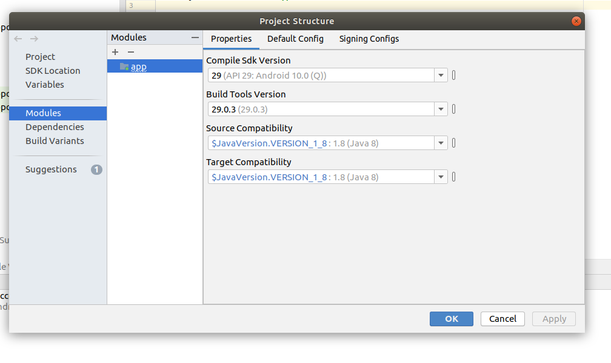
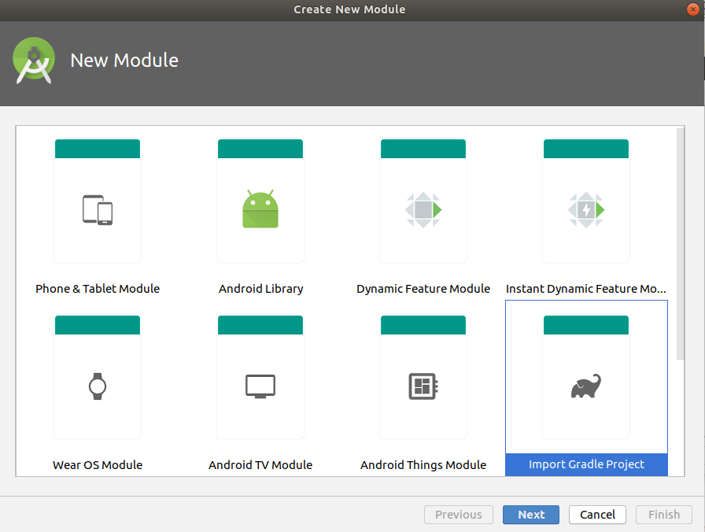
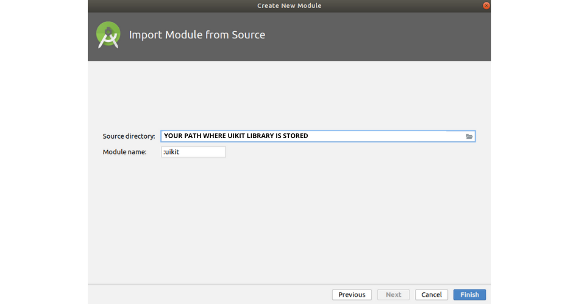
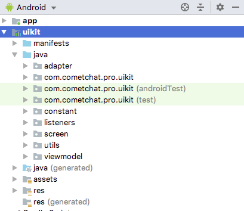

import Tabs from '@theme/Tabs';
import TabItem from '@theme/TabItem';


To add UI Kit module developer will need to follow the three basic steps.

Step 1- Download [UI Kit](https://github.com/cometchat-pro/ui-kit/android)  library from Github

Step 2- To add **uikit** module developer needs to follow few steps:

      a. Right-click on **an app** and go to **Open Module Settings**



   b. Click on **+** and select **Import Gradle Project** from Create New Module Window and click **Next**.



c. After that developer has to enter the path of **uikit** which he/she has downloaded and click on **Finish**.



Step 3- After following these steps **uikit** is successfully added in the project. Now to integrate the **uikit** in project developer can either copy and paste the following in (app level) `build.gradle`.

<Tabs>
<TabItem value="js" label="build.gradle (app level)">

```build.gradle (app level)
implementation project(path: ':uikit')
```

</TabItem>
</Tabs>

If the Library is added successfully, it will look like mentioned in the below image.



_**Next Steps**  [Configure UI Ki](./overview#configure-android-java-ui-kit-library)t_

