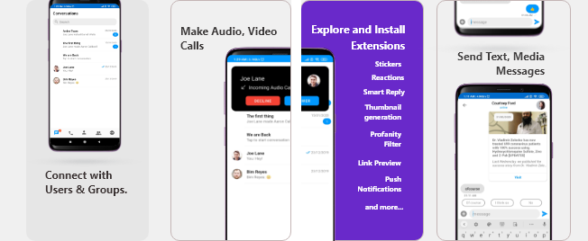
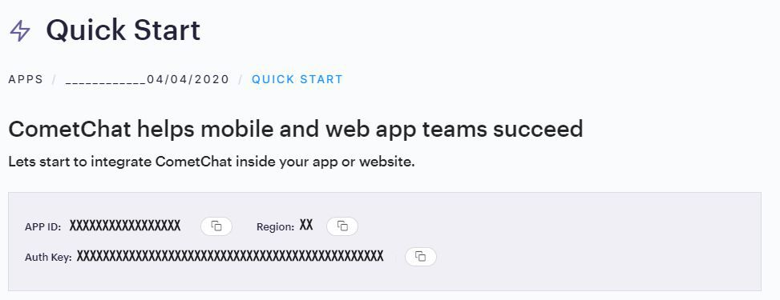
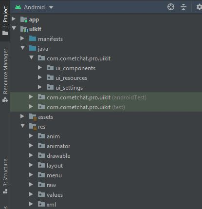
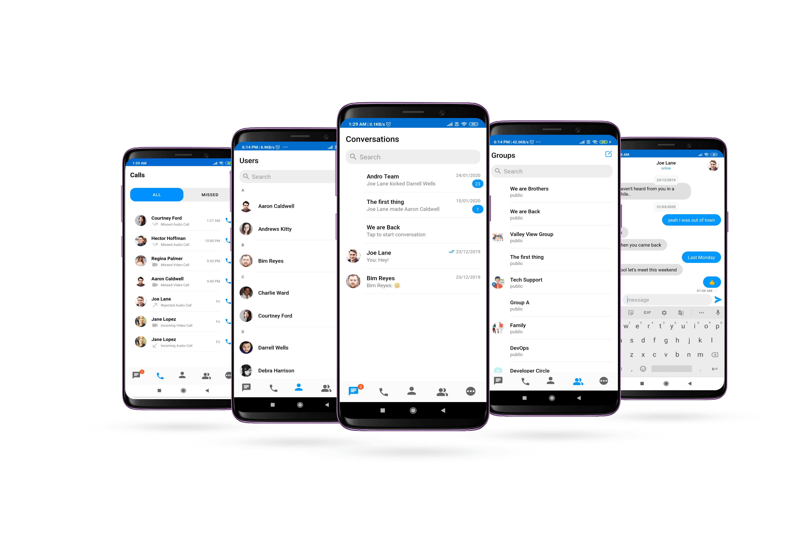

import Tabs from '@theme/Tabs';
import TabItem from '@theme/TabItem';

:::info Reference for Kotlin UI Kit.

Check out our Kotlin UI Kit [here](/ui-kit/kotlin/customize-ui-kit).

:::

The CometChat Android Java UI Kit lets developers integrate text chat & voice/video calling features into Android apps seamlessly.



:::success 👍 Improvements in v3.0

- Faster connection & response times <br/>
- Higher rate limits <br/>
- Supports up to 100K users in a group <br/>
- Unlimited groups <br/>
- Support for Transient Messages <br/>
- Real-time user & group members count <br/>

:::

The Android Java UI Kit’s fully customizable UI components simplify the process of integrating text chat and voice/video calling features to your website or mobile application in a few minutes.

<div style={{display: 'flex', boxShadow: '0 0 4px 0 rgb(0 0 0 / 18%)', borderRadius: '3px'}}>
  <div style={{padding: '24px'}}>
    <h4 style={{fontWeight: 'bold'}}>**I want to checkout Android Java UI Kit.**</h4>
    <p>Follow the steps mentioned in the <code>README.md</code> file.</p>
    <p>Kindly, click on below button to download our Android Java Chat UI Kit.</p>
    <a style={{display: 'inline-block', backgroundColor: '#7c55c9', padding: '8px', textAlign: 'center', textTransform: 'uppercase', border: '1px solid #e3e5e7', borderRadius: '3px', color: 'white', width: '100%', marginBottom: '8px'}} href="https://github.com/cometchat-pro/android-java-chat-ui-kit/archive/v3.zip">Java Chat UI Kit</a>
    <a style={{display: 'inline-block', backgroundColor: '#7c55c9', padding: '8px', textAlign: 'center', textTransform: 'uppercase', border: '1px solid #e3e5e7', borderRadius: '3px', color: 'white', width: '100%'}} href="https://github.com/cometchat/cometchat-chat-uikit-android-java/tree/v3" target="_blank">View on Github</a>

<br/><br/>

## I want to integrate UI Kit with my App

- [UI Components](./android-java-ui-components)
- [Customize UI Kit](./android-customize-ui-kit)
</div>
  <div style={{padding: '24px', borderLeft: '1px solid #e3e5e7'}}>
    <h4 style={{fontWeight: 'bold'}}>**I want to explore sample apps.**</h4>
    <p>Import the app into Android Studio and follow the steps mentioned in the <code>README.md</code> file.</p>
    <p>Kindly, click on below button to download our Java Sample App.</p>
    <a style={{display: 'inline-block', backgroundColor: '#7c55c9', padding: '8px', textAlign: 'center', textTransform: 'uppercase', border: '1px solid #e3e5e7', borderRadius: '3px', color: 'white', width: '100%', marginBottom: '8px'}} href="https://github.com/cometchat-pro-samples/android-java-chat-app/archive/v3.zip">Java Sample App</a>
    <a style={{display: 'inline-block', backgroundColor: '#7c55c9', padding: '8px', textAlign: 'center', textTransform: 'uppercase', border: '1px solid #e3e5e7', borderRadius: '3px', color: 'white', width: '100%'}} href="https://github.com/cometchat/cometchat-chat-sample-app-android-java/tree/v3" target="_blank">View on Github</a>
  </div>
</div>

### Prerequisites ⭐

Before you begin, ensure you have met the following requirements:

✅ You have `Android Studio` installed in your machine.

✅ You have a `Android Device or Emulator` with Android Version 6.0 or above.

✅ You have read [CometChat Key Concepts](./key-concepts).

## Installing Android Java Chat UI Kit

### Setup 🔧

To setup Android Java Chat UI Kit, you need to first register on CometChat Dashboard. [Click here to sign up](https://app.cometchat.com/login).

#### Get your Application Keys 🔑

1. Create a new app: Click **Add App** option available → Enter App Name & other information → Create App
2. You will find `APP_ID`, `AUTH_KEY` and `REGION` key at the top in **QuickStart** section or else go to "API & Auth Keys" section and copy the `APP_ID`, `API_KEY` and `REGION` key from the "Auth Only API Key" tab.



#### Add the CometChat Dependency

**Step 1 -** Add the repository URL to the **project level**`build.gradle` file in the repositories block under the `allprojects` section.

<Tabs>
<TabItem value="js" label="build.gradle">

```build.gradle(project level)
allprojects {
  repositories {
    maven {
      url "https://dl.cloudsmith.io/public/cometchat/cometchat-pro-android/maven/"
    }
  }
}
```

</TabItem>
</Tabs>

**Step 2-** Open the **app level**`build.gradle` file and follow below

1. Add the below line in the dependencies section.

<Tabs>
<TabItem value="js" label="build.gradle">

```build.gradle(app level)
dependencies {
  implementation 'com.cometchat:pro-android-chat-sdk:3.0.1'

	/*v2.4+ onwards, Voice & Video Calling functionality has been
  moved to a separate library. In case you plan to use the calling feature,
  please add the Calling dependency*/
	implementation 'com.cometchat:pro-android-calls-sdk:2.1.1'
}
```

</TabItem>
</Tabs>

2. Add the below lines android section

<Tabs>
<TabItem value="js" label="build.gradle">

```build.gradle(app level)
android {
  compileOptions {
    sourceCompatibility JavaVersion.VERSION_1_8
    targetCompatibility JavaVersion.VERSION_1_8
  }
}
```

</TabItem>
</Tabs>

You can refer to the below link for instructions on how to do so:

**[📝 Add CometChat Dependency](/sdk/android/setup)** `Documentation`

---

### Configure CometChat SDK

#### Initialize CometChat 🌟

The `init()` method initializes the settings required for CometChat. Please make sure to call this method before calling any other methods from CometChat SDK.

<Tabs>
<TabItem value="js" label="java">

```Java
String appID = "APP_ID"; // Replace with your App ID
String region = "REGION"; // Replace with your App Region ("eu" or "us")
String authKey = "AUTH_KEY"; //Replace with your Auth Key.

AppSettings appSettings=new AppSettings.AppSettingsBuilder().subscribePresenceForAllUsers().setRegion(region).build();

CometChat.init(this, appID,appSettings, new CometChat.CallbackListener<String>() {
  @Override
  public void onSuccess(String successMessage) {
    UIKitSettings.setAuthKey(authKey);
    CometChat.setSource("ui-kit","android","java");
    Log.d(TAG, "Initialization completed successfully");
  }
  @Override
  public void onError(CometChatException e) {
    Log.d(TAG, "Initialization failed with exception: " + e.getMessage());
  }
});
```

</TabItem>
</Tabs>

`Tip` UIKitSettings.setAuthKey(String authKey) is used to pass the Auth Key to uiKit library.

:::info Note
Make sure to replace `region` and `appID` with your credentials in the above code snippet.
:::

#### Login User 👤

Once you have created the user successfully, you will need to log the user into CometChat using the login() method.

<Tabs>
<TabItem value="js" label="java">

```Java
String UID = "user1"; // Replace with the UID of the user to login
        String authKey = "AUTH_KEY"; // Replace with your App Auth Key

        if (CometChat.getLoggedInUser() == null) {
        CometChat.login(UID, authKey, new CometChat.CallbackListener<User>() {

@Override
public void onSuccess(User user) {
        Log.d(TAG, "Login Successful : " + user.toString());
        }

@Override
public void onError(CometChatException e) {
        Log.d(TAG, "Login failed with exception: " + e.getMessage());
        }
        });
        } else {
        // User already logged in
        }
```

</TabItem>
</Tabs>

:::info Note

- The `login()` method needs to be called only once.
- Replace `AUTH_KEY` with your App Auth Key in the above code snippet.

:::

---

📝 Please refer to our **[SDK Documentation](/sdk/android/overview)** for more information on how to configure the CometChat Pro SDK and implement various features using the same.

### Add Android Java UI Kit Library

To integrate the Android Java UI Kit, please follow the steps below:

- Clone the UI Kit Library from the [android-chat-ui-kit repository](https://github.com/cometchat-pro/android-java-chat-ui-kit) or

<a style={{display: 'inline-block', backgroundColor: '#7c55c9', padding: '8px', textAlign: 'center', textTransform: 'uppercase', border: '1px solid #e3e5e7', borderRadius: '3px', color: 'white', width: '100%', marginBottom: '8px'}} href="https://github.com/cometchat-pro/android-java-chat-ui-kit/archive/v3.zip">Java Download UI Kit Library</a>

- Import `uikit` Module from Module Settings.(Click **[here](./how-to-add-uikit-module)** to know how to import `uikit` as Module)
- If the Library is added sucessfully, it will look like mentioned in the below image.



### Configure Android Java UI Kit Library

To use UI Kit you have to add Material Design support in your app as the UI Kit uses Material Design Components.

- Add Material Design Dependency in build.gradle

<Tabs>
<TabItem value="js" label="build.gradle">

```build.gradle(app level)
dependencies {
  implementation 'com.google.android.material:material:<version>'
}
```

</TabItem>
</Tabs>

- Make sure that your app's theme should extend `Theme.MaterialComponents`. Follow the guide on [Getting started Material Components](https://material.io/develop/android/docs/getting-started/)

The following is the list of Material Components themes you can use to get the latest component styles and theme-level attributes.

- `Theme.MaterialComponents.NoActionBar`
- Theme.MaterialComponents.Light.NoActionBar
- Theme.MaterialComponents.DayNight.NoActionBar

Update your app theme to inherit from one of these themes, e.g.:

<Tabs>
<TabItem value="js" label="xml">

```xml
<style name="AppTheme" parent="Theme.MaterialComponents.Light.NoActionBar.Bridge">

	    <!-- Customize your theme here. -->
</style>
```

</TabItem>
</Tabs>

:::note Enable DataBinding

As the UI Kit uses DataBinding you must enable DataBinding

:::

To configure your app to use data binding, add the dataBinding element to your `build.gradle` file in the app module, as shown in the following example:

<Tabs>
<TabItem value="js" label="build.gradle">

```build.gradle(app level)
android {
    dataBinding {
        enabled = true
    }
}
```

</TabItem>
</Tabs>

Open the `gradle.properties` and check if the below stated line is present or not, if not then simply add it.

<Tabs>
<TabItem value="js" label="gradle.properties">

```gradle.properties
android.enableJetifier=true
```

</TabItem>
</Tabs>

:::warning

> We are using File Provider for storage & file access. So you need to add your application package name in manifestPlaceholders

:::

<Tabs>
<TabItem value="js" label="build.gradle">

```build.gradle(app level)
android {
		defaultConfig {
			...

			manifestPlaceholders = [file_provider: "YOUR_PACKAGE_NAME"]
			//add your application package.
		}
	}
```

</TabItem>
</Tabs>

### Launch CometChat UI



**CometChatUI** is a way to launch a fully working chat application using the UI Kit .In UI Unified all the UI Screens and UI Components working together to give the full experience of a chat application with minimal coding effort.\*

To use CometChatUI user has to launch `CometChatUI` class. Add the following code snippet to launch `CometChatUI`.

<Tabs>
<TabItem value="js" label="java">

```Java
startActivity(new Intent(YourActivity.this,CometChatUI.class))
```

</TabItem>
</Tabs>

---

## [Checkout our Android Java sample app](https://github.com/cometchat-pro/android-java-chat-app/tree/v3)

Visit our [Java sample app ](https://github.com/cometchat-pro/android-java-chat-app/tree/v3)repository to run the Android Java sample app.
