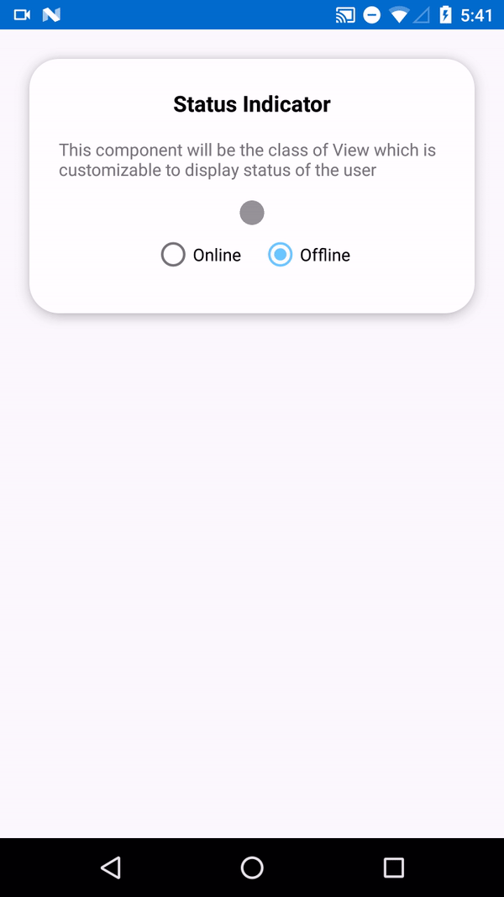

import Tabs from '@theme/Tabs';
import TabItem from '@theme/TabItem';

**UI Components** are building a block of the UI Kit. **UI Components** are a set of custom classes specially designed to build a feature-rich chat app.  To achieve high customizability while building an app one can use the UI Components. There are different UI Components available in the UI Kit library.

## CometChatUI

**CometChatUI**  is an option to launch a fully functional chat application using the UI Kit. In **CometChatUI** all the UI Components are interlinked and work together to launch a fully functional chat on your mobile application.


CometChatUI is an Activity class, so you can launch `CometChatUI`  using the below code snippet   Make sure to add the following code snippet after `onSuccess` of CometChat login.

<Tabs>
<TabItem value="java" label="Java">

```java
startActivity(new Intent(this, CometChatUI.java))   //Replace "this" with Activity Ex: MainActivity.this
```

</TabItem>
</Tabs>

:::info

 Make sure that the above code snippet is added after `onSuccess` of CometChat login.

:::

---

## CometChatConversationList

The **CometChatConversationList** is Fragment which will help you to display list of recent conversations. The Fragment has all the necessary listeners and methods required to display the list of conversations.

### Usage

In your `layout.xml` add the following snippet to use the `CometChatConversationListScreen`.Adding the following code snippet will give you a fully working list of conversations.

<Tabs>
<TabItem value="xml" label="XML">

```xml
<fragment
android:id="@+id/conversationList"
        android:layout_width="match_parent"
        android:layout_height="match_parent"
class=" com.cometchat.pro.uikit.
        ui_components.chats.CometChatConversationList "
        />
```

</TabItem>
</Tabs>


:::info Note About setItemClickListener on CometChatConversationList

To get click event of the list you must use `setItemClickListener` . The `setItemClickListener` has `OnItemClick()` on handle single click and `OnItemClick` to handle long click events.

:::

<Tabs>
<TabItem value="js" label="Java">

```Java
CometChatConversationList.setItemClickListener(new OnItemClickListener<Conversation>()
        {
@Override
public void OnItemClick(Conversation conversation, int position) {
        //Perform Your Action
        }

@Override
public void OnItemLongClick(Conversation var, int position) {
        super.OnItemLongClick(var, position);
        }
        });
```

</TabItem>
</Tabs>


## CometChatUserList

The `CometChatUserList` is a fragment with a List of users. The Fragment has all the necessary listeners and methods required to display the user's list.

### Usage

In your `layout.xml` add the following snippet to use the `CometChatUserList`. Adding the following code snippet will give you a fully working list of users.

<Tabs>
<TabItem value="xml" label="XML">

```xml
<fragment
android:id="@+id/userList"
        android:layout_width="match_parent"
        android:layout_height="match_parent"
class="com.cometchat.pro.uikit
        .ui_components.users.user_list.CometChatUserList"
        />
```

</TabItem>
</Tabs>


:::info Note About setItemClickListener on CometChatUserList

To get click event of the list you must use `setItemClickListener`. The `setItemClickListener` has `OnItemClick()` on handle single click and `OnItemClick` to handle long click events.

:::

<Tabs>
<TabItem value="js" label="Java">

```Java
CometChatUserList.setItemClickListener(new OnItemClickListener<User>()
        {
@Override
public void OnItemClick(User user, int position) {
        //Perform Your Action
        }

@Override
public void OnItemLongClick(User var, int position) {
        super.OnItemLongClick(var, position);
        }
        });
```

</TabItem>
</Tabs>


## CometChatGroupList

The `CometChatGroupList` is a fragment with a List of groups Fragment has all the necessary listeners and methods required to display the list of groups

### Usage

In your `layout.xml` add the following snippet to use the `CometChatGroupList`.Adding the following code snippet will give you a full working list of groups.

<Tabs>
<TabItem value="xml" label="XML">

```XML
<fragment
android:id="@+id/groupList"
        android:layout_width="match_parent"
        android:layout_height="match_parent"
class="com.cometchat.pro.uikit
        .ui_components.groups.group_list.CometChatGroupList"
        />
```

</TabItem>
</Tabs>


:::info Note About setItemClickListener on CometChatGroupList

To get click event of the list you must use `setItemClickListener`. The `setItemClickListener` has `OnItemClick()` on handle single click and `OnItemClick` to handle long click events.

:::


<Tabs>
<TabItem value="js" label="Java">

```Java
CometChatGroupList.setItemClickListener(new OnItemClickListener<Group>()
        {
@Override
public void OnItemClick(Group group, int position) {
        //Perform your action
        }

@Override
public void OnItemLongClick(Group var, int position) {
        super.OnItemLongClick(var, position);
        }
        });
```

</TabItem>
</Tabs>


## CometChatMessageList

`CometChatMessageList` is a fragment that consists of send and received messages. It is capable of sending and receiving different types of messages such as text, image, and documents.

### Usage

To use `CometChatMessageList` follow the below code snippets. `CometChatMessageList` is a dynamic so it will require some arguments. Launch CometChatChatMessageListActivity using below code and pass the required parameters in intent.

<Tabs>
<TabItem value="js" label="Java">

```Java
Intent intent = new Intent(YOURACTIVITY.this, CometChatMessageListActivity.class);
        intent.putExtra(UIKitConstants.IntentStrings.UID, user.getUid());
        intent.putExtra(UIKitConstants.IntentStrings.AVATAR, user.getAvatar());
        intent.putExtra(UIKitConstants.IntentStrings.STATUS, user.getStatus());
        intent.putExtra(UIKitConstants.IntentStrings.NAME, user.getName());
        intent.putExtra(UIKitConstants.IntentStrings.LINK,user.getLink());
        intent.putExtra(UIKitConstants.IntentStrings.TYPE, CometChatConstants.RECEIVER_TYPE_USER);
        startActivity(intent);
```

</TabItem>
</Tabs>


## CometChatCallList

You can use the CometChatCallList to get a list of all the calls made by the logged-in user to other users and groups.

### Usage

Add the following code in your  `layout.xml`

<Tabs>
<TabItem value="xml" label="XML">

```XML
<fragment
android:id="@+id/groupList"
        android:layout_width="match_parent"
        android:layout_height="match_parent"
class="com.cometchat.pro.uikit
        .ui_components.groups.group_list.CometChatGroupList"
        />
```

</TabItem>
</Tabs>


## CometChatUserProfile

`CometChatUserProfile` is a fragment which provides detail about the currently logged-in user in the CometChat.

### Usage

Add the following code in your  `layout.xml`

<Tabs>
<TabItem value="xml" label="XML">

```XML
<fragment
android:id="@+id/userInfo"
        android:layout_width="match_parent"
        android:layout_height="match_parent"
class="com.cometchat.pro.uikit
        .ui_components.userprofile.CometChatUserProfile"
        />
```

</TabItem>
</Tabs>


## Shared

There are certain core components that are being used everywhere in `uiKit` library. You will find those components in `shared` folder under `ui_components`. Below are core components that are being used in `uiKit` library.

### CometChatAvatar

This is an image view customize only to display Avatar. This view can be used with image URLs as well as with CometChat objects like User and Group


#### Usage

In your `layout.xml` add the following code snippet.

<Tabs>
<TabItem value="js" label="xml">

```xml
<com.cometchat.pro.uikit.ui_components.shared.cometchatAvatar.CometChatAvatar
    android:id="@+id/av_user"
    android:layout_width="60dp"
    app:avatar_shape="@string/circle"
    android:layout_height="60dp" />
```

</TabItem>
</Tabs>


Here  `avatar_shape`  is a static property. It should be either `circle` or `rectangle`. whereas the avatar URL needs to be set dynamically following is the sample code for the same.

<Tabs>
<TabItem value="js" label="Java">

```Java
CometChatAvatar avatar = findViewById(R.id.av_user);
        avatar.setAvatarUrl("https://randomuser.me/api/portraits/women/44.jpg");
```

</TabItem>
</Tabs>


The CometChatAvatar Component works well with CometChat `User` and `Group` object. The `setAvatar()` method accepts `User` or `Group` object if Avatar of `User` or `Group` is not available it automatically show the initials of the user or group name as a placeholder Avatar.


## Common Features

CometChatAvatar class provides functionality for an Avatar feature. There are commonly used properties to control the look of the Avatar.


| CometChatAvatar field element | Relevant attributes/methods | 
| ---- | ---- | 
| Avatar Shape | `app:avatar_shape` | 
| Avatar | app:avatar<br />**Method**<br />- setAvatar(@NonNull User)<br />- setAvatar(@NonNull Group)<br />- setAvatar(@NonNull String)<br />- setAvatar(@NonNull Drawable, @NonNull String) | 
| Avatar Initial | app:avatar_initials<br />**Method**<br />- setInitials(@NonNull String) | 
| Border Color | `app:border_color` | 
| Border Width | `app:border_width` | 


### CometChatUserPresence

This view will be used to show the user status if the user is online or offline. This view will take user status and display the color accordingly.



#### Usage

In your `layout.xml` add the following code

<Tabs>
<TabItem value="js" label="xml">

```xml
<com.cometchat.pro.uikit.ui_components.shared.cometchatUserPresence.CometChatUserPresence
    android:id="@+id/statusIndicator"
    android:layout_width="15dp"
    android:layout_height="15dp"
    app:user_status="@string/offline"
/>
```

</TabItem>
</Tabs>


User status can be set dynamically using the following code.

<Tabs>
<TabItem value="js" label="Java">

```Java
CometChatUserPresence userPresence = findViewById(R.id.statusIndicator);
        userPresence.setUserStatus(user.getStatus());
```

</TabItem>
</Tabs>


#### Common Features

CometChatUserPresence provides `app:user_status` attribute and method `setUserStatus` to set Status of the user.

The `app:user_status` attribute can also be used with DataBinding in the following manner

e.g  `app:user_status="@{user.status}"`   you can also use different objects according to their use case. The attribute will continue to work as long as receives a string parameter

| CometChatUserPresence field element | Relevant attributes/methods | 
| ---- | ---- | 
| User Status | `app:user_status <br /><br />**Method** - setUserStatus(@NonNull String)` | 


---

### CometChatBadgeCount

The CometChatBadgeCount component can be used to show an unread count. You can use it in different scenarios according to their use case.


#### Usage

Add the following code to your `layout.xml`

<Tabs>
<TabItem value="xml" label="XML">

```XML
<com.cometchat.pro.uikit.ui_components.shared.cometchatBadgeCount.CometChatBadgeCount
        android:id="@+id/messageCount"
        android:layout_width="wrap_content"
        app:count="2"
        android:layout_height="wrap_content"/>
```

</TabItem>
</Tabs>


The count can be set dynamically using the `setCount` method. The `setCount` method takes an int as a parameter.

<Tabs>
<TabItem value="js" label="Java">

```Java
CometChatBadgeCount badgeCount = findViewById(R.id.badgecount);
        badgeCount.messageCount.setCount(conversation.getUnreadMessageCount());
```

</TabItem>
</Tabs>


#### Common Feature

The CometChatBadgeCount component provides different attributes and methods to control the behavior and appearance of the BadgeCount view.

The attribute `app: count` can also be used with DataBinding

<Tabs>
<TabItem value="js" label="xml">

```xml
/// example with conversation object

<com.cometchat.pro.uikit.ui_components.shared.cometchatBadgeCount.CometChatBadgeCount
    android:id="@+id/messageCount"
    android:layout_width="wrap_content"
    app:count="@{conversation.unreadMessageCount}"
    android:layout_height="wrap_content"/>
```

</TabItem>
</Tabs>


| CometChatBadgeCount field element | Relevant attributes/methods | 
| ---- | ---- | 
| Count | app:count<br />**Method**<br />- setCount(int) | 
| Count Size | app:count_size<br />**Method**<br />- setCountSize(float) | 
| Count Background Color | app:count_background_color<br />**Method** - setCountBackground(@ColorRes color) | 
| Count Color | app:count_color<br />**Method**<br />- setCountSize(float) | 


---

### CometChatUsers

The `CometChatUsers` is custom **RecyclerView** which helps to display a list of users present in your CometChat app.


:::info Note about CometChatUsers using with DataBinding:
Your project should have DataBinding enabled. You can use `CometChatUsers` using DataBinding in the following manner
:::

In your `layout.xml`  add the following code :

<Tabs>
<TabItem value="js" label="xml">

```xml
<data>
    <import type="androidx.recyclerview.widget.LinearLayoutManager"/>
    <import type="androidx.databinding.ObservableList"/>
    <import type="com.cometchat.pro.models.User"/>

    <variable
        name="userList"
        type="ObservableList&lt;User&gt;" />

</data>

<com.cometchat.pro.uikit.ui_components.shared.cometchatUsers.CometChatUsers
android:id="@+id/cometchatUsers"
android:layout_width="match_parent"
app:userlist="@{userList}"
app:layoutManager="androidx.recyclerview.widget.LinearLayoutManager"
android:layout_height="match_parent" />
```

</TabItem>
</Tabs>


In your corresponding activity or fragment  add the following code

<Tabs>
<TabItem value="js" label="Java">

```Java
ObservableArrayList<User> userList=new ObservableArrayList<>();
        binding.setUserList(userList);
```

</TabItem>
</Tabs>


For getting the list of users you can use `UsersRequestBuilder()`. Visit the below link for more details on how to retrieve a list of users.

`Documentation`<br/>
[**Retrive groups** Learn how to fetch various types of  groups.](/sdk/android/3.0/groups-retrieve-groups)<br/>
[**Retrive Users -** Learn how to fetch various types of  users.](/sdk/android/3.0/users-retrieve-users)

In `onSuccess` of the `fetchNext` method you can set the data the `ObservableArrayList` you have created. The advantage of using the `ObservableArrayList` is one doesn't have to manually set the data on `binding.setUserList(userList);`   every time you get a new set of data.

<Tabs>
<TabItem value="js" label="Java">

```Java
usersRequest.fetchNext(new CometChat.CallbackListener<List<User>>() {
@Override
public void onSuccess(List <User> list) {
        Log.d(TAG, "User list received: " + list.size());
        userList.addAll(list);
        //update the ObservableArrayList here 
        }
@Override
public void onError(CometChatException e) {
        Log.d(TAG, "User list fetching failed with exception: " + e.getMessage());
        }
        });
```

</TabItem>
</Tabs>


:::info Note About CometChatUsers Without DataBinding

If you are not using DataBinding in your project you can use the `CometChatUsers` in the following manner.

:::

In your `layout.xml`  add the following code

<Tabs>
<TabItem value="js" label="xml">

```xml
<com.cometchat.pro.uikit.ui_components.shared.cometchatUsers.CometChatUsers
    android:id="@+id/cometchatUsers"
    android:layout_width="match_parent"
    app:layoutManager="androidx.recyclerview.widget.LinearLayoutManager"
    android:layout_height="match_parent" />
```

</TabItem>
</Tabs>


In your corresponding activity or fragment.

<Tabs>
<TabItem value="js" label="Java">

```Java
CometChatUsers cometChatUsers=findViewById(R.id.cometchatUsers);
        cometChatUsers.setUserList(list);
// list: fetched using the UsersRequestBuilder
// list: fetched using the UsersRequestBuilder
```

</TabItem>
</Tabs>


To get the list of users you can use UsersRequestBuilder(). Visit the link below for more details on [Retrieve Users](/sdk/android/3.0/messaging-retrieve-conversations#retrieve-list-of-conversations)

:::info Note About Using setItemClickListener

For getting the click event of CometChatUsers you can make use of setItemClickListener class.

:::

<Tabs>
<TabItem value="js" label="Java">

```Java
cometChatUsers.setItemClickListener(new OnItemClickListener<User>() {

@Override
public void OnItemClick(User var, int position) {

        }

@Override
public void OnItemLongClick(User var, int position) {
        super.OnItemLongClick(var, position);
        }
        });
```

</TabItem>
</Tabs>


#### Common Usage

The `CometChatUsers` component provides different properties to control the behavior of
`CometChatUsers` view.

| CometChatUsers field elements | Relevant attributes/methods | 
| ---- | ---- | 
| Update List | `- setUserList(List<User>)` | 
| Update | `- update (User)` | 
| Remove | `- remove(String)` | 
| Add | `- add(User)` | 


---

### CometChatGroups

The `CometChatGroups` is a custom **RecyclerView** that helps you to display a list of groups.


:::info Note About CometChatGroups Using With DataBinding
If you are using DataBinding in your project you can use the CometChatGroups in the following manner.
:::


In your `layout.xml`  add the following code snippet

<Tabs>
<TabItem value="js" label="xml">

```xml
<data>

    <import type="androidx.recyclerview.widget.LinearLayoutManager"/>
    <import type="androidx.databinding.ObservableList"/>
    <import type="com.cometchat.pro.models.Group"/>

    <variable
        name="groupList"
        type="ObservableList&lt;Group&gt;" />

</data>

<com.cometchat.pro.uikit.ui_components.shared.cometchatGroups.CometChatGroups
android:id="@+id/cometchatGroupList"
android:layout_width="match_parent"
app:grouplist="@{groupList}"
app:layoutManager="androidx.recyclerview.widget.LinearLayoutManager"
android:layout_height="match_parent" />
```

</TabItem>
</Tabs>


In your corresponding activity or fragment .

<Tabs>
<TabItem value="js" label="Java">

```Java
ObservableArrayList<Group> groupList=new ObservableArrayList<>();
        binding.setGroupList(groupList);
```

</TabItem>
</Tabs>


For getting the list of groups you can use `GroupsRequestBuilder()`.Visit the below link for more details on how to retrieve a list of group.

**Documentation**  [**Retrive Groups -**_Learn how to fetch various types of groups._](/sdk/android/retrieve-groups)

In `onSuccess` of the `fetchNext` method you can set the data the `ObservableArrayList` you have created. The advantage of using the `ObservableArrayList` is one doesn't have to manually set the data on `binding.setGroupList(groupList);`   every time you get a new set of data.

<Tabs>
<TabItem value="js" label="Java">

```Java
groupsRequest.fetchNext(new CometChat.CallbackListener<List<Group>>() {
@Override
public void onSuccess(List <Group> list) {
        Log.d(TAG, "Groups list fetched successfully: " + list.size());
        groupList.addAll(list);
        // update the ObservableArrayList here

        }
@Override
public void onError(CometChatException e) {
        Log.d(TAG, "Groups list fetching failed with exception: " + e.getMessage());
        }
        });
```

</TabItem>
</Tabs>


:::info Note About CometChatGroups Without DataBinding
If you are not using DataBinding in your project you can use the `CometChatGroups` in the following manner.
:::

In your `layout.xml`  add the following code

<Tabs>
<TabItem value="js" label="xml">

```xml
<com.cometchat.pro.uikit.ui_components.shared.cometchatGroups.CometChatGroups
        android:id="@+id/cometchatGroups"
        android:layout_width="match_parent"
        app:layoutManager="androidx.recyclerview.widget.LinearLayoutManager"
        android:layout_height="match_parent" />
```

</TabItem>
</Tabs>


In your corresponding activity or fragment

<Tabs>
<TabItem value="js" label="Java">

```Java
CometChatGroups cometChatGroups = findViewById(R.id.cometchatGroups);
        cometChatGroups.setGroupList(list);
// list: fetched using the GroupsRequestBuilder
```

</TabItem>
</Tabs>


You can refer to how to [Retrieve Groups](/sdk/android/retrieve-groups).

:::info Note About Using setItemClickListener
For getting the click event of `CometChatGroupList` you can make use of `setItemClickListener` class.
:::


<Tabs>
<TabItem value="js" label="Java">

```Java
cometChatGroups.setItemClickListener(new OnItemClickListener<Group>() {
@Override
public void OnItemClick(Group var, int position) {

        }

@Override
public void OnItemLongClick(Group var, int position) {
        super.OnItemLongClick(var, position);
        }
        });
```

</TabItem>
</Tabs>


#### Common Usage

The `CometChatGroupList` component provides different properties to control the behavior of
`CometChatGroupList` view. You can perform different operations like an update, remove, add, etc.

| CometChatGroups field elements | Relevant attributes/methods | 
| ---- | ---- | 
| Update List | `- setGroupList(List<Group>)` | 
| Update | `- update (Group)` | 
| Remove | `- remove(String)` | 
| Add | `- add(Group)` | 


---

### CometChatConversations

`CometChatConversations` is a custom **RecyclerView** which will help you to display a list of all the users and groups in which the logged-in user has made any conversation.


:::info Note about CometChatConversations using with DataBinding
If you are using DataBinding in your project you can use the `CometChatConversations` in the following manner.
:::


In your `layout.xml`  add the following code.

<Tabs>
<TabItem value="js" label="xml">

```xml
<data>

        <import type="androidx.recyclerview.widget.LinearLayoutManager"/>
        <import type="androidx.databinding.ObservableList"/>
        <import type="com.cometchat.pro.models.Conversation"/>

<variable
                name="conversationList"
                        type="ObservableList&lt;Conversation&gt;" />

</data>

<com.cometchat.pro.uikit.ui_components.shared.cometchatConversations.CometChatConversations
        android:id="@+id/cometchatConversationList"
        android:layout_width="match_parent"
        app:conversationlist="@{conversationList}"
        app:layoutManager="androidx.recyclerview.widget.LinearLayoutManager"
        android:layout_height="match_parent" />
```

</TabItem>
</Tabs>


In your corresponding activity or fragment.


<Tabs>
<TabItem value="js" label="Java">

```Java
ObservableArrayList<Conversation> conversationList=new ObservableArrayList<>();
        binding.setConversationList(conversationList);
```

</TabItem>
</Tabs>


For getting the list of conversation you can use `ConversationsRequestBuilder()` .Visit the below link for more details on how to retrieve a list of conversation

**Documentation** [**Retrive Conversations -**_Learn how to build a recent chats list using conversations._](/sdk/android/retrieve-conversations)

In `onSuccess` of the `fetchNext` method you can set the data the `ObservableArrayList` you have created. The advantage of using the `ObservableArrayList` is one doesn't have to manually set the data on `binding.setConversationList(conversationList);` every time you get a new set of data.

<Tabs>
<TabItem value="js" label="Java">

```Java
conversationsRequest.fetchNext(new CometChat.CallbackListener<List<Conversation>>() {
@Override
public void onSuccess(List<Conversation> conversations) {
        // Handle list of conversations
        conversationList.addAll(conversations);
        // update ObservableArrayList list here
        }

@Override
public void onError(CometChatException e) {
        // Handle failure
        }
        });
```

</TabItem>
</Tabs>


:::info Note About CometChatConversations Without DataBinding
If you are not using DataBinding in your project you can use the `CometChatConversations` in the following manner.
:::

In your `layout.xml`  add the following code

<Tabs>
<TabItem value="js" label="xml">

```xml
<com.cometchat.pro.uikit.ui_components.shared.cometchatConversations.CometChatConversations
    android:id="@+id/cometchatConversations"
    android:layout_width="match_parent"
    app:layoutManager="androidx.recyclerview.widget.LinearLayoutManager"
    android:layout_height="match_parent" />
```

</TabItem>
</Tabs>


In your corresponding activity or fragment

<Tabs>
<TabItem value="js" label="Java">

```Java
CometChatConversations cometChatConversations = findViewById(R.id.cometchatConversations);
        cometChatConversationList.setConversationList(conversations);
// list: fetched using the ConversationsRequestBuilder
```

</TabItem>
</Tabs>


In `onSuccess` of the `fetchNext` method of  `ConversationsRequestBuilder`, you can set the data.
You can refer how to [Retrieve Conversations](/sdk/android/retrieve-conversations).

:::info Note About Using setItemClickListener
For getting the click event of `CometChatConversations` you can make use of the `ConversationItemClickListener` class.
:::

<Tabs>
<TabItem value="js" label="Java">

```Java
cometChatConversations.setItemClickListener(new OnItemClickListener<Conversation>() {
@Override
public void OnItemClick(Conversation var, int position) {

        }

@Override
public void OnItemLongClick(Conversation var, int position) {
        super.OnItemLongClick(var, position);
        }
        });
```

</TabItem>
</Tabs>


#### Common Usage

The `CometChatConversations` component provides different properties to control the behavior of the `CometChatConversations` view. You can perform different operations like an update, remove, add, etc

| CometChatConversations field elements | Relevant attributes/methods | 
| ---- | ---- | 
| Update List | `-setConversationList(List<Conversation>)` | 
| Update | `- update (Conversation)` | 
| Remove | `- remove(Conversation)` | 
| Add | `# add(Conversation)` | 


---

### CometChatCalls

`CometChatCalls` is custom **RecyclerView** which will help you to display list of calls.


You can use the `CometChatCalls` in the following manner.

In your `layout.xml`  add the following code :

<Tabs>
<TabItem value="js" label="xml">

```xml
<com.cometchat.pro.uikit.ui_components.shared.cometchatCalls.CometChatCalls
    android:id="@+id/cometchatCalls"
    android:layout_width="match_parent"
    app:layoutManager="androidx.recyclerview.widget.LinearLayoutManager"
    android:layout_height="match_parent" />
```

</TabItem>
</Tabs>


In your corresponding activity or fragment

```Java
CometChatCalls cometChatCalls = findViewById(R.id.cometchatCallList);
```

In `onSuccess` of the `fetchNext` method of  `MessagesRequestBuilder`  you can set the data. You need to add `setCategory(CometChatConstants.CATEGORY_CALL)` in your `MessagesRequestBuilder` to fetch only call messages

You can refer an **example here.**

<Tabs>
<TabItem value="js" label="Java">

```Java
if (messagesRequest == null)
        {
        messagesRequest = new MessagesRequest.MessagesRequestBuilder().setCategory(CometChatConstants.CATEGORY_CALL).setLimit(30).build();
        }
        messagesRequest.fetchPrevious(new CometChat.CallbackListener<List<BaseMessage>>() {
@Override
public void onSuccess(List<BaseMessage> baseMessages) {
    /*Since the call list received like messages i.e top with older and 
    bottom with the latest message. We will reverse the list */
        Collections.reverse(baseMessages);
        cometCallList.setCallList(baseMessages);
        }
@Override
public void onError(CometChatException e) {
        //Error Message 
        });
```

</TabItem>
</Tabs>


:::info Note About Using CallItemClickListener:
For getting the click event of CometChatCalls you can make use of ItemClickListener class.
:::

There are two events given by `CometChatCalls`.

This event is performed when click on User or Group item displayed in calls.

<Tabs>
<TabItem value="js" label="Java">

```Java
cometChatCalls.setItemClickListener(new OnItemClickListener<Call>() {
@Override
public void OnItemClick(Call var, int position) {
        // perform your action here
        }
        });
```

</TabItem>
</Tabs>


This event is performed when click on call icon visible after each Group or User
item in call list.

<Tabs>
<TabItem value="js" label="Java">

```Java
cometChatCalls.setItemCallClickListener(new OnItemClickListener<Call>() {
@Override
public void OnItemClick(Call var, int position) {
        // perform your action here
        }
        });
```

</TabItem>
</Tabs>


## Common Usage:

The `CometChatCallList` component provides different properties to control the behavior of the `CometChatCallList` view. You can perform different operations like an update, remove.

| CometChatCalls field e | Relevant attributes/methods | 
| ---- | ---- | 
| Update List | setCallList(List&lt;Call&gt;) | 
| Update | update(Call) | 
| Remove | remove(Call) | 


