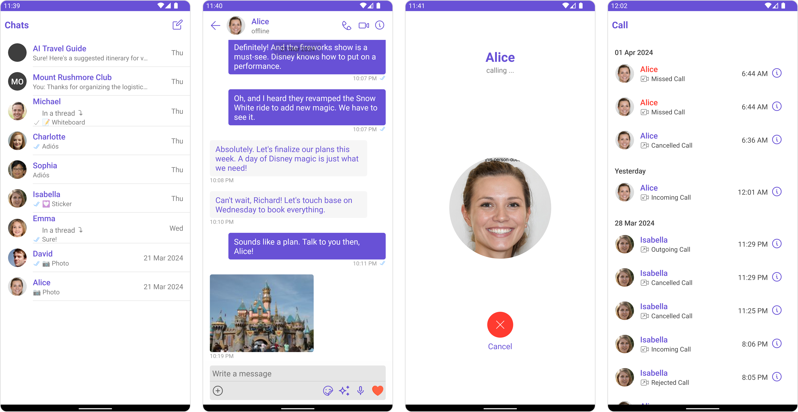

With CometChat's UI Kit for Android, you can effortlessly build a chat app equipped with all the essential messaging features, along with customizable options tailored to your application requirements. This UI Kit comprises prebuilt UI components organized into smaller modules and components, each configurable to meet your specific needs.

  

    
<a class="button btn" style={{backgroundColor: '#7c55c9', color: 'white', textDecoration: 'underline'}} href="https://github.com/cometchat-pro/cometchat-chat-sample-app-android-java/tree/v4">Android Sample App</a>

  

## Before Getting Started

Before you begin, it's essential to grasp the fundamental concepts and features offered by CometChat's APIs, SDK, and UI Kit. You can find detailed information in [Key Concepts](/fundamentals/key-concepts) documentation.

The UI Kit library comprises pre-built Android Views for effortless integration and is built on top of the [Android Chat SDK](/sdk/android/overview). Installing it will also include the core Chat SDK.

To ensure the best possible start and to familiarize yourself with our platform, we encourage you to begin by reviewing our [Getting Started](../02-getting-started.md) guide. This comprehensive guide will provide you with all the essential information and steps you need to seamlessly navigate through our system.
