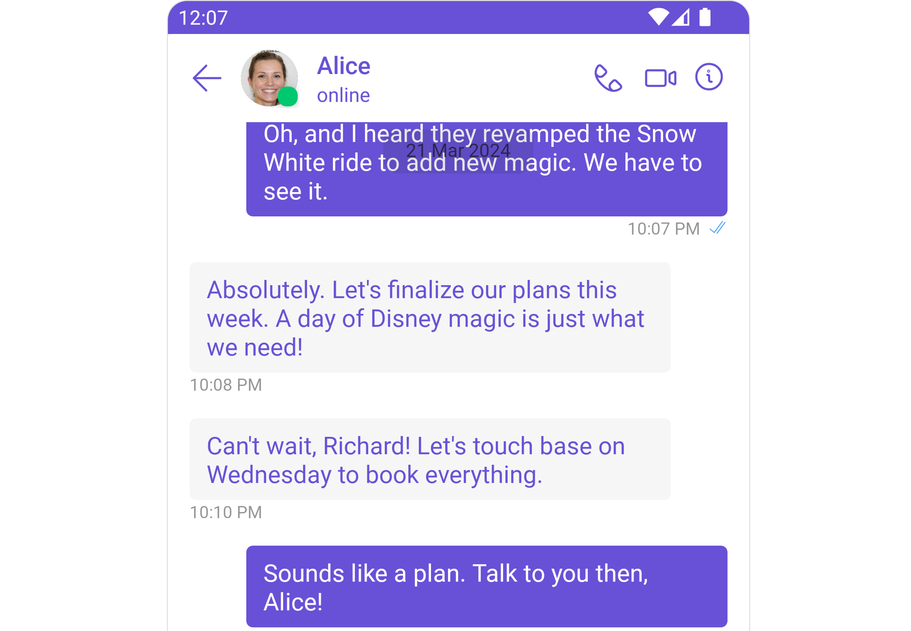
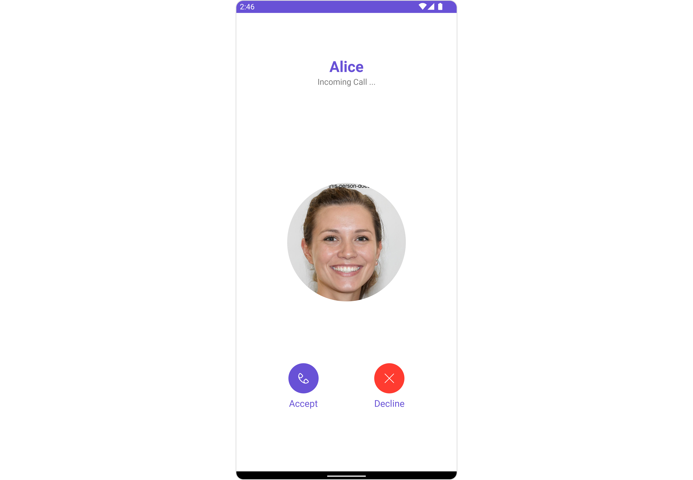
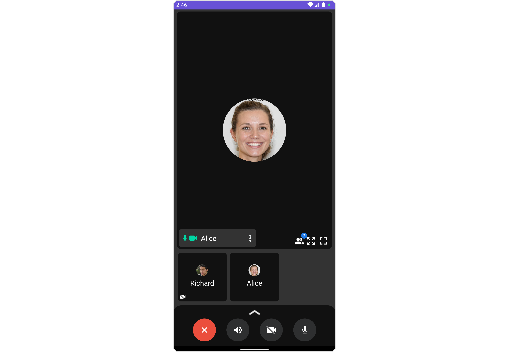
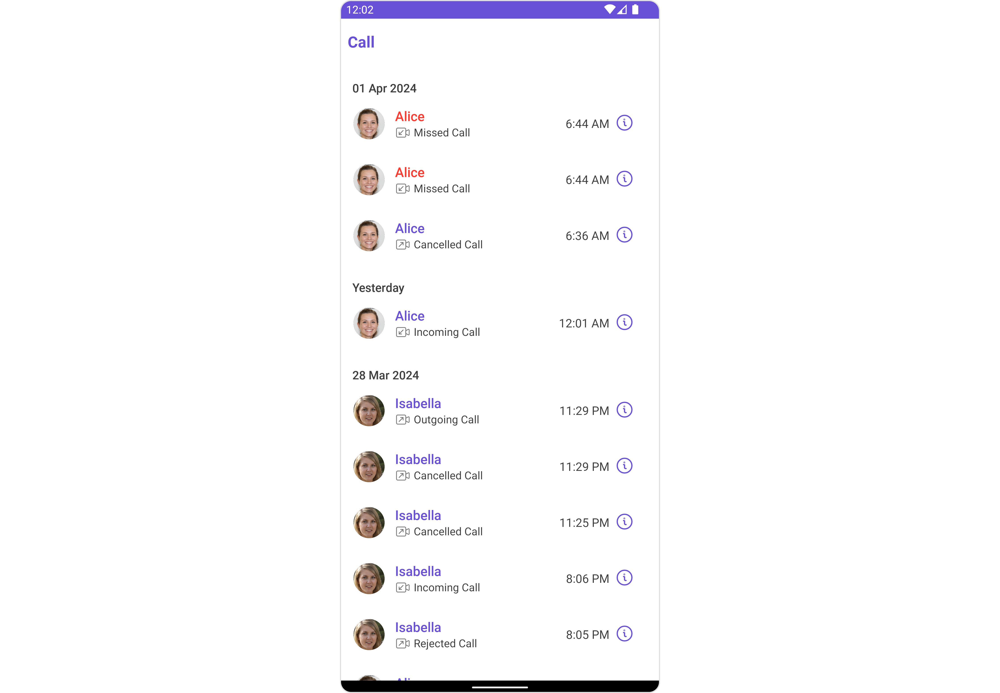

import Tabs from '@theme/Tabs';
import TabItem from '@theme/TabItem';

## Overview

CometChat's Calls feature is an advanced functionality that allows you to seamlessly integrate one-on-one as well as group audio and video calling capabilities into your application. This document provides a technical overview of these features, as implemented in the Android UI Kit.

## Integration

First, make sure that you've correctly integrated the UI Kit library into your project. If you haven't done this yet or are facing difficulties, refer to our [Getting Started](/ui-kit/android/getting-started) guide. This guide will walk you through a step-by-step process of integrating our UI Kit into your Android project.

Once you've successfully integrated the UI Kit, the next step is to add the CometChat Calls SDK to your project. This is necessary to enable the calling features in the UI Kit. Here's how you do it:

Add the following dependency to your build.gradle file:

```groovy
dependencies {
  implementation 'com.cometchat:calls-sdk-android:4.+.+'
}
```

After adding this dependency, the Android UI Kit will automatically detect it and activate the calling features. Now, your application supports both audio and video calling. You will see [CallButtons](/ui-kit/android/call-buttons) component rendered in [MessageHeader](/ui-kit/android/message-header) Component.



To start receive calls globally in your app you will need to add `CallListener`, This needs to be added before the you initialize CometChat UI kit, We sudgest you making a custom Application class and adding call listener.

<Tabs>

<TabItem value="java" label="Java">

```java
public class BaseApplication extends Application {

    private static String LISTENER_ID = BaseApplication.class.getSimpleName()+System.currentTimeMillis();

    @Override
    public void onCreate() {
        super.onCreate();
        CometChat.addCallListener(LISTENER_ID, new CometChat.CallListener() {
            @Override
            public void onIncomingCallReceived(Call call) {
                CometChatCallActivity.launchIncomingCallScreen(BaseApplication.this, call, null); //pass null or IncomingCallConfiguration if need to configure CometChatIncomingCall component
            }

            @Override
            public void onOutgoingCallAccepted(Call call) {

            }

            @Override
            public void onOutgoingCallRejected(Call call) {

            }

            @Override
            public void onIncomingCallCancelled(Call call) {

            }
        });
    }
}
```

</TabItem>

<TabItem value="kotlin" label="Kotlin">

```kotlin
class BaseApplication : Application() {
    companion object {
        private val LISTENER_ID = "${BaseApplication::class.java.simpleName}${System.currentTimeMillis()}"
    }

    override fun onCreate() {
        super.onCreate()
        CometChat.addCallListener(LISTENER_ID, object : CometChat.CallListener {
            override fun onIncomingCallReceived(call: Call) {
                CometChatCallActivity.launchIncomingCallScreen(this@BaseApplication, call, null)
                // Pass null or IncomingCallConfiguration if need to configure CometChatIncomingCall component
            }

            override fun onOutgoingCallAccepted(call: Call) {
                // To be implemented
            }

            override fun onOutgoingCallRejected(call: Call) {
                // To be implemented
            }

            override fun onIncomingCallCancelled(call: Call) {
                // To be implemented
            }
        })
    }
}
```

</TabItem>

</Tabs>

## Features

### Incoming Call

The [Incoming Call](/ui-kit/android/incoming-call) component of the CometChat UI Kit provides the functionality that lets users receive real-time audio and video calls in the app.

When a call is made to a user, the Incoming Call component triggers and displays a call screen. This call screen typically displays the caller information and provides the user with options to either accept or reject the incoming call.



### Outgoing Call

The [Outgoing Call](/ui-kit/android/outgoing-call) component of the CometChat UI Kit is designed to manage the outgoing call process within your application. When a user initiates an audio or video call to another user or group, this component displays an outgoing call screen, showcasing information about the recipient and the call status.

Importantly, the Outgoing Call component is smartly designed to transition automatically into the ongoing call screen once the receiver accepts the call. This ensures a smooth flow from initiating the call to engaging in a conversation, without any additional steps required from the user.


### Ongoing Call

The [OngoingCall](/ui-kit/android/ongoing-call) component is the user interface that displays during an ongoing call. For an audio call, this screen displays the participant's name, call duration, and buttons to mute the audio, enable or disable video, switch the camera, and end the call.

For a video call, the Call Screen might additionally display the video footage from both the user's camera and the recipient's camera.



<!-- ### Call Recordings

The [Call Recordings](/ui-kit/android/call-log-recording) component of CometChat's UI Kit is designed to provide users with a comprehensive view of their recorded call history. This feature allows users to keep track of their interactions, which can be especially useful in contexts like business meetings, interviews, or educational sessions.

In the Call Recordings component, each entry represents a recorded call, and the list is usually arranged in chronological order. Each entry or call log includes details such as the call participants, the duration of the call, the date and time of the call, as well as a link or option to access the recording. -->

### Call Logs

[Call Logs](/ui-kit/android/call-logs) component provides you with the records call events such as who called who, the time of the call, and the duration of the call. This information can be fetched from the CometChat server and displayed in a structured format for users to view their past call activities.


