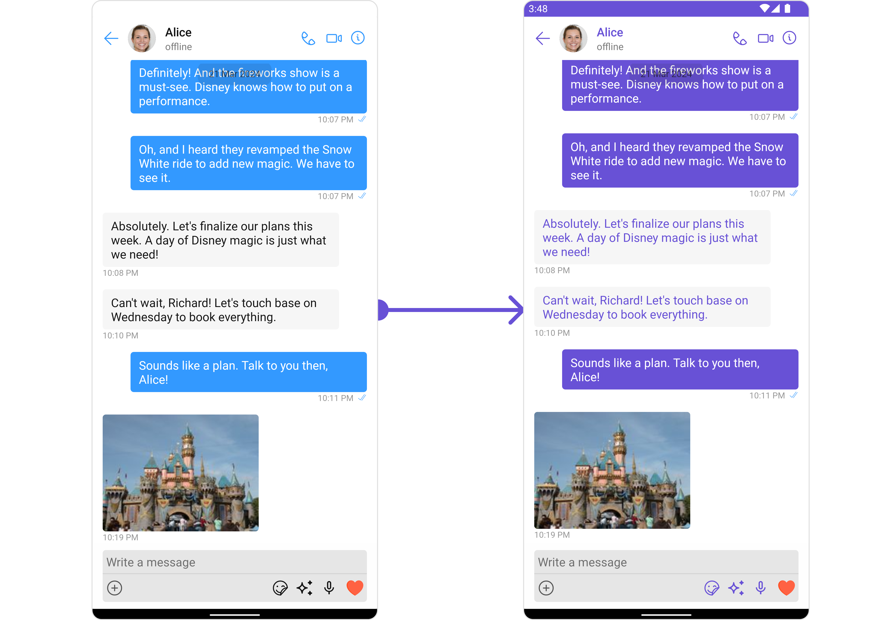
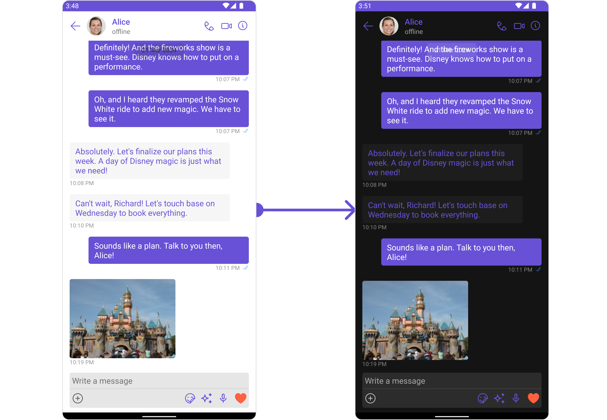

import Tabs from '@theme/Tabs';
import TabItem from '@theme/TabItem';

## Overview

The Theme is a style applied to every component of CometChat. When a style is applied as a theme, every view in the activity or every component in the UiKit will apply each property of the theme that it supports.

CometChat theme comprises two key components: Palette and Typography.

**Palette**: The Palette is a singleton class that possesses all the color variables with their default values. It can be used to customize the color scheme of the CometChat theme, including background color, primary and secondary colors, error color, and various levels of accent colors.

**Typography**: Typography, which is also a singleton class, encompasses all the default Text Style's values. It allows you to customize the text appearances throughout the CometChat theme, such as heading, name, titles, subtitles, text, and captions.
s

<!-- ## Palette

Palette is a singleton class which contain all the color variable with the default value in it. as methods stated below with the default value

| Methods                 | Default Light mode value | Default Dark mode value |
| ----------------------- | ------------------------ | ----------------------- |
| getBackground(context)         | #FFFFFF                  | #99141414               |
| getGradientBackground(context) | null                     | null                    |
| getPrimary(context)            | #3399FF                  | #3399FF                 |
| getSecondary(context)          | #ebf8f8f8                | #ebf8f8f8               |
| getError(context)              | #FF3B30                  | #FF3B30                 |
| getAccent(context)             | #141414                  | #FFFFFF                 |
| getAccent50(context)           | #0a141414                | #0affffff               |
| getAccent100(context)          | #14141414                | #14ffffff               |
| getAccent200(context)          | #26141414                | #24ffffff               |
| getAccent300(context)          | #3d141414                | #3bffffff               |
| getAccent400(context)          | #54141414                | #57ffffff               |
| getAccent500(context)          | #75141414                | #75ffffff               |
| getAccent600(context)          | #94141414                | #94ffffff               |
| getAccent700(context)          | #45141414                | #b5ffffff               |
| getAccent800(context)          | #d1141414                | #d6ffffff               |
| getAccent900(context)          | #FFFFFF                  | #141414                 |

## Typography

Typography is a singleton class which contain all the default Text Style's value in it. you can refer to the methods stated below with the default value.

| Methods        | Default value                                                                                                                                                                                                                                                       |
| -------------- | ------------------------------------------------------------------------------------------------------------------------------------------------------------------------------------------------------------------------------------------------------------------- |
| getHeading()   | &lt;style name="Heading"&gt;<br /><br /> &lt;item name="android:fontWeight"&gt;500&lt;/item&gt;<br /><br /> &lt;item name="android:fontFamily"&gt;roboto&lt;/item&gt;<br /><br /> &lt;item name="android:textSize"&gt;20sp&lt;/item&gt;<br /><br />&lt;/style&gt;   |
| getName()      | &lt;style name="Name"&gt;<br /><br /> &lt;item name="android:fontWeight"&gt;500&lt;/item&gt;<br /><br /> &lt;item name="android:fontFamily"&gt;roboto&lt;/item&gt;<br /><br /> &lt;item name="android:textSize"&gt;17sp&lt;/item&gt;<br /><br />&lt;/style&gt;      |
| getTitle1()    | &lt;style name="Title1"&gt;<br /><br /> &lt;item name="android:fontWeight"&gt;600&lt;/item&gt;<br /><br /> &lt;item name="android:fontFamily"&gt;roboto&lt;/item&gt;<br /><br /> &lt;item name="android:textSize"&gt;15sp&lt;/item&gt;<br /><br />&lt;/style&gt;    |
| getTitle2()    | &lt;style name="Title2"&gt;<br /><br /> &lt;item name="android:fontWeight"&gt;400&lt;/item&gt;<br /><br /> &lt;item name="android:fontFamily"&gt;roboto&lt;/item&gt;<br /><br /> &lt;item name="android:textSize"&gt;22sp&lt;/item&gt;<br /><br />&lt;/style&gt;    |
| getSubtitle1() | &lt;style name="Subtitle1"&gt;<br /><br /> &lt;item name="android:fontWeight"&gt;400&lt;/item&gt;<br /><br /> &lt;item name="android:fontFamily"&gt;roboto&lt;/item&gt;<br /><br /> &lt;item name="android:textSize"&gt;15sp&lt;/item&gt;<br /><br />&lt;/style&gt; |
| getSubtitle2() | &lt;style name="Subtitle2"&gt;<br /><br /> &lt;item name="android:fontWeight"&gt;400&lt;/item&gt;<br /><br /> &lt;item name="android:fontFamily"&gt;roboto&lt;/item&gt;<br /><br /> &lt;item name="android:textSize"&gt;13sp&lt;/item&gt;<br /><br />&lt;/style&gt; |
| getText1()     | &lt;style name="Text1"&gt;<br /><br /> &lt;item name="android:fontWeight"&gt;400&lt;/item&gt;<br /><br /> &lt;item name="android:fontFamily"&gt;roboto&lt;/item&gt;<br /><br /> &lt;item name="android:textSize"&gt;17sp&lt;/item&gt;<br /><br />&lt;/style&gt;     |
| getText2()     | &lt;style name="Text2"&gt;<br /><br /> &lt;item name="android:fontWeight"&gt;500&lt;/item&gt;<br /><br /> &lt;item name="android:fontFamily"&gt;roboto&lt;/item&gt;<br /><br /> &lt;item name="android:textSize"&gt;13sp&lt;/item&gt;<br /><br />&lt;/style&gt;     |
| getCaption1()  | &lt;style name="Caption1"&gt;<br /><br /> &lt;item name="android:fontWeight"&gt;500&lt;/item&gt;<br /><br /> &lt;item name="android:fontFamily"&gt;roboto&lt;/item&gt;<br /><br /> &lt;item name="android:textSize"&gt;12sp&lt;/item&gt;<br /><br />&lt;/style&gt;  |
| getCaption2()  | &lt;style name="Caption2"&gt;<br /><br /> &lt;item name="android:fontWeight"&gt;500&lt;/item&gt;<br /><br /> &lt;item name="android:fontFamily"&gt;roboto&lt;/item&gt;<br /><br /> &lt;item name="android:textSize"&gt;11sp&lt;/item&gt;<br /><br />&lt;/style&gt;  | -->

## Usage

### **Palette**

The CometChat UI kit provides an easy way to customize the visual appearance of your chat application via the Palette class. This class contains several methods that allow you to modify the default color scheme of your app, imparting a unique look and feel that aligns with your branding or design guidelines.

Here's an overview of the different methods available in the Palette class:

| Methods                                                                            | Description                                                                   |
| ---------------------------------------------------------------------------------- | ----------------------------------------------------------------------------- |
| **background(@ColorInt int color)**                                                | Change the default background color                                           |
| **gradientBackground(Drawable drawable)**                                          | Set a gradient background using a gradient resource file                      |
| **gradientBackground(int[] colorArray, GradientDrawable.Orientation orientation)** | Set a gradient background using an array of colors and a gradient orientation |
| **primary(@ColorInt int color)**                                                   | Change the default primary color                                              |
| **secondary(@ColorInt int color)**                                                 | Change the default secondary color                                            |
| **error(@ColorInt int color)**                                                     | Change the default error color                                                |
| **accent(@ColorInt int color)**                                                    | Change the default accent color                                               |
| **accent50(@ColorInt int color)**                                                  | Change the default accent50 color                                             |
| **accent100(@ColorInt int color)**                                                 | Change the default accent100 color                                            |
| **accent200(@ColorInt int color)**                                                 | Change the default accent200 color                                            |
| **accent300(@ColorInt int color)**                                                 | Change the default accent300 color                                            |
| **accent400(@ColorInt int color)**                                                 | Change the default accent400 color                                            |
| **accent500(@ColorInt int color)**                                                 | Change the default accent500 color                                            |
| **accent600(@ColorInt int color)**                                                 | Change the default accent600 color                                            |
| **accent700(@ColorInt int color)**                                                 | Change the default accent700 color                                            |
| **accent800(@ColorInt int color)**                                                 | Change the default accent800 color                                            |
| **accent900(@ColorInt int color)**                                                 | Change the default accent900 color                                            |

**Example**

To match the theme of your app you will need to set primary , secondary and accent color using Pallate.



<Tabs>

<TabItem value="java" label="Java">

```java
Palette palette = Palette.getInstance();
palette.primary(Color.parseColor("#YourPrimaryColor"));
palette.secondary(Color.parseColor("#YourSecondaryColor"));
palette.accent(Color.parseColor("#YourAccentColor"));
```

</TabItem>

<TabItem value="kotlin" label="Kotlin">

```kotlin
val palette = Palette.getInstance()

palette.primary(Color.parseColor("#YourPrimaryColor"))

palette.secondary(Color.parseColor("#YourSecondaryColor"))

palette.accent(Color.parseColor("#YourAccentColor"))
```

</TabItem>

</Tabs>

Switching between Light and Dark modes in CometChat is quite simple by manipulating the mode property of the Palette class.



<Tabs>

<TabItem value="java" label="Java">

```java
Palette palette = Palette.getInstance();
palette.mode(CometChatTheme.MODE.DARK);
```

</TabItem>

<TabItem value="kotlin" label="Kotlin">

```kotlin
val palette = Palette.getInstance(MainActivity.this)
palette.mode(CometChatTheme.MODE.DARK)
```

</TabItem>

</Tabs>

### **Typography**

The Typography class provides methods that allow you to change the default text styles in the CometChat theme as per your requirements.

Here are some of the methods provided by the Typography class:

| Methods                     | Description                                |
| --------------------------- | ------------------------------------------ |
| setHeading(int heading)     | Use to set **Heading** text Appearance.    |
| setName(int name)           | Use to set **Name** text Appearance.       |
| setTitle1(int title1)       | Use to set **Title 1** text Appearance.    |
| setTitle2(int title2)       | Use to set **Title 2** text Appearance.    |
| setSubtitle1(int subtitle1) | Use to set **Subtitle 1** text Appearance. |
| setSubtitle2(int subtitle2) | Use to set **Subtitle 2** text Appearance. |
| setText1(int text1)         | Use to set **Text 1** text Appearance.     |
| setText2(int text2)         | Use to set **Text 2** text Appearance.     |
| setCaption1(int caption1)   | Use to set **Caption 1** text Appearance.  |
| setCaption2(int caption2)   | Use to set **Caption 2** text Appearance.  |

To change Name TextStyle of the UiKit Theme Please refer to the code below :

<Tabs>
<TabItem value="java" label="Java">

```Java
Typography typography = Typography.getInstance();
typography.setName(R.style.font);
```

</TabItem>

<TabItem value="kotlin" label="Kotlin">

```Kotlin
val typography = Typography.getInstance()
typography.name = R.style.TextAppearance
```

</TabItem>
</Tabs>

<!--  -->

:::info

similarly to change other Text Style of Theme you can refer to the above mentioned method.

:::
