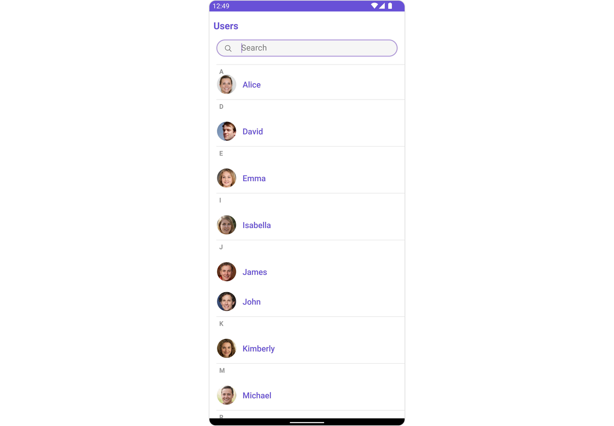
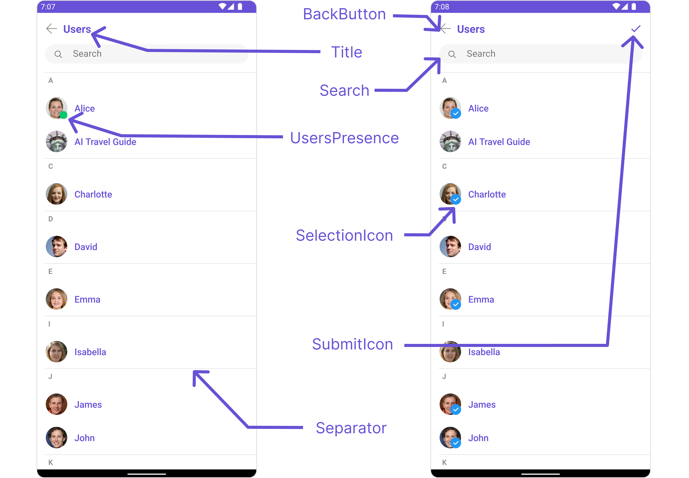
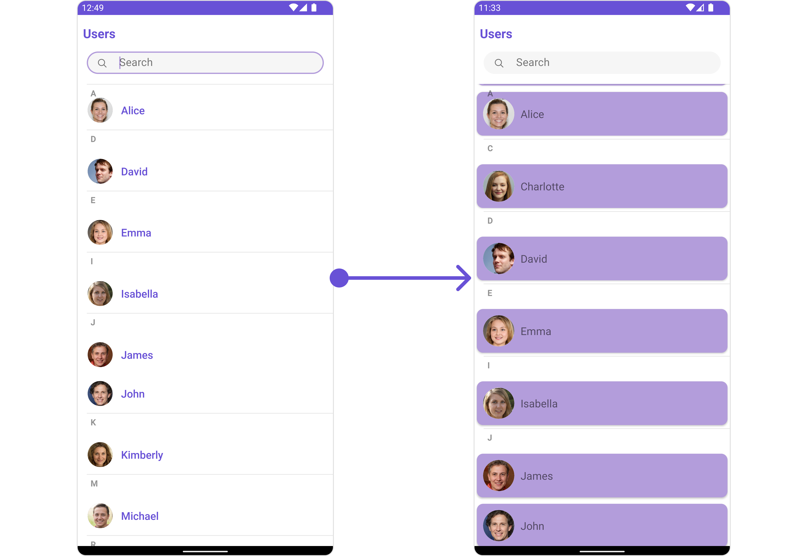
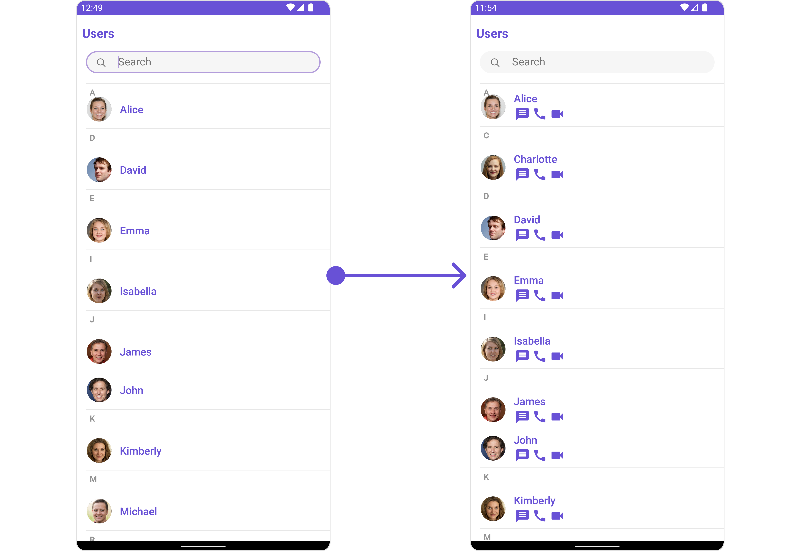
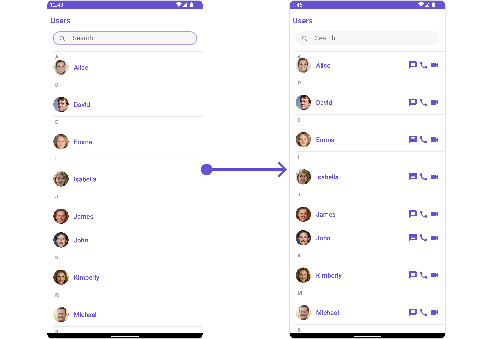
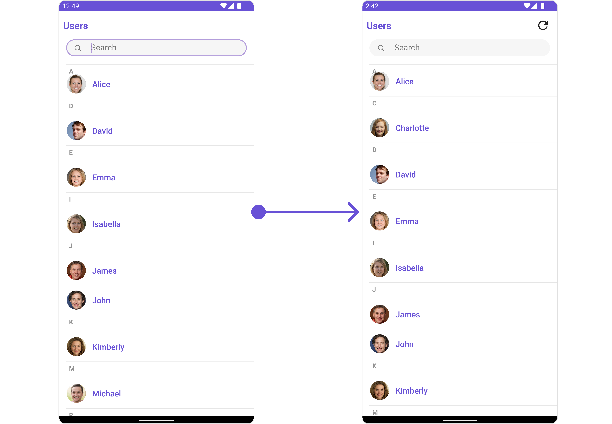
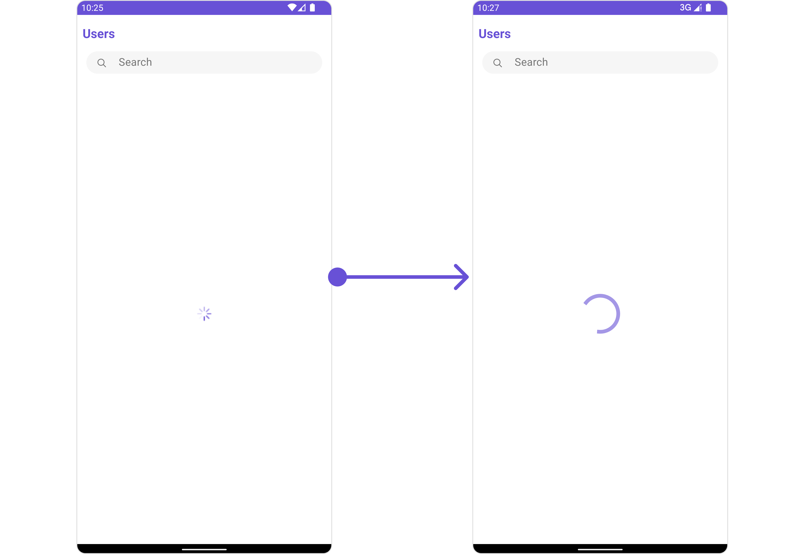
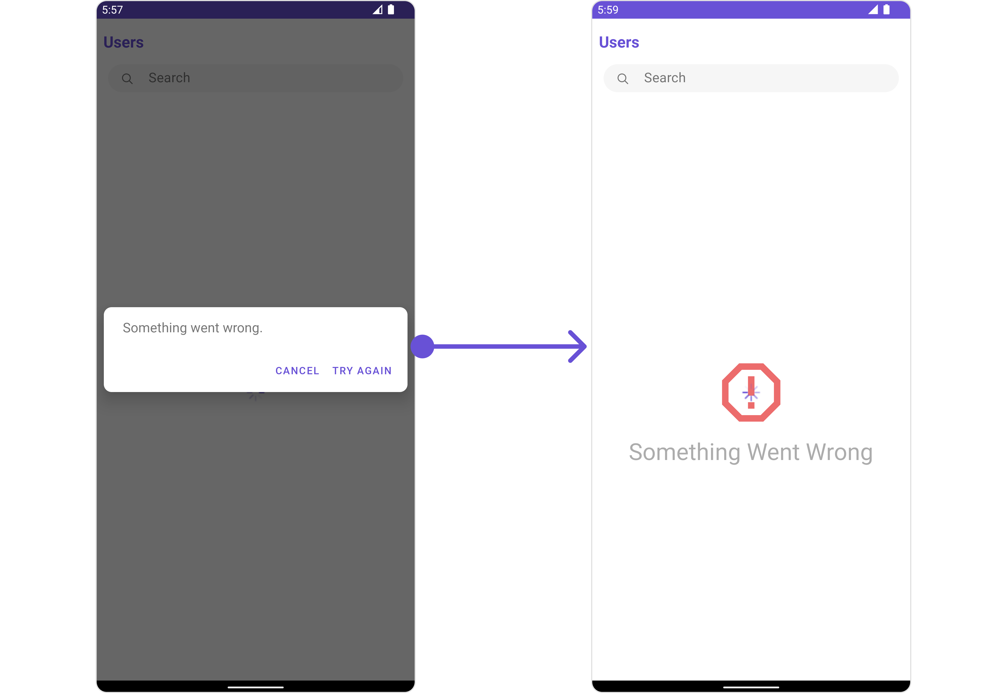

import Tabs from '@theme/Tabs';
import TabItem from '@theme/TabItem';

## Overview

The Users is a [Component](/ui-kit/android/components-overview#components), showcasing an accessible list of all available users. It provides an integral search functionality, allowing you to locate any specific user swiftly and easily. For each user listed, the widget displays the user's name by default, in conjunction with their avatar when available. Furthermore, it includes a status indicator, visually informing you whether a user is currently online or offline.



The Users component is composed of the following BaseComponents:

| Components              | Description                                                                                                             |
| ----------------------- | ----------------------------------------------------------------------------------------------------------------------- |
| [ListBase](./list-base) | a reusable container component having title, search box, customisable background and a List View                        |
| [ListItem](./list-item) | a component that renders data obtained from a User object on a Tile having a title, subtitle, leading and trailing view |

---

## Usage

### Integration

The following code snippet illustrates how you can directly incorporate the Users component into your `layout.xml` file.

<Tabs>
<TabItem value="xml" label="XML">

```xml
<com.cometchat.chatuikit.users.CometChatUsers
        android:layout_width="match_parent"
        android:layout_height="match_parent"
        android:id="@+id/users"
        />
```

</TabItem>
</Tabs>

### Actions

[Actions](/ui-kit/android/components-overview#actions) dictate how a component functions. They are divided into two types: Predefined and User-defined. You can override either type, allowing you to tailor the behavior of the component to fit your specific needs.

##### 1. OnSelection

The `OnSelection` event is activated when you select the done icon in the Menubar while in selection mode. This returns a list of all the users that you have selected.

This action does not come with any predefined behavior. However, you have the flexibility to override this event and tailor it to suit your needs using the following code snippet.

<Tabs>

<TabItem value="java" label="Java">

```java
cometChatUsers.setOnSelection(userList -> {
    // your custom action
});
```

</TabItem>

<TabItem value="kotlin" label="Kotlin">

```kotlin
cometChatUsers.setOnSelection { userList ->
    // your custom action
}
```

</TabItem>

</Tabs>

##### 2. ItemClickListener

The `OnItemClickListener` event is activated when you click on the UserList item. This action does not come with any predefined behavior. However, you have the flexibility to override this event and tailor it to suit your needs using the following code snippet.

<Tabs>

<TabItem value="java" label="Java">

```java
users.setItemClickListener(new OnItemClickListener<User>() {
    @Override
    public void OnItemClick(User user, int position) {
        // your custom action
    }
});
```

</TabItem>

<TabItem value="kotlin" label="Kotlin">

```kotlin
users.setItemClickListener(object : OnItemClickListener<User> {
    override fun OnItemClick(user: User, position: Int) {
        // your custom action
    }
})
```

</TabItem>

</Tabs>

##### 3. BackPressListener

The OnBackPressListener function is built to respond when you tap the back button in the Toolbar of the activity.

By default, this action has a predefined behavior: it simply closes the current activity. However, the flexibility of CometChat UI Kit allows you to override this standard behavior according to your application's specific requirements. You can define a custom action that will be performed instead when the back button is pressed.

<Tabs>

<TabItem value="java" label="Java">
```java
users.addOnBackPressListener(() -> {
    // your custom action
});
```
</TabItem>

<TabItem value="kotlin" label="Kotlin">

```kotlin
users.addOnBackPressListener {
    // your custom action
}
```

</TabItem>

</Tabs>

##### 4. onError

This action doesn't change the behavior of the component but rather listens for any errors that occur in the User component.

<Tabs>

<TabItem value="java" label="Java">
```java
users.setOnError(new OnError() {
    @Override
    public void onError(Context context, CometChatException e) {
        //Your Exception Handling code.
    }
});
```
</TabItem>

<TabItem value="kotlin" label="Kotlin">

```kotlin
users.setOnError(object : OnError {
    override fun onError(context: Context, e: CometChatException) {
        // Your Exception Handling code.
    }
})
```

</TabItem>

</Tabs>

### Filters

**Filters** allow you to customize the data displayed in a list within a Component. You can filter the list based on your specific criteria, allowing for a more customized. Filters can be applied using RequestBuilders of Chat SDK.

##### 1. UserRequestBuilder

The [UserRequestBuilder](/sdk/android/retrieve-users) enables you to filter and customize the user list based on available parameters in UserRequestBuilder. This feature allows you to create more specific and targeted queries when fetching users. The following are the parameters available in [UserRequestBuilder](/sdk/android/retrieve-users)

| Methods              | Type               | Description                                                                            |
| -------------------- | ------------------ | -------------------------------------------------------------------------------------- |
| **setLimit**         | int                | sets the number users that can be fetched in a single request, suitable for pagination |
| **setSearchKeyword** | String             | used for fetching users matching the passed string                                     |
| **hideBlockedUsers** | bool               | used for fetching all those users who are not blocked by the logged in user            |
| **friendsOnly**      | bool               | used for fetching only those users in which logged in user is a member                 |
| **setRoles**         | List&lt;String&gt; | used for fetching users containing the passed tags                                     |
| **setTags**          | List&lt;String&gt; | used for fetching users containing the passed tags                                     |
| **withTags**         | bool               | used for fetching users containing tags                                                |
| **setUserStatus**    | String             | used for fetching users by their status online or offline                              |
| **setUIDs**          | List&lt;String&gt; | used for fetching users containing the passed users                                    |

**Example**

In the example below, we are applying a filter to the UserList based on Friends.

<Tabs>
<TabItem value="java" label="Java">

```Java
UsersRequest.UsersRequestBuilder builder=new UsersRequest.UsersRequestBuilder()
                .friendsOnly(false)
                        .setLimit(10);
cometChatUsers.setUsersRequestBuilder(builder);
```

</TabItem>

<TabItem value="kotlin" label="Kotlin">

```kotlin
val builder = UsersRequest.UsersRequestBuilder()
            .friendsOnly(false)
            .setLimit(10)
cometChatUsers.setUsersRequestBuilder(builder)
```

</TabItem>
</Tabs>

##### 2. SearchRequestBuilder

The SearchRequestBuilder uses [UserRequestBuilder](/sdk/android/retrieve-users) enables you to filter and customize the search list based on available parameters in UserRequestBuilder.
This feature allows you to keep uniformity between the displayed UserList and searched UserList.

**Example**

<Tabs>
<TabItem value="java" label="Java">

```Java
UsersRequest.UsersRequestBuilder builder = new UsersRequest.UsersRequestBuilder()
        .setSearchKeyword("**");
users.setSearchRequestBuilder(builder);
```

</TabItem>

<TabItem value="kotlin" label="Kotlin">

```kotlin
val builder = UsersRequest.UsersRequestBuilder()
    .setSearchKeyword("**")
users.searchRequestBuilder = builder
```

</TabItem>
</Tabs>

### Events

[Events](/ui-kit/android/components-overview#events) are emitted by a `Component`. By using event you can extend existing functionality. Being global events, they can be applied in Multiple Locations and are capable of being Added or Removed.

To handle events supported by Users you have to add corresponding listeners by using `CometChatUserEvents`

| Events          | Description                                                           |
| --------------- | --------------------------------------------------------------------- |
| ccUserBlocked   | This will get triggered when the logged in user blocks another user   |
| ccUserUnblocked | This will get triggered when the logged in user unblocks another user |

<Tabs>
<TabItem value="java" label="Java">

```Java
CometChatUserEvents.addUserListener("LISTENER_TAG", new CometChatUserEvents() {
            @Override
            public void ccUserBlocked(User user) {
                super.ccUserBlocked(user);
            }

            @Override
            public void ccUserUnblocked(User user) {
                super.ccUserUnblocked(user);
            }
        });
```

</TabItem>

<TabItem value="kotlin" label="Kotlin">

```kotlin
CometChatUserEvents.addUserListener("LISTENER_TAG", object : CometChatUserEvents() {
            override fun ccUserBlocked(user: User?) {
                super.ccUserBlocked(user)
            }

            override fun ccUserUnblocked(user: User?) {
                super.ccUserUnblocked(user)
            }
        })
```

</TabItem>
</Tabs>

## Customization

To fit your app's design requirements, you can customize the appearance of the conversation component. We provide exposed methods that allow you to modify the experience and behavior according to your specific needs.

### Style

Using Style you can customize the look and feel of the component in your app, These parameters typically control elements such as the color, size, shape, and fonts used within the component.

##### 1. Users Style

You can set the `UsersStyle` to the Users Component to customize the styling.

<Tabs>

<TabItem value="java" label="Java">

```java
UsersStyle usersStyle = new UsersStyle();
usersStyle.setBackground(Color.BLACK);
usersStyle.setCornerRadius(25f);
users.setStyle(usersStyle);
```

</TabItem>

<TabItem value="Kotlin" label="Kotlin">

```kotlin
val usersStyle = UsersStyle()
usersStyle.background = Color.BLACK
usersStyle.cornerRadius = 25f
users.style = usersStyle
```

</TabItem>

</Tabs>

List of properties exposed by MessageListStyle

| Property                        | Description                                                                                                         | Code                                             |
| ------------------------------- | ------------------------------------------------------------------------------------------------------------------- | ------------------------------------------------ |
| **Background**                  | Used to set the background color                                                                                    | `setBackground(@ColorInt int) `                  |
| **BorderWidth**                 | Used to set border width                                                                                            | `setBorderWidth(int) `                           |
| **BorderColor**                 | Used to set border color                                                                                            | `setBorderColor(@ColorInt int) `                 |
| **CornerRadius**                | Used to set border radius                                                                                           | `setCornerRadius(float) `                        |
| **Background**                  | Used to set background Drawable                                                                                     | `setBackground(Drawable) `                       |
| **TitleAppearance**             | Used to customise the appearance of the title in the app bar                                                        | `setTitleAppearance(@StyleRes int) `             |
| **BackIconTint**                | Used to set the color of the back icon in the app bar                                                               | `setBackIconTint(@ColorInt int) `                |
| **SearchBackground**            | Used to set the background color of the search box                                                                  | `setSearchBackground(@ColorInt int) `            |
| **SearchBorderRadius**          | Used to set the border radius of the search box                                                                     | `setSearchBorderRadius(int) `                    |
| **SearchIconTint**              | Used to set the color of the search icon in the search box                                                          | `setSearchIconTint(@ColorInt int) `              |
| **SearchBorderWidth**           | Used to set the border width of the search box                                                                      | `setSearchBorderWidth(int) `                     |
| **SearchTextAppearance**        | Used to set the style of the text in the search box                                                                 | `setSearchTextAppearance(@StyleRes int) `        |
| **LoadingIconTint**             | Used to set the color of the icon shown while the list of group members is being fetched                            | `setLoadingIconTint(@ColorInt int) `             |
| **EmptyTextAppearance**         | Used to set the style of the response text shown when fetchig the list of group members has returned an empty list  | `setEmptyTextAppearance(@StyleRes int) `         |
| **ErrorTextAppearance**         | Used to set the style of the response text shown in case some error occurs while fetching the list of group members | `setErrorTextAppearance(@StyleRes int) `         |
| **OnlineStatusColor**           | Used to set the color of the status indicator shown if a group member is online                                     | `setOnlineStatusColor(@ColorInt int) `           |
| **SeparatorColor**              | Used to set the color of the divider separating the group member items                                              | `setSeparatorColor(@ColorInt int) `              |
| **SectionHeaderTextAppearance** | Used to customise the appearance of the section header text.                                                        | `setSectionHeaderTextAppearance(@StyleRes int) ` |
| **SectionHeaderTextColor**      | Used to set the color of the section header text.                                                                   | `setSectionHeaderTextColor(@ColorInt int) `      |

##### 2. Avatar Style

To apply customized styles to the `Avatar` component in the Users Component, you can use the following code snippet. For further insights on `Avatar` Styles [refer](/ui-kit/react/avatar#avatar-style)

<Tabs>

<TabItem value="java" label="Java">
```java
AvatarStyle avatarStyle = new AvatarStyle();
avatarStyle.setBorderWidth(10);
avatarStyle.setBorderColor(Color.BLACK);
users.setAvatarStyle(avatarStyle);
```
</TabItem>

<TabItem value="kotlin" label="Kotlin">

```kotlin
val avatarStyle = AvatarStyle()
avatarStyle.borderWidth = 10
avatarStyle.borderColor = Color.BLACK
users.setAvatarStyle(avatarStyle)

```

</TabItem>

</Tabs>

##### 3. StatusIndicator Style

To apply customized styles to the Status Indicator component in the Users Component, You can use the following code snippet. For further insights on Status Indicator Styles [refer](/ui-kit/android/status-indicator)

<Tabs>

<TabItem value="java" label="Java">
```java
StatusIndicatorStyle statusIndicatorStyle = new StatusIndicatorStyle();
statusIndicatorStyle.setCornerRadius(3.5f);
statusIndicatorStyle.setBorderColor(Color.GREEN);
users.setStatusIndicatorStyle(statusIndicatorStyle);
```
</TabItem>

<TabItem value="kotlin" label="Kotlin">
```kotlin
val statusIndicatorStyle = StatusIndicatorStyle()
statusIndicatorStyle.cornerRadius = 3.5f
statusIndicatorStyle.borderColor = Color.GREEN
users.setStatusIndicatorStyle(statusIndicatorStyle)
```
</TabItem>

</Tabs>

---

### Functionality

These are a set of small functional customizations that allow you to fine-tune the overall experience of the component. With these, you can change text, set custom icons, and toggle the visibility of UI elements.

<Tabs>

<TabItem value="java" label="Java">

```java
CometChatUsers users = findViewById(R.id.users);
users.setTitle("Contacts");
users.showBackButton(true);
users.backIconTint(getResources().getColor(R.color.black));
```

</TabItem>

<TabItem value="Kotlin" label="Kotlin">

```kotlin
val users : CometChatUsers = findViewById(R.id.users)
users.title = "Contacts"
users.showBackButton(true)
users.backIconTint = ContextCompat.getColor(this, R.color.black)
```

</TabItem>

</Tabs>



Below is a list of customizations along with corresponding code snippets
| Property | Description | Code |
| -------------------------------------------------------------------------------------------------------- | ---------------------------------------------------------------------------------------------------------------------------------- | ----------------------------------------------------------- |
| **Set Title** | Used to set title in the app bar | `.setTitle("Your custom title")` |
| **Set SearchPlaceholderText** | Used to set search placeholder text | `.setSearchPlaceholderText("Your custom Text")` |
| **BackIcon** | Used to set back button icon | `.backIcon(@DrawableRes int res)` |
| **Show BackButton** | Used to toggle visibility for back button | `.showBackButton(boolean)` |
| **Set SearchBoxIcon** | Used to set search Icon in the search field | `.setSearchBoxIcon(@DrawableRes int res)` |
| **Hide Search** | Used to toggle visibility for search box | `.hideSearch(boolean)` |
| **Hide Error** | Used to hide error on fetching users | `.hideError(boolean)` |
| **Hide Separator** | Used to hide the divider separating the user items | `.hideSeparator(boolean)` |
| **Hide SectionSeparator** | Used to hide the text separating grouped user items | `.hideSephideSectionSeparatorarator(boolean)` |
| **Disable UsersPresence** | Used to control visibility of user indicator shown if user is online | `.disableUsersPresence(boolean)` |
| **Set SelectionIcon** | Used to override the default selection complete icon | `.setSelectionIcon(@DrawableRes int res)` |
| **Set SubmitIcon** | Used to override the default selection complete icon | `.setSubmitIcon(@DrawableRes int res)` |
| **EmptyState Text** | Used to set a custom text response when fetching the users has returned an empty list | `.emptyStateText("Your Text")` |
| **ErrorState Text** | Used to set a custom text response when some error occurs on fetching the list of users | `.errorStateText("Your Text")` |

---

### Advanced

For advanced-level customization, you can set custom views to the component. This lets you tailor each aspect of the component to fit your exact needs and application aesthetics. You can create and define your views, layouts, and UI elements and then incorporate those into the component.

---

#### SetListItemView

With this function, you can assign a custom ListItem to the Conversations Component.

<Tabs>

<TabItem value="java" label="Java">

```Java
users.setListItemView(new UsersViewHolderListener() {
    @Override
    public View createView(Context context, CometChatListItem cometChatListItem) {
        return null;
    }

    @Override
    public void bindView(Context context, View view, User user, RecyclerView.ViewHolder viewHolder, List<User> list, int i) {
    }
});
```

</TabItem>

<TabItem value="kotlin" label="Kotlin">

```kotlin
users.setListItemView(object: UsersViewHolderListener {
    override fun createView(context: Context, cometChatListItem: CometChatListItem): View? {
        return null
    }

    override fun bindView(context: Context, view: View, user: User, viewHolder: RecyclerView.ViewHolder, list: List<User>, i: Int) {
    }
})
```

</TabItem>

</Tabs>

**Example**



You can indeed create a custom layout file named `item_conversation_list.xml` for more complex or unique list items.

Once this layout file is made, you would inflate it inside the `createView()` method of the `UsersViewHolderListener`. The inflation process prepares the layout for use in your application:

Following this, you would use the `bindView()` method to initialize and assign values to your individual views. This could include setting text on TextViews, images on ImageViews, and so on based on the properties of the User object:

```xml title = "item_converation_list.xml"
<?xml version="1.0" encoding="utf-8"?>
<RelativeLayout xmlns:android="http://schemas.android.com/apk/res/android"
    xmlns:app="http://schemas.android.com/apk/res-auto"
    xmlns:tools="http://schemas.android.com/tools"
    android:layout_width="match_parent"
    android:layout_height="match_parent"
    tools:context=".MainActivity">
    <androidx.cardview.widget.CardView
        android:layout_width="match_parent"
        android:layout_height="wrap_content"
        android:elevation="10dp"
        app:cardBackgroundColor="@color/purple_500"
        app:cardCornerRadius="10dp"
        android:layout_margin="5dp"
        >
        <RelativeLayout
            android:layout_width="match_parent"
            android:layout_height="wrap_content">
            <com.cometchat.chatuikit.shared.views.CometChatAvatar.CometChatAvatar
                android:id="@+id/item_avatar"
                android:layout_centerVertical="true"
                android:layout_margin="10dp"
                android:layout_width="50dp"
                android:layout_height="50dp"
                android:padding="10dp"
                />
            <TextView
                android:id="@+id/txt_item_name"
                android:text="name"
                android:layout_width="match_parent"
                android:layout_height="wrap_content"
                android:layout_centerVertical="true"
                android:layout_toRightOf="@+id/item_avatar"
                android:textSize="17sp"
                />
            <TextView
                android:id="@+id/txt_item_date"
                android:text="date"
                android:layout_width="wrap_content"
                android:layout_height="wrap_content"
                android:layout_centerVertical="true"
                android:layout_alignParentEnd="true"
                android:textSize="12sp"
                android:layout_margin="10dp"
                />
        </RelativeLayout>
    </androidx.cardview.widget.CardView>
</RelativeLayout>
```

<Tabs>

<TabItem value="java" label="Java">
```java title="YourActivity.java"
users.setListItemView(new UsersViewHolderListener() {
    @Override
    public View createView(Context context, CometChatListItem cometChatListItem) {
        View view = getLayoutInflater().inflate(R.layout.item_converation_list, null);
        return view;
    }
    @Override
    public void bindView(Context context, View view, User user, RecyclerView.ViewHolder viewHolder, List<User> list, int i) {
        CometChatAvatar avatarView = view.findViewById(R.id.item_avatar);
        avatarView.setRadius(100);
        TextView nameView = view.findViewById(R.id.txt_item_name);
        nameView.setText(user.getName());
        avatarView.setImage(user.getAvatar(),user.getName());
    }
});
```
</TabItem>

<TabItem value="kotlin" label="Kotlin">

```kotlin title="YourActivity.kt"
users.setListItemView(object: UsersViewHolderListener {
    override fun createView(context: Context, cometChatListItem: CometChatListItem): View {
        val view = LayoutInflater.from(context).inflate(R.layout.item_converation_list, null)
        return view
    }

    override fun bindView(context: Context, view: View, user: User, viewHolder: RecyclerView.ViewHolder, list: List<User>, i: Int) {
        val avatarView: CometChatAvatar = view.findViewById(R.id.item_avatar)
        avatarView.radius = 100
        val nameView: TextView = view.findViewById(R.id.txt_item_name)
        nameView.text = user.name
        avatarView.setImage(user.avatar, user.name)
    }
})
```

</TabItem>

</Tabs>

---

#### SetSubTitleView

You can customize the subtitle view for each conversation item to meet your requirements

<Tabs>

<TabItem value="java" label="Java">
```Java
users.setSubTitleView(new UsersViewHolderListener() {
    @Override
    public View createView(Context context, CometChatListItem cometChatListItem) {
        return null;
    }
    @Override
    public void bindView(Context context, View view, User user, RecyclerView.ViewHolder viewHolder, List<User> list, int i) {
    }
});
```
</TabItem>
<TabItem value="kotlin" label="Kotlin">

```kotlin
users.setSubTitleView(object: UsersViewHolderListener {
    override fun createView(context: Context, cometChatListItem: CometChatListItem): View? {
        return null
    }
    override fun bindView(context: Context, view: View, user: User, viewHolder: RecyclerView.ViewHolder, list: List<User>, i: Int) {
    }
})
```

</TabItem>

</Tabs>

**Example**


You can indeed create a custom layout file named `subtitle_layout.xml` for more complex or unique list items.

Once this layout file is made, you would inflate it inside the `createView()` method of the `UsersViewHolderListener`. The inflation process prepares the layout for use in your application:

Following this, you would use the `bindView()` method to initialize and assign values to your individual views. This could include setting text on TextViews, images on ImageViews, and so on based on the properties of the User object:

```xml title="subtitle_layout.xml"
    <?xml version="1.0" encoding="utf-8"?>

    <RelativeLayout xmlns:android="http://schemas.android.com/apk/res/android"
    android:layout_width="match_parent"
    android:layout_height="match_parent">

    <TextView
        android:id="@+id/txt_subtitle"
        android:text="Subtitle"
        android:layout_width="wrap_content"
        android:layout_height="wrap_content"/>

    <ImageView
        android:id="@+id/img_conversation"
        android:layout_width="wrap_content"
        android:layout_height="wrap_content"
        android:src="@drawable/ic_message_grey"
        android:layout_margin="2dp"
        android:layout_below="@+id/txt_subtitle"
        />
    <ImageView
        android:id="@+id/img_audio_call"
        android:layout_width="wrap_content"
        android:layout_height="wrap_content"
        android:src="@drawable/ic_call"
        android:layout_below="@+id/txt_subtitle"
        android:layout_margin="2dp"
        android:layout_toRightOf="@+id/img_conversation"
        />
    <ImageView
        android:id="@+id/img_video_call"
        android:layout_width="wrap_content"
        android:layout_height="wrap_content"
        android:src="@drawable/ic_video"
        android:layout_below="@+id/txt_subtitle"
        android:layout_margin="2dp"
        android:layout_toRightOf="@+id/img_audio_call"
        />

    </RelativeLayout>
```

<Tabs>

<TabItem value="java" label="Java">
```Java
users.setSubTitleView(new UsersViewHolderListener() {
    @Override
    public View createView(Context context, CometChatListItem cometChatListItem) {
        View view = getLayoutInflater().inflate(R.layout.subtitle_layout, null);
        return view;
    }
    @Override
    public void bindView(Context context, View view, User user, RecyclerView.ViewHolder viewHolder, List<User> list, int i) {
        TextView txtSubtitle = view.findViewById(R.id.txt_subtitle);
        ImageView imgConversation = view.findViewById(R.id.img_conversation);
        ImageView imgAudioCall = view.findViewById(R.id.img_audio_call);;
        ImageView imgVideCall = view.findViewById(R.id.img_video_call);;
        txtSubtitle.setText(user.getName());
        imgConversation.setOnClickListener(v -> {
            Toast.makeText(context, "Conversation Clicked", Toast.LENGTH_SHORT).show();
        });
        imgAudioCall.setOnClickListener(v -> {
            Toast.makeText(context, "Audio Call Clicked", Toast.LENGTH_SHORT).show();
        });
        imgVideCall.setOnClickListener(v -> {
            Toast.makeText(context, "Video Call Clicked", Toast.LENGTH_SHORT).show();
        });
    }
});
```
</TabItem>
<TabItem value="kotlin" label="Kotlin">

```kotlin
users.setSubTitleView(object: UsersViewHolderListener {
    override fun createView(context: Context, cometChatListItem: CometChatListItem): View {
        val view = LayoutInflater.from(context).inflate(R.layout.subtitle_layout, null)
        return view
    }
    override fun bindView(context: Context, view: View, user: User, viewHolder: RecyclerView.ViewHolder, list: List<User>, i: Int) {
        val txtSubtitle: TextView = view.findViewById(R.id.txt_subtitle)
        val imgConversation: ImageView = view.findViewById(R.id.img_conversation)
        val imgAudioCall: ImageView = view.findViewById(R.id.img_audio_call)
        val imgVideoCall: ImageView = view.findViewById(R.id.img_video_call)
        txtSubtitle.text = user.name
        imgConversation.setOnClickListener {
            Toast.makeText(context, "Conversation Clicked", Toast.LENGTH_SHORT).show()
        }
        imgAudioCall.setOnClickListener {
            Toast.makeText(context, "Audio Call Clicked", Toast.LENGTH_SHORT).show()
        }
        imgVideoCall.setOnClickListener {
            Toast.makeText(context, "Video Call Clicked", Toast.LENGTH_SHORT).show()
        }
    }
})
```

</TabItem>

</Tabs>

---

#### SetTailView

Used to generate a custom trailing view for the UserList item. You can add a Tail view using the following method.

<Tabs>

<TabItem value="java" label="Java">
```Java
users.setTailView(new UsersViewHolderListener() {
    @Override
    public View createView(Context context, CometChatListItem cometChatListItem) {
        return null;
    }
    @Override
    public void bindView(Context context, View view, User user, RecyclerView.ViewHolder viewHolder, List<User> list, int i) {
    }
});
```
</TabItem>
<TabItem value="kotlin" label="Kotlin">

```kotlin
users.setTailView(object: UsersViewHolderListener {
    override fun createView(context: Context, cometChatListItem: CometChatListItem): View? {
        return null
    }
    override fun bindView(context: Context, view: View, user: User, viewHolder: RecyclerView.ViewHolder, list: List<User>, i: Int) {
    }
})
```

</TabItem>

</Tabs>

**Example**


You can indeed create a custom layout file named `tail_view_layout.xml` for more complex or unique list items.

Once this layout file is made, you would inflate it inside the `createView()` method of the `UsersViewHolderListener`. The inflation process prepares the layout for use in your application:

Following this, you would use the `bindView()` method to initialize and assign values to your individual views. This could include setting text on TextViews, images on ImageViews, and so on based on the properties of the User object:

```xml title="tail_view_layout.xml"
    <?xml version="1.0" encoding="utf-8"?>

    <RelativeLayout xmlns:android="http://schemas.android.com/apk/res/android"
    android:layout_width="match_parent"
    android:layout_height="match_parent">

    <TextView
        android:id="@+id/txt_subtitle"
        android:text="Subtitle"
        android:layout_width="wrap_content"
        android:layout_height="wrap_content"/>

    <ImageView
        android:id="@+id/img_conversation"
        android:layout_width="wrap_content"
        android:layout_height="wrap_content"
        android:src="@drawable/ic_message_grey"
        android:layout_margin="2dp"
        android:layout_below="@+id/txt_subtitle"
        />
    <ImageView
        android:id="@+id/img_audio_call"
        android:layout_width="wrap_content"
        android:layout_height="wrap_content"
        android:src="@drawable/ic_call"
        android:layout_below="@+id/txt_subtitle"
        android:layout_margin="2dp"
        android:layout_toRightOf="@+id/img_conversation"
        />
    <ImageView
        android:id="@+id/img_video_call"
        android:layout_width="wrap_content"
        android:layout_height="wrap_content"
        android:src="@drawable/ic_video"
        android:layout_below="@+id/txt_subtitle"
        android:layout_margin="2dp"
        android:layout_toRightOf="@+id/img_audio_call"
        />

    </RelativeLayout>
```

<Tabs>

<TabItem value="java" label="Java">
```Java
users.setTailView(new UsersViewHolderListener() {
    @Override
    public View createView(Context context, CometChatListItem cometChatListItem) {
        View view = getLayoutInflater().inflate(R.layout.subtitle_layout, null);
        return view;
    }
    @Override
    public void bindView(Context context, View view, User user, RecyclerView.ViewHolder viewHolder, List<User> list, int i) {
        TextView txtSubtitle = view.findViewById(R.id.txt_subtitle);
        ImageView imgConversation = view.findViewById(R.id.img_conversation);
        ImageView imgAudioCall = view.findViewById(R.id.img_audio_call);;
        ImageView imgVideCall = view.findViewById(R.id.img_video_call);;
        txtSubtitle.setText(user.getName());
        imgConversation.setOnClickListener(v -> {
            Toast.makeText(context, "Conversation Clicked", Toast.LENGTH_SHORT).show();
        });
        imgAudioCall.setOnClickListener(v -> {
            Toast.makeText(context, "Audio Call Clicked", Toast.LENGTH_SHORT).show();
        });
        imgVideCall.setOnClickListener(v -> {
            Toast.makeText(context, "Video Call Clicked", Toast.LENGTH_SHORT).show();
        });
    }
});
```
</TabItem>
<TabItem value="kotlin" label="Kotlin">

```kotlin
users.setTailView(object: UsersViewHolderListener {
    override fun createView(context: Context, cometChatListItem: CometChatListItem): View {
        val view = LayoutInflater.from(context).inflate(R.layout.subtitle_layout, null)
        return view
    }
    override fun bindView(context: Context, view: View, user: User, viewHolder: RecyclerView.ViewHolder, list: List<User>, i: Int) {
        val txtSubtitle: TextView = view.findViewById(R.id.txt_subtitle)
        val imgConversation: ImageView = view.findViewById(R.id.img_conversation)
        val imgAudioCall: ImageView = view.findViewById(R.id.img_audio_call)
        val imgVideoCall: ImageView = view.findViewById(R.id.img_video_call)
        txtSubtitle.text = user.name
        imgConversation.setOnClickListener {
            Toast.makeText(context, "Conversation Clicked", Toast.LENGTH_SHORT).show()
        }
        imgAudioCall.setOnClickListener {
            Toast.makeText(context, "Audio Call Clicked", Toast.LENGTH_SHORT).show()
        }
        imgVideoCall.setOnClickListener {
            Toast.makeText(context, "Video Call Clicked", Toast.LENGTH_SHORT).show()
        }
    }
})
```

</TabItem>

</Tabs>

---

#### SetMenu

You can set the Custom Menu view to add more options to the Users component.

<Tabs>

<TabItem value="java" label="Java">

    ```Java
    users.setMenu(View v);
    ```

</TabItem>

<TabItem value="kotlin" label="Kotlin">

    ```kotlin
    users.setMenu(v)
    ```

</TabItem>

</Tabs>

**Example**


You need to create a `view_menu.xml` as a custom view file. Which we will inflate and pass to `.setMenu()`.

```xml title="view_menu.xml"
<?xml version="1.0" encoding="utf-8"?>
<LinearLayout xmlns:android="http://schemas.android.com/apk/res/android"
    xmlns:app="http://schemas.android.com/apk/res-auto"
    xmlns:tools="http://schemas.android.com/tools"
    android:layout_width="match_parent"
    android:layout_height="match_parent"
    android:orientation="horizontal"
    tools:context=".MainActivity">

    <ImageView
        android:id="@+id/img_refresh"
        android:layout_width="30dp"
        android:layout_height="30dp"
        android:src="@drawable/ic_refresh_black"
        />
</LinearLayout>
```

You inflate the view and pass it to `setMenu`. You can get the child view reference and can handle click actions.

<Tabs>

<TabItem value="java" label="Java">

```java title ="YourActivity.java"

    View view = getLayoutInflater().inflate(R.layout.view_menu, null);
    ImageView imgRefresh = view.findViewById(R.id.img_refresh);
    imgRefresh.setOnClickListener(v -> {
        Toast.makeText(this, "Clicked on Refresh", Toast.LENGTH_SHORT).show();
    });
    users.setMenu(view);

```

</TabItem>

<TabItem value="kotlin" label="Kotlin">
```kotlin
val view = layoutInflater.inflate(R.layout.view_menu, null)
val imgRefresh = view.findViewById<ImageView>(R.id.img_refresh)
imgRefresh.setOnClickListener {
    Toast.makeText(this, "Clicked on Refresh", Toast.LENGTH_SHORT).show()
}
users.setMenu(view)
```
</TabItem>

</Tabs>

---

#### SetLoadingStateView

You can set a custom loader view using `setLoadingStateView` to match the loading view of your app.

<Tabs>

<TabItem value="java" label="Java">
```Java
users.setLoadingStateView();
````

</TabItem>

<TabItem value="kotlin" label="Kotlin">

```kotlin
users.setLoadingStateView()
```

</TabItem>

</Tabs>

**Example**



We have added a `ContentLoadingProgressBar` to `loading_view_layout.xml`. You can choose any view you prefer. This view should be inflated and passed to the `setLoadingStateView()` method.

```xml title="loading_view_layout.xml"
<?xml version="1.0" encoding="utf-8"?>
<FrameLayout xmlns:android="http://schemas.android.com/apk/res/android"
    android:layout_width="match_parent"
    android:layout_height="match_parent"
    android:layout_gravity="center_vertical"
    >
    <androidx.core.widget.ContentLoadingProgressBar
        android:layout_width="wrap_content"
        android:layout_height="wrap_content"
        style="?android:attr/progressBarStyleLarge"
        android:layout_gravity="center_horizontal"
        />
</FrameLayout>
```

<Tabs>

<TabItem value="java" label="Java">
```java title="YourActivity.java"
users.setLoadingStateView(R.layout.loading_view_layout);
```
</TabItem>

<TabItem value="kotlin" label="Kotlin">

    ```kotlin
    users.setLoadingStateView(R.layout.loading_view_layout)

    ```

</TabItem>

</Tabs>

---

#### SetEmptyStateView

You can set a custom `EmptyStateView` using `setEmptyStateView` to match the empty view of your app.

<Tabs>

<TabItem value="java" label="Java">
    ```Java
    users.setEmptyStateView();
    ```
</TabItem>

<TabItem value="kotlin" label="Kotlin">

    ```kotlin
    users.setEmptyStateView();
    ```

</TabItem>

</Tabs>

**Examples**


We have added an error view to `empty_view_layout.xml`. You can choose any view you prefer. This view should be inflated and passed to the `setEmptyStateView()` method.

```xml title="empty_view_layout.xml"
<?xml version="1.0" encoding="utf-8"?>
<RelativeLayout xmlns:android="http://schemas.android.com/apk/res/android"
    android:layout_width="match_parent"
    android:layout_height="match_parent"
    android:layout_gravity="center_vertical"
    >

    <TextView
        android:id="@+id/txt_title"
        android:layout_width="wrap_content"
        android:layout_height="wrap_content"
        android:text="No Friends available"
        android:layout_centerInParent="true"
        android:textSize="20sp"
        android:textStyle="bold"
        android:textColor="@color/cometchat_grey"
        />

</RelativeLayout>
```

<Tabs>

<TabItem value="java" label="Java">
    ```java title="YourActivity.java"
    users.setEmptyStateView(R.layout.empty_view_layout);
    ```
</TabItem>
<TabItem value="kotlin" label="Kotlin">

    ```kotlin
    users.setEmptyStateView(R.layout.empty_view_layout)
    ```

</TabItem>

</Tabs>

---

#### SetErrorStateView

You can set a custom `ErrorStateView` using `setErrorStateView` to match the error view of your app.

<Tabs>

<TabItem value="java" label="Java">
    ```Java
    users.setErrorStateView();
    ```
</TabItem>

<TabItem value="kotlin" label="Kotlin">

    ```kotlin
    users.setErrorStateView();
    ```

</TabItem>

</Tabs>

**Example**



We have added an error view to `error_state_view_layout.xml`. You can choose any view you prefer. This view should be inflated and passed to the `setErrorStateView()` method.

```xml title="error_state_view_layout.xml"
<?xml version="1.0" encoding="utf-8"?>

<RelativeLayout xmlns:android="http://schemas.android.com/apk/res/android"
    android:layout_width="match_parent"
    android:layout_height="match_parent">

    <ImageView
        android:id="@+id/img_error"
        android:layout_width="100dp"
        android:layout_height="100dp"
        android:src="@drawable/ic_error"
        android:layout_centerInParent="true"
        />
    <TextView
        android:layout_width="wrap_content"
        android:layout_height="wrap_content"
        android:text="Something Went Wrong"
        android:textSize="30sp"
        android:layout_below="@+id/img_error"
        android:layout_marginTop="50dp"
        android:layout_centerHorizontal="true"
        />

</RelativeLayout>
```

<Tabs>

<TabItem value="java" label="Java">
    ```java title="YourActivity.java"
    users.setErrorStateView(R.layout.error_state_view_layout);
    ```
</TabItem>
<TabItem value="kotlin" label="Kotlin">

    ```kotlin
    users.setErrorStateView(R.layout.error_state_view_layout);
    ```

</TabItem>

</Tabs>

---
