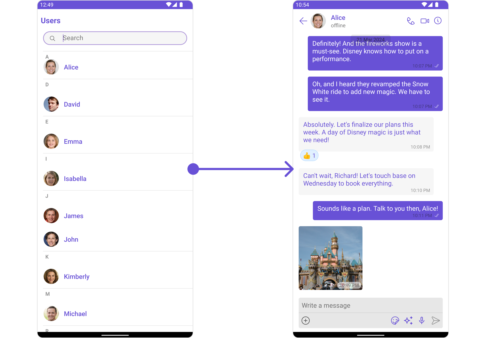
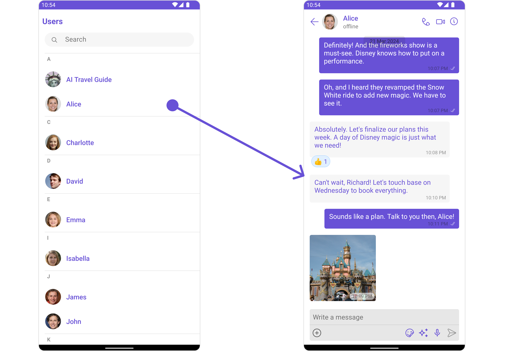
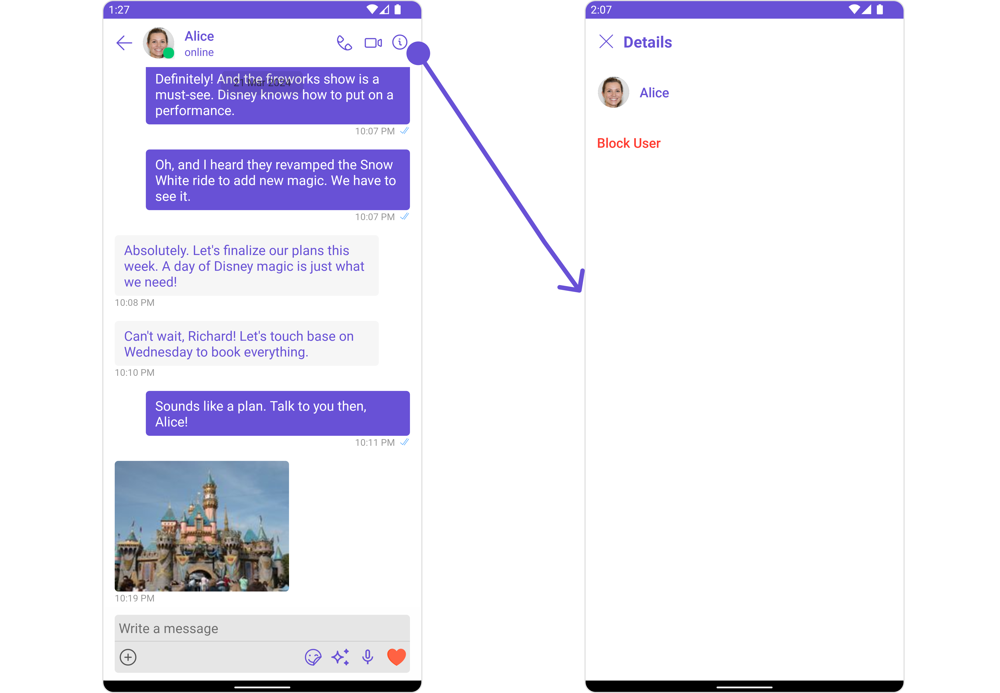
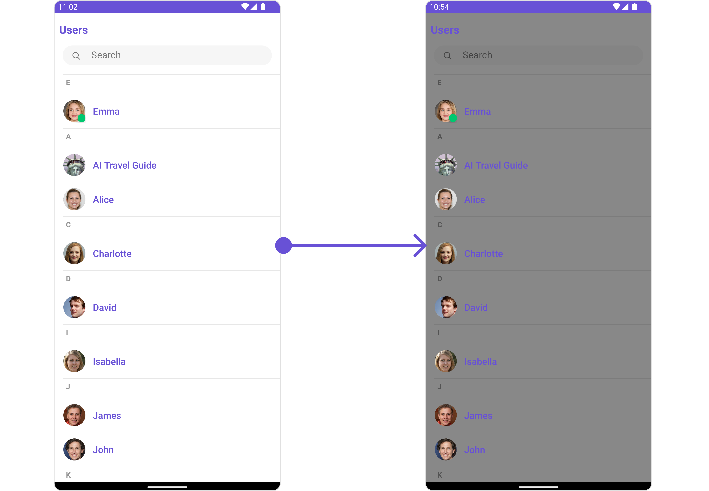

import Tabs from '@theme/Tabs';
import TabItem from '@theme/TabItem';

## Overview

<!-- Component description -->

`CometChatUsersWithMessages` is a [Composite Component](/ui-kit/android/components-overview#components) that seamlessly merges the functionalities of both the [Users](01-Users.md) and [Messages](/ui-kit/android/messages) modules. It empowers users to effortlessly navigate to any individual's chat window by simply clicking on their respective **list item** in the user list.

Additionally, `CometChatUsersWithMessages` inherits and encompasses all attributes available within the `CometChatUsers` module, ensuring a comprehensive user experience.



| Components             | Description                                                                                                                                                                                                                                                                                                              |
| ---------------------- | ------------------------------------------------------------------------------------------------------------------------------------------------------------------------------------------------------------------------------------------------------------------------------------------------------------------------ |
| [Users](01-Users.md)   | `Users` serves as a standalone component designed to establish a screen displaying a list of `users`, providing them with the capability to search for specific individuals. This component operates as a container, inheriting from `CometChatListBase`, and serves as a wrapper for the `CometChatUserList` component. |
| [Messages](./messages) | `Messages` presents the chat interface for both individual `users` and `group` entities. It exhibits a message list containing all interactions where the loggedInUser has sent or received messages from any of these entities.                                                                                         |

## Usage

### Integration

The following code snippet illustrates how you can directly incorporate the Users component into your `layout.xml` file.

<Tabs>
<TabItem value="xml" label="XML">

```xml
<com.cometchat.chatuikit.userswithmessages.CometChatUsersWithMessages
    android:layout_width="match_parent"
    android:layout_height="match_parent"
    android:id="@+id/users_with_messages"
    />
```

</TabItem>
</Tabs>

---

### Actions

[Actions](/ui-kit/android/components-overview#actions) dictate how a component functions. They are divided into two types: Predefined and User-defined. You can override either type, allowing you to tailor the behavior of the component to fit your specific needs.

##### 1. onError

This action doesn't change the behavior of the component but rather listens for any errors that occur in the Conversations component.

<Tabs>

<TabItem value="java" label="Java">
```java title="YourActivity.java"
usersWithMessages.setOnError(new OnError() {
    @Override
    public void onError(Context context, CometChatException e) {
        //Your Exception Handling code.
    }
});
```
</TabItem>

<TabItem value="kotlin" label="Kotlin">

```kotlin title="YourActivity.kt"
usersWithMessages.setOnError(object : OnError {
    override fun onError(context: Context, e: CometChatException) {
        // Your Exception Handling code.
    }
})
```

</TabItem>

</Tabs>

### Filters

**Filters** allow you to customize the data displayed in a list within a Component. You can filter the list based on your specific criteria, allowing for a more customized. Filters can be applied using RequestBuilders of Chat SDK.

While the UsersWithMessages component does not have filters, its components do, For more detail on individual filters of its component refer to [Users Filters](01-Users.md)[ Messages Filters](/ui-kit/android/messages#filters)

By utilizing the [Configurations](#configurations) object of its components, you can apply filters.

In the following **example**, we're sorting `Users` by allowing friends and setting the `limit` to 10 using the `usersRequestBuilder`.

<Tabs>

<TabItem value="Java" label="Java">

```java
UsersConfiguration usersConfiguration = new UsersConfiguration();

UsersRequest.UsersRequestBuilder builder = new UsersRequestUsersRequestBuilder()
        .setLimit(10)
        .friendsOnly(true);
usersConfiguration.setUsersRequestBuilder(builder);
usersWithMessages.setUsersConfiguration(usersConfiguration);
```

</TabItem>

<TabItem value="Kotlin" label="Kotlin">

```kotlin
val usersConfiguration = UsersConfiguration()

val builder = UsersRequest.UsersRequestBuilder()
    .setLimit(10)
    .friendsOnly(true)

usersConfiguration.setUsersRequestBuilder(builder)
usersWithMessages.setUsersConfiguration(usersConfiguration)
```

</TabItem>

</Tabs>

---

### Events

[Events](/ui-kit/android/components-overview#events) are emitted by a `Component`. By using event you can extend existing functionality. Being global events, they can be applied in Multiple Locations and are capable of being Added or Removed.

The `UsersWithMessages` does not produce any events but its component does.

---

## Customization

To fit your app's design requirements, you have the ability to customize the appearance of the
UsersWithMessages component. We provide exposed methods that allow you to modify the experience and behavior according to your specific needs.

### Style

Using **Style** you can **customize** the look and feel of the component in your app, These parameters typically control elements such as the **color**, **size**, **shape**, and **fonts** used within the component.

You can also customize its component styles. For more details on individual component styles, you can refer [Users Styles](/ui-kit/android/users#style) and [Messages Styles](/ui-kit/android/messages#style).

Styles can be applied to SubComponents using their respective configurations.

**Example**

Here we are changing the style of [Users](/ui-kit/android/users) and [Messages](/ui-kit/android/messages) component using [UsersConfiguration](/ui-kit/android/users-with-messages#users) and [MessageConfiguration](/ui-kit/android/users-with-messages#messages)

```java
UsersStyle usersStyle = new UsersStyle();
usersStyle.setBackground(Color.GRAY);
usersStyle.setBorderWidth(30);

UsersConfiguration usersConfiguration =new UsersConfiguration();
usersConfiguration.setStyle(usersStyle);

usersWithMessages.setUsersConfiguration(usersConfiguration);

MessagesStyle messagesStyle = new MessagesStyle();
messagesStyle.setBackground(Color.BLACK);

MessagesConfiguration messagesConfiguration =new MessagesConfiguration();
messagesConfiguration.setStyle(messagesStyle);

usersWithMessages.setMessagesConfiguration(messagesConfiguration);
```

### Functionality

These are a set of **small functional customizations** that allow you to **fine-tune** the overall experience of the component. With these, you can **change text**, set **custom icons**, and toggle the **visibility** of UI elements.

UsersWithMessages component does not have any available functionality. You can use Functional customisation its [Components](/ui-kit/android/components-overview#components). For more details on individual component functionalities, you can refer [Users Functionalities](/ui-kit/android/users#functionality) and [Messages functionalities](/ui-kit/android/messages#functionality).

---

### Advanced

For advanced-level customization, you can set custom views to the component. This lets you tailor each aspect of the component to fit your exact needs and application aesthetics. You can create and define your own views, layouts, and UI elements and then incorporate those into the component.

UsersWithMessages component does not have any advanced-level customization . You can use Advanced customisation its [Components](/ui-kit/android/components-overview#components). For more details on individual component functionalities, you can refer [Users Advanced](/ui-kit/android/users#advanced) and [Messages Advanced](/ui-kit/android/messages#advanced).

UsersWithMessages uses advanced-level customization of both Users & Messages components to achieve its default behavior.

1. UsersWithMessages utilizes the [Itemclicklistener](/ui-kit/android/users#2-itemclicklistener) function of the `Users` subcomponent to navigate the [User](01-Users.md) to [Messages](/ui-kit/android/messages)



2. UsersWithMessages utilizes the [SetMenu](01-Users.md) function of the `Messages` subcomponent to navigatefrom [Messages](/ui-kit/android/messages) to Details.



:::warning

When you override `.setMenu()`, the default behavior of **UsersWithMessages** will also be overridden.

:::

## Configurations

[Configurations](/ui-kit/android/components-overview#configurations) offer the ability to customize the properties of each component within a Composite Component.

**UsersWithMessages** has `Users` and `Messages` component. Hence, each of these components will have its individual `Configuration`. `Configurations` expose properties that are available in its individual components.

---

#### Users

You can customize the properties of the Users component by making use of the UsersConfiguration. You can accomplish this by employing the following method as demonstrated below:

<Tabs>

<TabItem value="Java" label="Java">

```java
UsersConfiguration usersConfiguration =new UsersConfiguration();

usersWithMessages.setUsersConfiguration(usersConfiguration);
```

</TabItem>

<TabItem value="Kotlin" label="Kotlin">

```kotlin
val usersConfiguration = UsersConfiguration()
usersWithMessages.setUsersConfiguration(usersConfiguration)
```

</TabItem>

</Tabs>

All exposed properties of `UsersConfiguration` can be found under [Users](./users#configuration). Properties marked with the <a data-tooltip-id="my-tooltip-html-prop"><span class="material-icons red">report</span></a> symbol are not accessible within the Configuration Object.

**Example**

Let's say you want to change the style of the Users subcomponent

You can modify the style using the `UsersStyle` method.



<Tabs>

<TabItem value="Java" label="Java">

```java
UsersStyle usersStyle = new UsersStyle();
usersStyle.setBackground(Color.GRAY);
UsersConfiguration usersConfiguration =new UsersConfiguration();
usersConfiguration.setStyle(usersStyle);
usersWithMessages.setUsersConfiguration(usersConfiguration);
```

</TabItem>

</Tabs>

---

#### Messages

You can customize the properties of the Messages component by making use of the `messagesConfiguration`. You can accomplish this by employing the `messagesConfiguration` as demonstrated below:

<Tabs>

<TabItem value="java" label="Java">

```java
MessagesConfiguration messagesConfiguration =new MessagesConfiguration();
usersWithMessages.setMessagesConfiguration(messagesConfiguration);
```

</TabItem>

</Tabs>
All exposed properties of `MessagesConfiguration` can be found under [Messages](./messages#configuration). Properties marked with the <a data-tooltip-id="my-tooltip-html-prop"><span class="material-icons red">report</span></a> symbol are not accessible within the Configuration Object.

**Example**

Let's say you want to change the style of the Messages subcomponent and, in addition, you want to hide message composer.

You can modify the style using the `messagesStyle` method and hide using `hide(messageComposer: bool)` method.


<Tabs>

<TabItem value="java" label="Java">

```java
MessagesStyle messagesStyle = new MessagesStyle();
 messagesStyle.setBackground(Color.GRAY);
 MessagesConfiguration messagesConfiguration =new MessagesConfiguration();
 messagesConfiguration.setHideMessageComposer(true);
 messagesConfiguration.setStyle(messagesStyle);
```

</TabItem>

</Tabs>

import { Tooltip } from 'react-tooltip'
import 'react-tooltip/dist/react-tooltip.css'

<Tooltip
  id="my-tooltip-html-prop"
  html="Not available in Configuration Object"
/>
