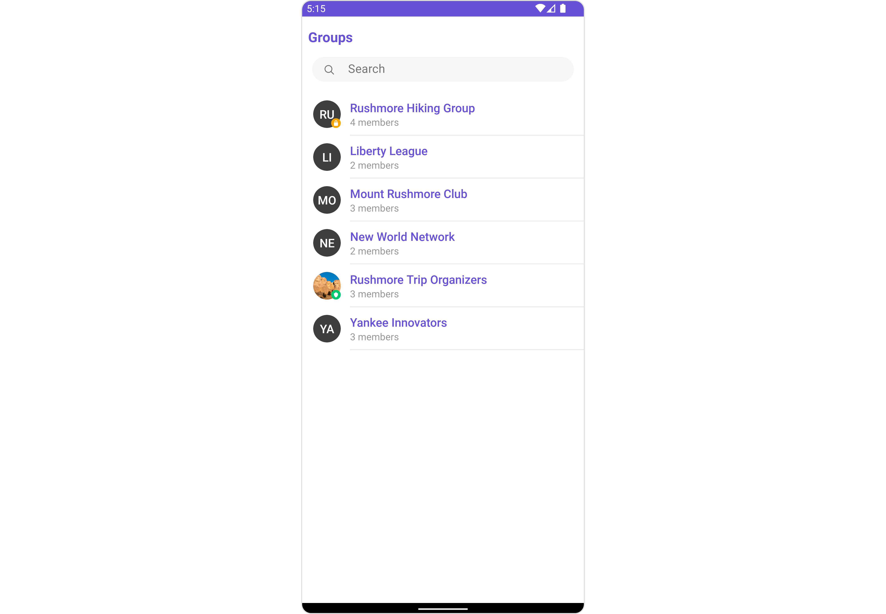
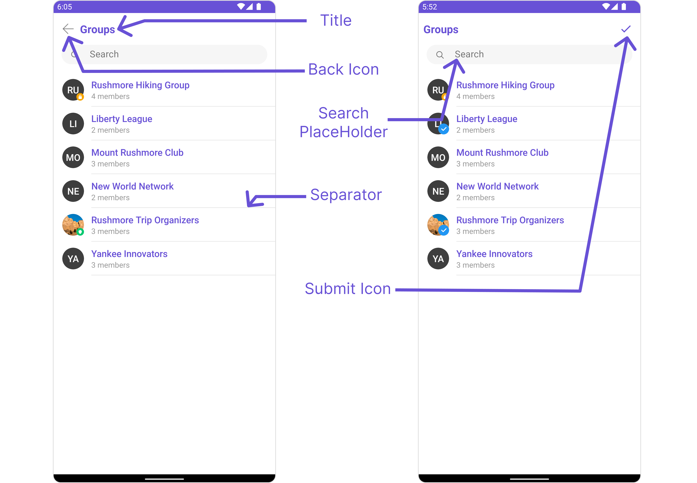
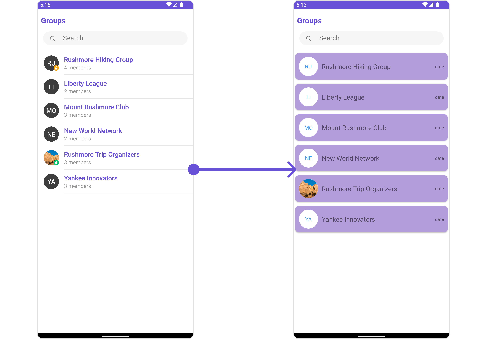
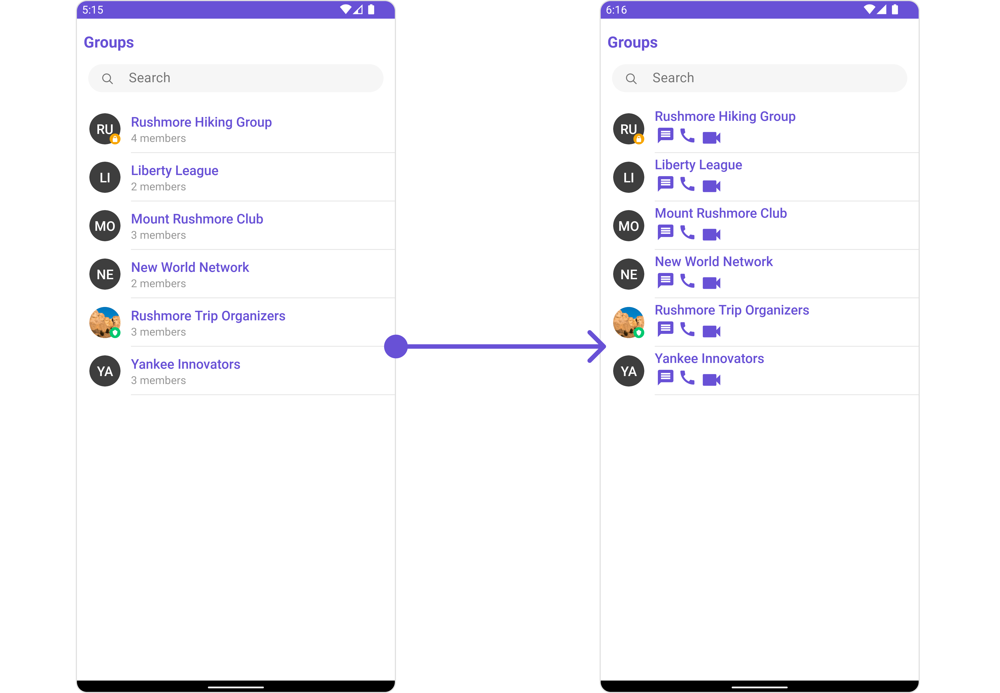
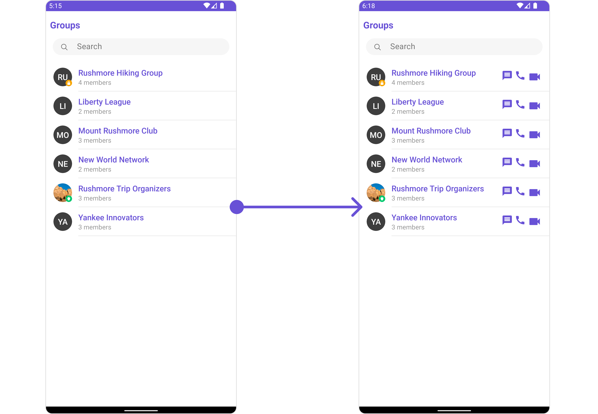
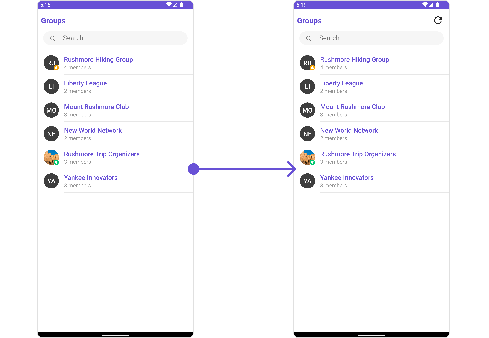
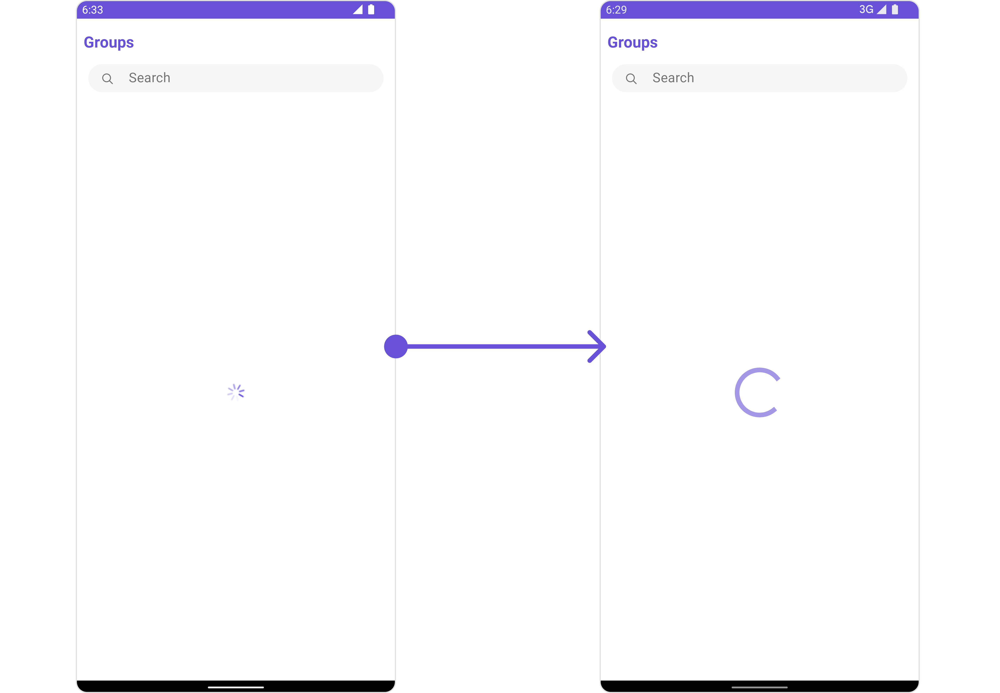
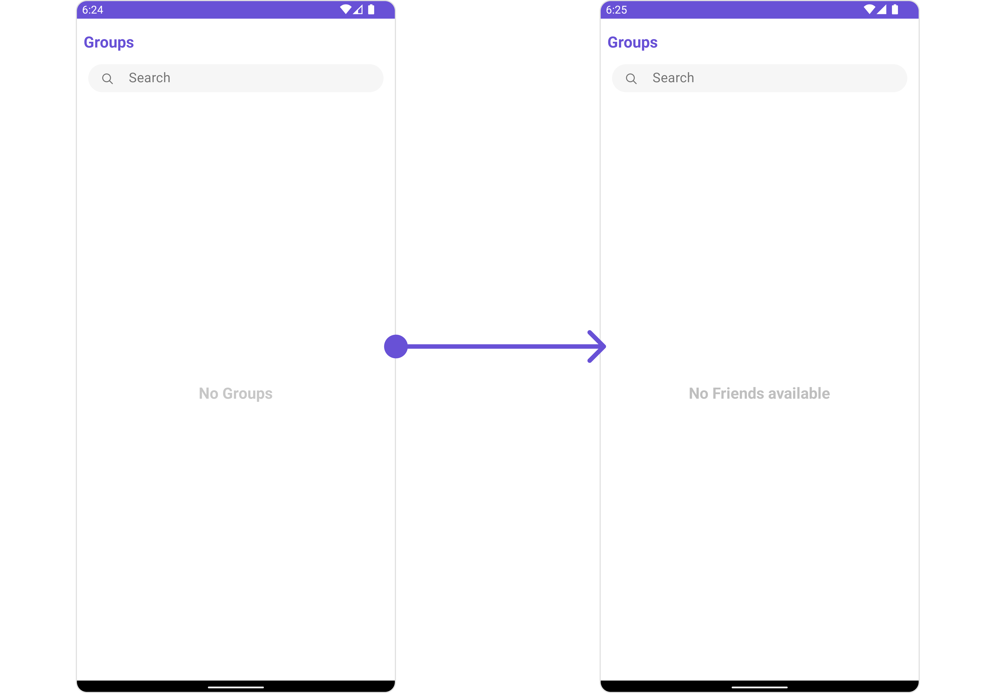
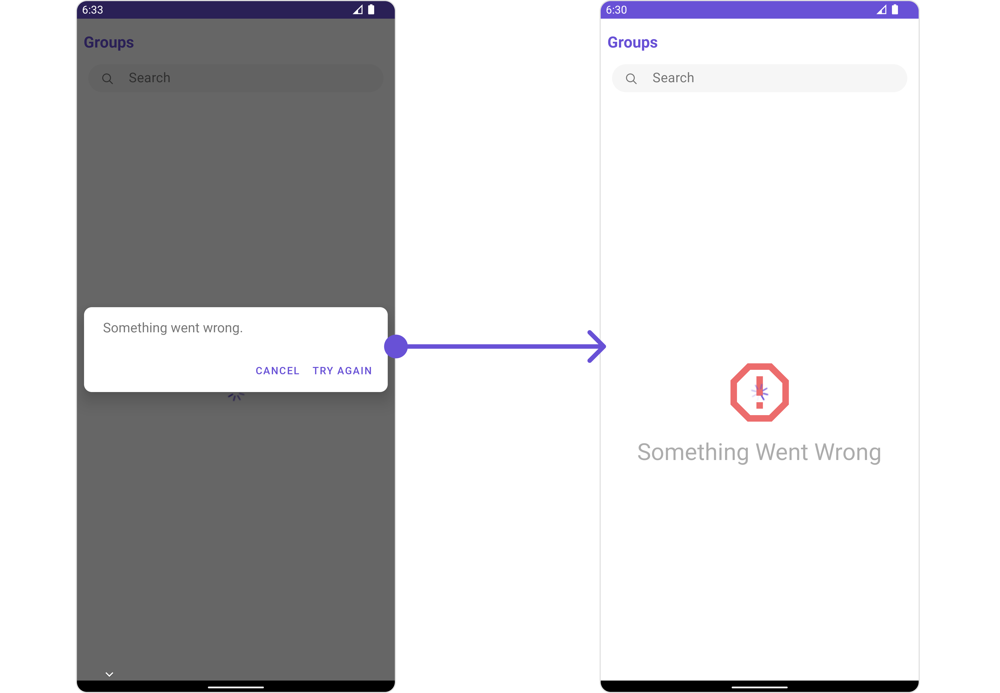

import Tabs from '@theme/Tabs';
import TabItem from '@theme/TabItem';

## Overview

`CometChatGroups` functions as a standalone [component](/ui-kit/android/components-overview#components) designed to create a screen displaying a list of groups, with the added functionality of enabling users to search for specific groups. Acting as a container component, CometChatGroups encapsulates and formats the `CometChatListBase` and `CometChatGroupList` components without introducing any additional behavior of its own.



The `Groups` component is composed of the following BaseComponents:

| Components                                     | Description                                                                                                                                     |
| ---------------------------------------------- | ----------------------------------------------------------------------------------------------------------------------------------------------- |
| [CometChatListBase](/ui-kit/android/list-base) | `CometChatListBase` is a container component having a title, search box, customizable `background`, and a List View                             |
| [CometChatListItem](/ui-kit/android/list-item) | `CometChatListItem` is a component that renders data obtained from a Group object on a Tile having a title, subtitle, leading and trailing view |

---

## Usage

---

### Integration

The following code snippet illustrates how you can can launch `CometChatGroups`.

<Tabs>

<TabItem value="xml" label="XML">

```xml
<com.cometchat.chatuikit.groups.CometChatGroups
    android:id="@+id/groups"
    android:layout_height="match_parent"
    android:layout_width="match_parent" />
```

</TabItem>

</Tabs>

---

### Actions

[Actions](/ui-kit/android/components-overview#actions) dictate how a component functions. They are divided into two types: Predefined and User-defined. You can override either type, allowing you to tailor the behavior of the component to fit your specific needs.

##### 1. OnSelection

The `OnSelection` event is activated when you select the done icon in the Menubar while in selection mode. This returns a list of all the groups that you have selected.

This action does not come with any predefined behavior. However, you have the flexibility to override this event and tailor it to suit your needs using the following code snippet.

<Tabs>

<TabItem value="Java" label="Java">

```Java
cometchatGroups.setOnSelection(new CometChatGroups.OnSelection() {
    @Override
    public void onSelection(List<Group> list) {
        // Your custom Action
    }
});
```

</TabItem>

<TabItem value="Kotlin" label="Kotlin">

```Kotlin
cometchatGroups.setOnSelection(CometChatGroups.OnSelection {
    // Your custom Action
})
```

</TabItem>

</Tabs>

---

##### 2. ItemClickListener

The `OnItemClickListener` event is activated when you click on the GroupList item. This action does not come with any predefined behavior.

However, you have the flexibility to override this event and tailor it to suit your needs using the following code snippet.

<Tabs>

<TabItem value="Java" label="Java">

```Java
cometchatGroups.setItemClickListener(new OnItemClickListener<Group>() {
    @Override
    public void OnItemClick(Group group, int i) {
        // Your custom Action
    }
});
```

</TabItem>

<TabItem value="Kotlin" label="Kotlin">

```Kotlin
cometchatGroups.setItemClickListener(object : OnItemClickListener<Group?>() {
    fun OnItemClick(group: Group?, i: Int) {
        // Your custom Action
    }
})
```

</TabItem>

</Tabs>

---

##### 3. BackPressListener

The `OnBackPressListener` function is built to respond when you tap the back button in the Toolbar of the activity.

By default, this action has a predefined behavior: it simply closes the current activity. However, the flexibility of CometChat UI Kit allows you to override this standard behavior according to your application's specific requirements. You can define a custom action that will be performed instead when the back button is pressed.

<Tabs>

<TabItem value="Java" label="Java">

```Java
cometchatGroups.addOnBackPressListener(new CometChatListBase.OnBackPress() {
    @Override
    public void onBack() {
        // Your custom Action
    }
});
```

</TabItem>

<TabItem value="Kotlin" label="Kotlin">

```Kotlin
cometchatGroups.addOnBackPressListener(CometChatListBase.OnBackPress {
    // Your custom Action
})
```

</TabItem>

</Tabs>

---

##### 4. onError

This action doesn't change the behavior of the component but rather listens for any errors that occur in the Group component.

<Tabs>

<TabItem value="Java" label="Java">

```Java
cometchatGroups.setOnError(new OnError() {
    @Override
    public void onError(Context context, CometChatException e) {
        // Your custom Action
    }
});
```

</TabItem>

<TabItem value="Kotlin" label="Kotlin">

```Kotlin
cometchatGroups.setOnError(object : OnError() {
    fun onError(context: Context?, e: CometChatException?) {
        // Your custom Action
    }
})
```

</TabItem>

</Tabs>

---

### Filters

Filters allow you to customize the data displayed in a list within a Component. You can filter the list based on your specific criteria, allowing for a more customized. Filters can be applied using RequestBuilders of Chat SDK.

##### 1. GroupsRequestBuilder

The [GroupsRequestBuilder](/sdk/android/retrieve-groups) enables you to filter and customize the group list based on available parameters in GroupsRequestBuilder. This feature allows you to create more specific and targeted queries when fetching groups. The following are the parameters available in [GroupsRequestBuilder](/sdk/android/retrieve-groups)

| Property           | Description                                                                                                         | Code                        |
| ------------------ | ------------------------------------------------------------------------------------------------------------------- | --------------------------- |
| **Limit**          | Configure the maximum number of groups to fetch in a single request, optimizing pagination for smoother navigation. | `.setLimit(Int)`            |
| **Search Keyword** | Employed to retrieve groups that match the provided string, facilitating precise searches.                          | `.setSearchKeyWord(String)` |
| **Joined Only**    | Exclusively fetches joined groups.                                                                                  | `.joinedOnly(boolean)`      |
| **Tags**           | Utilized to fetch groups containing the specified tags.                                                             | `.setTags(List<String>)`    |
| **With Tags**      | Utilized to retrieve groups with specific tags.                                                                     | `.withTags(boolean)`        |

**Example**

In the example below, we are applying a filter to the Group List based on only joined groups.

<Tabs>

<TabItem value="Java" label="Java">

```Java
GroupsRequest.GroupsRequestBuilder builder = new GroupsRequest.GroupsRequestBuilder().setLimit(10).joinedOnly(true);
cometchatGroups.setGroupsRequestBuilder(builder);
```

</TabItem>

<TabItem value="Kotlin" label="Kotlin">

```Kotlin
val builder = GroupsRequestBuilder().setLimit(10).joinedOnly(true)
cometchatGroups.setGroupsRequestBuilder(builder)
```

</TabItem>

</Tabs>

---

##### 2. SearchRequestBuilder

The SearchRequestBuilder uses [GroupsRequestBuilder](/sdk/android/retrieve-groups) enables you to filter and customize the search list based on available parameters in GroupsRequestBuilder.
This feature allows you to keep uniformity between the displayed Groups List and searched Group List.

**Example**

<Tabs>

<TabItem value="Java" label="Java">

```Java
GroupsRequest.GroupsRequestBuilder builder = new GroupsRequest.GroupsRequestBuilder().setLimit(10).setSearchKeyWord("**");
cometchatGroups.setSearchRequestBuilder(builder);
```

</TabItem>

<TabItem value="Kotlin" label="Kotlin">

```Kotlin
val builder = GroupsRequestBuilder().setLimit(10).setSearchKeyWord("**")
cometchatGroups.setSearchRequestBuilder(builder)
```

</TabItem>

</Tabs>

---

### Events

[Events](/ui-kit/android/components-overview#events) are emitted by a `Component`. By using event you can extend existing functionality. Being global events, they can be applied in Multiple Locations and are capable of being Added or Removed.

The list of events emitted by the Groups component is as follows.

| Events                        | Description                                                                                                |
| ----------------------------- | ---------------------------------------------------------------------------------------------------------- |
| `ccGroupCreated()`            | This will get triggered when the logged in user creates a group                                            |
| `ccGroupDeleted()`            | This will get triggered when the logged in user deletes a group                                            |
| `ccGroupLeft()`               | This will get triggered when the logged in user leaves a group                                             |
| `ccGroupMemberScopeChanged()` | This will get triggered when the logged in user changes the scope of another group member                  |
| `ccGroupMemberBanned()`       | This will get triggered when the logged in user bans a group member from the group                         |
| `ccGroupMemberKicked()`       | This will get triggered when the logged in user kicks another group member from the group                  |
| `ccGroupMemberUnbanned()`     | This will get triggered when the logged in user unbans a user banned from the group                        |
| `ccGroupMemberJoined()`       | This will get triggered when the logged in user joins a group                                              |
| `ccGroupMemberAdded()`        | This will get triggered when the logged in user add new members to the group                               |
| `ccOwnershipChanged`          | This will get triggered when the logged in user transfer the ownership of their group to some other member |

##### 1. Add `CometChatGroupEvents` Listener's

<Tabs>

<TabItem value="Java" label="Java">

```Java
CometChatGroupEvents.addGroupListener("LISTENER_TAG", new CometChatGroupEvents() {
    @Override
    public void ccGroupCreated(Group group) {
        super.ccGroupCreated(group);
    }

    @Override
    public void ccGroupDeleted(Group group) {
        super.ccGroupDeleted(group);
    }

    @Override
    public void ccGroupLeft(Action actionMessage, User leftUser, Group leftGroup) {
        super.ccGroupLeft(actionMessage, leftUser, leftGroup);
    }

    @Override
    public void ccGroupMemberJoined(User joinedUser, Group joinedGroup) {
        super.ccGroupMemberJoined(joinedUser, joinedGroup);
    }

    @Override
    public void ccGroupMemberAdded(List<Action> actionMessages, List<User> usersAdded, Group userAddedIn, User addedBy) {
        super.ccGroupMemberAdded(actionMessages, usersAdded, userAddedIn, addedBy);
    }

    @Override
    public void ccGroupMemberKicked(Action actionMessage, User kickedUser, User kickedBy, Group kickedFrom) {
        super.ccGroupMemberKicked(actionMessage, kickedUser, kickedBy, kickedFrom);
    }

    @Override
    public void ccGroupMemberBanned(Action actionMessage, User bannedUser, User bannedBy, Group bannedFrom) {
        super.ccGroupMemberBanned(actionMessage, bannedUser, bannedBy, bannedFrom);
    }

    @Override
    public void ccGroupMemberUnBanned(Action actionMessage, User unbannedUser, User unBannedBy, Group unBannedFrom) {
        super.ccGroupMemberUnBanned(actionMessage, unbannedUser, unBannedBy, unBannedFrom);
    }

    @Override
    public void ccGroupMemberScopeChanged(Action actionMessage, User updatedUser, String scopeChangedTo, String scopeChangedFrom, Group group) {
        super.ccGroupMemberScopeChanged(actionMessage, updatedUser, scopeChangedTo, scopeChangedFrom, group);
    }

    @Override
    public void ccOwnershipChanged(Group group, GroupMember newOwner) {
        super.ccOwnershipChanged(group, newOwner);
    }
});
```

</TabItem>

<TabItem value="Kotlin" label="Kotlin">

```Kotlin
CometChatGroupEvents.addGroupListener("LISTENER_TAG", object : CometChatGroupEvents() {
    override fun ccGroupCreated(group: Group?) {
        super.ccGroupCreated(group)
    }

    override fun ccGroupDeleted(group: Group?) {
        super.ccGroupDeleted(group)
    }

    override fun ccGroupLeft(actionMessage: Action?, leftUser: User?, leftGroup: Group?) {
        super.ccGroupLeft(actionMessage, leftUser, leftGroup)
    }

    override fun ccGroupMemberJoined(joinedUser: User?, joinedGroup: Group?) {
        super.ccGroupMemberJoined(joinedUser, joinedGroup)
    }

    override fun ccGroupMemberAdded(
        actionMessages: List<Action?>?,
        usersAdded: List<User?>?,
        userAddedIn: Group?,
        addedBy: User?
    ) {
        super.ccGroupMemberAdded(actionMessages, usersAdded, userAddedIn, addedBy)
    }

    override fun ccGroupMemberKicked(
        actionMessage: Action?,
        kickedUser: User?,
        kickedBy: User?,
        kickedFrom: Group?
    ) {
        super.ccGroupMemberKicked(actionMessage, kickedUser, kickedBy, kickedFrom)
    }

    override fun ccGroupMemberBanned(
        actionMessage: Action?,
        bannedUser: User?,
        bannedBy: User?,
        bannedFrom: Group?
    ) {
        super.ccGroupMemberBanned(actionMessage, bannedUser, bannedBy, bannedFrom)
    }

    override fun ccGroupMemberUnBanned(
        actionMessage: Action?,
        unbannedUser: User?,
        unBannedBy: User?,
        unBannedFrom: Group?
    ) {
        super.ccGroupMemberUnBanned(actionMessage, unbannedUser, unBannedBy, unBannedFrom)
    }

    override fun ccGroupMemberScopeChanged(
        actionMessage: Action?,
        updatedUser: User?,
        scopeChangedTo: String?,
        scopeChangedFrom: String?,
        group: Group?
    ) {
        super.ccGroupMemberScopeChanged(
            actionMessage,
            updatedUser,
            scopeChangedTo,
            scopeChangedFrom,
            group
        )
    }

    override fun ccOwnershipChanged(group: Group?, newOwner: GroupMember?) {
        super.ccOwnershipChanged(group, newOwner)
    }
})
```

</TabItem>

</Tabs>

---

##### 2. Removing `CometChatGroupEvents` Listener's

<Tabs>

<TabItem value="Java" label="Java">

```Java
CometChatGroupEvents.removeListeners();
```

</TabItem>

<TabItem value="Kotlin" label="Kotlin">

```Kotlin
CometChatGroupEvents.removeListeners()
```

</TabItem>

</Tabs>

---

## Customization

To fit your app's design requirements, you can customize the appearance of the groups component. We provide exposed methods that allow you to modify the experience and behavior according to your specific needs.

### Style

Using Style you can customize the look and feel of the component in your app, These parameters typically control elements such as the color, size, shape, and fonts used within the component.

##### 1. Groups Style

Enhance your Groups Component by setting the GroupsStyle to customize its appearance.

<Tabs>

<TabItem value="Java" label="Java">

```Java
GroupsStyle groupsStyle = new GroupsStyle();
groupsStyle.setBackground(Color.BLACK);
groupsStyle.setCornerRadius(25f);
cometchatGroups.setStyle(groupsStyle);
```

</TabItem>

<TabItem value="Kotlin" label="Kotlin">

```Kotlin
val groupsStyle = GroupsStyle()
groupsStyle.background = Color.BLACK
groupsStyle.cornerRadius = 25f
cometchatGroups.style = groupsStyle
```

</TabItem>

</Tabs>

List of properties exposed by GroupsStyle

| Property                 | Description                                                                                                         | Code                                      |
| ------------------------ | ------------------------------------------------------------------------------------------------------------------- | ----------------------------------------- |
| **Background**           | Used to set the background color                                                                                    | `setBackground(@ColorInt int) `           |
| **BorderWidth**          | Used to set border width                                                                                            | `setBorderWidth(int) `                    |
| **BorderColor**          | Used to set border color                                                                                            | `setBorderColor(@ColorInt int) `          |
| **CornerRadius**         | Used to set border radius                                                                                           | `setCornerRadius(float) `                 |
| **Background**           | Used to set background Drawable                                                                                     | `setBackground(Drawable) `                |
| **TitleAppearance**      | Used to customise the appearance of the title in the app bar                                                        | `setTitleAppearance(@StyleRes int) `      |
| **BackIconTint**         | Used to set the color of the back icon in the app bar                                                               | `setBackIconTint(@ColorInt int) `         |
| **SearchBackground**     | Used to set the background color of the search box                                                                  | `setSearchBackground(@ColorInt int) `     |
| **SearchBorderRadius**   | Used to set the border radius of the search box                                                                     | `setSearchBorderRadius(int) `             |
| **SearchIconTint**       | Used to set the color of the search icon in the search box                                                          | `setSearchIconTint(@ColorInt int) `       |
| **SearchBorderWidth**    | Used to set the border width of the search box                                                                      | `setSearchBorderWidth(int) `              |
| **SearchTextAppearance** | Used to set the style of the text in the search box                                                                 | `setSearchTextAppearance(@StyleRes int) ` |
| **LoadingIconTint**      | Used to set the color of the icon shown while the list of group members is being fetched                            | `setLoadingIconTint(@ColorInt int) `      |
| **EmptyTextAppearance**  | Used to set the style of the response text shown when fetchig the list of group members has returned an empty list  | `setEmptyTextAppearance(@StyleRes int) `  |
| **ErrorTextAppearance**  | Used to set the style of the response text shown in case some error occurs while fetching the list of group members | `setErrorTextAppearance(@StyleRes int) `  |
| **SeparatorColor**       | Used to set the color of the divider separating the group member items                                              | `setSeparatorColor(@ColorInt int) `       |

---

##### 2. Avatar Style

To apply customized styles to the `Avatar` component in the Groups Component, you can use the following code snippet. For further insights on `Avatar` Styles [refer](/ui-kit/android/avatar)

<Tabs>

<TabItem value="Java" label="Java">

```Java
AvatarStyle avatarStyle = new AvatarStyle();
avatarStyle.setBorderWidth(10);
avatarStyle.setBorderColor(Color.BLACK);
cometchatGroups.setAvatarStyle(avatarStyle);
```

</TabItem>

<TabItem value="Kotlin" label="Kotlin">

```Kotlin
val avatarStyle = AvatarStyle()
avatarStyle.borderWidth = 10
avatarStyle.borderColor = Color.BLACK
cometchatGroups.setAvatarStyle(avatarStyle)
```

</TabItem>

</Tabs>

---

##### 3. StatusIndicator Style

To apply customized styles to the Status Indicator component in the Groups Component, You can use the following code snippet. For further insights on Status Indicator Styles [refer](/ui-kit/android/status-indicator)

<Tabs>

<TabItem value="Java" label="Java">

```Java
StatusIndicatorStyle statusIndicatorStyle = new StatusIndicatorStyle();
statusIndicatorStyle.setCornerRadius(3.5f);
statusIndicatorStyle.setBorderColor(Color.GREEN);
cometchatGroups.setStatusIndicatorStyle(statusIndicatorStyle);
```

</TabItem>

<TabItem value="Kotlin" label="Kotlin">

```Kotlin
val statusIndicatorStyle = StatusIndicatorStyle()
statusIndicatorStyle.cornerRadius = 3.5f
statusIndicatorStyle.borderColor = Color.GREEN
cometchatGroups.setStatusIndicatorStyle(statusIndicatorStyle)
```

</TabItem>

</Tabs>

---

##### 4. ListItem Style

To apply customized styles to the `List Item` component in the `Groups` Component, you can use the following code snippet. For further insights on `List Item` Styles [refer](/ui-kit/android/list-item)

<!--  -->

<Tabs>

<TabItem value="Java" label="Java">

```Java
ListItemStyle listItemStyle = new ListItemStyle();
listItemStyle.setBackground(R.color.purple_200);
listItemStyle.setBorderWidth(2);
listItemStyle.setBorderColor(R.color.purple_700);
listItemStyle.setCornerRadius(20);
cometchatGroups.setListItemStyle(listItemStyle);
```

</TabItem>

<TabItem value="Kotlin" label="Kotlin">

```Kotlin
val listItemStyle = ListItemStyle()
listItemStyle.setBackground(R.color.purple_200)
listItemStyle.setBorderWidth(2)
listItemStyle.setBorderColor(R.color.purple_700)
listItemStyle.setCornerRadius(20f)
cometchatGroups.setListItemStyle(listItemStyle)
```

</TabItem>

</Tabs>

---

### Functionality

These are a set of small functional customizations that allow you to fine-tune the overall experience of the component. With these, you can change text, set custom icons, and toggle the visibility of UI elements.

<Tabs>

<TabItem value="Java" label="Java">

```Java
CometChatGroups cometChatGroups = findViewById(R.id.groups);
cometchatGroups.setTitle("Contacts");
cometchatGroups.showBackButton(true);
cometchatGroups.backIconTint(getResources().getColor(R.color.black));
```

</TabItem>

<TabItem value="Kotlin" label="Kotlin">

```Kotlin
val cometChatGroups : CometChatGroups = findViewById(R.id.groups)
cometchatGroups.title = "Contacts"
cometchatGroups.showBackButton(true)
cometchatGroups.backIconTint = ContextCompat.getColor(this, R.color.black)
```

</TabItem>

</Tabs>



Below is a list of customizations along with corresponding code snippets

| Property                      | Description                                                                              | Code                                            |
| ----------------------------- | ---------------------------------------------------------------------------------------- | ----------------------------------------------- |
| **Set Title**                 | Used to set title in the app bar                                                         | `.setTitle("Your custom title")`                |
| **Set SearchPlaceholderText** | Used to set search placeholder text                                                      | `.setSearchPlaceholderText("Your custom Text")` |
| **BackIcon**                  | Used to set back button icon                                                             | `.backIcon(@DrawableRes int res)`               |
| **Show BackButton**           | Used to toggle visibility for back button                                                | `.showBackButton(boolean)`                      |
| **Set SearchBoxIcon**         | Used to set search Icon in the search field                                              | `.setSearchBoxIcon(@DrawableRes int res)`       |
| **Hide Search**               | Used to toggle visibility for search box                                                 | `.hideSearch(boolean)`                          |
| **Hide Error**                | Used to hide error on fetching groups                                                    | `.hideError(boolean)`                           |
| **Hide Separator**            | Used to hide the divider separating the group items                                      | `.hideSeparator(boolean)`                       |
| **Set SubmitIcon**            | Used to override the default selection complete icon                                     | `.setSubmitIcon(@DrawableRes int res)`          |
| **EmptyState Text**           | Used to set a custom text response when fetching the groups has returned an empty list   | `.emptyStateText("Your Text")`                  |
| **ErrorState Text**           | Used to set a custom text response when some error occurs on fetching the list of groups | `.errorStateText("Your Text")`                  |
| **Private Group Icon**        | Used to set the private group Icon                                                       | `.setPrivateGroupIcon(@DrawableRes int res)`    |

---

### Advanced

For advanced-level customization, you can set custom views to the component. This lets you tailor each aspect of the component to fit your exact needs and application aesthetics. You can create and define your views, layouts, and UI elements and then incorporate those into the component.

#### SetListItemView

With this function, you can assign a custom ListItem to the Conversations Component.

<Tabs>

<TabItem value="Java" label="Java">

```Java
cometchatGroups.setListItemView(new GroupsViewHolderListener() {
    @Override
    public View createView(Context context, CometChatListItem cometChatListItem) {
        return null;
    }

    @Override
    public void bindView(Context context, View view, Group group, RecyclerView.ViewHolder viewHolder, List<Group> list, int i) {

    }
});
```

</TabItem>

<TabItem value="Kotlin" label="Kotlin">

```Kotlin
cometchatGroups.setListItemView(object : GroupsViewHolderListener() {
    override fun createView(
        context: Context?,
        cometChatListItem: CometChatListItem?
    ): View? {
        return null
    }

    override fun bindView(
        context: Context?,
        view: View?,
        group: Group?,
        viewHolder: RecyclerView.ViewHolder?,
        list: List<Group?>?,
        i: Int
    ) {

    }
})
```

</TabItem>

</Tabs>

**Example**



You can indeed create a custom layout file named `item_list.xml` for more complex or unique list items.

Once this layout file is made, you would inflate it inside the `createView()` method of the `GroupsViewHolderListener`. The inflation process prepares the layout for use in your application:

Following this, you would use the `bindView()` method to initialize and assign values to your individual views. This could include setting text on TextViews, images on ImageViews, and so on based on the properties of the Group object:

```xml title="item_list.xml"
<?xml version="1.0" encoding="utf-8"?>
<RelativeLayout xmlns:android="http://schemas.android.com/apk/res/android"
    xmlns:app="http://schemas.android.com/apk/res-auto"
    xmlns:tools="http://schemas.android.com/tools"
    android:layout_width="match_parent"
    android:layout_height="match_parent">

    <androidx.cardview.widget.CardView
        android:layout_width="match_parent"
        android:layout_height="wrap_content"
        android:layout_margin="5dp"
        android:elevation="10dp"
        app:cardBackgroundColor="@color/purple_500"
        app:cardCornerRadius="10dp">

        <RelativeLayout
            android:layout_width="match_parent"
            android:layout_height="wrap_content">

            <com.cometchat.chatuikit.shared.views.CometChatAvatar.CometChatAvatar
                android:id="@+id/item_avatar"
                android:layout_width="50dp"
                android:layout_height="50dp"
                android:layout_centerVertical="true"
                android:layout_margin="10dp"
                android:padding="10dp" />

            <TextView
                android:id="@+id/txt_item_name"
                android:layout_width="match_parent"
                android:layout_height="wrap_content"
                android:layout_centerVertical="true"
                android:layout_toRightOf="@+id/item_avatar"
                android:text="name"
                android:textSize="17sp" />

            <TextView
                android:id="@+id/txt_item_date"
                android:layout_width="wrap_content"
                android:layout_height="wrap_content"
                android:layout_alignParentEnd="true"
                android:layout_centerVertical="true"
                android:layout_margin="10dp"
                android:text="date"
                android:textSize="12sp" />
        </RelativeLayout>
    </androidx.cardview.widget.CardView>
</RelativeLayout>
```

<Tabs>

<TabItem value="Java" label="Java">

```Java title="YourActivity.java"
cometchatGroups.setListItemView(new GroupsViewHolderListener() {
    @Override
    public View createView(Context context, CometChatListItem cometChatListItem) {
        View view = getLayoutInflater().inflate(R.layout.item_list, null);
        return view;
    }

    @Override
    public void bindView(Context context, View view, Group group, RecyclerView.ViewHolder viewHolder, List<Group> list, int i) {
        CometChatAvatar avatarView = view.findViewById(R.id.item_avatar);
        avatarView.setRadius(100);
        TextView nameView = view.findViewById(R.id.txt_item_name);
        nameView.setText(group.getName());
        avatarView.setImage(group.getIcon(),group.getName());
    }
});
```

</TabItem>

<TabItem value="Kotlin" label="Kotlin">

```Kotlin title="YourActivity.kt"
cometchatGroups.setListItemView(object : GroupsViewHolderListener() {
    override fun createView(
        context: Context?,
        cometChatListItem: CometChatListItem?
    ): View {
        val view: View = layoutInflater.inflate(R.layout.item_list, null)
        return view
    }

    override fun bindView(
        context: Context?,
        view: View,
        group: Group,
        viewHolder: RecyclerView.ViewHolder?,
        list: List<Group?>?,
        i: Int
    ) {
        val avatarView = view.findViewById<CometChatAvatar>(R.id.item_avatar)
        avatarView.radius = 100f
        val nameView = view.findViewById<TextView>(R.id.txt_item_name)
        nameView.setText(group.getName())
        avatarView.setImage(group.getIcon(), group.getName())
    }
})
```

</TabItem>

</Tabs>

---

#### SetSubTitleView

You can customize the subtitle view for each conversation item to meet your requirements

<Tabs>

<TabItem value="Java" label="Java">

```Java
GroupsViewHolderListener groupsViewHolderListener = new GroupsViewHolderListener(){
    @Override
    public View createView(Context context, CometChatListItem cometChatListItem) {
        return null;
    }

    @Override
    public void bindView(Context context, View view, Group group, RecyclerView.ViewHolder viewHolder, List<Group> list, int i) {

    }
};
cometchatGroups.setSubtitleView(groupsViewHolderListener);
```

</TabItem>

<TabItem value="Kotlin" label="Kotlin">

```Kotlin
val groupsViewHolderListener: GroupsViewHolderListener =
    object : GroupsViewHolderListener() {
        override fun createView(
            context: Context?,
            cometChatListItem: CometChatListItem?
        ): View? {
            return null
        }

        override fun bindView(
            context: Context?,
            view: View?,
            group: Group?,
            viewHolder: RecyclerView.ViewHolder?,
            list: List<Group?>?,
            i: Int
        ) {

        }
    }
cometchatGroups.setSubtitleView(groupsViewHolderListener)
```

</TabItem>

</Tabs>

**Example**



You can indeed create a custom layout file named `subtitle_layout.xml` for more complex or unique list items.

Once this layout file is made, you would inflate it inside the `createView()` method of the `GroupsViewHolderListener`. The inflation process prepares the layout for use in your application:

Following this, you would use the `bindView()` method to initialize and assign values to your individual views. This could include setting text on TextViews, images on ImageViews, and so on based on the properties of the Group object:

```xml title="subtitle_layout.xml"
<?xml version="1.0" encoding="utf-8"?>
<RelativeLayout xmlns:android="http://schemas.android.com/apk/res/android"
    android:layout_width="match_parent"
    android:layout_height="match_parent">

    <TextView
        android:id="@+id/txt_subtitle"
        android:layout_width="wrap_content"
        android:layout_height="wrap_content"
        android:text="Subtitle" />

    <ImageView
        android:id="@+id/img_conversation"
        android:layout_width="wrap_content"
        android:layout_height="wrap_content"
        android:layout_below="@+id/txt_subtitle"
        android:layout_margin="2dp"
        android:src="@drawable/ic_message_grey" />

    <ImageView
        android:id="@+id/img_audio_call"
        android:layout_width="wrap_content"
        android:layout_height="wrap_content"
        android:layout_below="@+id/txt_subtitle"
        android:layout_margin="2dp"
        android:layout_toEndOf="@+id/img_conversation"
        android:src="@drawable/ic_call" />

    <ImageView
        android:id="@+id/img_video_call"
        android:layout_width="wrap_content"
        android:layout_height="wrap_content"
        android:layout_below="@+id/txt_subtitle"
        android:layout_margin="2dp"
        android:layout_toEndOf="@+id/img_audio_call"
        android:src="@drawable/ic_video" />

</RelativeLayout>
```

<Tabs>

<TabItem value="Java" label="Java">

```Java title="YourActivity.java"
GroupsViewHolderListener groupsViewHolderListener = new GroupsViewHolderListener(){
    @Override
    public View createView(Context context, CometChatListItem cometChatListItem) {
        View view = getLayoutInflater().inflate(R.layout.subtitle_layout, null);
        return view;
    }

    @Override
    public void bindView(Context context, View view, Group group, RecyclerView.ViewHolder viewHolder, List<Group> list, int i) {
        TextView txtSubtitle = view.findViewById(R.id.txt_subtitle);
        ImageView imgConversation = view.findViewById(R.id.img_conversation);
        ImageView imgAudioCall = view.findViewById(R.id.img_audio_call);;
        ImageView imgVideCall = view.findViewById(R.id.img_video_call);;
        txtSubtitle.setText(group.getName());
        imgConversation.setOnClickListener(v -> {
            Toast.makeText(context, "Conversation Clicked", Toast.LENGTH_SHORT).show();
        });
        imgAudioCall.setOnClickListener(v -> {
            Toast.makeText(context, "Audio Call Clicked", Toast.LENGTH_SHORT).show();
        });
        imgVideCall.setOnClickListener(v -> {
            Toast.makeText(context, "Video Call Clicked", Toast.LENGTH_SHORT).show();
        });
    }
};
cometchatGroups.setSubtitleView(groupsViewHolderListener);
```

</TabItem>

<TabItem value="Kotlin" label="Kotlin">

```Kotlin title="YourActivity.kt"
val groupsViewHolderListener: GroupsViewHolderListener =
    object : GroupsViewHolderListener() {
        override fun createView(
            context: Context?,
            cometChatListItem: CometChatListItem?
        ): View {
            val view: View = layoutInflater.inflate(R.layout.subtitle_layout, null)
            return view
        }

        override fun bindView(
            context: Context?,
            view: View,
            group: Group,
            viewHolder: RecyclerView.ViewHolder?,
            list: List<Group?>?,
            i: Int
        ) {
            val txtSubtitle = view.findViewById<TextView>(R.id.txt_subtitle)
            val imgConversation = view.findViewById<ImageView>(R.id.img_conversation)
            val imgAudioCall = view.findViewById<ImageView>(R.id.img_audio_call)

            val imgVideCall = view.findViewById<ImageView>(R.id.img_video_call)

            txtSubtitle.setText(group.getName())
            imgConversation.setOnClickListener { v: View? ->
                Toast.makeText(context, "Conversation Clicked", Toast.LENGTH_SHORT).show()
            }
            imgAudioCall.setOnClickListener { v: View? ->
                Toast.makeText(context, "Audio Call Clicked", Toast.LENGTH_SHORT).show()
            }
            imgVideCall.setOnClickListener { v: View? ->
                Toast.makeText(context, "Video Call Clicked", Toast.LENGTH_SHORT).show()
            }
        }
    }
cometchatGroups.setSubtitleView(groupsViewHolderListener)
```

</TabItem>

</Tabs>

---

#### SetTailView

Used to generate a custom trailing view for the GroupList item. You can add a Tail view using the following method.

<Tabs>

<TabItem value="Java" label="Java">

```Java
cometchatGroups.setTailView(new GroupsViewHolderListener() {
    @Override
    public View createView(Context context, CometChatListItem cometChatListItem) {
        return null;
    }

    @Override
    public void bindView(Context context, View view, Group group, RecyclerView.ViewHolder viewHolder, List<Group> list, int i) {

    }
});
```

</TabItem>

<TabItem value="Kotlin" label="Kotlin">

```Kotlin
cometchatGroups.setTailView(object : GroupsViewHolderListener() {
    override fun createView(
        context: Context?,
        cometChatListItem: CometChatListItem?
    ): View? {
        return null
    }

    override fun bindView(
        context: Context?,
        view: View?,
        group: Group?,
        viewHolder: RecyclerView.ViewHolder?,
        list: List<Group?>?,
        i: Int
    ) {

    }
})
```

</TabItem>

</Tabs>

**Example**



You can indeed create a custom layout file named `tail_view_layout.xml` for more complex or unique list items.

Once this layout file is made, you would inflate it inside the `createView()` method of the `GroupsViewHolderListener`. The inflation process prepares the layout for use in your application:

Following this, you would use the `bindView()` method to initialize and assign values to your individual views. This could include setting text on TextViews, images on ImageViews, and so on based on the properties of the Group object:

```xml title="tail_view_layout.xml"
<?xml version="1.0" encoding="utf-8"?>
<RelativeLayout xmlns:android="http://schemas.android.com/apk/res/android"
    android:layout_width="match_parent"
    android:layout_height="match_parent">

    <TextView
        android:id="@+id/txt_subtitle"
        android:layout_width="wrap_content"
        android:layout_height="wrap_content"
        android:text="Subtitle" />

    <ImageView
        android:id="@+id/img_conversation"
        android:layout_width="wrap_content"
        android:layout_height="wrap_content"
        android:layout_below="@+id/txt_subtitle"
        android:layout_margin="2dp"
        android:src="@drawable/ic_message_grey" />

    <ImageView
        android:id="@+id/img_audio_call"
        android:layout_width="wrap_content"
        android:layout_height="wrap_content"
        android:layout_below="@+id/txt_subtitle"
        android:layout_margin="2dp"
        android:layout_toRightOf="@+id/img_conversation"
        android:src="@drawable/ic_call" />

    <ImageView
        android:id="@+id/img_video_call"
        android:layout_width="wrap_content"
        android:layout_height="wrap_content"
        android:layout_below="@+id/txt_subtitle"
        android:layout_margin="2dp"
        android:layout_toRightOf="@+id/img_audio_call"
        android:src="@drawable/ic_video" />

</RelativeLayout>
```

<Tabs>

<TabItem value="Java" label="Java">

```Java title="YourActivity.java"
cometchatGroups.setTailView(new GroupsViewHolderListener() {
    @Override
    public View createView(Context context, CometChatListItem cometChatListItem) {
        View view = getLayoutInflater().inflate(R.layout.subtitle_layout, null);
        return view;
    }

    @Override
    public void bindView(Context context, View view, Group group, RecyclerView.ViewHolder viewHolder, List<Group> list, int i) {
        TextView txtSubtitle = view.findViewById(R.id.txt_subtitle);
        ImageView imgConversation = view.findViewById(R.id.img_conversation);
        ImageView imgAudioCall = view.findViewById(R.id.img_audio_call);;
        ImageView imgVideCall = view.findViewById(R.id.img_video_call);;
        txtSubtitle.setText(group.getName());
        imgConversation.setOnClickListener(v -> {
            Toast.makeText(context, "Conversation Clicked", Toast.LENGTH_SHORT).show();
        });
        imgAudioCall.setOnClickListener(v -> {
            Toast.makeText(context, "Audio Call Clicked", Toast.LENGTH_SHORT).show();
        });
        imgVideCall.setOnClickListener(v -> {
            Toast.makeText(context, "Video Call Clicked", Toast.LENGTH_SHORT).show();
        });
    }
});
```

</TabItem>

<TabItem value="Kotlin" label="Kotlin">

```Kotlin title="YourActivity.kt"
cometchatGroups.setTailView(object : GroupsViewHolderListener() {
    override fun createView(
        context: Context?,
        cometChatListItem: CometChatListItem?
    ): View {
        val view: View = layoutInflater.inflate(R.layout.subtitle_layout, null)
        return view
    }

    override fun bindView(
        context: Context?,
        view: View,
        group: Group,
        viewHolder: RecyclerView.ViewHolder?,
        list: List<Group?>?,
        i: Int
    ) {
        val txtSubtitle = view.findViewById<TextView>(R.id.txt_subtitle)
        val imgConversation = view.findViewById<ImageView>(R.id.img_conversation)
        val imgAudioCall = view.findViewById<ImageView>(R.id.img_audio_call)

        val imgVideCall = view.findViewById<ImageView>(R.id.img_video_call)

        txtSubtitle.setText(group.getName())
        imgConversation.setOnClickListener { v: View? ->
            Toast.makeText(context, "Conversation Clicked", Toast.LENGTH_SHORT).show()
        }
        imgAudioCall.setOnClickListener { v: View? ->
            Toast.makeText(context, "Audio Call Clicked", Toast.LENGTH_SHORT).show()
        }
        imgVideCall.setOnClickListener { v: View? ->
            Toast.makeText(context, "Video Call Clicked", Toast.LENGTH_SHORT).show()
        }
    }
})
```

</TabItem>

</Tabs>

---

#### SetMenu

You can set the Custom Menu view to add more options to the Groups component.

<Tabs>

<TabItem value="Java" label="Java">

```Java
cometchatGroups.setMenu(View v);
```

</TabItem>

<TabItem value="Kotlin" label="Kotlin">

```Kotlin
cometchatGroups.setMenu(v)
```

</TabItem>

</Tabs>

**Example**



You need to create a `view_menu.xml` as a custom view file. Which we will inflate and pass to `.setMenu()`.

```xml title="view_menu.xml"
<?xml version="1.0" encoding="utf-8"?>
<LinearLayout xmlns:android="http://schemas.android.com/apk/res/android"
    xmlns:app="http://schemas.android.com/apk/res-auto"
    xmlns:tools="http://schemas.android.com/tools"
    android:layout_width="match_parent"
    android:layout_height="match_parent"
    android:orientation="horizontal"
    tools:context=".MainActivity">

    <ImageView
        android:id="@+id/img_refresh"
        android:layout_width="30dp"
        android:layout_height="30dp"
        android:src="@drawable/ic_refresh_black" />

</LinearLayout>
```

You inflate the view and pass it to `setMenu`. You can get the child view reference and can handle click actions.

<Tabs>

<TabItem value="Java" label="Java">

```Java title="YourActivity.java"
View view = getLayoutInflater().inflate(R.layout.view_menu, null);
ImageView imgRefresh = view.findViewById(R.id.img_refresh);
imgRefresh.setOnClickListener(v -> {
    Toast.makeText(requireContext(), "Clicked on Refresh", Toast.LENGTH_SHORT).show();
});
cometchatGroups.setMenu(view);
```

</TabItem>

<TabItem value="Kotlin" label="Kotlin">

```Kotlin title="YourActivity.kt"
val view: View = layoutInflater.inflate(R.layout.view_menu, null)
val imgRefresh = view.findViewById<ImageView>(R.id.img_refresh)
imgRefresh.setOnClickListener { v: View? ->
    Toast.makeText(requireContext(), "Clicked on Refresh", Toast.LENGTH_SHORT).show()
}
cometchatGroups.setMenu(view)
```

</TabItem>

</Tabs>

---

#### SetLoadingStateView

You can set a custom loader view using `setLoadingStateView` to match the loading view of your app.

<Tabs>

<TabItem value="Java" label="Java">

```Java
cometchatGroups.setLoadingStateView();
```

</TabItem>

<TabItem value="Kotlin" label="Kotlin">

```Kotlin
cometchatGroups.setLoadingStateView()
```

</TabItem>

</Tabs>

**Example**



We have added a `ContentLoadingProgressBar` to `loading_view_layout.xml`. You can choose any view you prefer. This view should be inflated and passed to the `setLoadingStateView()` method.

```xml title="loading_view_layout.xml"
<?xml version="1.0" encoding="utf-8"?>
<FrameLayout xmlns:android="http://schemas.android.com/apk/res/android"
    android:layout_width="match_parent"
    android:layout_height="match_parent"
    android:layout_gravity="center_vertical">

    <androidx.core.widget.ContentLoadingProgressBar
        style="?android:attr/progressBarStyleLarge"
        android:layout_width="wrap_content"
        android:layout_height="wrap_content"
        android:layout_gravity="center_horizontal" />

</FrameLayout>
```

<Tabs>

<TabItem value="Java" label="Java">

```Java title="YourActivity.java"
cometchatGroups.setLoadingStateView(R.layout.loading_view_layout);
```

</TabItem>

<TabItem value="Kotlin" label="Kotlin">

```Kotlin title="YourActivity.kt"
cometchatGroups.setLoadingStateView(R.layout.loading_view_layout)
```

</TabItem>

</Tabs>

---

#### SetEmptyStateView

You can set a custom `EmptyStateView` using `setEmptyStateView` to match the empty view of your app.

<Tabs>

<TabItem value="Java" label="Java">

```Java
cometchatGroups.setEmptyStateView();
```

</TabItem>

<TabItem value="Kotlin" label="Kotlin">

```Kotlin
cometchatGroups.setEmptyStateView()
```

</TabItem>

</Tabs>

**Examples**



We have added an error view to `empty_view_layout.xml`. You can choose any view you prefer. This view should be inflated and passed to the `setEmptyStateView()` method.

```xml title="empty_view_layout.xml"
<?xml version="1.0" encoding="utf-8"?>
<RelativeLayout xmlns:android="http://schemas.android.com/apk/res/android"
    android:layout_width="match_parent"
    android:layout_height="match_parent"
    android:layout_gravity="center_vertical">

    <TextView
        android:id="@+id/txt_title"
        android:layout_width="wrap_content"
        android:layout_height="wrap_content"
        android:layout_centerInParent="true"
        android:text="No Friends available"
        android:textColor="@color/cometchat_grey"
        android:textSize="20sp"
        android:textStyle="bold" />

</RelativeLayout>
```

<Tabs>

<TabItem value="Java" label="Java">

```Java title="YourActivity.java"
cometchatGroups.setEmptyStateView(R.layout.empty_view_layout);
```

</TabItem>
<TabItem value="Kotlin" label="Kotlin">

```Kotlin title="YourActivity.kt"
cometchatGroups.setEmptyStateView(R.layout.empty_view_layout)
```

</TabItem>

</Tabs>

---

#### SetErrorStateView

You can set a custom `ErrorStateView` using `setErrorStateView` to match the error view of your app.

<Tabs>

<TabItem value="Java" label="Java">

```Java
cometchatGroups.setErrorStateView();
```

</TabItem>

<TabItem value="Kotlin" label="Kotlin">

```Kotlin
cometchatGroups.setErrorStateView()
```

</TabItem>

</Tabs>

**Example**



We have added an error view to `error_state_view_layout.xml`. You can choose any view you prefer. This view should be inflated and passed to the `setErrorStateView()` method.

```xml title="error_state_view_layout.xml"
<?xml version="1.0" encoding="utf-8"?>
<RelativeLayout xmlns:android="http://schemas.android.com/apk/res/android"
    android:layout_width="match_parent"
    android:layout_height="match_parent">

    <ImageView
        android:id="@+id/img_error"
        android:layout_width="100dp"
        android:layout_height="100dp"
        android:layout_centerInParent="true"
        android:src="@drawable/ic_error" />

    <TextView
        android:layout_width="wrap_content"
        android:layout_height="wrap_content"
        android:layout_below="@+id/img_error"
        android:layout_centerHorizontal="true"
        android:layout_marginTop="50dp"
        android:text="Something Went Wrong"
        android:textSize="30sp" />

</RelativeLayout>
```

<Tabs>

<TabItem value="Java" label="Java">

```Java title="YourActivity.java"
cometchatGroups.setErrorStateView(R.layout.error_state_view_layout);
```

</TabItem>
<TabItem value="Kotlin" label="Kotlin">
"
```Kotlin title="YourActivity.kt"
cometchatGroups.setErrorStateView(R.layout.error_state_view_layout);
```

</TabItem>

</Tabs>

---
