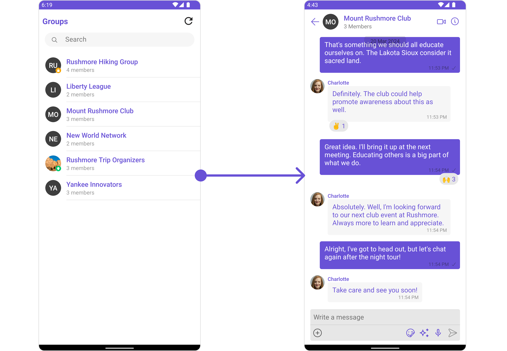
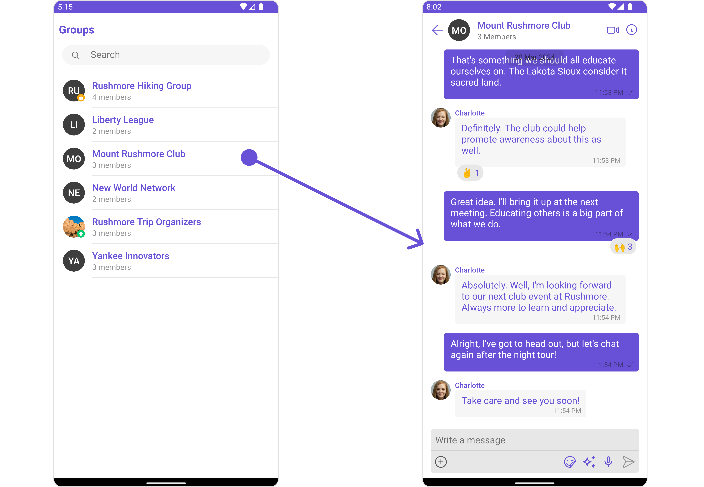
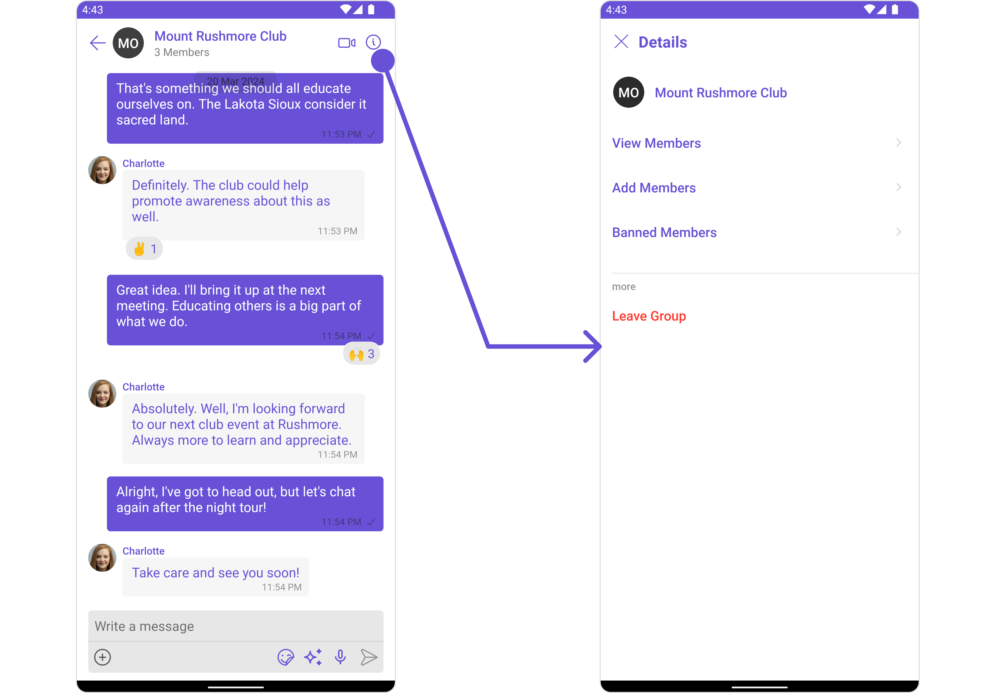
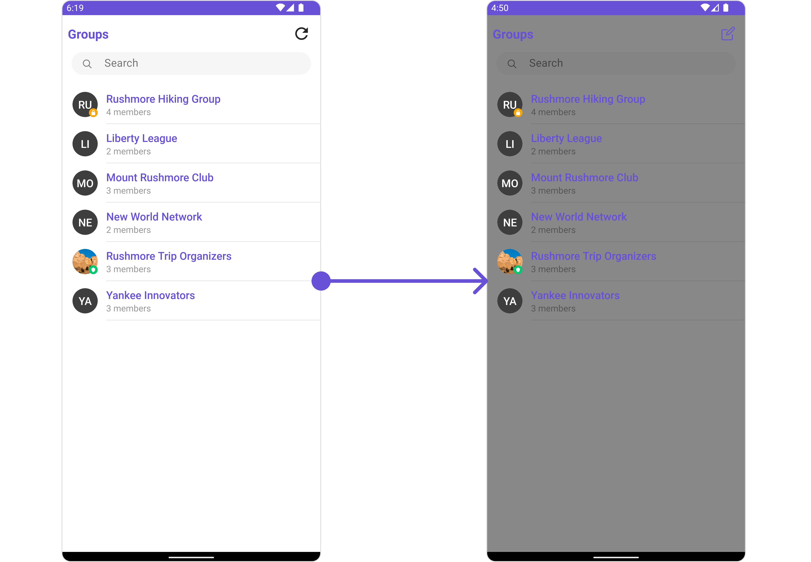
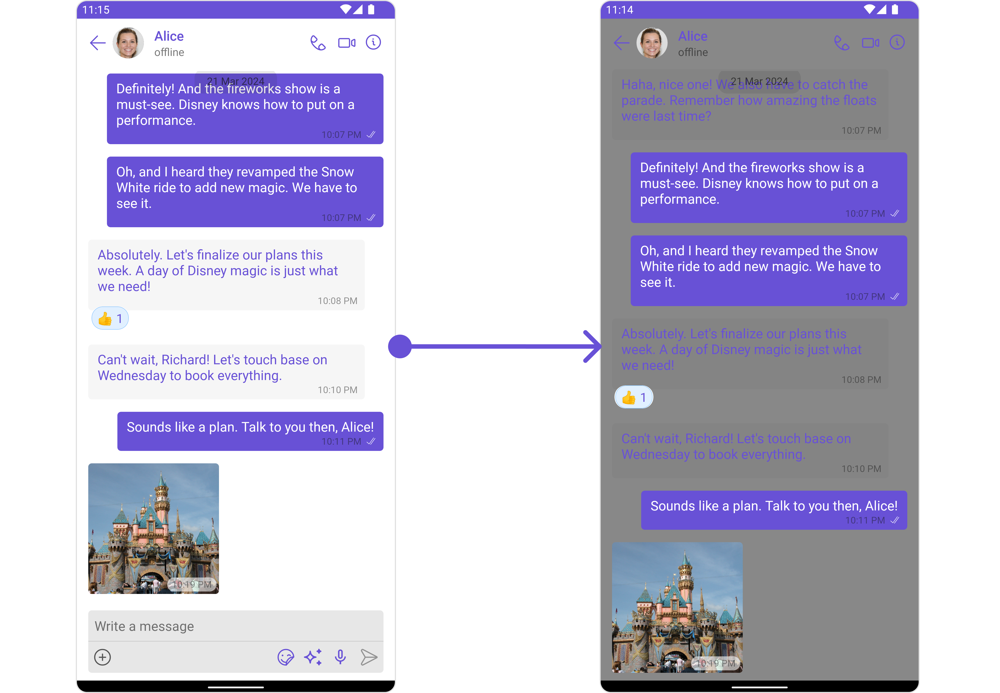
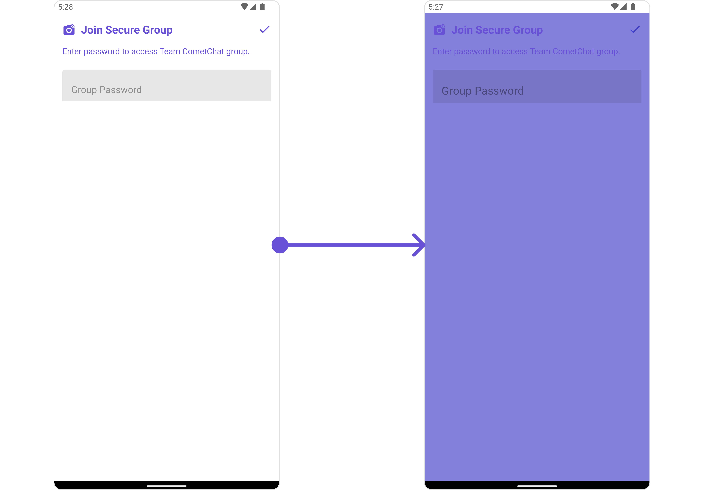

import Tabs from '@theme/Tabs';
import TabItem from '@theme/TabItem';

## Overview

`CometChatGroupsWithMessages` is a [Composite Component](/ui-kit/android/components-overview#composite-components) encapsulating functionalities from the [Groups](/ui-kit/android/groups) and [Messages](/ui-kit/android/messages) components. Serving as a versatile wrapper, it seamlessly integrates with CometChatMessages, enabling users to open the module by clicking on any group within the list. This component inherits the behavior of Groups, fostering consistency and familiarity in user interactions.



| Components                           | Description                                                                                                                    |
| ------------------------------------ | ------------------------------------------------------------------------------------------------------------------------------ |
| [Groups](/ui-kit/android/groups)     | The `Groups` component is designed to display a list of `Groups`. This essentially represents the recent conversation history. |
| [Messages](/ui-kit/android/messages) | The `Messages` component is designed to manage the messaging interaction for `Group's` conversations.                          |

---

## Usage

### Integration

As `CometChatGroupsWithMessages` is a [Composite Component](/ui-kit/android/components-overview#components), it can be effortlessly added directly in response to a button click or any event. Leveraging all the customizable properties and methods inherited from Groups, this component offers seamless integration and extensive customization capabilities. This makes it a versatile solution for enhancing user interaction within your application.

`CometChatGroupsWithMessages` can be launched by adding the following code snippet into XML layout file.

<Tabs>
<TabItem value="xml" label="XML">

```xml
<com.cometchat.chatuikit.groupswithmessages.CometChatGroupsWithMessages
    android:id="@+id/groupsWithMessages"
    android:layout_width="match_parent"
    android:layout_height="match_parent" />
```

</TabItem>
</Tabs>

---

##### Activity and Fragment

You can integrate `CometChatGroupsWithMessages` into your Activity and Fragment by adding the following code snippets into the respective classes.

<Tabs>
<TabItem value="Java (Activity)" label="Java (Activity)">

```Java title="YourActivity.java"
@Override
protected void onCreate(Bundle savedInstanceState) {
    super.onCreate(savedInstanceState);
    setContentView(new CometChatGroupsWithMessages(this));
}
```

</TabItem>

<TabItem value="Kotlin (Activity)" label="Kotlin (Activity)">

```Java title="YourActivity.kt"
override fun onCreate(savedInstanceState: Bundle?) {
    super.onCreate(savedInstanceState)
    setContentView(CometChatGroupsWithMessages(this))
}
```

</TabItem>

<TabItem value="Java (Fragment)" label="Java (Fragment)">

```Java title="YourFragment.java"
@Override
public View onCreateView(LayoutInflater inflater, ViewGroup container, Bundle savedInstanceState) {
    return new CometChatGroupsWithMessages(requireContext());
}
```

</TabItem>

<TabItem value="Kotlin (Fragment)" label="Kotlin (Fragment)">

```Kotlin title="YourFragment.kt"
fun onCreateView(
    inflater: LayoutInflater?, container: ViewGroup?,
    savedInstanceState: Bundle?
): View? {
    return CometChatGroupsWithMessages(requireContext())
}
```

</TabItem>
</Tabs>

In all the above examples, `CometChatGroupsWithMessages` is the custom view class that you want to set as the content of your activity or the view for your fragment. This will display the CometChat groups with messages in your activity or fragment.

---

### Actions

[Actions](/ui-kit/android/components-overview#actions) dictate how a component functions. They are divided into two types: Predefined and User-defined. You can override either type, allowing you to tailor the behavior of the component to fit your specific needs.

##### 1. onError

This action doesn't change the behavior of the component but rather listens for any errors that occur in the Conversations component.

<Tabs>

<TabItem value="Java" label="Java">
```Java
cometchatGroupsWithMessages.setOnError(new OnError() {
    @Override
    public void onError(Context context, CometChatException e) {
        //Your Exception Handling code.
    }
});
```
</TabItem>

<TabItem value="Kotlin" label="Kotlin">
```Kotlin
cometchatGroupsWithMessages.setOnError(object : OnError() {
    fun onError(context: Context?, e: CometChatException?) {
        //Your Exception Handling code.
    }
})
```
</TabItem>

</Tabs>

---

### Filters

**Filters** allow you to customize the data displayed in a list within a Component. You can filter the list based on your specific criteria, allowing for a more customized. Filters can be applied using RequestBuilders of Chat SDK.

While the GroupWithMessages component does not have filters, its components do, For more detail on individual filters of its component refer to [Group Filters](/ui-kit/android/groups#filters)

---

### Events

[Events](/ui-kit/android/components-overview#events) are emitted by a `Component`. By using event you can extend existing functionality. Being global events, they can be applied in Multiple Locations and are capable of being Added or Removed.

The `CometChatGroupsWithMessages` does not produce any events but its component does.

---

## Customization

To fit your app's design requirements, you have the ability to customize the appearance of the `CometChatGroupsWithMessages` component. We provide exposed methods that allow you to modify the experience and behavior according to your specific needs.

### Style

Using **Style** you can **customize** the look and feel of the component in your app, These parameters typically control elements such as the **color**, **size**, **shape**, and **fonts** used within the component.

You can also customize its component styles. For more details on individual component styles, you can refer [Groups Styles](/ui-kit/android/groups#style) and [Messages Styles](/ui-kit/android/messages#style).

Styles can be applied to SubComponents using their respective configurations.

**Example**

Here we are changing the style of [Groups](/ui-kit/android/groups) and [Messages](/ui-kit/android/messages) component using [GroupsConfiguration](/ui-kit/android/groups-with-messages#groups) and [MessageConfiguration](/ui-kit/android/groups-with-messages#messages)

<Tabs>

<TabItem value="Java" label="Java">
```Java
// Configure and apply group and message styling in a CometChatGroupsWithMessages

// Step 1: Create a GroupsStyle object to define group visual styling
GroupsStyle groupsStyle = new GroupsStyle();

// Step 2: Set the background color of the group to gray
groupsStyle.setBackground(Color.GRAY);

// Step 3: Set the border width of the group to 30 units
groupsStyle.setBorderWidth(30);

// Step 4: Create a GroupsConfiguration object to hold the group styling configuration
GroupsConfiguration groupsConfiguration = new GroupsConfiguration();

// Step 5: Apply the defined group style to the GroupsConfiguration object
groupsConfiguration.setStyle(groupsStyle);

// Step 6: Apply the GroupsConfiguration to the CometChat groups and messages component
cometchatGroupsWithMessages.setGroupsConfiguration(groupsConfiguration);

// Step 7: Create a MessagesStyle object to define message visual styling
MessagesStyle messagesStyle = new MessagesStyle();

// Step 8: Set the background color of the messages to black
messagesStyle.setBackground(Color.BLACK);

// Step 9: Create a MessagesConfiguration object to hold the message styling configuration
MessagesConfiguration messagesConfiguration = new MessagesConfiguration();

// Step 10: Apply the defined message style to the MessagesConfiguration object
messagesConfiguration.setStyle(messagesStyle);

// Step 11: Apply the MessagesConfiguration to the CometChat groups and messages component
cometchatGroupsWithMessages.setMessagesConfiguration(messagesConfiguration);

````
</TabItem>

<TabItem value="Kotlin" label="Kotlin">
```Kotlin
// Configure and apply group and message styling in a CometChatGroupsWithMessages

// Step 1: Create a GroupsStyle object to define group visual styling
val groupsStyle = GroupsStyle()

// Step 2: Set the background color of the group to gray
groupsStyle.setBackground(Color.GRAY)

// Step 3: Set the border width of the group to 30 units
groupsStyle.setBorderWidth(30)

// Step 4: Create a GroupsConfiguration object to hold the group styling configuration
val groupsConfiguration = GroupsConfiguration()

// Step 5: Apply the defined group style to the GroupsConfiguration object
groupsConfiguration.setStyle(groupsStyle)

// Step 6: Apply the GroupsConfiguration to the CometChat groups and messages component
cometchatGroupsWithMessages.setGroupsConfiguration(groupsConfiguration)

// Step 7: Create a MessagesStyle object to define message visual styling
val messagesStyle = MessagesStyle()

// Step 8: Set the background color of the messages to black
messagesStyle.setBackground(Color.BLACK)

// Step 9: Create a MessagesConfiguration object to hold the message styling configuration
val messagesConfiguration = MessagesConfiguration()

// Step 10: Apply the defined message style to the MessagesConfiguration object
messagesConfiguration.setStyle(messagesStyle)

// Step 11: Apply the MessagesConfiguration to the CometChat groups and messages component
cometchatGroupsWithMessages.setMessagesConfiguration(messagesConfiguration)
````

</TabItem>

</Tabs>

---

### Functionality

These are a set of **small functional customizations** that allow you to **fine-tune** the overall experience of the component. With these, you can **change text**, set **custom icons**, and toggle the **visibility** of UI elements.

CometChatGroupsWithMessages component does not have any available functionality. You can use Functional customisation its [Components](/ui-kit/android/components-overview#components). For more details on individual component functionalities, you can refer [Groups Functionalities](/ui-kit/android/groups#functionality) and [Messages functionalities](/ui-kit/android/messages#functionality).

---

### Advanced

For advanced-level customization, you can set custom views to the component. This lets you tailor each aspect of the component to fit your exact needs and application aesthetics. You can create and define your own views, layouts, and UI elements and then incorporate those into the component.

CometChatGroupsWithMessages component does not have any advanced-level customization . You can use Advanced customisation its [Components](/ui-kit/android/components-overview#components). For more details on individual component functionalities, you can refer [Groups Advanced](/ui-kit/android/groups#advanced) and [Messages Advanced](/ui-kit/android/messages#advanced).

CometChatGroupsWithMessages uses advanced-level customization of both Groups & Messages components to achieve its default behavior.

1. CometChatGroupsWithMessages utilizes the [Itemclicklistener](/ui-kit/android/groups#2-itemclicklistener) function of the `Groups` subcomponent to navigate the [Groups](/ui-kit/android/groups) to [Messages](/ui-kit/android/messages)



<Tabs>

<TabItem value="Java" label="Java">
```Java
cometchatGroupsWithMessages.setItemClickListener(new OnItemClickListener<Group>() {
    @Override
    public void OnItemClick(Group group, int index) {
        // Your action
    }
});

````
</TabItem>

<TabItem value="Kotlin" label="Kotlin">
```Kotlin
cometchatGroupsWithMessages.setItemClickListener(object : OnItemClickListener<Group>() {
    fun OnItemClick(group: Group, i: index) {
        //Your action
    }
})
````

</TabItem>

</Tabs>

:::warning

When you override `.setItemClickListener()`, the default behavior of **CometChatGroupsWithMessages** will also be overridden.

:::

---

2. CometChatGroupsWithMessages utilizes the [SetMenu](/ui-kit/android/groups) function of the `Messages` subcomponent to navigatefrom [Create Group](/ui-kit/android/create-group) to [Details](/ui-kit/android/group-details).



<Tabs>

<TabItem value="Java" label="Java">
```Java
ImageView imageView = new ImageView(requireContext());
imageView.setBackground(AppCompatResources.getDrawable(requireContext(), R.drawable.ic_refresh_black));
imageView.setOnClickListener(new View.OnClickListener() {
    @Override
    public void onClick(View view) {
        
    }
});
cometchatGroupsWithMessages.setMenu(imageView);
```
</TabItem>

<TabItem value="Kotlin" label="Kotlin">
```Kotlin
val imageView = ImageView(requireContext())
imageView.background = AppCompatResources.getDrawable(requireContext(), R.drawable.ic_refresh_black)
imageView.setOnClickListener {

}
cometchatGroupsWithMessages.setMenu(imageView)

````
</TabItem>

</Tabs>

:::warning

When you override `.setMenu()`, the default behavior of **CometChatGroupsWithMessages** will also be overridden.

:::


---

## Configurations

[Configurations](/ui-kit/android/components-overview#configurations) offer the ability to customize the properties of each component within a Composite Component.

**CometChatGroupsWithMessages** has `Groups` and `Messages` component. Hence, each of these components will have its individual `Configuration`. `Configurations` expose properties that are available in its individual components.

#### Groups

You can customize the properties of the Groups component by making use of the GroupsConfiguration. You can accomplish this by employing the following method as demonstrated below:

<Tabs>

<TabItem value="Java" label="Java">

```Java
GroupsConfiguration groupsConfiguration =new GroupsConfiguration();

cometchatGroupsWithMessages.setGroupsConfiguration(groupsConfiguration);
````

</TabItem>

<TabItem value="Kotlin" label="Kotlin">

```kotlin
val groupsConfiguration = GroupsConfiguration()

cometchatGroupsWithMessages.setGroupsConfiguration(groupsConfiguration)
```

</TabItem>

</Tabs>

All exposed properties of `GroupsConfiguration` can be found under [Groups](./groups#configuration). Properties marked with the <a data-tooltip-id="my-tooltip-html-prop"><span class="material-icons red">report</span></a> symbol are not accessible within the Configuration Object.

**Example**

Let's say you want to change the style of the Groups subcomponent

You can modify the style using the `GroupsStyle` method.



<Tabs>

<TabItem value="Java" label="Java">
```Java
GroupsStyle groupsStyle = new GroupsStyle();
groupsStyle.setBackground(Color.GRAY);

GroupsConfiguration groupsConfiguration =new GroupsConfiguration();
groupsConfiguration.setStyle(groupsStyle);

cometchatGroupsWithMessages.setGroupsConfiguration(groupsConfiguration);

````
</TabItem>

<TabItem value="Kotlin" label="Kotlin">
```Kotlin
val groupsStyle = GroupsStyle()
groupsStyle.setBackground(Color.GRAY)

val groupsConfiguration = GroupsConfiguration()
groupsConfiguration.setStyle(groupsStyle)

cometchatGroupsWithMessages.setGroupsConfiguration(groupsConfiguration)
````

</TabItem>

</Tabs>

---

#### Messages

You can customize the properties of the Messages component by making use of the `messagesConfiguration`. You can accomplish this by employing the `messagesConfiguration` as demonstrated below:

<Tabs>

<TabItem value="Java" label="Java">

```Java
MessagesConfiguration messagesConfiguration =new MessagesConfiguration();
cometchatGroupsWithMessages.setMessagesConfiguration(messagesConfiguration);
```

</TabItem>

<TabItem value="Kotlin" label="Kotlin">

```Kotlin
val messagesConfiguration = MessagesConfiguration()
cometchatGroupsWithMessages.setMessagesConfiguration(messagesConfiguration)
```

</TabItem>

</Tabs>
All exposed properties of `MessagesConfiguration` can be found under [Messages](./messages#configuration). Properties marked with the <a data-tooltip-id="my-tooltip-html-prop"><span class="material-icons red">report</span></a> symbol are not accessible within the Configuration Object.

**Example**

Let's say you want to change the style of the Messages subcomponent and, in addition, you want to hide message composer.

You can modify the style using the `messagesStyle` method and hide using `hide(messageComposer: bool)` method.



<Tabs>

<TabItem value="Java" label="Java">

```Java
MessagesConfiguration messagesConfiguration =new MessagesConfiguration();
MessagesStyle messagesStyle = new MessagesStyle();
messagesStyle.setBackground(Color.GRAY);
messagesConfiguration.setStyle(messagesStyle);
cometchatGroupsWithMessages.setMessagesConfiguration(messagesConfiguration);
```

</TabItem>

<TabItem value="Kotlin" label="Kotlin">

```Kotlin
val messagesConfiguration = MessagesConfiguration()
val messagesStyle = MessagesStyle()
messagesStyle.setBackground(Color.GRAY)
messagesConfiguration.setStyle(messagesStyle)
cometchatGroupsWithMessages.setMessagesConfiguration(messagesConfiguration)
```

</TabItem>

</Tabs>

import { Tooltip } from 'react-tooltip'
import 'react-tooltip/dist/react-tooltip.css'

<Tooltip
  id="my-tooltip-html-prop"
  html="Not available"
/>

---

#### Join Protected Group

You can customize the properties of the Join Group component by making use of the JoinGroupConfiguration. You can accomplish this by employing the `JoinProtectedGroupConfiguration` class as demonstrated below:

<Tabs>

<TabItem value="Java" label="Java">
```Java
JoinProtectedGroupConfiguration joinProtectedGroupConfiguration = new JoinProtectedGroupConfiguration();

cometChatGroupsWithMessages.setJoinGroupConfiguration(joinProtectedGroupConfiguration);

````
</TabItem>

<TabItem value="Kotlin" label="Kotlin">
```Kotlin
val joinProtectedGroupConfiguration = JoinProtectedGroupConfiguration()

cometChatGroupsWithMessages.setJoinGroupConfiguration(joinProtectedGroupConfiguration)
````

</TabItem>

</Tabs>

All exposed properties of `JoinProtectedGroupConfiguration` can be found under Join Group. Properties marked with the report symbol are not accessible within the Configuration Object.

Example

Let's say you want to change the style of the Join Group subcomponent.

You can modify the style using the `JoinProtectedGroupStyle` property.



<Tabs>

<TabItem value="Java" label="Java">
```Java
JoinProtectedGroupStyle joinProtectedGroupStyle = new JoinProtectedGroupStyle();
joinProtectedGroupStyle.setBackground(R.drawable.solid_background_color);
joinProtectedGroupStyle.setJoinGroupIconTint(R.color.red);
joinProtectedGroupStyle.setPasswordTextAppearance(R.style.MyTitleStyle);

JoinProtectedGroupConfiguration joinProtectedGroupConfiguration = new JoinProtectedGroupConfiguration();
joinProtectedGroupConfiguration.setStyle(joinProtectedGroupStyle);

cometChatGroupsWithMessages.setJoinGroupConfiguration(joinProtectedGroupConfiguration);

````
</TabItem>

<TabItem value="Kotlin" label="Kotlin">
```Kotlin
val joinProtectedGroupStyle = JoinProtectedGroupStyle()
joinProtectedGroupStyle.setBackground(R.drawable.solid_background_color)
joinProtectedGroupStyle.setJoinGroupIconTint(R.color.red)
joinProtectedGroupStyle.setPasswordTextAppearance(R.style.MyTitleStyle)

val joinProtectedGroupConfiguration = JoinProtectedGroupConfiguration()
joinProtectedGroupConfiguration.setStyle(joinProtectedGroupStyle)

cometChatGroupsWithMessages.setJoinGroupConfiguration(joinProtectedGroupConfiguration)
````

</TabItem>

</Tabs>

---

#### Create Group

You can customize the properties of the Create Group component by making use of the CreateGroupConfiguration. You can accomplish this by employing the `createGroupConfiguration` props as demonstrated below:

<Tabs>

<TabItem value="Java" label="Java">
```Java
CreateGroupStyle createGroupStyle = new CreateGroupStyle();

CreateGroupConfiguration createGroupConfiguration = new CreateGroupConfiguration();
createGroupConfiguration.setStyle(createGroupStyle);

cometChatGroupsWithMessages.setCreateGroupConfiguration(createGroupConfiguration);

````
</TabItem>

<TabItem value="Kotlin" label="Kotlin">
```Kotlin
val createGroupStyle = CreateGroupStyle()

val createGroupConfiguration = CreateGroupConfiguration()
createGroupConfiguration.setStyle(createGroupStyle)

cometChatGroupsWithMessages.setCreateGroupConfiguration(createGroupConfiguration)
````

</TabItem>

</Tabs>

All exposed properties of `CreateGroupConfiguration` can be found under [Create Group](./create-group#configurations). Properties marked with the <a data-tooltip-id="my-tooltip-html-prop"><span class="material-icons red">report</span></a> symbol are not accessible within the Configuration Object.

**Example**

Let's say you want to change the style of the Create Group subcomponent.

You can modify the style using the `createGroupStyle` property.

<Tabs>

<TabItem value="Java" label="Java">
```Java
CreateGroupStyle createGroupStyle = new CreateGroupStyle();
createGroupStyle.setBackground(R.drawable.solid_background_color);
createGroupStyle.setTitleTextColor(R.color.red);
createGroupStyle.setBorderColor(R.color.red);

CreateGroupConfiguration createGroupConfiguration = new CreateGroupConfiguration();
createGroupConfiguration.setStyle(createGroupStyle);

cometChatGroupsWithMessages.setCreateGroupConfiguration(createGroupConfiguration);

````
</TabItem>

<TabItem value="Kotlin" label="Kotlin">
```Kotlin
val createGroupStyle = CreateGroupStyle()
createGroupStyle.setBackground(R.drawable.solid_background_color)
createGroupStyle.setTitleTextColor(R.color.red)
createGroupStyle.setBorderColor(R.color.red)

val createGroupConfiguration = CreateGroupConfiguration()
createGroupConfiguration.setStyle(createGroupStyle)

cometChatGroupsWithMessages.setCreateGroupConfiguration(createGroupConfiguration)
````

</TabItem>

</Tabs>

---

<Tooltip
  id="my-tooltip-html-prop"
  html="Not available in Configuration Object"
/>
