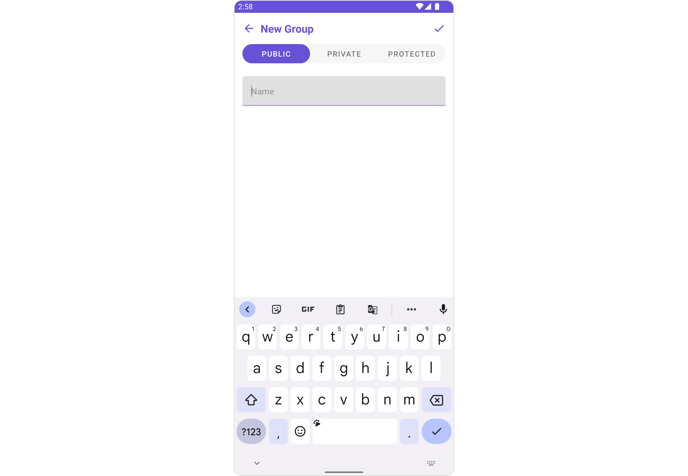
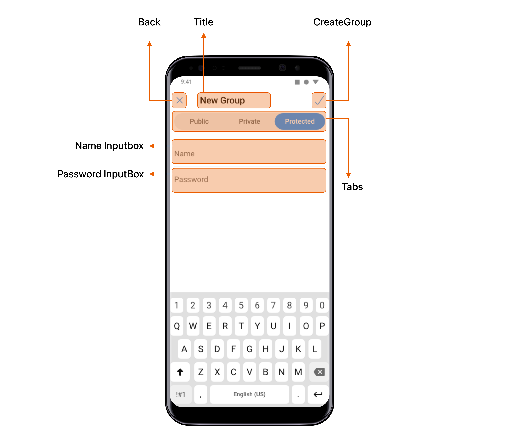
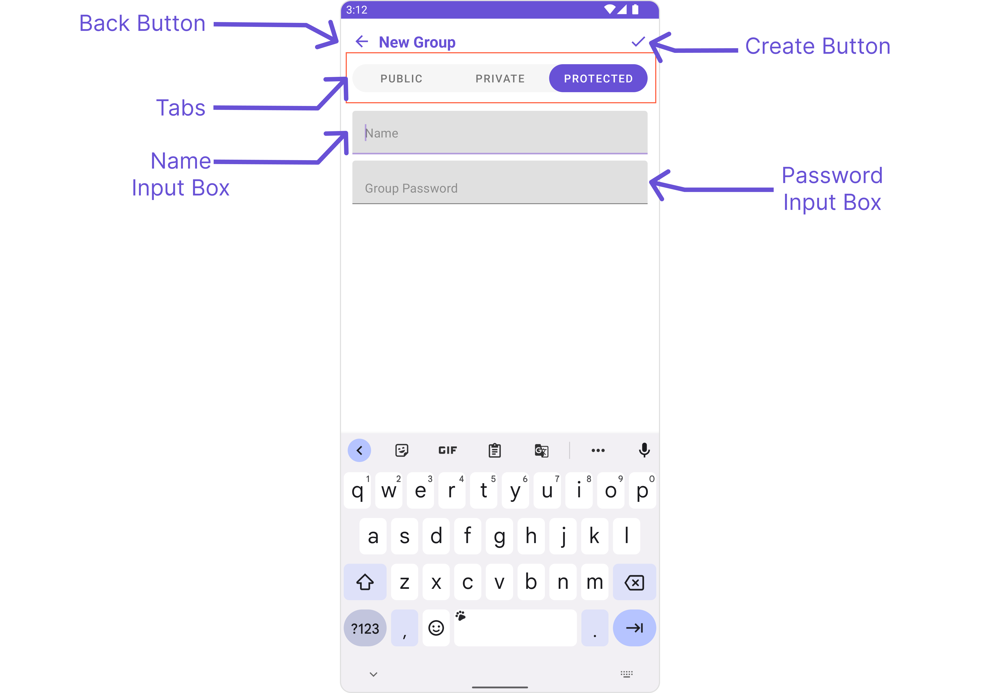

import Tabs from '@theme/Tabs';
import TabItem from '@theme/TabItem';
import { Tooltip } from 'react-tooltip'
import 'react-tooltip/dist/react-tooltip.css'

## Overview

`CometChatCreateGroup` serves as a versatile [Component](/ui-kit/android/components-overview#components), empowering users to create diverse group types, encompassing public, private, and password-protected options. This functionality grants users the flexibility to tailor their group settings to suit their preferences and requirements.



The `CometChatCreateGroup` component is composed of the following BaseComponents:

| Components                                     | Description                                                                                                                                                                                                                                                                                                                                                    |
| ---------------------------------------------- | -------------------------------------------------------------------------------------------------------------------------------------------------------------------------------------------------------------------------------------------------------------------------------------------------------------------------------------------------------------- |
| [CometChatListBase](/ui-kit/android/list-base) | `CometChatListBase` serves as a comprehensive container component, encompassing essential elements such as a title (navigationBar), search functionality (search-bar), background, and a container to embed a list view. This design provides a cohesive and intuitive user experience, facilitating seamless navigation and interaction within the component. |

---

## Usage

### Integration

`CreateGroup`, as a is a Composite Component, offers flexible integration options, allowing it to be launched directly via button clicks or any user-triggered action. Additionally, it seamlessly integrates into activities and fragments. With CreateGroup, users gain access to a wide range of parameters and methods for effortless customization of its user interface.

The following code snippet exemplifies how you can seamlessly integrate the CreateGroup component into your application.

<!--  -->

`CometChatCreateGroup` can be launched by adding the following code snippet into XML layout file.

<Tabs>
<TabItem value="xml" label="XML">

```xml
<com.cometchat.chatuikit.creategroup.CometChatCreateGroup
    android:id="@+id/createGroup"
    android:layout_width="match_parent"
    android:layout_height="match_parent" />
```

</TabItem>
</Tabs>

---

##### Activity and Fragment

You can integrate `CometChatCreateGroup` into your Activity and Fragment by adding the following code snippets into the respective classes.

<Tabs>
<TabItem value="Java (Activity)" label="Java (Activity)">

```Java title="YourActivity.java"
@Override
protected void onCreate(Bundle savedInstanceState) {
    super.onCreate(savedInstanceState);
    setContentView(new CometChatCreateGroup(this));
}
```

</TabItem>

<TabItem value="Kotlin (Activity)" label="Kotlin (Activity)">

```Java title="YourActivity.kt"
override fun onCreate(savedInstanceState: Bundle?) {
    super.onCreate(savedInstanceState)
    setContentView(CometChatCreateGroup(this))
}
```

</TabItem>

<TabItem value="Java (Fragment)" label="Java (Fragment)">

```Java title="YourFragment.java"
@Override
public View onCreateView(LayoutInflater inflater, ViewGroup container, Bundle savedInstanceState) {
    return new CometChatCreateGroup(requireContext());
}
```

</TabItem>

<TabItem value="Kotlin (Fragment)" label="Kotlin (Fragment)">

```Kotlin title="YourFragment.kt"
fun onCreateView(
    inflater: LayoutInflater?, container: ViewGroup?,
    savedInstanceState: Bundle?
): View? {
    return CometChatCreateGroup(requireContext())
}
```

</TabItem>
</Tabs>

In all the above examples, `CometChatCreateGroup` is the custom view class that you want to set as the content of your activity or the view for your fragment. This will display the CometChat groups with messages in your activity or fragment.

---

### Actions

[Actions](/ui-kit/android/components-overview#actions) dictate how a component functions. They are divided into two types: Predefined and User-defined. You can override either type, allowing you to tailor the behavior of the component to fit your specific needs.

##### 1. SetOnCreateGroup

The `SetOnCreateGroup` action is activated when you click the create Group button. This returns the created groups.

You can override this action using the following code snippet.

<Tabs>

<TabItem value="Java" label="Java">
```Java
cometchatCreateGroup.setOnCreateGroup(new CometChatCreateGroup.OnCreateGroup() {
    @Override
    public void onCreateGroup(Context context, Group group) {

    }

});

````
</TabItem>

<TabItem value="Kotlin" label="Kotlin">
```Kotlin
cometchatCreateGroup.setOnCreateGroup(OnCreateGroup { context, group ->

})
````

</TabItem>

</Tabs>

---

##### 2. SetOnError

You can customize this behavior by using the provided code snippet to override the `On Error` and improve error handling.

<Tabs>

<TabItem value="Java" label="Java">
```Java
cometchatCreateGroup.setOnError(new OnError() {
    @Override
    public void onError(Context context, CometChatException e) {
        
    }
});
```
</TabItem>

<TabItem value="Kotlin" label="Kotlin">
```Kotlin
cometchatCreateGroup.setOnError(object : OnError() {
    fun onError(context: Context, e: CometChatException) {

    }

})

````
</TabItem>

</Tabs>

---

### Filters

**Filters** allow you to customize the data displayed in a list within a `Component`. You can filter the list based on your specific criteria, allowing for a more customized. Filters can be applied using `RequestBuilders` of Chat SDK.

The `CreateGroup` component does not have any exposed filters.

---

### Events

[Events](/ui-kit/android/components-overview#events) are emitted by a `Component`. By using [CometChatGroupEvents](/ui-kit/android/groups#events) you can extend existing functionality. Being global events, they can be applied in Multiple Locations and are capable of being Added or Removed.

Events emitted by the Create Group component is as follows.

| Event                    | Description                                                                                                |
| ------------------------ | ---------------------------------------------------------------------------------------------------------- |
| `ccGroupCreated(Group group)`        | This event will be triggered when the logged-in user initiates the creation of a group.                    |

---

## Customization

To fit your app's design requirements, you can customize the appearance of the Groups component. We provide exposed methods that allow you to modify the experience and behavior according to your specific needs.

### Style

Using **Style** you can **customize** the look and feel of the component in your app, These parameters typically control elements such as the **color**, **size**, **shape**, and **fonts** used within the component.

##### 1. CreateGroup Style <a data-tooltip-id="my-tooltip-html-prop"> <span class="material-icons red">report</span> </a>

<Tooltip
  id="my-tooltip-html-prop"
  html="Not available"
/>

You can set the `CreateGroupStyle` to the `Create Group` Component to customize the styling.

<Tabs>

<TabItem value="Java" label="Java">
```Java
// Create a new CreateGroupStyle object
CreateGroupStyle createGroupStyle = new CreateGroupStyle();

// Set background (color or drawable)
createGroupStyle.setBackground(R.color.red); // Or use a Drawable object

// Edit Text properties
createGroupStyle.setEditTextCornerRadius(10);
createGroupStyle.setEditTextBackgroundColor(R.color.light_gray);

// Tab properties
createGroupStyle.setTabBackground(getDrawable(R.drawable.custom_tab_background)); // Assuming you have a custom tab background drawable
createGroupStyle.setTabBackgroundState(getDrawable(R.drawable.custom_tab_background_pressed)); // Optional: Set for different states

// Text Colors
createGroupStyle.setPlaceHolderTextColor(Color.GRAY);
createGroupStyle.setTitleTextColor(Color.BLACK);
createGroupStyle.setBackIconTintColor(Color.BLUE);
createGroupStyle.setCreateGroupIconTint(Color.GREEN);
createGroupStyle.setTabSelectedTextColor(Color.WHITE);
createGroupStyle.setTabTextColor(Color.BLACK);
createGroupStyle.setTabIndicatorColor(Color.RED);

// Text Fonts (if applicable)
createGroupStyle.setTextFont("Raleway");
createGroupStyle.setTitleTextFont("Roboto");

// Text Appearances (if applicable)
createGroupStyle.setTextAppearance(R.style.CustomTextAppearance);
createGroupStyle.setTitleTextAppearance(R.style.TitleTextAppearance);

// Apply the styled CreateGroupStyle to your cometchatCreateGroup object
cometchatCreateGroup.setStyle(createGroupStyle);
````

</TabItem>

<TabItem value="Kotlin" label="Kotlin">

```Kotlin
// Create a new CreateGroupStyle object
val createGroupStyle = CreateGroupStyle()


// Set background (color or drawable)
createGroupStyle.setBackground(R.color.red) // Or use a Drawable object


// Edit Text properties
createGroupStyle.setEditTextCornerRadius(10)
createGroupStyle.setEditTextBackgroundColor(R.color.light_gray)


// Tab properties
createGroupStyle.setTabBackground(getDrawable(R.drawable.custom_tab_background)) // Assuming you have a custom tab background drawable
createGroupStyle.setTabBackgroundState(getDrawable(R.drawable.custom_tab_background_pressed)) // Optional: Set for different states


// Text Colors
createGroupStyle.setPlaceHolderTextColor(Color.GRAY)
createGroupStyle.setTitleTextColor(Color.BLACK)
createGroupStyle.setBackIconTintColor(Color.BLUE)
createGroupStyle.setCreateGroupIconTint(Color.GREEN)
createGroupStyle.setTabSelectedTextColor(Color.WHITE)
createGroupStyle.setTabTextColor(Color.BLACK)
createGroupStyle.setTabIndicatorColor(Color.RED)


// Text Fonts (if applicable)
createGroupStyle.setTextFont("Raleway")
createGroupStyle.setTitleTextFont("Roboto")


// Text Appearances (if applicable)
createGroupStyle.setTextAppearance(R.style.CustomTextAppearance)
createGroupStyle.setTitleTextAppearance(R.style.TitleTextAppearance)


// Apply the styled CreateGroupStyle to your cometchatCreateGroup object
cometchatCreateGroup!!.setStyle(createGroupStyle)
```

</TabItem>

</Tabs>

List of properties exposed by `CreateGroupStyle`

| Property                       | Description                            | Code                                                      |
| ------------------------------ | -------------------------------------- | --------------------------------------------------------- |
| **Active Background**          | Sets the active background color.      | `setActiveBackground(int activeBackground)`               |
| **Back Icon Tint Color**       | Tint color for the back icon.          | `setBackIconTintColor(int backIconTintColor)`             |
| **Border Color**               | Sets the border color.                 | `setBorderColor(int borderColor)`                         |
| **Border Width**               | Sets the border width.                 | `setBorderWidth(int borderWidth)`                         |
| **Corner Radius**              | Sets the corner radius.                | `setCornerRadius(float cornerRadius)`                     |
| **Create Group Icon Tint**     | Tint color for the create group icon.  | `setCreateGroupIconTint(int createGroupIconTint)`         |
| **Edit Text Background Color** | Background color for the edit text.    | `setEditTextBackgroundColor(int editTextBackgroundColor)` |
| **Edit Text Corner Radius**    | Corner radius for the edit text.       | `setEditTextCornerRadius(int editTextCornerRadius)`       |
| **Place Holder Text Color**    | Text color for the placeholder.        | `setPlaceHolderTextColor(int placeHolderTextColor)`       |
| **Tab Background**             | Background drawable for the tab.       | `setTabBackground(Drawable tabBackground)`                |
| **Tab Background State**       | Background drawable state for the tab. | `setTabBackgroundState(Drawable tabBackgroundState)`      |
| **Tab Background Tint**        | Tint color for the tab background.     | `setTabBackgroundTint(int tabBackgroundTint)`             |
| **Tab Indicator Color**        | Color of the tab indicator.            | `setTabIndicatorColor(int tabIndicatorColor)`             |
| **Tab Selected Text Color**    | Text color for the selected tab.       | `setTabSelectedTextColor(int tabSelectedTextColor)`       |
| **Tab Text Color**             | Text color for the tab.                | `setTabTextColor(int tabTextColor)`                       |
| **Text Appearance**            | Text appearance style.                 | `setTextAppearance(int textAppearance)`                   |
| **Text Font**                  | Font for the text.                     | `setTextFont(String textFont)`                            |
| **Title Text Appearance**      | Text appearance style for the title.   | `setTitleTextAppearance(int titleTextAppearance)`         |
| **Title Text Color**           | Text color for the title.              | `setTitleTextColor(int titleTextColor)`                   |
| **Title Text Font**            | Font for the title text.               | `setTitleTextFont(String titleTextFont)`                  |

---

### Functionality

These are a set of small functional customizations that allow you to fine-tune the overall experience of the component. With these, you can change text, set custom icons, and toggle the visibility of UI elements.

<Tabs>

<TabItem value="Java" label="Java">
```Java
// Set the title of the view
cometchatCreateGroup.setTitle("Create a New Group");

// Set the background color
cometchatCreateGroup.setBackground(Color.parseColor("#F0F0F0")); // Light Gray

// Set the title text color
cometchatCreateGroup.setTitleColor(Color.BLACK);

// Hide the back button
cometchatCreateGroup.setShowBackButton(false);

// Set a custom icon for the create group button (assuming the icon is in the drawable folder)
cometchatCreateGroup.createGroupIcon(getResources().getDrawable(R.drawable.custom_create_icon));

// Set the corner radius of the edit text boxes
cometchatCreateGroup.setEditTextCornerRadius(10.0f);

// Set the background color for edit text boxes
cometchatCreateGroup.setEditTextBackground(Color.WHITE);

// Set the placeholder text color for the name input box
cometchatCreateGroup.setNameInputBoxPlaceHolderText("Enter Group Name (Optional)");

// Set the text color of the edit text boxes
cometchatCreateGroup.setEditTextTextColor(Color.BLACK);

// Set the font family for the text in edit text boxes
cometchatCreateGroup.setEditTextTextFont("Roboto");

// Set a listener for the create group button click event
cometchatCreateGroup.setOnCreateGroup(new CometChatCreateGroup.OnCreateGroup() {
@Override
public void onCreateGroup(Context context, Group group) {

    }

});

// Assuming you have a CometChatCreateGroup object created (replace with your initialization)
CometChatCreateGroup createGroupView = new CometChatCreateGroup();

// Set the title of the view
cometchatCreateGroup.setTitle("Create a New Group");

// Set the color of the back icon
cometchatCreateGroup.setBackIconTint(Color.parseColor("#2980B9")); // Blue

// Set the placeholder text for the password input box
cometchatCreateGroup.setPasswordInputBoxPlaceHolderText("Enter Password (Optional)");

// Set the border color of the edit text boxes
cometchatCreateGroup.setEditTextBorderColor(Color.parseColor("#CCCCCC")); // Light Gray

// Set the border width of the edit text boxes (in pixels)
cometchatCreateGroup.setEditTextBorderWidth(2);

// Set the tint color of the start icon in the password input box
cometchatCreateGroup.setPasswordInputBoxStartIconTint(Color.BLACK);

// Set the drawable resource for the start icon in the name input box
cometchatCreateGroup.setNameInputBoxStartIcon(R.drawable.custom_name_icon);

// Set the text color of the selected tab
cometchatCreateGroup.setTabSelectedTextColor(Color.WHITE);

// Set the text color of the unselected tabs
cometchatCreateGroup.setTabTextColor(Color.GRAY);

// Set the color of the tab indicator
cometchatCreateGroup.setTabIndicatorColor(Color.parseColor("#3498DB")); // Blue

// Set the tint color of the tab background
cometchatCreateGroup.setTabBackgroundTint(Color.parseColor("#ECF0F1")); // Light Gray

// Set the tint color of the create group icon
cometchatCreateGroup.setCreateGroupIconTint(Color.parseColor("#007BFF")); // Blue

// Set a custom background drawable for the tabs
cometchatCreateGroup.setTabBackground(getResources().getDrawable(R.drawable.custom_tab_background));

// Set a custom background drawable for the selected tab state
cometchatCreateGroup.setTabBackgroundState(getResources().getDrawable(R.drawable.custom_selected_tab_background));

// Set a custom drawable for the close button icon
cometchatCreateGroup.setCloseButtonIcon(getResources().getDrawable(R.drawable.custom_close_icon));

````
</TabItem>

<TabItem value="Kotlin" label="Kotlin">
```Kotlin
// Set the title of the view
cometchatCreateGroup.setTitle("Create a New Group")

// Set the background color
cometchatCreateGroup.setBackground(Color.parseColor("#F0F0F0")) // Light Gray

// Set the title text color
cometchatCreateGroup.setTitleColor(Color.BLACK)

// Hide the back button
cometchatCreateGroup.setShowBackButton(false)

// Set a custom icon for the create group button (assuming the icon is in the drawable folder)
cometchatCreateGroup.createGroupIcon(resources.getDrawable(R.drawable.custom_create_icon))

// Set the corner radius of the edit text boxes
cometchatCreateGroup.setEditTextCornerRadius(10.0f)

// Set the background color for edit text boxes
cometchatCreateGroup.setEditTextBackground(Color.WHITE)

// Set the placeholder text color for the name input box
cometchatCreateGroup.setNameInputBoxPlaceHolderText("Enter Group Name (Optional)")

// Set the text color of the edit text boxes
cometchatCreateGroup.setEditTextTextColor(Color.BLACK)

// Set the font family for the text in edit text boxes
cometchatCreateGroup.setEditTextTextFont("Roboto")

// Set a listener for the create group button click event
cometchatCreateGroup.setOnCreateGroup { context, group -> }

// Assuming you have a CometChatCreateGroup object created (replace with your initialization)
val createGroupView: CometChatCreateGroup = CometChatCreateGroup()

// Set the title of the view
cometchatCreateGroup.setTitle("Create a New Group")

// Set the color of the back icon
cometchatCreateGroup.setBackIconTint(Color.parseColor("#2980B9")) // Blue

// Set the placeholder text for the password input box
cometchatCreateGroup.setPasswordInputBoxPlaceHolderText("Enter Password (Optional)")

// Set the border color of the edit text boxes
cometchatCreateGroup.setEditTextBorderColor(Color.parseColor("#CCCCCC")) // Light Gray

// Set the border width of the edit text boxes (in pixels)
cometchatCreateGroup.setEditTextBorderWidth(2)

// Set the tint color of the start icon in the password input box
cometchatCreateGroup.setPasswordInputBoxStartIconTint(Color.BLACK)

// Set the drawable resource for the start icon in the name input box
cometchatCreateGroup.setNameInputBoxStartIcon(R.drawable.custom_name_icon)

// Set the text color of the selected tab
cometchatCreateGroup.setTabSelectedTextColor(Color.WHITE)

// Set the text color of the unselected tabs
cometchatCreateGroup.setTabTextColor(Color.GRAY)

// Set the color of the tab indicator
cometchatCreateGroup.setTabIndicatorColor(Color.parseColor("#3498DB")) // Blue

// Set the tint color of the tab background
cometchatCreateGroup.setTabBackgroundTint(Color.parseColor("#ECF0F1")) // Light Gray

// Set the tint color of the create group icon
cometchatCreateGroup.setCreateGroupIconTint(Color.parseColor("#007BFF")) // Blue

// Set a custom background drawable for the tabs
cometchatCreateGroup.setTabBackground(resources.getDrawable(R.drawable.custom_tab_background))

// Set a custom background drawable for the selected tab state
cometchatCreateGroup.setTabBackgroundState(resources.getDrawable(R.drawable.custom_selected_tab_background))

// Set a custom drawable for the close button icon
cometchatCreateGroup.setCloseButtonIcon(resources.getDrawable(R.drawable.custom_close_icon))
````

</TabItem>

</Tabs>



List of functionality exposed by `CometChatCreateGroup`

| Property                                | Description                                              | Code                                                                                                             |
| --------------------------------------- | -------------------------------------------------------- | ---------------------------------------------------------------------------------------------------------------- |
| **Back Button Icon**                    | Sets the icon for the back button.                       | `setCloseButtonIcon(Drawable backButtonIcon)`                                                                    |
| **Back Icon Tint**                      | Tint color for the back icon.                            | `backIconTint(int backIconTint)`                                                                                 |
| **Background Color**                    | Background color for the component.                      | `setBackground(int backgroundColor)`                                                                             |
| **Create Group Icon**                   | Sets the icon for the create group button.               | `setCreateGroupIcon(Drawable createGroupIcon)`                                                                   |
| **Create Group Icon Tint**              | Tint color for the create group icon.                    | `setCreateGroupIconTint(int createGroupIconTint)`                                                                |
| **Edit Text Background**                | Background color for the edit text.                      | `setEditTextBackground(@ColorInt int EditTextBoxColor)`                                                          |
| **Edit Text Border Color**              | Border color for the edit text.                          | `setEditTextBorderColor(@ColorInt int color)`                                                                    |
| **Edit Text Border Width**              | Border width for the edit text.                          | `setEditTextBorderWidth(int width)`                                                                              |
| **Edit Text Corner Radius**             | Corner radius for the edit text.                         | `setEditTextCornerRadius(float EditTextBoxRadius)`                                                               |
| **Edit Text Placeholder Color**         | Placeholder text color for the edit text.                | `setEditTextPlaceHolderColor(@ColorInt int color)`                                                               |
| **Edit Text Placeholder Text**          | Placeholder text for the edit text.                      | `setPasswordInputBoxPlaceHolderText(String placeHolderText)`                                                     |
| **Edit Text Text Appearance**           | Text appearance style for the edit text.                 | `setEditTextTextAppearance(int appearance)`                                                                      |
| **Edit Text Text Color**                | Text color for the edit text.                            | `setEditTextTextColor(@ColorInt int color)`                                                                      |
| **Edit Text Text Font**                 | Font for the edit text.                                  | `setEditTextTextFont(String fontName)`                                                                           |
| **Icon**                                | ImageView for the icon.                                  | `setCreateGroupIcon(Drawable icon)`                                                                              |
| **Name Input Box**                      | TextInputLayout for the name input.                      | `nameInputBox.setBoxCornerRadii(EditTextBoxRadius, EditTextBoxRadius, EditTextBoxRadius, EditTextBoxRadius)`     |
| **On Create Group**                     | Callback interface for group creation.                   | `setOnCreateGroup(OnCreateGroup onCreateGroup)`                                                                  |
| **On Error**                            | Callback interface for error handling.                   | `setOnError(OnError onError)`                                                                                    |
| **Password Input Box**                  | TextInputLayout for the password input.                  | `passwordInputBox.setBoxCornerRadii(EditTextBoxRadius, EditTextBoxRadius, EditTextBoxRadius, EditTextBoxRadius)` |
| **Password Input Box Placeholder Text** | Placeholder text for the password input box.             | `setPasswordInputBoxPlaceHolderText(String placeHolderText)`                                                     |
| **Password Input Box Start Icon**       | Start icon for the password input box.                   | `setPasswordInputBoxStartIcon(int res)`                                                                          |
| **Password Input Box Start Icon Tint**  | Tint color for the start icon in the password input box. | `setPasswordInputBoxStartIconTint(@ColorInt int color)`                                                          |
| **Show Back Button**                    | Flag to show or hide the back button.                    | `showBackButton = boolean`                                                                                       |
| **Tab Background**                      | Background drawable for the tab.                         | `setTabBackground(Drawable tabBackground)`                                                                       |
| **Tab Background State**                | Background drawable state for the tab.                   | `setTabBackgroundState(Drawable tabBackgroundState)`                                                             |
| **Tab Background Tint**                 | Tint color for the tab background.                       | `setTabBackgroundTint(int tabBackgroundTint)`                                                                    |
| **Tab Indicator Color**                 | Color of the tab indicator.                              | `setTabIndicatorColor(int tabIndicatorColor)`                                                                    |
| **Tab Layout**                          | TabLayout for the component.                             | `setTabs()`                                                                                                      |
| **Tab Selected Text Color**             | Text color for the selected tab.                         | `setTabSelectedTextColor(int tabSelectedTextColor)`                                                              |
| **Tab Text Color**                      | Text color for the tab.                                  | `setTabTextColor(int tabTextColor)`                                                                              |
| **Tabs List**                           | List of tabs in the component.                           | `tabs_List.remove(getResources().getString(string.cometchat_type_public))`                                       |
| **Theme**                               | Theme for the component.                                 | `CometChatTheme theme`                                                                                           |
| **Title**                               | Title for the component.                                 | `title = String`                                                                                                 |
| **Title Color**                         | Color of the title text.                                 | `super.setTitleColor(int titleColor)`                                                                            |
| **Title Text Appearance**               | Text appearance style for the title.                     | `super.setTitleAppearance(style.getTitleTextAppearance())`                                                       |
| **Title Text Font**                     | Font for the title text.                                 | `super.setTitleFont(style.getTitleTextFont())`                                                                   |

---

### Advanced

For advanced-level customization, you can set custom views to the component. This lets you tailor each aspect of the component to fit your exact needs and application aesthetics. You can create and define your own views, layouts, and UI elements and then incorporate those into the component.

The `Create Group` component does not provide additional functionalities beyond this level of customization.

<Tooltip
  id="my-tooltip-html-prop"
  html="Not available in Create Group Configuration object"
/>
