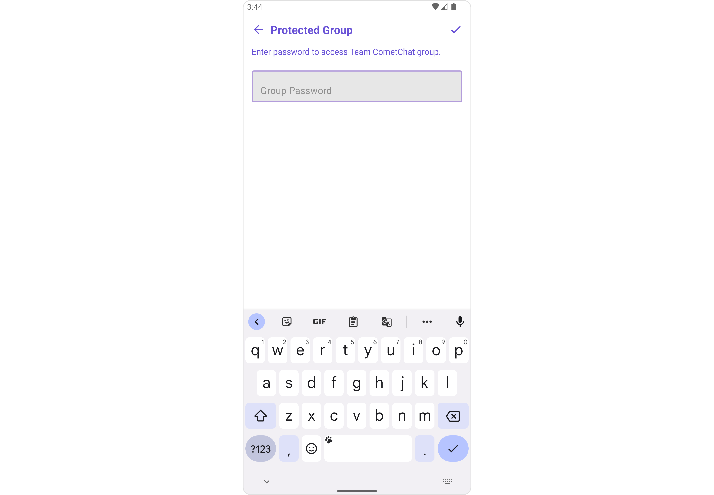
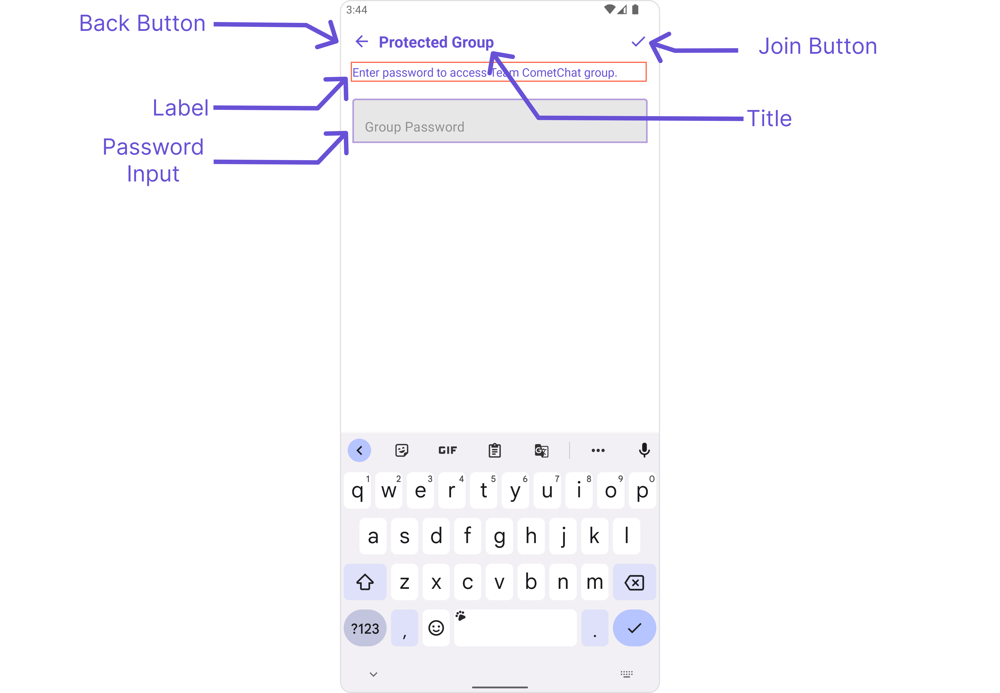

import Tabs from '@theme/Tabs';
import TabItem from '@theme/TabItem';
import { Tooltip } from 'react-tooltip'
import 'react-tooltip/dist/react-tooltip.css'

## Overview

CometChatJoinProtectedGroup is a [Component](/ui-kit/android/components-overview#components) used to set up a screen that shows the functionality to join a password protected group, featuring the functionality to join a password-protected group, where users can join a single password-protected group at a time.



The `CometChatJoinProtectedGroup` component is composed of the following BaseComponents:

| Components                                     | Description                                                                                                                                                                                                                                                                                                                                                    |
| ---------------------------------------------- | -------------------------------------------------------------------------------------------------------------------------------------------------------------------------------------------------------------------------------------------------------------------------------------------------------------------------------------------------------------- |
| [CometChatListBase](/ui-kit/android/list-base) | `CometChatListBase` serves as a comprehensive container component, encompassing essential elements such as a title (navigationBar), search functionality (search-bar), background, and a container to embed a list view. This design provides a cohesive and intuitive user experience, facilitating seamless navigation and interaction within the component. |

---

## Usage

### Integration

`CometChatJoinProtectedGroup`, as a Composite Component, offers flexible integration options, allowing it to be launched directly via button clicks or any user-triggered action. Additionally, it seamlessly integrates into tab view controllers. With join group, users gain access to a wide range of parameters and methods for effortless customization of its user interface.

The following code snippet exemplifies how you can seamlessly integrate the JoinProtectedGroup component into your application.

`CometChatJoinProtectedGroup` can be launched by adding the following code snippet into XML layout file.

<Tabs>
<TabItem value="xml" label="XML">

```xml
<com.cometchat.chatuikit.joinprotectedgroup.CometChatJoinProtectedGroup
    android:id="@+id/joinGroup"
    android:layout_width="match_parent"
    android:layout_height="match_parent" />
```

</TabItem>
</Tabs>

---

##### Activity and Fragment

You can integrate `CometChatJoinProtectedGroup` into your Activity and Fragment by adding the following code snippets into the respective classes.

<Tabs>
<TabItem value="Java (Activity)" label="Java (Activity)">

```Java title="YourActivity.java"
@Override
protected void onCreate(Bundle savedInstanceState) {
    super.onCreate(savedInstanceState);
    setContentView(new CometChatJoinProtectedGroup(this));
}
```

</TabItem>

<TabItem value="Kotlin (Activity)" label="Kotlin (Activity)">

```Java title="YourActivity.kt"
override fun onCreate(savedInstanceState: Bundle?) {
    super.onCreate(savedInstanceState)
    setContentView(CometChatJoinProtectedGroup(this))
}
```

</TabItem>

<TabItem value="Java (Fragment)" label="Java (Fragment)">

```Java title="YourFragment.java"
@Override
public View onCreateView(LayoutInflater inflater, ViewGroup container, Bundle savedInstanceState) {
    return new CometChatJoinProtectedGroup(requireContext());
}
```

</TabItem>

<TabItem value="Kotlin (Fragment)" label="Kotlin (Fragment)">

```Kotlin title="YourFragment.kt"
fun onCreateView(
    inflater: LayoutInflater?, container: ViewGroup?,
    savedInstanceState: Bundle?
): View? {
    return CometChatJoinProtectedGroup(requireContext())
}
```

</TabItem>
</Tabs>

In all the above examples, `CometChatJoinProtectedGroup` is the custom view class that you want to set as the content of your activity or the view for your fragment. This will display the Join Protected Group in your activity or fragment.

---

### Actions

[Actions](/ui-kit/android/components-overview#actions) dictate how a component functions. They are divided into two types: Predefined and User-defined. You can override either type, allowing you to tailor the behavior of the component to fit your specific needs.

##### 1. SetOnJoinClick

The `setOnJoinClick` action is activated when you click the join Group button. This returns the join groups.

You can override this action using the following code snippet.

<Tabs>

<TabItem value="Java" label="Java">
```Java
cometchatJoinProtectedGroup.setOnJoinClick(new CometChatJoinProtectedGroup.OnJoinClick() {
    @Override
    public void onJoin(Context context, Group group, String s) {

    }

});

````
</TabItem>

<TabItem value="Kotlin" label="Kotlin">
```Kotlin
cometchatJoinProtectedGroup.setOnJoinClick(OnJoinClick { context, group, s ->

})
````

</TabItem>

</Tabs>

---

##### 2. SetOnError

You can customize this behavior by using the provided code snippet to override the `On Error` and improve error handling.

<Tabs>

<TabItem value="Java" label="Java">
```Java
cometchatJoinProtectedGroup.setOnError(new OnError() {
    @Override
    public void onError(Context context, CometChatException e) {
        
    }
});
```
</TabItem>

<TabItem value="Kotlin" label="Kotlin">
```Kotlin
cometchatJoinProtectedGroup.setOnError(OnError { context, e ->

})

````
</TabItem>

</Tabs>

---

### Filters

**Filters** allow you to customize the data displayed in a list within a `Component`. You can filter the list based on your specific criteria, allowing for a more customized. Filters can be applied using `RequestBuilders` of Chat SDK.

The `Join Group` component does not have any exposed filters.

---

### Events

[Events](/ui-kit/android/components-overview#events) are emitted by a `Component`. By using event you can extend existing functionality. Being global events, they can be applied in Multiple Locations and are capable of being Added or Removed.

Events emitted by the Join Group component is as follows.

| Event                 | Description                                                  |
| --------------------- | ------------------------------------------------------------ |
| **ccGroupMemberJoined** | Triggers when the user joined a protected group successfully |


##### Add the `CometChatGroupEvents` listener

<Tabs>

<TabItem value="Java" label="Java">
```Java
CometChatGroupEvents.addGroupListener("LISTENER_ID", new CometChatGroupEvents() {
    @Override
    public void ccGroupMemberJoined(User joinedUser, Group joinedGroup) {
        super.ccGroupMemberJoined(joinedUser, joinedGroup);
    }
});
````

</TabItem>

<TabItem value="Kotlin" label="Kotlin">
```Kotlin
CometChatGroupEvents.addGroupListener("LISTENER_ID", object : CometChatGroupEvents() {
    override fun ccGroupMemberJoined(joinedUser: User, joinedGroup: Group) {
        super.ccGroupMemberJoined(joinedUser, joinedGroup)
    }
})
```
</TabItem>

</Tabs>

---

##### Remove the added listener

<Tabs>

<TabItem value="Java" label="Java">
```Java
CometChatGroupEvents.removeListener("LISTENER_ID");
```
</TabItem>

<TabItem value="Kotlin" label="Kotlin">
```Kotlin
CometChatGroupEvents.removeListener("LISTENER_ID")
```
</TabItem>

</Tabs>

---

## Customization

To fit your app's design requirements, you can customize the appearance of the Groups component. We provide exposed methods that allow you to modify the experience and behavior according to your specific needs.

### Style

Using **Style** you can **customize** the look and feel of the component in your app, These parameters typically control elements such as the **color**, **size**, **shape**, and **fonts** used within the component.

##### 1. JoinProtectedGroup Style <a data-tooltip-id="my-tooltip-html-prop"> <span class="material-icons red">report</span> </a>

<Tooltip
  id="my-tooltip-html-prop"
  html="Not available"
/>

You can set the `JoinProtectedGroupStyle` to the `Join Protected Group` Component to customize the styling.

<Tabs>

<TabItem value="Java" label="Java">
```Java
JoinProtectedGroupStyle joinProtectedGroupStyle = new JoinProtectedGroupStyle();

// Set background color
joinProtectedGroupStyle.setBackground(Color.parseColor("#FFFFFF")); // White background

// Set edit text box background color and corner radius
joinProtectedGroupStyle.setEditBoxBackgroundColor(Color.parseColor("#E0E0E0")); // Light gray background
joinProtectedGroupStyle.setEditBoxCornerRadius(8); // Set corner radius to 8dp

cometchatJoinProtectedGroup.setStyle(joinProtectedGroupStyle);

````
</TabItem>

<TabItem value="Kotlin" label="Kotlin">
```Kotlin
val joinProtectedGroupStyle = JoinProtectedGroupStyle()

// Set background color
joinProtectedGroupStyle.setBackground(Color.parseColor("#FFFFFF")) // White background

// Set edit text box background color and corner radius
joinProtectedGroupStyle.setEditBoxBackgroundColor(Color.parseColor("#E0E0E0")) // Light gray background
joinProtectedGroupStyle.setEditBoxCornerRadius(8) // Set corner radius to 8dp

cometchatJoinProtectedGroup.setStyle(joinProtectedGroupStyle)
````

</TabItem>

</Tabs>

List of properties exposed by JoinProtectedGroupStyle

| Property                    | Description                                                  | Code                                                          |
| --------------------------- | ------------------------------------------------------------ | ------------------------------------------------------------- |
| Background                  | Sets the background color for join protected group           | `setBackground(int background)`                               |
| Background (Drawable)       | Sets the background drawable for join protected group        | `setBackground(Drawable drawableBackground)`                  |
| Corner Radius               | Sets the corner radius of the Join Protected Group view.     | `setCornerRadius(float cornerRadius)`                         |
| Border Width                | Sets the border width of the Join Protected Group view.      | `setBorderWidth(int borderWidth)`                             |
| Border Color                | Sets the border color of the Join Protected Group view.      | `setBorderColor(int borderColor)`                             |
| Title Color                 | Sets the color of the title text.                            | `setTitleColor(int titleColor)`                               |
| Back Icon Tint              | Sets the tint color of the back icon.                        | `setBackIconTint(int backIconTint)`                           |
| Join Group Icon Tint        | Sets the tint color of the join group icon.                  | `setJoinGroupIconTint(int joinGroupIconTint)`                 |
| Edit Text Box Background    | Sets the background color of the edit text box.              | `setEditBoxBackgroundColor(int editBoxBackgroundColor)`       |
| Edit Text Box Corner Radius | Sets the corner radius of the edit text box.                 | `setEditBoxCornerRadius(int editBoxCornerRadius)`             |
| Edit Text Box Text Color    | Sets the text color of the edit text box.                    | `setEditBoxTextColor(int editBoxTextColor)`                   |
| Edit Text Box Border Color  | Sets the border color of the edit text box.                  | `setEditBoxBorderColor(int editBoxBorderColor)`               |
| Edit Text Box Border Width  | Sets the border width of the edit text box.                  | `setEditBoxBorderWidth(int editBoxBorderWidth)`               |
| Edit Text Placeholder Color | Sets the color of the placeholder text in the edit text box. | `setEditTextPlaceHolderColor(int editTextPlaceHolderColor)`   |
| Description Color           | Sets the color of the description text.                      | `setDescriptionColor(int descriptionColor)`                   |
| Description Text Appearance | Sets the text appearance of the description text.            | `setDescriptionTextAppearance(int descriptionTextAppearance)` |
| Title Text Appearance       | Sets the text appearance of the title text.                  | `setTitleTextAppearance(int titleTextAppearance)`             |
| Password Text Appearance    | Sets the text appearance of the password text.               | `setPasswordTextAppearance(int passwordTextAppearance)`       |
| Title Font                  | Sets the font of the title text.                             | `setTitleFont(String titleFont)`                              |

---

### Functionality

These are a set of small functional customizations that allow you to fine-tune the overall experience of the component. With these, you can change text, set custom icons, and toggle the visibility of UI elements.

<Tabs>

<TabItem value="Java" label="Java">
```Java
cometchatJoinProtectedGroup.setTitle("Join Secure Group");
cometchatJoinProtectedGroup.backIcon(requireActivity().getDrawable(R.drawable.broadcast_camera));
```
</TabItem>

<TabItem value="Kotlin" label="Kotlin">
```Kotlin
cometchatJoinProtectedGroup.setTitle("Join Secure Group")
cometchatJoinProtectedGroup.backIcon(requireActivity().getDrawable(R.drawable.broadcast_camera))
```
</TabItem>

</Tabs>



This table provides a quick overview of the available customization options for the `CometChatJoinProtectedGroup` class.

| Property            | Description                                             | Code                                      |
| ------------------- | ------------------------------------------------------- | ----------------------------------------- |
| title               | Sets the title text.                                    | `setTitle(String title)`                  |
| description         | Sets the description text.                              | `setDescription(String labelText)`        |
| editTextBorderWidth | Sets the border width of the edit text box.             | `setEditTextBorderWidth(int width)`       |
| style               | Applies styles from a `JoinProtectedGroupStyle` object. | `setStyle(JoinProtectedGroupStyle style)` |

---

### Advanced

For advanced-level customization, you can set custom views to the component. This lets you tailor each aspect of the component to fit your exact needs and application aesthetics. You can create and define your own views, layouts, and UI elements and then incorporate those into the component.

The `Join Protected Group` component does not provide additional functionalities beyond this level of customization.

<Tooltip
  id="my-tooltip-html-prop"
  html="Not available in Join Protected Group Configuration object"
/>
