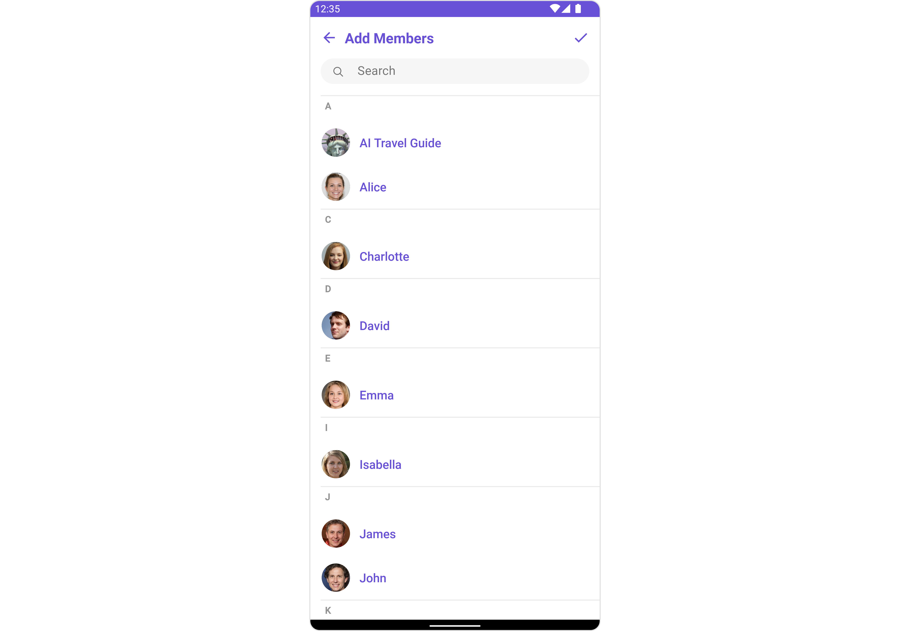
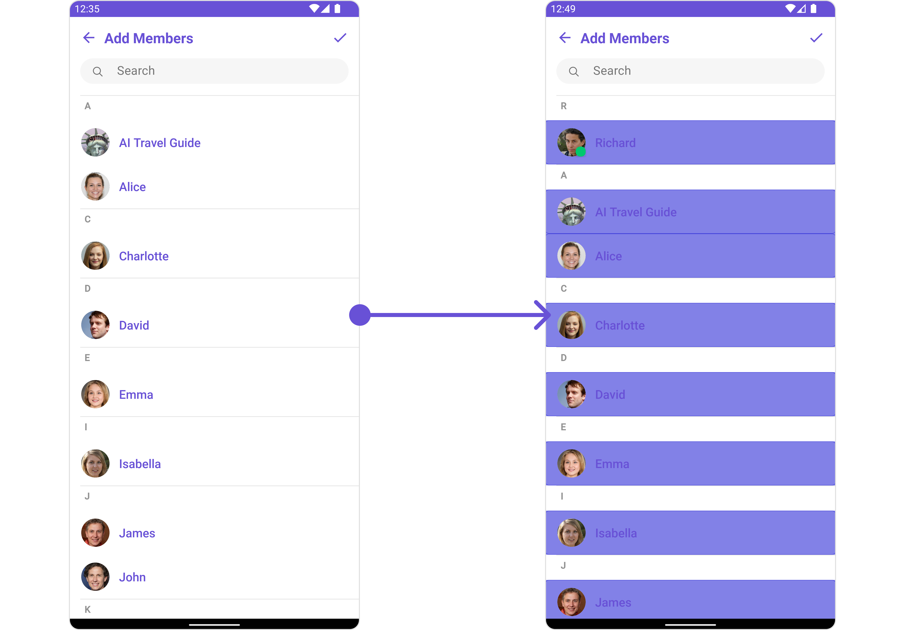
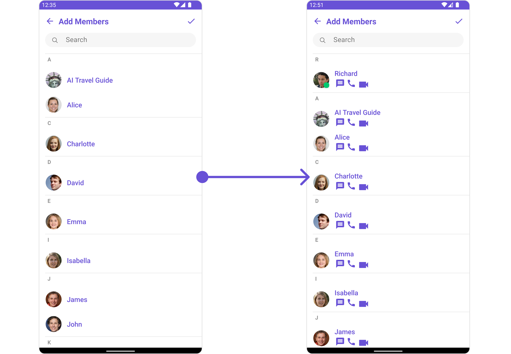
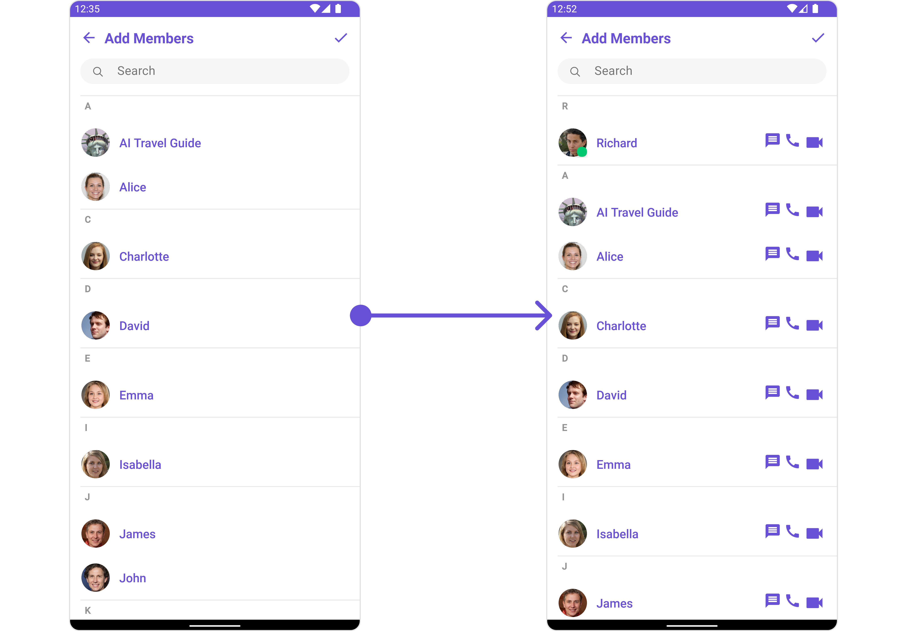
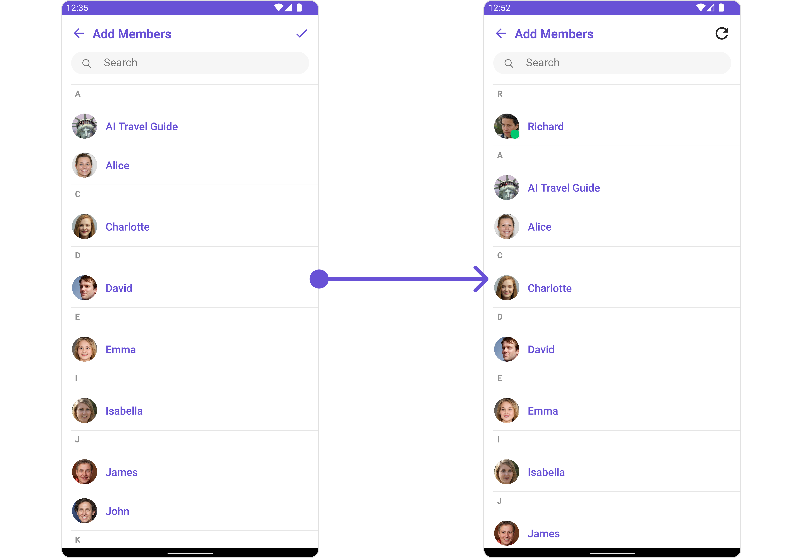
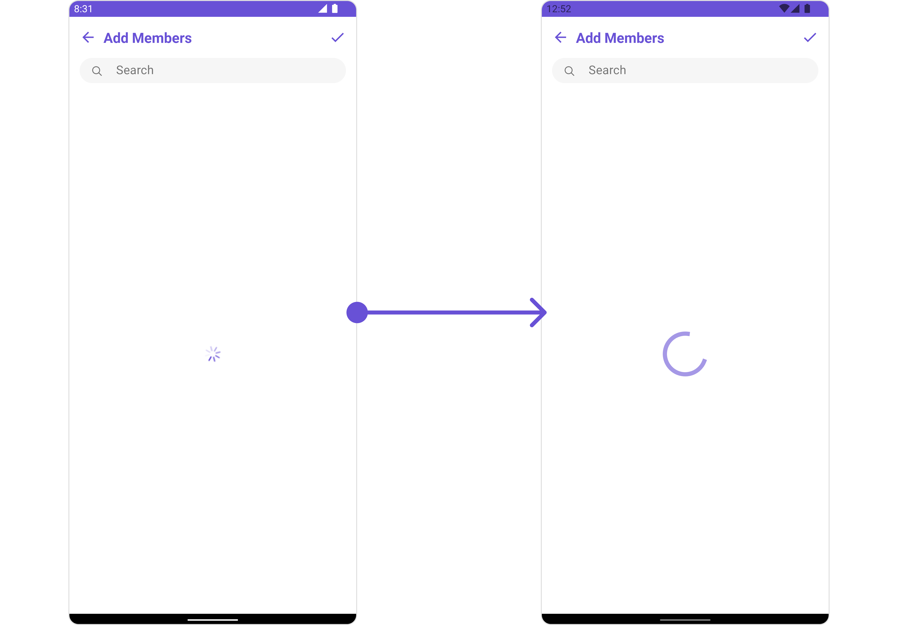
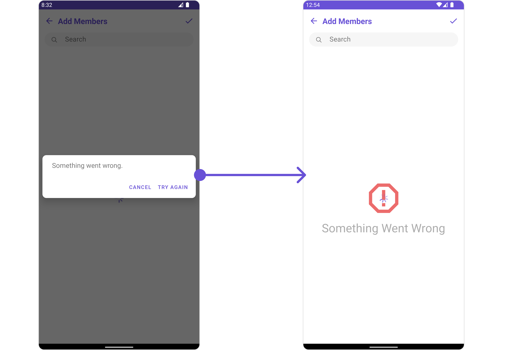

import Tabs from '@theme/Tabs';
import TabItem from '@theme/TabItem';

## Overview

`CometChatAddMembers` is a [Component](/ui-kit/android/components-overview#components) that empowers administrators or group owners with the ability to expand group membership by seamlessly adding new participants. This component facilitates effortless management of group membership and enhances collaboration within the group's discussions and activities. Administrators can meticulously select desired users to join the group, whether by targeted search or from a list of available users. Selected users receive notifications, streamlining the process of joining the group and ensuring smooth integration into the community.



The `CometChatAddMembers` component is composed of the following BaseComponents:

| Components                                     | Description                                                                                                                                                                                                                                                                                                                                                   |
| ---------------------------------------------- | ------------------------------------------------------------------------------------------------------------------------------------------------------------------------------------------------------------------------------------------------------------------------------------------------------------------------------------------------------------- |
| [CometChatUsers](/ui-kit/android/users)        | `CometChatUsers` is a standalone component that presents a user list and enables targeted user searches. As a container inheriting from `CometChatListBase`, it seamlessly incorporates the `CometChatUserList` component. This setup streamlines user browsing and search capabilities, enhancing overall usability and facilitating efficient interactions. |
| [CometChatListItem](/ui-kit/android/list-item) | This component renders information extracted from a `User` object onto a tile, featuring a title, subtitle, leading view, and trailing view. experience, facilitating seamless navigation and interaction within the component.                                                                                                                               |

---

## Usage

### Integration

`CometChatAddMembers`, as a Composite Component, offers flexible integration options, allowing it to be launched directly via button clicks or any user-triggered action. Additionally, it seamlessly integrates into tab view controllers. With add members, users gain access to a wide range of parameters and methods for effortless customization of its user interface.

The following code snippet exemplifies how you can seamlessly integrate the GroupMembers component into your application.

<Tabs>
<TabItem value="xml" label="XML">

```xml
<com.cometchat.chatuikit.addmembers.CometChatAddMembers
    android:id="@+id/add_members"
    android:layout_width="match_parent"
    android:layout_height="match_parent" />
```

</TabItem>
</Tabs>

If you're defining the Group members within the XML code, you'll need to extract them and set them on the Group object using the appropriate method.

<Tabs>

<TabItem value="Java" label="Java">
```Java
CometChatAddMembers cometchatAddMembers = binding.groupMember;

Group group = new Group();
group.setGuid("GROUP_ID");
group.setName("GROUP_NAME");

cometchatAddMembers.setGroup(group);

````
</TabItem>

<TabItem value="Kotlin" label="Kotlin">
```Kotlin
val cometchatAddMembers: CometChatAddMembers = binding.groupMember

val group: Group = Group()
group.setGuid("GROUP_ID")
group.setName("GROUP_NAME")

cometchatAddMembers.setGroup(group)
````

</TabItem>

</Tabs>

---

### Actions

[Actions](/ui-kit/android/components-overview#actions) dictate how a component functions. They are divided into two types: Predefined and User-defined. You can override either type, allowing you to tailor the behavior of the component to fit your specific needs.

##### 1. SetOnItemClick

This method proves valuable when users seek to override onItemClick functionality within CometChatAddMembers, empowering them with greater control and customization options.

The `setOnItemClick` action doesn't have a predefined behavior. You can override this action using the following code snippet.

<Tabs>

<TabItem value="Java" label="Java">
```Java
cometchatAddMembers.setItemClickListener(new OnItemClickListener<User>() {
    @Override
    public void OnItemClick(User user, int i) {

    }

});

````
</TabItem>

<TabItem value="Kotlin" label="Kotlin">
```Kotlin
cometchatAddMembers.setItemClickListener(object : OnItemClickListener<User>() {
    override fun OnItemClick(user: User, i: Int) {

    }
})
````

</TabItem>

</Tabs>

---

##### 2. OnSelection

The `OnSelection` event is triggered upon the completion of a selection in `SelectionMode`. It does not have a default behavior. However, you can override its behavior using the following code snippet.

<Tabs>

<TabItem value="java" label="Java">
```java title="YourActivity.java"
cometchatAddMembers.setSelectionMode(UIKitConstants.SelectionMode.MULTIPLE);
cometchatAddMembers.setOnSelection(new CometChatUsers.OnSelection() {
    @Override
    public void onSelection(List<User> list) {
        // Handle selected members here
    }
});
```
</TabItem>

<TabItem value="kotlin" label="Kotlin">

```kotlin title="YourActivity.kt"
cometchatAddMembers.setSelectionMode(UIKitConstants.SelectionMode.MULTIPLE)
cometchatAddMembers.setOnSelection { list ->
    // Handle selected members here
}
```

</TabItem>

</Tabs>

---

##### 3. SetOnError

You can customize this behavior by using the provided code snippet to override the `On Error` and improve error handling.

<Tabs>

<TabItem value="Java" label="Java">
```Java
cometchatAddMembers.setOnError(new OnError() {
    @Override
    public void onError(Context context, CometChatException e) {

    }

});

````
</TabItem>

<TabItem value="Kotlin" label="Kotlin">
```Kotlin
cometchatAddMembers.setOnError(OnError { context, e ->

})
````

</TabItem>

</Tabs>

---

##### 4. AddOnBackPressListener

You can customize this behavior by using the provided code snippet to override the `addOnBackPressListener` and improve error handling.

<Tabs>

<TabItem value="Java" label="Java">
```Java
cometchatAddMembers.addOnBackPressListener(new CometChatListBase.OnBackPress() {
    @Override
    public void onBack() {

    }

});

````
</TabItem>

<TabItem value="Kotlin" label="Kotlin">
```Kotlin
cometchatAddMembers.addOnBackPressListener(CometChatListBase.OnBackPress {

})
````

</TabItem>

</Tabs>

---

### Filters

**Filters** allow you to customize the data displayed in a list within a `Component`. You can filter the list based on your specific criteria, allowing for a more customized. Filters can be applied using `RequestBuilders` of Chat SDK.

##### 1. UsersRequestBuilder

The [UsersRequestBuilder](/sdk/android/retrieve-users) enables you to filter and customize the group list based on available parameters in UsersRequestBuilder. This feature allows you to create more specific and targeted queries when fetching users. The following are the parameters available in [UsersRequestBuilder](/sdk/android/retrieve-users)

| Property           | Description                                                                                                         | Code                        |
| ------------------ | ------------------------------------------------------------------------------------------------------------------- | --------------------------- |
| **Limit**          | Configure the maximum number of groups to fetch in a single request, optimizing pagination for smoother navigation. | `.setLimit(Int)`            |
| **Search Keyword** | Employed to retrieve groups that match the provided string, facilitating precise searches.                          | `.setSearchKeyword(String)` |
| **Tags**           | Used for fetching users containing the passed tags.                                                                 | `.setTags(List<String>)`    |
| **Roles**          | Used for fetching users containing the passed roles.                                                                | `.setRoles(List<String>)`   |
| **UIDs**           | Used for fetching users containing the passed UIDs.                                                                 | `.setUIDs(List<String>)`    |
| **User Status**    | Used for fetching users by their status online or offline.                                                          | `.setUserStatus(String)`    |

**Example**

<!-- ############################################### -->
<Tabs>

<TabItem value="Java" label="Java">
```Java
UsersRequest.UsersRequestBuilder usersRequestBuilder = new UsersRequest.UsersRequestBuilder()
        .setLimit(LIMIT)
        .setTags(new ArrayList<>())
        .setRoles(new ArrayList<>())
        .setUIDs(new ArrayList<>())
        .setUserStatus(STATUS);

cometchatAddMembers.setUsersRequestBuilder(usersRequestBuilder);

````
</TabItem>

<TabItem value="Kotlin" label="Kotlin">
```Kotlin
val usersRequestBuilder = UsersRequestBuilder()
    .setLimit(LIMIT)
    .setTags(arrayListOf())
    .setRoles(arrayListOf())
    .setUIDs(arrayListOf())
    .setUserStatus(STATUS)

cometchatAddMembers.setUsersRequestBuilder(usersRequestBuilder)
````

</TabItem>

</Tabs>

---

##### 2. SearchRequestBuilder

The SearchRequestBuilder uses [UsersRequestBuilder](/sdk/android/retrieve-users) enables you to filter and customize the search list based on available parameters in UsersRequestBuilder.
This feature allows you to keep uniformity between the displayed User List and searched User List.

**Example**

<Tabs>

<TabItem value="Java" label="Java">
```Java
UsersRequest.UsersRequestBuilder usersRequestBuilder = new UsersRequest.UsersRequestBuilder()
        .setLimit(LIMIT)
        .setSearchKeyword(SEARCH_KEYWORD);

cometchatAddMembers.setSearchRequestBuilder(usersRequestBuilder);

````
</TabItem>

<TabItem value="Kotlin" label="Kotlin">
```Kotlin
val usersRequestBuilder = UsersRequestBuilder()
    .setLimit(LIMIT)
    .setSearchKeyword(SEARCH_KEYWORD)

cometchatAddMembers.setSearchRequestBuilder(usersRequestBuilder)
````

</TabItem>

</Tabs>

---

### Events

[Events](/ui-kit/android/components-overview#events) are emitted by a `Component`. By using event you can extend existing functionality. Being global events, they can be applied in Multiple Locations and are capable of being Added or Removed.

Events emitted by the Join Group component is as follows.

| Event                  | Description                                        |
| ---------------------- | -------------------------------------------------- |
| **ccGroupMemberAdded** | Triggers when a user added to a group successfully |

<Tabs>

<TabItem value="Java" label="Java">
```Java
CometChatGroupEvents.addGroupListener("LISTENER_ID", new CometChatGroupEvents() {
    @Override
    public void ccGroupMemberAdded(List<Action> actionMessages, List<User> usersAdded, Group userAddedIn, User addedBy) {
        super.ccGroupMemberAdded(actionMessages, usersAdded, userAddedIn, addedBy);
    }
});
```
</TabItem>

<TabItem value="Kotlin" label="Kotlin">
```Kotlin
CometChatGroupEvents.addGroupListener("LISTENER_ID", object : CometChatGroupEvents() {
    override fun ccGroupMemberAdded(
        actionMessages: List<Action>,
        usersAdded: List<User>,
        userAddedIn: Group,
        addedBy: User
    ) {
        super.ccGroupMemberAdded(actionMessages, usersAdded, userAddedIn, addedBy)
    }
})
```
</TabItem>

</Tabs>

Remove the added listener

<Tabs>

<TabItem value="Java" label="Java">
```Java
CometChatGroupEvents.removeListener("LISTENER_ID");
```
</TabItem>

<TabItem value="Kotlin" label="Kotlin">
```Kotlin
CometChatGroupEvents.removeListener("LISTENER_ID")
```
</TabItem>

</Tabs>

## Customization

To fit your app's design requirements, you can customize the appearance of the Groups component. We provide exposed methods that allow you to modify the experience and behavior according to your specific needs.

### Style

Using **Style** you can **customize** the look and feel of the component in your app, These parameters typically control elements such as the **color**, **size**, **shape**, and **fonts** used within the component.

##### 1. AddMembers Style

To apply customized styles to the `AddMembers` component in the Group Member Component, you can use the following code snippet.

<Tabs>
<TabItem value="java" label="Java">

```Java
AddMembersStyle addMembersStyle = new AddMembersStyle();
addMembersStyle.setBackground(getResources().getColor(android.R.color.holo_red_dark));
addMembersStyle.setTitleColor(getResources().getColor(R.color.red));

cometchatAddMembers.setStyle(addMembersStyle);
```

</TabItem>

<TabItem value="kotlin" label="Kotlin">

```kotlin
val addMembersStyle = AddMembersStyle()
addMembersStyle.setBackground(resources.getColor(R.color.holo_red_dark))
addMembersStyle.setTitleColor(resources.getColor(R.color.red))

cometchatAddMembers.setStyle(addMembersStyle)
```

</TabItem>
</Tabs>

List of properties exposed by `AddMembersStyle`

| Methods                           | Type          | Description                                                                                                         |
| --------------------------------- | ------------- | ------------------------------------------------------------------------------------------------------------------- |
| **Background**                    | @ColorInt int | Used to set the background color                                                                                    |
| **Border Width**                  | int           | Used to set border                                                                                                  |
| **Border Color**                  | @ColorInt int | Used to set border color                                                                                            |
| **Corner Radius**                 | float         | Used to set border radius                                                                                           |
| **Background**                    | Drawable      | Used to set background Drawable                                                                                     |
| **Title Appearance**              | @StyleRes int | Used to customise the appearance of the title in the app bar                                                        |
| **Back Icon Tint**                | @ColorInt int | Used to set the color of the back icon in the app bar                                                               |
| **Search Background**             | @ColorInt int | Used to set the background color of the search box                                                                  |
| **Search Border Radius**          | int           | Used to set the border radius of the search box                                                                     |
| **Search Icon Tint**              | @ColorInt int | Used to set the color of the search icon in the search box                                                          |
| **Search Border Width**           | int           | Used to set the border width of the search box                                                                      |
| **Search Text Appearance**        | @StyleRes int | Used to set the style of the text in the search box                                                                 |
| **Loading Icon Tint**             | @ColorInt int | Used to set the color of the icon shown while the list of group members is being fetched                            |
| **Empty Text Appearance**         | @StyleRes int | Used to set the style of the response text shown when fetchig the list of group members has returned an empty list  |
| **Error Text Appearance**         | @StyleRes int | Used to set the style of the response text shown in case some error occurs while fetching the list of group members |
| **Online Status Color**           | @ColorInt int | Used to set the color of the status indicator shown if a group member is online                                     |
| **Separator Color**               | @ColorInt int | Used to set the color of the divider separating the group member items                                              |
| **Section Header TextAppearance** | @StyleRes int | Used to customise the appearance of the section header text.                                                        |
| **Section Header TextColor**      | @ColorInt int | Used to set the color of the section header text.                                                                   |

---

##### 2. Avatar Style

To apply customized styles to the `Avatar` component in the Group Member Component, you can use the following code snippet. For further insights on `Avatar` Styles [refer](/ui-kit/android/avatar)

<Tabs>

<TabItem value="Java" label="Java">
```Java
AvatarStyle avatarStyle = new AvatarStyle();
avatarStyle.setBorderWidth(10);
avatarStyle.setBorderColor(Color.BLACK);
cometchatAddMembers.setAvatarStyle(avatarStyle);
```
</TabItem>

<TabItem value="Kotlin" label="Kotlin">
```Kotlin
val avatarStyle = AvatarStyle()
avatarStyle.borderWidth = 10
avatarStyle.borderColor = Color.BLACK
cometchatAddMembers.setAvatarStyle(avatarStyle)
```
</TabItem>

</Tabs>

---

##### 3. StatusIndicator Style

To apply customized styles to the Status Indicator component in the Group Member Component, You can use the following code snippet. For further insights on Status Indicator Styles [refer](/ui-kit/android/status-indicator)

<Tabs>

<TabItem value="Java" label="Java">
```Java
StatusIndicatorStyle statusIndicatorStyle = new StatusIndicatorStyle();
statusIndicatorStyle.setCornerRadius(3.5f);
statusIndicatorStyle.setBorderColor(Color.GREEN);
cometchatAddMembers.setStatusIndicatorStyle(statusIndicatorStyle);
```
</TabItem>

<TabItem value="Kotlin" label="Kotlin">
```Kotlin
val statusIndicatorStyle = StatusIndicatorStyle()
statusIndicatorStyle.cornerRadius = 3.5f
statusIndicatorStyle.borderColor = Color.GREEN
cometchatAddMembers.setStatusIndicatorStyle(statusIndicatorStyle)
```
</TabItem>

</Tabs>

---

##### 4. ListItem Style

To apply customized styles to the `List Item` component in the `Group Member` Component, you can use the following code snippet. For further insights on `List Item` Styles [refer](/ui-kit/android/list-item)

<!--  -->

<Tabs>

<TabItem value="Java" label="Java">
```Java
ListItemStyle listItemStyle = new ListItemStyle();
listItemStyle.setBackground(R.color.purple_200);
listItemStyle.setBorderWidth(2);
listItemStyle.setBorderColor(R.color.purple_700);
listItemStyle.setCornerRadius(20);
cometchatAddMembers.setListItemStyle(listItemStyle);
```
</TabItem>

<TabItem value="Kotlin" label="Kotlin">
```Kotlin
val listItemStyle = ListItemStyle()
listItemStyle.setBackground(R.color.purple_200)
listItemStyle.setBorderWidth(2)
listItemStyle.setBorderColor(R.color.purple_700)
listItemStyle.setCornerRadius(20f)
cometchatAddMembers.setListItemStyle(listItemStyle)
```
</TabItem>

</Tabs>

---

### Functionality

These are a set of small functional customizations that allow you to fine-tune the overall experience of the component. With these, you can change text, set custom icons, and toggle the visibility of UI elements.

<Tabs>

<TabItem value="Java" label="Java">
```Java
cometchatAddMembers.setTitle("Your Title");
cometchatAddMembers.disableUsersPresence(true);
cometchatAddMembers.hideSeparator(true);
```
</TabItem>

<TabItem value="Kotlin" label="Kotlin">
```Kotlin
cometchatAddMembers.setTitle("Your Title")
cometchatAddMembers.disableUsersPresence(true)
cometchatAddMembers.hideSeparator(true)
```
</TabItem>

</Tabs>

List of functionality exposed by `CometChatAddMembers`

| Property                    | Description                                                                                                                                     | Code                                             |
| --------------------------- | ----------------------------------------------------------------------------------------------------------------------------------------------- | ------------------------------------------------ | --- |
| **Group**                   | The group to which the users selected will be added. A required parameter.                                                                      | `.setGroup(Group)`                               |
| **Title**                   | Used to set title in the app bar                                                                                                                | `.setTitle(String)`                              |
| **Style**                   | Used to set styling properties                                                                                                                  | `.setStyle(AddMembersStyle)`                     |
| **Avatar Style**            | Used to customise the Avatar of the group member                                                                                                | `.setAvatarStyle(AvatarStyle)`                   |
| **Status Indicator Style**  | Used to customise the status indicator shown if a group member is online                                                                        | `.setStatusIndicatorStyle(StatusIndicatorStyle)` |
| **Search Placeholder Text** | Used to set search placeholder text                                                                                                             | `.setSearchPlaceholderText(String)`              |
| **Back Icon**               | Used to set back button icon                                                                                                                    | `.backIcon(@DrawableRes int res)`                |
| **Show Back Button**        | Used to toggle visibility for back button                                                                                                       | `.showBackButton(boolean)`                       |
| **Search Box Icon**         | Used to set search Icon in the search field                                                                                                     | `.setSearchBoxIcon(@DrawableRes int res)`        |
| **Hide Search**             | Used to toggle visibility for search box                                                                                                        | `.hideSearch(boolean)`                           |
| **Hide Error**              | Used to hide error on fetching users and failing to add selected users to the group.                                                            | `.hideError(boolean)`                            |
| **Hide Separator**          | Used to hide the divider separating the user items                                                                                              | `.hideSeparator(boolean)`                        |
| **Hide Section Separator**  | Used to hide the text separating grouped user items                                                                                             | `.hideSectionSeparator(boolean)`                 |
| **Disable Users Presence**  | Used to control visibility of user indicator shown if user is online                                                                            | `.disableUsersPresence(boolean)`                 |
| **Selection Icon**          | Used to override the default selection complete icon                                                                                            | `.setSelectionIcon(@DrawableRes int res)`        |
| **Submit Icon**             | Used to override the default selection complete icon                                                                                            | `.setSubmitIcon(@DrawableRes int res)`           |
| **Selection Mode**          | Used to set the number of users that can be selected. By default it is `SelectionMode.multiple`. SelectionMode can be single, multiple or none. | `.setSelectionMode(SelectionMode)`               |     |

---

### Advanced

For advanced-level customization, you can set custom views to the component. This lets you tailor each aspect of the component to fit your exact needs and application aesthetics. You can create and define your own views, layouts, and UI elements and then incorporate those into the component.

The `Add Members` component does not provide additional functionalities beyond this level of customization.

#### SetListItemView

With this function, you can assign a custom ListItem to the Conversations Component.

<Tabs>

<TabItem value="Java" label="Java">

```Java
cometchatAddMembers.setListItemView(new UsersViewHolderListener() {
    @Override
    public View createView(Context context, CometChatListItem cometChatListItem) {
        return null;
    }

    @Override
    public void bindView(Context context, View view, User user, RecyclerView.ViewHolder viewHolder, List<User> list, int i) {

    }
});
```

</TabItem>

<TabItem value="Kotlin" label="Kotlin">

```Kotlin
cometchatAddMembers.setListItemView(object : UsersViewHolderListener() {
    override fun createView(context: Context, cometChatListItem: CometChatListItem): View? {
        return null
    }

    override fun bindView(
        context: Context,
        view: View,
        user: User,
        viewHolder: RecyclerView.ViewHolder,
        list: List<User>,
        i: Int
    ) {

    }
})
```

</TabItem>

</Tabs>

**Example**



You can indeed create a custom layout file named `item_list.xml` for more complex or unique list items.

Once this layout file is made, you would inflate it inside the `createView()` method of the `UsersViewHolderListener`. The inflation process prepares the layout for use in your application:

Following this, you would use the `bindView()` method to initialize and assign values to your individual views. This could include setting text on TextViews, images on ImageViews, and so on based on the properties of the Group object:

```xml title="item_list.xml"
<?xml version="1.0" encoding="utf-8"?>
<RelativeLayout xmlns:android="http://schemas.android.com/apk/res/android"
    xmlns:app="http://schemas.android.com/apk/res-auto"
    xmlns:tools="http://schemas.android.com/tools"
    android:layout_width="match_parent"
    android:layout_height="match_parent">

    <androidx.cardview.widget.CardView
        android:layout_width="match_parent"
        android:layout_height="wrap_content"
        android:layout_margin="5dp"
        android:elevation="10dp"
        app:cardBackgroundColor="@color/purple_500"
        app:cardCornerRadius="10dp">

        <RelativeLayout
            android:layout_width="match_parent"
            android:layout_height="wrap_content">

            <com.cometchat.chatuikit.shared.views.CometChatAvatar.CometChatAvatar
                android:id="@+id/item_avatar"
                android:layout_width="50dp"
                android:layout_height="50dp"
                android:layout_centerVertical="true"
                android:layout_margin="10dp"
                android:padding="10dp" />

            <TextView
                android:id="@+id/txt_item_name"
                android:layout_width="match_parent"
                android:layout_height="wrap_content"
                android:layout_centerVertical="true"
                android:layout_toRightOf="@+id/item_avatar"
                android:text="name"
                android:textSize="17sp" />

            <TextView
                android:id="@+id/txt_item_date"
                android:layout_width="wrap_content"
                android:layout_height="wrap_content"
                android:layout_alignParentEnd="true"
                android:layout_centerVertical="true"
                android:layout_margin="10dp"
                android:text="date"
                android:textSize="12sp" />
        </RelativeLayout>
    </androidx.cardview.widget.CardView>
</RelativeLayout>
```

<Tabs>

<TabItem value="Java" label="Java">

```Java title="YourActivity.java"
cometchatAddMembers.setListItemView(new UsersViewHolderListener() {
    @Override
    public View createView(Context context, CometChatListItem cometChatListItem) {
        View view = getLayoutInflater().inflate(R.layout.item_list, null);
        return view;
    }

    @Override
    public void bindView(Context context, View view, User user, RecyclerView.ViewHolder viewHolder, List<User> list, int i) {
        CometChatAvatar avatarView = view.findViewById(R.id.item_avatar);
        avatarView.setRadius(100);
        TextView nameView = view.findViewById(R.id.txt_item_name);
        nameView.setText(user.getName());
        avatarView.setImage(user.getAvatar());
    }
});
```

</TabItem>

<TabItem value="Kotlin" label="Kotlin">

```Kotlin title="YourActivity.kt"
cometchatAddMembers.setListItemView(object : UsersViewHolderListener() {
    override fun createView(context: Context, cometChatListItem: CometChatListItem): View {
        val view: View = layoutInflater.inflate(R.layout.item_list, null)
        return view
    }

    override fun bindView(
        context: Context,
        view: View,
        user: User,
        viewHolder: RecyclerView.ViewHolder,
        list: List<User>,
        i: Int
    ) {
        val avatarView = view.findViewById<CometChatAvatar>(R.id.item_avatar)
        avatarView.radius = 100f
        val nameView = view.findViewById<TextView>(R.id.txt_item_name)
        nameView.text = user.name
        avatarView.setImage(user.avatar)
    }
})
```

</TabItem>

</Tabs>

---

#### SetSubTitleView

You can customize the subtitle view for each conversation item to meet your requirements

<Tabs>

<TabItem value="Java" label="Java">

```Java
cometchatAddMembers.setSubTitleView(new UsersViewHolderListener() {
    @Override
    public View createView(Context context, CometChatListItem cometChatListItem) {
        return null;
    }

    @Override
    public void bindView(Context context, View view, User user, RecyclerView.ViewHolder viewHolder, List<User> list, int i) {

    }
});
```

</TabItem>

<TabItem value="Kotlin" label="Kotlin">

```Kotlin
cometchatAddMembers.setSubTitleView(object : UsersViewHolderListener() {
    override fun createView(context: Context, cometChatListItem: CometChatListItem): View? {
        return null
    }

    override fun bindView(
        context: Context,
        view: View,
        user: User,
        viewHolder: RecyclerView.ViewHolder,
        list: List<User>,
        i: Int
    ) {
    }
})
```

</TabItem>

</Tabs>

**Example**



You can indeed create a custom layout file named `subtitle_layout.xml` for more complex or unique list items.

Once this layout file is made, you would inflate it inside the `createView()` method of the `UsersViewHolderListener`. The inflation process prepares the layout for use in your application:

Following this, you would use the `bindView()` method to initialize and assign values to your individual views. This could include setting text on TextViews, images on ImageViews, and so on based on the properties of the Group object:

```xml title="subtitle_layout.xml"
<?xml version="1.0" encoding="utf-8"?>
<RelativeLayout xmlns:android="http://schemas.android.com/apk/res/android"
    android:layout_width="match_parent"
    android:layout_height="match_parent">

    <TextView
        android:id="@+id/txt_subtitle"
        android:layout_width="wrap_content"
        android:layout_height="wrap_content"
        android:text="Subtitle" />

    <ImageView
        android:id="@+id/img_conversation"
        android:layout_width="wrap_content"
        android:layout_height="wrap_content"
        android:layout_below="@+id/txt_subtitle"
        android:layout_margin="2dp"
        android:src="@drawable/ic_message_grey" />

    <ImageView
        android:id="@+id/img_audio_call"
        android:layout_width="wrap_content"
        android:layout_height="wrap_content"
        android:layout_below="@+id/txt_subtitle"
        android:layout_margin="2dp"
        android:layout_toEndOf="@+id/img_conversation"
        android:src="@drawable/ic_call" />

    <ImageView
        android:id="@+id/img_video_call"
        android:layout_width="wrap_content"
        android:layout_height="wrap_content"
        android:layout_below="@+id/txt_subtitle"
        android:layout_margin="2dp"
        android:layout_toEndOf="@+id/img_audio_call"
        android:src="@drawable/ic_video" />

</RelativeLayout>
```

<Tabs>

<TabItem value="Java" label="Java">

```Java title="YourActivity.java"
cometchatAddMembers.setSubTitleView(new UsersViewHolderListener() {
    @Override
    public View createView(Context context, CometChatListItem cometChatListItem) {
        View view = getLayoutInflater().inflate(R.layout.subtitle_layout, null);
        return view;
    }

    @Override
    public void bindView(Context context, View view, User user, RecyclerView.ViewHolder viewHolder, List<User> list, int i) {
        TextView txtSubtitle = view.findViewById(R.id.txt_subtitle);
        ImageView imgConversation = view.findViewById(R.id.img_conversation);
        ImageView imgAudioCall = view.findViewById(R.id.img_audio_call);;
        ImageView imgVideCall = view.findViewById(R.id.img_video_call);;
        txtSubtitle.setText(user.getName());
        imgConversation.setOnClickListener(v -> {
            Toast.makeText(context, "Conversation Clicked", Toast.LENGTH_SHORT).show();
        });
        imgAudioCall.setOnClickListener(v -> {
            Toast.makeText(context, "Audio Call Clicked", Toast.LENGTH_SHORT).show();
        });
        imgVideCall.setOnClickListener(v -> {
            Toast.makeText(context, "Video Call Clicked", Toast.LENGTH_SHORT).show();
        });
    }
});
```

</TabItem>

<TabItem value="Kotlin" label="Kotlin">

```Kotlin title="YourActivity.kt"
cometchatAddMembers.setSubTitleView(object : UsersViewHolderListener() {
    override fun createView(context: Context, cometChatListItem: CometChatListItem): View {
        val view: View = layoutInflater.inflate(R.layout.subtitle_layout, null)
        return view
    }

    override fun bindView(
        context: Context,
        view: View,
        user: User,
        viewHolder: RecyclerView.ViewHolder,
        list: List<User>,
        i: Int
    ) {
        val txtSubtitle = view.findViewById<TextView>(R.id.txt_subtitle)
        val imgConversation = view.findViewById<ImageView>(R.id.img_conversation)
        val imgAudioCall = view.findViewById<ImageView>(R.id.img_audio_call)

        val imgVideCall = view.findViewById<ImageView>(R.id.img_video_call)

        txtSubtitle.text = user.name
        imgConversation.setOnClickListener { v: View? ->
            Toast.makeText(context, "Conversation Clicked", Toast.LENGTH_SHORT).show()
        }
        imgAudioCall.setOnClickListener { v: View? ->
            Toast.makeText(context, "Audio Call Clicked", Toast.LENGTH_SHORT).show()
        }
        imgVideCall.setOnClickListener { v: View? ->
            Toast.makeText(context, "Video Call Clicked", Toast.LENGTH_SHORT).show()
        }
    }
})
```

</TabItem>

</Tabs>

---

#### SetTailView

Used to generate a custom trailing view for the GroupList item. You can add a Tail view using the following method.

<Tabs>

<TabItem value="Java" label="Java">

```Java
cometchatAddMembers.setTailView(new UsersViewHolderListener() {
    @Override
    public View createView(Context context, CometChatListItem cometChatListItem) {
        return null;
    }

    @Override
    public void bindView(Context context, View view, User user, RecyclerView.ViewHolder viewHolder, List<User> list, int i) {

    }
});
```

</TabItem>

<TabItem value="Kotlin" label="Kotlin">

```Kotlin
cometchatAddMembers.setTailView(object : UsersViewHolderListener() {
    override fun createView(context: Context, cometChatListItem: CometChatListItem): View? {
        return null
    }

    override fun bindView(
        context: Context,
        view: View,
        user: User,
        viewHolder: RecyclerView.ViewHolder,
        list: List<User>,
        i: Int
    ) {    }
})
```

</TabItem>

</Tabs>

**Example**



You can indeed create a custom layout file named `tail_view_layout.xml` for more complex or unique list items.

Once this layout file is made, you would inflate it inside the `createView()` method of the `UsersViewHolderListener`. The inflation process prepares the layout for use in your application:

Following this, you would use the `bindView()` method to initialize and assign values to your individual views. This could include setting text on TextViews, images on ImageViews, and so on based on the properties of the Group object:

```xml title="tail_view_layout.xml"
<?xml version="1.0" encoding="utf-8"?>
<RelativeLayout xmlns:android="http://schemas.android.com/apk/res/android"
    android:layout_width="match_parent"
    android:layout_height="match_parent">

    <TextView
        android:id="@+id/txt_subtitle"
        android:layout_width="wrap_content"
        android:layout_height="wrap_content"
        android:text="Subtitle" />

    <ImageView
        android:id="@+id/img_conversation"
        android:layout_width="wrap_content"
        android:layout_height="wrap_content"
        android:layout_below="@+id/txt_subtitle"
        android:layout_margin="2dp"
        android:src="@drawable/ic_message_grey" />

    <ImageView
        android:id="@+id/img_audio_call"
        android:layout_width="wrap_content"
        android:layout_height="wrap_content"
        android:layout_below="@+id/txt_subtitle"
        android:layout_margin="2dp"
        android:layout_toRightOf="@+id/img_conversation"
        android:src="@drawable/ic_call" />

    <ImageView
        android:id="@+id/img_video_call"
        android:layout_width="wrap_content"
        android:layout_height="wrap_content"
        android:layout_below="@+id/txt_subtitle"
        android:layout_margin="2dp"
        android:layout_toRightOf="@+id/img_audio_call"
        android:src="@drawable/ic_video" />

</RelativeLayout>
```

<Tabs>

<TabItem value="Java" label="Java">

```Java title="YourActivity.java"
cometchatAddMembers.setTailView(new UsersViewHolderListener() {
    @Override
    public View createView(Context context, CometChatListItem cometChatListItem) {
        View view = getLayoutInflater().inflate(R.layout.subtitle_layout, null);
        return view;
    }

    @Override
    public void bindView(Context context, View view, User user, RecyclerView.ViewHolder viewHolder, List<User> list, int i) {
        TextView txtSubtitle = view.findViewById(R.id.txt_subtitle);
        ImageView imgConversation = view.findViewById(R.id.img_conversation);
        ImageView imgAudioCall = view.findViewById(R.id.img_audio_call);;
        ImageView imgVideCall = view.findViewById(R.id.img_video_call);;
        txtSubtitle.setText(user.getName());
        imgConversation.setOnClickListener(v -> {
            Toast.makeText(context, "Conversation Clicked", Toast.LENGTH_SHORT).show();
        });
        imgAudioCall.setOnClickListener(v -> {
            Toast.makeText(context, "Audio Call Clicked", Toast.LENGTH_SHORT).show();
        });
        imgVideCall.setOnClickListener(v -> {
            Toast.makeText(context, "Video Call Clicked", Toast.LENGTH_SHORT).show();
        });
    }
});
```

</TabItem>

<TabItem value="Kotlin" label="Kotlin">

```Kotlin title="YourActivity.kt"
cometchatAddMembers.setTailView(object : UsersViewHolderListener() {
    override fun createView(context: Context, cometChatListItem: CometChatListItem): View {
        val view: View = layoutInflater.inflate(R.layout.subtitle_layout, null)
        return view
    }

    override fun bindView(
        context: Context,
        view: View,
        user: User,
        viewHolder: RecyclerView.ViewHolder,
        list: List<User>,
        i: Int
    ) {
        val txtSubtitle = view.findViewById<TextView>(R.id.txt_subtitle)
        val imgConversation = view.findViewById<ImageView>(R.id.img_conversation)
        val imgAudioCall = view.findViewById<ImageView>(R.id.img_audio_call)

        val imgVideCall = view.findViewById<ImageView>(R.id.img_video_call)

        txtSubtitle.text = user.name
        imgConversation.setOnClickListener { v: View? ->
            Toast.makeText(context, "Conversation Clicked", Toast.LENGTH_SHORT).show()
        }
        imgAudioCall.setOnClickListener { v: View? ->
            Toast.makeText(context, "Audio Call Clicked", Toast.LENGTH_SHORT).show()
        }
        imgVideCall.setOnClickListener { v: View? ->
            Toast.makeText(context, "Video Call Clicked", Toast.LENGTH_SHORT).show()
        }
    }
})
```

</TabItem>

</Tabs>

---

#### SetMenu

You can set the Custom Menu view to add more options to the Groups component.

<Tabs>

<TabItem value="Java" label="Java">

```Java
cometchatAddMembers.setMenu(View v);
```

</TabItem>

<TabItem value="Kotlin" label="Kotlin">

```Kotlin
cometchatAddMembers.setMenu(v)
```

</TabItem>

</Tabs>

**Example**



You need to create a `view_menu.xml` as a custom view file. Which we will inflate and pass to `.setMenu()`.

```xml title="view_menu.xml"
<?xml version="1.0" encoding="utf-8"?>
<LinearLayout xmlns:android="http://schemas.android.com/apk/res/android"
    xmlns:app="http://schemas.android.com/apk/res-auto"
    xmlns:tools="http://schemas.android.com/tools"
    android:layout_width="match_parent"
    android:layout_height="match_parent"
    android:orientation="horizontal"
    tools:context=".MainActivity">

    <ImageView
        android:id="@+id/img_refresh"
        android:layout_width="30dp"
        android:layout_height="30dp"
        android:src="@drawable/ic_refresh_black" />

</LinearLayout>
```

You inflate the view and pass it to `setMenu`. You can get the child view reference and can handle click actions.

<Tabs>

<TabItem value="Java" label="Java">

```Java title="YourActivity.java"
View view = getLayoutInflater().inflate(R.layout.view_menu, null);
ImageView imgRefresh = view.findViewById(R.id.img_refresh);
imgRefresh.setOnClickListener(v -> {
    Toast.makeText(requireContext(), "Clicked on Refresh", Toast.LENGTH_SHORT).show();
});
cometchatAddMembers.setMenu(view);
```

</TabItem>

<TabItem value="Kotlin" label="Kotlin">

```Kotlin title="YourActivity.kt"
val view: View = layoutInflater.inflate(R.layout.view_menu, null)
val imgRefresh = view.findViewById<ImageView>(R.id.img_refresh)
imgRefresh.setOnClickListener { v: View? ->
    Toast.makeText(requireContext(), "Clicked on Refresh", Toast.LENGTH_SHORT).show()
}
cometchatAddMembers.setMenu(view)
```

</TabItem>

</Tabs>

---

#### SetLoadingStateView

You can set a custom loader view using `setLoadingStateView` to match the loading view of your app.

<Tabs>

<TabItem value="Java" label="Java">

```Java
cometchatAddMembers.setLoadingStateView();
```

</TabItem>

<TabItem value="Kotlin" label="Kotlin">

```Kotlin
cometchatAddMembers.setLoadingStateView()
```

</TabItem>

</Tabs>

**Example**



We have added a `ContentLoadingProgressBar` to `loading_view_layout.xml`. You can choose any view you prefer. This view should be inflated and passed to the `setLoadingStateView()` method.

```xml title="loading_view_layout.xml"
<?xml version="1.0" encoding="utf-8"?>
<FrameLayout xmlns:android="http://schemas.android.com/apk/res/android"
    android:layout_width="match_parent"
    android:layout_height="match_parent"
    android:layout_gravity="center_vertical">

    <androidx.core.widget.ContentLoadingProgressBar
        style="?android:attr/progressBarStyleLarge"
        android:layout_width="wrap_content"
        android:layout_height="wrap_content"
        android:layout_gravity="center_horizontal" />

</FrameLayout>
```

<Tabs>

<TabItem value="Java" label="Java">

```Java title="YourActivity.java"
cometchatAddMembers.setLoadingStateView(R.layout.loading_view_layout);
```

</TabItem>

<TabItem value="Kotlin" label="Kotlin">

```Kotlin title="YourActivity.kt"
cometchatAddMembers.setLoadingStateView(R.layout.loading_view_layout)
```

</TabItem>

</Tabs>

---

#### SetEmptyStateView

You can set a custom `EmptyStateView` using `setEmptyStateView` to match the empty view of your app.

<Tabs>

<TabItem value="Java" label="Java">

```Java
cometchatAddMembers.setEmptyStateView();
```

</TabItem>

<TabItem value="Kotlin" label="Kotlin">

```Kotlin
cometchatAddMembers.setEmptyStateView()
```

</TabItem>

</Tabs>

**Examples**

<!--  -->

We have added an error view to `empty_view_layout.xml`. You can choose any view you prefer. This view should be inflated and passed to the `setEmptyStateView()` method.

```xml title="empty_view_layout.xml"
<?xml version="1.0" encoding="utf-8"?>
<RelativeLayout xmlns:android="http://schemas.android.com/apk/res/android"
    android:layout_width="match_parent"
    android:layout_height="match_parent"
    android:layout_gravity="center_vertical">

    <TextView
        android:id="@+id/txt_title"
        android:layout_width="wrap_content"
        android:layout_height="wrap_content"
        android:layout_centerInParent="true"
        android:text="No Friends available"
        android:textColor="@color/cometchat_grey"
        android:textSize="20sp"
        android:textStyle="bold" />

</RelativeLayout>
```

<Tabs>

<TabItem value="Java" label="Java">

```Java title="YourActivity.java"
cometchatAddMembers.setEmptyStateView(R.layout.empty_view_layout);
```

</TabItem>
<TabItem value="Kotlin" label="Kotlin">

```Kotlin title="YourActivity.kt"
cometchatAddMembers.setEmptyStateView(R.layout.empty_view_layout);
```

</TabItem>

</Tabs>

---

#### SetErrorStateView

You can set a custom `ErrorStateView` using `setErrorStateView` to match the error view of your app.

<Tabs>

<TabItem value="Java" label="Java">

```Java
cometchatAddMembers.setErrorStateView();
```

</TabItem>

<TabItem value="Kotlin" label="Kotlin">

```Kotlin
cometchatAddMembers.setErrorStateView()
```

</TabItem>

</Tabs>

**Example**



We have added an error view to `error_state_view_layout.xml`. You can choose any view you prefer. This view should be inflated and passed to the `setErrorStateView()` method.

```xml title="error_state_view_layout.xml"
<?xml version="1.0" encoding="utf-8"?>
<RelativeLayout xmlns:android="http://schemas.android.com/apk/res/android"
    android:layout_width="match_parent"
    android:layout_height="match_parent">

    <ImageView
        android:id="@+id/img_error"
        android:layout_width="100dp"
        android:layout_height="100dp"
        android:layout_centerInParent="true"
        android:src="@drawable/ic_error" />

    <TextView
        android:layout_width="wrap_content"
        android:layout_height="wrap_content"
        android:layout_below="@+id/img_error"
        android:layout_centerHorizontal="true"
        android:layout_marginTop="50dp"
        android:text="Something Went Wrong"
        android:textSize="30sp" />

</RelativeLayout>
```

<Tabs>

<TabItem value="Java" label="Java">

```Java title="YourActivity.java"
cometchatAddMembers.setErrorStateView(R.layout.error_state_view_layout);
```

</TabItem>
<TabItem value="Kotlin" label="Kotlin">
```Kotlin title="YourActivity.kt"
cometchatAddMembers.setErrorStateView(R.layout.error_state_view_layout);
```

</TabItem>

</Tabs>

import { Tooltip } from 'react-tooltip'
import 'react-tooltip/dist/react-tooltip.css'

<Tooltip
  id="my-tooltip-html-prop"
  html="Not available in Add Member Configuration object"
/>
