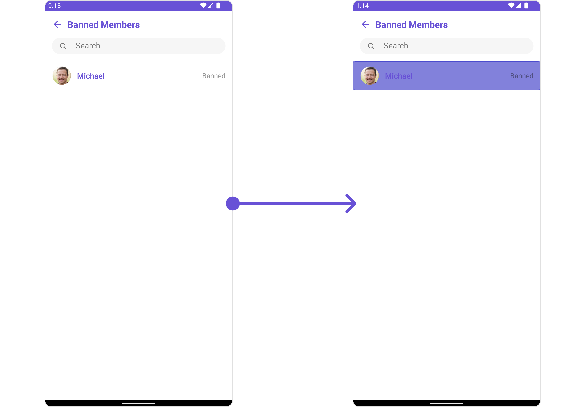
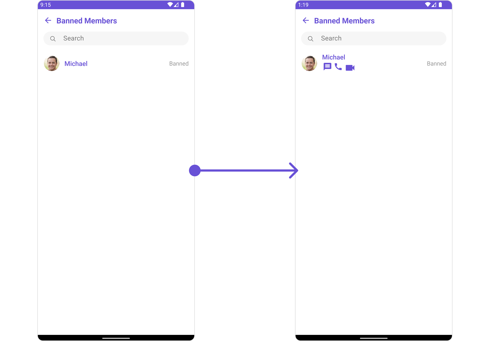
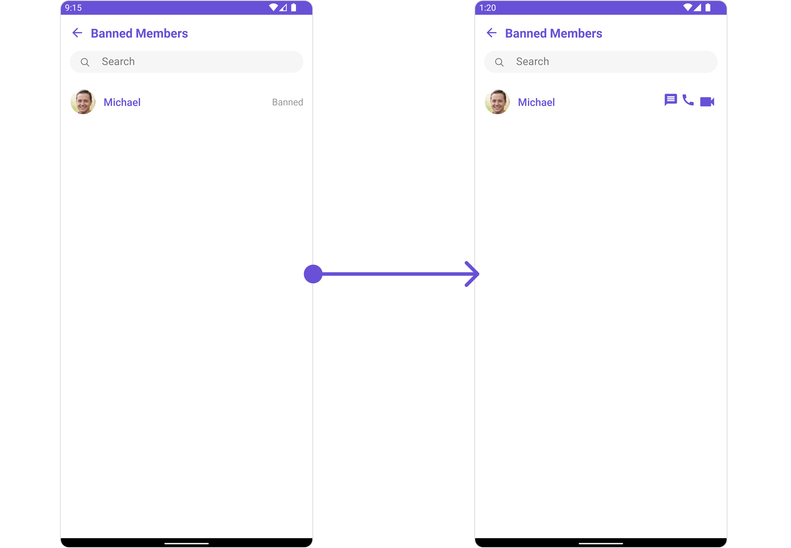
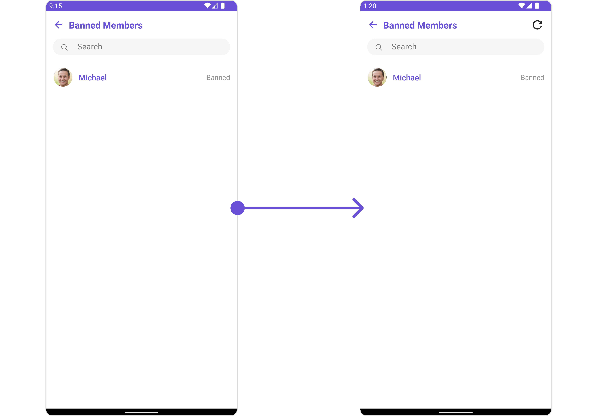
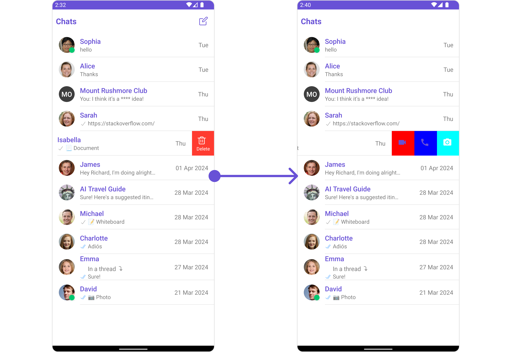
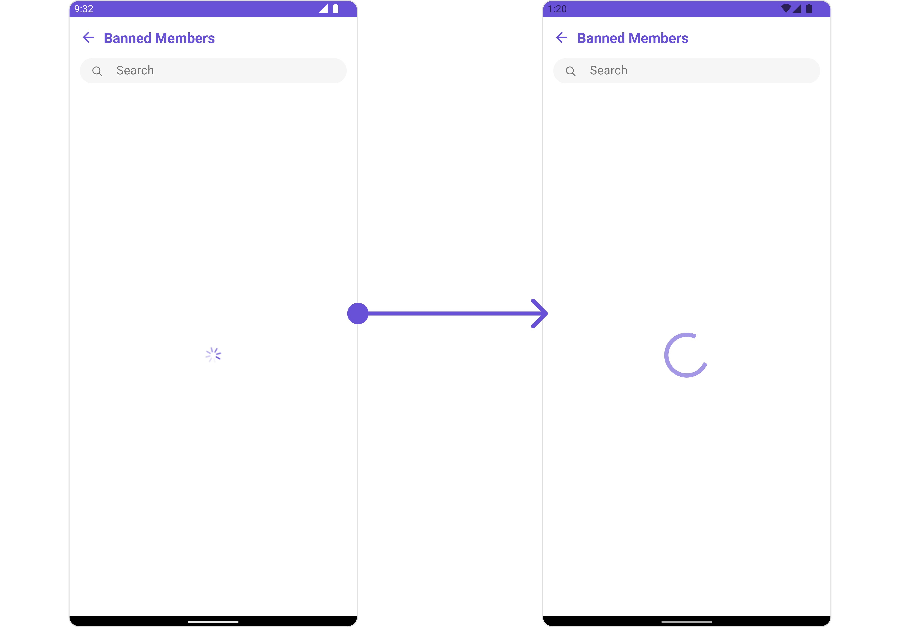
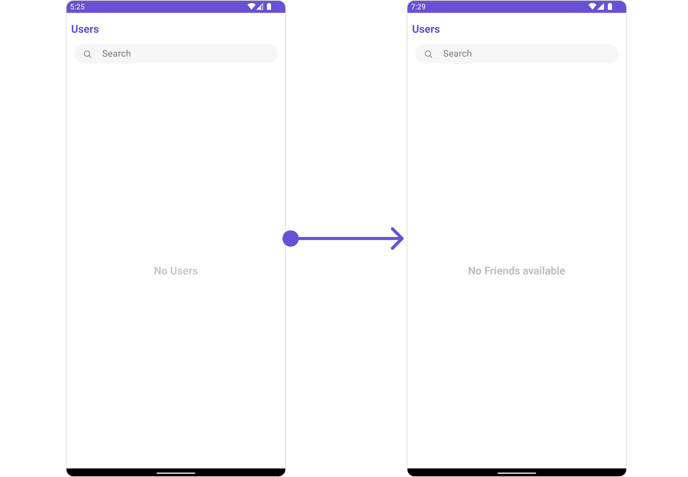
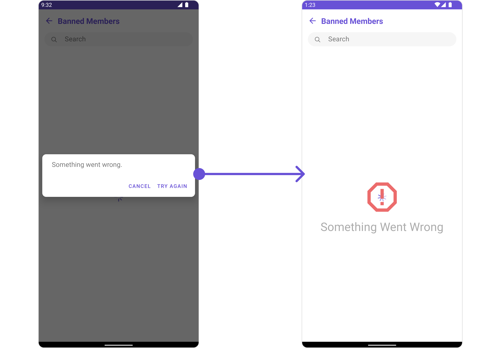

import Tabs from '@theme/Tabs';
import TabItem from '@theme/TabItem';

## Overview

`CometChatBannedMembers` is a crucial [Component](/ui-kit/android/components-overview#components) that showcases users who have been restricted from participating in specific groups or conversations. Once banned, users lose access to content and discussions within the affected group. Administrators or owners wield the authority to ban members from groups they oversee, enabling them to monitor user activity and behavior closely. With CometChatBannedMembers, administrators can take swift and appropriate actions to maintain group integrity and uphold community standards.


The `BannedMembers` component is composed of the following BaseComponents:

| Components                                     | Description                                                                                                                                                                                   |
| ---------------------------------------------- | --------------------------------------------------------------------------------------------------------------------------------------------------------------------------------------------- |
| [CometChatListBase](/ui-kit/android/list-base) | `CometChatListBase` serves as a container component equipped with a title (navigationBar), search functionality (search-bar), background settings, and a container for embedding a list view. |
| [CometChatListItem](/ui-kit/android/list-item) | This component renders information extracted from a `User` object onto a tile, featuring a title, subtitle, leading view, and trailing view.                                                  |

---

## Usage

### Integration

`CometChatBannedMembers`, as a Composite Component, offers flexible integration options, allowing it to be launched directly via button clicks or any user-triggered action. Additionally, it seamlessly integrates into tab view controllers. With banned members, users gain access to a wide range of parameters and methods for effortless customization of its user interface.

The following code snippet exemplifies how you can seamlessly integrate the BannedMembers component into your application.

<Tabs>
<TabItem value="xml" label="XML">

```xml
<com.cometchat.chatuikit.bannedmembers.CometChatBannedMembers
    android:id="@+id/banned_members"
    android:layout_width="match_parent"
    android:layout_height="match_parent" />
```

</TabItem>
</Tabs>

If you're defining the Group members within the XML code, you'll need to extract them and set them on the Group object using the appropriate method.

<Tabs>

<TabItem value="Java" label="Java">
```Java
CometChatBannedMembers cometchatBannedMembers = binding.groupMember;
Group group = new Group();
group.setGuid("GROUP_ID");
group.setName("GROUP_NAME");
cometchatBannedMembers.setGroup(group);
```
</TabItem>

<TabItem value="Kotlin" label="Kotlin">
```Kotlin
val cometchatBannedMembers: CometChatBannedMembers = binding.groupMember
val group: Group = Group()
group.setGuid("GROUP_ID")
group.setName("GROUP_NAME")
cometchatBannedMembers.setGroup(group)
```
</TabItem>

</Tabs>

---

### Actions

[Actions](/ui-kit/android/components-overview#actions) dictate how a component functions. They are divided into two types: Predefined and User-defined. You can override either type, allowing you to tailor the behavior of the component to fit your specific needs.

##### 1. SetOnItemClick

This method proves valuable when users seek to override onItemClick functionality within CometChatBannedMembers, empowering them with greater control and customization options.

The `setOnItemClick` action doesn't have a predefined behavior. You can override this action using the following code snippet.

<Tabs>

<TabItem value="Java" label="Java">
```Java
cometchatBannedMembers.setItemClickListener(new OnItemClickListener<GroupMember>() {
    @Override
    public void OnItemClick(GroupMember groupMember, int i) {
        
    }
});
```
</TabItem>

<TabItem value="Kotlin" label="Kotlin">
```Kotlin
cometchatBannedMembers.setItemClickListener(object : OnItemClickListener<GroupMember>() {
    override fun OnItemClick(groupMember: GroupMember, i: Int) {
        
    }
})
```
</TabItem>

</Tabs>

---

##### 2. SetOnError

You can customize this behavior by using the provided code snippet to override the `On Error` and improve error handling.

<Tabs>

<TabItem value="Java" label="Java">
```Java
cometchatBannedMembers.setOnError(new OnError() {
    @Override
    public void onError(Context context, CometChatException e) {
        
    }
});
```
</TabItem>

<TabItem value="Kotlin" label="Kotlin">
```Kotlin
ccometchatBannedMembers.setOnError(OnError { context, e -> 
    
})
```
</TabItem>

</Tabs>

---

##### 3. OnSelection

The `OnSelection` event is triggered upon the completion of a selection in `SelectionMode`. It does not have a default behavior. However, you can override its behavior using the following code snippet.

<Tabs>

<TabItem value="java" label="Java">
```java title="YourActivity.java"
cometchatBannedMembers.setSelectionMode(UIKitConstants.SelectionMode.MULTIPLE);
cometchatBannedMembers.setOnSelection(new CometChatBannedMembers.OnSelection() {
    @Override
    public void onSelection(List<GroupMember> list) {
        // Handle banned member selection here  
    }
});
```
</TabItem>

<TabItem value="kotlin" label="Kotlin">

```kotlin title="YourActivity.kt"
cometchatBannedMembers.setSelectionMode(UIKitConstants.SelectionMode.MULTIPLE)
cometchatBannedMembers.setOnSelection { list ->
    // Handle banned member selection here
}
```

</TabItem>

</Tabs>

---

##### 4. AddOnBackPressListener

You can customize this behavior by using the provided code snippet to override the `addOnBackPressListener` and improve error handling.

<Tabs>

<TabItem value="Java" label="Java">
```Java
cometchatBannedMembers.addOnBackPressListener(new CometChatListBase.OnBackPress() {
    @Override
    public void onBack() {

    }

});

````
</TabItem>

<TabItem value="Kotlin" label="Kotlin">
```Kotlin
cometchatBannedMembers.addOnBackPressListener(CometChatListBase.OnBackPress {

})
````

</TabItem>

</Tabs>

---

### Filters

**Filters** allow you to customize the data displayed in a list within a Component. You can filter the list based on your specific criteria, allowing for a more customized. Filters can be applied using RequestBuilders of Chat SDK.

##### 1. BannedGroupMembersRequestBuilder

The `BannedGroupMembersRequestBuilder` enables you to filter and customize the Banned Members list based on available parameters in BannedGroupMembersRequestBuilder. This feature allows you to create more specific and targeted queries when fetching banned members. The following are the parameters available in `BannedGroupMembersRequestBuilder`

| Property           | Description                                                                                        | Code                        |
| ------------------ | -------------------------------------------------------------------------------------------------- | --------------------------- |
| **Limit**          | Sets the number of banned members that can be fetched in a single request, suitable for pagination | `.setLimit(Int)`            |
| **Search Keyword** | Used for fetching banned members matching the passed string                                        | `.setSearchKeyword(String)` |

**Example**

In the example below, we are applying a filter to the banned members by setting the limit to 1.

<Tabs>

<TabItem value="Java" label="Java">
```Java
BannedGroupMembersRequest.BannedGroupMembersRequestBuilder bannedGroupMembersRequestBuilder = new BannedGroupMembersRequest.BannedGroupMembersRequestBuilder("GUID")
        .setLimit(1);

cometchatBannedMembers.setBannedGroupMembersRequestBuilder(bannedGroupMembersRequestBuilder);

````
</TabItem>

<TabItem value="Kotlin" label="Kotlin">
```Kotlin
val bannedGroupMembersRequestBuilder = BannedGroupMembersRequestBuilder("GUID")
    .setLimit(1)

cometchatBannedMembers.setBannedGroupMembersRequestBuilder(bannedGroupMembersRequestBuilder)
````

</TabItem>

</Tabs>

---

##### 2. SearchRequestBuilder

The SearchRequestBuilder uses `BannedMembersRequestBuilder` enables you to filter and customize the search list based on available parameters in BannedMembersRequestBuilder.
This feature allows you to keep uniformity between the displayed Banned Members list and searched Banned Members.

<Tabs>

<TabItem value="Java" label="Java">
```Java
BannedGroupMembersRequest.BannedGroupMembersRequestBuilder bannedGroupMembersRequestBuilder = new BannedGroupMembersRequest.BannedGroupMembersRequestBuilder("GUID")
        .setLimit(1)
        .setSearchKeyword("SEARCH_KEYWORD");

cometchatBannedMembers.setSearchRequestBuilder(bannedGroupMembersRequestBuilder);

````
</TabItem>

<TabItem value="Kotlin" label="Kotlin">
```Kotlin
val bannedGroupMembersRequestBuilder = BannedGroupMembersRequestBuilder("GUID")
    .setLimit(1)
    .setSearchKeyword("SEARCH_KEYWORD")

cometchatBannedMembers.setSearchRequestBuilder(bannedGroupMembersRequestBuilder)
````

</TabItem>

</Tabs>

---

### Events

[Events](/ui-kit/android/components-overview#events) are emitted by a `Component`. By using event you can extend existing functionality. Being global events, they can be applied in Multiple Locations and are capable of being Added or Removed.

Events emitted by the Join Group component is as follows.

| Event                     | Description                                                                                               |
| ------------------------- | --------------------------------------------------------------------------------------------------------- |
| **ccGroupMemberBanned**   | This method is triggered when the logged-in user successfully bans a user from the group.                 |
| **ccGroupMemberUnBanned** | This method triggers when the logged-in user successfully unbans a previously banned user from the group. |

<Tabs>

<TabItem value="Java" label="Java">
```Java
CometChatGroupEvents.addGroupListener("LISTENER_ID", new CometChatGroupEvents() {
    @Override
    public void ccGroupMemberBanned(Action actionMessage, User bannedUser, User bannedBy, Group bannedFrom) {
        super.ccGroupMemberBanned(actionMessage, bannedUser, bannedBy, bannedFrom);
    }

    @Override
    public void ccGroupMemberUnBanned(Action actionMessage, User unbannedUser, User unBannedBy, Group unBannedFrom) {
        super.ccGroupMemberUnBanned(actionMessage, unbannedUser, unBannedBy, unBannedFrom);
    }

});

````
</TabItem>

<TabItem value="Kotlin" label="Kotlin">
```Kotlin
CometChatGroupEvents.addGroupListener("LISTENER_ID", object : CometChatGroupEvents() {
    override fun ccGroupMemberBanned(
        actionMessage: Action,
        bannedUser: User,
        bannedBy: User,
        bannedFrom: Group
    ) {
        super.ccGroupMemberBanned(actionMessage, bannedUser, bannedBy, bannedFrom)
    }

    override fun ccGroupMemberUnBanned(
        actionMessage: Action,
        unbannedUser: User,
        unBannedBy: User,
        unBannedFrom: Group
    ) {
        super.ccGroupMemberUnBanned(actionMessage, unbannedUser, unBannedBy, unBannedFrom)
    }
})
````

</TabItem>

</Tabs>

Remove the added listener

<Tabs>

<TabItem value="Java" label="Java">
```Java
CometChatGroupEvents.removeListener("LISTENER_ID");Q
```
</TabItem>

<TabItem value="Kotlin" label="Kotlin">
```Kotlin
CometChatGroupEvents.removeListener("LISTENER_ID")
```
</TabItem>

</Tabs>

---

## Customization

To fit your app's design requirements, you can customize the appearance of the Groups component. We provide exposed methods that allow you to modify the experience and behavior according to your specific needs.

### Style

Using **Style** you can **customize** the look and feel of the component in your app, These parameters typically control elements such as the **color**, **size**, **shape**, and **fonts** used within the component.

##### 1. BannedMembers Style <a data-tooltip-id="my-tooltip-html-prop"> <span class="material-icons red">report</span> </a>

You can set the `BannedMembersStyle` to the `Banned Members` Component to customize the styling.

<Tabs>

<TabItem value="Java" label="Java">
```Java
BannedMembersStyle bannedMembersStyle = new BannedMembersStyle();
bannedMembersStyle.setBackground(getResources().getColor(R.color.white_300));
bannedMembersStyle.setTitleColor(getResources().getColor(R.color.red));
cometchatBannedMembers.setStyle(bannedMembersStyle);
```
</TabItem>

<TabItem value="Kotlin" label="Kotlin">
```Kotlin
val bannedMembersStyle = BannedMembersStyle()
bannedMembersStyle.setBackground(resources.getColor(R.color.white_300))
bannedMembersStyle.setTitleColor(resources.getColor(R.color.red))
cometchatBannedMembers.setStyle(bannedMembersStyle)
```
</TabItem>

</Tabs>

List of properties exposed by BannedMembersStyle

| Property                   | Description                                                                                                         | Code                                      |
| -------------------------- | ------------------------------------------------------------------------------------------------------------------- | ----------------------------------------- |
| **Background**             | Used to set the background color                                                                                    | `.setBackground(@ColorInt int)`           |
| **BorderWidth**            | Used to set border                                                                                                  | `.setBorderWidth(int)`                    |
| **BorderColor**            | Used to set border color                                                                                            | `.setBorderColor(@ColorInt int)`          |
| **CornerRadius**           | Used to set border radius                                                                                           | `.setCornerRadius(float)`                 |
| **Background**             | Used to set background Drawable                                                                                     | `.setBackground(Drawable)`                |
| **Title Appearance**       | Used to customise the appearance of the title in the app bar                                                        | `.setTitleAppearance(@StyleRes int)`      |
| **Back Icon Tint**         | Used to set the color of the back icon in the app bar                                                               | `.setBackIconTint(@ColorInt int)`         |
| **Search Background**      | Used to set the background color of the search box                                                                  | `.setSearchBackground(@ColorInt int)`     |
| **Search Border Radius**   | Used to set the border radius of the search box                                                                     | `.setSearchBorderRadius(int)`             |
| **Search Icon Tint**       | Used to set the color of the search icon in the search box                                                          | `.setSearchIconTint(@ColorInt int)`       |
| **Search Border Width**    | Used to set the border width of the search box                                                                      | `.setSearchBorderWidth(int)`              |
| **Search Text Appearance** | Used to set the style of the text in the search box                                                                 | `.setSearchTextAppearance(@StyleRes int)` |
| **Loading Icon Tint**      | Used to set the color of the icon shown while the list of group members is being fetched                            | `.setLoadingIconTint(@ColorInt int)`      |
| **Empty Text Appearance**  | Used to set the style of the response text shown when fetching the list of group members has returned an empty list | `.setEmptyTextAppearance(@StyleRes int)`  |
| **Error Text Appearance**  | Used to set the style of the response text shown in case some error occurs while fetching the list of group members | `.setErrorTextAppearance(@StyleRes int)`  |
| **Online Status Color**    | Used to set the color of the status indicator shown if a group member is online                                     | `.setOnlineStatusColor(@ColorInt int)`    |
| **Separator Color**        | Used to set the color of the divider separating the group member items                                              | `.setSeparatorColor(@ColorInt int)`       |

---

##### 2. Avatar Style

To apply customized styles to the `Avatar` component in the Banned Members Component, you can use the following code snippet. For further insights on `Avatar` Styles [refer](/ui-kit/android/avatar)

<Tabs>

<TabItem value="Java" label="Java">
```Java
AvatarStyle avatarStyle = new AvatarStyle();
avatarStyle.setBorderWidth(10);
avatarStyle.setBorderColor(Color.BLACK);
cometchatBannedMembers.setAvatarStyle(avatarStyle);
```
</TabItem>

<TabItem value="Kotlin" label="Kotlin">
```Kotlin
val avatarStyle = AvatarStyle()
avatarStyle.borderWidth = 10
avatarStyle.borderColor = Color.BLACK
cometchatBannedMembers.setAvatarStyle(avatarStyle)
```
</TabItem>

</Tabs>

---

##### 3. StatusIndicator Style

To apply customized styles to the Status Indicator component in the Group Member Component, You can use the following code snippet. For further insights on Status Indicator Styles [refer](/ui-kit/android/status-indicator)

<Tabs>

<TabItem value="Java" label="Java">
```Java
StatusIndicatorStyle statusIndicatorStyle = new StatusIndicatorStyle();
statusIndicatorStyle.setCornerRadius(3.5f);
statusIndicatorStyle.setBorderColor(Color.GREEN);
statusIndicatorStyle.setBorderWidth(10);
cometchatBannedMembers.setStatusIndicatorStyle(statusIndicatorStyle);
```
</TabItem>

<TabItem value="Kotlin" label="Kotlin">
```Kotlin
val statusIndicatorStyle = StatusIndicatorStyle()
statusIndicatorStyle.setCornerRadius(3.5f)
statusIndicatorStyle.setBorderColor(Color.GREEN)
statusIndicatorStyle.setBorderWidth(10)
cometchatBannedMembers.setStatusIndicatorStyle(statusIndicatorStyle)
```
</TabItem>

</Tabs>

---

##### 4. ListItem Style

To apply customized styles to the `List Item` component in the `Group Member` Component, you can use the following code snippet. For further insights on `List Item` Styles [refer](/ui-kit/android/list-item)

<!--  -->

<Tabs>

<TabItem value="Java" label="Java">
```Java
ListItemStyle listItemStyle = new ListItemStyle();
listItemStyle.setBackground(R.color.purple_200);
listItemStyle.setBorderWidth(2);
listItemStyle.setBorderColor(R.color.purple_700);
listItemStyle.setCornerRadius(20);
cometchatBannedMembers.setListItemStyle(listItemStyle);
```
</TabItem>

<TabItem value="Kotlin" label="Kotlin">
```Kotlin
val listItemStyle = ListItemStyle()
listItemStyle.setBackground(R.color.purple_200)
listItemStyle.setBorderWidth(2)
listItemStyle.setBorderColor(R.color.purple_700)
listItemStyle.setCornerRadius(20f)
cometchatBannedMembers.setListItemStyle(listItemStyle)
```
</TabItem>

</Tabs>

---

### Functionality

These are a set of small functional customizations that allow you to fine-tune the overall experience of the component. With these, you can change text, set custom icons, and toggle the visibility of UI elements.

<Tabs>

<TabItem value="Java" label="Java">
```Java
cometchatBannedMembers.setTitle("Your Title");
cometchatBannedMembers.disableUsersPresence(true);
cometchatBannedMembers.hideSeparator(true);
```
</TabItem>

<TabItem value="Kotlin" label="Kotlin">
```Kotlin
cometchatBannedMembers.setTitle("Your Title")
cometchatBannedMembers.disableUsersPresence(true)
cometchatBannedMembers.hideSeparator(true)
```
</TabItem>

</Tabs>

List of Functionality exposed by `CometChatBannedMembers`

| Property                    | Description                                                                                      | Code                                             |
| --------------------------- | ------------------------------------------------------------------------------------------------ | ------------------------------------------------ |
| **Group**                   | The group for which the banned members will be listed. A required parameter.                     | `.setGroup(Group)`                               |
| **Title**                   | Used to set title in the app bar                                                                 | `.setTitle(String)`                              |
| **Style**                   | Used to set styling properties                                                                   | `.setStyle(BannedMembersStyle)`                  |
| **Avatar Style**            | Used to customise the Avatar of the banned member                                                | `.setAvatarStyle(AvatarStyle)`                   |
| **Status Indicator Style**  | Used to customise the status indicator shown if a banned member is online                        | `.setStatusIndicatorStyle(StatusIndicatorStyle)` |
| **Search Placeholder Text** | Used to set search placeholder text                                                              | `.setSearchPlaceholderText(String)`              |
| **Back Icon**               | Used to set back button widget                                                                   | `.backIcon(@DrawableRes int res)`                |
| **Show Back Button**        | Used to toggle visibility for back button                                                        | `.showBackButton(boolean)`                       |
| **Search Box Icon**         | Used to set search Icon in the search field                                                      | `.setSearchBoxIcon(@DrawableRes int res)`        |
| **Hide Search**             | Used to toggle visibility for search box                                                         | `.hideSearch(boolean)`                           |
| **Hide Error**              | Used to hide error on fetching banned members                                                    | `.hideError(boolean)`                            |
| **Hide Separator**          | Used to hide the divider separating the banned member items                                      | `.hideSeparator(boolean)`                        |
| **Disable Users Presence**  | Used to control visibility of banned member indicator shown if user is online                    | `.disableUsersPresence(boolean)`                 |
| **List Item Style**         | Used to set style to Tile which displays data obtained from a GroupMember object                 | `.setListItemStyle(ListItemStyle)`               |
| **Selection Mode**          | Used to set the number of banned members that can be selected                                    | `.selectionMode(SelectionMode)`                  |
| **Error State Text**        | Used to set a custom text response when some error occurs on fetching the list of banned members | `.errorStateText(String)`                        |

---

### Advance

For advanced-level customization, you can set custom views to the component. This lets you tailor each aspect of the component to fit your exact needs and application aesthetics. You can create and define your views, layouts, and UI elements and then incorporate those into the component.

#### SetListItemView

With this function, you can assign a custom ListItem to the List View Component.

<Tabs>

<TabItem value="Java" label="Java">

```Java
cometchatBannedMembers.setListItemView(new BannedMembersViewHolderListeners() {
    @Override
    public View createView(Context context, CometChatListItem cometChatListItem) {
        return null;
    }

    @Override
    public void bindView(Context context, View view, GroupMember groupMember, Group group, RecyclerView.ViewHolder viewHolder, List<GroupMember> list, int i) {

    }
});
```

</TabItem>

<TabItem value="Kotlin" label="Kotlin">

```Kotlin
cometchatBannedMembers.setListItemView(object : BannedMembersViewHolderListeners() {
    override fun createView(
        context: Context?,
        cometChatListItem: CometChatListItem?
    ): View? {
        return null
    }

    override fun bindView(
        context: Context?,
        view: View?,
        groupMember: GroupMember?,
        group: Group?,
        viewHolder: RecyclerView.ViewHolder?,
        list: List<GroupMember?>?,
        i: Int
    ) {
    }
})
```

</TabItem>

</Tabs>

**Example**



You can indeed create a custom layout file named `item_list.xml` for more complex or unique list items.

Once this layout file is made, you would inflate it inside the `createView()` method of the `BannedMembersViewHolderListeners`. The inflation process prepares the layout for use in your application:

Following this, you would use the `bindView()` method to initialize and assign values to your individual views. This could include setting text on TextViews, images on ImageViews, and so on based on the properties of the Group object:

```xml title="item_list.xml"
<?xml version="1.0" encoding="utf-8"?>
<RelativeLayout xmlns:android="http://schemas.android.com/apk/res/android"
    xmlns:app="http://schemas.android.com/apk/res-auto"
    xmlns:tools="http://schemas.android.com/tools"
    android:layout_width="match_parent"
    android:layout_height="match_parent">

    <androidx.cardview.widget.CardView
        android:layout_width="match_parent"
        android:layout_height="wrap_content"
        android:layout_margin="5dp"
        android:elevation="10dp"
        app:cardBackgroundColor="@color/purple_500"
        app:cardCornerRadius="10dp">

        <RelativeLayout
            android:layout_width="match_parent"
            android:layout_height="wrap_content">

            <com.cometchat.chatuikit.shared.views.CometChatAvatar.CometChatAvatar
                android:id="@+id/item_avatar"
                android:layout_width="50dp"
                android:layout_height="50dp"
                android:layout_centerVertical="true"
                android:layout_margin="10dp"
                android:padding="10dp" />

            <TextView
                android:id="@+id/txt_item_name"
                android:layout_width="match_parent"
                android:layout_height="wrap_content"
                android:layout_centerVertical="true"
                android:layout_toRightOf="@+id/item_avatar"
                android:text="name"
                android:textSize="17sp" />

            <TextView
                android:id="@+id/txt_item_date"
                android:layout_width="wrap_content"
                android:layout_height="wrap_content"
                android:layout_alignParentEnd="true"
                android:layout_centerVertical="true"
                android:layout_margin="10dp"
                android:text="date"
                android:textSize="12sp" />
        </RelativeLayout>
    </androidx.cardview.widget.CardView>
</RelativeLayout>
```

<Tabs>

<TabItem value="Java" label="Java">

```Java title="YourActivity.java"
cometchatBannedMembers.setListItemView(new BannedMembersViewHolderListeners() {
    @Override
    public View createView(Context context, CometChatListItem cometChatListItem) {
        View view = getLayoutInflater().inflate(R.layout.item_list, null);
        return view;
    }

    @Override
    public void bindView(Context context, View view, GroupMember groupMember, Group group, RecyclerView.ViewHolder viewHolder, List<GroupMember> list, int i) {
        CometChatAvatar avatarView = view.findViewById(R.id.item_avatar);
        avatarView.setRadius(100);
        TextView nameView = view.findViewById(R.id.txt_item_name);
        nameView.setText(groupMember.getName());
        avatarView.setImage(groupMember.getAvatar(), groupMember.getName());
    }
});
```

</TabItem>

<TabItem value="Kotlin" label="Kotlin">

```Kotlin title="YourActivity.kt"
cometchatBannedMembers.setListItemView(object : BannedMembersViewHolderListeners() {
    override fun createView(context: Context, cometChatListItem: CometChatListItem): View {
        val view: View = getLayoutInflater().inflate(R.layout.item_list, null)
        return view
    }

    override fun bindView(
        context: Context,
        view: View,
        groupMember: GroupMember,
        group: Group,
        viewHolder: RecyclerView.ViewHolder,
        list: List<GroupMember>,
        i: Int
    ) {
        val avatarView = view.findViewById<CometChatAvatar>(R.id.item_avatar)
        avatarView.radius = 100f
        val nameView = view.findViewById<TextView>(R.id.txt_item_name)
        nameView.text = groupMember.name
        avatarView.setImage(groupMember.avatar, groupMember.name)
    }
})
```

</TabItem>

</Tabs>

---

#### SetSubTitleView

You can customize the subtitle view for each user list item to meet your requirements

<Tabs>

<TabItem value="Java" label="Java">

```Java
cometchatBannedMembers.setSubtitleView(new BannedMembersViewHolderListeners() {
    @Override
    public View createView(Context context, CometChatListItem cometChatListItem) {
        return null;
    }

    @Override
    public void bindView(Context context, View view, GroupMember groupMember, Group group, RecyclerView.ViewHolder viewHolder, List<GroupMember> list, int i) {

    }
});
```

</TabItem>

<TabItem value="Kotlin" label="Kotlin">

```Kotlin
cometchatBannedMembers.setSubtitleView(object : BannedMembersViewHolderListeners() {
    override fun createView(context: Context, cometChatListItem: CometChatListItem): View? {
        return null
    }

    override fun bindView(
        context: Context,
        view: View,
        groupMember: GroupMember,
        group: Group,
        viewHolder: RecyclerView.ViewHolder,
        list: List<GroupMember>,
        i: Int
    ) {
    }
})
```

</TabItem>

</Tabs>

**Example**



You can indeed create a custom layout file named `subtitle_layout.xml` for more complex or unique list items.

Once this layout file is made, you would inflate it inside the `createView()` method of the `BannedMembersViewHolderListeners`. The inflation process prepares the layout for use in your application:

Following this, you would use the `bindView()` method to initialize and assign values to your individual views. This could include setting text on TextViews, images on ImageViews, and so on based on the properties of the Group object:

```xml title="subtitle_layout.xml"
<?xml version="1.0" encoding="utf-8"?>
<RelativeLayout xmlns:android="http://schemas.android.com/apk/res/android"
    android:layout_width="match_parent"
    android:layout_height="match_parent">

    <TextView
        android:id="@+id/txt_subtitle"
        android:layout_width="wrap_content"
        android:layout_height="wrap_content"
        android:text="Subtitle" />

    <ImageView
        android:id="@+id/img_conversation"
        android:layout_width="wrap_content"
        android:layout_height="wrap_content"
        android:layout_below="@+id/txt_subtitle"
        android:layout_margin="2dp"
        android:src="@drawable/ic_message_grey" />

    <ImageView
        android:id="@+id/img_audio_call"
        android:layout_width="wrap_content"
        android:layout_height="wrap_content"
        android:layout_below="@+id/txt_subtitle"
        android:layout_margin="2dp"
        android:layout_toEndOf="@+id/img_conversation"
        android:src="@drawable/ic_call" />

    <ImageView
        android:id="@+id/img_video_call"
        android:layout_width="wrap_content"
        android:layout_height="wrap_content"
        android:layout_below="@+id/txt_subtitle"
        android:layout_margin="2dp"
        android:layout_toEndOf="@+id/img_audio_call"
        android:src="@drawable/ic_video" />

</RelativeLayout>
```

<Tabs>

<TabItem value="Java" label="Java">

```Java title="YourActivity.java"
cometchatBannedMembers.setSubtitleView(new BannedMembersViewHolderListeners() {
    @Override
    public View createView(Context context, CometChatListItem cometChatListItem) {
        View view = getLayoutInflater().inflate(R.layout.subtitle_layout, null);
        return view;
    }

    @Override
    public void bindView(Context context, View view, GroupMember groupMember, Group group, RecyclerView.ViewHolder viewHolder, List<GroupMember> list, int i) {
        TextView txtSubtitle = view.findViewById(R.id.txt_subtitle);
        ImageView imgConversation = view.findViewById(R.id.img_conversation);
        ImageView imgAudioCall = view.findViewById(R.id.img_audio_call);;
        ImageView imgVideCall = view.findViewById(R.id.img_video_call);;
        txtSubtitle.setText(group.getName());
        imgConversation.setOnClickListener(v -> {
            Toast.makeText(context, "Conversation Clicked", Toast.LENGTH_SHORT).show();
        });
        imgAudioCall.setOnClickListener(v -> {
            Toast.makeText(context, "Audio Call Clicked", Toast.LENGTH_SHORT).show();
        });
        imgVideCall.setOnClickListener(v -> {
            Toast.makeText(context, "Video Call Clicked", Toast.LENGTH_SHORT).show();
        });
    }
});
```

</TabItem>

<TabItem value="Kotlin" label="Kotlin">

```Kotlin title="YourActivity.kt"
cometchatBannedMembers.setSubtitleView(object : BannedMembersViewHolderListeners() {
    override fun createView(context: Context, cometChatListItem: CometChatListItem): View {
        val view: View = layoutInflater.inflate(R.layout.subtitle_layout, null)
        return view
    }

    override fun bindView(
        context: Context,
        view: View,
        groupMember: GroupMember,
        group: Group,
        viewHolder: RecyclerView.ViewHolder,
        list: List<GroupMember>,
        i: Int
    ) {
        val txtSubtitle = view.findViewById<TextView>(R.id.txt_subtitle)
        val imgConversation = view.findViewById<ImageView>(R.id.img_conversation)
        val imgAudioCall = view.findViewById<ImageView>(R.id.img_audio_call)

        val imgVideCall = view.findViewById<ImageView>(R.id.img_video_call)

        txtSubtitle.text = group.name
        imgConversation.setOnClickListener { v: View? ->
            Toast.makeText(context, "Conversation Clicked", Toast.LENGTH_SHORT).show()
        }
        imgAudioCall.setOnClickListener { v: View? ->
            Toast.makeText(context, "Audio Call Clicked", Toast.LENGTH_SHORT).show()
        }
        imgVideCall.setOnClickListener { v: View? ->
            Toast.makeText(context, "Video Call Clicked", Toast.LENGTH_SHORT).show()
        }
    }
})
```

</TabItem>

</Tabs>

---

#### SetTailView

Used to generate a custom trailing view for the GroupList item. You can add a Tail view using the following method.

<Tabs>

<TabItem value="Java" label="Java">

```Java
cometchatBannedMembers.setTailView(new BannedMembersViewHolderListeners() {
    @Override
    public View createView(Context context, CometChatListItem cometChatListItem) {
        return null;
    }

    @Override
    public void bindView(Context context, View view, GroupMember groupMember, Group group, RecyclerView.ViewHolder viewHolder, List<GroupMember> list, int i) {

    }
});
```

</TabItem>

<TabItem value="Kotlin" label="Kotlin">

```Kotlin
cometchatBannedMembers.setTailView(object : BannedMembersViewHolderListeners() {
    override fun createView(context: Context, cometChatListItem: CometChatListItem): View {
        return null
    }

    override fun bindView(
        context: Context,
        view: View,
        groupMember: GroupMember,
        group: Group,
        viewHolder: RecyclerView.ViewHolder,
        list: List<GroupMember>,
        i: Int
    ) {
    }
})
```

</TabItem>

</Tabs>

**Example**



You can indeed create a custom layout file named `tail_view_layout.xml` for more complex or unique list items.

Once this layout file is made, you would inflate it inside the `createView()` method of the `BannedMembersViewHolderListeners`. The inflation process prepares the layout for use in your application:

Following this, you would use the `bindView()` method to initialize and assign values to your individual views. This could include setting text on TextViews, images on ImageViews, and so on based on the properties of the Group object:

```xml title="tail_view_layout.xml"
<?xml version="1.0" encoding="utf-8"?>
<RelativeLayout xmlns:android="http://schemas.android.com/apk/res/android"
    android:layout_width="match_parent"
    android:layout_height="match_parent">

    <TextView
        android:id="@+id/txt_subtitle"
        android:layout_width="wrap_content"
        android:layout_height="wrap_content"
        android:text="Subtitle" />

    <ImageView
        android:id="@+id/img_conversation"
        android:layout_width="wrap_content"
        android:layout_height="wrap_content"
        android:layout_below="@+id/txt_subtitle"
        android:layout_margin="2dp"
        android:src="@drawable/ic_message_grey" />

    <ImageView
        android:id="@+id/img_audio_call"
        android:layout_width="wrap_content"
        android:layout_height="wrap_content"
        android:layout_below="@+id/txt_subtitle"
        android:layout_margin="2dp"
        android:layout_toRightOf="@+id/img_conversation"
        android:src="@drawable/ic_call" />

    <ImageView
        android:id="@+id/img_video_call"
        android:layout_width="wrap_content"
        android:layout_height="wrap_content"
        android:layout_below="@+id/txt_subtitle"
        android:layout_margin="2dp"
        android:layout_toRightOf="@+id/img_audio_call"
        android:src="@drawable/ic_video" />

</RelativeLayout>
```

<Tabs>

<TabItem value="Java" label="Java">

```Java title="YourActivity.java"
cometchatBannedMembers.setTailView(new BannedMembersViewHolderListeners() {
    @Override
    public View createView(Context context, CometChatListItem cometChatListItem) {
        View view = getLayoutInflater().inflate(R.layout.subtitle_layout, null);
        return view;
    }

    @Override
    public void bindView(Context context, View view, GroupMember groupMember, Group group, RecyclerView.ViewHolder viewHolder, List<GroupMember> list, int i) {
        TextView txtSubtitle = view.findViewById(R.id.txt_subtitle);
        ImageView imgConversation = view.findViewById(R.id.img_conversation);
        ImageView imgAudioCall = view.findViewById(R.id.img_audio_call);;
        ImageView imgVideCall = view.findViewById(R.id.img_video_call);;
        txtSubtitle.setText(group.getName());
        imgConversation.setOnClickListener(v -> {
            Toast.makeText(context, "Conversation Clicked", Toast.LENGTH_SHORT).show();
        });
        imgAudioCall.setOnClickListener(v -> {
            Toast.makeText(context, "Audio Call Clicked", Toast.LENGTH_SHORT).show();
        });
        imgVideCall.setOnClickListener(v -> {
            Toast.makeText(context, "Video Call Clicked", Toast.LENGTH_SHORT).show();
        });
    }
});
```

</TabItem>

<TabItem value="Kotlin" label="Kotlin">

```Kotlin title="YourActivity.kt"
cometchatBannedMembers.setTailView(object : BannedMembersViewHolderListeners() {
override fun createView(context: Context, cometChatListItem: CometChatListItem): View {
    val view: View = layoutInflater.inflate(R.layout.subtitle_layout, null)
    return view
}

override fun bindView(
    context: Context,
    view: View,
    groupMember: GroupMember,
    group: Group,
    viewHolder: RecyclerView.ViewHolder,
    list: List<GroupMember>,
    i: Int
) {
    val txtSubtitle = view.findViewById<TextView>(R.id.txt_subtitle)
    val imgConversation = view.findViewById<ImageView>(R.id.img_conversation)
    val imgAudioCall = view.findViewById<ImageView>(R.id.img_audio_call)

    val imgVideCall = view.findViewById<ImageView>(R.id.img_video_call)

    txtSubtitle.text = group.name
    imgConversation.setOnClickListener { v: View? ->
        Toast.makeText(context, "Conversation Clicked", Toast.LENGTH_SHORT).show()
    }
    imgAudioCall.setOnClickListener { v: View? ->
        Toast.makeText(context, "Audio Call Clicked", Toast.LENGTH_SHORT).show()
    }
    imgVideCall.setOnClickListener { v: View? ->
        Toast.makeText(context, "Video Call Clicked", Toast.LENGTH_SHORT).show()
    }
}
})
```

</TabItem>

</Tabs>

---

#### SetMenu

You can set the Custom Menu view to add more options to the Groups component.

<Tabs>

<TabItem value="Java" label="Java">

```Java
cometchatBannedMembers.setMenu(View v);
```

</TabItem>

<TabItem value="Kotlin" label="Kotlin">

```Kotlin
cometchatBannedMembers.setMenu(v)
```

</TabItem>

</Tabs>

**Example**



You need to create a `view_menu.xml` as a custom view file. Which we will inflate and pass to `.setMenu()`.

```xml title="view_menu.xml"
<?xml version="1.0" encoding="utf-8"?>
<LinearLayout xmlns:android="http://schemas.android.com/apk/res/android"
    xmlns:app="http://schemas.android.com/apk/res-auto"
    xmlns:tools="http://schemas.android.com/tools"
    android:layout_width="match_parent"
    android:layout_height="match_parent"
    android:orientation="horizontal"
    tools:context=".MainActivity">

    <ImageView
        android:id="@+id/img_refresh"
        android:layout_width="30dp"
        android:layout_height="30dp"
        android:src="@drawable/ic_refresh_black" />

</LinearLayout>
```

You inflate the view and pass it to `setMenu`. You can get the child view reference and can handle click actions.

<Tabs>

<TabItem value="Java" label="Java">

```Java title="YourActivity.java"
View view = getLayoutInflater().inflate(R.layout.view_menu, null);
ImageView imgRefresh = view.findViewById(R.id.img_refresh);
imgRefresh.setOnClickListener(v -> {
    Toast.makeText(requireContext(), "Clicked on Refresh", Toast.LENGTH_SHORT).show();
});
cometchatBannedMembers.setMenu(view);
```

</TabItem>

<TabItem value="Kotlin" label="Kotlin">

```Kotlin title="YourActivity.kt"
val view: View = layoutInflater.inflate(R.layout.view_menu, null)
val imgRefresh = view.findViewById<ImageView>(R.id.img_refresh)
imgRefresh.setOnClickListener { v: View? ->
    Toast.makeText(requireContext(), "Clicked on Refresh", Toast.LENGTH_SHORT).show()
}
cometchatBannedMembers.setMenu(view)
```

</TabItem>

</Tabs>

---

#### SetOptions

You can set a List of `CometChatOption` for a Banned Members to add your custom actions to the Members. These options will be visible when swiping any Banned Members item.

<Tabs>

<TabItem value="java" label="Java">
```java
cometchatBannedMembers.setOptions((context, groupMember, group) -> {
    // Handle banned member options here (return null for default behavior)
    return null;
});
```
</TabItem>

<TabItem value="kotlin" label="Kotlin">
```kotlin
cometchatBannedMembers.setOptions { context, groupMember, group ->
    // Handle banned member options here (return null for default behavior)
    return null
}
```
</TabItem>

</Tabs>

##### Example

<Tabs>

<TabItem value="java" label="Java">
```Java title="YourActivity.java"
cometchatBannedMembers.setOptions((context, groupMember, group) -> {
    List<CometChatOption> optionList = new ArrayList<>();

    CometChatOption option = new CometChatOption();
    option.setId("option_send_photo");
    option.setIcon(R.drawable.ic_camera);
    option.setBackgroundColor(Color.CYAN);
    option.setOnClick(() -> {
        // Your Action onClick of option
    });
    optionList.add(option);

    CometChatOption option2 = new CometChatOption();
    option2.setId("option_audio_call");
    option2.setIcon(R.drawable.ic_call);
    option2.setBackgroundColor(Color.BLUE);
    option2.setOnClick(() -> {
        // Your Action onClick of option
    });
    optionList.add(option2);

    CometChatOption option3 = new CometChatOption();
    option3.setId("option_video_call");
    option3.setIcon(R.drawable.ic_video);
    option3.setBackgroundColor(Color.RED);
    option3.setOnClick(() -> {
        // Your Action onClick of option
    });
    optionList.add(option3);

    return optionList;

});

````

</TabItem>

<TabItem value="kotlin" label="Kotlin">

```kotlin
cometchatBannedMembers.setOptions { context, groupMember, group ->
    val optionList = ArrayList<CometChatOption>()

    val option1 = CometChatOption().apply {
        id = "option_send_photo"
        icon = context.resources.getDrawable(R.drawable.ic_camera) // Access drawable using resources
        backgroundColor = Color.CYAN
        setOnClick {
            // Your action on click of option1
        }
    }
    optionList.add(option1)

    val option2 = CometChatOption().apply {
        id = "option_audio_call"
        icon = context.resources.getDrawable(R.drawable.ic_call)
        backgroundColor = Color.BLUE
        setOnClick {
            // Your action on click of option2
        }
    }
    optionList.add(option2)

    val option3 = CometChatOption().apply {
        id = "option_video_call"
        icon = context.resources.getDrawable(R.drawable.ic_video)
        backgroundColor = Color.RED
        setOnClick {
            // Your action on click of option3
        }
    }
    optionList.add(option3)

    return optionList
}
````

</TabItem>

</Tabs>

<!--  -->

---

#### SetLoadingStateView

You can set a custom loader view using `setLoadingStateView` to match the loading view of your app.

<Tabs>

<TabItem value="Java" label="Java">

```Java
cometchatBannedMembers.setLoadingStateView();
```

</TabItem>

<TabItem value="Kotlin" label="Kotlin">

```Kotlin
cometchatBannedMembers.setLoadingStateView()
```

</TabItem>

</Tabs>

**Example**



We have added a `ContentLoadingProgressBar` to `loading_view_layout.xml`. You can choose any view you prefer. This view should be inflated and passed to the `setLoadingStateView()` method.

```xml title="loading_view_layout.xml"
<?xml version="1.0" encoding="utf-8"?>
<FrameLayout xmlns:android="http://schemas.android.com/apk/res/android"
    android:layout_width="match_parent"
    android:layout_height="match_parent"
    android:layout_gravity="center_vertical">

    <androidx.core.widget.ContentLoadingProgressBar
        style="?android:attr/progressBarStyleLarge"
        android:layout_width="wrap_content"
        android:layout_height="wrap_content"
        android:layout_gravity="center_horizontal" />

</FrameLayout>
```

<Tabs>

<TabItem value="Java" label="Java">

```Java title="YourActivity.java"
cometchatBannedMembers.setLoadingStateView(R.layout.loading_view_layout);
```

</TabItem>

<TabItem value="Kotlin" label="Kotlin">

```Kotlin title="YourActivity.kt"
cometchatBannedMembers.setLoadingStateView(R.layout.loading_view_layout)
```

</TabItem>

</Tabs>

---

#### SetEmptyStateView

You can set a custom `EmptyStateView` using `setEmptyStateView` to match the empty view of your app.

<Tabs>

<TabItem value="Java" label="Java">

```Java
cometchatBannedMembers.setEmptyStateView();
```

</TabItem>

<TabItem value="Kotlin" label="Kotlin">

```Kotlin
cometchatBannedMembers.setEmptyStateView()
```

</TabItem>

</Tabs>

**Examples**

<!--  -->

We have added an error view to `empty_view_layout.xml`. You can choose any view you prefer. This view should be inflated and passed to the `setEmptyStateView()` method.

```xml title="empty_view_layout.xml"
<?xml version="1.0" encoding="utf-8"?>
<RelativeLayout xmlns:android="http://schemas.android.com/apk/res/android"
    android:layout_width="match_parent"
    android:layout_height="match_parent"
    android:layout_gravity="center_vertical">

    <TextView
        android:id="@+id/txt_title"
        android:layout_width="wrap_content"
        android:layout_height="wrap_content"
        android:layout_centerInParent="true"
        android:text="No Friends available"
        android:textColor="@color/cometchat_grey"
        android:textSize="20sp"
        android:textStyle="bold" />

</RelativeLayout>
```

<Tabs>

<TabItem value="Java" label="Java">

```Java title="YourActivity.java"
cometchatBannedMembers.setEmptyStateView(R.layout.empty_view_layout);
```

</TabItem>
<TabItem value="Kotlin" label="Kotlin">

```Kotlin title="YourActivity.kt"
cometchatBannedMembers.setEmptyStateView(R.layout.empty_view_layout)
```

</TabItem>

</Tabs>

---

#### SetErrorStateView

You can set a custom `ErrorStateView` using `setErrorStateView` to match the error view of your app.

<Tabs>

<TabItem value="Java" label="Java">

```Java
cometchatBannedMembers.setErrorStateView();
```

</TabItem>

<TabItem value="Kotlin" label="Kotlin">

```Kotlin
cometchatBannedMembers.setErrorStateView()
```

</TabItem>

</Tabs>

**Example**



We have added an error view to `error_state_view_layout.xml`. You can choose any view you prefer. This view should be inflated and passed to the `setErrorStateView()` method.

```xml title="error_state_view_layout.xml"
<?xml version="1.0" encoding="utf-8"?>
<RelativeLayout xmlns:android="http://schemas.android.com/apk/res/android"
    android:layout_width="match_parent"
    android:layout_height="match_parent">

    <ImageView
        android:id="@+id/img_error"
        android:layout_width="100dp"
        android:layout_height="100dp"
        android:layout_centerInParent="true"
        android:src="@drawable/ic_error" />

    <TextView
        android:layout_width="wrap_content"
        android:layout_height="wrap_content"
        android:layout_below="@+id/img_error"
        android:layout_centerHorizontal="true"
        android:layout_marginTop="50dp"
        android:text="Something Went Wrong"
        android:textSize="30sp" />

</RelativeLayout>
```

<Tabs>

<TabItem value="Java" label="Java">

```Java title="YourActivity.java"
cometchatBannedMembers.setErrorStateView(R.layout.error_state_view_layout);
```

</TabItem>
<TabItem value="Kotlin" label="Kotlin">
```Kotlin title="YourActivity.kt"
cometchatBannedMembers.setErrorStateView(R.layout.error_state_view_layout);
```

</TabItem>

</Tabs>

import { Tooltip } from 'react-tooltip'
import 'react-tooltip/dist/react-tooltip.css'

<Tooltip
  id="my-tooltip-html-prop"
  html="Not available in Banned Member Configuration object"
/>
