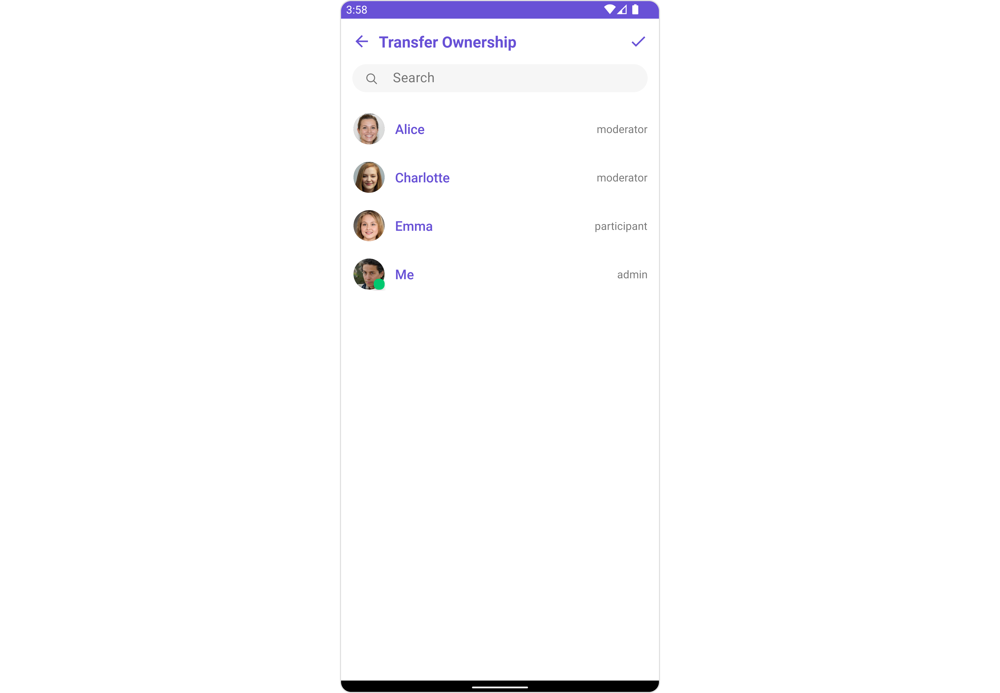
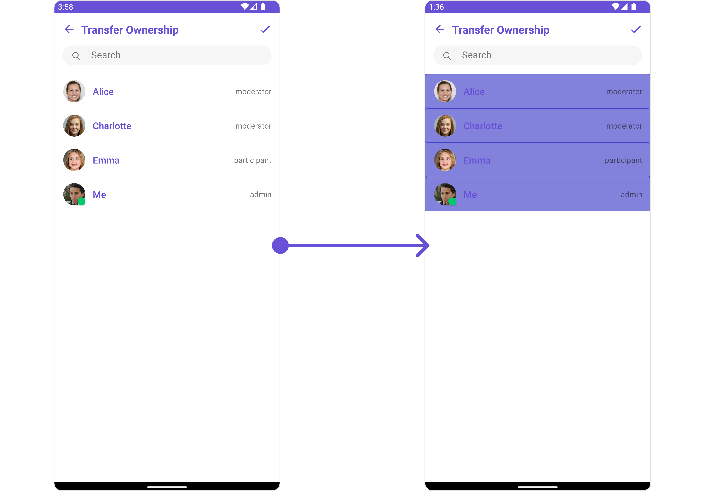
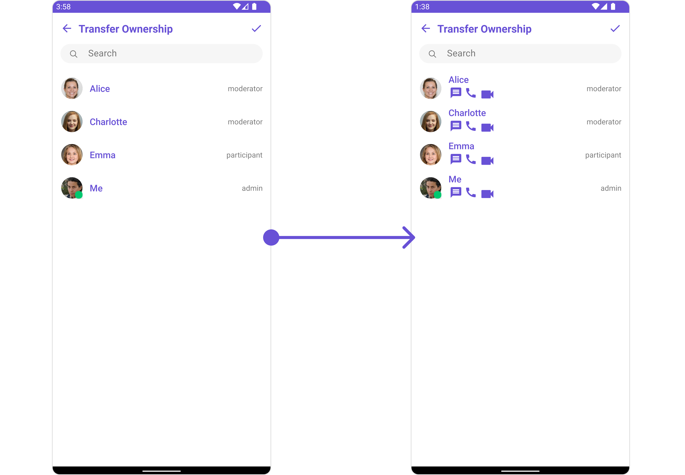
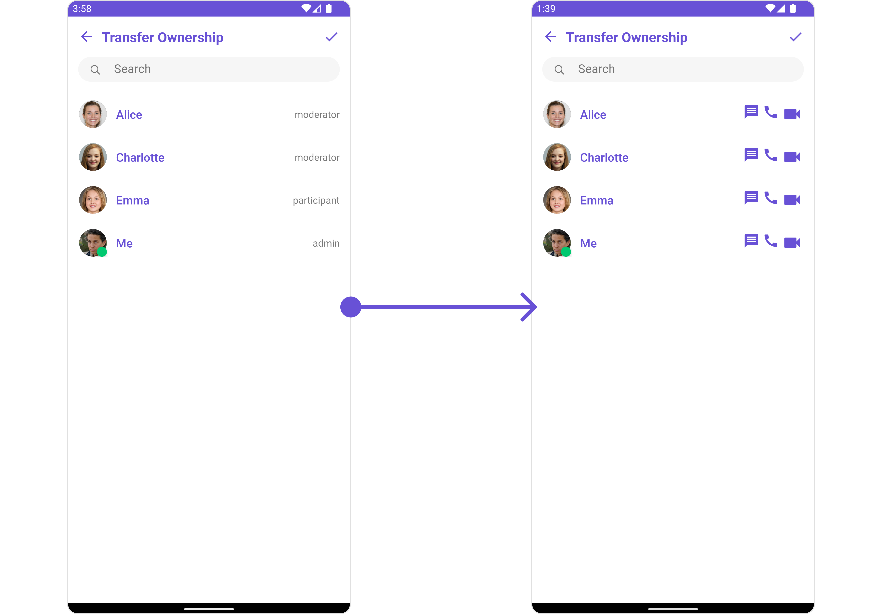
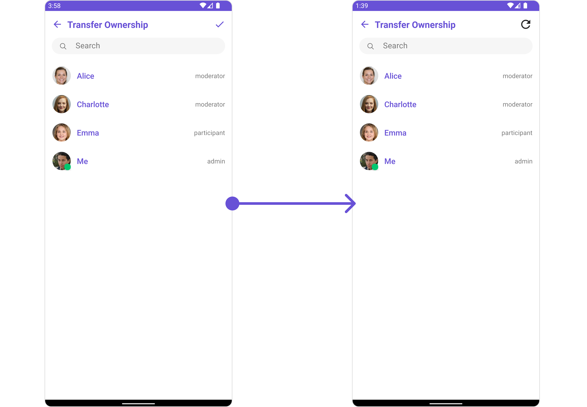
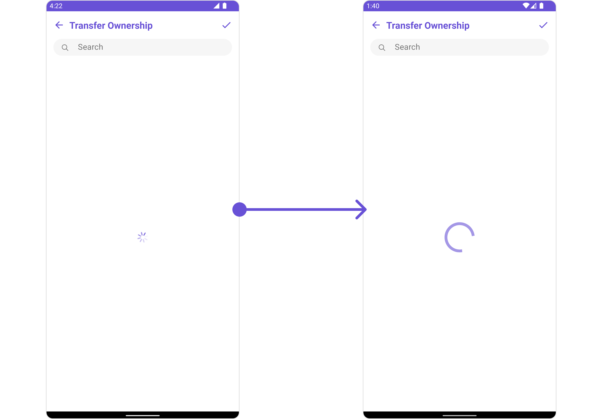
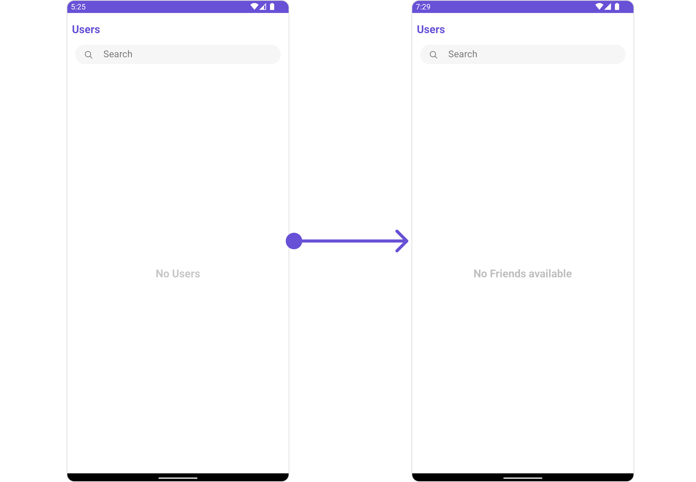
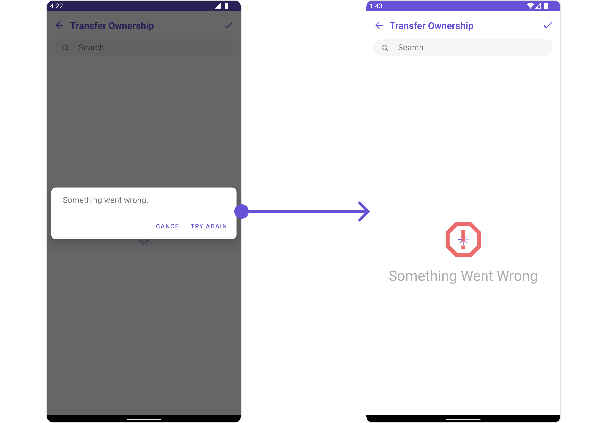

import Tabs from '@theme/Tabs';
import TabItem from '@theme/TabItem';

## Overview

`CometChatTransferOwnership` is a [Component](/ui-kit/android/components-overview#components) that allows the current owner or administrator of a group to transfer the ownership rights and administrative control of that group to another user. By transferring ownership, the original owner can designate a new user as the group owner, giving them full control and administrative privileges over the group.

`CometChatTransferOwnership` is a [Component](/ui-kit/android/components-overview#components) that allows the current owner or administrator of a group to transfer the ownership rights and administrative control of that group to another user. By transferring ownership, the original owner can designate a new user as the group owner, giving them full control and administrative privileges over the group.

Here are some key points regarding the transfer ownership feature in CometChat:

1. **Administrative Control**: The current owner or administrator of the group has the authority to initiate the transfer of ownership. This feature is typically available to ensure flexibility and allow smooth transitions of group ownership.
2. **New Group Owner**: During the transfer process, the current owner can select a specific user from the group members to become the new owner. This new owner will then assume the responsibilities and privileges associated with being the group owner.
3. **Administrative Privileges**: As the new owner, the designated user will gain full administrative control over the group. They will have the ability to manage group settings, add or remove members, moderate conversations, and perform other administrative actions.
4. **Group Continuity**: Transferring ownership does not disrupt the existing group or its content. The transfer ensures the continuity of the group while transferring the administrative control to a new owner.



The Transfer Ownership component is composed of the following BaseComponents:

| Components                                             | Description                                                                                                                                                                                                      |
| ------------------------------------------------------ | ---------------------------------------------------------------------------------------------------------------------------------------------------------------------------------------------------------------- |
| [CometchatGroupMembers](/ui-kit/android/group-members) | `CometChatGroupMembers` is an independent component designed to create a user-friendly screen for browsing and managing group members. Users can effortlessly search for specific members and transfer ownership |
| [CometChatListItem](/ui-kit/android/list-item)         | This component renders information extracted from a `User` object onto a tile, featuring a title, subtitle, leading view, and trailing view.                                                                     |

---

## Usage

### Integration

`CometChatTransferOwnership`, as a composed of the [CometChatGroupMembers](./group-members), offers flexible integration options, allowing it to be launched directly via button clicks or any user-triggered action. Additionally, it seamlessly integrates into activity and Fragment. With transfer ownership, users gain access to a wide range of parameters and methods for effortless customization of its user interface.

Since `CometChatTransferOwnership` is a custom view, It can be launched by adding the following code snippet into the XML layout file.

<Tabs>
<TabItem value="xml" label="XML">

```xml
<com.cometchat.chatuikit.transferownership.CometChatTransferOwnership
    android:id="@+id/transfer_ownership"
    android:layout_width="match_parent"
    android:layout_height="match_parent" />
```

</TabItem>
</Tabs>

If you're defining the Group members within the XML code, you'll need to extract them and set them on the Group object using the appropriate method.

<Tabs>

<TabItem value="Java" label="Java">
```Java
CometChatTransferOwnership cometchatTransferOwnership = binding.groupMember;

Group group = new Group();
group.setGuid("GROUP_ID");
group.setName("GROUP_NAME");

cometchatTransferOwnership.setGroup(group);

````
</TabItem>

<TabItem value="Kotlin" label="Kotlin">
```Kotlin
val cometchatTransferOwnership: CometChatTransferOwnership = binding.groupMember

val group: Group = Group()
group.setGuid("GROUP_ID")
group.setName("GROUP_NAME")

cometchatTransferOwnership.setGroup(group)
````

</TabItem>

</Tabs>

---

### Actions

[Actions](/ui-kit/android/components-overview#actions) dictate how a component functions. They are divided into two types: Predefined and User-defined. You can override either type, allowing you to tailor the behavior of the component to fit your specific needs.

##### 1. SetOnItemClick

This method proves valuable when users seek to override onItemClick functionality within CometChatTransferOwnership, empowering them with greater control and customization options.

The `setOnItemClick` action doesn't have a predefined behavior. You can override this action using the following code snippet.

<Tabs>

<TabItem value="Java" label="Java">
```Java
cometchatTransferOwnership.setItemClickListener(new OnItemClickListener<GroupMember>() {
    @Override
    public void OnItemClick(GroupMember groupMember, int i) {
        
    }
});
```
</TabItem>

<TabItem value="Kotlin" label="Kotlin">
```Kotlin
cometchatTransferOwnership.setItemClickListener(object : OnItemClickListener<GroupMember>() {
    override fun OnItemClick(groupMember: GroupMember, i: Int) {
        
    }
})
```
</TabItem>

</Tabs>

---

##### 2. SetOnError

You can customize this behavior by using the provided code snippet to override the `On Error` and improve error handling.

<Tabs>

<TabItem value="Java" label="Java">
```Java
cometchatTransferOwnership.setOnError(new OnError() {
    @Override
    public void onError(Context context, CometChatException e) {
        
    }
});
```
</TabItem>

<TabItem value="Kotlin" label="Kotlin">
```Kotlin
ccometchatTransferOwnership.setOnError(OnError { context, e -> 
    
})
```
</TabItem>

</Tabs>

---

##### 3. SetOnTransferOwnership

The `setOnTransferOwnership` action is activated when you select a group member and click on the transfer ownership submit button. you have the flexibility to override this event and tailor it to suit your needs using the following code snippet.

<Tabs>

<TabItem value="Java" label="Java">
```Java
cometchatTransferOwnership.setOnTransferOwnership(new CometChatTransferOwnership.OnTransferOwnership() {
    @Override
    public void onTransferOwnership(Context context, Group group, GroupMember groupMember) {
        // Handle ownership transfer here
    }
});
```
</TabItem>

<TabItem value="Kotlin" label="Kotlin">
```Kotlin
cometchatTransferOwnership.setOnTransferOwnership { context, group, groupMember ->
    // Handle ownership transfer here
}
```
</TabItem>

</Tabs>

---

##### 4. AddOnBackPressListener

You can customize this behavior by using the provided code snippet to override the `addOnBackPressListener` and improve error handling.

<Tabs>

<TabItem value="Java" label="Java">
```Java
cometchatTransferOwnership.addOnBackPressListener(new CometChatListBase.OnBackPress() {
    @Override
    public void onBack() {

    }

});

````
</TabItem>

<TabItem value="Kotlin" label="Kotlin">
```Kotlin
cometchatTransferOwnership.addOnBackPressListener(CometChatListBase.OnBackPress {

})
````

</TabItem>

</Tabs>

---

### Filters

**Filters** allow you to customize the data displayed in a list within a Component. You can filter the list based on your specific criteria, allowing for a more customized. Filters can be applied using RequestBuilders of Chat SDK.

##### 1. GroupMembersRequestBuilder

The [GroupMembersRequestBuilder](/sdk/android/retrieve-group-members) enables you to filter and customize the group members list based on available parameters in GroupMembersRequestBuilder. This feature allows you to create more specific and targeted queries when fetching groups. The following are the parameters available in [GroupMembersRequestBuilder](/sdk/android/retrieve-group-members)

| Property           | Description                                                                                 | Code                        |
| ------------------ | ------------------------------------------------------------------------------------------- | --------------------------- |
| **Limit**          | Sets the number of members that can be fetched in a single request, suitable for pagination | `.setLimit(Int)`            |
| **Search Keyword** | Used for fetching members matching the passed string                                        | `.setSearchKeyword(String)` |
| **Scope**          | Used for fetching group members based on multiple scopes                                    | `.setScope(List<String>)`   |

**Example**

<Tabs>

<TabItem value="Java" label="Java">
```Java
GroupMembersRequest.GroupMembersRequestBuilder groupMembersRequestBuilder = new GroupMembersRequest.GroupMembersRequestBuilder("GUID")
        .setLimit(1);

cometchatTransferOwnership.setGroupMembersRequestBuilder(groupMembersRequestBuilder);

````
</TabItem>

<TabItem value="Kotlin" label="Kotlin">
```Kotlin
val groupMembersRequestBuilder = GroupMembersRequestBuilder("GUID")
    .setLimit(1)

cometchatTransferOwnership.setGroupMembersRequestBuilder(groupMembersRequestBuilder)
````

</TabItem>

</Tabs>

---

##### 2. SearchRequestBuilder

The SearchRequestBuilder uses [GroupMembersRequestBuilder](/sdk/android/retrieve-group-members) enables you to filter and customize the search list based on available parameters in GroupMembersRequestBuilder.
This feature allows you to keep uniformity between the displayed Group Members List and searched Group Members List.

**Example**

<Tabs>

<TabItem value="Java" label="Java">
```Java
GroupMembersRequest.GroupMembersRequestBuilder groupMembersRequestBuilder = new GroupMembersRequest.GroupMembersRequestBuilder("GUID")
        .setLimit(1)
        .setSearchKeyword("SEARCH_KEYWORD");

cometchatTransferOwnership.setSearchRequestBuilder(groupMembersRequestBuilder);

````
</TabItem>

<TabItem value="Kotlin" label="Kotlin">
```Kotlin
val groupMembersRequestBuilder = GroupMembersRequestBuilder("GUID")
    .setLimit(1)
    .setSearchKeyword("SEARCH_KEYWORD")

cometchatTransferOwnership.setSearchRequestBuilder(groupMembersRequestBuilder)
````

</TabItem>

</Tabs>

---

### Events

[Events](/ui-kit/android/components-overview#events) are emitted by a `Component`. By using event you can extend existing functionality. Being global events, they can be applied in Multiple Locations and are capable of being Added or Removed.

Events emitted by the Join Group component is as follows.

| Event                  | Description                                                           |
| ---------------------- | --------------------------------------------------------------------- |
| **ccOwnershipChanged** | Triggers when the ownership of a group member is changed successfully |

**Example**

<Tabs>

<TabItem value="Java" label="Java">
```Java
CometChatGroupEvents.addGroupListener("LISTENER_ID", new CometChatGroupEvents() {
    @Override
    public void ccOwnershipChanged(Group group, GroupMember newOwner) {
        super.ccOwnershipChanged(group, newOwner);
    }
});
```
</TabItem>

<TabItem value="Kotlin" label="Kotlin">
```Kotlin
CometChatGroupEvents.addGroupListener("LISTENER_ID", object : CometChatGroupEvents() {
    override fun ccOwnershipChanged(group: Group, newOwner: GroupMember) {
        super.ccOwnershipChanged(group, newOwner)
    }
})
```
</TabItem>

</Tabs>

Remove the added listener

<Tabs>

<TabItem value="Java" label="Java">
```Java
CometChatGroupEvents.removeListener("LISTENER_ID");Q
```
</TabItem>

<TabItem value="Kotlin" label="Kotlin">
```Kotlin
CometChatGroupEvents.removeListener("LISTENER_ID")
```
</TabItem>

</Tabs>

---

## Customization

To fit your app's design requirements, you can customize the appearance of the Transfer Ownership component. We provide exposed methods that allow you to modify the experience and behavior according to your specific needs.

### Style

Using **Style** you can **customize** the look and feel of the component in your app, These parameters typically control elements such as the **color**, **size**, **shape**, and **fonts** used within the component.

##### 1. TransferOwnership Style <a data-tooltip-id="my-tooltip-html-prop"> <span class="material-icons red">report</span> </a>

You can set the transferOwnershipStyle to the Transfer Ownership Component to customize the styling.

<Tabs>

<TabItem value="Java" label="Java">
```Java
TransferOwnershipStyle transferOwnershipStyle = new TransferOwnershipStyle();
transferOwnershipStyle.setBackground(getResources().getColor(R.color.white_300));
transferOwnershipStyle.setTitleColor(getResources().getColor(R.color.red));
cometchatTransferOwnership.setStyle(transferOwnershipStyle);
```
</TabItem>

<TabItem value="Kotlin" label="Kotlin">
```Kotlin
val transferOwnershipStyle = TransferOwnershipStyle()
transferOwnershipStyle.setBackground(getResources().getColor(R.color.white_300))
transferOwnershipStyle.setTitleColor(getResources().getColor(R.color.red))
cometchatTransferOwnership.setStyle(transferOwnershipStyle)
```
</TabItem>

</Tabs>

List of properties exposed by transferOwnershipStyle

| Property                   | Description                                                                                                         | Code                                      |
| -------------------------- | ------------------------------------------------------------------------------------------------------------------- | ----------------------------------------- |
| **Background**             | Used to set the background color                                                                                    | `.setBackground(@ColorInt int)`           |
| **Border Width**           | Used to set border                                                                                                  | `.setBorderWidth(int)`                    |
| **Border Color**           | Used to set border color                                                                                            | `.setBorderColor(@ColorInt int)`          |
| **Corner Radius**          | Used to set border radius                                                                                           | `.setCornerRadius(float)`                 |
| **Background Drawable**    | Used to set background Drawable                                                                                     | `.setBackground(Drawable)`                |
| **Title Appearance**       | Used to customise the appearance of the title in the app bar                                                        | `.setTitleAppearance(@StyleRes int)`      |
| **Back Icon Tint**         | Used to set the color of the back icon in the app bar                                                               | `.setBackIconTint(@ColorInt int)`         |
| **Search Background**      | Used to set the background color of the search box                                                                  | `.setSearchBackground(@ColorInt int)`     |
| **Search Border Radius**   | Used to set the border radius of the search box                                                                     | `.setSearchBorderRadius(int)`             |
| **Search Icon Tint**       | Used to set the color of the search icon in the search box                                                          | `.setSearchIconTint(@ColorInt int)`       |
| **Search Border Width**    | Used to set the border width of the search box                                                                      | `.setSearchBorderWidth(int)`              |
| **Search Text Appearance** | Used to set the style of the text in the search box                                                                 | `.setSearchTextAppearance(@StyleRes int)` |
| **Loading Icon Tint**      | Used to set the color of the icon shown while the list of group members is being fetched                            | `.setLoadingIconTint(@ColorInt int)`      |
| **Empty Text Appearance**  | Used to set the style of the response text shown when fetching the list of group members has returned an empty list | `.setEmptyTextAppearance(@StyleRes int)`  |
| **Error Text Appearance**  | Used to set the style of the response text shown in case some error occurs while fetching the list of group members | `.setErrorTextAppearance(@StyleRes int)`  |
| **Online Status Color**    | Used to set the color of the status indicator shown if a group member is online                                     | `.setOnlineStatusColor(@ColorInt int)`    |
| **Separator Color**        | Used to set the color of the divider separating the group member items                                              | `.setSeparatorColor(@ColorInt int)`       |

---

##### 2. Avatar Style

To apply customized styles to the `Avatar` component in the Group Members Component, you can use the following code snippet. For further insights on `Avatar` Styles [refer](/ui-kit/android/avatar)

<Tabs>

<TabItem value="Java" label="Java">
```Java
AvatarStyle avatarStyle = new AvatarStyle();
avatarStyle.setBorderWidth(10);
avatarStyle.setBorderColor(Color.BLACK);
cometchatTransferOwnership.setAvatarStyle(avatarStyle);
```
</TabItem>

<TabItem value="Kotlin" label="Kotlin">
```Kotlin
val avatarStyle = AvatarStyle()
avatarStyle.borderWidth = 10
avatarStyle.borderColor = Color.BLACK
cometchatTransferOwnership.setAvatarStyle(avatarStyle)
```
</TabItem>

</Tabs>

---

##### 3. StatusIndicator Style

To apply customized styles to the Status Indicator component in the Group Member Component, You can use the following code snippet. For further insights on Status Indicator Styles [refer](/ui-kit/android/status-indicator)

<Tabs>

<TabItem value="Java" label="Java">
```Java
StatusIndicatorStyle statusIndicatorStyle = new StatusIndicatorStyle();
statusIndicatorStyle.setCornerRadius(3.5f);
statusIndicatorStyle.setBorderColor(Color.YELLOW);
statusIndicatorStyle.setBorderWidth(10);
cometchatTransferOwnership.setStatusIndicatorStyle(statusIndicatorStyle);
```
</TabItem>

<TabItem value="Kotlin" label="Kotlin">
```Kotlin
val statusIndicatorStyle = StatusIndicatorStyle()
statusIndicatorStyle.setCornerRadius(3.5f)
statusIndicatorStyle.setBorderColor(Color.YELLOW)
statusIndicatorStyle.setBorderWidth(10)
cometchatTransferOwnership.setStatusIndicatorStyle(statusIndicatorStyle)
```
</TabItem>

</Tabs>

---

##### 4. ListItem Style

To apply customized styles to the `List Item` component in the `Group Member` Component, you can use the following code snippet. For further insights on `List Item` Styles [refer](/ui-kit/android/list-item)

<!--  -->

<Tabs>

<TabItem value="Java" label="Java">
```Java
ListItemStyle listItemStyle = new ListItemStyle();
listItemStyle.setBackground(R.color.purple_200);
listItemStyle.setBorderWidth(2);
listItemStyle.setBorderColor(R.color.purple_700);
listItemStyle.setCornerRadius(20);
cometchatTransferOwnership.setListItemStyle(listItemStyle);
```
</TabItem>

<TabItem value="Kotlin" label="Kotlin">
```Kotlin
val listItemStyle = ListItemStyle()
listItemStyle.setBackground(R.color.purple_200)
listItemStyle.setBorderWidth(2)
listItemStyle.setBorderColor(R.color.purple_700)
listItemStyle.setCornerRadius(20f)
cometchatTransferOwnership.setListItemStyle(listItemStyle)
```
</TabItem>

</Tabs>

---

##### 5. GroupMembers Style

You can set the `GroupMembersStyle` to the Transfer Ownership Component to customize the styling, you can use the following code snippet. For further insights on `GroupMembers` Styles [refer](/ui-kit/android/group-members)

<Tabs>

<TabItem value="Java" label="Java">
```Java
GroupMembersStyle groupMembersStyle = new GroupMembersStyle();
groupMembersStyle.setBorderWidth(10);
groupMembersStyle.setBorderColor(Color.BLACK);
cometchatTransferOwnership.setStyle(groupMembersStyle);
```
</TabItem>

<TabItem value="Kotlin" label="Kotlin">
```Kotlin
val groupMembersStyle = GroupMembersStyle()
groupMembersStyle.setBorderWidth(10)
groupMembersStyle.setBorderColor(Color.BLACK)
cometchatTransferOwnership.setStyle(groupMembersStyle)
```
</TabItem>

</Tabs>

---

### Functionality

These are a set of small functional customizations that allow you to fine-tune the overall experience of the component. With these, you can change text, set custom icons, and toggle the visibility of UI elements.

<Tabs>

<TabItem value="Java" label="Java">
```Java
cometchatTransferOwnership.setTitle("Your Title");
cometchatTransferOwnership.disableUsersPresence(true);
cometchatTransferOwnership.hideSeparator(true);
```
</TabItem>

<TabItem value="Kotlin" label="Kotlin">
```Kotlin
cometchatTransferOwnership.setTitle("Your Title")
cometchatTransferOwnership.disableUsersPresence(true)
cometchatTransferOwnership.hideSeparator(true)
```
</TabItem>

</Tabs>

List of Functionality exposed by `CometChatTransferOwnership`

| Property                    | Description                                                                                     | Code                                             |
| --------------------------- | ----------------------------------------------------------------------------------------------- | ------------------------------------------------ |
| **Group**                   | The group for which the group members will be listed. A required parameter.                     | `.setGroup(Group)`                               |
| **Title**                   | Used to set title in the app bar                                                                | `.setTitle(String)`                              |
| **Style**                   | Used to set styling properties                                                                  | `.setStyle(TransferOwnershipStyle)`              |
| **Avatar Style**            | Used to customise the Avatar of the group member                                                | `.avatarStyle(AvatarStyle)`                      |
| **Status Indicator Style**  | Used to customise the status indicator shown if a group member is online                        | `.setStatusIndicatorStyle(StatusIndicatorStyle)` |
| **Search Placeholder Text** | Used to set search placeholder text                                                             | `.setSearchPlaceholderText(String)`              |
| **Back Icon**               | Used to set back button widget                                                                  | `.backIcon(@DrawableRes int res)`                |
| **Show Back Button**        | Used to toggle visibility for back button                                                       | `.showBackButton(boolean)`                       |
| **Search Box Icon**         | Used to set search Icon in the search field                                                     | `.setSearchBoxIcon(@DrawableRes int res)`        |
| **Hide Search**             | Used to toggle visibility for search box                                                        | `.hideSearch(boolean)`                           |
| **Hide Separator**          | Used to hide the divider separating the group member items                                      | `.hideSeparator(boolean)`                        |
| **Disable Users Presence**  | Used to control visibility of group member indicator shown if group member is online            | `.disableUsersPresence(boolean)`                 |
| **List Item Style**         | Used to set style to Tile which displays data obtained from a GroupMember object                | `.setListItemStyle(ListItemStyle)`               |
| **Selection Icon**          | Used to override the of the default item selection icon                                         | `.setSelectionIcon(@DrawableRes int res)`        |
| **Submit Icon**             | Used to override the default selection complete icon                                            | `.setSubmitIcon(@DrawableRes int res)`           |
| **Empty State Text**        | Used to set a custom text response when the fetched list of group members is empty              | `.emptyStateText(String)`                        |
| **Error State Text**        | Used to set a custom text response when some error occurs on fetching the list of group members | `.errorStateText(String)`                        |

---

### Advance

For advanced-level customization, you can set custom views to the component. This lets you tailor each aspect of the component to fit your exact needs and application aesthetics. You can create and define your views, layouts, and UI elements and then incorporate those into the component.

#### ListItemView

Utilize this property to assign a custom ListItem to the TransferOwnership Component, allowing for enhanced customization and flexibility in its rendering.

<Tabs>

<TabItem value="Java" label="Java">

```Java
cometchatTransferOwnership.setListItemView(new GroupMembersViewHolderListeners() {
    @Override
    public View createView(Context context, CometChatListItem cometChatListItem) {
        return null;
    }

    @Override
    public void bindView(Context context, View view, GroupMember groupMember, Group group, RecyclerView.ViewHolder viewHolder, List<GroupMember> list, int i) {

    }
});
```

</TabItem>

<TabItem value="Kotlin" label="Kotlin">

```Kotlin
cometchatTransferOwnership.setListItemView(object : GroupMembersViewHolderListeners() {
    override fun createView(context: Context, cometChatListItem: CometChatListItem): View? {
        return null
    }

    override fun bindView(
        context: Context,
        view: View,
        groupMember: GroupMember,
        group: Group,
        viewHolder: RecyclerView.ViewHolder,
        list: List<GroupMember>,
        i: Int
    ) {
    }
})
```

</TabItem>

</Tabs>

**Example**



You can indeed create a custom layout file named `item_list.xml` for more complex or unique list items.

Once this layout file is made, you would inflate it inside the `createView()` method of the `GroupMembersViewHolderListeners.`. The inflation process prepares the layout for use in your application:

Following this, you would use the `bindView()` method to initialize and assign values to your individual views. This could include setting text on TextViews, images on ImageViews, and so on based on the properties of the Group object:

```xml title="item_list.xml"
<?xml version="1.0" encoding="utf-8"?>
<RelativeLayout xmlns:android="http://schemas.android.com/apk/res/android"
    xmlns:app="http://schemas.android.com/apk/res-auto"
    xmlns:tools="http://schemas.android.com/tools"
    android:layout_width="match_parent"
    android:layout_height="match_parent">

    <androidx.cardview.widget.CardView
        android:layout_width="match_parent"
        android:layout_height="wrap_content"
        android:layout_margin="5dp"
        android:elevation="10dp"
        app:cardBackgroundColor="@color/purple_500"
        app:cardCornerRadius="10dp">

        <RelativeLayout
            android:layout_width="match_parent"
            android:layout_height="wrap_content">

            <com.cometchat.chatuikit.shared.views.CometChatAvatar.CometChatAvatar
                android:id="@+id/item_avatar"
                android:layout_width="50dp"
                android:layout_height="50dp"
                android:layout_centerVertical="true"
                android:layout_margin="10dp"
                android:padding="10dp" />

            <TextView
                android:id="@+id/txt_item_name"
                android:layout_width="match_parent"
                android:layout_height="wrap_content"
                android:layout_centerVertical="true"
                android:layout_toRightOf="@+id/item_avatar"
                android:text="name"
                android:textSize="17sp" />

            <TextView
                android:id="@+id/txt_item_date"
                android:layout_width="wrap_content"
                android:layout_height="wrap_content"
                android:layout_alignParentEnd="true"
                android:layout_centerVertical="true"
                android:layout_margin="10dp"
                android:text="date"
                android:textSize="12sp" />
        </RelativeLayout>
    </androidx.cardview.widget.CardView>
</RelativeLayout>
```

<Tabs>

<TabItem value="Java" label="Java">

```Java title="YourActivity.java"
cometchatTransferOwnership.setListItemView(new GroupMembersViewHolderListeners() {
    @Override
    public View createView(Context context, CometChatListItem cometChatListItem) {
        View view = getLayoutInflater().inflate(R.layout.item_list, null);
        return view;
    }

    @Override
    public void bindView(Context context, View view, GroupMember groupMember, Group group, RecyclerView.ViewHolder viewHolder, List<GroupMember> list, int i) {
        CometChatAvatar avatarView = view.findViewById(R.id.item_avatar);
        avatarView.setRadius(100);
        TextView nameView = view.findViewById(R.id.txt_item_name);
        nameView.setText(groupMember.getName());
        avatarView.setImage(groupMember.getAvatar(), groupMember.getName());
    }
});
```

</TabItem>

<TabItem value="Kotlin" label="Kotlin">

```Kotlin title="YourActivity.kt"
cometchatTransferOwnership.setListItemView(object : GroupMembersViewHolderListeners() {
    override fun createView(context: Context, cometChatListItem: CometChatListItem): View {
        val view: View = getLayoutInflater().inflate(R.layout.item_list, null)
        return view
    }

    override fun bindView(
        context: Context,
        view: View,
        groupMember: GroupMember,
        group: Group,
        viewHolder: RecyclerView.ViewHolder,
        list: List<GroupMember>,
        i: Int
    ) {
        val avatarView = view.findViewById<CometChatAvatar>(R.id.item_avatar)
        avatarView.radius = 100f
        val nameView = view.findViewById<TextView>(R.id.txt_item_name)
        nameView.text = groupMember.name
        avatarView.setImage(groupMember.avatar, groupMember.name)
    }
})
```

</TabItem>

</Tabs>

---

#### SetSubTitleView

You can set your custom Subtitle view using the `.setSubtitleView()` method. But keep in mind, by using this you will override the default Subtitle view functionality.

<Tabs>

<TabItem value="Java" label="Java">

```Java
cometchatTransferOwnership.setSubtitleView(new GroupMembersViewHolderListeners() {
    @Override
    public View createView(Context context, CometChatListItem cometChatListItem) {
        return null;
    }

    @Override
    public void bindView(Context context, View view, GroupMember groupMember, Group group, RecyclerView.ViewHolder viewHolder, List<GroupMember> list, int i) {

    }
});
```

</TabItem>

<TabItem value="Kotlin" label="Kotlin">

```Kotlin
cometchatTransferOwnership.setSubtitleView(object : GroupMembersViewHolderListeners() {
    override fun createView(context: Context, cometChatListItem: CometChatListItem): View? {
        return null
    }

    override fun bindView(
        context: Context,
        view: View,
        groupMember: GroupMember,
        group: Group,
        viewHolder: RecyclerView.ViewHolder,
        list: List<GroupMember>,
        i: Int
    ) {
    }
})
```

</TabItem>

</Tabs>

**Example**



You can indeed create a custom layout file named `subtitle_layout.xml` for more complex or unique list items.

Once this layout file is made, you would inflate it inside the `createView()` method of the `GroupMembersViewHolderListeners.`. The inflation process prepares the layout for use in your application:

Following this, you would use the `bindView()` method to initialize and assign values to your individual views. This could include setting text on TextViews, images on ImageViews, and so on based on the properties of the Group object:

```xml title="subtitle_layout.xml"
<?xml version="1.0" encoding="utf-8"?>
<RelativeLayout xmlns:android="http://schemas.android.com/apk/res/android"
    android:layout_width="match_parent"
    android:layout_height="match_parent">

    <TextView
        android:id="@+id/txt_subtitle"
        android:layout_width="wrap_content"
        android:layout_height="wrap_content"
        android:text="Subtitle" />

    <ImageView
        android:id="@+id/img_conversation"
        android:layout_width="wrap_content"
        android:layout_height="wrap_content"
        android:layout_below="@+id/txt_subtitle"
        android:layout_margin="2dp"
        android:src="@drawable/ic_message_grey" />

    <ImageView
        android:id="@+id/img_audio_call"
        android:layout_width="wrap_content"
        android:layout_height="wrap_content"
        android:layout_below="@+id/txt_subtitle"
        android:layout_margin="2dp"
        android:layout_toEndOf="@+id/img_conversation"
        android:src="@drawable/ic_call" />

    <ImageView
        android:id="@+id/img_video_call"
        android:layout_width="wrap_content"
        android:layout_height="wrap_content"
        android:layout_below="@+id/txt_subtitle"
        android:layout_margin="2dp"
        android:layout_toEndOf="@+id/img_audio_call"
        android:src="@drawable/ic_video" />

</RelativeLayout>
```

<Tabs>

<TabItem value="Java" label="Java">

```Java title="YourActivity.java"
cometchatTransferOwnership.setSubtitleView(new GroupMembersViewHolderListeners() {
    @Override
    public View createView(Context context, CometChatListItem cometChatListItem) {
        View view = getLayoutInflater().inflate(R.layout.subtitle_layout, null);
        return view;
    }

    @Override
    public void bindView(Context context, View view, GroupMember groupMember, Group group, RecyclerView.ViewHolder viewHolder, List<GroupMember> list, int i) {
        TextView txtSubtitle = view.findViewById(R.id.txt_subtitle);
        ImageView imgConversation = view.findViewById(R.id.img_conversation);
        ImageView imgAudioCall = view.findViewById(R.id.img_audio_call);;
        ImageView imgVideCall = view.findViewById(R.id.img_video_call);;
        txtSubtitle.setText(group.getName());
        imgConversation.setOnClickListener(v -> {
            Toast.makeText(context, "Conversation Clicked", Toast.LENGTH_SHORT).show();
        });
        imgAudioCall.setOnClickListener(v -> {
            Toast.makeText(context, "Audio Call Clicked", Toast.LENGTH_SHORT).show();
        });
        imgVideCall.setOnClickListener(v -> {
            Toast.makeText(context, "Video Call Clicked", Toast.LENGTH_SHORT).show();
        });
    }
});
```

</TabItem>

<TabItem value="Kotlin" label="Kotlin">

```Kotlin title="YourActivity.kt"
cometchatTransferOwnership.setSubtitleView(object : GroupMembersViewHolderListeners() {
    override fun createView(context: Context, cometChatListItem: CometChatListItem): View {
        val view: View = layoutInflater.inflate(R.layout.subtitle_layout, null)
        return view
    }

    override fun bindView(
        context: Context,
        view: View,
        groupMember: GroupMember,
        group: Group,
        viewHolder: RecyclerView.ViewHolder,
        list: List<GroupMember>,
        i: Int
    ) {
        val txtSubtitle = view.findViewById<TextView>(R.id.txt_subtitle)
        val imgConversation = view.findViewById<ImageView>(R.id.img_conversation)
        val imgAudioCall = view.findViewById<ImageView>(R.id.img_audio_call)

        val imgVideCall = view.findViewById<ImageView>(R.id.img_video_call)

        txtSubtitle.text = group.name
        imgConversation.setOnClickListener { v: View? ->
            Toast.makeText(context, "Conversation Clicked", Toast.LENGTH_SHORT).show()
        }
        imgAudioCall.setOnClickListener { v: View? ->
            Toast.makeText(context, "Audio Call Clicked", Toast.LENGTH_SHORT).show()
        }
        imgVideCall.setOnClickListener { v: View? ->
            Toast.makeText(context, "Video Call Clicked", Toast.LENGTH_SHORT).show()
        }
    }
})
```

</TabItem>

</Tabs>

---

#### SetTailView

Used to generate a custom trailing view for the GroupList item. You can add a Tail view using the following method.

<Tabs>

<TabItem value="Java" label="Java">

```Java
cometchatTransferOwnership.setTailView(new GroupMembersViewHolderListeners() {
    @Override
    public View createView(Context context, CometChatListItem cometChatListItem) {
        return null;
    }

    @Override
    public void bindView(Context context, View view, GroupMember groupMember, Group group, RecyclerView.ViewHolder viewHolder, List<GroupMember> list, int i) {

    }
});
```

</TabItem>

<TabItem value="Kotlin" label="Kotlin">

```Kotlin
cometchatTransferOwnership.setTailView(object : GroupMembersViewHolderListeners() {
    override fun createView(context: Context, cometChatListItem: CometChatListItem): View {
        return null
    }

    override fun bindView(
        context: Context,
        view: View,
        groupMember: GroupMember,
        group: Group,
        viewHolder: RecyclerView.ViewHolder,
        list: List<GroupMember>,
        i: Int
    ) {
    }
})
```

</TabItem>

</Tabs>

**Example**



You can indeed create a custom layout file named `tail_view_layout.xml` for more complex or unique list items.

Once this layout file is made, you would inflate it inside the `createView()` method of the `GroupMembersViewHolderListeners.`. The inflation process prepares the layout for use in your application:

Following this, you would use the `bindView()` method to initialize and assign values to your individual views. This could include setting text on TextViews, images on ImageViews, and so on based on the properties of the Group object:

```xml title="tail_view_layout.xml"
<?xml version="1.0" encoding="utf-8"?>
<RelativeLayout xmlns:android="http://schemas.android.com/apk/res/android"
    android:layout_width="match_parent"
    android:layout_height="match_parent">

    <TextView
        android:id="@+id/txt_subtitle"
        android:layout_width="wrap_content"
        android:layout_height="wrap_content"
        android:text="Subtitle" />

    <ImageView
        android:id="@+id/img_conversation"
        android:layout_width="wrap_content"
        android:layout_height="wrap_content"
        android:layout_below="@+id/txt_subtitle"
        android:layout_margin="2dp"
        android:src="@drawable/ic_message_grey" />

    <ImageView
        android:id="@+id/img_audio_call"
        android:layout_width="wrap_content"
        android:layout_height="wrap_content"
        android:layout_below="@+id/txt_subtitle"
        android:layout_margin="2dp"
        android:layout_toRightOf="@+id/img_conversation"
        android:src="@drawable/ic_call" />

    <ImageView
        android:id="@+id/img_video_call"
        android:layout_width="wrap_content"
        android:layout_height="wrap_content"
        android:layout_below="@+id/txt_subtitle"
        android:layout_margin="2dp"
        android:layout_toRightOf="@+id/img_audio_call"
        android:src="@drawable/ic_video" />

</RelativeLayout>
```

<Tabs>

<TabItem value="Java" label="Java">

```Java title="YourActivity.java"
cometchatTransferOwnership.setTailView(new GroupMembersViewHolderListeners() {
    @Override
    public View createView(Context context, CometChatListItem cometChatListItem) {
        View view = getLayoutInflater().inflate(R.layout.subtitle_layout, null);
        return view;
    }

    @Override
    public void bindView(Context context, View view, GroupMember groupMember, Group group, RecyclerView.ViewHolder viewHolder, List<GroupMember> list, int i) {
        TextView txtSubtitle = view.findViewById(R.id.txt_subtitle);
        ImageView imgConversation = view.findViewById(R.id.img_conversation);
        ImageView imgAudioCall = view.findViewById(R.id.img_audio_call);;
        ImageView imgVideCall = view.findViewById(R.id.img_video_call);;
        txtSubtitle.setText(group.getName());
        imgConversation.setOnClickListener(v -> {
            Toast.makeText(context, "Conversation Clicked", Toast.LENGTH_SHORT).show();
        });
        imgAudioCall.setOnClickListener(v -> {
            Toast.makeText(context, "Audio Call Clicked", Toast.LENGTH_SHORT).show();
        });
        imgVideCall.setOnClickListener(v -> {
            Toast.makeText(context, "Video Call Clicked", Toast.LENGTH_SHORT).show();
        });
    }
});
```

</TabItem>

<TabItem value="Kotlin" label="Kotlin">

```Kotlin title="YourActivity.kt"
cometchatTransferOwnership.setTailView(object : GroupMembersViewHolderListeners() {
    override fun createView(context: Context, cometChatListItem: CometChatListItem): View {
        val view: View = layoutInflater.inflate(R.layout.subtitle_layout, null)
        return view
    }

    override fun bindView(
        context: Context,
        view: View,
        groupMember: GroupMember,
        group: Group,
        viewHolder: RecyclerView.ViewHolder,
        list: List<GroupMember>,
        i: Int
    ) {
        val txtSubtitle = view.findViewById<TextView>(R.id.txt_subtitle)
        val imgConversation = view.findViewById<ImageView>(R.id.img_conversation)
        val imgAudioCall = view.findViewById<ImageView>(R.id.img_audio_call)

        val imgVideCall = view.findViewById<ImageView>(R.id.img_video_call)

        txtSubtitle.text = group.name
        imgConversation.setOnClickListener { v: View? ->
            Toast.makeText(context, "Conversation Clicked", Toast.LENGTH_SHORT).show()
        }
        imgAudioCall.setOnClickListener { v: View? ->
            Toast.makeText(context, "Audio Call Clicked", Toast.LENGTH_SHORT).show()
        }
        imgVideCall.setOnClickListener { v: View? ->
            Toast.makeText(context, "Video Call Clicked", Toast.LENGTH_SHORT).show()
        }
    }
})
```

</TabItem>

</Tabs>

---

#### SetMenu

You can set the Custom Menu view to add more options to the Groups component.

<Tabs>

<TabItem value="Java" label="Java">

```Java
cometchatTransferOwnership.setMenu(View v);
```

</TabItem>

<TabItem value="Kotlin" label="Kotlin">

```Kotlin
cometchatTransferOwnership.setMenu(v)
```

</TabItem>

</Tabs>

**Example**



You need to create a `view_menu.xml` as a custom view file. Which we will inflate and pass to `.setMenu()`.

```xml title="view_menu.xml"
<?xml version="1.0" encoding="utf-8"?>
<LinearLayout xmlns:android="http://schemas.android.com/apk/res/android"
    xmlns:app="http://schemas.android.com/apk/res-auto"
    xmlns:tools="http://schemas.android.com/tools"
    android:layout_width="match_parent"
    android:layout_height="match_parent"
    android:orientation="horizontal"
    tools:context=".MainActivity">

    <ImageView
        android:id="@+id/img_refresh"
        android:layout_width="30dp"
        android:layout_height="30dp"
        android:src="@drawable/ic_refresh_black" />

</LinearLayout>
```

You inflate the view and pass it to `setMenu`. You can get the child view reference and can handle click actions.

<Tabs>

<TabItem value="Java" label="Java">

```Java title="YourActivity.java"
View view = getLayoutInflater().inflate(R.layout.view_menu, null);
ImageView imgRefresh = view.findViewById(R.id.img_refresh);
imgRefresh.setOnClickListener(v -> {
    Toast.makeText(requireContext(), "Clicked on Refresh", Toast.LENGTH_SHORT).show();
});
cometchatTransferOwnership.setMenu(view);
```

</TabItem>

<TabItem value="Kotlin" label="Kotlin">

```Kotlin title="YourActivity.kt"
val view: View = layoutInflater.inflate(R.layout.view_menu, null)
val imgRefresh = view.findViewById<ImageView>(R.id.img_refresh)
imgRefresh.setOnClickListener { v: View? ->
    Toast.makeText(requireContext(), "Clicked on Refresh", Toast.LENGTH_SHORT).show()
}
cometchatTransferOwnership.setMenu(view)
```

</TabItem>

</Tabs>

---

#### SetLoadingStateView

You can set a custom loader view using `setLoadingStateView` to match the loading view of your app.

<Tabs>

<TabItem value="Java" label="Java">

```Java
cometchatTransferOwnership.setLoadingStateView();
```

</TabItem>

<TabItem value="Kotlin" label="Kotlin">

```Kotlin
cometchatTransferOwnership.setLoadingStateView()
```

</TabItem>

</Tabs>

**Example**



We have added a `ContentLoadingProgressBar` to `loading_view_layout.xml`. You can choose any view you prefer. This view should be inflated and passed to the `setLoadingStateView()` method.

```xml title="loading_view_layout.xml"
<?xml version="1.0" encoding="utf-8"?>
<FrameLayout xmlns:android="http://schemas.android.com/apk/res/android"
    android:layout_width="match_parent"
    android:layout_height="match_parent"
    android:layout_gravity="center_vertical">

    <androidx.core.widget.ContentLoadingProgressBar
        style="?android:attr/progressBarStyleLarge"
        android:layout_width="wrap_content"
        android:layout_height="wrap_content"
        android:layout_gravity="center_horizontal" />

</FrameLayout>
```

<Tabs>

<TabItem value="Java" label="Java">

```Java title="YourActivity.java"
cometchatTransferOwnership.setLoadingStateView(R.layout.loading_view_layout);
```

</TabItem>

<TabItem value="Kotlin" label="Kotlin">

```Kotlin title="YourActivity.kt"
cometchatTransferOwnership.setLoadingStateView(R.layout.loading_view_layout)
```

</TabItem>

</Tabs>

---

#### SetEmptyStateView

You can set a custom `EmptyStateView` using `setEmptyStateView` to match the empty view of your app.

<Tabs>

<TabItem value="Java" label="Java">

```Java
cometchatTransferOwnership.setEmptyStateView();
```

</TabItem>

<TabItem value="Kotlin" label="Kotlin">

```Kotlin
cometchatTransferOwnership.setEmptyStateView()
```

</TabItem>

</Tabs>

**Examples**

<!--  -->

We have added an error view to `empty_view_layout.xml`. You can choose any view you prefer. This view should be inflated and passed to the `setEmptyStateView()` method.

```xml title="empty_view_layout.xml"
<?xml version="1.0" encoding="utf-8"?>
<RelativeLayout xmlns:android="http://schemas.android.com/apk/res/android"
    android:layout_width="match_parent"
    android:layout_height="match_parent"
    android:layout_gravity="center_vertical">

    <TextView
        android:id="@+id/txt_title"
        android:layout_width="wrap_content"
        android:layout_height="wrap_content"
        android:layout_centerInParent="true"
        android:text="No Friends available"
        android:textColor="@color/cometchat_grey"
        android:textSize="20sp"
        android:textStyle="bold" />

</RelativeLayout>
```

<Tabs>

<TabItem value="Java" label="Java">

```Java title="YourActivity.java"
cometchatTransferOwnership.setEmptyStateView(R.layout.empty_view_layout);
```

</TabItem>
<TabItem value="Kotlin" label="Kotlin">

```Kotlin title="YourActivity.kt"
cometchatTransferOwnership.setEmptyStateView(R.layout.empty_view_layout)
```

</TabItem>

</Tabs>

---

#### SetErrorStateView

You can set a custom `ErrorStateView` using `setErrorStateView` to match the error view of your app.

<Tabs>

<TabItem value="Java" label="Java">

```Java
cometchatTransferOwnership.setErrorStateView();
```

</TabItem>

<TabItem value="Kotlin" label="Kotlin">

```Kotlin
cometchatTransferOwnership.setErrorStateView()
```

</TabItem>

</Tabs>

**Example**



We have added an error view to `error_state_view_layout.xml`. You can choose any view you prefer. This view should be inflated and passed to the `setErrorStateView()` method.

```xml title="error_state_view_layout.xml"
<?xml version="1.0" encoding="utf-8"?>
<RelativeLayout xmlns:android="http://schemas.android.com/apk/res/android"
    android:layout_width="match_parent"
    android:layout_height="match_parent">

    <ImageView
        android:id="@+id/img_error"
        android:layout_width="100dp"
        android:layout_height="100dp"
        android:layout_centerInParent="true"
        android:src="@drawable/ic_error" />

    <TextView
        android:layout_width="wrap_content"
        android:layout_height="wrap_content"
        android:layout_below="@+id/img_error"
        android:layout_centerHorizontal="true"
        android:layout_marginTop="50dp"
        android:text="Something Went Wrong"
        android:textSize="30sp" />

</RelativeLayout>
```

<Tabs>

<TabItem value="Java" label="Java">

```Java title="YourActivity.java"
cometchatTransferOwnership.setErrorStateView(R.layout.error_state_view_layout);
```

</TabItem>
<TabItem value="Kotlin" label="Kotlin">
```Kotlin title="YourActivity.kt"
cometchatTransferOwnership.setErrorStateView(R.layout.error_state_view_layout);
```

</TabItem>

</Tabs>

import { Tooltip } from 'react-tooltip'
import 'react-tooltip/dist/react-tooltip.css'

<Tooltip
  id="my-tooltip-html-prop"
  html="Not available in Transfer ownership Configuration object"
/>
