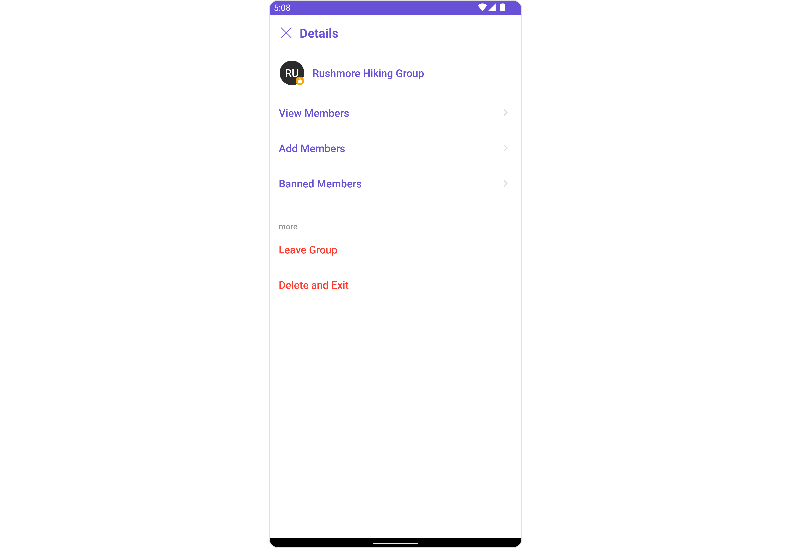
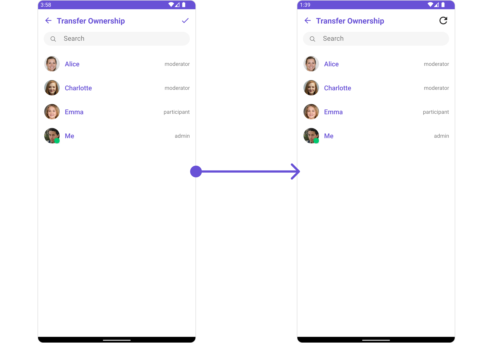
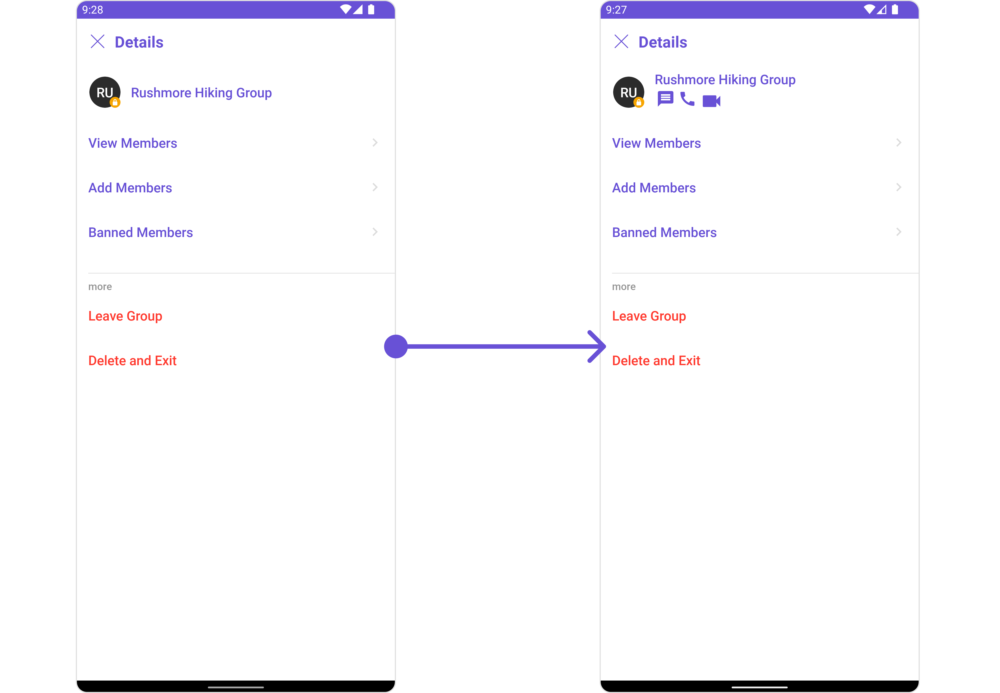
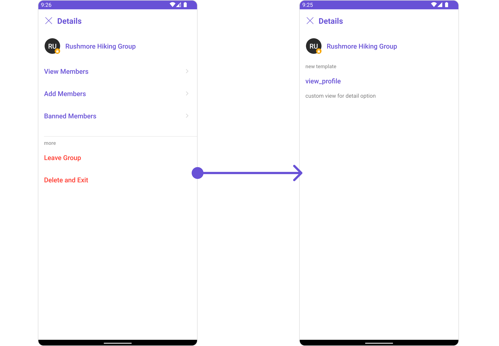
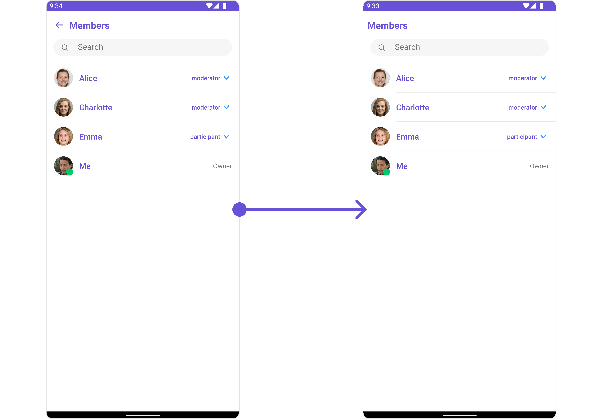
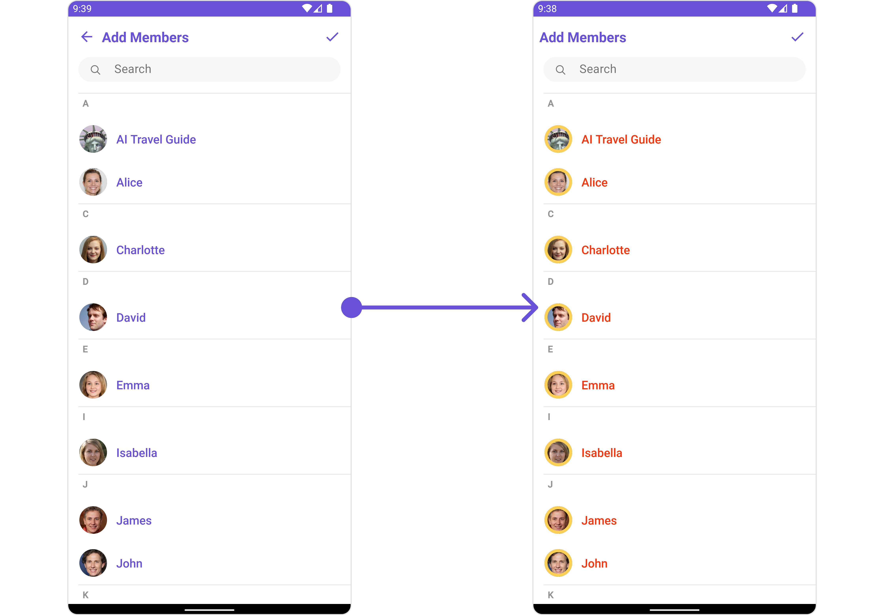
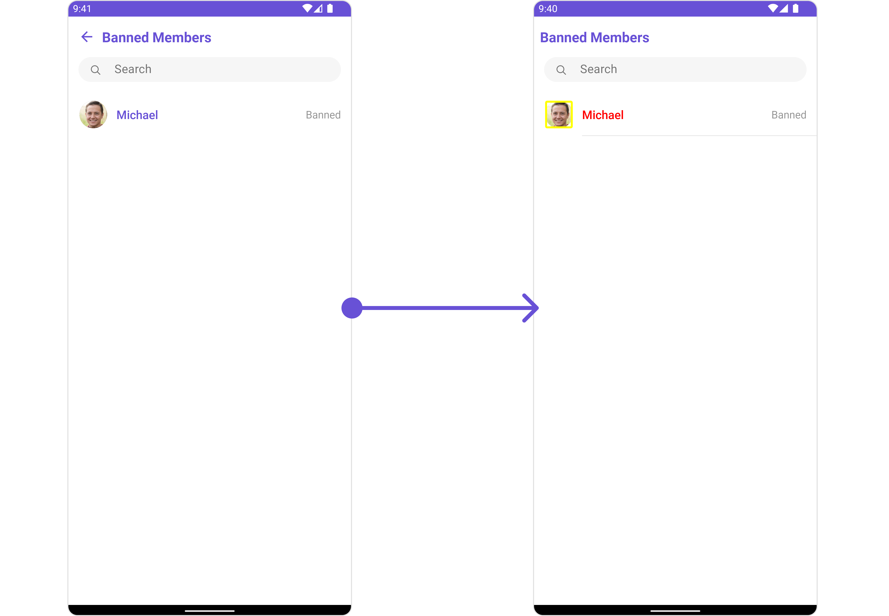
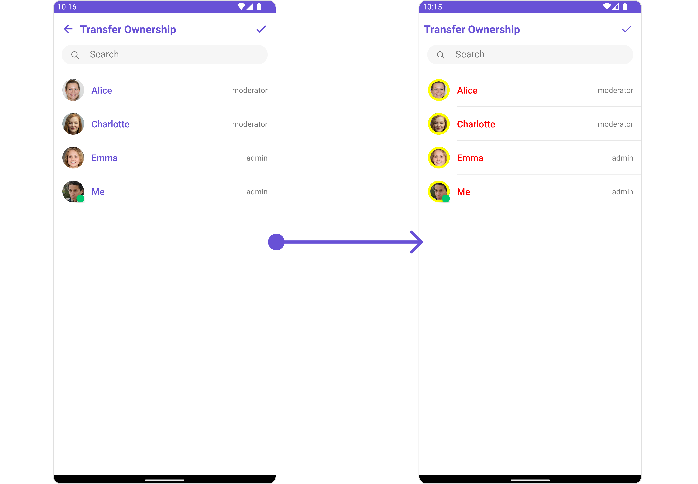

import Tabs from '@theme/Tabs';
import TabItem from '@theme/TabItem';

## Overview

`CometChatDetails` is a [Composite Component](/ui-kit/android/components-overview#composite-components) that provides additional information and settings related to a specific group.

The details screen includes the following elements and functionalities:

1. Group Information: It displays details about the user. This includes his/her profile picture, name, status, and other relevant information.
2. Group Chat Features: It provides additional functionalities for managing the group. This includes options to add or remove participants, assign roles or permissions, and view group-related information.
3. Group Actions: This offers actions related to the group, such as leaving the group, or deleting the group.



The `CometChatDetails` component is composed of the following BaseComponents:

| Components                                     | Description                                                                                                                                                                                   |
| ---------------------------------------------- | --------------------------------------------------------------------------------------------------------------------------------------------------------------------------------------------- |
| [CometChatListBase](/ui-kit/android/list-base) | `CometChatListBase` serves as a container component equipped with a title (navigationBar), search functionality (search-bar), background settings, and a container for embedding a list view. |

---

## Usage

### Integration

`CometChatDetails`, as a component, offers flexible integration options, allowing it to be launched directly via button clicks or any user-triggered action. Additionally, it seamlessly integrates into tab view controllers. With banned members, users gain access to a wide range of parameters and methods for effortless customization of its user interface.

The following code snippet exemplifies how you can seamlessly integrate the CometChatDetails component into your application.

Since `CometChatDetails` is a custom view, It can be launched by adding the following code snippet into the XML layout file.

<Tabs>
<TabItem value="xml" label="XML">

```xml
<com.cometchat.chatuikit.transferownership.cometchatDetails
    android:id="@+id/transfer_ownership"
    android:layout_width="match_parent"
    android:layout_height="match_parent" />
```

</TabItem>
</Tabs>

If you're defining the Group members within the XML code, you'll need to extract them and set them on the Group object using the appropriate method.

<Tabs>

<TabItem value="Java" label="Java">
```Java
CometChatDetails cometchatDetails = binding.details;

Group group = new Group();
group.setGuid(""); //Required
group.setName(""); //Required
group.setOwner(""); //Required
group.setGroupType(""); //Required
group.setScope(""); //Required
group.setMembersCount(); //Required
group.setJoinedAt(); //Required
group.setHasJoined(); //Required
group.setCreatedAt(); //Required
group.setUpdatedAt(); //Required

cometchatDetails.setGroup(group);

````
</TabItem>

<TabItem value="Kotlin" label="Kotlin">
```Kotlin
val cometchatDetails: CometChatDetails = binding.details

val group = Group()
group.guid = "" //Required
group.name = "" //Required
group.owner = "" //Required
group.groupType = "" //Required
group.scope = "" //Required
group.setMembersCount() //Required
group.setJoinedAt() //Required
group.setHasJoined() //Required
group.setCreatedAt() //Required
group.setUpdatedAt() //Required

cometchatDetails.setGroup(group)
````

</TabItem>

</Tabs>

---

### Actions

[Actions](/ui-kit/android/components-overview#actions) dictate how a component functions. They are divided into two types: Predefined and User-defined. You can override either type, allowing you to tailor the behavior of the component to fit your specific needs.

##### 1. SetOnError

You can customize this behavior by using the provided code snippet to override the `setOnError` and improve error handling.

<Tabs>

<TabItem value="Java" label="Java">
```Java
cometchatDetails.setOnError(new OnError() {
    @Override
    public void onError(Context context, CometChatException e) {
        
    }
});
```
</TabItem>

<TabItem value="Kotlin" label="Kotlin">
```Kotlin
cometchatDetails.setOnError(OnError { context, e -> 
    
})
```
</TabItem>

</Tabs>

---

##### 2. AddOnBackPressListener

You can customize this behavior by using the provided code snippet to override the `addOnBackPressListener` and improve error handling.

<Tabs>

<TabItem value="Java" label="Java">
```Java
cometchatDetails.addOnBackPressListener(new CometChatListBase.OnBackPress() {
    @Override
    public void onBack() {

    }

});

````
</TabItem>

<TabItem value="Kotlin" label="Kotlin">
```Kotlin
cometchatDetails.addOnBackPressListener(CometChatListBase.OnBackPress {

})
````

</TabItem>

</Tabs>

---

### Filters

**Filters** allow you to customize the data displayed in a list within a Component. You can filter the list based on your specific criteria, allowing for a more customized. Filters can be applied using RequestBuilders of Chat SDK.

`CometChatDetails` component does not have available filters.

---

### Events

[Events](/ui-kit/android/components-overview#events) are emitted by a `Component`. By using event you can extend existing functionality. Being global events, they can be applied in Multiple Locations and are capable of being Added or Removed.

Events emitted by the Group Details component is as follows.

| Events                        | Description                                                                                                |
| ----------------------------- | ---------------------------------------------------------------------------------------------------------- |
| `ccGroupDeleted()`            | This will get triggered when the logged in user deletes a group                                            |
| `ccGroupLeft()`               | This will get triggered when the logged in user leaves a group                                             |
| `ccGroupMemberScopeChanged()` | This will get triggered when the logged in user changes the scope of another group member                  |
| `ccGroupMemberBanned()`       | This will get triggered when the logged in user bans a group member from the group                         |
| `ccGroupMemberKicked()`       | This will get triggered when the logged in user kicks another group member from the group                  |
| `ccGroupMemberUnbanned()`     | This will get triggered when the logged in user unbans a user banned from the group                        |
| `ccGroupMemberJoined()`       | This will get triggered when the logged in user joins a group                                              |
| `ccGroupMemberAdded()`        | This will get triggered when the logged in user add new members to the group                               |
| `ccOwnershipChanged`          | This will get triggered when the logged in user transfer the ownership of their group to some other member |

**Example**

<Tabs>

<TabItem value="Java" label="Java">
```Java
CometChatGroupEvents.addGroupListener("LISTENER_ID", new CometChatGroupEvents() {
    @Override
    public void ccGroupDeleted(Group group) {
        super.ccGroupDeleted(group);
    }

    @Override
    public void ccGroupLeft(Action actionMessage, User leftUser, Group leftGroup) {
        super.ccGroupLeft(actionMessage, leftUser, leftGroup);
    }

    @Override
    public void ccGroupMemberJoined(User joinedUser, Group joinedGroup) {
        super.ccGroupMemberJoined(joinedUser, joinedGroup);
    }

    @Override
    public void ccGroupMemberAdded(List<Action> actionMessages, List<User> usersAdded, Group userAddedIn, User addedBy) {
        super.ccGroupMemberAdded(actionMessages, usersAdded, userAddedIn, addedBy);
    }

    @Override
    public void ccGroupMemberKicked(Action actionMessage, User kickedUser, User kickedBy, Group kickedFrom) {
        super.ccGroupMemberKicked(actionMessage, kickedUser, kickedBy, kickedFrom);
    }

    @Override
    public void ccGroupMemberBanned(Action actionMessage, User bannedUser, User bannedBy, Group bannedFrom) {
        super.ccGroupMemberBanned(actionMessage, bannedUser, bannedBy, bannedFrom);
    }

    @Override
    public void ccGroupMemberUnBanned(Action actionMessage, User unbannedUser, User unBannedBy, Group unBannedFrom) {
        super.ccGroupMemberUnBanned(actionMessage, unbannedUser, unBannedBy, unBannedFrom);
    }

    @Override
    public void ccGroupMemberScopeChanged(Action actionMessage, User updatedUser, String scopeChangedTo, String scopeChangedFrom, Group group) {
        super.ccGroupMemberScopeChanged(actionMessage, updatedUser, scopeChangedTo, scopeChangedFrom, group);
    }

    @Override
    public void ccOwnershipChanged(Group group, GroupMember newOwner) {
        super.ccOwnershipChanged(group, newOwner);
    }

});

````
</TabItem>

<TabItem value="Kotlin" label="Kotlin">
```Kotlin
CometChatGroupEvents.addGroupListener("LISTENER_ID", object : CometChatGroupEvents() {
    override fun ccGroupDeleted(group: Group) {
        super.ccGroupDeleted(group)
    }

    override fun ccGroupLeft(actionMessage: Action, leftUser: User, leftGroup: Group) {
        super.ccGroupLeft(actionMessage, leftUser, leftGroup)
    }

    override fun ccGroupMemberJoined(joinedUser: User, joinedGroup: Group) {
        super.ccGroupMemberJoined(joinedUser, joinedGroup)
    }

    override fun ccGroupMemberAdded(
        actionMessages: List<Action>,
        usersAdded: List<User>,
        userAddedIn: Group,
        addedBy: User
    ) {
        super.ccGroupMemberAdded(actionMessages, usersAdded, userAddedIn, addedBy)
    }

    override fun ccGroupMemberKicked(
        actionMessage: Action,
        kickedUser: User,
        kickedBy: User,
        kickedFrom: Group
    ) {
        super.ccGroupMemberKicked(actionMessage, kickedUser, kickedBy, kickedFrom)
    }

    override fun ccGroupMemberBanned(
        actionMessage: Action,
        bannedUser: User,
        bannedBy: User,
        bannedFrom: Group
    ) {
        super.ccGroupMemberBanned(actionMessage, bannedUser, bannedBy, bannedFrom)
    }

    override fun ccGroupMemberUnBanned(
        actionMessage: Action,
        unbannedUser: User,
        unBannedBy: User,
        unBannedFrom: Group
    ) {
        super.ccGroupMemberUnBanned(actionMessage, unbannedUser, unBannedBy, unBannedFrom)
    }

    override fun ccGroupMemberScopeChanged(
        actionMessage: Action,
        updatedUser: User,
        scopeChangedTo: String,
        scopeChangedFrom: String,
        group: Group
    ) {
        super.ccGroupMemberScopeChanged(
            actionMessage,
            updatedUser,
            scopeChangedTo,
            scopeChangedFrom,
            group
        )
    }

    override fun ccOwnershipChanged(group: Group, newOwner: GroupMember) {
        super.ccOwnershipChanged(group, newOwner)
    }
})
````

</TabItem>

</Tabs>

Remove the added listener

<Tabs>

<TabItem value="Java" label="Java">
```Java
CometChatGroupEvents.removeListener("LISTENER_ID");
```
</TabItem>

<TabItem value="Kotlin" label="Kotlin">
```Kotlin
CometChatGroupEvents.removeListener("LISTENER_ID")
```
</TabItem>

</Tabs>

---

## Customization

To fit your app's design requirements, you can customize the appearance of the Details component. We provide exposed methods that allow you to modify the experience and behavior according to your specific needs.

### Style

Using **Style** you can **customize** the look and feel of the component in your app, These parameters typically control elements such as the **color**, **size**, **shape**, and **fonts** used within the component.

##### 1. Details Style

You can set the `DetailsStyle` to the CometChatDetails Component to customize the styling.

<Tabs>

<TabItem value="Java" label="Java">
```Java
DetailsStyle detailsStyle = new DetailsStyle();
detailsStyle.setBackground(getResources().getColor(R.color.white_300));
detailsStyle.setTitleColor(getResources().getColor(R.color.red));
cometchatDetails.setStyle(detailsStyle);
```
</TabItem>

<TabItem value="Kotlin" label="Kotlin">
```Kotlin
val detailsStyle = DetailsStyle()
detailsStyle.setBackground(getResources().getColor(R.color.white_300))
detailsStyle.setTitleColor(getResources().getColor(R.color.red))
cometchatDetails.setStyle(detailsStyle)
```
</TabItem>

</Tabs>

List of properties exposed by DetailsStyle

This methods is used to customize the appearance of the `CometChatDetails` component

| Property                | Description                                                             | Code                                   |
| ----------------------- | ----------------------------------------------------------------------- | -------------------------------------- |
| **Background**          | Used to set background color                                            | `.setBackground(@ColorInt int)`        |
| **Background**          | Used to set a gradient background                                       | `.setBackground(Drawable)`             |
| **Border Width**        | Used to set border                                                      | `.setBorderWidth(int)`                 |
| **Border Color**        | Used to set border color                                                | `.setBorderColor(@ColorInt int)`       |
| **Corner Radius**       | Used to set corner radius                                               | `.setCornerRadius(double)`             |
| **Title Appearance**    | Used to set style of the title in the app bar                           | `.setTitleAppearance(@StyleRes int)`   |
| **Close Icon Tint**     | Used to set the color of the back icon in the app bar                   | `.setCloseIconTint(@ColorInt int)`     |
| **Online Status Color** | Used to set the color of the status indicator shown if a user is online | `.setOnlineStatusColor(@ColorInt int)` |

---

##### 2. Avatar Style

To apply customized styles to the `Avatar` component in the Group Members Component, you can use the following code snippet. For further insights on `Avatar` Styles [refer](/ui-kit/android/avatar)

<Tabs>

<TabItem value="Java" label="Java">
```Java
AvatarStyle avatarStyle = new AvatarStyle();
avatarStyle.setBorderWidth(10);
avatarStyle.setBorderColor(Color.RED);
cometchatDetails.setAvatarStyle(avatarStyle);
```
</TabItem>

<TabItem value="Kotlin" label="Kotlin">
```Kotlin
val avatarStyle = AvatarStyle()
avatarStyle.setBorderWidth(10)
avatarStyle.setBorderColor(Color.RED)
cometchatDetails.setAvatarStyle(avatarStyle)
```
</TabItem>

</Tabs>

---

##### 3. StatusIndicator Style

To apply customized styles to the Status Indicator component in the Group Member Component, You can use the following code snippet. For further insights on Status Indicator Styles [refer](/ui-kit/android/status-indicator)

<Tabs>

<TabItem value="Java" label="Java">
```Java
StatusIndicatorStyle statusIndicatorStyle = new StatusIndicatorStyle();
statusIndicatorStyle.setCornerRadius(3.5f);
statusIndicatorStyle.setBorderWidth(10);
statusIndicatorStyle.setBorderColor(Color.RED);
cometchatDetails.setStatusIndicatorStyle(statusIndicatorStyle);
```
</TabItem>

<TabItem value="Kotlin" label="Kotlin">
```Kotlin
val statusIndicatorStyle = StatusIndicatorStyle()
statusIndicatorStyle.setCornerRadius(3.5f)
statusIndicatorStyle.setBorderWidth(10)
statusIndicatorStyle.setBorderColor(Color.RED)
cometchatDetails.setStatusIndicatorStyle(statusIndicatorStyle)
```
</TabItem>

</Tabs>

---

##### 4. ListItem Style

To apply customized styles to the `List Item` component in the `Group Member` Component, you can use the following code snippet. For further insights on `List Item` Styles [refer](/ui-kit/android/list-item)

<!--  -->

<Tabs>

<TabItem value="Java" label="Java">
```Java
GroupMembersConfiguration configuration = new GroupMembersConfiguration();

configuration.setHideSeparator(false);
configuration.setShowBackButton(false);

cometchatDetails.setGroupMembersConfiguration(configuration);

````
</TabItem>

<TabItem value="Kotlin" label="Kotlin">
```Kotlin
val configuration = GroupMembersConfiguration()

configuration.setHideSeparator(false)
configuration.setShowBackButton(false)

cometchatDetails.setGroupMembersConfiguration(configuration)
````

</TabItem>

</Tabs>

---

### Functionality

These are a set of small functional customizations that allow you to fine-tune the overall experience of the component. With these, you can change text, set custom icons, and toggle the visibility of UI elements.

<Tabs>

<TabItem value="Java" label="Java">
```Java
cometchatDetails.setTitle("Your Title");
cometchatDetails.hideProfile(true);
cometchatDetails.showCloseButton(true);
```
</TabItem>

<TabItem value="Kotlin" label="Kotlin">
```Kotlin
cometchatDetails.setTitle("Your Title")
cometchatDetails.hideProfile(true)
cometchatDetails.showCloseButton(true)
```
</TabItem>

</Tabs>

List of Functionality exposed by `CometChatDetails`

| Property                  | Description                                                                              | Code                                       |
| ------------------------- | ---------------------------------------------------------------------------------------- | ------------------------------------------ |
| **User**                  | Used to validate and fetch a list of available options for users                         | `.setUser(User)`                           |
| **Group**                 | Used to validate and fetch a list of available options for groups                        | `.setGroup(Group)`                         |
| **Title**                 | Used to set the title in the app bar                                                     | `.setTitle(String)`                        |
| **Show Close Button**     | Used to toggle visibility for the back button                                            | `.showCloseButton(boolean)`                |
| **Close Button Icon**     | Used to set the back button located in the app bar                                       | `.setCloseButtonIcon(@DrawableRes int)`    |
| **Disable User Presence** | Used to control visibility of the status indicator shown if a user is online             | `.disableUserPresence(boolean)`            |
| **Private Group Icon**    | Used to set icon shown in place of status indicator for private group details            | `.setPrivateGroupIcon(@DrawableRes int)`   |
| **Protected Group Icon**  | Used to set icon shown in place of status indicator for password protected group details | `.setProtectedGroupIcon(@DrawableRes int)` |
| **Hide Profile**          | Hides view profile option for users                                                      | `.hideProfile(boolean)`                    |

---

### Advanced

For advanced-level customization, you can set custom views to the component. This lets you tailor each aspect of the component to fit your exact needs and application aesthetics. You can create and define your views, layouts, and UI elements and then incorporate those into the component.

#### SetMenu

You can set the Custom Menu view to add more options to the Groups component.

<Tabs>

<TabItem value="Java" label="Java">

```Java
cometchatDetails.setMenu(View v);
```

</TabItem>

<TabItem value="Kotlin" label="Kotlin">

```Kotlin
cometchatDetails.setMenu(v)
```

</TabItem>

</Tabs>

**Example**

<!--  -->

You need to create a `view_menu.xml` as a custom view file. Which we will inflate and pass to `.setMenu()`.

```xml title="view_menu.xml"
<?xml version="1.0" encoding="utf-8"?>
<LinearLayout xmlns:android="http://schemas.android.com/apk/res/android"
    xmlns:app="http://schemas.android.com/apk/res-auto"
    xmlns:tools="http://schemas.android.com/tools"
    android:layout_width="match_parent"
    android:layout_height="match_parent"
    android:orientation="horizontal"
    tools:context=".MainActivity">

    <ImageView
        android:id="@+id/img_refresh"
        android:layout_width="30dp"
        android:layout_height="30dp"
        android:src="@drawable/ic_refresh_black" />

</LinearLayout>
```

You inflate the view and pass it to `setMenu`. You can get the child view reference and can handle click actions.

<Tabs>

<TabItem value="Java" label="Java">

```Java title="YourActivity.java"
View view = getLayoutInflater().inflate(R.layout.view_menu, null);
ImageView imgRefresh = view.findViewById(R.id.img_refresh);
imgRefresh.setOnClickListener(v -> {
    Toast.makeText(requireContext(), "Clicked on Refresh", Toast.LENGTH_SHORT).show();
});
cometchatDetails.setMenu(view);
```

</TabItem>

<TabItem value="Kotlin" label="Kotlin">

```Kotlin title="YourActivity.kt"
val view: View = layoutInflater.inflate(R.layout.view_menu, null)
val imgRefresh = view.findViewById<ImageView>(R.id.img_refresh)
imgRefresh.setOnClickListener { v: View? ->
    Toast.makeText(requireContext(), "Clicked on Refresh", Toast.LENGTH_SHORT).show()
}
cometchatDetails.setMenu(view)
```

</TabItem>

</Tabs>

---

#### SubtitleView

You can set your custom Subtitle view using the `.setSubtitleView()` method. But keep in mind, by using this you will override the default Subtitle view functionality.

<Tabs>

<TabItem value="Java" label="Java">

```Java
cometchatDetails.setSubtitleView(new Function3<Context, User, Group, View>() {
    @Override
    public View apply(Context context, User user, Group group) {
        return null;
    }
});
```

</TabItem>

<TabItem value="Kotlin" label="Kotlin">

```Kotlin
cometchatDetails.setSubtitleView(Function3<Context?, User?, Group?, View?> { context, user, group ->
    null
})
```

</TabItem>

</Tabs>

**Example**



You can indeed create a custom layout file named `subtitle_layout.xml` for more complex or unique list items.

Once this layout file is made, you would inflate it inside the `createView()` method. The inflation process prepares the layout for use in your application:

Following this, you would use the `bindView()` method to initialize and assign values to your individual views. This could include setting text on TextViews, images on ImageViews, and so on based on the properties of the Group object:

```xml title="subtitle_layout.xml"
<?xml version="1.0" encoding="utf-8"?>
<RelativeLayout xmlns:android="http://schemas.android.com/apk/res/android"
    android:layout_width="match_parent"
    android:layout_height="match_parent">

    <TextView
        android:id="@+id/txt_subtitle"
        android:layout_width="wrap_content"
        android:layout_height="wrap_content"
        android:text="Subtitle" />

    <ImageView
        android:id="@+id/img_conversation"
        android:layout_width="wrap_content"
        android:layout_height="wrap_content"
        android:layout_below="@+id/txt_subtitle"
        android:layout_margin="2dp"
        android:src="@drawable/ic_message_grey" />

    <ImageView
        android:id="@+id/img_audio_call"
        android:layout_width="wrap_content"
        android:layout_height="wrap_content"
        android:layout_below="@+id/txt_subtitle"
        android:layout_margin="2dp"
        android:layout_toEndOf="@+id/img_conversation"
        android:src="@drawable/ic_call" />

    <ImageView
        android:id="@+id/img_video_call"
        android:layout_width="wrap_content"
        android:layout_height="wrap_content"
        android:layout_below="@+id/txt_subtitle"
        android:layout_margin="2dp"
        android:layout_toEndOf="@+id/img_audio_call"
        android:src="@drawable/ic_video" />

</RelativeLayout>
```

<Tabs>

<TabItem value="Java" label="Java">

```Java title="YourActivity.java"
cometchatDetails.setSubtitleView(new Function3<Context, User, Group, View>() {
    @Override
    public View apply(Context context, User user, Group group) {
        View view = getLayoutInflater().inflate(R.layout.subtitle_layout, null);
        TextView txtSubtitle = view.findViewById(R.id.txt_subtitle);
        ImageView imgConversation = view.findViewById(R.id.img_conversation);
        ImageView imgAudioCall = view.findViewById(R.id.img_audio_call);;
        ImageView imgVideCall = view.findViewById(R.id.img_video_call);;
        txtSubtitle.setText(group.getName());
        imgConversation.setOnClickListener(v -> {
            Toast.makeText(context, "Conversation Clicked", Toast.LENGTH_SHORT).show();
        });
        imgAudioCall.setOnClickListener(v -> {
            Toast.makeText(context, "Audio Call Clicked", Toast.LENGTH_SHORT).show();
        });
        imgVideCall.setOnClickListener(v -> {
            Toast.makeText(context, "Video Call Clicked", Toast.LENGTH_SHORT).show();
        });

        return view;
    }
});
```

</TabItem>

<TabItem value="Kotlin" label="Kotlin">

```Kotlin title="YourActivity.kt"
cometchatDetails.setSubtitleView(Function3<Context?, User?, Group, View> { context, user, group ->
    val view: View = layoutInflater.inflate(R.layout.subtitle_layout, null)
    val txtSubtitle = view.findViewById<TextView>(R.id.txt_subtitle)
    val imgConversation = view.findViewById<ImageView>(R.id.img_conversation)
    val imgAudioCall = view.findViewById<ImageView>(R.id.img_audio_call)

    val imgVideCall = view.findViewById<ImageView>(R.id.img_video_call)

    txtSubtitle.text = group.name
    imgConversation.setOnClickListener { v: View? ->
        Toast.makeText(context, "Conversation Clicked", Toast.LENGTH_SHORT).show()
    }
    imgAudioCall.setOnClickListener { v: View? ->
        Toast.makeText(context, "Audio Call Clicked", Toast.LENGTH_SHORT).show()
    }
    imgVideCall.setOnClickListener { v: View? ->
        Toast.makeText(context, "Video Call Clicked", Toast.LENGTH_SHORT).show()
    }
    view
})
```

</TabItem>

</Tabs>

---

#### SetCustomProfileView <a data-tooltip-id="my-tooltip-005-html-prop"> <span class="material-icons red">report</span> </a> <Tooltip id="my-tooltip-005-html-prop" html="Not available"/>

Tailor the custom profile view for each user item to suit your specific preferences and needs.

<Tabs>
<TabItem value="java" label="Java">

```Java
cometchatDetails.setCustomProfileView(new Function3<Context, User, Group, View>() {
    @Override
    public View apply(Context context, User user, Group group) {
        // customize the layout here
        // return the inflated view
        return null;
    }
});
```

</TabItem>

<TabItem value="kotlin" label="Kotlin">

```kotlin
cometchatDetails.setCustomProfileView { context, user, group ->
    // customize the layout here
    // return the inflated view
    return null
}
```

</TabItem>
</Tabs>

##### Example

<Tabs>
<TabItem value="XML" label="XML">

```XML title="custom_header_view"
<?xml version="1.0" encoding="utf-8"?>
<RelativeLayout xmlns:android="http://schemas.android.com/apk/res/android"
    xmlns:app="http://schemas.android.com/apk/res-auto"
    xmlns:tools="http://schemas.android.com/tools"
    android:layout_width="match_parent"
    android:layout_height="match_parent">

    <androidx.cardview.widget.CardView
        android:layout_width="match_parent"
        android:layout_height="wrap_content"
        android:layout_margin="10dp"
        android:elevation="10dp"
        app:cardBackgroundColor="@color/white"
        app:cardCornerRadius="20dp"
        app:cardElevation="10dp">

        <RelativeLayout
            android:layout_width="match_parent"
            android:layout_height="wrap_content">

            <com.cometchat.chatuikit.shared.views.CometChatAvatar.CometChatAvatar
                android:id="@+id/item_avatar"
                android:layout_width="50dp"
                android:layout_height="50dp"
                android:layout_centerVertical="true"
                android:layout_margin="10dp"
                android:padding="10dp" />

            <TextView
                android:id="@+id/txt_item_name"
                android:layout_width="match_parent"
                android:layout_height="wrap_content"
                android:layout_centerVertical="true"
                android:layout_toRightOf="@+id/item_avatar"
                android:text="name"
                android:textColor="@color/purple_700"
                android:textSize="17sp" />

        </RelativeLayout>

    </androidx.cardview.widget.CardView>

</RelativeLayout>
```

</TabItem>

</Tabs>

<Tabs>
<TabItem value="java" label="Java">

```Java
cometchatDetails.setCustomProfileView(new Function3<Context, User, Group, View>() {
    @Override
    public View apply(Context context, User user, Group group) {
        View view = getLayoutInflater().inflate(R.layout.custom_header_view, null);
        CometChatAvatar avatar = view.findViewById(R.id.item_avatar);
        TextView name = view.findViewById(R.id.txt_item_name);
        avatar.setImage(group.getIcon(), group.getName());
        name.setText(group.getName());
        return view;
    }
});
```

</TabItem>

<TabItem value="kotlin" label="Kotlin">

```kotlin
cometchatDetails.setCustomProfileView { context, user, group ->
    val view = LayoutInflater.from(context).inflate(R.layout.custom_header_view, null)
    val avatar = view.findViewById<CometChatAvatar>(R.id.item_avatar)
    val name = view.findViewById<TextView>(R.id.txt_item_name)
    avatar.setImage(group.getIcon(), group.getName())
    name.text = group.getName()
    return view
}
```

</TabItem>
</Tabs>

<!--  -->

---

#### Template and Options

The `CometChatDetailsOption` is the class providing structure for options to be shown for users and group members

The `CometChatDetailsTemplate` offers a structure for organizing information in the `CometChatDetails` component. It serves as a blueprint, defining how group-related details are presented. This structure allows for customization and organization within the CometChat interface.

<Tabs>
<TabItem value="java" label="Java">

```Java
CometChatDetailsTemplate template = new CometChatDetailsTemplate().setId("TemplateID").setTitle("new template").hideSectionSeparator(true).hideItemSeparator(false);

cometchatDetails.setData((context, user, group) -> {
    return Collections.singletonList(template);
});
```

</TabItem>

<TabItem value="kotlin" label="Kotlin">

```kotlin
val template = CometChatDetailsTemplate().setId("TemplateID").setTitle("new template").hideSectionSeparator(true).hideItemSeparator(false)

cometchatDetails.setData { context, user, group -> listOf(template) }
```

</TabItem>
</Tabs>

Example


<Tabs>
<TabItem value="java" label="Java">

```Java
//Create custom option
CometChatDetailsOption option = new CometChatDetailsOption(
        UIKitConstants.UserOption.VIEW_PROFILE,
        "view_profile",
        0,
        0,
        Palette.getInstance(getContext()).getPrimary(getContext()),
        null,
        Typography.getInstance().getName(),
        0,
        Palette.getInstance(getContext()).getAccent200(getContext()),
        null
);

//Create custom option with custom view
CometChatDetailsOption customViewOption = new CometChatDetailsOption(((context, user, group) -> {
    TextView textView = new TextView(context);
    textView.setText("custom view for detail option");
    return textView;
}), new OnDetailOptionClick() {
    @Override
    public void onClick(User user, Group group, String templateId, CometChatDetailsOption option, Context context) {
        //perform on click operation
    }
});

CometChatDetailsTemplate template = new CometChatDetailsTemplate()
        .setId("TemplateID")
        .setTitle("new template")
        .hideSectionSeparator(true)
        .hideItemSeparator(false)
        .setOptions((var1, var2) -> {
            return Arrays.asList(option, customViewOption);
        });

cometchatDetails.setData((context, user, group) -> {
    return Collections.singletonList(template);
});
```

</TabItem>

<TabItem value="kotlin" label="Kotlin">

```kotlin
//Create custom option
val option = CometChatDetailsOption(
    UIKitConstants.UserOption.VIEW_PROFILE,
    "view_profile",
    0,
    0,
    Palette.getInstance(context).getPrimary(context),
    null,
    Typography.getInstance().name,
    0,
    Palette.getInstance(context).getAccent200(context),
    null
)

//Create custom option with custom view
val customViewOption = CometChatDetailsOption(
    (Function3 { context: Context?, user: User?, group: Group? ->
        val textView = TextView(context)
        textView.text = "custom view for detail option"
        textView
    })
) { user, group, templateId, option, context ->
    //perform on click operation
}

val template = CometChatDetailsTemplate()
    .setId("TemplateID")
    .setTitle("new template")
    .hideSectionSeparator(true)
    .hideItemSeparator(false)
    .setOptions { var1: User?, var2: Group? ->
        Arrays.asList(
            option,
            customViewOption
        )
    }

cometchatDetails.setData(Function3<Context, User, Group, List<CometChatDetailsTemplate>> { context: Context?, user: User?, group: Group? ->
    listOf<CometChatDetailsTemplate>(
        template
    )
})
```

</TabItem>
</Tabs>

A list of `CometChatDetailsOption` defines the structure for sections of options available in the CometChatDetails

| Properties      | Type                                        | Description                                |
| --------------- | ------------------------------------------- | ------------------------------------------ |
| id              | String                                      | unique ID for the option                   |
| title           | String                                      | used to set title for the option           |
| startIcon       | @DrawableRes int                            | used to set start icon for the option      |
| endIcon         | @DrawableRes int                            | used to set end icon for the option        |
| titleColor      | @ColorInt int                               | used to set title color                    |
| titleFont       | String                                      | used to set title text font                |
| titleAppearance | @StyleRes int                               | used to set style of the title text        |
| startIconTint   | @ColorInt int                               | set color of start icon                    |
| endIconTint     | @ColorInt int                               | set color of end icon                      |
| onClick         | OnDetailOptionClick                         | the action to perform on click of option   |
| view            | Function3&lt;Context, User, Group, View&gt; | to set a custom view for particular option |

A list of `CometChatDetailsTemplate` defines the structure for sections of options available in the CometChatDetails

| Methods                  | Type                                                             | Description                                                         |
| ------------------------ | ---------------------------------------------------------------- | ------------------------------------------------------------------- |
| setId                    | String                                                           | unique ID for the option                                            |
| setTitle                 | String                                                           | a text to display below the icon                                    |
| setTitleAppearance       | @StyleRes int                                                    | used to set style of the text below the icon                        |
| setOptions               | Function2&lt;User, Group, List&lt;CometChatDetailsOption&gt;&gt; | options available under each section                                |
| setSectionSeparatorColor | @ColorInt int                                                    | the color of the divider separating the sections of options         |
| hideSectionSeparator     | boolean                                                          | if true doesn't show the divider separating the sections of options |
| setItemSeparatorColor    | @ColorInt int                                                    | the color of the divider separating the each option                 |
| hideItemSeparator        | @ColorInt int                                                    | if true doesn't show the divider separating the each option         |

---

## Configurations

[Configurations](/ui-kit/android/components-overview#configurations) offer the ability to customize the properties of each component within a Composite Component.
CometChatDetails has `Add Members`, `Banned Members`, `Transfer Ownership` and `Group Members` component. Hence, each of these components will have its individual `Configuration`.

#### Group Members

You can customize the properties of the Group Members component by making use of the `GroupMembersConfiguration`. You can accomplish this by employing the `GroupMembersConfiguration` as demonstrated below:

<Tabs>

<TabItem value="Java" label="Java">
```Java
GroupMembersConfiguration configuration = new GroupMembersConfiguration();

cometchatDetails.setGroupMembersConfiguration(configuration);

````
</TabItem>

<TabItem value="Kotlin" label="Kotlin">
```Kotlin
val configuration = GroupMembersConfiguration()

cometchatDetails.setGroupMembersConfiguration(configuration)
````

</TabItem>

</Tabs>

All exposed properties of `GroupMembersConfiguration` can be found under [Group Members](./group-members#configuration). Properties marked with the <a data-tooltip-id="my-tooltip-html-prop"><span class="material-icons red">report</span></a> symbol are not accessible within the Configuration Object.

**Example**

Let's say you want to change the style of the Group Member subcomponent and, in addition, you only want to hide separator and show back button.

You can modify the style using the `groupMembersStyle` property, hide the separator using `setHideSeparator()` property and show back button using `setShowBackButton()` property.



<Tabs>

<TabItem value="Java" label="Java">
```Java
GroupMembersConfiguration configuration = new GroupMembersConfiguration();

GroupMembersStyle groupMembersStyle = new GroupMembersStyle();

configuration.setHideSeparator(true);
configuration.setShowBackButton(true);

cometchatDetails.setGroupMembersConfiguration(configuration);

````
</TabItem>

<TabItem value="Kotlin" label="Kotlin">
```Kotlin
val configuration = GroupMembersConfiguration()

val groupMembersStyle = GroupMembersStyle()

configuration.setHideSeparator(true)
configuration.setShowBackButton(true)

cometchatDetails.setGroupMembersConfiguration(configuration)
````

</TabItem>

</Tabs>

---

#### Add Members

You can customize the properties of the Add Members component by making use of the `AddMembersConfiguration`. You can accomplish this by employing the `AddMembersConfiguration` as demonstrated below:

<Tabs>

<TabItem value="Java" label="Java">
```Java
AddMembersConfiguration addMembersConfiguration = new AddMembersConfiguration();

cometchatDetails.setAddMembersConfiguration(addMembersConfiguration);

````
</TabItem>

<TabItem value="Kotlin" label="Kotlin">
```Kotlin
val addMembersConfiguration = AddMembersConfiguration()

cometchatDetails.setAddMembersConfiguration(addMembersConfiguration)
````

</TabItem>

</Tabs>

All exposed properties of `AddMembersConfiguration` can be found under [Add Members](/ui-kit/android/group-add-members). Properties marked with the <a data-tooltip-id="my-tooltip-html-prop"><span class="material-icons red">report</span></a> symbol are not accessible within the Configuration Object.

**Example**

Let's say you want to change the style of the Add Members subcomponent and, in addition, you only want to show the back button.

You can modify the style using the `ListItemStyle` property and `AvatarStyle` property



<Tabs>

<TabItem value="Java" label="Java">
```Java
AddMembersConfiguration addMembersConfiguration = new AddMembersConfiguration();

AvatarStyle avatarStyle = new AvatarStyle();
avatarStyle.setCornerRadius(1000);
avatarStyle.setBorderWidth(15);
avatarStyle.setBorderColor(Color.YELLOW);
addMembersConfiguration.setAvatarStyle(avatarStyle);

ListItemStyle listItemStyle = new ListItemStyle();
listItemStyle.setTitleColor(Color.RED);
addMembersConfiguration.setListItemStyle(listItemStyle);

cometchatDetails.setAddMembersConfiguration(addMembersConfiguration);

````
</TabItem>

<TabItem value="Kotlin" label="Kotlin">
```Kotlin
val addMembersConfiguration = AddMembersConfiguration()

val avatarStyle = AvatarStyle()
avatarStyle.setCornerRadius(1000f)
avatarStyle.setBorderWidth(15)
avatarStyle.setBorderColor(Color.YELLOW)
addMembersConfiguration.setAvatarStyle(avatarStyle)

val listItemStyle = ListItemStyle()
listItemStyle.setTitleColor(Color.RED)
addMembersConfiguration.setListItemStyle(listItemStyle)

cometchatDetails.setAddMembersConfiguration(addMembersConfiguration)
````

</TabItem>

</Tabs>

---

#### Banned Members

You can customize the properties of the Banned Members component by making use of the `BannedMembersConfiguration`. You can accomplish this by employing the `BannedMembersConfiguration` as demonstrated below:

<Tabs>

<TabItem value="Java" label="Java">
```Java
BannedMembersConfiguration bannedMembersConfiguration = new BannedMembersConfiguration();

cometchatDetails.setBannedMembersConfiguration(bannedMembersConfiguration);

````
</TabItem>

<TabItem value="Kotlin" label="Kotlin">
```Kotlin
val bannedMembersConfiguration = BannedMembersConfiguration()

cometchatDetails.setBannedMembersConfiguration(bannedMembersConfiguration)
````

</TabItem>

</Tabs>

All exposed properties of `BannedMembersConfiguration` can be found under [Banned Members](http://localhost:3000/docs-beta/ui-kit/android/banned-members). Properties marked with the <a data-tooltip-id="my-tooltip-html-prop"><span class="material-icons red">report</span></a> symbol are not accessible within the Configuration Object.

**Example**

Let's say you want to change the style of the Banned Members subcomponent and, in addition, you only want to show the back button.

You can modify the style using the `ListItemStyle` property and `AvatarStyle` property



<Tabs>

<TabItem value="Java" label="Java">
```Java
BannedMembersConfiguration bannedMembersConfiguration = new BannedMembersConfiguration();

AvatarStyle avatarStyle = new AvatarStyle();
avatarStyle.setCornerRadius(10);
avatarStyle.setBorderColor(Color.YELLOW);
avatarStyle.setBorderWidth(10);
bannedMembersConfiguration.setAvatarStyle(avatarStyle);

ListItemStyle listItemStyle = new ListItemStyle();
listItemStyle.setTitleColor(Color.RED);
bannedMembersConfiguration.setListItemStyle(listItemStyle);

cometchatDetails.setBannedMembersConfiguration(bannedMembersConfiguration);

````
</TabItem>

<TabItem value="Kotlin" label="Kotlin">
```Kotlin
val bannedMembersConfiguration = BannedMembersConfiguration()

val avatarStyle = AvatarStyle()
avatarStyle.setCornerRadius(10f)
avatarStyle.setBorderColor(Color.YELLOW)
avatarStyle.setBorderWidth(10)
bannedMembersConfiguration.setAvatarStyle(avatarStyle)

val listItemStyle = ListItemStyle()
listItemStyle.setTitleColor(Color.RED)
bannedMembersConfiguration.setListItemStyle(listItemStyle)

cometchatDetails.setBannedMembersConfiguration(bannedMembersConfiguration)
````

</TabItem>

</Tabs>

---

#### Transfer Ownership

You can customize the properties of the Transfer Ownership component by making use of the `TransferOwnershipConfiguration`. You can accomplish this by employing the `TransferOwnershipConfiguration` as demonstrated below:

<Tabs>

<TabItem value="Java" label="Java">
```Java
TransferOwnershipConfiguration transferOwnershipConfiguration = new TransferOwnershipConfiguration();

cometchatDetails.setTransferOwnershipConfiguration(transferOwnershipConfiguration);

````
</TabItem>

<TabItem value="Kotlin" label="Kotlin">
```Kotlin
val transferOwnershipConfiguration = TransferOwnershipConfiguration()

cometchatDetails.setTransferOwnershipConfiguration(transferOwnershipConfiguration)
````

</TabItem>

</Tabs>

All exposed properties of `TransferOwnershipConfiguration` can be found under [Transfer Ownership](http://localhost:3000/docs-beta/ui-kit/android/transfer-ownership). Properties marked with the <a data-tooltip-id="my-tooltip-html-prop"><span class="material-icons red">report</span></a> symbol are not accessible within the Configuration Object.

**Example**
Let's say you want to change the style of the Transfer Ownership subcomponent and, in addition, you only want to show the back button.

You can modify the style using the `ListItemStyle` property and `AvatarStyle` property



<Tabs>

<TabItem value="Java" label="Java">
```Java
TransferOwnershipConfiguration transferOwnershipConfiguration = new TransferOwnershipConfiguration();

AvatarStyle avatarStyle = new AvatarStyle();
avatarStyle.setBorderWidth(15);
avatarStyle.setBorderColor(Color.YELLOW);
transferOwnershipConfiguration.setAvatarStyle(avatarStyle);

ListItemStyle listItemStyle = new ListItemStyle();
listItemStyle.setTitleColor(Color.RED);
transferOwnershipConfiguration.setListItemStyle(listItemStyle);

cometchatDetails.setTransferOwnershipConfiguration(transferOwnershipConfiguration);

````
</TabItem>

<TabItem value="Kotlin" label="Kotlin">
```Kotlin
val transferOwnershipConfiguration = TransferOwnershipConfiguration()

val avatarStyle = AvatarStyle()
avatarStyle.setBorderWidth(15)
avatarStyle.setBorderColor(Color.YELLOW)
transferOwnershipConfiguration.setAvatarStyle(avatarStyle)

val listItemStyle = ListItemStyle()
listItemStyle.setTitleColor(Color.RED)
transferOwnershipConfiguration.setListItemStyle(listItemStyle)

cometchatDetails.setTransferOwnershipConfiguration(transferOwnershipConfiguration)
````

</TabItem>

</Tabs>

import { Tooltip } from 'react-tooltip'
import 'react-tooltip/dist/react-tooltip.css'

<Tooltip
  id="my-tooltip-html-prop"
  html="Not available in Configuration object"
/>
