import Tabs from '@theme/Tabs';
import TabItem from '@theme/TabItem';

## Overview

The Messages is a [Composite Component](/ui-kit/android/components-overview#composite-components) that manages messages for users and groups.

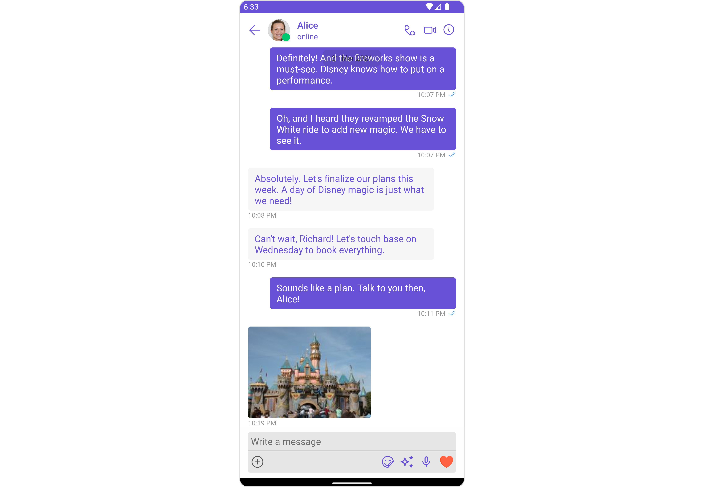

The Messages component is composed of three individual components, [MessageHeader](./message-header), [MessageList](./message-list), and [MessageComposer](./message-composer). In addition, the Messages component also navigates to the [Details](/ui-kit/android/group-details) and [ThreadedMessages](/ui-kit/android/threaded-messages) components.

| Components                                            | Description                                                                                                                                                                                              |
| ----------------------------------------------------- | -------------------------------------------------------------------------------------------------------------------------------------------------------------------------------------------------------- |
| [MessageHeader](./message-header)                     | `CometChatMessageHeader` displays the `User` or `Group` information using CometChat SDK's `User` or `Group object.` It also shows the typing indicator when the user starts typing in `MessageComposer`. |
| [MessageList](./message-list)                         | `CometChatMessageList` is one of the core UI components. It displays a list of messages and handles real-time operations.                                                                                |
| [MessageComposer](./message-composer)                 | `CometChatMessageComposer` is an independent and critical component that allows users to compose and send various types of messages includes text, image, video and custom messages.                     |
| [Details](/ui-kit/android/group-details)              | `CometChatDetails` is a component that displays all the available options available for `Users` & `Groups`                                                                                               |
| [ThreadedMessages](/ui-kit/android/threaded-messages) | `CometChatThreadedMessages` is a component that displays all replies made to a particular message in a conversation.                                                                                     |

## Usage

### Integration

The following code snippet illustrates how you can directly incorporate the Messages component into your `layout.xml` file.

```xml
<com.cometchat.chatuikit.messages.CometChatMessages
        android:layout_width="match_parent"
        android:layout_height="match_parent"
        android:id="@+id/message"
        />
```

:::warning Warning

The CometChatMessages is responsible for managing runtime permissions. To ensure the **ActivityResultLauncher** is properly initialized, its object should be created in the the **onCreate** state of an activity. To ensure that the CometChatMessages is loaded within the fragment, it is important to make sure that the fragment is loaded in the `onCreate` state of the activity.

:::

### Actions

[Actions](/ui-kit/android/components-overview#actions) dictate how a component functions. They are divided into two types: Predefined and User-defined. You can override either type, allowing you to tailor the behavior of the component to fit your specific needs.

The Messages component does not have its actions. However, since it's a [Composite Component](/ui-kit/android/components-overview#composite-components), you can use the actions of its components by utilizing the [Configurations](#configuration) object of each component.

**Example**

In this example, we are employing the [ThreadRepliesClick](/ui-kit/android/message-list#1-onthreadrepliesclick) action from the MessageList Component through the MessageListConfiguration object.

<Tabs>

<TabItem value="java" label="Java">

```java
MessageListConfiguration configuration = new MessageListConfiguration();
configuration.setOnThreadRepliesClick((context, baseMessage, cometChatMessageTemplate  cometChatMessageBubble) -> {
    // You Custom Action
});

messages.setMessageListConfiguration(configuration);
```

</TabItem>

<TabItem value="kotlin" label="Kotlin">

```kotlin
val configuration = MessageListConfiguration()
configuration.setOnThreadRepliesClick { context, baseMessage, cometChatMessageTemplate, cometChatMessageBubble ->
    // Your Custom Action
}

messages.messageListConfiguration = configuration
```

</TabItem>

</Tabs>

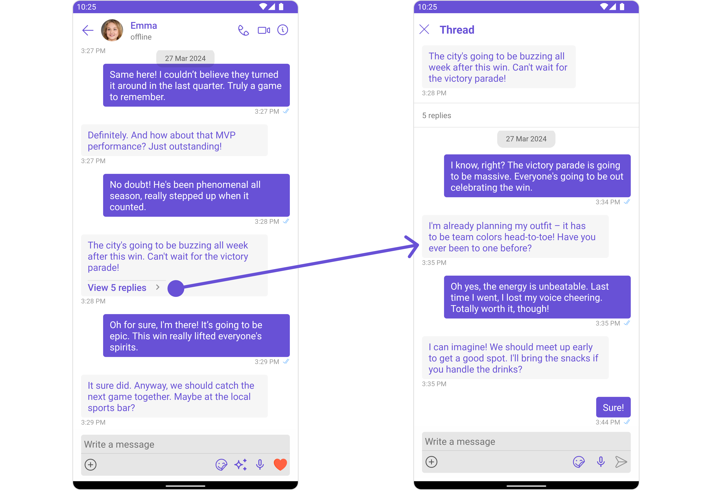

> The Messages Component overrides the [ThreadRepliesClick](/ui-kit/android/message-list#1-onthreadrepliesclick) action to navigate to the [ThreadedMessages](/ui-kit/android/threaded-messages) component. If you override `ThreadRepliesClick`, it will also override the default behavior of the Messages Component.

### Filters

**Filters** allow you to customize the data displayed in a list within a Component. You can filter the list based on your specific criteria, allowing for a more customized. Filters can be applied using RequestBuilders of Chat SDK.

The Messages component does not have its filters. But as it is a [Composite Component](/ui-kit/android/components-overview#composite-components), you can use the filters of its components by using the [Configurations](#configuration) object of each component. For more details on the filters of its components, please refer to [MessageList Filters](/ui-kit/android/message-list#filters).

**Example**

In this example, we're applying the MessageList Component filter to the Messages Component using `MessageListConfiguration`.

<Tabs>

<TabItem value="java" label="Java">

```java
MessageListConfiguration configuration = new MessageListConfiguration();

MessagesRequest.MessagesRequestBuilder messagesRequest = new MessagesRequestMessagesRequestBuilder()
        .setSearchKeyword("your search keyword")
        .setUID("user uid");

configuration.setMessagesRequestBuilder(messagesRequest);
messages.setMessageListConfiguration(configuration);
```

</TabItem>

<TabItem value="kotlin" label="Kotlin">

```kotlin
val configuration = MessageListConfiguration()

val messagesRequest = MessagesRequest.MessagesRequestBuilder()
        .setSearchKeyword("your search keyword")
        .setUID("user uid")

configuration.messagesRequestBuilder = messagesRequest
messages.setMessageListConfiguration(configuration)
```

</TabItem>

</Tabs>

### Events

[Events](/ui-kit/android/components-overview#events) are emitted by a `Component`. By using event you can extend existing functionality. Being global events, they can be applied in Multiple Locations and are capable of being Added or Removed.

The list of events emitted by the Messages component is as follows.

| Event                | Description                                                                                                                       |
| -------------------- | --------------------------------------------------------------------------------------------------------------------------------- |
| **ccMessageSent**    | Triggers whenever a loggedIn user sends any message, it will have two states such as: <br /><br />inProgress & sent               |
| **ccMessageEdited**  | Triggers whenever a loggedIn user edits any message from the list of messages .it will have two states such as: inProgress & sent |
| **ccMessageDeleted** | Triggers whenever a loggedIn user deletes any message from the list of messages                                                   |
| **ccMessageRead**    | Triggers whenever a loggedIn user reads any message.                                                                              |
| **ccLiveReaction**   | Triggers whenever a loggedIn clicks on live reaction                                                                              |

Adding `CometChatMessageEvents` Listener's

<Tabs>
<TabItem value="java" label="Java">

```Java
CometChatMessageEvents.addListener("YOUR_LISTENER_TAG", new CometChatMessageEvents() {
            @Override
            public void ccMessageSent(BaseMessage baseMessage, int status) {
                super.ccMessageSent(baseMessage, status);
            }

            @Override
            public void ccMessageEdited(BaseMessage baseMessage, int status) {
                super.ccMessageEdited(baseMessage, status);
            }

            @Override
            public void ccMessageDeleted(BaseMessage baseMessage) {
                super.ccMessageDeleted(baseMessage);
            }

            @Override
            public void ccMessageRead(BaseMessage baseMessage) {
                super.ccMessageRead(baseMessage);
            }

            @Override
            public void ccLiveReaction(int icon) {
                super.ccLiveReaction(icon);
            }
        });
```

</TabItem>

<TabItem value="kotlin" label="Kotlin">

```kotlin
CometChatMessageEvents.addListener("YOUR_LISTENER_TAG", object : CometChatMessageEvents() {
    override fun ccMessageSent(baseMessage: BaseMessage, status: Int) {
        super.ccMessageSent(baseMessage, status)
    }

    override fun ccMessageEdited(baseMessage: BaseMessage, status: Int) {
        super.ccMessageEdited(baseMessage, status)
    }

    override fun ccMessageDeleted(baseMessage: BaseMessage) {
        super.ccMessageDeleted(baseMessage)
    }

    override fun ccMessageRead(baseMessage: BaseMessage) {
        super.ccMessageRead(baseMessage)
    }

    override fun ccLiveReaction(icon: Int) {
        super.ccLiveReaction(icon)
    }
})
```

</TabItem>
</Tabs>

Removing `CometChatMessageEvents` Listener's
<Tabs>
<TabItem value="java" label="Java">

```java
CometChatMessageEvents.removeListener("YOUR_LISTENER_TAG");
```

</TabItem>

<TabItem value="kotlin" label="Kotlin">
```kotlin
CometChatMessageEvents.removeListener("YOUR_LISTENER_TAG")
```
</TabItem>

</Tabs>

## Customization

To fit your app's design requirements, you can customize the appearance of the conversation component. We provide exposed methods that allow you to modify the experience and behavior according to your specific needs.

### Style

Using Style you can customize the look and feel of the component in your app, These parameters typically control elements such as the color, size, shape, and fonts used within the component.

##### 1. Messages Style

You can customize the appearance of the Messages Component by applying the MessagesStyle to it using the following code snippet.

<Tabs>

<TabItem value="java" label="Java">

```java
MessagesStyle messagesStyle = new MessagesStyle();
messagesStyle.setBackground(Color.BLACK);
messagesStyle.setCornerRadius(20f);

messages.setStyle(messagesStyle);
```

</TabItem>

<TabItem value="Kotlin" label="Kotlin">

```kotlin
val messagesStyle = MessagesStyle()
messagesStyle.setBackground(Color.BLACK)
messagesStyle.setCornerRadius(20f)

messages.style = messagesStyle
```

</TabItem>

</Tabs>

List of properties exposed by MessagesStyle

| Property             | Description                      | Code                             |
| -------------------- | -------------------------------- | -------------------------------- |
| **set Background**   | Used to set the background color | `.setBackground(@ColorInt int)`  |
| **set Background**   | Used to set drawable background  | `.setBackground(Drawable)`       |
| **set BorderColor**  | Used to set border color         | `.setBorderColor(@ColorInt int)` |
| **set BorderWidth**  | Used to set border width         | `.setBorderWidth(int)`           |
| **set CornerRadius** | Used to set corner radius        | `.setCornerRadius(float)`        |

##### 2. Component's Styles

Being a [Composite component](/ui-kit/android/components-overview#composite-components), the Messages Component allows you to customize the styles of its components using their respective Configuration objects.

For a list of all available properties, refer to each component's styling documentation: [MesssageHeader Styles](/ui-kit/android/message-header#style), [MessageList Styles](/ui-kit/android/message-list#style), [MessageComposer Styles](/ui-kit/android/message-composer#style), [Details Styles](/ui-kit/android/group-details), [ThreadMessages Styles](/ui-kit/android/threaded-messages).

**Example**

In this example, we are creating `MessageListStyle` and `MessageComposerStyle` and then applying them to the Messages Component using `MessageListConfiguration` and `MessageComposerConfiguration`.

<Tabs>

<TabItem value="java" label="Java">

```java
MessageListStyle messageListStyle = new MessageListStyle();
messageListStyle.setBackground(Color.BLACK);
messageListStyle.setBorderColor(Color.WHITE);

MessageComposerStyle messageComposerStyle = new MessageComposerStyle();
messageComposerStyle.setBackground(R.color.black);
messageComposerStyle.setBorderColor(com.cometchat.chatuikit.R.color.grey);

MessageListConfiguration messageListConfiguration = new MessageListConfiguration();
messageListConfiguration.setStyle(messageListStyle);

messages.setMessageListConfiguration(messageListConfiguration);

MessageComposerConfiguration messageComposerConfiguration = new MessageComposerConfiguration();
messageComposerConfiguration.setStyle(messageComposerStyle);

messages.setMessageComposerConfiguration(messageComposerConfiguration);
```

</TabItem>

<TabItem value="kotlin" label="Kotlin">

```kotlin
val messageListStyle = MessageListStyle()
messageListStyle.setBackground(Color.BLACK)
messageListStyle.setBorderColor(Color.WHITE)

val messageComposerStyle = MessageComposerStyle()
messageComposerStyle.setBackground(R.color.black)
messageComposerStyle.setBorderColor(com.cometchat.chatuikit.R.color.grey)

val messageListConfiguration = MessageListConfiguration()
messageListConfiguration.setStyle(messageListStyle)

messages.setMessageListConfiguration(messageListConfiguration)

val messageComposerConfiguration = MessageComposerConfiguration()
messageComposerConfiguration.setStyle(messageComposerStyle)

messages.setMessageComposerConfiguration(messageComposerConfiguration)
```

</TabItem>

</Tabs>

---

### Functionality

These are a set of small functional customizations that allow you to fine-tune the overall experience of the component. With these, you can change text, set custom icons, and toggle the visibility of UI elements.

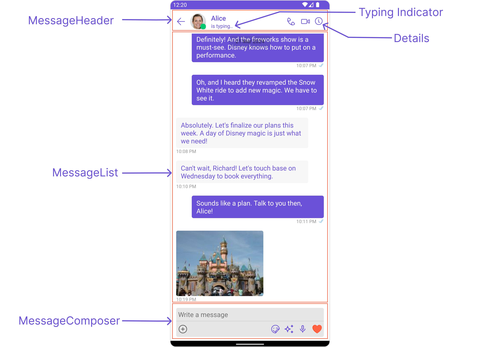

<Tabs>

<TabItem value="java" label="Java">

```java
CometChatMessages messages = findViewById(R.id.message);
messages.setUser(user);
messages.hideDetails(true);
messages.disableTyping(true);
```

</TabItem>

<TabItem value="Kotlin" label="Kotlin">

```kotlin
val messages = findViewById<CometChatMessages>(R.id.message)
messages.setUser(user)
messages.hideDetails(true)
messages.disableTyping(true)
```

</TabItem>

</Tabs>

Below is a list of customizations along with corresponding code snippets
| Property | Description | Code |
| -------------------------------------------------------------------------------------------------------- | ---------------------------------------------------------------------------------------------------------------------------------- | ----------------------------------------------------------- |
| **User** <a data-tooltip-id="my-tooltip-html-prop"> <span class="material-icons red">report</span> </a> | Used to pass user object of which header specific details will be shown | `.setUser(user)` |
| **Group** <a data-tooltip-id="my-tooltip-html-prop"> <span class="material-icons red">report</span> </a> | Used to pass group object of which header specific details will be shown | `.setGroup(Group)` |
| **Hide MessageComposer** | Used to toggle visibility for CometChatMessageComposer, default false | `.hideMessageComposer(boolean)` |
| **Hide MessageHeader** | Used to toggle visibility for CometChatMessageHeader, default false | `.hideMessageHeader(boolean)` |
| **Disable Typing** | Used to toggle functionality for showing typing indicator and also enable/disable sending message delivery/read receipts | `.disableTyping(boolean)` |
| **Disable SoundForMessages** | Used to toggle sound for messages | `.disableSoundForMessages(boolean)` |
| **Set CustomSoundForIncomingMessages** | Used to set custom sound asset's path for incoming messages | `.setCustomSoundForIncomingMessages(@RawRes int)` |
| **Set CustomSoundForOutgoingMessages** | Used to set custom sound asset's path for outgoing messages | `.setCustomSoundForOutgoingMessages(@RawRes int)` |
| **Hide Details** | Used to toggle visibility for details icon in CometChatMessageHeader | `.hideDetails(boolean)` |

### Advanced

For advanced-level customization, you can set custom views to the component. This lets you tailor each aspect of the component to fit your exact needs and application aesthetics. You can create and define your views, layouts, and UI elements and then incorporate those into the component.

---

#### MessageHeaderView

You can set your custom message header view using the `setMessageHeaderView()` method. But keep in mind, by using this you will override the default message header functionality.

<Tabs>

<TabItem value="java" label="Java">

```java
messages.setMessageHeaderView()
```

</TabItem>

<TabItem value="kotlin" label="Kotlin">

```kotlin
messages.setMessageHeaderView()
```

</TabItem>

</Tabs>

**Example**

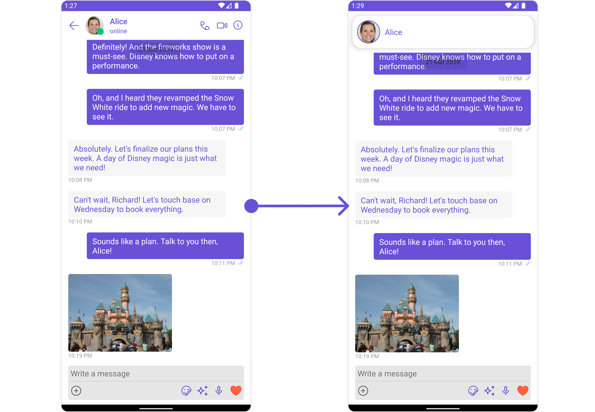

In this example, we will create a `custom_header_view.xml` and inflate it inside the `setMessageHeaderView()` method.

```xml title="custom_header_view.xml"
<?xml version="1.0" encoding="utf-8"?>
<RelativeLayout xmlns:android="http://schemas.android.com/apk/res/android"
    xmlns:app="http://schemas.android.com/apk/res-auto"
    xmlns:tools="http://schemas.android.com/tools"
    android:layout_width="match_parent"
    android:layout_height="match_parent"
    tools:context=".MainActivity">

    <androidx.cardview.widget.CardView
        android:layout_width="match_parent"
        android:layout_height="wrap_content"
        android:elevation="10dp"
        app:cardBackgroundColor="@color/white"
        app:cardCornerRadius="20dp"
        android:layout_margin="10dp"
        app:cardElevation="10dp"
        >

        <RelativeLayout
            android:layout_width="match_parent"
            android:layout_height="wrap_content">

            <com.cometchat.chatuikit.shared.views.CometChatAvatar.CometChatAvatar
                android:id="@+id/item_avatar"
                android:layout_centerVertical="true"
                android:layout_margin="10dp"
                android:layout_width="50dp"
                android:layout_height="50dp"
                android:padding="10dp"
                />

            <TextView
                android:id="@+id/txt_item_name"
                android:text="name"
                android:layout_width="match_parent"
                android:layout_height="wrap_content"
                android:layout_centerVertical="true"
                android:textColor="@color/purple_700"
                android:layout_toRightOf="@+id/item_avatar"
                android:textSize="17sp"
                />

        </RelativeLayout>

    </androidx.cardview.widget.CardView>

</RelativeLayout>
```

<Tabs>

<TabItem value="java" label="Java">

```java
messages.setMessageHeaderView((context, user1, group) -> {
    View view = getLayoutInflater().inflate(R.layout.custom_header_view, null);
    CometChatAvatar avatar = view.findViewById(R.id.item_avatar);
    TextView txtName = view.findViewById(R.id.txt_item_name);
    avatar.setBorderWidth(5);
    avatar.setBorderColor(getColor(R.color.purple_700));
    if(user1 != null){
        Log.e("", "User avatar = "+ user1.getAvatar());
        avatar.setImage(user1.getAvatar());
        txtName.setText(user1.getName());
    }else{
        avatar.setImage(group.getIcon());
        txtName.setText(group.getName());
    }
    return view;
});
```

</TabItem>

<TabItem value="kotlin" label="Kotlin">

```kotlin
messages.setMessageHeaderView { context, user1, group ->
    val view = LayoutInflater.from(context).inflate(R.layout.custom_header_view, null)
    val avatar = view.findViewById<CometChatAvatar>(R.id.item_avatar)
    val txtName = view.findViewById<TextView>(R.id.txt_item_name)
    avatar.borderWidth = 5
    avatar.borderColor = getColor(R.color.purple_700)
    if(user1 != null){
        Log.e("", "User avatar = "+ user1.avatar)
        avatar.setImage(user1.avatar)
        txtName.text = user1.name
    }else{
        avatar.setImage(group.icon)
        txtName.text = group.name
    }
    view
}
```

</TabItem>

</Tabs>

---

#### setMessageListView

You can set your custom message list view using the `setMessageListView()` method. But keep in mind, by using this you will override the default message ListView functionality.

<Tabs>

<TabItem value="java" label="Java">

```java
messages.setMessageListView()
```

</TabItem>

<TabItem value="kotlin" label="Kotlin">

```kotlin
messages.setMessageListView()
```

</TabItem>

</Tabs>

**Example**

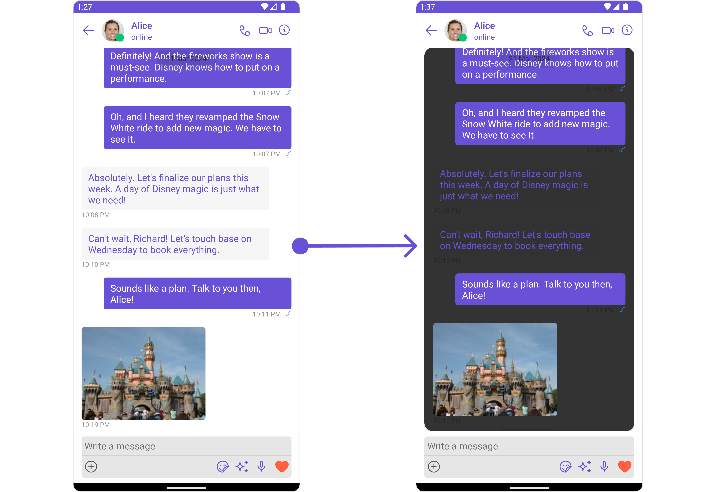

In this example, we will create a `custom_messages_list_layout.xml` and inflate it inside the `setMessageListView()` method.

```xml title="custom_messages_list_layout.xml"
<?xml version="1.0" encoding="utf-8"?>
<RelativeLayout xmlns:android="http://schemas.android.com/apk/res/android"
    android:layout_width="match_parent"
    android:layout_height="match_parent"

    xmlns:app="http://schemas.android.com/apk/res-auto">

    <androidx.cardview.widget.CardView
        android:layout_width="match_parent"
        android:layout_height="match_parent"
        app:cardCornerRadius="15dp"
        app:cardBackgroundColor="@color/secondary_dark"
        >

        <com.cometchat.chatuikit.messagelist.CometChatMessageList
            android:id="@+id/message_list"
            android:layout_width="match_parent"
            android:layout_height="match_parent"
            android:layout_marginStart="16dp"
            android:layout_marginEnd="16dp"
             />

    </androidx.cardview.widget.CardView>

</RelativeLayout>
```

<Tabs>

<TabItem value="java" label="Java">

```java
messages.setMessageListView((context, user1, group) -> {
    View view = getLayoutInflater().inflate(R.layout.custom_messages_list_layout, null);
    CometChatMessageList messageList = view.findViewById(R.id.message_list);
    if(user1 != null)
        messageList.setUser(user1);
    else
        messageList.setGroup(group);
    return view;
});
```

</TabItem>

<TabItem value="kotlin" label="Kotlin">

```kotlin
messages.setMessageListView { context, user1, group ->
    val view = LayoutInflater.from(context).inflate(R.layout.custom_messages_list_layout, null)
    val messageList = view.findViewById<CometChatMessageList>(R.id.message_list)
    if(user1 != null)
        messageList.setUser(user1)
    else
        messageList.setGroup(group)
    view
}
```

</TabItem>

</Tabs>

---

#### setMessageComposerView

You can set your custom Message Composer view using the `setMessageComposerView()` method. But keep in mind, by using this you will override the default message composer functionality.

<Tabs>

<TabItem value="java" label="Java">

```java
messages.setMessageComposerView()
```

</TabItem>

<TabItem value="kotlin" label="Kotlin">

```kotlin
messages.setMessageComposerView()
```

</TabItem>

</Tabs>

**Example**

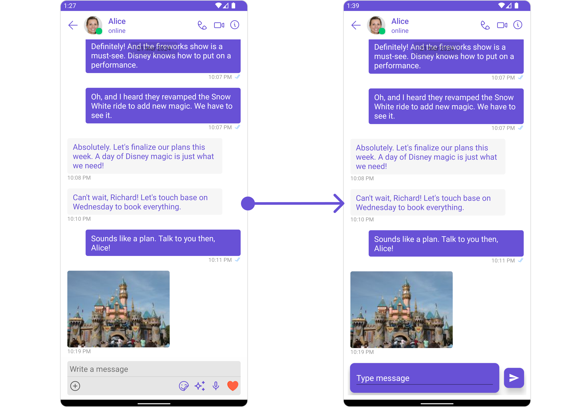

In this example, we will create a `custom_composer_view_layout.xml` and inflate it inside the `setMessageComposerView()` method.

```xml title="custom_composer_view_layout.xml"
<?xml version="1.0" encoding="utf-8"?>
<RelativeLayout xmlns:android="http://schemas.android.com/apk/res/android"
    android:layout_width="match_parent"
    android:layout_height="wrap_content"
    android:layout_gravity="center_vertical"
    android:orientation="horizontal"
    android:padding="10dp"
    xmlns:app="http://schemas.android.com/apk/res-auto">


    <androidx.cardview.widget.CardView
        android:id="@+id/card_editext"
        android:layout_width="match_parent"
        android:layout_height="wrap_content"
        android:padding="10dp"
        android:layout_margin="5dp"
        app:cardBackgroundColor="@color/purple_700"
        app:contentPadding="10dp"
        app:cardCornerRadius="10dp"
        app:cardElevation="10dp"
        android:layout_toLeftOf="@+id/card_sendbtn"
        >

        <EditText
            android:layout_width="match_parent"
            android:layout_height="wrap_content"
            android:hint="Type message"
            android:textColorHint="@color/white"
            android:textColor="@color/white"
            />

    </androidx.cardview.widget.CardView>


    <androidx.cardview.widget.CardView
        android:id="@+id/card_sendbtn"
        android:layout_width="wrap_content"
        android:layout_height="wrap_content"
        android:padding="10dp"
        android:layout_margin="5dp"
        app:cardBackgroundColor="@color/purple_700"
        app:contentPadding="10dp"
        app:cardCornerRadius="10dp"
        android:layout_alignParentEnd="true"
        android:layout_centerVertical="true"
        app:cardElevation="10dp"
        >

        <ImageView
            android:layout_width="wrap_content"
            android:layout_height="wrap_content"
            android:src="@drawable/ic_send"
            />

    </androidx.cardview.widget.CardView>

</RelativeLayout>
```

<Tabs>

<TabItem value="java" label="Java">

```java
messages.setMessageComposerView(new Function3<Context, User, Group, View>() {
    @Override
    public View apply(Context context, User user, Group group) {
        View view = getLayoutInflater().inflate(R.layout.custom_composer_view_layout, null);
        return view;
    }
});
```

</TabItem>

<TabItem value="kotlin" label="Kotlin">

```kotlin
messages.setMessageComposerView { context, user, group ->
    val view = LayoutInflater.from(context).inflate(R.layout.custom_composer_view_layout, null)
    view
}
```

</TabItem>

</Tabs>

---

#### setAuxiliaryHeaderMenu

You can set a custom header menu option by using the `setAuxiliaryHeaderMenu()` method.

<Tabs>

<TabItem value="java" label="Java">
```java
messages.setAuxiliaryHeaderMenu()
```
</TabItem>

<TabItem value="kotlin" label="Kotlin">

```kotlin
messages.setAuxiliaryHeaderMenu()
```

</TabItem>

</Tabs>

**Example**


In this example we are adding a custom payment option in header menu using `.setAuxiliaryHeaderMenu()`

```xml
<?xml version="1.0" encoding="utf-8"?>
<RelativeLayout xmlns:android="http://schemas.android.com/apk/res/android"
    android:layout_width="match_parent"
    android:layout_height="match_parent"
    xmlns:app="http://schemas.android.com/apk/res-auto">

    <ImageView
        android:id="@+id/img_payment"
        android:layout_width="wrap_content"
        android:layout_height="wrap_content"
        android:src="@drawable/ic_payment"
        android:padding="10dp"
        />

</RelativeLayout>
```

<Tabs>

<TabItem value="java" label="Java">

```java
messages.setAuxiliaryHeaderMenu(new Function3<Context, User, Group, View>() {
    @Override
    public View apply(Context context, User user, Group group) {
        View view = getLayoutInflater().inflate(R.layout.auxiliary_button_layout, null);
        ImageView imgPayment = findViewById(R.id.img_payment);
        imgPayment.setOnClickListener(new View.OnClickListener() {
            @Override
            public void onClick(View v) {
                Toast.makeText(context, "Clicked on payment option", Toast.LENGTH_SHORT).show();
            }
        });
        return view;
    }
});
```

</TabItem>

<TabItem value="kotlin" label="Kotlin">

```kotlin
messages.setAuxiliaryHeaderMenu { context, user, group ->
    val view = LayoutInflater.from(context).inflate(R.layout.auxiliary_button_layout, null)
    val imgPayment = view.findViewById<ImageView>(R.id.img_payment)
    imgPayment.setOnClickListener {
        Toast.makeText(context, "Clicked on payment option", Toast.LENGTH_SHORT).show()
    }
    view
}
```

</TabItem>

</Tabs>

The Messages Component uses the `setAuxiliaryHeaderMenu()` method to establish its default functionality. By setting an Auxiliary Menu, the Messages Component gains the capability to navigate to the [Details](/ui-kit/android/group-details) section.

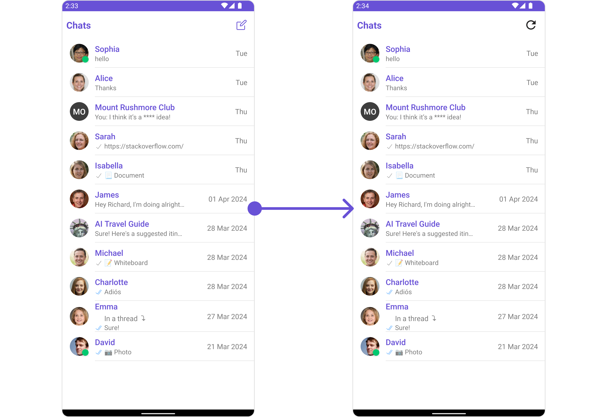

## Configuration

Configurations offer the ability to customize the properties of each individual component within a Composite Component.

The Messages Component is a Composite Component and it has a specific set of configuration for each of its components.

### MessageHeader

If you want to customize the properties of the [MessageHeader](./message-header) Component inside Messages Component, you need use the `MessageHeaderConfiguration` object.

<Tabs>

<TabItem value="java" label="Java">

```java
MessageHeaderConfiguration configuration = new MessageHeaderConfiguration();
messages.setMessageHeaderConfiguration(configuration);
```

</TabItem>

<TabItem value="kotlin" label="Kotlin">

```kotlin
val configuration = MessageHeaderConfiguration()
messages.setMessageHeaderConfiguration(configuration)
```

</TabItem>

</Tabs>

The `MessageHeaderConfiguration` provides access to all the [Action](/ui-kit/android/message-header#style), [Filters](/ui-kit/android/message-header#filters), [Styles](/ui-kit/android/message-header#style), [Functionality](/ui-kit/android/message-header#functionality), and [Advanced](/ui-kit/android/message-header#advanced) properties of the [MessageHeader](/ui-kit/android/message-header) component.

> Please note that the properties marked with the <a><span class="material-icons red">report</span></a> symbol are not accessible within the Configuration Object.

**Example**
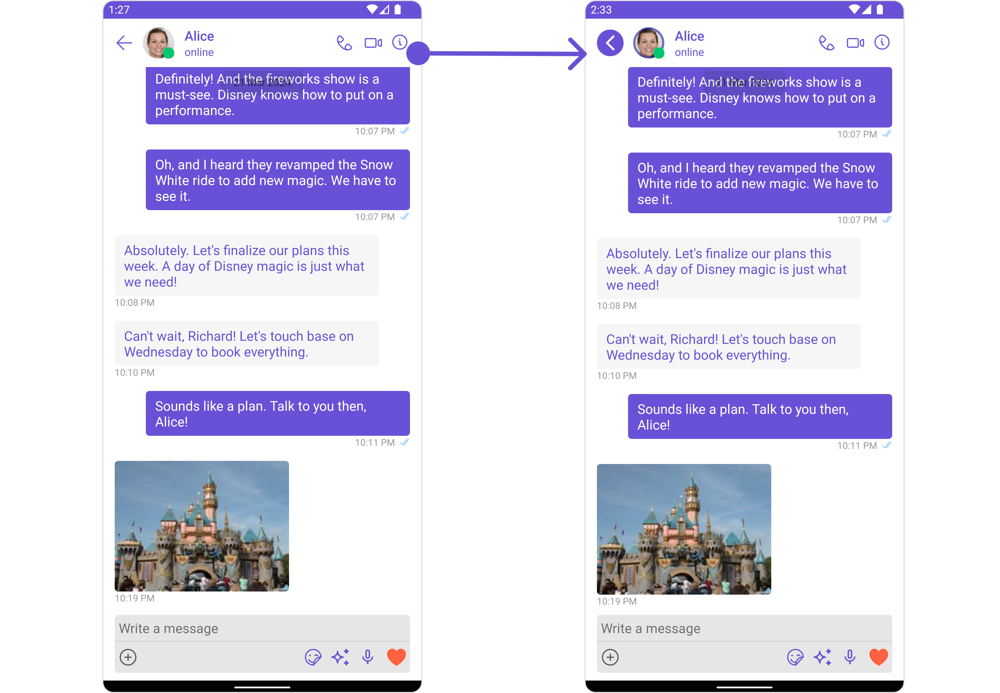
In this example, we will be adding a custom back button and styling a few properties of the Avatar component of the [MessageHeader](/ui-kit/android/message-header) component using `MessageHeaderConfiguration`.

<Tabs>

<TabItem value="java" label="Java">

```java
 MessageHeaderConfiguration configuration = new MessageHeaderConfiguration();

View backButtonView = getLayoutInflater().inflate(R.layout.custom_header_back_icon, null);
configuration.setBackIconView(backButtonView);

AvatarStyle avatarStyle = new AvatarStyle();
avatarStyle.setBorderColor(R.color.purple_700);
avatarStyle.setBorderWidth(10);

configuration.setAvatarStyle(avatarStyle);

messages.setMessageHeaderConfiguration(configuration);
```

</TabItem>

<TabItem value="kotlin" label="Kotlin">

```kotlin
val configuration = MessageHeaderConfiguration()

val backButtonView = LayoutInflater.from(this).inflate(R.layout.custom_header_back_icon, null)
configuration.backIconView = backButtonView

val avatarStyle = AvatarStyle()
avatarStyle.borderColor = R.color.purple_700
avatarStyle.borderWidth = 10

configuration.avatarStyle = avatarStyle

messages.setMessageHeaderConfiguration(configuration)
```

</TabItem>

</Tabs>

### MessageList

If you want to customize the properties of the [MessageList](./03-message-list.md) Component inside Messages Component, you need use the `MessageListConfiguration` object.

<Tabs>

<TabItem value="java" label="Java">

```java
MessageListConfiguration messageListConfiguration = new MessageListConfiguration();
messages.setMessageListConfiguration(messageListConfiguration);
```

</TabItem>

<TabItem value="kotlin" label="Kotlin">

```kotlin
val messageListConfiguration = MessageListConfiguration()
messages.setMessageListConfiguration(messageListConfiguration)
```

</TabItem>

</Tabs>

The `MessageListConfiguration` provides access to all the [Action](/ui-kit/android/message-list#style), [Filters](/ui-kit/android/message-list#filters), [Styles](/ui-kit/android/message-list#style), [Functionality](/ui-kit/android/message-list#functionality), and [Advanced](//android-chat-ui-kit/message-list#advanced) properties of the [MessageList](/ui-kit/android/message-list) component.

> Please note that the properties marked with the <a><span class="material-icons red">report</span></a> symbol are not accessible within the Configuration Object.

**Example**
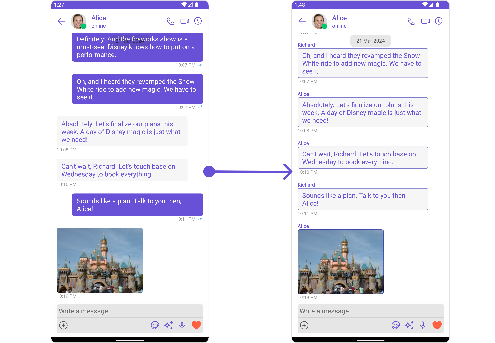
In this example, we will be changing the list alignment and modifying the message bubble styles in the [MessageList](/ui-kit/android/message-list) component using `MessageListConfiguration`.

<Tabs>

<TabItem value="java" label="Java">

```java
MessageListConfiguration messageListConfiguration = new MessageListConfiguration();

messageListConfiguration.setListAlignment(UIKitConstants.MessageListAlignment.LEFT_ALIGNED);

MessageBubbleStyle messageBubbleStyle= new MessageBubbleStyle();
messageBubbleStyle.setCornerRadius(20f);
messageBubbleStyle.setBorderColor(R.color.purple_700);
messageBubbleStyle.setBorderWidth(5);

messageListConfiguration.setWrapperMessageBubbleStyle(messageBubbleStyle);

messages.setMessageListConfiguration(messageListConfiguration);
```

</TabItem>

<TabItem value="kotlin" label="Kotlin">

```kotlin
val messageListConfiguration = MessageListConfiguration()

messageListConfiguration.listAlignment = UIKitConstants.MessageListAlignment.LEFT_ALIGNED

val messageBubbleStyle = MessageBubbleStyle()
messageBubbleStyle.cornerRadius = 20f
messageBubbleStyle.borderColor = R.color.purple_700
messageBubbleStyle.borderWidth = 5

messageListConfiguration.wrapperMessageBubbleStyle = messageBubbleStyle

messages.setMessageListConfiguration(messageListConfiguration)
```

</TabItem>

</Tabs>

### MessageComposer

If you want to customize the properties of the [MessageComposer](/ui-kit/android/message-composer) Component inside Messages Component, you need use the `MessageComposerConfiguration` object.

<Tabs>

<TabItem value="java" label="Java">

```java
MessageComposerConfiguration configuration = new MessageComposerConfiguration();
messages.setMessageComposerConfiguration(configuration);
```

</TabItem>

<TabItem value="kotlin" label="Kotlin">

```kotlin
val configuration = MessageComposerConfiguration()
messages.setMessageComposerConfiguration(configuration)
```

</TabItem>

</Tabs>

The `MessageComposerConfiguration` provides access to all the [Action](/ui-kit/android/message-composer#style), [Filters](/ui-kit/android/message-composer#filters), [Styles](/ui-kit/android/message-composer#style), [Functionality](/ui-kit/android/message-composer#functionality), and [Advanced](/ui-kit/android/message-composer#advanced) properties of the [MessageComposer](/ui-kit/android/message-composer) component.

> Please note that the properties marked with the <a><span class="material-icons red">report</span></a> symbol are not accessible within the Configuration Object.

**Example**
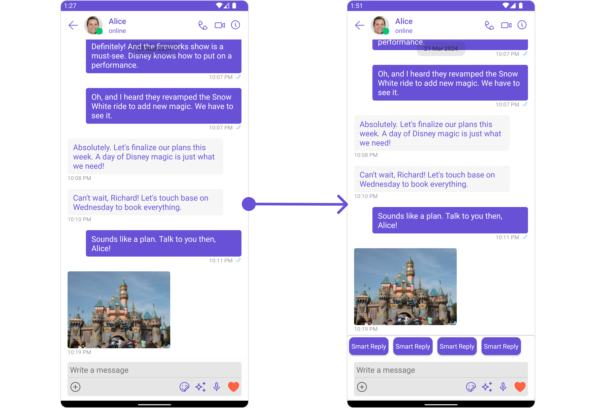

In this example, we'll be adding a custom header view and customizing some properties of the [MessageComposer](/ui-kit/android/message-composer) component using `MessageComposerConfiguration`.

<Tabs>

<TabItem value="java" label="Java">

```java
MessageComposerConfiguration configuration = new MessageComposerConfiguration();

View view = getLayoutInflater().inflate(R.layout.custom_header_view_layout, null);
configuration.setHeaderView(view);

MessageComposerStyle composerStyle = new MessageComposerStyle();
composerStyle.setBorderColor(Color.LTGRAY);
composerStyle.setBorderWidth(5);
composerStyle.setCornerRadius(20);
configuration.setStyle(composerStyle);

messages.setMessageComposerConfiguration(configuration);
```

</TabItem>

<TabItem value="kotlin" label="Kotlin">

```kotlin
val configuration = MessageComposerConfiguration()

val view = LayoutInflater.from(this).inflate(R.layout.custom_header_view_layout, null)
configuration.headerView = view

val composerStyle = MessageComposerStyle()
composerStyle.borderColor = Color.LTGRAY
composerStyle.borderWidth = 5
composerStyle.cornerRadius = 20
configuration.style = composerStyle

messages.setMessageComposerConfiguration(configuration)
```

</TabItem>

</Tabs>

### ThreadedMessages

If you want to customize the properties of the [ThreadedMessages](/ui-kit/android/threaded-messages) Component inside Messages Component, you need use the `ThreadedMessagesConfiguration` object.

<Tabs>

<TabItem value="java" label="Java">

```java
ThreadedMessagesConfiguration configuration = new ThreadedMessagesConfiguration();
messages.setThreadedMessagesConfiguration(configuration);
```

</TabItem>

<TabItem value="kotlin" label="Kotlin">

```kotlin
val configuration = ThreadedMessagesConfiguration()
messages.setThreadedMessagesConfiguration(configuration)
```

</TabItem>

</Tabs>

The `ThreadedMessagesConfiguration` provides access to all the [Action](/ui-kit/android/threaded-messages#style), [Filters](/ui-kit/android/threaded-messages#filters), [Styles](/ui-kit/android/threaded-messages#style), [Functionality](/ui-kit/android/threaded-messages#functionality), and [Advanced](/ui-kit/android/threaded-messages#advanced) properties of the [ThreadedMessages](/ui-kit/android/threaded-messages) component.

> Please note that the properties marked with the <a><span class="material-icons red">report</span></a> symbol are not accessible within the Configuration Object.

**Example**
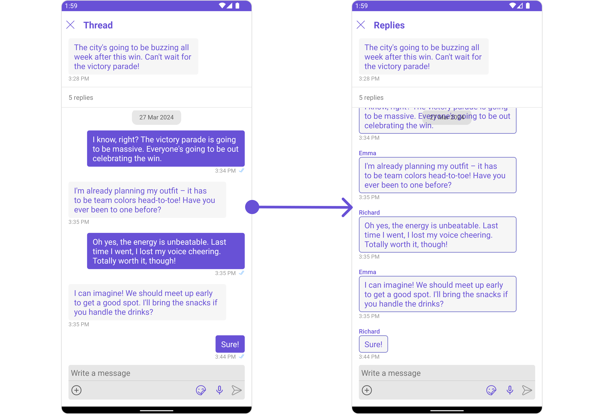

In this example, we are adding a custom title to the Threaded Message component and also adding custom properties to the [MessageList](#messagelist) using `MessageListConfiguration`. We then apply these changes to the [ThreadedMessages](/ui-kit/android/threaded-messages) component using `ThreadedMessagesConfiguration`.

<Tabs>

<TabItem value="java" label="Java">

```java
ThreadedMessagesConfiguration configuration = new ThreadedMessagesConfiguration();

configuration.setTitle("Replies");

MessageListConfiguration messageListConfiguration = new MessageListConfiguration();

messageListConfiguration.setListAlignment(UIKitConstants.MessageListAlignment.LEFT_ALIGNED);

MessageBubbleStyle messageBubbleStyle= new MessageBubbleStyle();
messageBubbleStyle.setCornerRadius(20f);
messageBubbleStyle.setBorderColor(R.color.purple_700);
messageBubbleStyle.setBorderWidth(5);
messageListConfiguration.setWrapperMessageBubbleStyle(messageBubbleStyle);

configuration.setMessageListConfiguration(messageListConfiguration);

messages.setThreadedMessagesConfiguration(configuration);

```

</TabItem>

<TabItem value="kotlin" label="Kotlin">

```kotlin
val configuration = ThreadedMessagesConfiguration()

configuration.title = "Replies"

val messageListConfiguration = MessageListConfiguration()

messageListConfiguration.listAlignment = UIKitConstants.MessageListAlignment.LEFT_ALIGNED

val messageBubbleStyle = MessageBubbleStyle()
messageBubbleStyle.cornerRadius = 20f
messageBubbleStyle.borderColor = R.color.purple_700
messageBubbleStyle.borderWidth = 5
messageListConfiguration.wrapperMessageBubbleStyle = messageBubbleStyle

configuration.messageListConfiguration = messageListConfiguration

messages.setThreadedMessagesConfiguration(configuration)
```

</TabItem>

</Tabs>

<!-- ### Details

If you want to customize the properties of the [Details](/ui-kit/android/threaded-messages) Component inside Messages Component, you need use the `ThreadedMessagesConfiguration` object. -->

import { Tooltip } from 'react-tooltip'
import 'react-tooltip/dist/react-tooltip.css'

<Tooltip
  id="my-tooltip-html-prop"
  html="Not available in MessageConfiguration"
/>
