import Tabs from '@theme/Tabs';
import TabItem from '@theme/TabItem';
import { Tooltip } from 'react-tooltip'
import 'react-tooltip/dist/react-tooltip.css'

## Overview

`MessageList` is a [Composite Component](/ui-kit/android/components-overview#composite-components) that displays a list of messages and effectively manages real-time operations. It includes various types of messages such as Text Messages, Media Messages, Stickers, and more.

`MessageList` is primarily a list of the base component [MessageBubble](/ui-kit/android/message-bubble). The MessageBubble Component is utilized to create different types of chat bubbles depending on the message type.

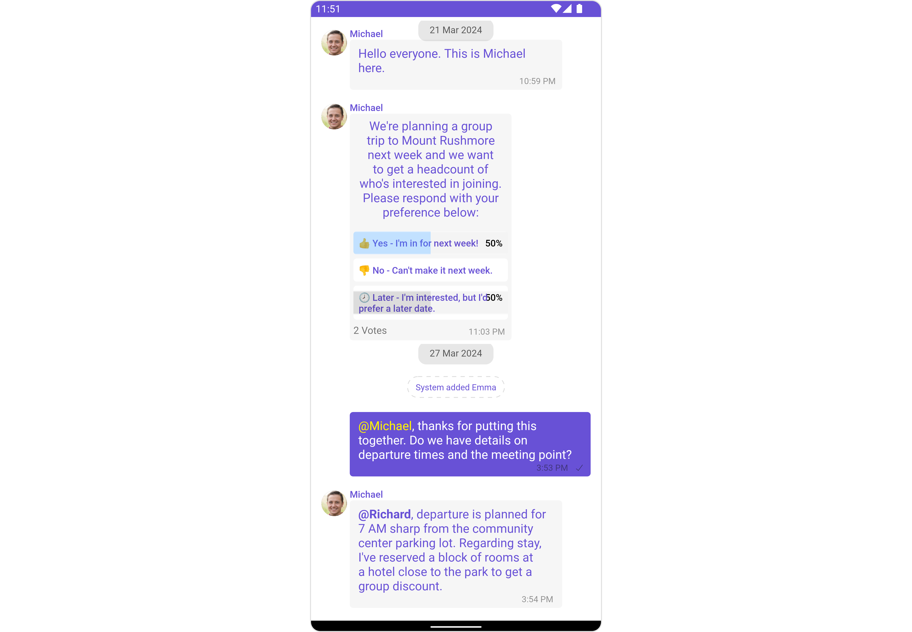

## Usage

### Integration

The following code snippet illustrates how you can directly incorporate the MessageList component into your `layout.xml` file.

<Tabs>
<TabItem value="xml" label="XML">

```xml
<com.cometchat.chatuikit.messagelist.CometChatMessageList
                android:id="@+id/message_list"
                android:layout_width="match_parent"
                android:layout_height="match_parent"
                android:layout_marginStart="16dp"
                android:layout_marginEnd="16dp"
                android:background="@android:color/transparent" />
```

</TabItem>
</Tabs>

:::warning

Simply adding the `MessageList` component to the layout will only display the loading indicator. To fetch messages for a specific entity, you need to supplement it with `User` or `Group` Object.

:::

---

### Actions

[Actions](/ui-kit/android/components-overview#actions) dictate how a component functions. They are divided into two types: Predefined and User-defined. You can override either type, allowing you to tailor the behavior of the component to fit your specific needs.

##### 1. onThreadRepliesClick

`onThreadRepliesClick` is triggered when you click on the threaded message bubble.
The `onThreadRepliesClick` action doesn't have a predefined behavior. You can override this action using the following code snippet.

<Tabs>

<TabItem value="java" label="Java">
    ```java
    messageList.setOnThreadRepliesClick((context, baseMessage, cometChatMessageTemplate, cometChatMessageBubble) -> {
        // Your action onclick
    });
    ```
</TabItem>

<TabItem value="kotlin" label="Kotlin">

    ```kotlin
    messageList.setOnThreadRepliesClick { context, baseMessage, cometChatMessageTemplate, cometChatMessageBubble ->
        // Your action onclick
    }
    ```

</TabItem>

</Tabs>

##### setOnReactionClickListener

The listener to be set for reacting to a message.Pass a non-null instance of OnReactionClickListener to enable it.

**Example**
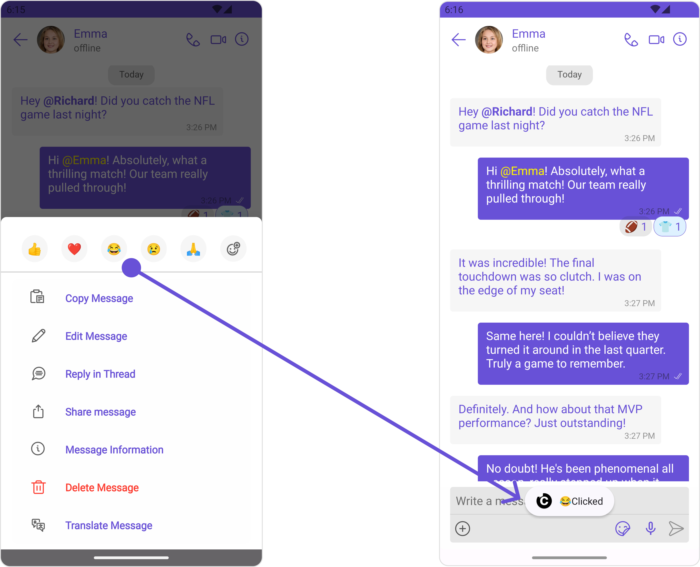

<Tabs>
<TabItem value="java" label="Java">

```java title="YourActivity.java"
 messageList.setOnReactionClickListener(new OnReactionClickListener() {
                    @Override
                    public void onClick(String reaction) {
                        Toast.makeText(this, reaction + "Clicked", Toast.LENGTH_SHORT).show();
                    }

                    @Override
                    public void onClick(BaseMessage baseMessage, String reaction) {
                    }
                });
```

</TabItem>

    <TabItem value="kotlin" label="Kotlin">

        ```kotlin
        messageList.setOnReactionClickListener(object : OnReactionClickListener {
                override fun onClick(reaction: String) {
                    Toast.makeText(this, reaction + "Clicked", Toast.LENGTH_SHORT).show()
                }

                override fun onClick(baseMessage: BaseMessage, reaction: String) {}
            });
        ```

    </TabItem>

</Tabs>

##### setOnAddReactionClickListener

The listener to be set for adding reactions to a message.Pass a non-null instance of OnAddReactionClickListener to enable it.

**Example**
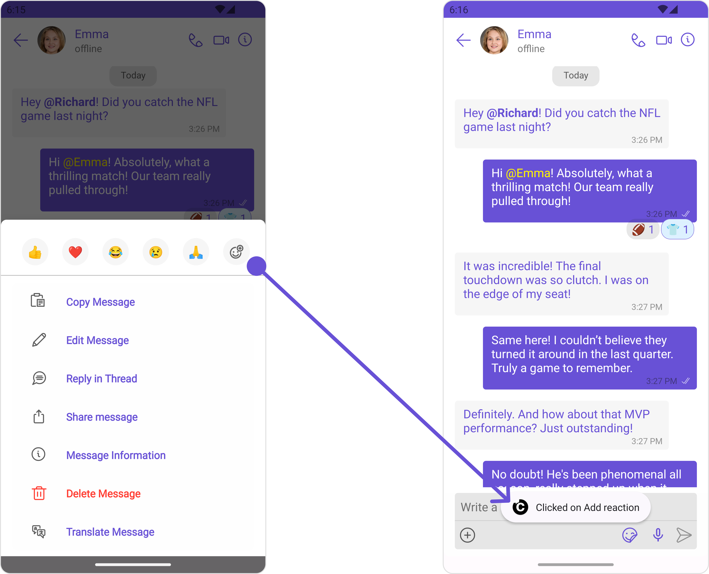
<Tabs>

<TabItem value="java" label="Java">
```java title="YourActivity.java"
 messageList.setOnAddReactionClickListener(new OnAddReactionClickListener() {
                    @Override
                    public void onClick() {
                        Toast.makeText(YourActivity.this, "Clicked on Add reaction", Toast.LENGTH_SHORT).show();
                    }
                });
```
</TabItem>

<TabItem value="kotlin" label="Kotlin">

    ```kotlin
      messageList.setOnAddReactionClickListener {
            object : OnAddReactionClickListener {
                override fun onClick() {
                    Toast.makeText(this, reaction + "Clicked on Add reaction", Toast.LENGTH_SHORT).show()
                }
            }
        }
    ```

</TabItem>

</Tabs>

##### 2. onError

This action doesn't change the behavior of the component but rather listens for any errors that occur in the MessageList component.

<Tabs>

<TabItem value="java" label="Java">
```java title="YourActivity.java"
messageList.setOnError(new OnError() {
    @Override
    public void onError(Context context, CometChatException e) {
        //Your Exception Handling code.
    }
});
```
</TabItem>

<TabItem value="kotlin" label="Kotlin">

```kotlin title="YourActivity.kt"
messageList.setOnError(object : OnError {
    override fun onError(context: Context, e: CometChatException) {
        // Your Exception Handling code.
    }
})
```

</TabItem>

</Tabs>

### Filters

You can adjust the `MessagesRequestBuilder` in the MessageList Component to customize your message list. Numerous options are available to alter the builder to meet your specific needs. For additional details on `MessagesRequestBuilder`, please visit [MessagesRequestBuilder](/sdk/android/additional-message-filtering).

In the example below, we are applying a filter to the messages based on a search substring and for a specific user. This means that only messages that contain the search term and are associated with the specified user will be displayed

<Tabs>

<TabItem value="java" label="Java">

```java
MessagesRequest.MessagesRequestBuilder messagesRequest = new MessagesRequest.MessagesRequestBuilder()
    .setSearchKeyword("your search keyword")
    .setUID("user uid");

messageList.setMessagesRequestBuilder(messagesRequest);
```

</TabItem>

<TabItem value="Kotlin" label="Kotlin">

```kotlin
val messagesRequest = MessagesRequest.MessagesRequestBuilder()
    .setSearchKeyword("your search keyword")
    .setUID("user uid")
    .build()

messageList.messagesRequestBuilder = messagesRequest
```

</TabItem>

</Tabs>

:::info

The following parameters in messageRequestBuilder will always be altered inside the message list

1. UID
2. GUID
3. types
4. categories

:::

---

### Events

[Events](/ui-kit/android/components-overview#events) are emitted by a `Component`. By using event you can extend existing functionality. Being global events, they can be applied in Multiple Locations and are capable of being Added or Removed.

The MessageList Component does not emit any events of its own.

---

## Customization

To fit your app's design requirements, you can customize the appearance of the conversation component. We provide exposed methods that allow you to modify the experience and behavior according to your specific needs.

### Style

Using Style you can customize the look and feel of the component in your app, These parameters typically control elements such as the color, size, shape, and fonts used within the component.

##### 1. MessageList Style

You can set the MessageListStyle to the MessageList Component to customize the styling.

<Tabs>

<TabItem value="java" label="Java">

```java
MessageListStyle messageListStyle = new MessageListStyle();
    messageListStyle.setBackground(Color.BLACK);
    messageListStyle.setBorderColor(Color.WHITE);

    messageList.setStyle(messageListStyle);
```

</TabItem>

<TabItem value="Kotlin" label="Kotlin">

```kotlin
val messageListStyle = MessageListStyle().apply {
    background = Color.BLACK
    borderColor = Color.WHITE
}

messageList.style = messageListStyle
```

</TabItem>

</Tabs>

List of properties exposed by MessageListStyle

| Property                       | Description                                                          | Code                                           |
| ------------------------------ | -------------------------------------------------------------------- | ---------------------------------------------- |
| **Border Width**               | used to set border width                                             | `.setBorderWidth(int)`                         |
| **Border Color**               | used to set border color                                             | `.setBorderColor(@ColorInt int)`               |
| **Corner Radius**              | used to set corner radius                                            | `.setCornerRadius(int)`                        |
| **LoadingIcon Tint**           | used to set loading icon tint                                        | `.setLoadingIconTint(@ColorInt int)`           |
| **EmptyText Appearance**       | used to set empty state text Appearance                              | `.setLoadingIconTint(@StyleRes int)`           |
| **ErrorText Appearance**       | used to set error text Appearance                                    | `.setErrorTextAppearance(@StyleRes int)`       |
| **EmptyText Color**            | used to set empty state text color                                   | `.setEmptyTextColor(@ColorInt int)`            |
| **ErrorText Color**            | used to set error state text color                                   | `.setErrorTextColor(@ColorInt int)`            |
| **NameText Color**             | used to set sender/receiver name text color on a message bubble.     | `.setNameTextColor(@ColorInt int)`             |
| **NameText Appearance**        | used to set sender/receiver name text appearance on a message bubble | `.setNameTextAppearance(@StyleRes int)`        |
| **TimeStampText Color**        | used to set time stamp text appearance                               | `.setTimeStampTextAppearance(@StyleRes int)`   |
| **ThreadReplySeparator Color** | used to set thread reply separator color                             | `.setThreadReplySeparatorColor(@ColorInt int)` |
| **ThreadReplyText Color**      | used to set thread reply text color                                  | `.setThreadReplyTextColor(@ColorInt int)`      |
| **ThreadReplyText Appearance** | used to set thread reply text appearance                             | `.setThreadReplyTextAppearance(@StyleRes int)` |
| **ThreadReplyIcon Tint**       | used to set thread reply icon tint                                   | `.setThreadReplyIconTint(@ColorInt int)`       |
| **Background**                 | This method will set the background color for message list           | `.setBackground(@ColorInt int)`                |
| **Background**                 | This will set drawable component for list background                 | `.setBackground(@drawable int)`                |

##### 2. Avatar Style

To apply customized styles to the `Avatar` component in the `Conversations` Component, you can use the following code snippet. For more information, visit [Avatar Styles](./avatar).

<Tabs>

<TabItem value="java" label="Java">
```java
AvatarStyle avatarStyle = new AvatarStyle();
avatarStyle.setBorderWidth(10);
avatarStyle.setBorderColor(Color.BLACK);
messageList.setAvatarStyle(avatarStyle);
```
</TabItem>

<TabItem value="kotlin" label="Kotlin">

```kotlin
val avatarStyle = AvatarStyle()
avatarStyle.borderWidth = 10
avatarStyle.borderColor = Color.BLACK
messageList.setAvatarStyle(avatarStyle)

```

</TabItem>

</Tabs>

---

### Functionality

These are a set of small functional customizations that allow you to fine-tune the overall experience of the component. With these, you can change text, set custom icons, and toggle the visibility of UI elements.

<Tabs>

<TabItem value="java" label="Java">

```java
CometChatMessageList messageList = findViewById(R.id.message_list);
messageList.setUser(user);
messageList.hideError(true);
messageList.hideReceipt(true);
```

</TabItem>

<TabItem value="Kotlin" label="Kotlin">

```kotlin
val messageList = findViewById<CometChatMessageList>(R.id.message_list)
messageList.user = user
messageList.hideError(true)
messageList.hideReceipt(true)
```

</TabItem>

</Tabs>

Below is a list of customizations along with corresponding code snippets

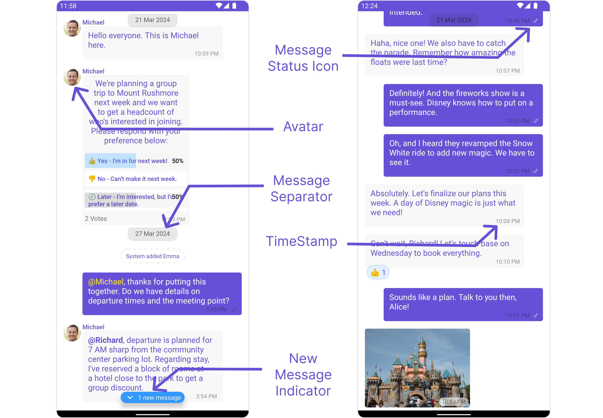

| Property                                                                                                 | Description                                                                                                                                                                                                                                     | Code                                                          |
| -------------------------------------------------------------------------------------------------------- | ----------------------------------------------------------------------------------------------------------------------------------------------------------------------------------------------------------------------------------------------- | ------------------------------------------------------------- |
| **User** <a data-tooltip-id="my-tooltip-html-prop"> <span class="material-icons red">report</span> </a>  | Used to pass user object of which header specific details will be shown                                                                                                                                                                         | `.setUser(user);`                                             |
| **Group** <a data-tooltip-id="my-tooltip-html-prop"> <span class="material-icons red">report</span> </a> | Used to pass group object of which header specific details will be shown                                                                                                                                                                        | `.setGroup(Group);`                                           |
| **Messages Alignment**                                                                                   | used to set the alignmet of messages in CometChatMessageList. It can be either **leftAligned** or **standard**                                                                                                                                  | `.setAlignment(UIKitConstants.MessageListAlignment);`         |
| **EmptyState Text**                                                                                      | used to set text which will be visible when no messages are available                                                                                                                                                                           | `.emptyStateText("Your_EMPTY_STATE_TEXT");`                   |
| **ErrorState Text**                                                                                      | used to set text which will be visible when error in messages retrieval                                                                                                                                                                         | `.errorStateText("Your_ERROR_STATE_TEXT");`                   |
| **Hide Error**                                                                                           | used to toggle visibility of error in MessageList                                                                                                                                                                                               | `.hideError(false);`                                          |
| **Disable Sound For Messages**                                                                           | used to enable/disable sound for incoming/outgoing messages , default false                                                                                                                                                                     | `.disableSoundForMessages(false);`                            |
| **CustomSound For Messages**                                                                             | used to set custom sound for outgoing message                                                                                                                                                                                                   | `.setCustomSoundForMessages(@RawRes resource);`               |
| **Set ReadIcon**                                                                                         | used to set custom read icon visible at read receipt                                                                                                                                                                                            | `.setReadIcon(@DrawableRes resource);`                        |
| **Set DeliverIcon**                                                                                      | used to set custom delivered icon visible at read receipt                                                                                                                                                                                       | `.setDeliverIcon(@DrawableRes resource);`                     |
| **Set SentIcon**                                                                                         | used to set custom sent icon visible at read receipt                                                                                                                                                                                            | `.setSentIcon(@DrawableRes resource);`                        |
| **Set SentIcon**                                                                                         | used to set custom sent icon visible at read receipt                                                                                                                                                                                            | `.setSentIcon(@DrawableRes resource);`                        |
| **Set WaitIcon**                                                                                         | used to set custom wait icon visible at read receipt                                                                                                                                                                                            | `.setWaitIconIcon(@DrawableRes resource);`                    |
| **Show Avatar**                                                                                          | used to toggle visibility for avatar                                                                                                                                                                                                            | `.showAvatar(false);`                                         |
| **Hide Timestamp**                                                                                       | used to toggle visibility for of timestamp                                                                                                                                                                                                      | `.hideTimestamp(false);`                                      |
| **Set TimeStampAlignment**                                                                               | used to set receipt's time stamp alignment .It can be either **top** or **bottom**                                                                                                                                                              | `.setTimeStampAlignment(UIKitConstants.TimeStampAlignment);`  |
| **Set newMessageIndicatorText**                                                                          | used to set new message indicator text                                                                                                                                                                                                          | `.newMessageIndicatorText("Your_CUSTOM_TEXT");`               |
| **Toggle scrollToBottomOnNewMessage**                                                                    | should scroll to bottom on new message? , by default false                                                                                                                                                                                      | `.scrollToBottomOnNewMessage(true);`                          |
| **Toggle scrollToBottomOnNewMessage**                                                                    | should scroll to bottom on new message? , by default false                                                                                                                                                                                      | `.scrollToBottomOnNewMessage(true);`                          |
| **Hide Receipt**                                                                                         | Used to control visibility of read receipts without disabling the functionality of marking messages as read and delivered.                                                                                                                      | `.hideReceipt(false);`                                        |
| **Disable Mentions**                                                                                     | Sets whether mentions in text should be disabled. Processes the text formatters If there are text formatters available and the disableMentions flag is set to true, it removes any formatters that are instances of CometChatMentionsFormatter. | `.setDisableMentions(true);`                                  |
| **Disable Reactions**                                                                                    | Sets A boolean value indicating whether to disable reactions.Pass `true` to disable reactions, `false` to enable them.                                                                                                                          | `.disableReactions(true);`                                    |
| **Add Reaction Icon**                                                                                    | Sets The resource ID to be set for the add reaction icon.This ID refers to the drawable resource representing the icon.                                                                                                                         | `.setAddReactionIcon(R.drawable.your_icon);`                  |
| **Hide Add Reactions Icon**                                                                              | Sets A boolean value indicating whether to hide the add reactions icon. Pass `true` to hide the icon, `false` to show it.                                                                                                                       | `.hideAddReactionsIcon(true);`                                |
| **Set Quick Reactions**                                                                                  | The list of quick reactions to be set.This list will replace the predefined set of reactions                                                                                                                                                    | `.setQuickReactions(Arrays.asList("👻","😈","🙀","🤡","❤️");` |

---

### Advance

For advanced-level customization, you can set custom views to the component. This lets you tailor each aspect of the component to fit your exact needs and application aesthetics. You can create and define your views, layouts, and UI elements and then incorporate those into the component.

#### SetTemplate

[CometChatMessageTemplate](./04-message-template.md) is a pre-defined structure for creating message views that can be used as a starting point or blueprint for creating message views often known as message bubbles. For more information, you can refer to [CometChatMessageTemplate](./04-message-template.md).

You can set message Templates to MessageList by using the following code snippet

<Tabs>

<TabItem value="java" label="Java">

```java
List<CometChatMessageTemplate> messageTemplateList = new ArrayList<>();
messageTemplateList.add(CometChatUIKit.getDataSource().getTextTemplate());
messageTemplateList.add(CometChatUIKit.getDataSource().getImageTemplate());
messageList.setTemplates(messageTemplateList);
```

</TabItem>

<TabItem value="kotlin" label="Kotlin">

```kotlin
val messageTemplateList = ArrayList<CometChatMessageTemplate>().apply {
    add(CometChatUIKit.dataSource.textTemplate)
    add(CometChatUIKit.dataSource.imageTemplate)
}
messageList.templates = messageTemplateList
```

</TabItem>

</Tabs>

#### Set DateSeparatorPattern

You can modify the date pattern of the message list date separator to your requirement using `setDateSeparatorPattern()`. This method accepts a function with a return type String. Inside the function, you can create your own pattern and return it as a String.

<Tabs>

<TabItem value="java" label="Java">
    ```Java
    messageList.setDateSeparatorPattern()
    ```
</TabItem>

<TabItem value="kotlin" label="Kotlin">

    ```kotlin
    messageList.setDateSeparatorPattern()
    ```

</TabItem>

</Tabs>

**Example**

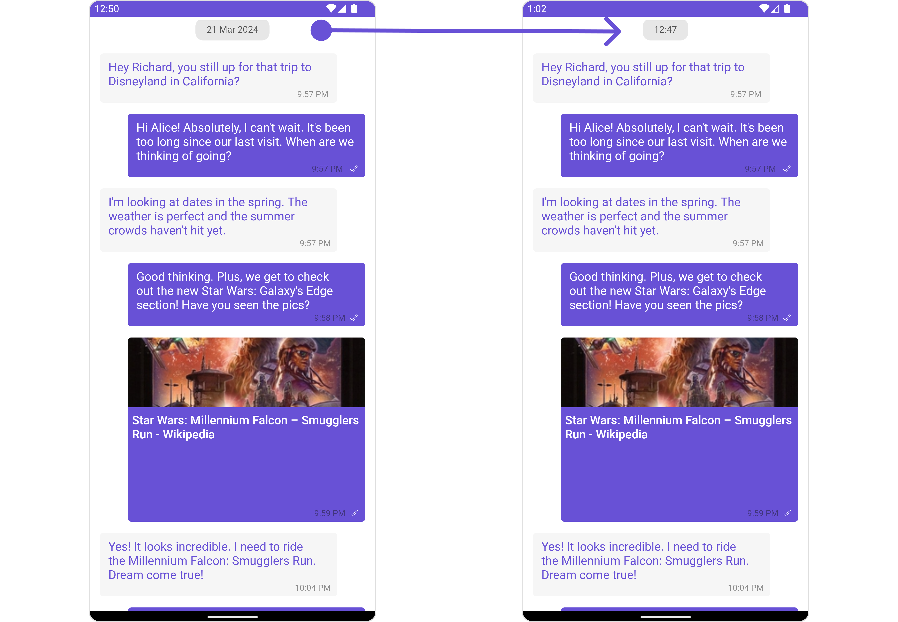

<Tabs>

<TabItem value="java" label="Java">
    ```Java
    messageList.setDateSeparatorPattern(baseMessage -> {
            SimpleDateFormat sdf = new SimpleDateFormat("hh:mm MM/yyyy");
            return sdf.format(new Date(baseMessage.getUpdatedAt()));
        });
    ```
</TabItem>

<TabItem value="kotlin" label="Kotlin">

```kotlin
    messageList.datePattern = { baseMessage ->
    val sdf = setDateSeparatorPattern("hh:mm MM/yyyy")
    sdf.format(Date(baseMessage.updatedAt))
}
```

</TabItem>
</Tabs>
---

#### SetDatePattern

You can modify the date pattern to your requirement using .setDatePattern. This method accepts a function with a return type String. Inside the function, you can create your own pattern and return it as a String.

<Tabs>

<TabItem value="java" label="Java">
    ```Java
    messageList.setDatePattern()
    ```
</TabItem>

<TabItem value="kotlin" label="Kotlin">

    ```kotlin
    messageList.setDatePattern()
    ```

</TabItem>

</Tabs>

**Example**

<!-- 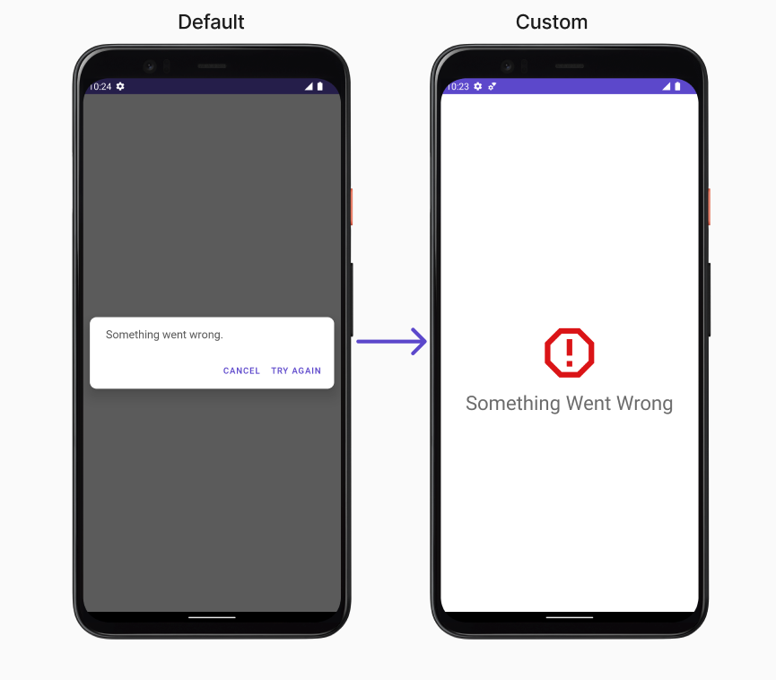 -->

<Tabs>

<TabItem value="java" label="Java">
    ```Java
    messageList.setDatePattern(baseMessage -> {
            SimpleDateFormat sdf = new SimpleDateFormat("hh:mm");
            return sdf.format(new Date(baseMessage.getUpdatedAt()));
        });
    ```
</TabItem>

<TabItem value="kotlin" label="Kotlin">

```kotlin
    messageList.datePattern = { baseMessage ->
    val sdf = SimpleDateFormat("hh:mm")
    sdf.format(Date(baseMessage.updatedAt))
}
```

</TabItem>
</Tabs>

---

#### SetErrorStateView

You can set a custom `ErrorStateView` using `setEmptyStateView` to match the error view of your app.
<Tabs>

<TabItem value="java" label="Java">
    ```Java
    messageList.setErrorStateView();
    ```
</TabItem>

<TabItem value="kotlin" label="Kotlin">

    ```kotlin
    messageList.setErrorStateView();
    ```

</TabItem>

</Tabs>

**Example**
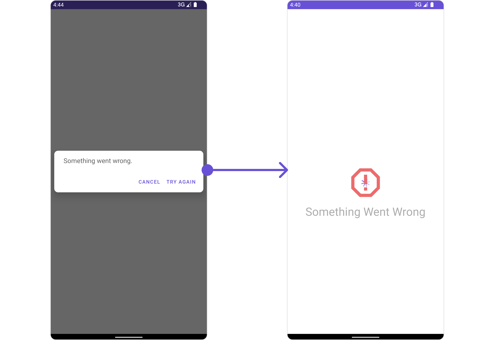

We have added an error view to `error_state_view_layout.xml`. You can choose any view you prefer. This view should be inflated and passed to the `setErrorStateView()` method.

```xml title="error_state_view_layout.xml"
   <?xml version="1.0" encoding="utf-8"?>

<RelativeLayout xmlns:android="http://schemas.android.com/apk/res/android"
   android:layout_width="match_parent"
   android:layout_height="match_parent">

   <ImageView
       android:id="@+id/img_error"
       android:layout_width="100dp"
       android:layout_height="100dp"
       android:src="@drawable/ic_error"
       android:layout_centerInParent="true"
       />
   <TextView
       android:layout_width="wrap_content"
       android:layout_height="wrap_content"
       android:text="Something Went Wrong"
       android:textSize="30sp"
       android:layout_below="@+id/img_error"
       android:layout_marginTop="50dp"
       android:layout_centerHorizontal="true"
       />

</RelativeLayout>
```

<Tabs>

<TabItem value="java" label="Java">
    ```java title="YourActivity.java"
    messageList.setErrorStateView(R.layout.error_state_view_layout);
    ```
</TabItem>
<TabItem value="kotlin" label="Kotlin">

    ```kotlin
    messageList.setErrorStateView(R.layout.error_state_view_layout);
    ```

</TabItem>

</Tabs>

#### SetEmptyStateView

The `setEmptyStateView()` function provides the ability to set a custom empty state view in your app. An empty state view is displayed when there are no messages for a particular user.

<Tabs>

<TabItem value="java" label="Java">
```Java
messageList.setEmptyStateView();
```

</TabItem>

<TabItem value="kotlin" label="Kotlin">

    ```kotlin
    messageList.setEmptyStateView()
    ```

</TabItem>

</Tabs>

**Example**
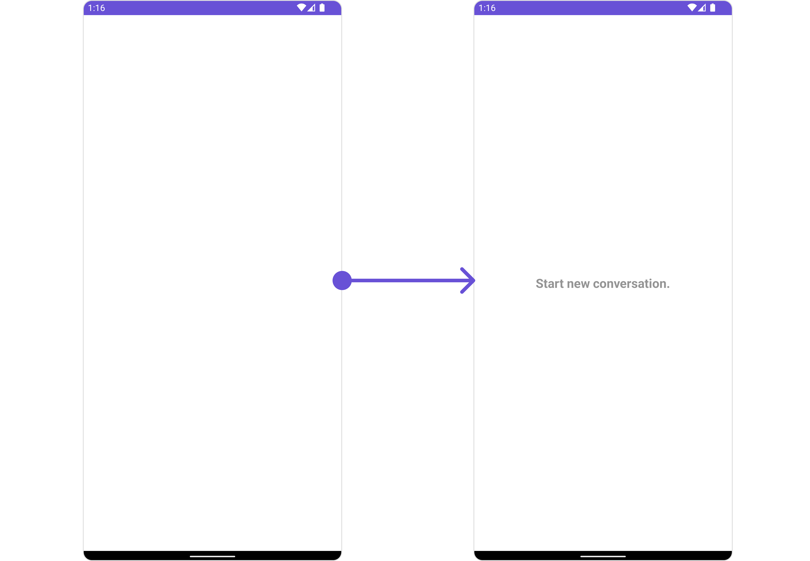

You have to create a custom layout named `empty_view_layout.xml`, you can set it as the empty state view by passing it as a parameter to the setEmptyStateView() function.

```xml title="empty_view_layout.xml"
<?xml version="1.0" encoding="utf-8"?>
<RelativeLayout xmlns:android="http://schemas.android.com/apk/res/android"
    android:layout_width="match_parent"
    android:layout_height="match_parent"
    android:layout_gravity="center_vertical"
    >

    <TextView
        android:layout_width="wrap_content"
        android:layout_height="wrap_content"
        android:text="Start new conversation."
        android:layout_centerInParent="true"
        android:textSize="20sp"
        android:textStyle="bold"
        android:textColor="@color/light_grey"
        />

</RelativeLayout>
```

<Tabs>

<TabItem value="java" label="Java">
```java
messageList.setEmptyStateView(R.layout.empty_view_layout);
```
</TabItem>

<TabItem value="Kotlin" label="Kotlin">

```kotlin
messageList.setEmptyStateView(R.layout.empty_view_layout)
```

</TabItem>

</Tabs>

#### SetLoadingStateView

The `setLoadingStateView` function allows you to set a custom loading view in your app. This feature enables you to maintain a consistent look and feel throughout your application,

<Tabs>

<TabItem value="java" label="Java">
```Java
messageList.setLoadingStateView();
```

</TabItem>

<TabItem value="kotlin" label="Kotlin">

    ```kotlin
    messageList.setLoadingStateView()
    ```

</TabItem>

</Tabs>

**Example**
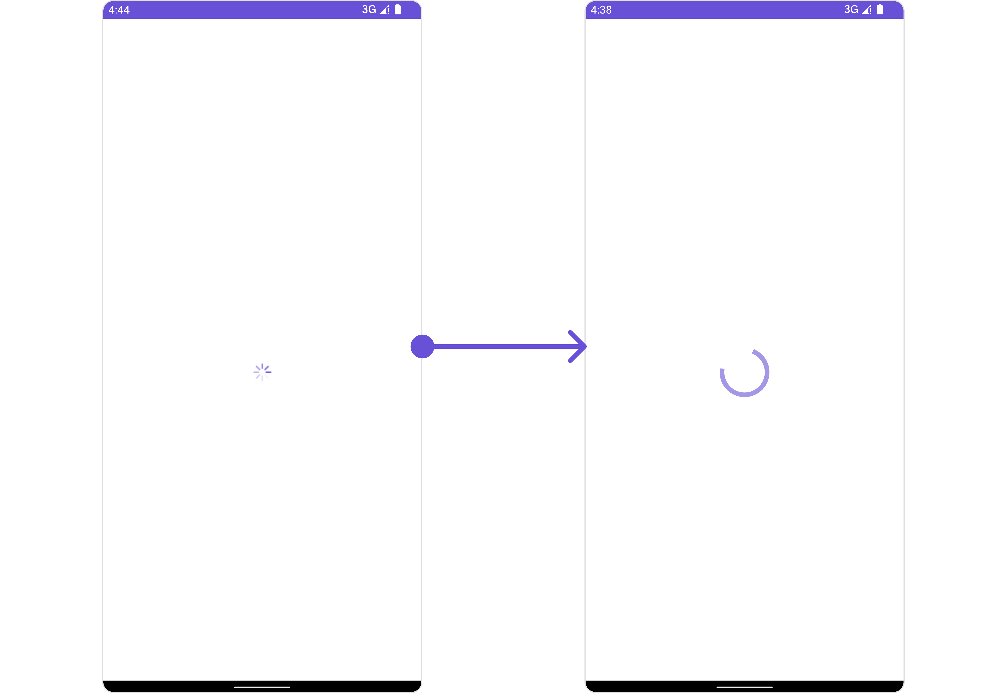

We have added a `ContentLoadingProgressBar` to `loading_view_layout.xml`. You can choose any view you prefer. This view should be inflated and passed to the `setLoadingStateView()` method.

```xml title="loading_view_layout.xml"
    <?xml version="1.0" encoding="utf-8"?>
    <FrameLayout xmlns:android="http://schemas.android.com/apk/res/android"
        android:layout_width="match_parent"
        android:layout_height="match_parent"
        android:layout_gravity="center_vertical"
        >
        <androidx.core.widget.ContentLoadingProgressBar
            android:layout_width="wrap_content"
            android:layout_height="wrap_content"
            style="?android:attr/progressBarStyleLarge"
            android:layout_gravity="center_horizontal"
            />
    </FrameLayout>
```

<Tabs>

<TabItem value="java" label="Java">
```java title="YourActivity.java"
messageList.setLoadingStateView(R.layout.loading_view_layout);
```
</TabItem>

<TabItem value="kotlin" label="Kotlin">

    ```kotlin
    messageList.setLoadingStateView(R.layout.loading_view_layout)

    ```

</TabItem>

</Tabs>

#### SetTextFormatters

Assigns the list of text formatters. If the provided list is not null, it sets the list. Otherwise, it assigns the default text formatters retrieved from the data source. To configure the existing Mentions look and feel check out [MentionsFormatter Guide](/ui-kit/android/mentions-formatter-guide)

**Example**

<Tabs>

<TabItem value="java" label="Java">

    ```Java

// Initialize CometChatMentionsFormatter
CometChatMentionsFormatter mentionFormatter = new CometChatMentionsFormatter(context);

    //set style to customize bubble mention text
    mentionFormatter.setRightBubbleMentionTextStyle(new MentionTextStyle()
                .setLoggedInUserTextStyle(Typeface.defaultFromStyle(Typeface.BOLD))
                .setTextColor(Color.parseColor("#000000")));

    mentionFormatter.setLeftBubbleMentionTextStyle(new MentionTextStyle()
                .setLoggedInUserTextStyle(Typeface.defaultFromStyle(Typeface.BOLD))
                .setTextColor(Color.parseColor("#000000")));

// This can be passed as an array of formatter in CometChatMessageList by using setTextFormatters method.
List<CometChatTextFormatter> textFormatters = new ArrayList<>();
textFormatters.add(mentionFormatter);
messageList.setTextFormatters(textFormatters);

````

</TabItem>

<TabItem value="kotlin" label="Kotlin">

    ```kotlin

// Initialize CometChatMentionsFormatter
val mentionFormatter = CometChatMentionsFormatter(context)

    //set style to customize bubble mention text
     val mentionFormatter = CometChatMentionsFormatter(context)
        mentionFormatter.rightBubbleMentionTextStyle = MentionTextStyle()
            .setLoggedInUserTextStyle(Typeface.defaultFromStyle(Typeface.BOLD))
            .setTextColor(Color.parseColor("#000000"))

        mentionFormatter.leftBubbleMentionTextStyle = MentionTextStyle()
            .setLoggedInUserTextStyle(Typeface.defaultFromStyle(Typeface.BOLD))
            .setTextColor(Color.parseColor("#000000"))

// This can be passed as an array of formatter in CometChatMessageList by using setTextFormatters method.
val textFormatters: MutableList<CometChatTextFormatter> = ArrayList()
textFormatters.add(mentionFormatter)
messageList.setTextFormatters(textFormatters)

    ```

</TabItem>

</Tabs>

## Configuration

[Configurations](/ui-kit/android/components-overview#configurations) offer the ability to customize the properties of each component within a Composite Component.

### MessageInformation

From the MessageList, you can navigate to the [MesssageInformation](/ui-kit/android/message-information) component as shown in the image.

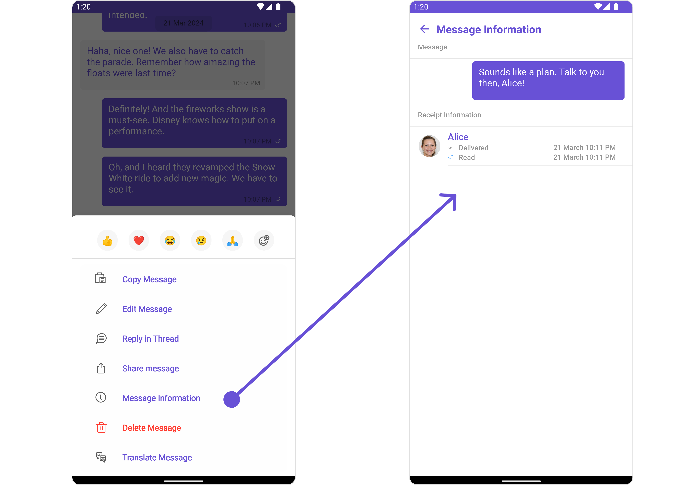

If you wish to modify the properties of the [MesssageInformation](/ui-kit/android/message-information) Component, you can use the `MessageInformationConfiguration` object.

<Tabs>

<TabItem value="java" label="Java">

```java
 MessageInformationConfiguration configuration = new MessageInformationConfiguration();
 messageList.setMessageInformationConfiguration(configuration);
````

</TabItem>

<TabItem value="kotlin" label="Kotlin">

```kotlin
val configuration = MessageInformationConfiguration()
messageList.messageInformationConfiguration = configuration
```

</TabItem>

</Tabs>

The `MessageInformationConfiguration` indeed provides access to all the [Action](/ui-kit/android/message-information#style), [Filters](/ui-kit/android/message-information#filters), [Styles](#style), [Functionality](/ui-kit/android/message-information#functionality), and [Advanced](/ui-kit/android/message-information) properties of the [MesssageInformation](/ui-kit/android/message-information) component.

Please note that the properties marked with the <a data-tooltip-id="my-tooltip-html-prop"><span class="material-icons red">report</span></a> symbol are not accessible within the Configuration Object.

**Example**
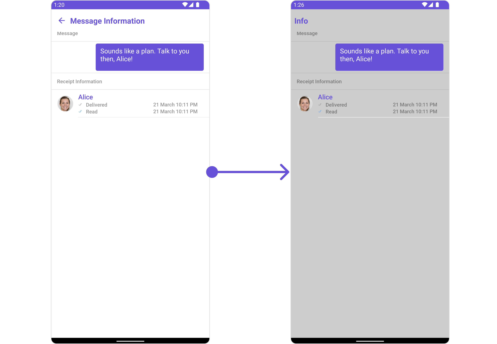

In this example, we are disabling the back button and styling a few properties of the [MesssageInformation](/ui-kit/android/message-information) component using `MessageInformationConfiguration`.

```java
MessageInformationStyle messageInformationStyle = new MessageInformationStyle();
messageInformationStyle.setBackground(Color.LTGRAY);

MessageInformationConfiguration messageInformationConfiguration = new MessageInformationConfiguration();
messageInformationConfiguration.setShowBackButton(false);
messageInformationConfiguration.setTitle("Info");
messageInformationConfiguration.setStyle(messageInformationStyle);

messageList.setMessageInformationConfiguration(messageInformationConfiguration);
```

In the above code, the back button is disabled, the title is set to "Info", and the background color is set to light gray. Finally, this configuration is applied to the message list.

<Tooltip
  id="my-tooltip-html-prop"
  html="Not available in MessageListConfiguration"
/>
