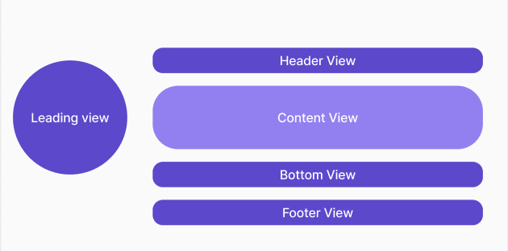
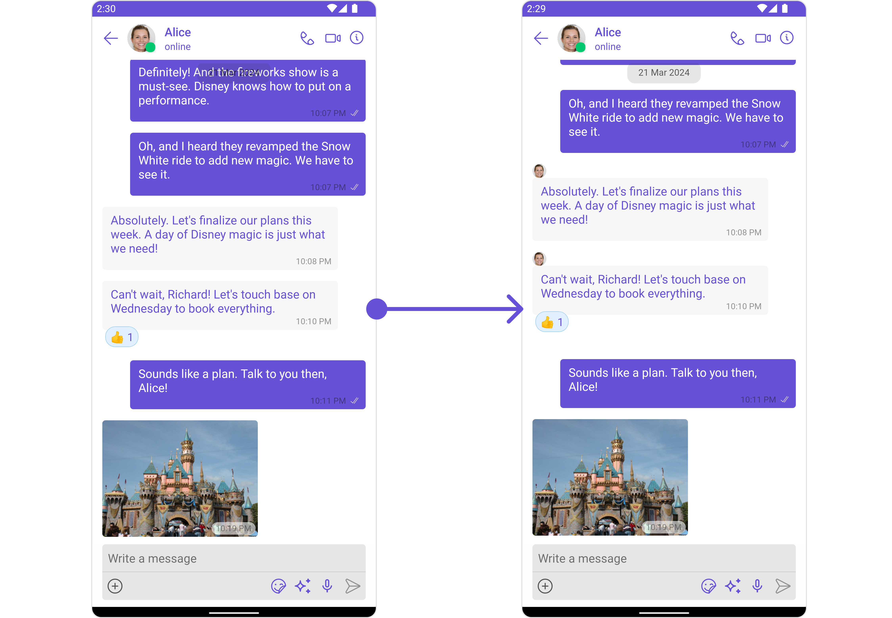
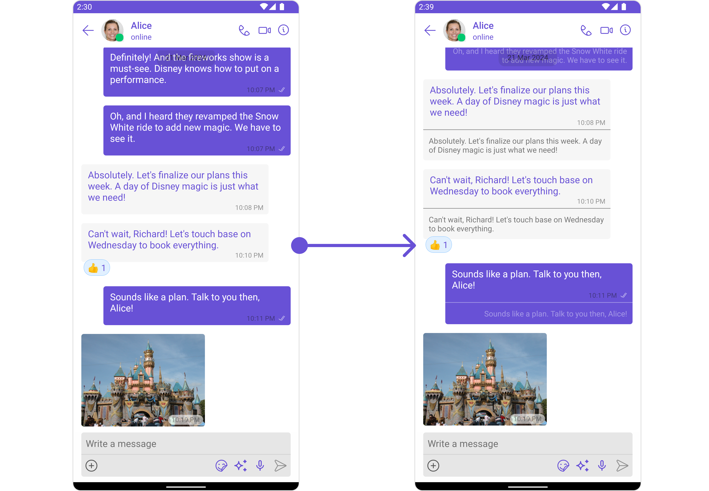
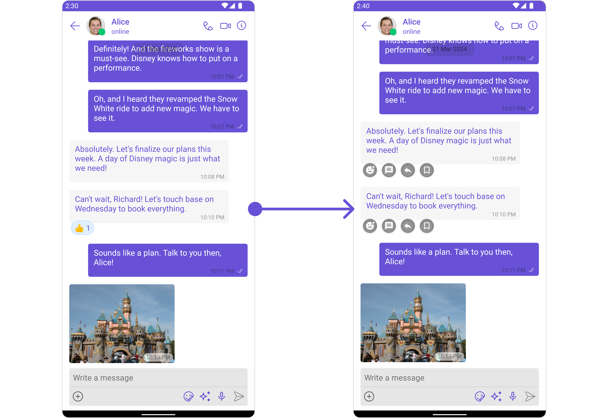
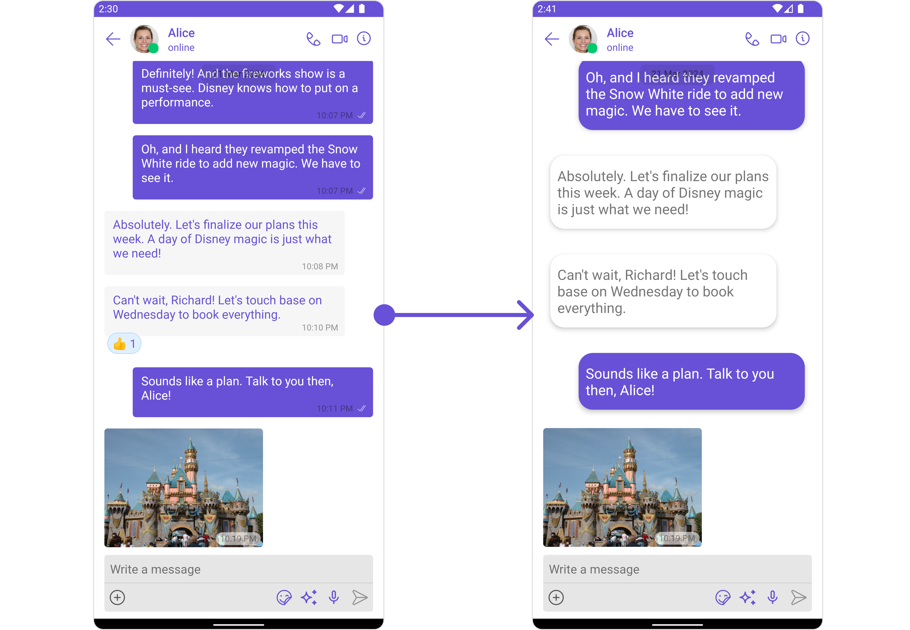
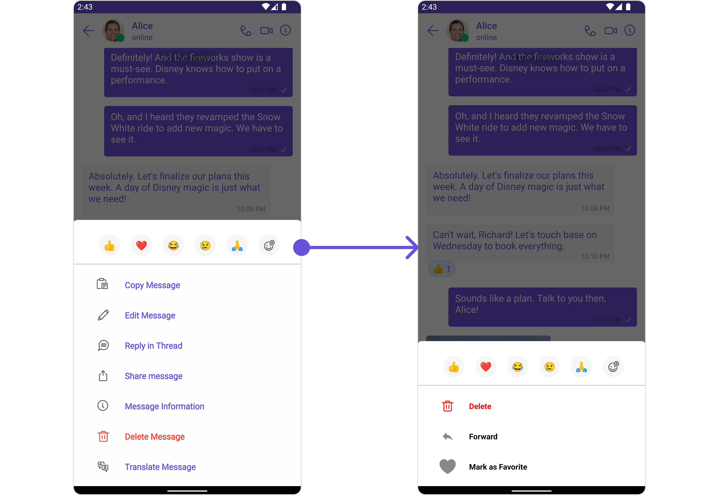
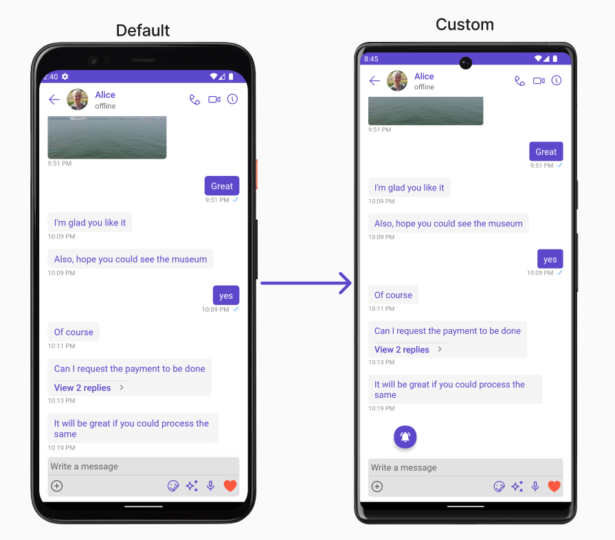

import Tabs from '@theme/Tabs';
import TabItem from '@theme/TabItem';

## Overview

A MessageTemplate provides you with the capability to define and customize both the structure and the behavior of the [MessageBubble](/ui-kit/android/message-bubble). It acts as a schema or design blueprint for the creation of a variety of [MessageBubble](/ui-kit/android/message-bubble) components, allowing you to manage the appearance and interactions of [MessageBubble](/ui-kit/android/message-bubble) within your application effectively and consistently.

### Structure



The MessageBubble structure can typically be broken down into the following views:

1. **Leading view**: This is where the sender's avatar is displayed. It's typically on the left of the MessageBubble for messages from others and on the right for messages from the current user.

2. **Header view**: This displays the sender's name and is especially useful in group chats where multiple users are sending messages.

3. **Content view**: This is the core of the MessageBubble where the message content (text, images, videos, etc.) is displayed.

4. **Bottom view**: This view can be used to extend the MessageBubble with additional elements, such as link previews or a 'load more' button for long messages. It's typically placed beneath the Content view.

5. **Footer view**: This is where the timestamp of the message and its delivery or read status are displayed. It's located at the bottom of the MessageBubble.

### Properties

MessageTemplate provides you with methods that allow you to alter various properties of the MessageBubble. These properties include aspects such as the `type` and `category` of a message, the appearance and behavior of the header, content, and footer sections of the message bubble,

1. **Type**

   Using `setType()` you can set the type of CometChatMessage, This will map your MessageTemplate to the corresponding CometChatMessage. You can set the MessageTemplate Type using the following code snippet.

   ```java
   messageTemplate.setType(UIKitConstants.MessageType.CUSTOM);
   ```

2. **Category**

   Using `.setCategory()` you can set the category of a MessageTemplate. This will create a MessageTemplate with the specified category and link it with a CometChatMessage of the same category.

   Please refer to our guide on [Message Categories](/sdk/android/message-structure-and-hierarchy) for a deeper understanding of message categories.

   ```java
   messageTemplate.setCategory(UIKitConstants.MessageCategory.CUSTOM);
   ```

3. **Header View**

   The .`setHeaderView()` method allows you to assign a custom header view to the MessageBubble. By default, it is configured to display the sender's name.

   ```java
   messageTemplate.setHeaderView(Function3<Context, BaseMessage, UIKitConstants.MessageBubbleAlignment, View>);
   ```

4. **Content View**

   The `.setContentView()` method allows you to assign a custom content view to the MessageBubble. By default, it displays the [Text Bubble](/ui-kit/android/text-bubble), [Image Bubble](/ui-kit/android/image-bubble), [File Bubble](/ui-kit/android/file-bubble), [Audio Bubble](/ui-kit/android/audio-bubble), or [Video Bubble](/ui-kit/android/video-bubble), depending on the message type.

   ```java
   messageTemplate.setContentView(Function3<Context, BaseMessage, UIKitConstants.MessageBubbleAlignment, View>);
   ```

5. **Footer View**

   The `.setFooterView()` method allows you to assign a custom Footer view to the MessageBubble. By default, it displays the receipt and timestamp.

   ```java
   messageTemplate.setFooterView(Function3<Context, BaseMessage, UIKitConstants.MessageBubbleAlignment, View>);
   ```

6. **Bottom View**

   The `.setBottomView()` method allows you to assign a custom Bottom view to the MessageBubble.By defuault is has buttons such as link previews or a 'load more' button for long messages.

   ```java
   messageTemplate.setBottomView(Function3<Context, BaseMessage, UIKitConstants.MessageBubbleAlignment, View>);
   ```

7. **Bubble View**

   The `.setBubbleView()` method allows you to assign a custom Bubble view to the MessageBubble. By default, headerView, contentView, and footerView together form a message bubble.

   ```java
   messageTemplate.setBubbleView(Function3<Context, BaseMessage, UIKitConstants.MessageBubbleAlignment, View>);
   ```

8. **Options**

   The `.setOptions()` lets you set the list of actions that a user can perform on a message. This includes actions like reacting to, editing, or deleting a message.

   ```java
   messageTemplate.setOptions(Function3<Context, BaseMessage, UIKitConstants.MessageBubbleAlignment, View>);
   ```

## Customization

Let's dive into how you can use the [properties](#properties) of MessageTemplate to customize an existing template or add a new one to the [MessageList](/ui-kit/android/message-list) component.

The First step is to fetch the list of existing templates when you want to modify or add to them. This can be done using the getAllMessageTemplates() method from the DataSource of the CometChatUIKit class.

```Java
List<CometChatMessageTemplate> messageTemplates = CometChatUIKit.getDataSource().getAllMessageTemplates();
```

### Existing Templates

You will need to first get the MessageTemplate object for the type of message you want to customize. You will be customizing the TextMessage Bubble here. The code snippet to get the Text MessageTemplate is as follows.

<Tabs>

<TabItem value="java" label="Java">

```java
List<CometChatMessageTemplate> messageTemplates = CometChatUIKit.getDataSource().getAllMessageTemplates();

for(CometChatMessageTemplate template : messageTemplates){
    if(template.getType().equals(UIKitConstants.MessageType.TEXT)){
        // Code to customize text message template
    }
}
```

</TabItem>

<TabItem value="kotlin" label="Kotlin">

```kotlin
val messageTemplates: List<CometChatMessageTemplate> = CometChatUIKit.dataSource.messageTemplates

for (template in messageTemplates) {
    if (template.type == UIKitConstants.MessageType.TEXT) {
        // Code to customize text message template
    }
}
```

</TabItem>

</Tabs>

You will be using [Messages](/ui-kit/android/messages#overview) Component for example here so to apply Template to Messages you will need to use `MessageListConfiguration`. This is because the [Set Templates](/ui-kit/android/message-list#settemplate) function, which is used to apply the custom templates, belongs to the [MessageList](./03-message-list.md) component.

You can apply MessageTemplates to Messages Component using the following code snippet.

<Tabs>

<TabItem value="java" label="Java">

```java
MessageListConfiguration  configuration = new MessageListConfiguration();
List<CometChatMessageTemplate> messageTemplates = CometChatUIKit.getDataSource(getMessageTemplates()

for(CometChatMessageTemplate template : messageTemplates)
    Log.e(TAG, "messageTemplate: Type = "+template.getType());
    if(template.getType().equals(UIKitConstants.MessageType.TEXT))
        // Code to customize text message template
    }
}

configuration.setTemplates(messageTemplates);

cometChatMessages.setMessageListConfiguration(configuration);
```

</TabItem>

<TabItem value="kotlin" label="Kotlin">

```kotlin
val configuration = MessageListConfiguration.Builder(context).build()

val messageTemplates = CometChatUI.getAllMessageTemplates()

for (template in messageTemplates) {
    Log.e(TAG, "messageTemplate: Type = ${template.type}")
    if (template.type == UIKitConstants.MessageType.TEXT) {
        // Code to customize text message template
    }
}

configuration.setTemplates(messageTemplates)

cometChatMessages.setMessageListConfiguration(configuration)
```

</TabItem>

</Tabs>

#### Header view

The `.setHeaderView()` method of MessageTemplate allows you to add custom views to the header of your message bubbles. In the example below, we will add a custom layout `custom_txt_header_layout.xml` to the header view of every text message in the MessageList.



```xml title="custom_txt_header_layout"
<?xml version="1.0" encoding="utf-8"?>
<LinearLayout xmlns:android="http://schemas.android.com/apk/res/android"
    android:layout_width="match_parent"
    android:layout_height="match_parent"
    >
    <com.cometchat.chatuikit.shared.views.CometChatAvatar.CometChatAvatar
        android:id="@+id/avatar"
        android:layout_width="20dp"
        android:layout_height="20dp"
        />
</LinearLayout>
```

<Tabs>

<TabItem value="java" label="Java">

```java
template.setHeaderView(new MessagesViewHolderListener() {
    @Override
    public View createView(Context context, CometChatMessageBubble cometChatMessageBubble, UIKitConstants.MessageBubbleAlignment messageBubbleAlignment) {
        return getLayoutInflater().inflate(R.layout.custom_txt_header_layout, null);
    }
    @Override
    public void bindView(Context context, View view, BaseMessage baseMessage, UIKitConstants.MessageBubbleAlignment messageBubbleAlignment, RecyclerView.ViewHolder viewHolder, List<BaseMessage> list, int i) {
        CometChatAvatar avatar = view.findViewById(R.id.avatar);
        boolean isMyMsg = CometChatUIKit.getLoggedInUser().getUid().equals(baseMessage.getSender().getUid());
        if(!isMyMsg)
            avatar.setImage(baseMessage.getSender().getAvatar());
    }
});
```

</TabItem>

<TabItem value="kotlin" label="Kotlin">

```kotlin
template.setHeaderView(object : MessagesViewHolderListener {
    override fun createView(
        context: Context,
        cometChatMessageBubble: CometChatMessageBubble,
        messageBubbleAlignment: UIKitConstants.MessageBubbleAlignment
    ): View {
        return layoutInflater.inflate(R.layout.custom_txt_header_layout, null)
    }

    override fun bindView(
        context: Context,
        view: View,
        baseMessage: BaseMessage,
        messageBubbleAlignment: UIKitConstants.MessageBubbleAlignment,
        viewHolder: RecyclerView.ViewHolder,
        list: List<BaseMessage>,
        i: Int
    ) {
        val avatar = view.findViewById<CometChatAvatar>(R.id.avatar)
        val isMyMsg = CometChatUIKit.loggedInUser.uid.equals(baseMessage.sender.uid)
        if (!isMyMsg)
            avatar.setImage(baseMessage.sender.avatar)
    }
})
```

</TabItem>

</Tabs>

In this code, The createView() method inflates the 'custom_txt_header_layout.xml' as the header view for every message. The bindView() method allows you to bind your custom view, which will be called every time a ViewHolder for that message type is bound.

#### Content view

The `.setContentView()` method of MessageTemplate allows you to add a custom view to the content of your message bubbles. In the example below, we will add a custom layout `custom_message_content_layout.xml` to the content view of every text message in the MessageList.


<Tabs>

<TabItem value="java" label="Java">

```java
template.setContentView(new MessagesViewHolderListener() {
    @Override
    public View createView(Context context, CometChatMessageBubble cometChatMessageBubble, UIKitConstants.MessageBubbleAlignment messageBubbleAlignment) {
        return getLayoutInflater().inflate(R.layout.custom_message_content_layout, null);
    }
    @Override
    public void bindView(Context context, View view, BaseMessage baseMessage, UIKitConstants.MessageBubbleAlignment messageBubbleAlignment, RecyclerView.ViewHolder viewHolder, List<BaseMessage> list, int i) {
        TextView txtMessage = view.findViewById(R.id.txt_msg);
        if(baseMessage instanceof TextMessage)
            txtMessage.setText(((TextMessage) baseMessage).getText());
    }
});
```

</TabItem>

<TabItem value="kotlin" label="Kotlin">

```kotlin
template.setContentView(object : MessagesViewHolderListener {
    override fun createView(
        context: Context,
        cometChatMessageBubble: CometChatMessageBubble,
        messageBubbleAlignment: UIKitConstants.MessageBubbleAlignment
    ): View {
        return LayoutInflater.from(context).inflate(R.layout.custom_message_content_layout, null)
    }

    override fun bindView(
        context: Context,
        view: View,
        baseMessage: BaseMessage,
        messageBubbleAlignment: UIKitConstants.MessageBubbleAlignment,
        viewHolder: RecyclerView.ViewHolder,
        list: List<BaseMessage>,
        i: Int
    ) {
        val txtMessage = view.findViewById<TextView>(R.id.txt_msg)
        if (baseMessage is TextMessage) {
            txtMessage.text = baseMessage.text
        }
    }
})
```

</TabItem>

</Tabs>

In this code, The createView() method inflates the 'custom_message_content_layout.xml' as the content view for every message. The bindView() method allows you to bind your custom view, which will be called every time a ViewHolder for that message type is bound.

#### Bottom View

The `.setBottomView()` method of MessageTemplate allows you to add a custom button view to your message bubbles. In the example below, we will add a custom layout `custom_message_bottom_layout.xml` to the bottom view of every text message in the MessageList.



```xml title="custom_message_bottom_layout.xml"
<?xml version="1.0" encoding="utf-8"?>
<LinearLayout xmlns:android="http://schemas.android.com/apk/res/android"
    android:layout_width="match_parent"
    android:layout_height="match_parent"
    android:orientation="vertical"
    >
    <View
        android:id="@+id/view_divider"
        android:layout_width="match_parent"
        android:layout_height="1dp"
        android:background="@color/grey"
        />

    <TextView
        android:id="@+id/translate_message"
        android:text="Translated Messages"
        android:layout_width="match_parent"
        android:layout_margin="10dp"
        android:layout_height="wrap_content"/>

</LinearLayout>
```

<Tabs>

<TabItem value="java" label="Java">

```java
template.setBottomView(new MessagesViewHolderListener() {
    @Override
    public View createView(Context context, CometChatMessageBubble cometChatMessageBubble, UIKitConstants.MessageBubbleAlignment messageBubbleAlignment) {
        return getLayoutInflater().inflate(R.layout.custom_message_bottom_layout, null);
    }
    @Override
    public void bindView(Context context, View view, BaseMessage baseMessage, UIKitConstants.MessageBubbleAlignment messageBubbleAlignment, RecyclerView.ViewHolder viewHolder, List<BaseMessage> list, int i) {
        TextView tvMessage = view.findViewById(R.id.translate_message);
        View divider = view.findViewById(R.id.view_divider);
        boolean isMyMsg = CometChatUIKit.getLoggedInUser().getUid().equals(baseMessage.getSender().getUid());
        if(baseMessage instanceof TextMessage){
            tvMessage.setText(((TextMessage) baseMessage).getText());
            if(isMyMsg){
                tvMessage.setGravity(Gravity.END);
                divider.setBackgroundColor(Color.parseColor("#66FFFFFF"));
                tvMessage.setTextColor(Color.parseColor("#66FFFFFF"));
            }
        }
    }
});
```

</TabItem>

<TabItem value="kotlin" label="Kotlin">

```kotlin
template.setBottomView(object : MessagesViewHolderListener {
    override fun createView(
        context: Context,
        cometChatMessageBubble: CometChatMessageBubble,
        messageBubbleAlignment: UIKitConstants.MessageBubbleAlignment
    ): View {
        return LayoutInflater.from(context).inflate(R.layout.custom_message_bottom_layout, null)
    }

    override fun bindView(
        context: Context,
        view: View,
        baseMessage: BaseMessage,
        messageBubbleAlignment: UIKitConstants.MessageBubbleAlignment,
        viewHolder: RecyclerView.ViewHolder,
        list: List<BaseMessage>,
        i: Int
    ) {
        val tvMessage = view.findViewById<TextView>(R.id.translate_message)
        val divider = view.findViewById<View>(R.id.view_divider)
        val isMyMsg = CometChatUIKit.loggedInUser.uid == baseMessage.sender.uid
        if (baseMessage is TextMessage) {
            tvMessage.text = baseMessage.text
            if (isMyMsg) {
                tvMessage.gravity = Gravity.END
                divider.setBackgroundColor(Color.parseColor("#66FFFFFF"))
                tvMessage.setTextColor(Color.parseColor("#66FFFFFF"))
            }
        }
    }
})
```

</TabItem>

</Tabs>

In this code, The createView() method inflates the 'custom_message_bottom_layout.xml' as the bottom view for every message. The bindView() method allows you to bind your custom view, which will be called every time a ViewHolder for that message type is bound.

#### Footer View

The `.setFooterView()` method of MessageTemplate allows you to add a footer view to your message bubbles. In the example below, we will add a custom layout custom_menu_layout.xml to the bottom view of every text message in the MessageList.



```xml title = "custom_menu_layout.xml"
<?xml version="1.0" encoding="utf-8"?>
<LinearLayout xmlns:android="http://schemas.android.com/apk/res/android"
    android:layout_width="match_parent"
    android:layout_height="match_parent"
    xmlns:app="http://schemas.android.com/apk/res-auto">

    <androidx.cardview.widget.CardView
        android:id="@+id/card_reaction"
        android:layout_width="wrap_content"
        android:layout_height="wrap_content"
        app:cardBackgroundColor="@color/grey"
        app:cardCornerRadius="20dp"
        android:layout_margin="5dp"
        >

        <ImageView
            android:layout_width="30dp"
            android:layout_height="30dp"
            android:src="@drawable/ic_add_reaction"
            android:padding="5dp"
            />

    </androidx.cardview.widget.CardView>

    <androidx.cardview.widget.CardView
        android:id="@+id/card_reply"
        android:layout_width="wrap_content"
        android:layout_height="wrap_content"
        app:cardBackgroundColor="@color/grey"
        app:cardCornerRadius="20dp"
        android:layout_margin="5dp"
        >

        <ImageView
            android:layout_width="30dp"
            android:layout_height="30dp"
            android:src="@drawable/ic_message"
            android:padding="5dp"
            />

    </androidx.cardview.widget.CardView>

    <androidx.cardview.widget.CardView
        android:id="@+id/card_forward"
        android:layout_width="wrap_content"
        android:layout_height="wrap_content"
        app:cardBackgroundColor="@color/grey"
        app:cardCornerRadius="20dp"
        android:layout_margin="5dp"
        >

        <ImageView
            android:layout_width="30dp"
            android:layout_height="30dp"
            android:src="@drawable/ic_reply"
            android:padding="5dp"
            />

    </androidx.cardview.widget.CardView>

    <androidx.cardview.widget.CardView
        android:id="@+id/card_save"
        android:layout_width="wrap_content"
        android:layout_height="wrap_content"
        app:cardBackgroundColor="@color/grey"
        app:cardCornerRadius="20dp"
        android:layout_margin="5dp"
        >

        <ImageView
            android:layout_width="30dp"
            android:layout_height="30dp"
            android:src="@drawable/ic_bookmark"
            android:padding="5dp"
            />

    </androidx.cardview.widget.CardView>
</LinearLayout>
```

```java
template.setFooterView(new MessagesViewHolderListener() {
                    @Override
                    public View createView(Context context, CometChatMessageBubble cometChatMessageBubble, UIKitConstants.MessageBubbleAlignment messageBubbleAlignment) {
                        return getLayoutInflater().inflate(R.layout.custom_menu_layout, null);
                    }

                    @Override
                    public void bindView(Context context, View view, BaseMessage baseMessage, UIKitConstants.MessageBubbleAlignment messageBubbleAlignment, RecyclerView.ViewHolder viewHolder, List<BaseMessage> list, int i) {
                        boolean isMyMsg = CometChatUIKit.getLoggedInUser().getUid().equals(baseMessage.getSender().getUid());

                        if(isMyMsg)
                            view.setVisibility(View.GONE);
                    }
});
```

In this code, The createView() method inflates the 'custom_menu_layout.xml' as the footer view for every message. The bindView() method allows you to bind your custom view, which will be called every time a ViewHolder for that message type is bound.

#### Bubble View

The` .setBubbleView()` method of MessageTemplate allows you to add a bubble view to your message bubbles. In the example below, we will add a custom layout custom_message_content_layout.xml to the bubble view of every text message in the MessageList.



```xml title ="custom_message_content_layout.xml"
<?xml version="1.0" encoding="utf-8"?>
<RelativeLayout xmlns:android="http://schemas.android.com/apk/res/android"
    android:layout_width="wrap_content"
    android:layout_height="wrap_content"

    xmlns:app="http://schemas.android.com/apk/res-auto">

    <androidx.cardview.widget.CardView
        android:id="@+id/card_view"
        android:layout_width="wrap_content"
        android:layout_height="wrap_content"
        app:cardCornerRadius="20dp"
        android:layout_margin="10dp"
        app:cardElevation="5dp"
        >

        <TextView
            android:id="@+id/txt_msg"
            android:layout_width="wrap_content"
            android:layout_height="wrap_content"
            android:padding="15dp"
            android:paddingEnd="10dp"
            android:paddingStart="10dp"
            android:textSize="20sp"
            android:text="Message"
            />

    </androidx.cardview.widget.CardView>

</RelativeLayout>
```

```java
template.setBubbleView(new MessagesViewHolderListener() {
                    @Override
                    public View createView(Context context, CometChatMessageBubble cometChatMessageBubble, UIKitConstants.MessageBubbleAlignment messageBubbleAlignment) {
                        return getLayoutInflater().inflate(R.layout.custom_message_content_layout, null);
                    }

                    @Override
                    public void bindView(Context context, View view, BaseMessage baseMessage, UIKitConstants.MessageBubbleAlignment messageBubbleAlignment, RecyclerView.ViewHolder viewHolder, List<BaseMessage> list, int i) {
                        TextView textView = view.findViewById(R.id.txt_msg);
                        CardView cardView = view.findViewById(R.id.card_view);
                        boolean isMyMsg = CometChatUIKit.getLoggedInUser().getUid().equals(baseMessage.getSender().getUid());

                        if(baseMessage instanceof TextMessage)
                            textView.setText(((TextMessage) baseMessage).getText());

                        if(isMyMsg){
                            RelativeLayout.LayoutParams params = (RelativeLayout.LayoutParams)cardView.getLayoutParams();
                            params.addRule(RelativeLayout.ALIGN_PARENT_END);
                            cardView.setLayoutParams(params);
                            cardView.setCardBackgroundColor(getColor(R.color.purple_700));
                            textView.setTextColor(Color.WHITE);
                        }
                    }
                });
```

#### Options List

The `.setOptions()` method in the MessageTemplate allows you to customize the options that appear in the action sheet when a message is long-pressed. By default, CometChat UI Kit provides a set of options like "Reply", "Forward", "Edit", and "Delete".

However, if you wish to override or modify these options, you can use the `.setOptions()` method and pass a list of `CometChatMessageOption`. This list of options will replace the default set.



```java
template.setOptions((context, baseMessage, group) -> {

                    List<CometChatMessageOption> optionList = new ArrayList<>();

                    CometChatMessageOption option1 = new CometChatMessageOption("delete","Delete",Color.RED, com.cometchat.chatuikit.R.drawable.cometchat_ic_delete_conversation,Color.RED,0,Color.WHITE,null);
                    optionList.add(option1);

                    CometChatMessageOption option2 = new CometChatMessageOption("forward","Forward",Color.BLACK,R.drawable.ic_reply,Color.GRAY,0,Color.WHITE,null);
                    optionList.add(option2);

                    CometChatMessageOption option3 = new CometChatMessageOption("Star","Mark as Favorite",Color.BLACK, com.cometchat.chatuikit.R.drawable.cometchat_heart_reaction,Color.GRAY,0,Color.WHITE,null);
                    optionList.add(option3);

                    return optionList;
                });
```

### New Templates

You can create an entirely new template for custom messages is one of the powerful features of CometChat's MessageTemplate.

<!--  -->

First, let's see how to send a custom message:

```java
CustomMessage customMessage = new CustomMessage("uid-1001", CometChatConstants.RECEIVER_TYPE_USER,"custom_buzz",new JSONObject().put("message_type","buzz_message"));

CometChatUIKit.sendCustomMessage(customMessage, new CometChat.CallbackListener<CustomMessage>() {
    @Override
    public void onSuccess(CustomMessage customMessage) {
        Log.e(TAG, "onSuccess: Messages sending success = "+customMessage );
    }
    @Override
    public void onError(CometChatException e) {
        Log.e(TAG, "onError: Message Sending ",e );
    }
});
```

Now, we'll create a new MessageTemplate to render this custom message in the MessageList:

```java
List<CometChatMessageTemplate> messageTemplates = CometChatUIKit.getDataSource().getMessageTemplates();

 CometChatMessageTemplate messageTemplate = new CometChatMessageTemplate()
 .setCategory(CometChatConstants.CATEGORY_CUSTOM)
 .setType("custom_buzz")
 .setBubbleView(new MessagesViewHolderListener() {
     @Override
     public View createView(Context context, CometChatMessageBubble cometChatMessageBubble, UIKitConstants.MessageBubbleAlignment messageBubbleAlignment) {
         return getLayoutInflater().inflate(R.layout.custom_buzz_message_layout, null);
     }
     @Override
     public void bindView(Context context, View view, BaseMessage baseMessage, UIKitConstants.MessageBubbleAlignment messageBubbleAlignment, RecyclerView.ViewHolder viewHolder, List<BaseMessage> list, int i) {
     }
 });
 messageTemplates.add(messageTemplate);

```

In this code, replace "customType" with the same type as your custom message, and define your custom view in the setContentView() method.

This way, your custom message will be rendered in the MessageList using the custom view defined in your new MessageTemplate.

<!-- ### Built-in support

CometChat UI Kit for Android supports the following message categories and types.

Category: message

Type: text, image, video, audio, file

### List all available templates

To list all available templates, you can check the `getAllMessageTemplates()` from the DataSource Method of the CometChatUIKit class

<Tabs>
<TabItem value="java" label="Java">

```Java
List<CometChatMessageTemplate> messageTemplates = CometChatUIKit.getDataSource().getMessageTemplates();
```

</TabItem>

<TabItem value="kotlin" label="Kotlin">

```kotlin
val messageTemplates = CometChatUIKit.getDataSource().messageTemplates
```

</TabItem>
</Tabs>

### Customize an existing template

Once you get the list of existing templates, you need to find the one that you are looking to edit.

<Tabs>
<TabItem value="java" label="Java">

```Java
List<CometChatMessageTemplate> messageTemplates = CometChatUIKit.getDataSource().getMessageTemplates();
        for (CometChatMessageTemplate template : messageTemplates) {
            if (template.getType().equals(UIKitConstants.MessageType.TEXT)) {
                template.setContentView((context, baseMessage, alignment) -> {
                    TextView textView = new TextView(context);
                    textView.setAllCaps(true);
                    textView.setTextColor(getResources().getColor(android.R.color.holo_red_dark ));
                    textView.setText(((TextMessage)baseMessage).getText()+"");
                    return textView;
                });
            }
        }

//In the above code snippet we have shown how to change the content view of the existing text template
```

</TabItem>

<TabItem value="kotlin" label="Kotlin">

```kotlin
val messageTemplates = CometChatUIKit.getDataSource().messageTemplates
        for (template in messageTemplates) {
            if (template.type == UIKitConstants.MessageType.TEXT) {
                template.setContentView { context: Context?, baseMessage: BaseMessage, alignment: MessageBubbleAlignment? ->
                    val textView = TextView(context)
                    textView.isAllCaps = true
                    textView.setTextColor(resources.getColor(R.color.holo_red_dark))
                    textView.text = (baseMessage as TextMessage).text + ""
                    textView
                }
            }
        }
```

</TabItem>
</Tabs>

### Add a new template

To add a new template, you can simply create a new one and add it to the list of existing templates.

<Tabs>
<TabItem value="java" label="Java">

```Java
List<CometChatMessageTemplate> messageTemplates = CometChatUIKit.getDataSource().getMessageTemplates();
CometChatMessageTemplate template = new CometChatMessageTemplate()
                .setCategory(CometChatConstants.CATEGORY_MESSAGE)
                .setType(CometChatConstants.MESSAGE_TYPE_TEXT)
                .setOptions((context, baseMessage, group) -> CometChatUIKit.getDataSource().getTextMessageOptions(context, baseMessage, group))
                .setBottomView((context, baseMessage, alignment) -> CometChatUIKit.getDataSource().getBottomView(context, baseMessage, alignment))
                .setContentView((context, baseMessage, alignment) -> {
                        if (baseMessage.getDeletedAt() == 0) {
                            if (UIKitConstants.MessageBubbleAlignment.LEFT.equals(alignment)) {
                               //The below statement is to get default TextBubbleContentView. It can be replaced with any view that need to be shown insted of default.
                                return CometChatUIKit.getDataSource().getTextBubbleContentView(context, (TextMessage) baseMessage, null, Gravity.START, alignment);
                            } else {
                                return CometChatUIKit.getDataSource().getTextBubbleContentView(context, (TextMessage) baseMessage, null, Gravity.END, alignment);
                            }
                        } else
                            return CometChatUIKit.getDataSource().getDeleteMessageBubble(context, alignment);
                    });
messageTemplates.add(template);
```

</TabItem>

<TabItem value="kotlin" label="Kotlin">

```kotlin
val messageTemplates = CometChatUIKit.getDataSource().messageTemplates
        val template = CometChatMessageTemplate()
            .setCategory(CometChatConstants.CATEGORY_MESSAGE)
            .setType(CometChatConstants.MESSAGE_TYPE_TEXT)
            .setOptions { context: Context?, baseMessage: BaseMessage?, group: Group? ->
                CometChatUIKit.getDataSource().getTextMessageOptions(context, baseMessage, group)
            }
            .setBottomView { context: Context?, baseMessage: BaseMessage?, alignment: MessageBubbleAlignment? ->
                CometChatUIKit.getDataSource().getBottomView(context, baseMessage, alignment)
            }
            .setContentView { context: Context?, baseMessage: BaseMessage, alignment: MessageBubbleAlignment ->
                if (baseMessage.deletedAt == 0L) {
                    if (MessageBubbleAlignment.LEFT == alignment) {
                        //The below statement is to get default TextBubbleContentView. It can be replaced with any view that need to be shown insted of default.
                        return@setContentView CometChatUIKit.getDataSource()
                            .getTextBubbleContentView(
                                context,
                                baseMessage as TextMessage,
                                null,
                                Gravity.START,
                                alignment
                            )
                    } else {
                        return@setContentView CometChatUIKit.getDataSource()
                            .getTextBubbleContentView(
                                context,
                                baseMessage as TextMessage,
                                null,
                                Gravity.END,
                                alignment
                            )
                    }
                } else return@setContentView CometChatUIKit.getDataSource()
                    .getDeleteMessageBubble(context, alignment)
            }
        messageTemplates.add(template)
```

</TabItem>
</Tabs>

:::info

Make sure to set new type and category in to the message Request builder in order to fetch those respective messages as shown in the example below.

:::

<Tabs>
<TabItem value="java" label="Java">

```Java
List<String> types = CometChatUIKit.getDataSource().getDefaultMessageTypes();
List<String> categories = CometChatUIKit.getDataSource().getDefaultMessageCategories();
types.add("your_message_type");
categories.add("your_message_category");
MessagesRequest.MessagesRequestBuilder messagesRequestBuilder = new MessagesRequest.MessagesRequestBuilder().setTypes(types).setCategories(categories).setLimit(30);
```

</TabItem>

<TabItem value="kotlin" label="Kotlin">

```kotlin
val types = CometChatUIKit.getDataSource().defaultMessageTypes
val categories = CometChatUIKit.getDataSource().defaultMessageCategories
types.add("your_message_type")
categories.add("your_message_category")
val messagesRequestBuilder = MessagesRequestBuilder().setTypes(types).setCategories(categories).setLimit(30)
```

</TabItem>
</Tabs>

### Remove a template

Removing a template is also as simple as adding a new template. Find the template that you are looking to remove and remove it from the array.

<Tabs>
<TabItem value="java" label="Java">

```Java
List<CometChatMessageTemplate> messageTemplates = CometChatUIKit.getDataSource().getMessageTemplates();
for (CometChatMessageTemplate messageTemplate : messageTemplates) {
            if (messageTemplate.getType().equals(UIKitConstants.MessageType.TEXT)) {
               messageTemplates.remove(messageTemplate);
               break;
            }
        }
```

</TabItem>

<TabItem value="kotlin" label="Kotlin">

```kotlin
val messageTemplates = CometChatUIKit.getDataSource().messageTemplates
        for (messageTemplate in messageTemplates) {
            if (messageTemplate.type == UIKitConstants.MessageType.TEXT) {
                messageTemplates.remove(messageTemplate)
                break
            }
        }0)
```

</TabItem>
</Tabs> -->
