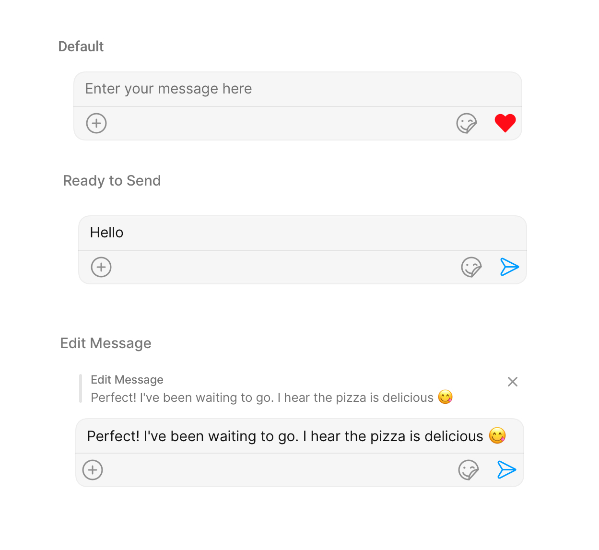
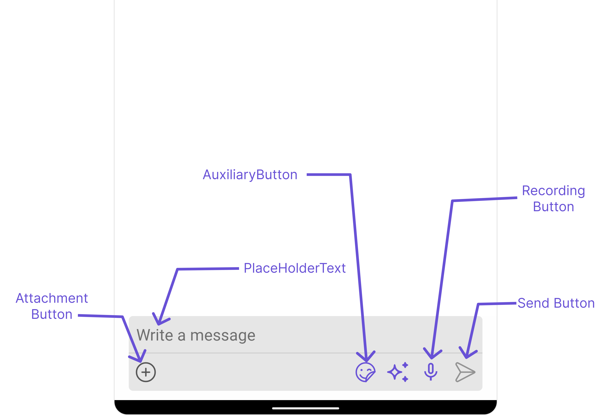
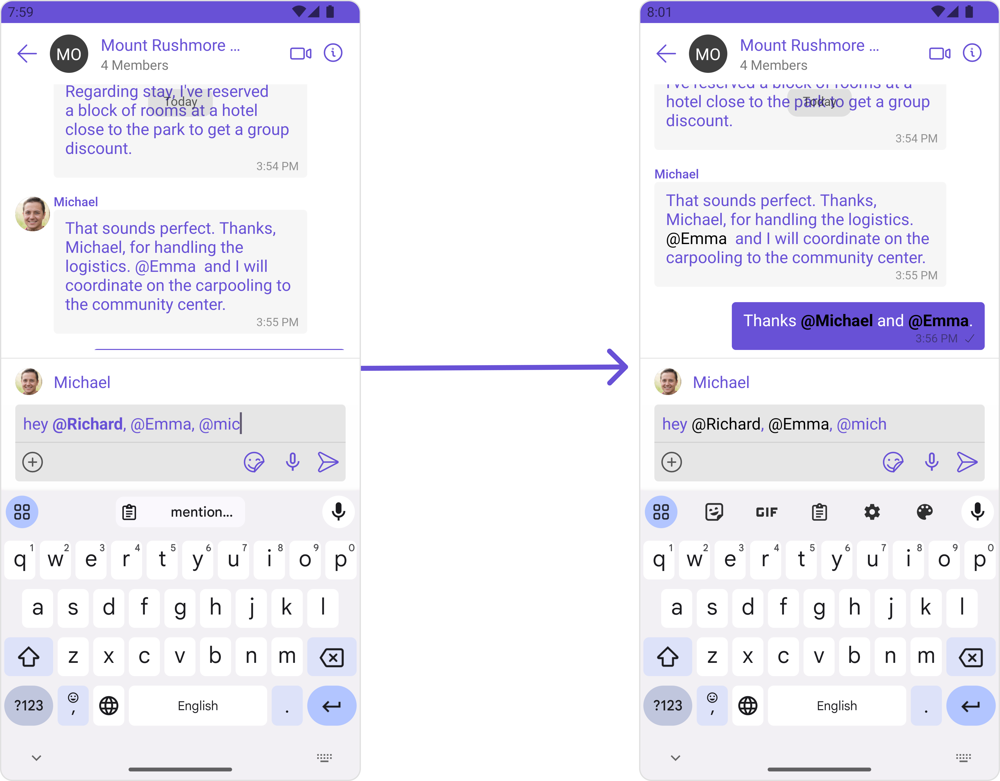
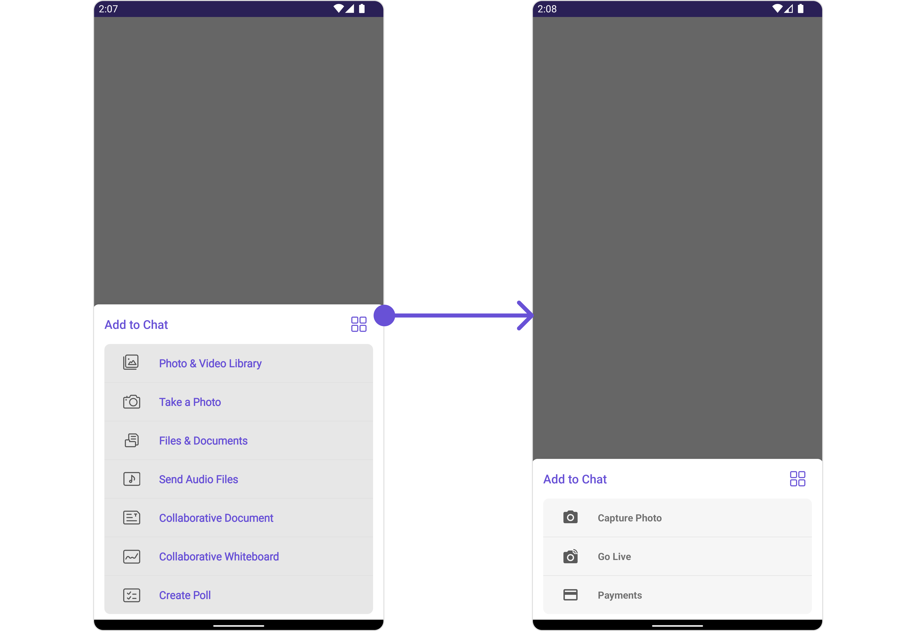
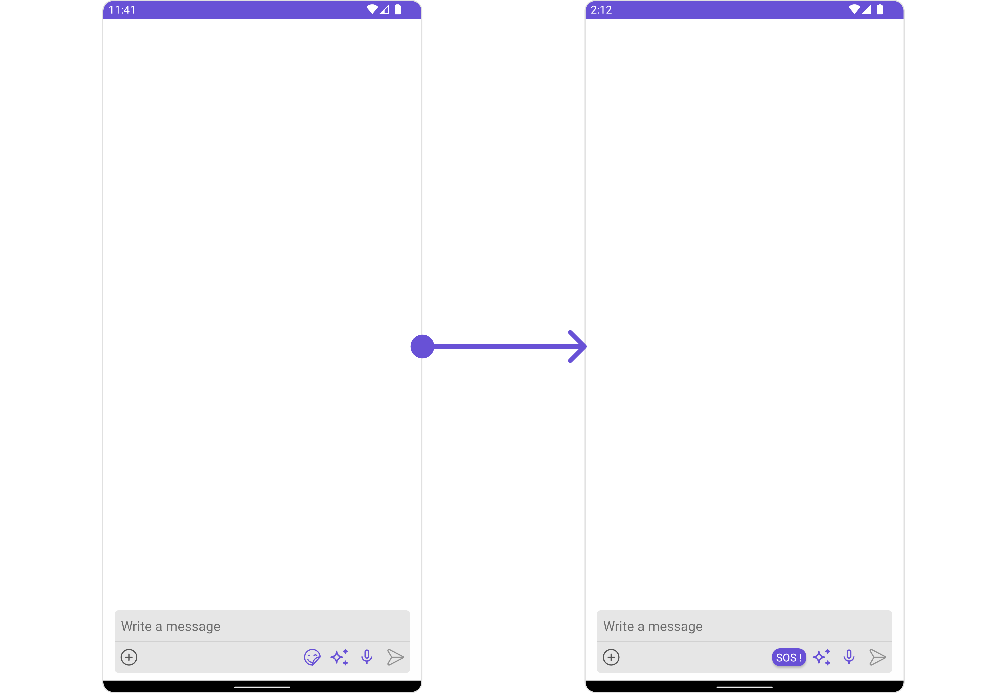
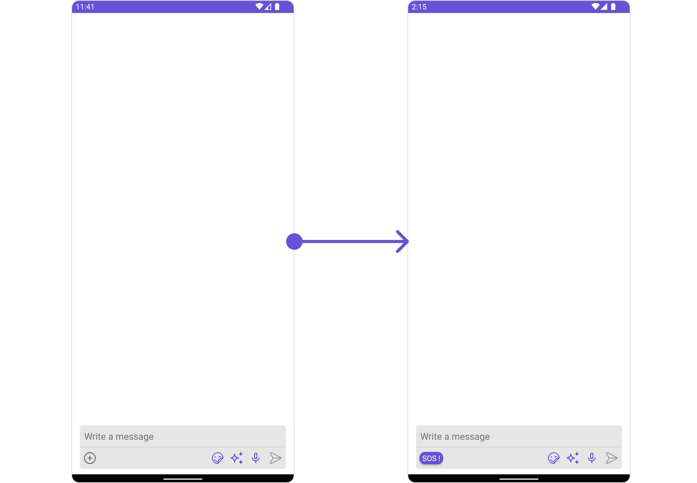
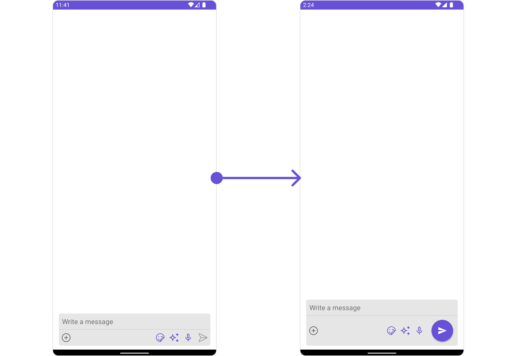
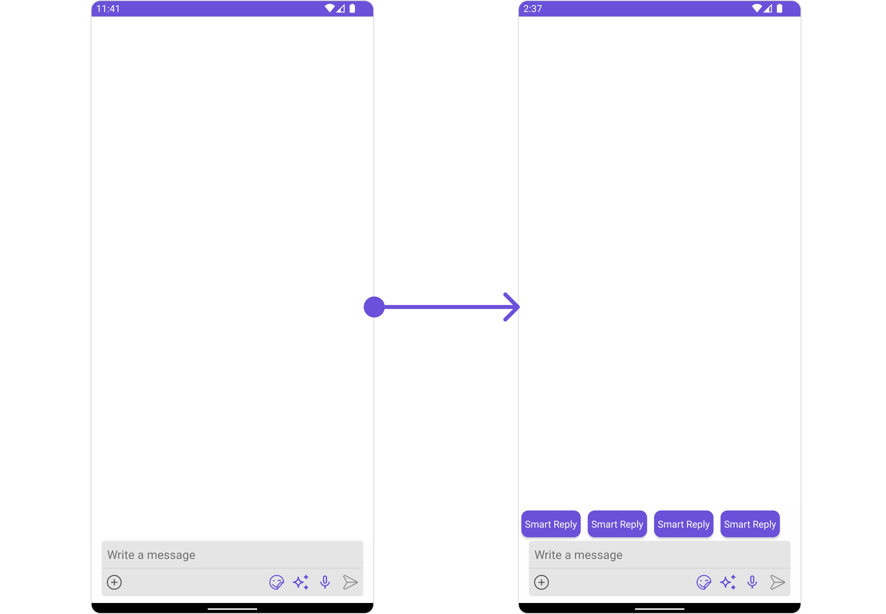
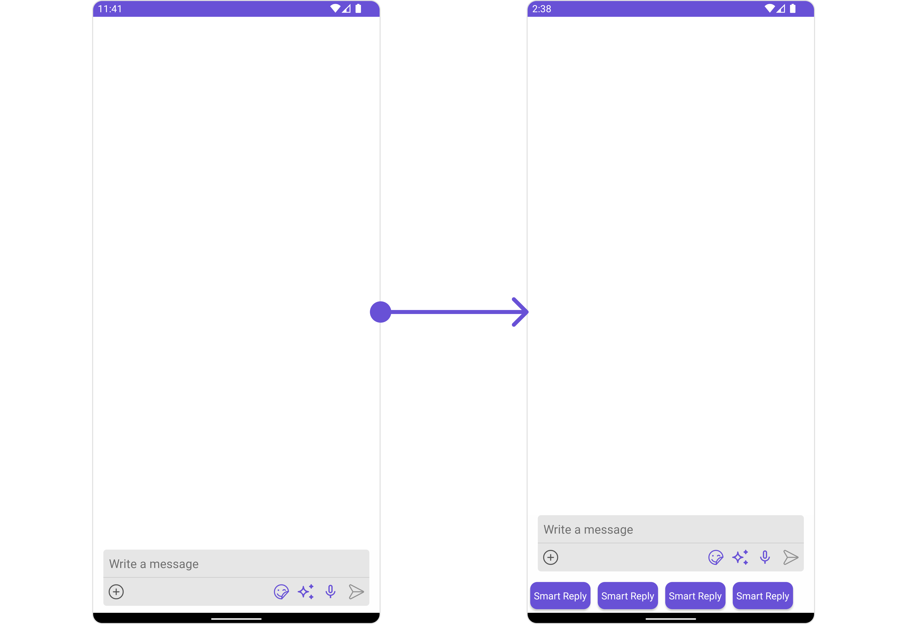

import Tabs from '@theme/Tabs';
import TabItem from '@theme/TabItem';
import { Tooltip } from 'react-tooltip'
import 'react-tooltip/dist/react-tooltip.css'

## Overview

MessageComposer is a [Component](/ui-kit/android/components-overview#components) that enables users to write and send a variety of messages, including text, image, video, and custom messages.

Features such as **Live Reaction**, **Attachments**, and **Message Editing** are also supported by it.



MessageComposer is comprised of the following [Base Components](/ui-kit/android/components-overview#base-components):

| Base Components                 | Description                                                                                                            |
| ------------------------------- | ---------------------------------------------------------------------------------------------------------------------- |
| [MessageInput](./message-input) | This provides a basic layout for the contents of this component, such as the TextField and buttons                     |
| [ActionSheet](./action-sheet)   | The ActionSheet component presents a list of options in either a list or grid mode, depending on the user's preference |

## Usage

### Integration

The following code snippet illustrates how you can directly incorporate the MessageComposer component into your `layout.xml` file.

```xml
<com.cometchat.chatuikit.messagecomposer.CometChatMessageComposer
                android:id="@+id/composer"
                android:layout_width="match_parent"
                android:layout_height="wrap_content" />
```

:::warning Warning

The MessageComposer is responsible for managing runtime permissions. To ensure the **ActivityResultLauncher** is properly initialized, its object should be created in the the **onCreate** state of an activity. To ensure that the composer is loaded within the fragment, it is important to make sure that the fragment is loaded in the `onCreate` state of the activity.

:::

### Actions

[Actions](/ui-kit/android/components-overview#actions) dictate how a component functions. They are divided into two types: Predefined and User-defined. You can override either type, allowing you to tailor the behavior of the component to fit your specific needs.

##### 1. OnSendButtonClick

The `OnSendButtonClick` event gets activated when the send message button is clicked. It has a predefined function of sending messages entered in the composer `EditText`. However, you can overide this action with the following code snippet.

<Tabs>

<TabItem value="java" label="Java">
    ```java
    messageComposer.setOnSendButtonClick(new CometChatMessageComposer.SendButtonClick() {
        @Override
        public void onClick(Context context, BaseMessage baseMessage) {
            Toast.makeText(context, "OnSendButtonClicked ..", Toast.LENGTH_SHORT).show();
        }
    });
    ```
</TabItem>

<TabItem value="kotlin" label="Kotlin">

    ```kotlin
    messageComposer.setOnSendButtonClick(object : CometChatMessageComposer.SendButtonClick {
    override fun onClick(context: Context, baseMessage: BaseMessage) {
        Toast.makeText(context, "OnSendButtonClicked ..", Toast.LENGTH_SHORT).show()
    }
    })
    ```

</TabItem>

</Tabs>

##### 2. onError

This action doesn't change the behavior of the component but rather listens for any errors that occur in the MessageList component.

<Tabs>

<TabItem value="java" label="Java">
```java title="YourActivity.java"
messageComposer.setOnError(new OnError() {
    @Override
    public void onError(Context context, CometChatException e) {
        //Your Exception Handling code.
    }
});
```
</TabItem>

<TabItem value="kotlin" label="Kotlin">

```kotlin title="YourActivity.kt"
messageComposer.setOnError(object : OnError {
    override fun onError(context: Context, e: CometChatException) {
        // Your Exception Handling code.
    }
})
```

</TabItem>

</Tabs>

---

### Filters

MessageComposer component does not have any available filters.

---

### Events

[Events](/ui-kit/android/components-overview#events) are emitted by a `Component`. By using event you can extend existing functionality. Being global events, they can be applied in Multiple Locations and are capable of being Added or Removed.

The MessageComposer Component does not emit any events of its own.

---

## Customization

To fit your app's design requirements, you can customize the appearance of the MessageComposer component. We provide exposed methods that allow you to modify the experience and behavior according to your specific needs.

### Style

Using Style you can customize the look and feel of the component in your app, These parameters typically control elements such as the color, size, shape, and fonts used within the component.

##### 1. MessageComposer Style

To modify the styling, you can apply the MessageComposerStyle to the MessageComposer Component using the `setStyle` method.

<Tabs>

<TabItem value="java" label="Java">

```java
MessageComposerStyle messageComposerStyle = new MessageComposerStyle();
messageComposer.setStyle(messageComposerStyle);
```

</TabItem>

<TabItem value="kotlin" label="Kotlin">

```kotlin
val messageComposerStyle = MessageComposerStyle()
messageComposer.setStyle(messageComposerStyle)
```

</TabItem>

</Tabs>

The following properties are exposed by MessageComposerStyle:

| Property                       | Description                                                | Code                                        |
| ------------------------------ | ---------------------------------------------------------- | ------------------------------------------- |
| **Set BorderWidth**            | Used to set outermost border                               | `.setBorderWidth(int)   `                   |
| **Border Color**               | Used to set border color                                   | `.setBorderColor(@ColorInt int)`            |
| **Corner Radius**              | Used to set corner radius                                  | `.setCornerRadius(int)`                     |
| **Background**                 | This method will set the background color for message list | `.setBackground(@ColorInt int)`             |
| **Set InputBackgroundColor**   | Used to set input background color                         | `.setInputBackgroundColor(@ColorInt int)`   |
| **Set TextAppearance**         | Used to set input text style                               | `.setTextAppearance(@StyleRes int)`         |
| **Set PlaceHolderTextColor**   | Used to set placeholder text color                         | `.setPlaceHolderTextColor(@StyleRes int)`   |
| **Background**                 | This will set drawable component for list background       | `.setBackground(@drawable int)`             |
| **Set AttachIconTint**         | Used to set attachment icon tint                           | `.setAttachIconTint(@ColorRes int)`         |
| **Set SendIconTint**           | Used to set send button icon tint                          | `.setSendIconTint(@ColorRes int)`           |
| **Set SeparatorTint**          | Used to set separator color                                | `.setSeparatorTint(@ColorRes int)`          |
| **Set VoiceRecordingIconTint** | used to set voice recording icon color                     | `.setVoiceRecordingIconTint(@ColorRes int)` |

##### 2. MessageInput Style

To customize the styles of the MessageInput component within the MessageComposer Component, use the `.setMessageInputStyle()` method. For more details, please refer to [MessageInput](http://localhost:3000/docs-beta/ui-kit/android/message-input) styles.

<Tabs>

<TabItem value="java" label="Java">

```java
MessageInputStyle messageInputStyle = new MessageInputStyle();
messageInputStyle.setBackground(Color.BLUE);
messageInputStyle.setCornerRadius(50);
messageComposer.setMessageInputStyle(messageInputStyle);
```

</TabItem>

<TabItem value="kotlin" label="Kotlin">

```kotlin
val messageInputStyle = MessageInputStyle()
messageInputStyle.setBackground(Color.BLUE)
messageInputStyle.setCornerRadius(50)
messageComposer.setMediaRecorderStyle(mediaRecorderStyle)
```

</TabItem>

</Tabs>

##### 3. MediaRecorder Style

To customize the styles of the MediaRecorder component within the MessageComposer Component, use the `.setMediaRecorderStyle()` method. For more details, please refer to [MediaRecorder](/ui-kit/android/media-recorder) styles.

<Tabs>

<TabItem value="java" label="Java">

```java
MediaRecorderStyle mediaRecorderStyle = new MediaRecorderStyle();
mediaRecorderStyle.setBorderColor(Color.BLACK);
mediaRecorderStyle.setRecordedContainerColor(Color.RED);
messageComposer.setMediaRecorderStyle(mediaRecorderStyle);
```

</TabItem>

<TabItem value="kotlin" label="Kotlin">

```kotlin
val mediaRecorderStyle = MediaRecorderStyle()
mediaRecorderStyle.setBorderColor(Color.BLACK)
mediaRecorderStyle.setRecordedContainerColor(Color.RED)
messageComposer.setMediaRecorderStyle(mediaRecorderStyle)
```

</TabItem>

</Tabs>

---

### Functionality

These are a set of small functional customizations that allow you to fine-tune the overall experience of the component. With these, you can change text, set custom icons, and toggle the visibility of UI elements.

<Tabs>

<TabItem value="java" label="Java">

```java
CometChatMessageComposer messageComposer = findViewById(R.id.composer);
messageComposer.hideLiveReaction(true);
messageComposer.disableTypingEvents(true);
```

</TabItem>

<TabItem value="kotlin" label="Kotlin">

```kotlin
val messageComposer: CometChatMessageComposer = findViewById(R.id.composer)
messageComposer.hideLiveReaction(true)
messageComposer.disableTypingEvents(true)
```

</TabItem>

</Tabs>



Below is a list of customizations along with corresponding code snippets

| Property                                                                                                 | Description                                                                                                                                                                                                                                     | Code                                                      |
| -------------------------------------------------------------------------------------------------------- | ----------------------------------------------------------------------------------------------------------------------------------------------------------------------------------------------------------------------------------------------- | --------------------------------------------------------- |
| **User** <a data-tooltip-id="my-tooltip-html-prop"> <span class="material-icons red">report</span> </a>  | Used to pass user object of which header specific details will be shown                                                                                                                                                                         | `.setUser(user)`                                          |
| **Group** <a data-tooltip-id="my-tooltip-html-prop"> <span class="material-icons red">report</span> </a> | Used to pass group object of which header specific details will be shown                                                                                                                                                                        | `.setGroup(Group)`                                        |
| **Set PlaceHolderText**                                                                                  | Used to set composer's placeholder text                                                                                                                                                                                                         | `.setPlaceHolderText("Your_Text")`                        |
| **Disable TypingEvents**                                                                                 | Used to disable/enable typing events , default false                                                                                                                                                                                            | `.disableTypingEvents(boolean)`                           |
| **Disable SoundForMessages**                                                                             | Used to toggle sound for outgoing messages                                                                                                                                                                                                      | `.disableSoundForMessages(boolean)`                       |
| **Set SendButtonIcon**                                                                                   | Used to set send button icon                                                                                                                                                                                                                    | `.setSendButtonIcon(@DrawableRes int)`                    |
| **Set Text**                                                                                             | Used to set predefined text                                                                                                                                                                                                                     | `.setText("Your_Text")`                                   |
| **Set MaxLine**                                                                                          | Maximum lines allowed to increase in the input field                                                                                                                                                                                            | `.setMaxLine(int)`                                        |
| **Set VoiceRecordingIcon**                                                                               | Sets custom drawable resources for the record buttons.                                                                                                                                                                                          | `.setVoiceRecordingIcon(@DrawableRes int)`                |
| **Set VoiceRecordingVisibility**                                                                         | The visibility constant for the voice recording view. Use View.VISIBLE, View.INVISIBLE or View.GONE.                                                                                                                                            | `.setVoiceRecordingVisibility(int)`                       |
| **Set PauseIcon**                                                                                        | Sets custom drawable resources for the pause buttons.                                                                                                                                                                                           | `.setPauseIcon(@DrawableRes int)`                         |
| **Set PlayIcon**                                                                                         | Sets custom drawable resources for the play buttons.                                                                                                                                                                                            | `.setPlayIcon(@DrawableRes int)`                          |
| **Set DeleteIcon**                                                                                       | Sets custom drawable resources for the delete buttons.                                                                                                                                                                                          | `.setDeleteIcon(@DrawableRes int)`                        |
| **Set StopIcon**                                                                                         | Sets custom drawable resources for the stop buttons.                                                                                                                                                                                            | `.setStopIcon(@DrawableRes int)`                          |
| **Set AuxiliaryButtonAlignment**                                                                         | controls position auxiliary button view , can be **left** or **right** . default **right**                                                                                                                                                      | `.setAuxiliaryButtonAlignment(AuxiliaryButtonsAlignment)` |
| **Set AttachmentIcon**                                                                                   | sets the icon to show in the attachment button                                                                                                                                                                                                  | `.setAttachmentIcon(@DrawableRes int)`                    |
| **Hide LiveReaction**                                                                                    | used to toggle visibility for live reaction component                                                                                                                                                                                           | `.hideLiveReaction(boolean)`                              |
| **Disable Mentions**                                                                                     | Sets whether mentions in text should be disabled. Processes the text formatters If there are text formatters available and the disableMentions flag is set to true, it removes any formatters that are instances of CometChatMentionsFormatter. | `.setDisableMentions(true);`                              |
| **Set CustomSoundForMessages**                                                                           | Used to give custom sounds to outgoing messages                                                                                                                                                                                                 | `.setCustomSoundForMessages(String)`                      |
| **Set LiveReactionIcon**                                                                                 | used to set custom live reaction icon.                                                                                                                                                                                                          | `.setLiveReactionIcon(@DrawableRes int)`                  |

---

### Advanced

For advanced-level customization, you can set custom views to the component. This lets you tailor each aspect of the component to fit your exact needs and application aesthetics. You can create and define your views, layouts, and UI elements and then incorporate those into the component.

---

#### setTextFormatters

Assigns the list of text formatters. If the provided list is not null, it sets the list. Otherwise, it assigns the default text formatters retrieved from the data source. To configure the existing Mentions look and feel check out [CometChatMentionsFormatter](/ui-kit/android/mentions-formatter-guide)

**Example**

<Tabs>

<TabItem value="java" label="Java">

    ```Java

// Initialize CometChatMentionsFormatter
CometChatMentionsFormatter mentionFormatter = new CometChatMentionsFormatter(context);

    // set style to customize composer mention text
    mentionFormatter.setComposerMentionTextStyle(new MentionTextStyle()
                .setLoggedInUserTextStyle(Typeface.defaultFromStyle(Typeface.BOLD))
                .setTextColor(Color.parseColor("#000000")));

// This can be passed as an array of formatter in CometChatMessageComposer by using setTextFormatters method.
List<CometChatTextFormatter> textFormatters = new ArrayList<>();
textFormatters.add(mentionFormatter);
messageComposer.setTextFormatters(textFormatters);

````

</TabItem>

<TabItem value="kotlin" label="Kotlin">

    ```kotlin

// Initialize CometChatMentionsFormatter
val mentionFormatter = CometChatMentionsFormatter(context)
// set style to customize composer mention text
mentionFormatter.composerMentionTextStyle = MentionTextStyle()
.setLoggedInUserTextStyle(Typeface.defaultFromStyle(Typeface.BOLD))
.setTextColor(Color.parseColor("#000000"))

// This can be passed as an array of formatter in CometChatMessageComposer by using setTextFormatters method.
val textFormatters: MutableList<CometChatTextFormatter> = ArrayList()
textFormatters.add(mentionFormatter)
messageComposer.setTextFormatters(textFormatters)

    ```

</TabItem>

</Tabs>

#### AttachmentOptions

By using `setAttachmentOptions()`, you can set a list of custom `MessageComposerActions` for the MessageComposer Component. This will override the existing list of `MessageComposerActions`.

<Tabs>

<TabItem value="java" label="Java">

```java
messageComposer.setAttachmentOptions()
````

</TabItem>

<TabItem value="kotlin" label="Kotlin">

```kotlin
messageComposer.setAttachmentOptions()
```

</TabItem>

</Tabs>

**Example**

In this example, we are overriding the existing MessageComposerActions List with Capture Photo, Go Live & Payments actions.

<Tabs>

<TabItem value="java" label="Java">

```java
messageComposer.setAttachmentOptions(new Function4<Context, User, Group, HashMap<String, String>, List<CometChatMessageComposerAction>>() {
    @Override
    public List<CometChatMessageComposerAction> invoke(Context context, User user, Group group, HashMap<String, String> stringStringHashMap) {
        List<CometChatMessageComposerAction> actionList = new ArrayList<>();

        CometChatMessageComposerAction action1 =  new CometChatMessageComposerAction();
        action1.setTitle("Capture Photo");
        action1.setIcon(com.cometchat.chatuikit.R.drawable.ic_camera);
        action1.setOnClick(new OnClick() {
            @Override
            public void onClick() {
                Toast.makeText(context, "Capture Photo option Clicked !!!", Toast.LENGTH_SHORT).show();
            }
        });
        actionList.add(action1);

        CometChatMessageComposerAction action2 =  new CometChatMessageComposerAction();
        action2.setTitle("Go Live");
        action2.setIcon(R.drawable.broadcast_camera);
        action2.setOnClick(new OnClick() {
            @Override
            public void onClick() {
                Toast.makeText(context, "Live Option Clicked !!!", Toast.LENGTH_SHORT).show();
            }
        });
        actionList.add(action2);

        CometChatMessageComposerAction action3 =  new CometChatMessageComposerAction();
        action3.setTitle("Payments");
        action3.setIcon(R.drawable.ic_payment);
        action3.setOnClick(new OnClick() {
            @Override
            public void onClick() {
                Toast.makeText(context, "Payment Option Clicked !!!", Toast.LENGTH_SHORT).show();
            }
        });
        actionList.add(action3);
        return actionList;
    }
});
```

</TabItem>

<TabItem value="kotlin" label="Kotlin">

```kotlin
    messageComposer.setAttachmentOptions { context, user, group, stringStringHashMap ->
        val actionList = ArrayList<CometChatMessageComposerAction>()

        val action1 = CometChatMessageComposerAction()
        action1.title = "Capture Photo"
        action1.icon = com.cometchat.chatuikit.R.drawable.ic_camera
        action1.onClick = {
            Toast.makeText(context, "Capture Photo option Clicked !!!", Toast.LENGTH_SHORT).show()
        }
        actionList.add(action1)

        val action2 = CometChatMessageComposerAction()
        action2.title = "Go Live"
        action2.icon = R.drawable.broadcast_camera
        action2.onClick = {
            Toast.makeText(context, "Live Option Clicked !!!", Toast.LENGTH_SHORT).show()
        }
        actionList.add(action2)

        val action3 = CometChatMessageComposerAction()
        action3.title = "Payments"
        action3.icon = R.drawable.ic_payment
        action3.onClick = {
            Toast.makeText(context, "Payment Option Clicked !!!", Toast.LENGTH_SHORT).show()
        }
        actionList.add(action3)

        actionList
    }
```

</TabItem>

</Tabs>

---

#### AuxiliaryButtonView

You can insert a custom view into the MessageComposer component to add additional functionality using the following method.

<Tabs>

<TabItem value="java" label="Java">

```java
 messageComposer.setAuxiliaryButtonView()
```

</TabItem>

<TabItem value="kotlin" label="Kotlin">

```kotlin
 messageComposer.setAuxiliaryButtonView()
```

</TabItem>

</Tabs>

Please note that the MessageComposer Component utilizes the AuxiliaryButton to provide sticker functionality. Overriding the AuxiliaryButton will subsequently replace the sticker functionality.

**Example**


In this example, we'll be adding a custom SOS button with click functionality. You'll first need to create a layout file and then inflate it inside the `.setAuxiliaryButtonView()` function.

```xml title="auxiliary_button_layout.xml"
<?xml version="1.0" encoding="utf-8"?>
<RelativeLayout xmlns:android="http://schemas.android.com/apk/res/android"
    android:layout_width="match_parent"
    android:layout_height="match_parent"
    xmlns:app="http://schemas.android.com/apk/res-auto">

    <androidx.cardview.widget.CardView
        android:id="@+id/card_button"
        android:layout_width="wrap_content"
        android:layout_height="wrap_content"
        android:padding="10dp"
        android:layout_margin="5dp"
        app:cardCornerRadius="10dp"
        >
        <TextView
            android:layout_width="wrap_content"
            android:layout_height="wrap_content"
            android:text="SOS !"
            android:padding="2dp"
            android:paddingEnd="5dp"
            android:paddingStart="5dp"
            android:textColor="@color/white"
            android:background="@color/purple_700"
            />

    </androidx.cardview.widget.CardView>

</RelativeLayout>
```

<Tabs>

<TabItem value="java" label="Java">

```java
messageComposer.setAuxiliaryButtonView((context, user, group, stringStringHashMap) -> {

    View view = getLayoutInflater().inflate(R.layout.auxiliary_button_layout, null);
    CardView cardView = view.findViewById(R.id.card_button);
    cardView.setOnClickListener(new View.OnClickListener() {
        @Override
        public void onClick(View v) {
            Toast.makeText(context, "Clicked on SOS", Toast.LENGTH_SHORT).show();
        }
    });
    return view;
});
```

</TabItem>

<TabItem value="kotlin" label="Kotlin">

```kotlin
messageComposer.setAuxiliaryButtonView { context, user, group, stringStringHashMap ->
    val view: View = LayoutInflater.from(context).inflate(R.layout.auxiliary_button_layout, null)
    val cardView: CardView = view.findViewById(R.id.card_button)
    cardView.setOnClickListener {
        Toast.makeText(context, "Clicked on SOS", Toast.LENGTH_SHORT).show()
    }
    view
}
```

</TabItem>

</Tabs>

---

#### SecondaryButtonView

You can add a custom view into the SecondaryButton component for additional functionality using the below method.
<Tabs>

<TabItem value="java" label="Java">

```java
messageComposer.setSecondaryButtonView()
```

</TabItem>

<TabItem value="kotlin" label="Kotlin">

```kotlin
messageComposer.setSecondaryButtonView()
```

</TabItem>

</Tabs>

Please note that the MessageComposer Component uses the SecondaryButton to open the ComposerActionsList. Overriding the SecondaryButton will replace the ComposerActionsList functionality.

**Example**


In this example, we'll be adding a custom SOS button with click functionality. You'll first need to create a layout file and then inflate it inside the `.setSecondaryButtonView()` function.

```xml title="secondary_button_layout.xml"
<?xml version="1.0" encoding="utf-8"?>
<RelativeLayout xmlns:android="http://schemas.android.com/apk/res/android"
    android:layout_width="match_parent"
    android:layout_height="match_parent"
    xmlns:app="http://schemas.android.com/apk/res-auto">

    <androidx.cardview.widget.CardView
        android:id="@+id/card_button"
        android:layout_width="wrap_content"
        android:layout_height="wrap_content"
        android:padding="10dp"
        android:layout_margin="5dp"
        app:cardCornerRadius="10dp"
        >
        <TextView
            android:layout_width="wrap_content"
            android:layout_height="wrap_content"
            android:text="SOS !"
            android:padding="2dp"
            android:paddingEnd="5dp"
            android:paddingStart="5dp"
            android:textColor="@color/white"
            android:background="@color/purple_700"
            />

    </androidx.cardview.widget.CardView>

</RelativeLayout>
```

<Tabs>

<TabItem value="java" label="Java">

```java
messageComposer.setSecondaryButtonView((context, user, group, stringStringHashMap) -> {

    View view = getLayoutInflater().inflate(R.layout.secondary_button_layout, null);
    CardView cardView = view.findViewById(R.id.card_button);
    cardView.setOnClickListener(new View.OnClickListener() {
        @Override
        public void onClick(View v) {
            Toast.makeText(context, "Clicked on SOS", Toast.LENGTH_SHORT).show();
        }
    });
    return view;
});
```

</TabItem>

<TabItem value="kotlin" label="Kotlin">

```kotlin
messageComposer.setSecondaryButtonView { context, user, group, stringStringHashMap ->
    val view: View = LayoutInflater.from(context).inflate(R.layout.secondary_button_layout, null)
    val cardView: CardView = view.findViewById(R.id.card_button)
    cardView.setOnClickListener {
        Toast.makeText(context, "Clicked on SOS", Toast.LENGTH_SHORT).show()
    }
    view
}
```

</TabItem>

</Tabs>

---

#### Set SendButtonView

You can set a custom view in place of the already existing send button view. Using the following method.

<Tabs>

<TabItem value="java" label="Java">

```java
messageComposer.setSendButtonView();
```

</TabItem>

<TabItem value="kotlin" label="Kotlin">

```kotlin
messageComposer.setSendButtonView();
```

</TabItem>

</Tabs>

**Example**



```xml title="send_button_layout.xml"
<?xml version="1.0" encoding="utf-8"?>
<RelativeLayout xmlns:android="http://schemas.android.com/apk/res/android"
    android:layout_width="match_parent"
    android:layout_height="match_parent"
    xmlns:app="http://schemas.android.com/apk/res-auto">

    <androidx.cardview.widget.CardView
        android:id="@+id/card_button"
        android:layout_width="wrap_content"
        android:layout_height="wrap_content"
        android:layout_margin="5dp"
        app:cardCornerRadius="30dp"
        >
        <ImageView
            android:layout_width="wrap_content"
            android:layout_height="wrap_content"
            android:padding="15dp"
            android:src="@drawable/ic_send"
            android:background="@color/purple_700"
            />

    </androidx.cardview.widget.CardView>

</RelativeLayout>
```

<Tabs>

<TabItem value="java" label="Java">

```java
View view = getLayoutInflater().inflate(R.layout.send_button_layout, null);
messageComposer.setSendButtonView(view);
```

</TabItem>

<TabItem value="kotlin" label="Kotlin">

```kotlin
View view = getLayoutInflater().inflate(R.layout.send_button_layout, null);
messageComposer.setSendButtonView(view);
```

</TabItem>

</Tabs>

---

#### HeaderView

You can set custom headerView to the MessageComposer component using the following method

<Tabs>

<TabItem value="java" label="Java">

```java
messageComposer.setHeaderView();
```

</TabItem>

<TabItem value="kotlin" label="Kotlin">

```kotlin
messageComposer.setHeaderView();
```

</TabItem>

</Tabs>

**Example**


In the following example, we're going to apply a mock smart reply view to the MessageComposer Component using the `.setHeaderView()` method.

```xml title="custom_header_view_layout"
<?xml version="1.0" encoding="utf-8"?>
<LinearLayout xmlns:android="http://schemas.android.com/apk/res/android"
    android:layout_width="match_parent"
    android:layout_height="match_parent"
    android:layout_gravity="center_vertical"
    android:orientation="horizontal"
    xmlns:app="http://schemas.android.com/apk/res-auto">

    <androidx.cardview.widget.CardView
        android:id="@+id/card1"
        android:layout_width="wrap_content"
        android:layout_height="wrap_content"
        android:padding="10dp"
        android:layout_margin="5dp"
        app:cardCornerRadius="10dp"
        >
        <TextView
            android:layout_width="wrap_content"
            android:layout_height="wrap_content"
            android:text="Smart Reply"
            android:padding="10dp"
            android:paddingEnd="5dp"
            android:paddingStart="5dp"
            android:textColor="@color/white"
            android:background="@color/purple_700"
            />

    </androidx.cardview.widget.CardView>

    <androidx.cardview.widget.CardView
        android:id="@+id/card2"
        android:layout_width="wrap_content"
        android:layout_height="wrap_content"
        android:padding="10dp"
        android:layout_margin="5dp"
        app:cardCornerRadius="10dp"
        >
        <TextView
            android:layout_width="wrap_content"
            android:layout_height="wrap_content"
            android:text="Smart Reply"
            android:padding="10dp"
            android:paddingEnd="5dp"
            android:paddingStart="5dp"
            android:textColor="@color/white"
            android:background="@color/purple_700"
            />

    </androidx.cardview.widget.CardView>


    <androidx.cardview.widget.CardView
        android:id="@+id/card3"
        android:layout_width="wrap_content"
        android:layout_height="wrap_content"
        android:padding="10dp"
        android:layout_margin="5dp"
        app:cardCornerRadius="10dp"
        >
        <TextView
            android:layout_width="wrap_content"
            android:layout_height="wrap_content"
            android:text="Smart Reply"
            android:padding="10dp"
            android:paddingEnd="5dp"
            android:paddingStart="5dp"
            android:textColor="@color/white"
            android:background="@color/purple_700"
            />

    </androidx.cardview.widget.CardView>


    <androidx.cardview.widget.CardView
        android:id="@+id/card4"
        android:layout_width="wrap_content"
        android:layout_height="wrap_content"
        android:padding="10dp"
        android:layout_margin="5dp"
        app:cardCornerRadius="10dp"
        >
        <TextView
            android:layout_width="wrap_content"
            android:layout_height="wrap_content"
            android:text="Smart Reply"
            android:padding="10dp"
            android:paddingEnd="5dp"
            android:paddingStart="5dp"
            android:textColor="@color/white"
            android:background="@color/purple_700"
            />

    </androidx.cardview.widget.CardView>

</LinearLayout>

```

<Tabs>

<TabItem value="java" label="Java">

```java
View view = getLayoutInflater().inflate(R.layout.custom_header_view_layout, null);
messageComposer.setHeaderView(view);
```

</TabItem>

<TabItem value="kotlin" label="Kotlin">

```kotlin
val view: View = LayoutInflater.from(context).inflate(R.layout.custom_header_view_layout, null)
messageComposer.setHeaderView(view)
```

</TabItem>

</Tabs>

---

#### FooterView

You can set a custom footer view to the MessageComposer component using the following method:

<Tabs>

<TabItem value="java" label="Java">

```java
 messageComposer.setFooterView();
```

</TabItem>

<TabItem value="kotlin" label="Kotlin">

```kotlin
 messageComposer.setFooterView();
```

</TabItem>

</Tabs>

**Example**


In the following example, we're going to apply a mock smart reply view to the MessageComposer Component using the `.setFooterView()` method.

```xml title="custom_footer_view_layout"
<?xml version="1.0" encoding="utf-8"?>
<LinearLayout xmlns:android="http://schemas.android.com/apk/res/android"
    android:layout_width="match_parent"
    android:layout_height="match_parent"
    android:layout_gravity="center_vertical"
    android:orientation="horizontal"
    xmlns:app="http://schemas.android.com/apk/res-auto">

    <androidx.cardview.widget.CardView
        android:id="@+id/card1"
        android:layout_width="wrap_content"
        android:layout_height="wrap_content"
        android:padding="10dp"
        android:layout_margin="5dp"
        app:cardCornerRadius="10dp"
        >
        <TextView
            android:layout_width="wrap_content"
            android:layout_height="wrap_content"
            android:text="Smart Reply"
            android:padding="10dp"
            android:paddingEnd="5dp"
            android:paddingStart="5dp"
            android:textColor="@color/white"
            android:background="@color/purple_700"
            />

    </androidx.cardview.widget.CardView>

    <androidx.cardview.widget.CardView
        android:id="@+id/card2"
        android:layout_width="wrap_content"
        android:layout_height="wrap_content"
        android:padding="10dp"
        android:layout_margin="5dp"
        app:cardCornerRadius="10dp"
        >
        <TextView
            android:layout_width="wrap_content"
            android:layout_height="wrap_content"
            android:text="Smart Reply"
            android:padding="10dp"
            android:paddingEnd="5dp"
            android:paddingStart="5dp"
            android:textColor="@color/white"
            android:background="@color/purple_700"
            />

    </androidx.cardview.widget.CardView>


    <androidx.cardview.widget.CardView
        android:id="@+id/card3"
        android:layout_width="wrap_content"
        android:layout_height="wrap_content"
        android:padding="10dp"
        android:layout_margin="5dp"
        app:cardCornerRadius="10dp"
        >
        <TextView
            android:layout_width="wrap_content"
            android:layout_height="wrap_content"
            android:text="Smart Reply"
            android:padding="10dp"
            android:paddingEnd="5dp"
            android:paddingStart="5dp"
            android:textColor="@color/white"
            android:background="@color/purple_700"
            />

    </androidx.cardview.widget.CardView>


    <androidx.cardview.widget.CardView
        android:id="@+id/card4"
        android:layout_width="wrap_content"
        android:layout_height="wrap_content"
        android:padding="10dp"
        android:layout_margin="5dp"
        app:cardCornerRadius="10dp"
        >
        <TextView
            android:layout_width="wrap_content"
            android:layout_height="wrap_content"
            android:text="Smart Reply"
            android:padding="10dp"
            android:paddingEnd="5dp"
            android:paddingStart="5dp"
            android:textColor="@color/white"
            android:background="@color/purple_700"
            />

    </androidx.cardview.widget.CardView>

</LinearLayout>

```

<Tabs>

<TabItem value="java" label="Java">

```java
View view = getLayoutInflater().inflate(R.layout.custom_footer_view_layout, null);
messageComposer.setHeaderView(view);
```

</TabItem>

<TabItem value="kotlin" label="Kotlin">

```kotlin
val view: View = LayoutInflater.from(context).inflate(R.layout.custom_footer_view_layout, null)
messageComposer.setHeaderView(view)
```

</TabItem>

</Tabs>

---

<Tooltip
  id="my-tooltip-html-prop"
  html="Not available in MessageComposerConfiguration"
/>
