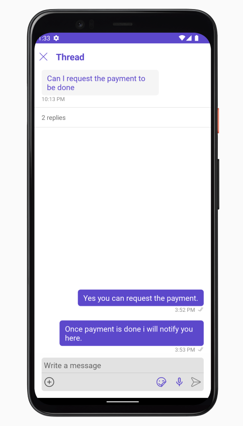
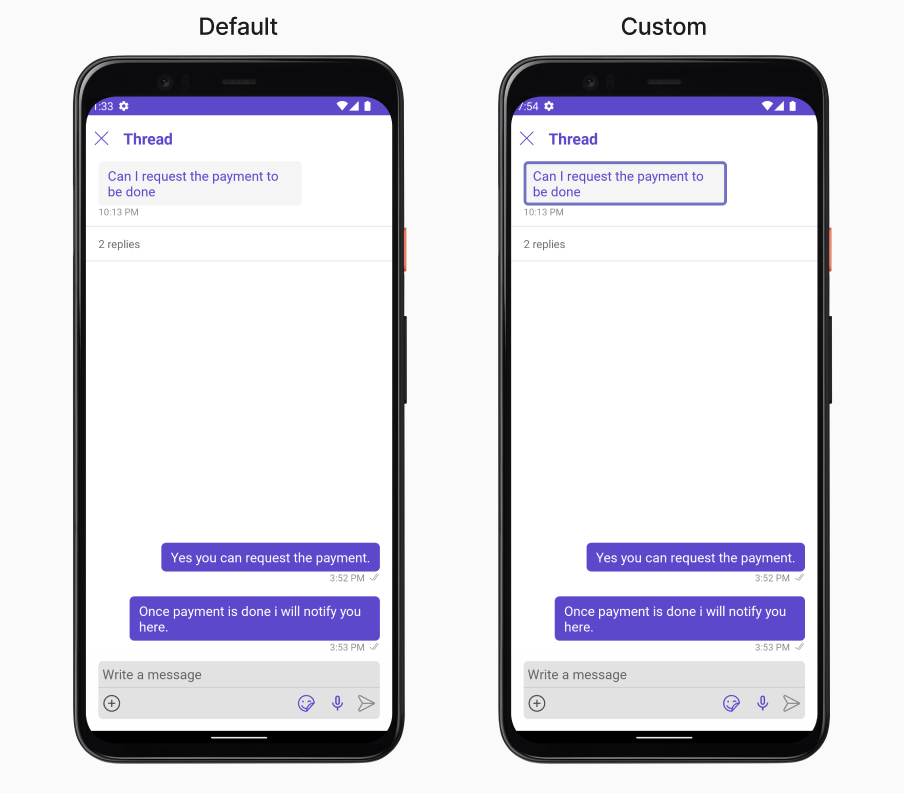
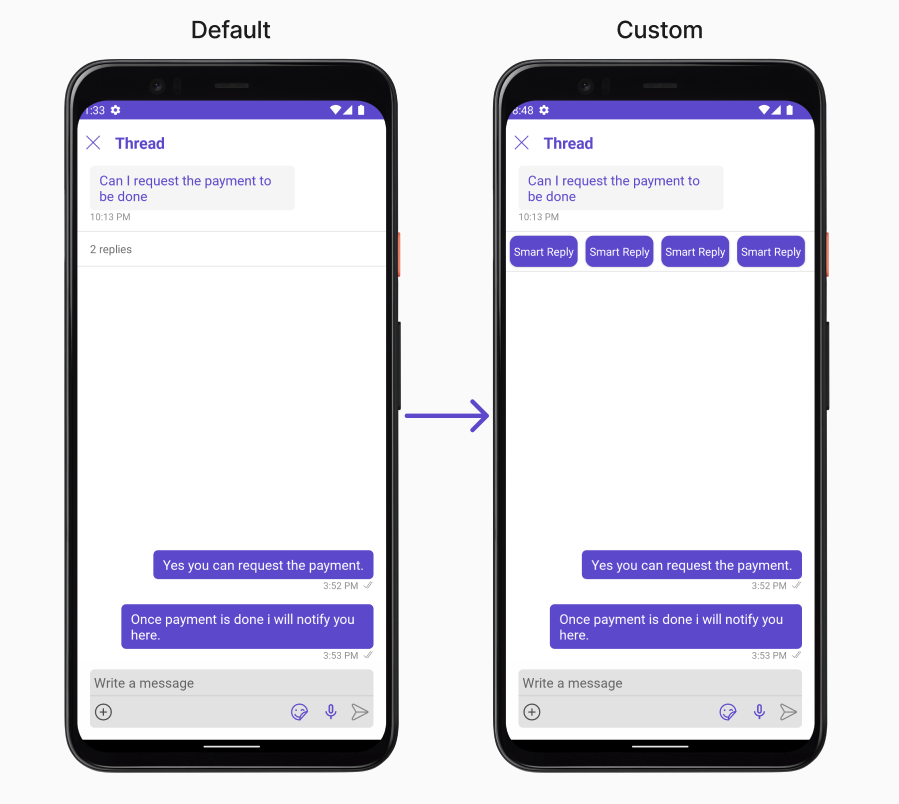
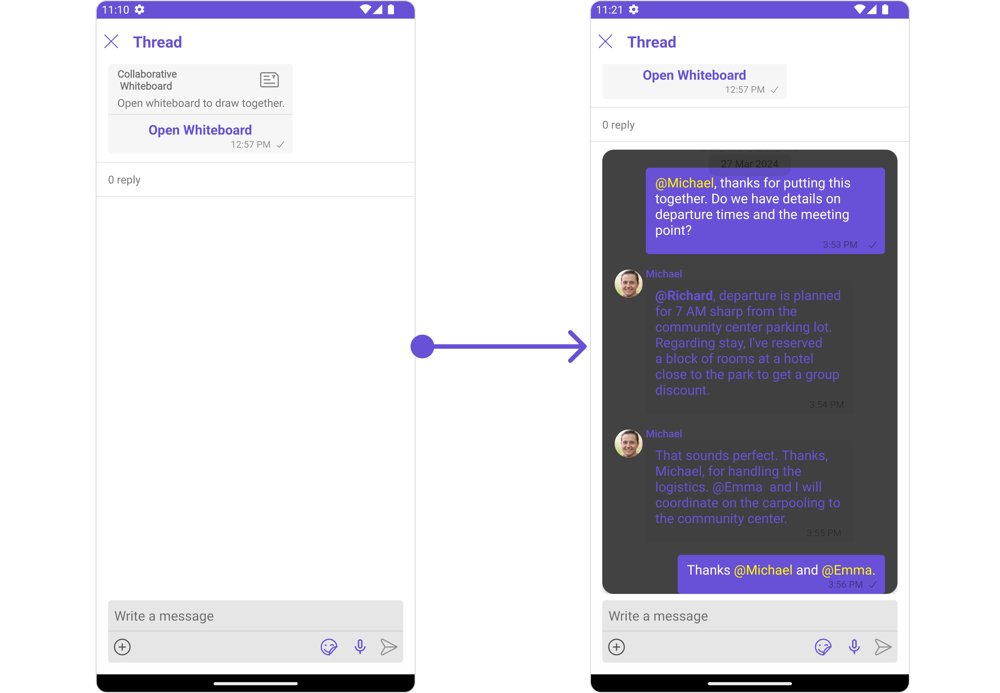
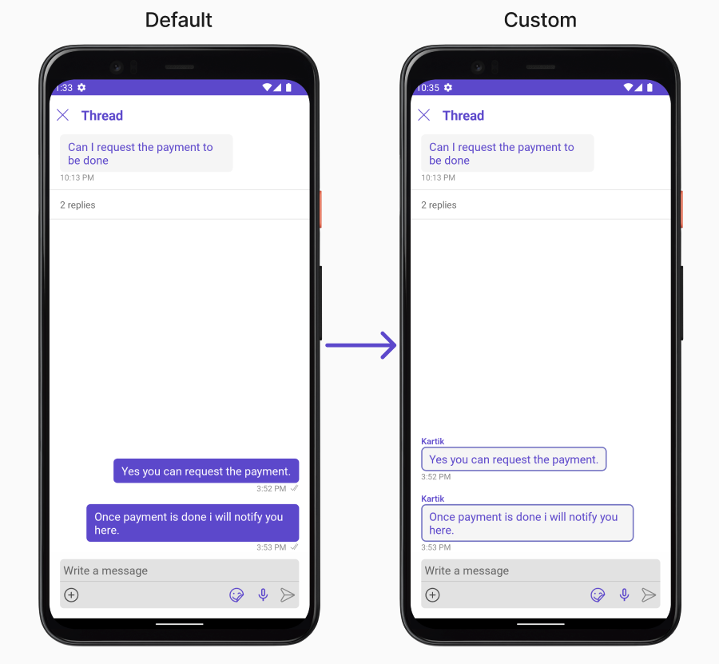
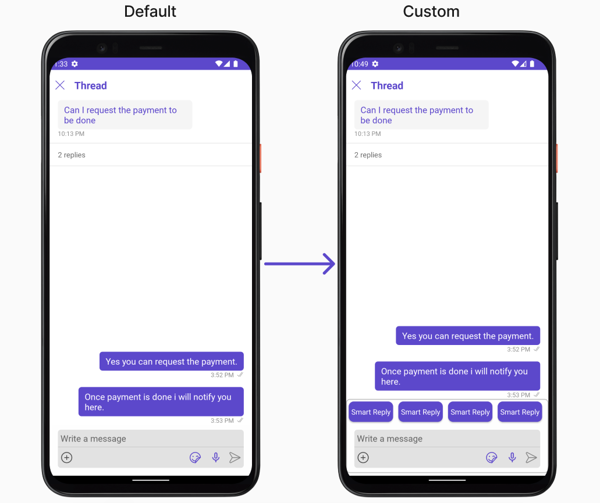

import Tabs from '@theme/Tabs';
import TabItem from '@theme/TabItem';

## Overview

ThreadedMessages is a [Composite Component](/ui-kit/android/components-overview#composite-components) that displays all replies made to a particular message in a conversation. By default, the parent message will be displayed at the top, the message composer will be at the bottom and between them a message list will contain all replies.



<!-- CometChatThreadedMessages sets up the following functionality internally:

- sets a message list component and fetches relevant messages
- sets up a message composer that will be used to send messages in the thread -->

ThreadedMessages is composed of the following components:

| Component                             | Description                                                                                                        |
| ------------------------------------- | ------------------------------------------------------------------------------------------------------------------ |
| [MessageList](./message-list)         | CometChatMessageList is a component that displays a list of Messages                                               |
| [MessageComposer](./message-composer) | CometChatMessageComposer is a component that helps in writing and editing of messages and also sending attachments |

## Usage

### Integration

The following code snippet illustrates how you can directly incorporate the ThreadedMessages component into your `layout.xml` file.

<Tabs>
<TabItem value="xml" label="XML">

```xml
<com.cometchat.chatuikit.threadedmessages.CometChatThreadedMessages
        android:id="@+id/threaded_messages"
        android:layout_width="match_parent"
        android:layout_height="match_parent" />
```

</TabItem>
</Tabs>

---

### Actions

[Actions](/ui-kit/android/components-overview#actions) dictate how a component functions. They are divided into two types: Predefined and User-defined. You can override either type, allowing you to tailor the behavior of the component to fit your specific needs.

ThreadedMessages does not have its own actions. However, you can override the behavior of the ThreadedMessages component by using the actions of its Components, with the help of [Configurations](/ui-kit/android/components-overview#configurations).

**Example**

In this example, we are overriding the `onThreadReplyClick` of the MessageList Component using `MessageListConfiguration` and applying it to ThreadedMessages.

<Tabs>

<TabItem value="java" label="Java">

```java
MessageListConfiguration configuration = new MessageListConfiguration();
configuration.setOnThreadRepliesClick(new CometChatMessageList.ThreadReplyClick() {
    @Override
    public void onThreadReplyClick(Context context, BaseMessage baseMessage, CometChatMessageTemplate cometChatMessageTemplate, CometChatMessageBubble cometChatMessageBubble) {

    }
});
threadedMessages.setMessageListConfiguration(configuration);
```

</TabItem>

<TabItem value="kotlin" label="Kotlin">

```kotlin
val configuration = MessageListConfiguration()
configuration.onThreadRepliesClick = object : CometChatMessageList.ThreadReplyClick {
    override fun onThreadReplyClick(context: Context, baseMessage: BaseMessage, cometChatMessageTemplate: CometChatMessageTemplate, cometChatMessageBubble: CometChatMessageBubble) {

    }
}
threadedMessages.setMessageListConfiguration(configuration)
```

</TabItem>

</Tabs>

---

### Filters

**Filters** allow you to customize the data displayed in a list within a Component. You can filter the list based on your specific criteria, allowing for a more customized. Filters can be applied using RequestBuilders of Chat SDK.

ThreadedMessages does not have its own Filters. However, you can filter the messages list in ThreadedMessages Component using [MessageListConfiguration](#configuration).

**Example**

In this example, we are filtering messages based on the ParentMessageID and searching for messages that contain the keyword "payment".

<Tabs>

<TabItem value="java" label="Java">
```java
MessageListConfiguration configuration = new MessageListConfiguration();

MessagesRequest.MessagesRequestBuilder builder = new MessagesRequest.MessagesRequestBuilder()
.setParentMessageId(213)
.setSearchKeyword("payment");
configuration.setMessagesRequestBuilder(builder);

threadedMessages.setMessageListConfiguration(configuration);

````
</TabItem>

<TabItem value="kotlin" label="Kotlin">

```kotlin
val configuration = MessageListConfiguration()

val builder = MessagesRequest.MessagesRequestBuilder()
        .setParentMessageId(213)
        .setSearchKeyword("payment")
configuration.messagesRequestBuilder = builder

threadedMessages.setMessageListConfiguration(configuration)
````

</TabItem>

</Tabs>

---

### Events

[Events](/ui-kit/android/components-overview#events) are emitted by a `Component`. By using event you can extend existing functionality. Being global events, they can be applied in Multiple Locations and are capable of being Added or Removed.

The MessageList Component does not emit any events of its own.

---

## Customization

To fit your app's design requirements, you can customize the appearance of the conversation component. We provide exposed methods that allow you to modify the experience and behavior according to your specific needs.

---

### Style

Using Style you can customize the look and feel of the component in your app, These parameters typically control elements such as the color, size, shape, and fonts used within the component.

##### 1. ThreadedMessage Style

To modify the styling, you can apply the ThreadedMessageStyle to the ThreadedMessage Component using the `setStyle` method.

<Tabs>

<TabItem value="java" label="Java">

```java
ThreadedMessagesStyle style = new ThreadedMessagesStyle();
threadedMessages.setStyle(style)
```

</TabItem>

<TabItem value="kotlin" label="Kotlin">

```kotlin
val style = ThreadedMessagesStyle()
threadedMessages.setStyle(style)
```

</TabItem>

</Tabs>

The following properties are exposed by `ThreadedMessagesStyle`:

| Methods                | Type                     | Description                                                  |
| ---------------------- | ------------------------ | ------------------------------------------------------------ |
| **setBackground**      | @ColorInt<br /><br />int | used to set the background color                             |
| **setBorderWidth**     | int                      | used to set border                                           |
| **borderRadius**       | double                   | used to set border radius                                    |
| **setBackground**      | Drawable                 | used to set background gradient                              |
| **setTitleAppearance** | @StyleRes int            | used to customise the appearance of the title in the app bar |
| **setCloseIconTint**   | @ColorInt int            | used to set the color of the close icon in the app bar       |

---

### Functionality

These are a set of small functional customizations that allow you to fine-tune the overall experience of the component. With these, you can change text, set custom icons, and toggle the visibility of UI elements.

<Tabs>

<TabItem value="java" label="Java">

```java
CometChatMessageList threadedMessages = findViewById(R.id.threaded_messages);
threadedMessages.setCloseIcon(R.drawable.ic_back_ios);
threadedMessages.setTitle("Your_Title");
```

</TabItem>

<TabItem value="kotlin" label="Kotlin">

```kotlin
val threadedMessages = findViewById<CometChatMessageList>(R.id.threaded_messages)
threadedMessages.closeIcon = R.drawable.ic_back_ios
threadedMessages.title = "Your_Title"
```

</TabItem>

</Tabs>

Below is a list of customizations along with corresponding code snippets

| Property                                                                                                             | Description                                                         | Code                              |
| -------------------------------------------------------------------------------------------------------------------- | ------------------------------------------------------------------- | --------------------------------- |
| **Set ParentMessage** <a data-tooltip-id="my-tooltip-html-prop"> <span class="material-icons red">report</span> </a> | Used to to set the message for which the replies need to be fetched | `.setParentMessage(BaseMessage)`  |
| **Set Title**                                                                                                        | Used to set title in the app bar                                    | `.setTitle(String)`               |
| **Set CloseIcon**                                                                                                    | Used to set the icon to exit the widget                             | `.setTitle(@DrawableRes int)`     |
| **setHideMessageComposer**                                                                                           | Used to toggle visibility for CometChatMessageComposer              | `.setHideMessageComposer(boolen)` |

---

### Advanced

For advanced-level customization, you can set custom views to the component. This lets you tailor each aspect of the component to fit your exact needs and application aesthetics. You can create and define your views, layouts, and UI elements and then incorporate those into the component.

#### MessageBubbleView

By using `setMessageBubbleView()`, You can set parent message buggle view inside ThreadedMessage Component.

<Tabs>

<TabItem value="java" label="Java">

```java
threadedMessages.setMessageBubbleView()
```

</TabItem>

<TabItem value="kotlin" label="Kotlin">

```kotlin
threadedMessages.setMessageBubbleView()
```

</TabItem>

</Tabs>

**Example**

In this example, we will set parent message view which we get from `setOnThreadRepliesClick` Action of MessageList Component and apply custom styles on it.

<Tabs>

<TabItem value="java" label="Java">

```java
messageList.setOnThreadRepliesClick(new CometChatMessageList.ThreadReplyClick() {
    @Override
    public void onThreadReplyClick(Context context, BaseMessage baseMessage, CometChatMessageTemplate cometChatMessageTemplate, CometChatMessageBubble cometChatMessageBubble) {
        threadedMessages.setParentMessage(baseMessage);
        threadedMessages.setMessageBubbleView(new Function2<Context, BaseMessage, View>() {
            @Override
            public View apply(Context context, BaseMessage baseMessage) {
                MessageBubbleStyle messageBubbleStyle = new MessageBubbleStyle();
                messageBubbleStyle.setBorderColor(R.color.purple_700);
                messageBubbleStyle.setBorderWidth(10);
                cometChatMessageBubble.setStyle(messageBubbleStyle);
                return cometChatMessageBubble;
            }
        });
    }
});
```

</TabItem>

<TabItem value="kotlin" label="Kotlin">

```kotlin
messageList.onThreadRepliesClick = object : CometChatMessageList.ThreadReplyClick {
    override fun onThreadReplyClick(context: Context, baseMessage: BaseMessage, cometChatMessageTemplate: CometChatMessageTemplate, cometChatMessageBubble: CometChatMessageBubble) {
        threadedMessages.setParentMessage(baseMessage)
        threadedMessages.setMessageBubbleView { context, baseMessage ->
            val messageBubbleStyle = MessageBubbleStyle()
            messageBubbleStyle.borderColor = R.color.purple_700
            messageBubbleStyle.borderWidth = 10
            cometChatMessageBubble.setStyle(messageBubbleStyle)
            cometChatMessageBubble
        }
    }
}
```

</TabItem>

</Tabs>

#### MessageActionView

By utilizing the `setMessageActionView()` method, you can assign custom actions to the parent message bubble view inside the ThreadedMessage Component.

<Tabs>

<TabItem value="java" label="Java">
```java
threadedMessages.setMessageActionView();
```
</TabItem>

<TabItem value="kotlin" label="Kotlin">

```kotlin
threadedMessages.setMessageActionView();
```

</TabItem>

</Tabs>

**Example**

In this example, we are setting mock smart reply view to parent message bubble in ThreadedMessages Component.

```xml title="custom_header_view_layout.xml"
<?xml version="1.0" encoding="utf-8"?>
<LinearLayout xmlns:android="http://schemas.android.com/apk/res/android"
    android:layout_width="match_parent"
    android:layout_height="match_parent"
    android:layout_gravity="center_vertical"
    android:orientation="horizontal"
    xmlns:app="http://schemas.android.com/apk/res-auto">

    <androidx.cardview.widget.CardView
        android:id="@+id/card1"
        android:layout_width="wrap_content"
        android:layout_height="wrap_content"
        android:padding="10dp"
        android:layout_margin="5dp"
        app:cardCornerRadius="10dp"
        >
        <TextView
            android:layout_width="wrap_content"
            android:layout_height="wrap_content"
            android:text="Smart Reply"
            android:padding="10dp"
            android:paddingEnd="5dp"
            android:paddingStart="5dp"
            android:textColor="@color/white"
            android:background="@color/purple_700"
            />

    </androidx.cardview.widget.CardView>

    <androidx.cardview.widget.CardView
        android:id="@+id/card2"
        android:layout_width="wrap_content"
        android:layout_height="wrap_content"
        android:padding="10dp"
        android:layout_margin="5dp"
        app:cardCornerRadius="10dp"
        >
        <TextView
            android:layout_width="wrap_content"
            android:layout_height="wrap_content"
            android:text="Smart Reply"
            android:padding="10dp"
            android:paddingEnd="5dp"
            android:paddingStart="5dp"
            android:textColor="@color/white"
            android:background="@color/purple_700"
            />

    </androidx.cardview.widget.CardView>


    <androidx.cardview.widget.CardView
        android:id="@+id/card3"
        android:layout_width="wrap_content"
        android:layout_height="wrap_content"
        android:padding="10dp"
        android:layout_margin="5dp"
        app:cardCornerRadius="10dp"
        >
        <TextView
            android:layout_width="wrap_content"
            android:layout_height="wrap_content"
            android:text="Smart Reply"
            android:padding="10dp"
            android:paddingEnd="5dp"
            android:paddingStart="5dp"
            android:textColor="@color/white"
            android:background="@color/purple_700"
            />

    </androidx.cardview.widget.CardView>


    <androidx.cardview.widget.CardView
        android:id="@+id/card4"
        android:layout_width="wrap_content"
        android:layout_height="wrap_content"
        android:padding="10dp"
        android:layout_margin="5dp"
        app:cardCornerRadius="10dp"
        >
        <TextView
            android:layout_width="wrap_content"
            android:layout_height="wrap_content"
            android:text="Smart Reply"
            android:padding="10dp"
            android:paddingEnd="5dp"
            android:paddingStart="5dp"
            android:textColor="@color/white"
            android:background="@color/purple_700"
            />

    </androidx.cardview.widget.CardView>

</LinearLayout>

```

<Tabs>

<TabItem value="java" label="Java">
```java
threadedMessages.setMessageActionView((context1, baseMessage1) -> {
    View view = getLayoutInflater().inflate(R.layout.custom_header_view_layout, null);
    return view;
});
```
</TabItem>

<TabItem value="kotlin" label="Kotlin">

```kotlin
threadedMessages.setMessageActionView { context1, baseMessage1 ->
    val view = LayoutInflater.from(context1).inflate(R.layout.custom_header_view_layout, null)
    view
}
```

</TabItem>

</Tabs>

#### setMessageListView

You can set your custom message list view using the `setMessageListView()` method. But keep in mind, by using this you will override the default message ListView functionality.

<Tabs>

<TabItem value="java" label="Java">

```java
threadedMessages.setMessageListView()
```

</TabItem>

<TabItem value="kotlin" label="Kotlin">

```kotlin
threadedMessages.setMessageListView()
```

</TabItem>

</Tabs>

**Example**



In this example, we will create a `custom_messages_list_layout.xml` and inflate it inside the `setMessageListView()` method.

```xml title="custom_messages_list_layout.xml"
<?xml version="1.0" encoding="utf-8"?>
<RelativeLayout xmlns:android="http://schemas.android.com/apk/res/android"
    android:layout_width="match_parent"
    android:layout_height="match_parent"

    xmlns:app="http://schemas.android.com/apk/res-auto">

    <androidx.cardview.widget.CardView
        android:layout_width="match_parent"
        android:layout_height="match_parent"
        app:cardCornerRadius="15dp"
        app:cardBackgroundColor="@color/secondary_dark"
        >

        <com.cometchat.chatuikit.messagelist.CometChatMessageList
            android:id="@+id/message_list"
            android:layout_width="match_parent"
            android:layout_height="match_parent"
            android:layout_marginStart="16dp"
            android:layout_marginEnd="16dp"
             />

    </androidx.cardview.widget.CardView>

</RelativeLayout>
```

<Tabs>

<TabItem value="java" label="Java">

```java
threadedMessages.setMessageListView((context, parentMessage, user1, group) -> {
    View view = getLayoutInflater().inflate(R.layout.custom_messages_list_layout, null);
    CometChatMessageList messageList = view.findViewById(R.id.message_list);
    if(user1 != null)
        messageList.setUser(user1);
    else
        messageList.setGroup(group);
    return view;
});
```

</TabItem>

<TabItem value="kotlin" label="Kotlin">

```kotlin
threadedMessages.setMessageListView { context, parentMessage, user1, group ->
    val view = LayoutInflater.from(context).inflate(R.layout.custom_messages_list_layout, null)
    val messageList = view.findViewById<CometChatMessageList>(R.id.message_list)
    if(user1 != null)
        messageList.setUser(user1)
    else
        messageList.setGroup(group)
    view
}
```

</TabItem>

</Tabs>

---

#### setMessageComposerView

You can set your custom Message Composer view using the `setMessageComposerView()` method. But keep in mind, by using this you will override the default message composer functionality.

<Tabs>

<TabItem value="java" label="Java">

```java
threadedMessages.setMessageComposerView()
```

</TabItem>

<TabItem value="kotlin" label="Kotlin">

```kotlin
threadedMessages.setMessageComposerView()
```

</TabItem>

</Tabs>

**Example**


In this example, we will create a `custom_composer_view_layout.xml` and inflate it inside the `setMessageComposerView()` method.

```xml title="custom_composer_view_layout.xml"
<?xml version="1.0" encoding="utf-8"?>
<RelativeLayout xmlns:android="http://schemas.android.com/apk/res/android"
    android:layout_width="match_parent"
    android:layout_height="wrap_content"
    android:layout_gravity="center_vertical"
    android:orientation="horizontal"
    android:padding="10dp"
    xmlns:app="http://schemas.android.com/apk/res-auto">


    <androidx.cardview.widget.CardView
        android:id="@+id/card_editext"
        android:layout_width="match_parent"
        android:layout_height="wrap_content"
        android:padding="10dp"
        android:layout_margin="5dp"
        app:cardBackgroundColor="@color/purple_700"
        app:contentPadding="10dp"
        app:cardCornerRadius="10dp"
        app:cardElevation="10dp"
        android:layout_toLeftOf="@+id/card_sendbtn"
        >

        <EditText
            android:layout_width="match_parent"
            android:layout_height="wrap_content"
            android:hint="Type message"
            android:textColorHint="@color/white"
            android:textColor="@color/white"
            />

    </androidx.cardview.widget.CardView>


    <androidx.cardview.widget.CardView
        android:id="@+id/card_sendbtn"
        android:layout_width="wrap_content"
        android:layout_height="wrap_content"
        android:padding="10dp"
        android:layout_margin="5dp"
        app:cardBackgroundColor="@color/purple_700"
        app:contentPadding="10dp"
        app:cardCornerRadius="10dp"
        android:layout_alignParentEnd="true"
        android:layout_centerVertical="true"
        app:cardElevation="10dp"
        >

        <ImageView
            android:layout_width="wrap_content"
            android:layout_height="wrap_content"
            android:src="@drawable/ic_send"
            />

    </androidx.cardview.widget.CardView>

</RelativeLayout>
```

<Tabs>

<TabItem value="java" label="Java">

```java
threadedMessages.setMessageComposerView(new Function4<Context, BaseMessage, User, Group, View>() {
    @Override
    public View apply(Context context,BaseMessage parentMessage, User user, Group group) {
        View view = getLayoutInflater().inflate(R.layout.custom_composer_view_layout, null);
        return view;
    }
});
```

</TabItem>

<TabItem value="kotlin" label="Kotlin">

```kotlin
threadedMessages.setMessageComposerView { context, parentMessage, user, group ->
    val view = LayoutInflater.from(context).inflate(R.layout.custom_composer_view_layout, null)
    view
}
```

</TabItem>

</Tabs>

---

## Configuration

Configurations offer the ability to customize the properties of each individual component within a Composite Component.

The ThreadedMessages is a Composite Component, and it has a distinct set of configurations for each of its components as follows.

### MessageList

If you want to customize the properties of the [MessageList](./03-message-list.md) Component inside ThreadedMessages Component, you need use the `MessageListConfiguration` object.

<Tabs>

<TabItem value="java" label="Java">

```java
MessageListConfiguration messageListConfiguration = new MessageListConfiguration();
threadedMessages.setMessageListConfiguration(messageListConfiguration);
```

</TabItem>

<TabItem value="kotlin" label="Kotlin">

```kotlin
val messageListConfiguration = MessageListConfiguration()
threadedMessages.setMessageListConfiguration(messageListConfiguration)
```

</TabItem>

</Tabs>

The `MessageListConfiguration` provides access to all the [Action](/ui-kit/android/message-list#style), [Filters](/ui-kit/android/message-list#filters), [Styles](/ui-kit/android/message-list#style), [Functionality](/ui-kit/android/message-list#functionality), and [Advanced](//android-chat-ui-kit/message-list#advanced) properties of the [MessageList](/ui-kit/android/message-list) component.

> Please note that the properties marked with the <a><span class="material-icons red">report</span></a> symbol are not accessible within the Configuration Object.

**Example**

In this example, we will be changing the list alignment and modifying the message bubble styles in the [MessageList](/ui-kit/android/message-list) component using `MessageListConfiguration`.

<Tabs>

<TabItem value="java" label="Java">

```java
MessageListConfiguration messageListConfiguration = new MessageListConfiguration();

messageListConfiguration.setListAlignment(UIKitConstants.MessageListAlignment.LEFT_ALIGNED);

MessageBubbleStyle messageBubbleStyle= new MessageBubbleStyle();
messageBubbleStyle.setCornerRadius(20f);
messageBubbleStyle.setBorderColor(R.color.purple_700);
messageBubbleStyle.setBorderWidth(5);

messageListConfiguration.setWrapperMessageBubbleStyle(messageBubbleStyle);

threadedMessages.setMessageListConfiguration(messageListConfiguration);
```

</TabItem>

<TabItem value="kotlin" label="Kotlin">

```kotlin
val messageListConfiguration = MessageListConfiguration()

messageListConfiguration.listAlignment = UIKitConstants.MessageListAlignment.LEFT_ALIGNED

val messageBubbleStyle = MessageBubbleStyle()
messageBubbleStyle.cornerRadius = 20f
messageBubbleStyle.borderColor = R.color.purple_700
messageBubbleStyle.borderWidth = 5

messageListConfiguration.wrapperMessageBubbleStyle = messageBubbleStyle

threadedMessages.setMessageListConfiguration(messageListConfiguration)
```

</TabItem>

</Tabs>

---

### MessageComposer

If you want to customize the properties of the [MessageComposer](/ui-kit/android/message-composer) Component inside ThreadedMessages Component, you need use the `MessageComposerConfiguration` object.

<Tabs>

<TabItem value="java" label="Java">

```java
MessageComposerConfiguration configuration = new MessageComposerConfiguration();
threadedMessages.setMessageComposerConfiguration(configuration);
```

</TabItem>

<TabItem value="kotlin" label="Kotlin">

```kotlin
val configuration = MessageComposerConfiguration()
threadedMessages.setMessageComposerConfiguration(configuration)
```

</TabItem>

</Tabs>

The `MessageComposerConfiguration` provides access to all the [Action](/ui-kit/android/message-composer#style), [Filters](/ui-kit/android/message-composer#filters), [Styles](/ui-kit/android/message-composer#style), [Functionality](/ui-kit/android/message-composer#functionality), and [Advanced](/ui-kit/android/message-composer#advanced) properties of the [MessageComposer](/ui-kit/android/message-composer) component.

> Please note that the properties marked with the <a><span class="material-icons red">report</span></a> symbol are not accessible within the Configuration Object.

**Example**


In this example, we'll be adding a custom header view and customizing some properties of the [MessageComposer](/ui-kit/android/message-composer) component using `MessageComposerConfiguration`.

<Tabs>

<TabItem value="java" label="Java">

```java
MessageComposerConfiguration configuration = new MessageComposerConfiguration();

View view = getLayoutInflater().inflate(R.layout.custom_header_view_layout, null);
configuration.setHeaderView(view);

MessageComposerStyle composerStyle = new MessageComposerStyle();
composerStyle.setBorderColor(Color.LTGRAY);
composerStyle.setBorderWidth(5);
composerStyle.setCornerRadius(20);
configuration.setStyle(composerStyle);

threadedMessages.setMessageComposerConfiguration(configuration);
```

</TabItem>

<TabItem value="kotlin" label="Kotlin">

```kotlin
val configuration = MessageComposerConfiguration()

val view = LayoutInflater.from(this).inflate(R.layout.custom_header_view_layout, null)
configuration.headerView = view

val composerStyle = MessageComposerStyle()
composerStyle.borderColor = Color.LTGRAY
composerStyle.borderWidth = 5
composerStyle.cornerRadius = 20
configuration.style = composerStyle

threadedMessages.setMessageComposerConfiguration(configuration)
```

</TabItem>

</Tabs>

import { Tooltip } from 'react-tooltip'
import 'react-tooltip/dist/react-tooltip.css'

<Tooltip
  id="my-tooltip-html-prop"
  html="Not available in ThreadedMessagesConfiguration"
/>
