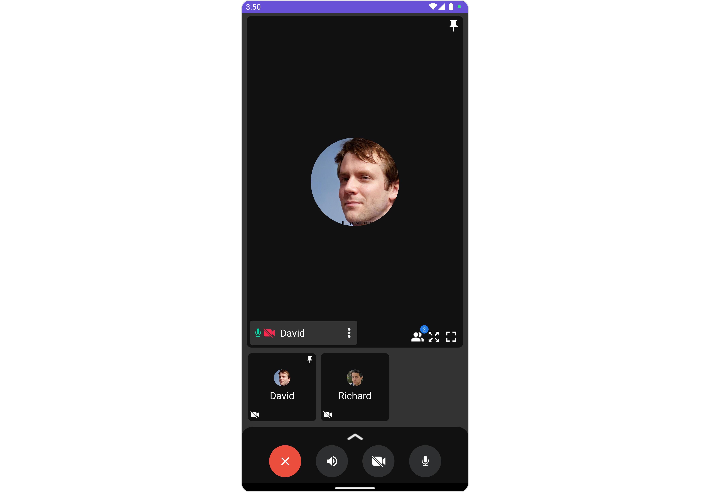

import Tabs from '@theme/Tabs';
import TabItem from '@theme/TabItem';

## Overview

The `CometChatOngoingCall` is a [Component](/ui-kit/android/components-overview#components) that provides users with a dedicated interface for managing real-time voice or video conversations. It includes features like a video display area for video calls, call controls for mic and camera management, participant information, call status indicators, and options for call recording and screen-sharing.



---

## Usage

### Integration

`CometChatOngoingCall` being a custom component, offers versatility in its integration. It can be seamlessly launched via button clicks or any user-triggered action, enhancing the overall user experience and facilitating smoother interactions within the application.

Since `CometChatOngoingCall` can be launched by adding the following code snippet into the XML layout file.

<Tabs>

<TabItem value="XML" label="XML">
```XML
<com.cometchat.chatuikit.calls.ongoingcall.CometChatOngoingCall
    android:id="@+id/ongoing_call"
    android:layout_width="match_parent"
    android:layout_height="match_parent" />
```
</TabItem>

</Tabs>

If you're defining the `CometChatOngoingCall` within the XML code or in your activity or fragment then you'll need to extract them and set them on the session ID and receiver type using the appropriate method and call the `.startCall()` method to join the call.

<Tabs>

<TabItem value="Java" label="Java">
```Java
CometChatOngoingCall cometchatOngoingCall = binding.ongoingCall; // 'binding' is a view binding instance. Initialize it with `binding = YourXmlFileNameBinding.inflate(getLayoutInflater());` to use views like `binding.ongoingCall` after enabling view binding.

cometchatOngoingCall.setReceiverType(CometChatConstants.RECEIVER_TYPE_USER); //Required
cometchatOngoingCall.setSessionId("SESSION_ID"); //Required
cometchatOngoingCall.startCall(); //To start the call

````
</TabItem>

<TabItem value="Kotlin" label="Kotlin">
```Kotlin
val cometchatOngoingCall: CometChatOngoingCall = binding.ongoingCall // 'binding' is a view binding instance. Initialize it with `binding = YourXmlFileNameBinding.inflate(layoutInflater)` to use views like `binding.ongoingCall` after enabling view binding.

cometchatOngoingCall.setReceiverType(CometChatConstants.RECEIVER_TYPE_USER) //Required
cometchatOngoingCall.setSessionId("SESSION_ID") //Required
cometchatOngoingCall.startCall() //To start the call
````

</TabItem>

</Tabs>

##### Activity and Fragment

You can integrate `CometChatOngoingCall` into your Activity and Fragment by adding the following code snippets into the respective classes.

<Tabs>

<TabItem value="Java (Activity)" label="Java (Activity)">

```Java title="YourActivity.java"
CometChatOngoingCall cometchatOngoingCall;

@Override
protected void onCreate(Bundle savedInstanceState) {
    super.onCreate(savedInstanceState);

    cometchatOngoingCall = new CometChatOngoingCall(this);
    cometchatOngoingCall.setReceiverType(CometChatConstants.RECEIVER_TYPE_USER); //Required
    cometchatOngoingCall.setSessionId("SESSION_ID"); //Required

    setContentView(cometchatOngoingCall);

    cometchatOngoingCall.startCall(); //To start the call
}
```

</TabItem>

<TabItem value="Kotlin (Activity)" label="Kotlin (Activity)">

```Java title="YourActivity.kt"
private lateinit var cometchatOngoingCall: CometChatOngoingCall

override fun onCreate(savedInstanceState: Bundle?) {
    super.onCreate(savedInstanceState)

    cometchatOngoingCall = CometChatOngoingCall(this)
    cometchatOngoingCall.setReceiverType(CometChatConstants.RECEIVER_TYPE_USER) //Required
    cometchatOngoingCall.setSessionId("SESSION_ID") //Required

    setContentView(cometchatOngoingCall)

    cometchatOngoingCall.startCall() //To start the call
}
```

</TabItem>

<TabItem value="Java (Fragment)" label="Java (Fragment)">

```Java title="YourFragment.java"
CometChatOngoingCall cometchatOngoingCall;

@Override
public View onCreateView(@NonNull LayoutInflater inflater, ViewGroup container, Bundle savedInstanceState) {
    cometchatOngoingCall = new CometChatOngoingCall(requireContext());
    cometchatOngoingCall.setReceiverType(CometChatConstants.RECEIVER_TYPE_USER); //Required
    cometchatOngoingCall.setSessionId("SESSION_ID"); //Required

    return cometchatOngoingCall;
}

@Override
public void onViewCreated(@NonNull View view, Bundle savedInstanceState) {
    super.onViewCreated(view, savedInstanceState);

    cometchatOngoingCall.startCall();
}
```

</TabItem>

<TabItem value="Kotlin (Fragment)" label="Kotlin (Fragment)">

```Kotlin title="YourFragment.kt"
private lateinit var cometchatOngoingCall: CometChatOngoingCall

override fun onCreateView(
    inflater: LayoutInflater,
    container: ViewGroup?,
    savedInstanceState: Bundle?
): View {
    cometchatOngoingCall = CometChatOngoingCall(requireContext())
    cometchatOngoingCall.setReceiverType(CometChatConstants.RECEIVER_TYPE_USER) //Required
    cometchatOngoingCall.setSessionId("SESSION_ID") //Required

    return cometchatOngoingCall
}

override fun onViewCreated(view: View, savedInstanceState: Bundle?) {
    super.onViewCreated(view, savedInstanceState)

    cometchatOngoingCall.startCall()
}
```

</TabItem>

</Tabs>

---

### Actions

[Actions](/ui-kit/android/components-overview#actions) dictate how a component functions. They are divided into two types: Predefined and User-defined. You can override either type, allowing you to tailor the behavior of the component to fit your specific needs.

##### 1. setOnError

You can customize this behavior by using the provided code snippet to override the `setOnError` and improve error handling.

<Tabs>

<TabItem value="Java" label="Java">
```Java
cometchatOngoingCall.setOnError(new OnError() {
    @Override
    public void onError(Context context, CometChatException e) {
        //TODO
    }
});
```
</TabItem>

<TabItem value="Kotlin" label="Kotlin">
```Kotlin
cometchatOngoingCall.setOnError(OnError { context, e -> 
    //TODO
})
```
</TabItem>

</Tabs>

---

### Filters

**Filters** allow you to customize the data displayed in a list within a Component. You can filter the list based on your specific criteria, allowing for a more customized. Filters can be applied using RequestBuilders of Chat SDK.

You can adjust the `callSettingsBuilder` in the `OnGoing Call` Component to customize the OnGoing Call. Numerous options are available to alter the builder to meet your specific needs. For additional details on `CallSettingsBuilder`, please visit [CallSettingsBuilder](/sdk/android/direct-calling).

##### 1. CallSettingsBuilder

The [CallSettingsBuilder](/sdk/android/direct-calling) enables you to filter and customize the call list based on available parameters in CallSettingsBuilder. This feature allows you to create more specific and targeted queries during the call. The following are the parameters available in [CallSettingsBuilder](/sdk/android/direct-calling)

**Example**

In the example below, we are applying a filter to the calls.

<Tabs>

<TabItem value="Java" label="Java">
```Java
CometChatCalls.CallSettingsBuilder callSettingsBuilder = new CometChatCalls.CallSettingsBuilder(this);
callSettingsBuilder.showRecordingButton(true);
callSettingsBuilder.autoRecordOnCallStart(true);
callSettingsBuilder.setIsAudioOnly(true);
cometchatOngoingCall.setCallSettingsBuilder(callSettingsBuilder);
```
</TabItem>

<TabItem value="Kotlin" label="Kotlin">
```Kotlin
val callSettingsBuilder = CometChatCalls.CallSettingsBuilder(this)
callSettingsBuilder.showRecordingButton(true)
callSettingsBuilder.autoRecordOnCallStart(true)
callSettingsBuilder.setIsAudioOnly(true)
cometchatOngoingCall.setCallSettingsBuilder(callSettingsBuilder)
```
</TabItem>

</Tabs>

---

### Events

[Events](/ui-kit/android/components-overview#events) are emitted by a `Component`. By using event you can extend existing functionality. Being global events, they can be applied in Multiple Locations and are capable of being Added or Removed.

Events emitted by the Ongoing Call component are as follows.

| Event           | Description                                      |
| --------------- | ------------------------------------------------ |
| **ccCallEnded** | Triggers when the ongoing or outgoing call ends. |

##### Add CometChatCallEvents

<Tabs>

<TabItem value="Java" label="Java">
```Java
CometChatCallEvents.addListener("UNIQUE_ID", new CometChatCallEvents() {
    @Override
    public void ccCallEnded(Call call) {
        super.ccCallEnded(call);
    }
});
```
</TabItem>

<TabItem value="Kotlin" label="Kotlin">
```Kotlin
CometChatCallEvents.addListener("UNIQUE_ID", object : CometChatCallEvents() {
    override fun ccCallEnded(call: Call?) {
        super.ccCallEnded(call)
    }
})
```
</TabItem>

</Tabs>

---

##### Remove CometChatCallEvents

<Tabs>

<TabItem value="Java" label="Java">
```Java
CometChatCallEvents.removeListener("LISTENER_ID_USED_FOR_ADDING_THIS_LISTENER");
```
</TabItem>

<TabItem value="Kotlin" label="Kotlin">
```Kotlin
CometChatCallEvents.removeListener("LISTENER_ID_USED_FOR_ADDING_THIS_LISTENER")
```
</TabItem>

</Tabs>

---

## Customization

To fit your app's design requirements, you can customize the appearance of the conversation component. We provide exposed methods that allow you to modify the experience and behavior according to your specific needs.

---

### Style

Using Style you can customize the look and feel of the component in your app, These parameters typically control elements such as the color, size, shape, and fonts used within the component.

##### OngoingCallStyle

Allows you to set styling properties for CometChatOngoingCall widget

| Property          | Description                      | Code                             |
| ----------------- | -------------------------------- | -------------------------------- |
| **Background**    | Used to set the background color | `.setBackground(@ColorInt int)`  |
| **Border Width**  | Used to set border               | `.setBorderWidth(int)`           |
| **Border Color**  | Used to set border color         | `.setBorderColor(@ColorInt int)` |
| **Corner Radius** | Used to set border radius        | `.setCornerRadius(float)`        |
| **Background**    | Used to set background Drawable  | `.setBackground(Drawable)`       |

<Tabs>
<TabItem value="java" label="Java">

```Java
OngoingCallStyle ongoingCallStyle = new OngoingCallStyle();
ongoingCallStyle.setBorderWidth(10);
ongoingCallStyle.setCornerRadius(50);
ongoingCallStyle.setBorderColor(getColor(R.color.yellow));
cometchatOngoingCall.setStyle(ongoingCallStyle);
```

</TabItem>

<TabItem value="kotlin" label="Kotlin">

```kotlin
val ongoingCallStyle = OngoingCallStyle()
ongoingCallStyle.setBorderWidth(10)
ongoingCallStyle.setCornerRadius(50f)
ongoingCallStyle.setBorderColor(getColor(R.color.yellow))
cometchatOngoingCall.setStyle(ongoingCallStyle)
```

</TabItem>
</Tabs>

---

### Functionality

These are a set of small functional customizations that allow you to fine-tune the overall experience of the component. With these, you can change text, set custom icons, and toggle the visibility of UI elements.

| Property          | Description                                                                  | Code                       |
| ----------------- | ---------------------------------------------------------------------------- | -------------------------- |
| **Call Type**     | Sets the type of call, distinguishing between audio and video calls.         | `.setCallType(String)`     |
| **Receiver Type** | Specifies whether the call recipient is an individual user or a group.       | `.setReceiverType(String)` |
| **Session ID**    | Sets the unique identifier for the session, essential for initiating a call. | `.setSessionId(String)`    |

##### Example

<Tabs>

<TabItem value="Java" label="Java">
```Java
CometChatCalls.CallSettingsBuilder callSettingsBuilder = new CometChatCalls.CallSettingsBuilder(this);
callSettingsBuilder.setIsAudioOnly(true);
cometchatOngoingCall.setCallSettingsBuilder(callSettingsBuilder);
cometchatOngoingCall.startCall();
```
</TabItem>

<TabItem value="Kotlin" label="Kotlin">
```Kotlin
val callSettingsBuilder = CometChatCalls.CallSettingsBuilder(this)
callSettingsBuilder.setIsAudioOnly(true)
cometchatOngoingCall.setCallSettingsBuilder(callSettingsBuilder)
cometchatOngoingCall.startCall()
```
</TabItem>

</Tabs>

---

### Advanced

For advanced-level customization, you can set custom views to the component. This lets you tailor each aspect of the component to fit your exact needs and application aesthetics. You can create and define your views, layouts, and UI elements and then incorporate those into the component.

The `CometChatOngoingCall` component does not provide additional functionalities beyond this level of customization.

---

import { Tooltip } from 'react-tooltip'
import 'react-tooltip/dist/react-tooltip.css'

<Tooltip
  id="my-tooltip-html-prop"
  html="Not available Configuration Object"
/>

---
