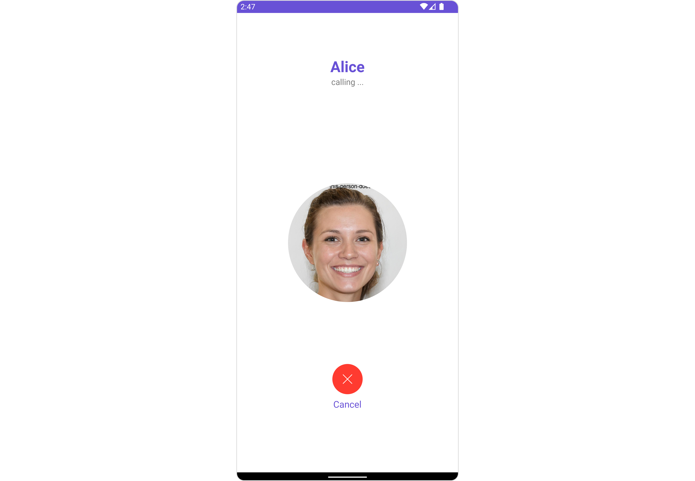

import Tabs from '@theme/Tabs';
import TabItem from '@theme/TabItem';

## Overview

The `CometChatOutgoingCall` [Component](/ui-kit/android/components-overview#components) is a visual representation of a user-initiated call, whether it's a voice or video call. It serves as an interface for managing outgoing calls, providing users with essential options to control the call experience. This component typically includes information about the call recipient, call controls for canceling the call, and feedback on the call status, such as indicating when the call is in progress.



---

## Usage

### Integration

`CometChatOutgoingCall` being a custom component, offers versatility in its integration. It can be seamlessly launched via button clicks or any user-triggered action, enhancing the overall user experience and facilitating smoother interactions within the application.

Since `CometChatOutgoingCall` can be launched by adding the following code snippet into the XML layout file.

<Tabs>

<TabItem value="XML" label="XML">
```XML
<com.cometchat.chatuikit.calls.outgoingcall.CometChatOutgoingCall
    android:id="@+id/outgoing_call"
    android:layout_width="match_parent"
    android:layout_height="match_parent" />
```
</TabItem>

</Tabs>

If you're defining the `CometChatOutgoingCall` within the XML code or in your activity or fragment then you'll need to extract them and set the User object or Call object using the appropriate method.

<Tabs>

<TabItem value="Java" label="Java">
```Java
CometChatOutgoingCall cometchatOutgoingCall = binding.outgoingCall; // 'binding' is a view binding instance. Initialize it with `binding = YourXmlFileNameBinding.inflate(getLayoutInflater());` to use views like `binding.outgoingCall` after enabling view binding.

User user = new User();
user.setUid(""); //Required
user.setName(""); //Required
user.setAvatar(""); //Required

cometchatOutgoingCall.setUser(user); //Required - set the user object
//OR
cometchatOutgoingCall.setCall(call); //Required - set the call object

````
</TabItem>

<TabItem value="Kotlin" label="Kotlin">
```Kotlin
val cometchatOutgoingCall: CometChatOutgoingCall = binding.outgoingCall // 'binding' is a view binding instance. Initialize it with `binding = YourXmlFileNameBinding.inflate(layoutInflater)` to use views like `binding.outgoingCall` after enabling view binding.


val user = User()
user.uid = "" //Required
user.name = "" //Required
user.avatar = "" //Required

cometchatOutgoingCall.setUser(user) //Required - set the user object
//OR
cometchatOutgoingCall.setCall(call) //Required - set the call object
````

</TabItem>

</Tabs>

##### Activity and Fragment

You can integrate `CometChatOutgoingCall` into your Activity and Fragment by adding the following code snippets into the respective classes.

<Tabs>

<TabItem value="Java (Activity)" label="Java (Activity)">

```Java title="YourActivity.java"
CometChatOutgoingCall cometchatOutgoingCall;

@Override
protected void onCreate(Bundle savedInstanceState) {
    super.onCreate(savedInstanceState);

    cometchatOutgoingCall = new CometChatOutgoingCall(this);

    User user = new User();
    user.setUid(""); //Required
    user.setName(""); //Required
    user.setAvatar(""); //Required

    cometchatOutgoingCall.setUser(user); //Required - set the user object
    //OR
    cometchatOutgoingCall.setCall(call); //Required - set the call object

    setContentView(cometchatOutgoingCall);
}
```

</TabItem>

<TabItem value="Kotlin (Activity)" label="Kotlin (Activity)">

```Java title="YourActivity.kt"
private lateinit var cometchatOutgoingCall: CometChatOutgoingCall

override fun onCreate(savedInstanceState: Bundle?) {
    super.onCreate(savedInstanceState)

    cometchatOutgoingCall = CometChatOutgoingCall(this)

    val user = User()
    user.uid = "" //Required
    user.name = "" //Required
    user.avatar = "" //Required

    cometchatOutgoingCall.setUser(user) //Required - set the user object
    //OR
    cometchatOutgoingCall.setCall(call) //Required - set the call object

    setContentView(cometchatOutgoingCall)
}
```

</TabItem>

<TabItem value="Java (Fragment)" label="Java (Fragment)">

```Java title="YourFragment.java"
CometChatOutgoingCall cometchatOutgoingCall;

@Override
public View onCreateView(@NonNull LayoutInflater inflater, ViewGroup container, Bundle savedInstanceState) {
    cometchatOutgoingCall = new CometChatOutgoingCall(requireContext());

    User user = new User();
    user.setUid(""); //Required
    user.setName(""); //Required
    user.setAvatar(""); //Required

    cometchatOutgoingCall.setUser(user); //Required - set the user object
    //OR
    cometchatOutgoingCall.setCall(call); //Required - set the call object

    return cometchatOutgoingCall;
}
```

</TabItem>

<TabItem value="Kotlin (Fragment)" label="Kotlin (Fragment)">

```Kotlin title="YourFragment.kt"
private lateinit var cometchatOutgoingCall: CometChatOutgoingCall

override fun onCreateView(
    inflater: LayoutInflater,
    container: ViewGroup?,
    savedInstanceState: Bundle?
): View {
    cometchatOutgoingCall = CometChatOutgoingCall(requireContext())

    val user = User()
    user.uid = "" //Required
    user.name = "" //Required
    user.avatar = "" //Required

    cometchatOutgoingCall.setUser(user) //Required - set the user object
    //OR
    cometchatOutgoingCall.setCall(call) //Required - set the call object

    return cometchatOutgoingCall
}
```

</TabItem>

</Tabs>

---

### Actions

[Actions](/ui-kit/android/components-overview#actions) dictate how a component functions. They are divided into two types: Predefined and User-defined. You can override either type, allowing you to tailor the behavior of the component to fit your specific needs.

##### 1. SetOnDeclineCallClick

The `setOnDeclineCallClick` action is typically triggered when the call is ended, carrying out default actions. However, with the following code snippet, you can effortlessly customize or override this default behavior to meet your specific needs.

<Tabs>

<TabItem value="Java" label="Java">
```Java
cometchatOutgoingCall.setOnDeclineCallClick(new OnClick() {
    @Override
    public void onClick() {
        //TODO
    }
});
```
</TabItem>

<TabItem value="Kotlin" label="Kotlin">
```Kotlin
cometchatOutgoingCall.setOnDeclineCallClick(OnClick { 
    //TODO
})
```
</TabItem>

</Tabs>

---

### Filters

**Filters** allow you to customize the data displayed in a list within a Component. You can filter the list based on your specific criteria, allowing for a more customized. Filters can be applied using RequestBuilders of Chat SDK.

The OutgoingCall component does not have any exposed filters.

---

### Events

[Events](/ui-kit/android/components-overview#events) are emitted by a `Component`. By using event you can extend existing functionality. Being global events, they can be applied in Multiple Locations and are capable of being Added or Removed.

Events emitted by the Outgoing call component are as follows.

| Event                      | Description                                  |
| -------------------------- | -------------------------------------------- |
| **onOutgoingCallAccepted** | Triggers when the outgoing call is accepted. |
| **onOutgoingCallRejected** | Triggers when the outgoing call is rejected. |

##### Add CometChatCallEvents

<Tabs>

<TabItem value="Java" label="Java">
```Java
CometChatCallEvents.addListener("UNIQUE_ID", new CometChatCallEvents() {
    @Override
    public void ccCallAccepted(Call call) {
        super.ccCallAccepted(call);
    }

    @Override
    public void ccCallRejected(Call call) {
        super.ccCallRejected(call);
    }

});

````
</TabItem>

<TabItem value="Kotlin" label="Kotlin">
```Kotlin
CometChatCallEvents.addListener("UNIQUE_ID", object : CometChatCallEvents() {
    override fun ccCallAccepted(call: Call) {
        super.ccCallAccepted(call)
    }

    override fun ccCallRejected(call: Call) {
        super.ccCallRejected(call)
    }
})
````

</TabItem>

</Tabs>

---

##### Remove CometChatCallEvents

<Tabs>

<TabItem value="Java" label="Java">
```Java
CometChatCallEvents.removeListener("LISTENER_ID_USED_FOR_ADDING_THIS_LISTENER");
```
</TabItem>

<TabItem value="Kotlin" label="Kotlin">
```Kotlin
CometChatCallEvents.removeListener("LISTENER_ID_USED_FOR_ADDING_THIS_LISTENER")
```
</TabItem>

</Tabs>

---

## Customization

To fit your app's design requirements, you can customize the appearance of the conversation component. We provide exposed methods that allow you to modify the experience and behavior according to your specific needs.

### Style

Using Style you can customize the look and feel of the component in your app, These parameters typically control elements such as the color, size, shape, and fonts used within the component.

##### 1. OutgoingCall Style

You can customize the appearance of the `OutgoingCallStyle` Component by applying the `OutgoingCallStyle` to it using the following code snippet.

<!--  -->

<Tabs>

<TabItem value="Java" label="Java">
```Java
OutgoingCallStyle style=new OutgoingCallStyle()
        .setBackground(getResources().getColor(R.color.white_300))
        .setSubTitleColor(getResources().getColor(R.color.red))
        .setTitleColor(getResources().getColor(R.color.red));
cometchatOutgoingCall.setStyle(style);
```
</TabItem>

<TabItem value="Kotlin" label="Kotlin">
```Kotlin
val style: OutgoingCallStyle = OutgoingCallStyle()
    .setBackground(getResources().getColor(R.color.white_300))
    .setSubTitleColor(getResources().getColor(R.color.red))
    .setTitleColor(getResources().getColor(R.color.red))
cometchatOutgoingCall.setStyle(style)
```
</TabItem>

</Tabs>

List of properties exposed by OutgoingCallStyle

| Property                | Description                                      | Code                                    |
| ----------------------- | ------------------------------------------------ | --------------------------------------- |
| **Background**          | Used to set the background color                 | `.setBackground(@ColorInt int)`         |
| **Background**          | Used to set background gradient                  | `.setBackground(Drawable)`              |
| **Border Width**        | Used to set border                               | `.setBorderWidth(int)`                  |
| **Corner Radius**       | Used to set border radius                        | `.setCornerRadius(float)`               |
| **Border Color**        | Used to set border color                         | `.setBorderColor(@ColorInt int)`        |
| **Title Appearance**    | Used to customise the appearance of the title    | `.setTitleAppearance(@StyleRes int)`    |
| **SubTitle Appearance** | Used to customise the appearance of the subtitle | `.setSubTitleAppearance(@StyleRes int)` |

##### 2. Avatar Styles

To apply customized styles to the `Avatar` component in the OutgoingCall Component, you can use the following code snippet. For further insights on `Avatar` Styles [refer](/ui-kit/android/avatar#avatarstyle)

<Tabs>

<TabItem value="Java" label="Java">
```Java
AvatarStyle avatarStyle = new AvatarStyle()
        .setBorderColor(getResources().getColor(R.color.yellow))
        .setBorderWidth(10);
cometchatOutgoingCall.setAvatarStyle(avatarStyle);
```
</TabItem>

<TabItem value="Kotlin" label="Kotlin">
```Kotlin
val avatarStyle = AvatarStyle()
    .setBorderColor(getResources().getColor(R.color.yellow))
    .setBorderWidth(10)
cometchatOutgoingCall.setAvatarStyle(avatarStyle)
```
</TabItem>

</Tabs>

##### 3. Button Styles

To apply customized styles to the `Button` component in the OutgoingCall Component, you can use the following code snippet.

<Tabs>

<TabItem value="Java" label="Java">
```Java
ButtonStyle buttonStyle = new ButtonStyle().setButtonBackgroundColor(getResources().getColor(R.color.yellow));
cometchatOutgoingCall.setDeclineButtonStyle(buttonStyle);
```
</TabItem>

<TabItem value="Kotlin" label="Kotlin">
```Kotlin
val buttonStyle = ButtonStyle().setButtonBackgroundColor(getResources().getColor(R.color.yellow))
cometchatOutgoingCall.setDeclineButtonStyle(buttonStyle)
```
</TabItem>

</Tabs>

---

### Functionality

These are a set of small functional customizations that allow you to fine-tune the overall experience of the component. With these, you can change text, set custom icons, and toggle the visibility of UI elements.

**Example**

In this example, we're enhancing the interface by customizing the decline button icons. By setting custom icons for decline buttons, users can enjoy a more visually appealing and personalized experience.

This level of customization allows developers to tailor the user interface to match the overall theme and branding of their application.

<!--  -->

<Tabs>

<TabItem value="Java" label="Java">
```Java
cometchatOutgoingCall.setDeclineButtonIcon(R.drawable.ic_call);
cometchatOutgoingCall.setDeclineButtonText("Your Text");
cometchatOutgoingCall.setOnDeclineCallClick(new OnClick() {
    @Override
    public void onClick() {
        //TODO
    }
});
```
</TabItem>

<TabItem value="Kotlin" label="Kotlin">
```Kotlin
cometchatOutgoingCall.setDeclineButtonIcon(R.drawable.ic_call)
cometchatOutgoingCall.setDeclineButtonText("Your Text")
cometchatOutgoingCall.setOnDeclineCallClick(OnClick { 
    //TODO
})
```
</TabItem>

</Tabs>

Below is a list of customizations along with corresponding code snippets

| Property                | Description                                                                      | Code                                        |
| ----------------------- | -------------------------------------------------------------------------------- | ------------------------------------------- |
| **Call**                | Used to set the Call object against which we need to display the outgoing screen | `.set(Call: Call)`                          |
| **User**                | Used to set the User object against which we need to display the outgoing screen | `.set(User: User)`                          |
| **Decline Button Text** | Used to set the Decline Button Text                                              | `.set(DeclineButtonText: String)`           |
| **Decline Button Icon** | Used to set the Decline button icon                                              | `.set(DeclineButtonIcon: @DrawableRes int)` |

### Advanced

For advanced-level customization, you can set custom views to the component. This lets you tailor each aspect of the component to fit your exact needs and application aesthetics. You can create and define your views, layouts, and UI elements and then incorporate those into the component.

The `CometChatOutgoingCall` component does not provide additional functionalities beyond this level of customization.

import { Tooltip } from 'react-tooltip'
import 'react-tooltip/dist/react-tooltip.css'

<Tooltip
  id="my-tooltip-html-prop"
  html="Not available Configuration Object"
/>
