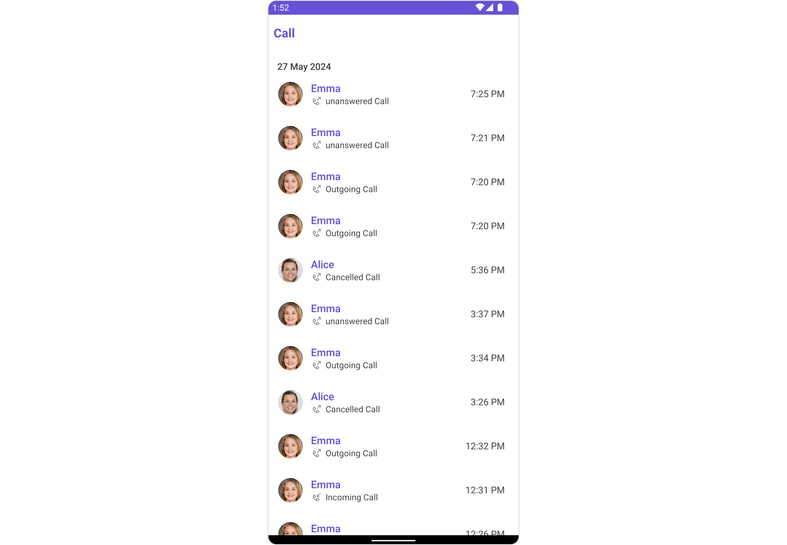
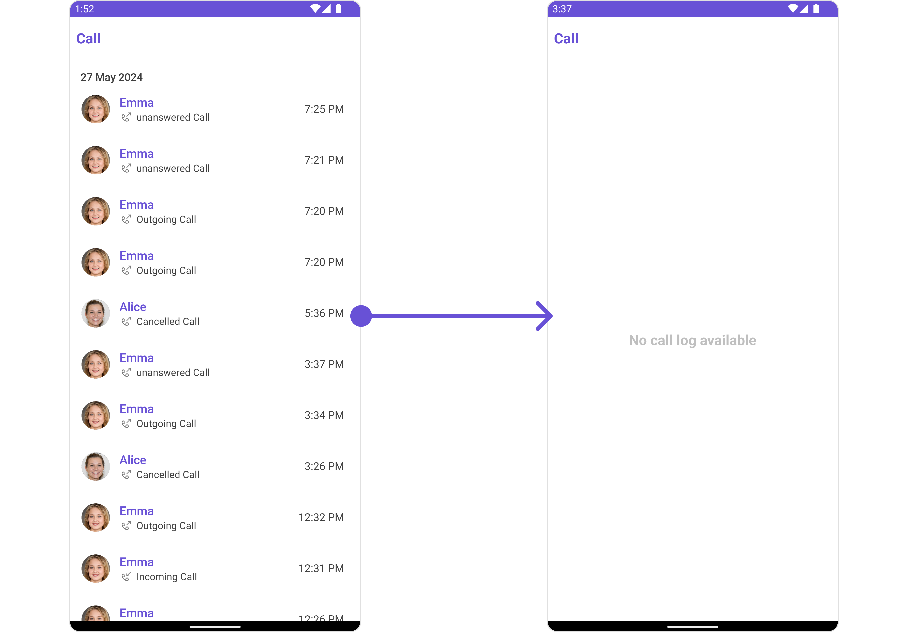
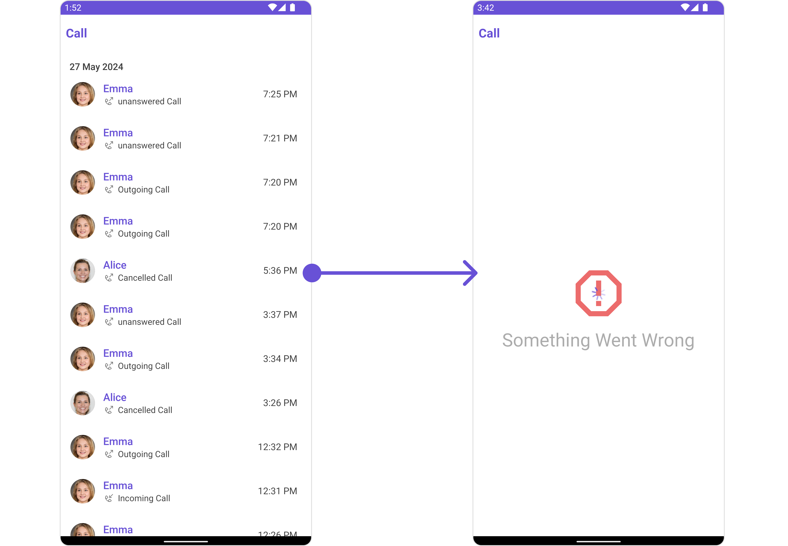

import Tabs from '@theme/Tabs';
import TabItem from '@theme/TabItem';

## Overview

`CometChatCallLogs` is a [Component](/ui-kit/android/components-overview#components) that shows the list of Call Logs available. By default, names are shown for all listed users, along with their avatars if available.



The `CometChatCallLogs` component is composed of the following BaseComponents:

| Components                                     | Description                                                                                                                                                                              |
| ---------------------------------------------- | ---------------------------------------------------------------------------------------------------------------------------------------------------------------------------------------- |
| [CometChatListBase](/ui-kit/android/list-base) | `CometChatListBase` is a container component featuring a title, customizable background options, and a dedicated list view for seamless integration within your application's interface. |
| [CometChatListItem](/ui-kit/android/list-item) | This component displays data retrieved from a CallLog object on a card, presenting a title and subtitle.                                                                                 |

## Usage

### Integration

`CometChatCallLogs` being a wrapper component, offers versatility in its integration. It can be seamlessly launched via button clicks or any user-triggered action, enhancing the overall user experience and facilitating smoother interactions within the application.

Since `CometChatCallLogs` can be launched by adding the following code snippet to the XML layout file.

<Tabs>

<TabItem value="XML" label="XML">
```XML
<com.cometchat.chatuikit.calls.calllogs.CometChatCallLogs
    android:id="@+id/call_log"
    android:layout_width="match_parent"
    android:layout_height="match_parent" />
```
</TabItem>

</Tabs>

If you're defining the `CometChatCallLogs` within the XML code or in your activity or fragment then you'll need to extract them and set them on the User object using the appropriate method.

<Tabs>

<TabItem value="Java" label="Java">
```Java
CometChatCallLogs cometchatCallLogs = binding.callLog; // 'binding' is a view binding instance. Initialize it with `binding = YourXmlFileNameBinding.inflate(getLayoutInflater());` to use views like `binding.callLog` after enabling view binding.
```
</TabItem>

<TabItem value="Kotlin" label="Kotlin">
```Kotlin
val cometchatCallLogs: CometChatCallLogs = binding.callLog // 'binding' is a view binding instance. Initialize it with `binding = YourXmlFileNameBinding.inflate(layoutInflater)` to use views like `binding.callLog` after enabling view binding.
```
</TabItem>

</Tabs>

##### Activity and Fragment

You can integrate `CometChatCallLogs` into your Activity and Fragment by adding the following code snippets into the respective classes.

<Tabs>

<TabItem value="Java (Activity)" label="Java (Activity)">

```Java title="YourActivity.java"
CometChatCallLogs cometchatCallLogs;

@Override
protected void onCreate(Bundle savedInstanceState) {
    super.onCreate(savedInstanceState);

    cometchatCallLogs = new CometChatCallLogs(this);

    setContentView(cometchatCallLogs);
}
```

</TabItem>

<TabItem value="Kotlin (Activity)" label="Kotlin (Activity)">

```Java title="YourActivity.kt"
private lateinit var cometchatCallLogs: CometChatCallLogs

override fun onCreate(savedInstanceState: Bundle?) {
    super.onCreate(savedInstanceState)

    cometchatCallLogs = CometChatCallLogs(this);

    setContentView(cometchatCallLogs)
}
```

</TabItem>

<TabItem value="Java (Fragment)" label="Java (Fragment)">

```Java title="YourFragment.java"
CometChatCallLogs cometchatCallLogs;

@Override
public View onCreateView(@NonNull LayoutInflater inflater, ViewGroup container, Bundle savedInstanceState) {

    cometchatCallLogs = new CometChatCallLogs(requireContext());

    return cometchatCallLogs;
}
```

</TabItem>

<TabItem value="Kotlin (Fragment)" label="Kotlin (Fragment)">

```Kotlin title="YourFragment.kt"
private lateinit var cometchatCallLogs: CometChatCallLogs

override fun onCreateView(
    inflater: LayoutInflater?, container: ViewGroup?,
    savedInstanceState: Bundle?
): View {

    cometchatCallLogs = new CometChatCallLogs(requireContext());

    return cometchatCallLogs
}
```

</TabItem>

</Tabs>

### Actions

[Actions](/ui-kit/android/components-overview#actions) dictate how a component functions. They are divided into two types: Predefined and User-defined. You can override either type, allowing you to tailor the behavior of the component to fit your specific needs.

##### 1. SetOnItemClickListener

This method proves valuable when users seek to override the onItemClick functionality within CometChatCallLogs, empowering them with greater control and customization options.

The `setOnItemClickListener` action doesn't have a predefined behavior. You can override this action using the following code snippet.

<Tabs>

<TabItem value="Java" label="Java">
```Java
cometchatCallLogs.setOnItemClickListener(new OnItemClickListener<CallLog>() {
    @Override
    public void OnItemClick(CallLog callLog, int i) {
        //TODO
    }
});
```
</TabItem>

<TabItem value="Kotlin" label="Kotlin">
```Kotlin
cometchatCallLogs.setOnItemClickListener(object : OnItemClickListener<CallLog?>() {
    override fun OnItemClick(callLog: CallLog, i: Int) {
        //TODO
    }
})
```
</TabItem>

</Tabs>

##### 2. OnError

You can customize this behavior by using the provided code snippet to override the `OnError` and improve error handling.

<Tabs>

<TabItem value="Java" label="Java">
```Java
cometchatCallLogs.setOnError(new OnError() {
    @Override
    public void onError(Context context, CometChatException e) {
        //TODO
    }
});
```
</TabItem>

<TabItem value="Kotlin" label="Kotlin">
```Kotlin
cometchatCallLogs.setOnError(OnError { context, e -> 
    //TODO
})
```
</TabItem>

</Tabs>

---

### Filters

**Filters** allow you to customize the data displayed in a list within a Component. You can filter the list based on your specific criteria, allowing for a more customized. Filters can be applied using RequestBuilders of Chat SDK.

##### 1. CallLogRequestBuilder

The [CallLogRequestBuilder](/sdk/android/call-logs) enables you to filter and customize the call list based on available parameters in CallLogRequestBuilder. This feature allows you to create more specific and targeted queries during the call. The following are the parameters available in [CallLogRequestBuilder](/sdk/android/call-logs)

**Example**

In the example below, we are applying a filter based on the limit and have a call recording.

<Tabs>

<TabItem value="Java" label="Java">
```Java
CallLogRequest.CallLogRequestBuilder callLogRequestBuilder = new CallLogRequest.CallLogRequestBuilder()
        .setLimit(20)
        .setHasRecording(true);

cometchatCallLogs.setCallLogRequestBuilder(callLogRequestBuilder);

````
</TabItem>

<TabItem value="Kotlin" label="Kotlin">
```Kotlin
val callLogRequestBuilder = CallLogRequestBuilder()
    .setLimit(20)
    .setHasRecording(true)

cometchatCallLogs.setCallLogRequestBuilder(callLogRequestBuilder)
````

</TabItem>

</Tabs>

| Property           | Description                                         | Code                                      |
| ------------------ | --------------------------------------------------- | ----------------------------------------- |
| **Limit**          | Sets the limit for the call logs request            | `.setLimit(int limit)`                    |
| **Call Type**      | Sets the call type for the call logs request        | `.setCallType(String callType)`           |
| **Call Status**    | Sets the call status for the call logs request      | `.setCallStatus(String callStatus)`       |
| **Has Recording**  | Sets the recording status for the call logs request | `.setHasRecording(boolean hasRecording)`  |
| **Call Direction** | Sets the call direction for the call logs request   | `.setCallDirection(String callDirection)` |
| **UID**            | Sets the user ID for the call logs request          | `.setUid(String uid)`                     |
| **GUID**           | Sets the group ID for the call logs request         | `.setGuid(String guid)`                   |
| **Call Category**  | Sets the call category for the call logs request    | `.setCallCategory(String callCategory)`   |
| **Auth Token**     | Sets the auth token for the call logs request       | `.setAuthToken(String authToken)`         |

---

### Events

[Events](/ui-kit/android/components-overview#events) are emitted by a `Component`. By using event you can extend existing functionality. Being global events, they can be applied in Multiple Locations and are capable of being Added or Removed.

The `CometChatCallLogs` component does not have any exposed events.

---

## Customization

To fit your app's design requirements, you can customize the appearance of the conversation component. We provide exposed methods that allow you to modify the experience and behavior according to your specific needs.

### Style

Using Style you can customize the look and feel of the component in your app, These parameters typically control elements such as the color, size, shape, and fonts used within the component.

##### 1. CallLogs Style

You can customize the appearance of the `CometChatCallLogs` Component by applying the `CallLogsStyle` to it using the following code snippet.

<!--  -->

<Tabs>

<TabItem value="Java" label="Java">
```Java
CallLogsStyle callLogsStyle = new CallLogsStyle();
callLogsStyle.setBackground(Color.parseColor("#C0C0C0"));
callLogsStyle.setTitleColor(Color.RED);

cometchatCallLogs.setStyle(callLogsStyle);

````
</TabItem>

<TabItem value="Kotlin" label="Kotlin">
```Kotlin
val callLogsStyle = CallLogsStyle()
callLogsStyle.setBackground(Color.parseColor("#C0C0C0"))
callLogsStyle.setTitleColor(Color.RED)

cometchatCallLogs.setStyle(callLogsStyle)
````

</TabItem>

</Tabs>

List of properties exposed by CallLogStyle

| Property                          | Description                                                                                                 | Code                                           |
| --------------------------------- | ----------------------------------------------------------------------------------------------------------- | ---------------------------------------------- |
| **Back Icon Tint**                | Used to set the color of the back icon in the app bar                                                       | `.setBackIconTint(@ColorInt int)`              |
| **Background**                    | Used to set background Drawable                                                                             | `.setBackground(Drawable)`                     |
| **Background**                    | Used to set the background color                                                                            | `.setBackground(@ColorInt int)`                |
| **Border Color**                  | Used to set border color                                                                                    | `.setBorderColor(@ColorInt int)`               |
| **Border Width**                  | Used to set border                                                                                          | `.setBorderWidth(int)`                         |
| **Call Status Color**             | Used to set the Call Status color                                                                           | `.setCallStatusColor(@ColorInt int)`           |
| **CornerRadius**                  | Used to set border radius                                                                                   | `.setCornerRadius(float)`                      |
| **Empty Text Appearance**         | Used to set the style of the response text shown when fetching the list of group members has returned empty | `.setEmptyTextAppearance(@StyleRes int)`       |
| **Error Text Appearance**         | Used to set the style of the response text shown in case some error occurs while fetching group members     | `.setErrorTextAppearance(@StyleRes int)`       |
| **Header Separator Color**        | Used to set the color of the divider separating the CallLog items                                           | `.setHeaderSeparatorColor(@ColorInt int)`      |
| **Info Icon Tint**                | Used to set the info icon color                                                                             | `.setInfoIconTint(@ColorInt int)`              |
| **Incoming Audio Call Icon Tint** | Used to set the color of the Incoming Audio Call Icon                                                       | `.setIncomingAudioCallIconTint(@ColorInt int)` |
| **Incoming Video Call Icon Tint** | Used to set the color of the Incoming Video Call Icon                                                       | `.setIncomingVideoCallIconTint(@ColorInt int)` |
| **Loading Icon Tint**             | Used to set the color of the icon shown while the list of group members is being fetched                    | `.setLoadingIconTint(@ColorInt int)`           |
| **Missed Audio Call Icon Tint**   | Used to set the color of the Missed Audio Call Icon                                                         | `.setMissedAudioCallIconTint(@ColorInt int)`   |
| **Missed Call Title Color**       | Used to set the Missed Call Title color                                                                     | `.setMissedCallTitleColor(@ColorInt int)`      |
| **Missed Video Call Icon Tint**   | Used to set the color of the Missed Video Call Icon                                                         | `.setMissedVideoCallIconTint(@ColorInt int)`   |
| **Outgoing Audio Call Icon Tint** | Used to set the color of the Outgoing Audio Call Icon                                                       | `.setOutgoingAudioCallIconTint(@ColorInt int)` |
| **Outgoing Video Call Icon Tint** | Used to set the color of the Outgoing Video Call Icon                                                       | `.setOutgoingVideoCallIconTint(@ColorInt int)` |
| **SubTitle Appearance**           | Used to customise the appearance of the subtitle in the app bar                                             | `.setSubTitleAppearance(@StyleRes int)`        |
| **Title Appearance**              | Used to customise the appearance of the title in the app bar                                                | `.setTitleAppearance(@StyleRes int)`           |

---

##### 2. Avatar Styles

To apply customized styles to the `Avatar` component in the `CallLogs` Component, you can use the following code snippet. For further insights on `Avatar` Styles [refer](/ui-kit/android/avatar#avatarstyle)

<Tabs>

<TabItem value="Java" label="Java">
```Java
AvatarStyle avatarStyle = new AvatarStyle()
        .setBorderColor(Color.RED)
        .setBorderWidth(10);

cometchatCallLogs.setAvatarStyle(avatarStyle);

````
</TabItem>

<TabItem value="Kotlin" label="Kotlin">
```Kotlin
val avatarStyle = AvatarStyle()
    .setBorderColor(Color.RED)
    .setBorderWidth(10)

cometchatCallLogs.setAvatarStyle(avatarStyle)
````

</TabItem>

</Tabs>

##### 3. ListItem Styles

To apply customized styles to the `ListItemStyle` component in the `CallLogs` Component, you can use the following code snippet. For further insights on `ListItemStyle` Styles [refer](/ui-kit/android/list-item)

<!--  -->

<Tabs>

<TabItem value="Java" label="Java">
```Java
ListItemStyle listItemStyle = new ListItemStyle();
listItemStyle.setBorderWidth(4);
listItemStyle.setCornerRadius(20);
listItemStyle.setBorderColor(Color.parseColor("#6851D6"));
listItemStyle.setBackground(Color.parseColor("#C0C0C0"));

cometchatCallLogs.setListItemStyle(listItemStyle);

````
</TabItem>

<TabItem value="Kotlin" label="Kotlin">
```Kotlin
val listItemStyle = ListItemStyle()
listItemStyle.setBorderWidth(4)
listItemStyle.setCornerRadius(20f)
listItemStyle.setBorderColor(Color.parseColor("#6851D6"))
listItemStyle.setBackground(Color.parseColor("#C0C0C0"))

cometchatCallLogs.setListItemStyle(listItemStyle)
````

</TabItem>

</Tabs>

---

### Functionality

These are a set of small functional customizations that allow you to fine-tune the overall experience of the component. With these, you can change text, set custom icons, and toggle the visibility of UI elements.

<Tabs>

<TabItem value="Java" label="Java">
```Java
cometchatCallLogs.setTitle("Your Title");
cometchatCallLogs.hideSearch(true);
cometchatCallLogs.showHeaderSeparator(false);
```
</TabItem>

<TabItem value="Kotlin" label="Kotlin">
```Kotlin
cometchatCallLogs.setTitle("Your Title")
cometchatCallLogs.hideSearch(true)
cometchatCallLogs.showHeaderSeparator(false)
```
</TabItem>

</Tabs>

Below is a list of customizations along with corresponding code snippets

| Property                         | Description                                                                             | Code                                          |
| -------------------------------- | --------------------------------------------------------------------------------------- | --------------------------------------------- |
| **Back Icon**                    | Used to set the back button icon                                                        | `.backIcon(@DrawableRes int res)`             |
| **Empty State Text**             | Used to set a custom text response when fetching the users has returned an empty list   | `emptyStateText(String)`                      |
| **Error State Text**             | Used to set a custom text response when some error occurs on fetching the list of users | `errorStateText(String)`                      |
| **Hide Error**                   | Used to hide error on fetching users                                                    | `.hideError(boolean)`                         |
| **Set Call**                     | Used to set the call object for displaying the incoming call screen                     | `.setCall(Call)`                              |
| **Set Incoming Audio Call Icon** | Used to set the Incoming Audio Call icon                                                | `.setIncomingAudioCallIcon(@DrawableRes int)` |
| **Set Incoming Video Call Icon** | Used to set the Incoming Video Call icon                                                | `.setIncomingVideoCallIcon(@DrawableRes int)` |
| **Set Outgoing Video Call Icon** | Used to set the Outgoing Video Call icon                                                | `.setOutgoingVideoCallIcon(@DrawableRes int)` |
| **Set Outgoing Audio Call Icon** | Used to set the Outgoing Audio Call icon                                                | `.setOutgoingAudioCallIcon(@DrawableRes int)` |
| **Set Title**                    | Used to set title in the app bar                                                        | `.setTitle(String)`                           |
| **Set User**                     | Used to set User object to the call button                                              | `.setUser(User)`                              |
| **Set Voice Button Text**        | Used to set voice call text                                                             | `.setVoiceButtonText(String)`                 |
| **Set Video Button Text**        | Used to set video call text                                                             | `.setVideoButtonText(String)`                 |

---

### Advanced

For advanced-level customization, you can set custom views to the component. This lets you tailor each aspect of the component to fit your exact needs and application aesthetics. You can create and define your views, layouts, and UI elements and then incorporate those into the component.

#### SetEmptyStateView <a data-tooltip-id="my-tooltip-html-prop"> <span class="material-icons red">report</span> </a>

You can set a custom EmptyView using `.setEmptyStateView()` to match the empty view of your app.

<Tabs>

<TabItem value="Java" label="Java">
```Java
cometchatCallLogs.setEmptyStateView();
```
</TabItem>

<TabItem value="Kotlin" label="Kotlin">
```Kotlin
cometchatCallLogs.setEmptyStateView()
```
</TabItem>

</Tabs>

**Examples**



We have added an error view to `empty_view_layout.xml`. You can choose any view you prefer. This view should be inflated and passed to the `setEmptyStateView()` method.

```xml title="empty_view_layout.xml"
<?xml version="1.0" encoding="utf-8"?>
<RelativeLayout xmlns:android="http://schemas.android.com/apk/res/android"
    android:layout_width="match_parent"
    android:layout_height="match_parent"
    android:layout_gravity="center_vertical">

    <TextView
        android:id="@+id/txt_title"
        android:layout_width="wrap_content"
        android:layout_height="wrap_content"
        android:layout_centerInParent="true"
        android:text="No call log available"
        android:textColor="@color/cometchat_grey"
        android:textSize="20sp"
        android:textStyle="bold" />

</RelativeLayout>
```

<Tabs>

<TabItem value="Java" label="Java">

```Java title="YourActivity.java"
cometchatCallLogs.setEmptyStateView(R.layout.empty_view_layout);
```

</TabItem>
<TabItem value="Kotlin" label="Kotlin">

```Kotlin title="YourActivity..kt"
cometchatCallLogs.setEmptyStateView(R.layout.empty_view_layout)
```

</TabItem>

</Tabs>

---

#### SetErrorStateView <a data-tooltip-id="my-tooltip-html-prop"> <span class="material-icons red">report</span> </a>

You can set a custom `ErrorStateView` using `setErrorStateView` to match the error view of your app.

<Tabs>

<TabItem value="Java" label="Java">

```Java
cometchatCallLogs.setErrorStateView();
```

</TabItem>

<TabItem value="Kotlin" label="Kotlin">

```Kotlin
cometchatCallLogs.setErrorStateView()
```

</TabItem>

</Tabs>

**Example**



We have added an error view to `error_state_view_layout.xml`. You can choose any view you prefer. This view should be inflated and passed to the `setErrorStateView()` method.

```xml title="error_state_view_layout.xml"
<?xml version="1.0" encoding="utf-8"?>
<RelativeLayout xmlns:android="http://schemas.android.com/apk/res/android"
    android:layout_width="match_parent"
    android:layout_height="match_parent">

    <ImageView
        android:id="@+id/img_error"
        android:layout_width="100dp"
        android:layout_height="100dp"
        android:layout_centerInParent="true"
        android:src="@drawable/ic_error" />

    <TextView
        android:layout_width="wrap_content"
        android:layout_height="wrap_content"
        android:layout_below="@+id/img_error"
        android:layout_centerHorizontal="true"
        android:layout_marginTop="50dp"
        android:text="Something Went Wrong"
        android:textSize="30sp" />

</RelativeLayout>
```

<Tabs>

<TabItem value="Java" label="Java">

```Java title="YourActivity.java"
cometchatCallLogs.setErrorStateView(R.layout.error_state_view_layout);
```

</TabItem>
<TabItem value="Kotlin" label="Kotlin">
```Kotlin title="YourActivity.kt"
cometchatCallLogs.setErrorStateView(R.layout.error_state_view_layout);
```

</TabItem>

</Tabs>

import { Tooltip } from 'react-tooltip'
import 'react-tooltip/dist/react-tooltip.css'

<Tooltip
  id="my-tooltip-html-prop"
  html="Not available in Configuration Object"
/>
