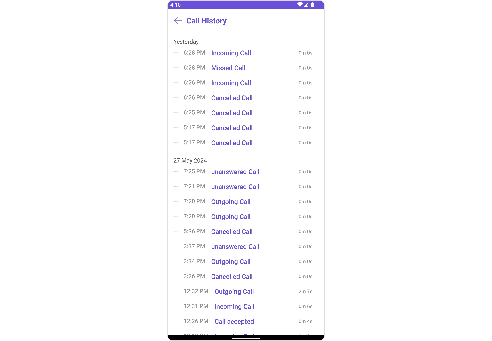
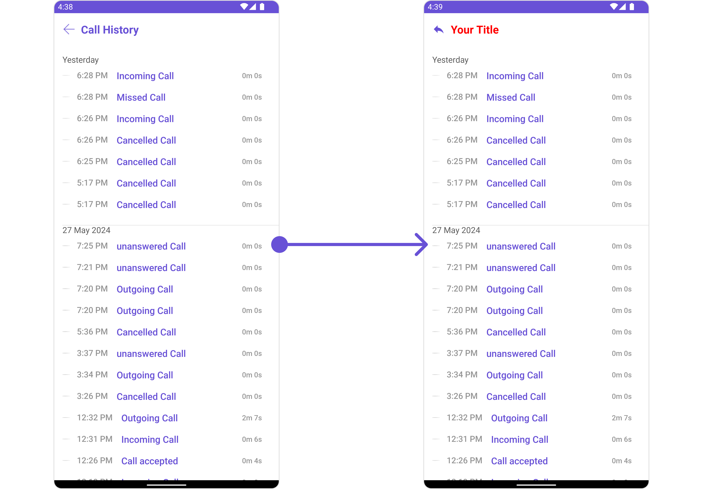
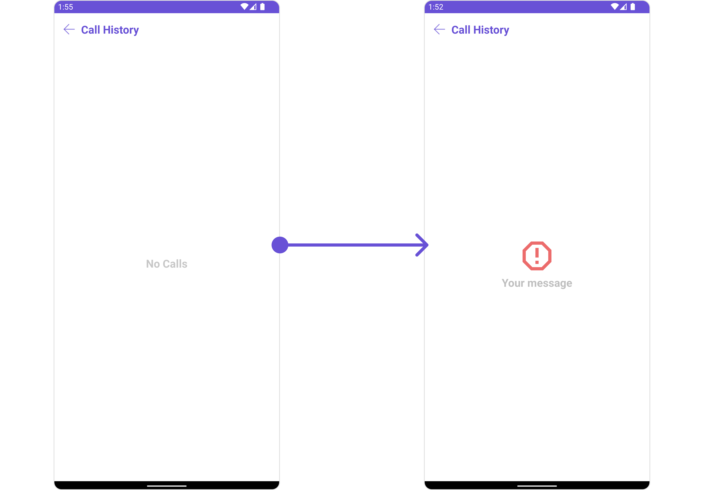
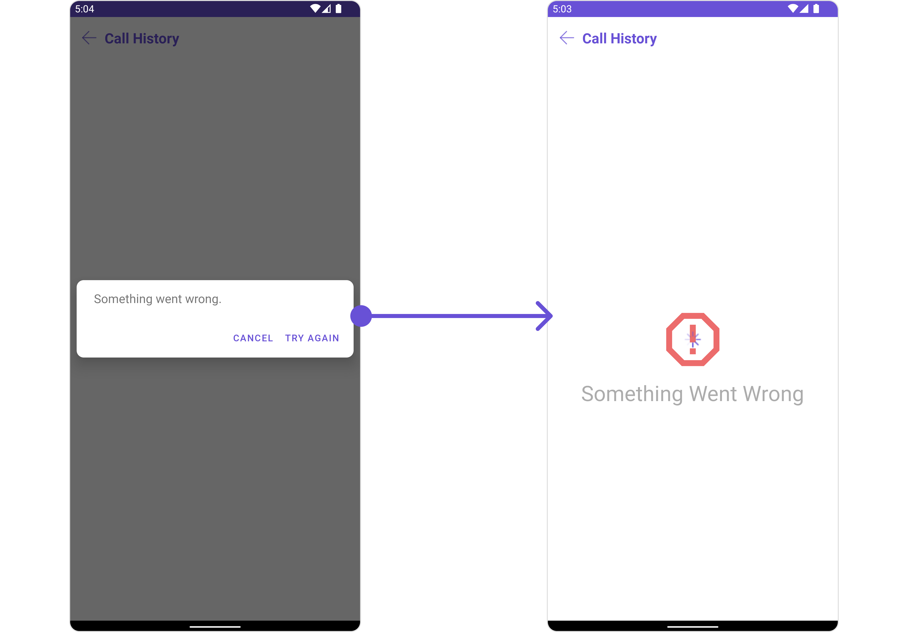

import Tabs from '@theme/Tabs';
import TabItem from '@theme/TabItem';

## Overview

`CometChatCallLogHistory` is a [Component](/ui-kit/android/components-overview#components) that shows a paginated list of all the calls between the logged-in user & another user or group. This allows the user to see all the calls with a specific user/group they have initiated/received/missed.



The `CometChatCallLogHistory` component is composed of the following BaseComponents:

| Components                                     | Description                                                                                                                                                                              |
| ---------------------------------------------- | ---------------------------------------------------------------------------------------------------------------------------------------------------------------------------------------- |
| [CometChatListBase](/ui-kit/android/list-base) | `CometChatListBase` is a container component featuring a title, customizable background options, and a dedicated list view for seamless integration within your application's interface. |
| [CometChatListItem](/ui-kit/android/list-item) | This component displays data retrieved from a CallLog object on a card, presenting a title and subtitle.                                                                                 |

## Usage

### Integration

`CometChatCallLogHistory` is a Component, it can be seamlessly presented within your application. To display the details of a CallLog, you simply need to pass the corresponding CallLog object to the `CometChatCallLogHistory` instance using its setCallLog property. This enables you to efficiently showcase specific call log details within your application's interface.

Since `CometChatCallLogHistory` can be launched by adding the following code snippet into the XML layout file.

<Tabs>

<TabItem value="XML" label="XML">
```XML
<com.cometchat.chatuikit.calls.callhistory.CometChatCallLogHistory
    android:id="@+id/call_history"
    android:layout_width="match_parent"
    android:layout_height="match_parent" />
```
</TabItem>

</Tabs>

If you're defining the `CometChatCallLogHistory` within the XML code or in your activity or fragment then you'll need to extract them.

<Tabs>

<TabItem value="Java" label="Java">
```Java
CometChatCallLogHistory cometchatCallLogHistory = binding.callHistory; // 'binding' is a view binding instance. Initialize it with `binding = YourXmlFileNameBinding.inflate(getLayoutInflater());` to use views like `binding.callHistory` after enabling view binding.
```
</TabItem>

<TabItem value="Kotlin" label="Kotlin">
```Kotlin
val cometchatCallLogHistory: CometChatCallLogHistory = binding.callHistory // 'binding' is a view binding instance. Initialize it with `binding = YourXmlFileNameBinding.inflate(layoutInflater)` to use views like `binding.callHistory` after enabling view binding.
```
</TabItem>

</Tabs>

##### Activity and Fragment

You can integrate `CometChatCallLogHistory` into your Activity and Fragment by adding the following code snippets into the respective classes.

<Tabs>

<TabItem value="Java (Activity)" label="Java (Activity)">

```Java title="YourActivity.java"
CometChatCallLogHistory cometchatCallLogHistory;

@Override
protected void onCreate(Bundle savedInstanceState) {
    super.onCreate(savedInstanceState);

    cometchatCallLogHistory = new CometChatCallLogHistory(this);

    setContentView(cometchatCallLogHistory);
}
```

</TabItem>

<TabItem value="Kotlin (Activity)" label="Kotlin (Activity)">

```Java title="YourActivity.kt"
private lateinit var cometchatCallLogHistory: CometChatCallLogHistory

override fun onCreate(savedInstanceState: Bundle?) {
    super.onCreate(savedInstanceState)

    cometchatCallLogHistory = CometChatCallLogHistory(this)

    setContentView(cometchatCallLogHistory)
}
```

</TabItem>

<TabItem value="Java (Fragment)" label="Java (Fragment)">

```Java title="YourFragment.java"
CometChatCallLogHistory cometchatCallLogHistory;

@Override
public View onCreateView(@NonNull LayoutInflater inflater, ViewGroup container, Bundle savedInstanceState) {
    cometchatCallLogHistory = new CometChatCallLogHistory(requireActivity());

    return cometchatCallLogHistory;
}
```

</TabItem>

<TabItem value="Kotlin (Fragment)" label="Kotlin (Fragment)">

```Kotlin title="YourFragment.kt"
private lateinit var cometchatCallLogHistory: CometChatCallLogHistory

override fun onCreateView(
    inflater: LayoutInflater,
    container: ViewGroup?,
    savedInstanceState: Bundle?
): View {
    cometchatCallLogHistory = CometChatCallLogHistory(requireActivity())
    return cometchatCallLogHistory
}
```

</TabItem>

</Tabs>

---

### Actions

[Actions](/ui-kit/android/components-overview#actions) dictate how a component functions. They are divided into two types: Predefined and User-defined. You can override either type, allowing you to tailor the behavior of the component to fit your specific needs.

<!-- The `Call Log History` component does not have any exposed Actions. -->

##### 1. SetOnItemClickListener

This method proves valuable when users seek to override onItemClick functionality within CometChatCallLogsWithDetails, empowering them with greater control and customization options.

The `setOnItemClickListener` action doesn't have a predefined behavior. You can override this action using the following code snippet.

<Tabs>

<TabItem value="Java" label="Java">
```Java
cometchatCallLogHistory.setOnItemClickListener(new OnItemClickListener<CallLog>() {
    @Override
    public void OnItemClick(CallLog callLog, int i) {
        //TODO
    }
});
```
</TabItem>

<TabItem value="Kotlin" label="Kotlin">
```Kotlin
cometchatCallLogHistory.setOnItemClickListener(object : OnItemClickListener<CallLog?>() {
    fun OnItemClick(callLog: CallLog, i: Int) {
        //TODO
    }
})
```
</TabItem>

</Tabs>

---

### Filters

**Filters** allow you to customize the data displayed in a list within a Component. You can filter the list based on your specific criteria, allowing for a more customized. Filters can be applied using RequestBuilders of Chat SDK.

##### 1. CallLogRequestBuilder

The [CallLogRequestBuilder](/sdk/android/call-logs) enables you to filter and customize the call list based on available parameters in CallLogRequestBuilder. This feature allows you to create more specific and targeted queries during the call. The following are the parameters available in [CallLogRequestBuilder](/sdk/android/call-logs)

<Tabs>

<TabItem value="Java" label="Java">
```Java
CallLogRequest.CallLogRequestBuilder callLogRequestBuilder = new CallLogRequest.CallLogRequestBuilder()
        .setLimit(10);
cometchatCallLogHistory.setCallLogRequestBuilder(callLogRequestBuilder);
```
</TabItem>

<TabItem value="Kotlin" label="Kotlin">
```Kotlin
val callLogRequestBuilder = CallLogRequestBuilder()
    .setLimit(10)
cometchatCallLogHistory.setCallLogRequestBuilder(callLogRequestBuilder)
```
</TabItem>

</Tabs>

| Property           | Description                                         | Code                                      |
| ------------------ | --------------------------------------------------- | ----------------------------------------- |
| **Limit**          | Sets the limit for the call logs request            | `setLimit(limit: int)`                    |
| **Call Type**      | Sets the call type for the call logs request        | `setCallType(callType: String)`           |
| **Call Status**    | Sets the call status for the call logs request      | `setCallStatus(callStatus: String)`       |
| **Has Recording**  | Sets the recording status for the call logs request | `setHasRecording(hasRecording: boolean)`  |
| **Call Category**  | Sets the call category for the call logs request    | `setCallCategory(callCategory: String)`   |
| **Call Direction** | Sets the call direction for the call logs request   | `setCallDirection(callDirection: String)` |
| **UID**            | Sets the user ID for the call logs request          | `setUid(uid: String)`                     |
| **GUID**           | Sets the group ID for the call logs request         | `setGuid(guid: String)`                   |
| **Auth Token**     | Sets the auth token for the call logs request       | `setAuthToken(authToken: String)`         |

---

### Events

[Events](/ui-kit/android/components-overview#events) are emitted by a `Component`. By using event you can extend existing functionality. Being global events, they can be applied in Multiple Locations and are capable of being Added or Removed.

The `CometChatCallLogHistory` component does not have any exposed events.

---

## Customization

To fit your app's design requirements, you can customize the appearance of the conversation component. We provide exposed methods that allow you to modify the experience and behavior according to your specific needs.

### Style

Using Style you can customize the look and feel of the component in your app, These parameters typically control elements such as the color, size, shape, and fonts used within the component.

##### 1. CallLogHistory Style

You can customize the appearance of the `CallLogHistoryStyle` Component by applying the `CallLogHistoryStyle` to it using the following code snippet.

<!--  -->

<Tabs>

<TabItem value="Java" label="Java">
```Java
CallLogHistoryStyle callLogHistoryStyle = new CallLogHistoryStyle();
callLogHistoryStyle.setBackground(Color.parseColor("#C0C0C0"));
callLogHistoryStyle.setCornerRadius(20);
callLogHistoryStyle.setCallDurationColor(Color.CYAN);
callLogHistoryStyle.setCallStatusColor(Color.RED);
callLogHistoryStyle.setTitleColor(Color.RED);

cometchatCallLogHistory.setStyle(callLogHistoryStyle);

````
</TabItem>

<TabItem value="Kotlin" label="Kotlin">
```Kotlin
var callLogHistoryStyle = CallLogHistoryStyle()
callLogHistoryStyle.setBackground(android.graphics.Color.parseColor("#C0C0C0"))
callLogHistoryStyle.setCornerRadius(20f)
callLogHistoryStyle.setCallDurationColor(android.graphics.Color.CYAN)
callLogHistoryStyle.setCallStatusColor(android.graphics.Color.RED)
callLogHistoryStyle.setTitleColor(android.graphics.Color.RED)

cometchatCallLogHistory.setStyle(callLogHistoryStyle)
````

</TabItem>

</Tabs>

List of properties exposed by `CallLogHistoryStyle`

| Property                       | Description                                                                                       | Code                                         |
| ------------------------------ | ------------------------------------------------------------------------------------------------- | -------------------------------------------- |
| **Background**                 | Used to set background color                                                                      | `.setBackground(@ColorInt int)`              |
| **Background**                 | Used to set background Drawable                                                                   | `.setBackground(Drawable)`                   |
| **Back Icon Tint**             | Used to set the color of the back icon in the app bar                                             | `.setBackIconTint(@ColorInt int)`            |
| **Border Color**               | Used to set border color                                                                          | `.setBorderColor(@ColorInt int)`             |
| **Border Width**               | Used to set border                                                                                | `.setBorderWidth(int)`                       |
| **Call Duration Color**        | Used to set Call Duration color.                                                                  | `.setCallDurationColor(@ColorInt int)`       |
| **Call Status Color**          | Used to set the Call Status color.                                                                | `.setCallStatusColor(@ColorInt int)`         |
| **Empty Text Appearance**      | Used to set the style of the response text shown when fetching the list of group members is empty | `.setEmptyTextAppearance(@StyleRes int)`     |
| **Error Text Appearance**      | Used to set the style of the response text shown in case some error occurs                        | `.setErrorTextAppearance(@StyleRes int)`     |
| **Header Separator Color**     | Used to set the color of the divider separating the CallLog items                                 | `.setHeaderSeparatorColor(@ColorInt int)`    |
| **Loading Icon Tint**          | Used to set the color of the icon shown while fetching the list of group members                  | `.setLoadingIconTint(@ColorInt int)`         |
| **List Item Background Color** | Used to set List Item Background color                                                            | `.setListItemBackgroundColor(@ColorInt int)` |
| **Title Appearance**           | Used to customise the appearance of the title in the app bar                                      | `.setTitleAppearance(@StyleRes int)`         |

##### 2. ListItem Styles

To apply customized styles to the `ListItemStyle` component in the `CallLogHistory` Component, you can use the following code snippet. For further insights on `ListItemStyle` Styles [refer](/ui-kit/android/list-item#set-listitem-style)

<!--  -->

<Tabs>

<TabItem value="Java" label="Java">
```Java
ListItemStyle listItemStyle = new ListItemStyle();
listItemStyle.setBackground(Color.parseColor("#C0C0C0"));
cometchatCallLogHistory.setListItemStyle(listItemStyle);
```
</TabItem>

<TabItem value="Kotlin" label="Kotlin">
```Kotlin
val listItemStyle = ListItemStyle()
listItemStyle.setBackground(Color.parseColor("#C0C0C0"))
cometchatCallLogHistory.setListItemStyle(listItemStyle)
```
</TabItem>

</Tabs>

---

### Functionality

These are a set of small functional customizations that allow you to fine-tune the overall experience of the component. With these, you can change text, set custom icons, and toggle the visibility of UI elements.



<Tabs>

<TabItem value="Java" label="Java">
```Java
cometchatCallLogHistory.setTitle("Your Title");
cometchatCallLogHistory.setTitleColor(Color.RED);
cometchatCallLogHistory.backIcon(R.drawable.ic_reply);
```
</TabItem>

<TabItem value="Kotlin" label="Kotlin">
```Kotlin
cometchatCallLogHistory.setTitle("Your Title")
cometchatCallLogHistory.setTitleColor(Color.RED)
cometchatCallLogHistory.backIcon(R.drawable.ic_reply)
```
</TabItem>

</Tabs>

List of methods exposed by `CometChatCallLogHistory`

| Property             | Description                                                                             | Code                              |
| -------------------- | --------------------------------------------------------------------------------------- | --------------------------------- |
| **Back Icon**        | Used to set back button icon                                                            | `.backIcon(@DrawableRes int res)` |
| **Empty State Text** | Used to set a custom text response when fetching the users has returned an empty list   | `.emptyStateText(String)`         |
| **Error State Text** | Used to set a custom text response when some error occurs on fetching the list of users | `.errorStateText(String)`         |
| **Hide Error**       | Used to hide error on fetching users                                                    | `.hideError(boolean)`             |
| **Set Title**        | Used to set title in the app bar                                                        | `.setTitle(String)`               |

---

### Advanced

For advanced-level customization, you can set custom views to the component. This lets you tailor each aspect of the component to fit your exact needs and application aesthetics. You can create and define your views, layouts, and UI elements and then incorporate those into the component.

#### SetEmptyStateView <a data-tooltip-id="my-tooltip-html-prop"> <span class="material-icons red">report</span> </a>

You can set a custom EmptyView using `setEmptyStateView()` to match the empty view of your app.

<Tabs>

<TabItem value="Java" label="Java">
```Java
cometchatCallLogHistory.setEmptyStateView();
```
</TabItem>

<TabItem value="Kotlin" label="Kotlin">
```Kotlin
cometchatCallLogHistory.setEmptyStateView()
```
</TabItem>

</Tabs>

Example



You need to create a `empty_view_layout.xml` as a custom view file. Which we will inflate and pass to `.setEmptyStateView()`.

```xml title="empty_view_layout.xml"
<?xml version="1.0" encoding="utf-8"?>
<LinearLayout xmlns:android="http://schemas.android.com/apk/res/android"
    android:layout_width="match_parent"
    android:layout_height="match_parent"
    android:gravity="center"
    android:orientation="vertical">

    <ImageView
        android:layout_width="70dp"
        android:layout_height="70dp"
        android:layout_above="@+id/txt_title"
        android:layout_centerHorizontal="true"
        android:src="@drawable/ic_error" />

    <TextView
        android:id="@+id/txt_title"
        android:layout_width="wrap_content"
        android:layout_height="wrap_content"
        android:layout_centerInParent="true"
        android:text="Your message"
        android:textColor="@color/cometchat_grey"
        android:textSize="20sp"
        android:textStyle="bold" />

</LinearLayout>
```

You inflate the view and pass it to `setEmptyStateView`. You can get the child view reference and can handle click actions.

<Tabs>

<TabItem value="Java" label="Java">
```Java
cometchatCallLogHistory.setEmptyStateView(R.layout.empty_view_layout);
```
</TabItem>

<TabItem value="Kotlin" label="Kotlin">
```Kotlin
cometchatCallLogHistory.setEmptyStateView(R.layout.empty_view_layout)
```
</TabItem>

</Tabs>

---

#### SetErrorStateView <a data-tooltip-id="my-tooltip-html-prop"> <span class="material-icons red">report</span> </a>

You can set a custom ErrorView using `setErrorStateView()` to match the error view of your app.

<Tabs>

<TabItem value="Java" label="Java">
```Java
cometchatCallLogHistory.setErrorStateView();
```
</TabItem>

<TabItem value="Kotlin" label="Kotlin">
```Kotlin
cometchatCallLogHistory.setErrorStateView()
```
</TabItem>

</Tabs>

Example



You need to create an `error_state_view_layout.xml` as a custom view file. Which we will inflate and pass to `.setErrorStateView()`.

```xml title="error_state_view_layout.xml"
<?xml version="1.0" encoding="utf-8"?>
<RelativeLayout xmlns:android="http://schemas.android.com/apk/res/android"
    android:layout_width="match_parent"
    android:layout_height="match_parent">

    <ImageView
        android:id="@+id/img_error"
        android:layout_width="100dp"
        android:layout_height="100dp"
        android:layout_centerInParent="true"
        android:src="@drawable/ic_error" />

    <TextView
        android:layout_width="wrap_content"
        android:layout_height="wrap_content"
        android:layout_below="@+id/img_error"
        android:layout_centerHorizontal="true"
        android:layout_marginTop="50dp"
        android:text="Something Went Wrong"
        android:textSize="30sp" />

</RelativeLayout>
```

You inflate the view and pass it to `setErrorStateView`. You can get the child view reference and can handle click actions.

<Tabs>

<TabItem value="Java" label="Java">
```Java
cometchatCallLogHistory.setErrorStateView(R.layout.error_state_view_layout);
```
</TabItem>

<TabItem value="Kotlin" label="Kotlin">
```Kotlin
cometchatCallLogHistory.setErrorStateView(R.layout.error_state_view_layout)
```
</TabItem>

</Tabs>

---

#### Menu

You can set the Custom Menu to add more options to the `CometChatCallLogHistory` component.

<Tabs>

<TabItem value="Java" label="Java">
```Java
cometchatCallLogHistory.setMenu();
```
</TabItem>

<TabItem value="Kotlin" label="Kotlin">
```Kotlin
cometchatCallLogHistory.setMenu()
```
</TabItem>

</Tabs>

Example

You need to create a `view_menu.xml` as a custom view file. Which we will inflate and pass to `.setMenu()`.

```xml title="view_menu.xml"
<?xml version="1.0" encoding="utf-8"?>
<LinearLayout xmlns:android="http://schemas.android.com/apk/res/android"
    xmlns:app="http://schemas.android.com/apk/res-auto"
    xmlns:tools="http://schemas.android.com/tools"
    android:layout_width="match_parent"
    android:layout_height="match_parent"
    android:orientation="horizontal">

    <ImageView
        android:id="@+id/img_refresh"
        android:layout_width="30dp"
        android:layout_height="30dp"
        android:src="@drawable/ic_refresh_black" />

</LinearLayout>
```

You inflate the view and pass it to `setMenu`. You can get the child view reference and can handle click actions.

<Tabs>

<TabItem value="Java" label="Java">

```Java title="YourActivity.java"
View view = getLayoutInflater().inflate(R.layout.view_menu, null);
ImageView imgRefresh = view.findViewById(R.id.img_refresh);
imgRefresh.setOnClickListener(v -> {
    Toast.makeText(this, "Clicked on Refresh", Toast.LENGTH_SHORT).show();
});
cometchatCallLogHistory.setMenu(view);
```

</TabItem>

<TabItem value="Kotlin" label="Kotlin">

```Kotlin title="YourActivity.kt"
val view: View = layoutInflater.inflate(R.layout.view_menu, null)
val imgRefresh = view.findViewById<ImageView>(R.id.img_refresh)
imgRefresh.setOnClickListener { v: View? ->
    Toast.makeText(this, "Clicked on Refresh", Toast.LENGTH_SHORT).show()
}
cometchatCallLogHistory.setMenu(view)
```

</TabItem>

</Tabs>

import { Tooltip } from 'react-tooltip'
import 'react-tooltip/dist/react-tooltip.css'

<Tooltip
  id="my-tooltip-html-prop"
  html="Not available Configuration Object"
/>
