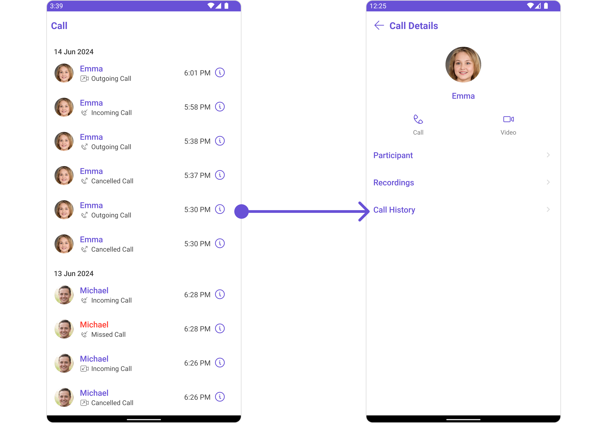
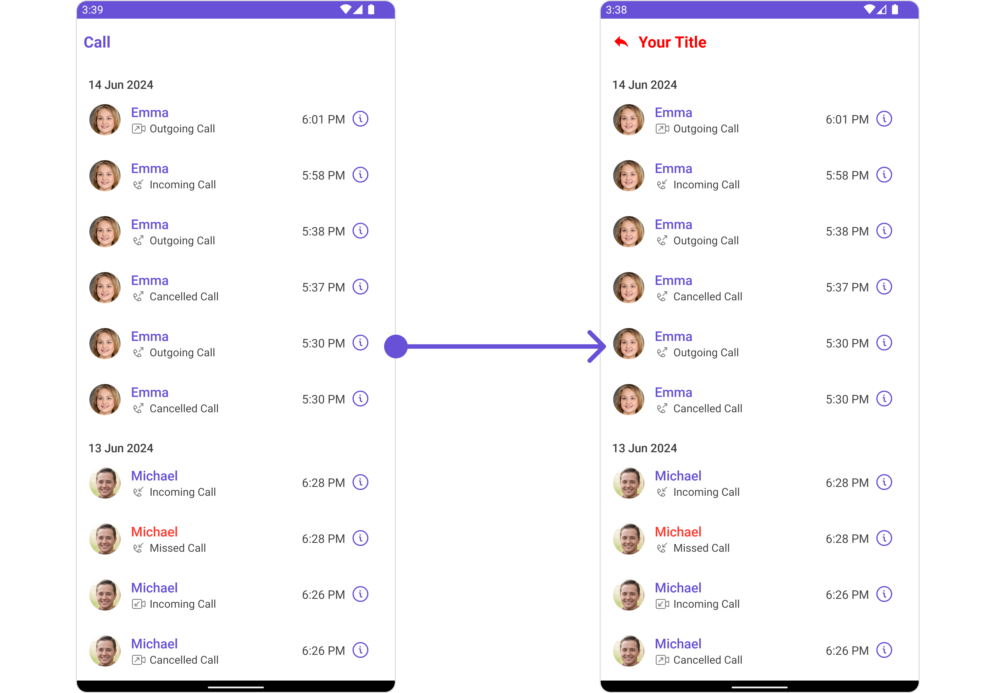
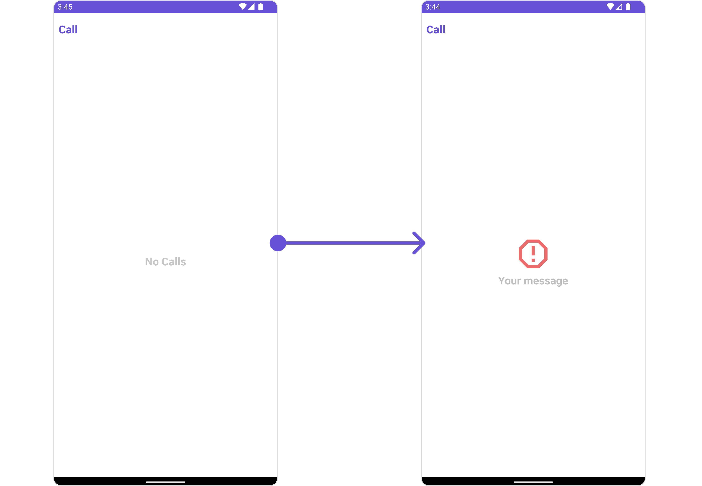
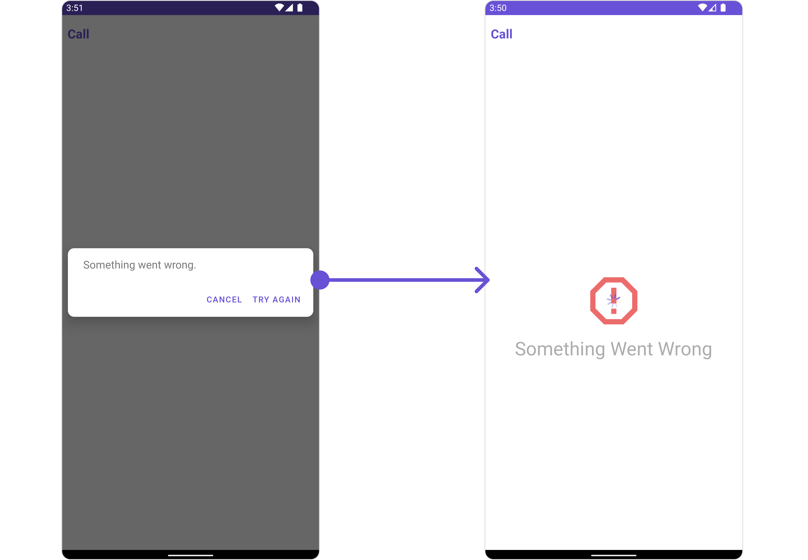
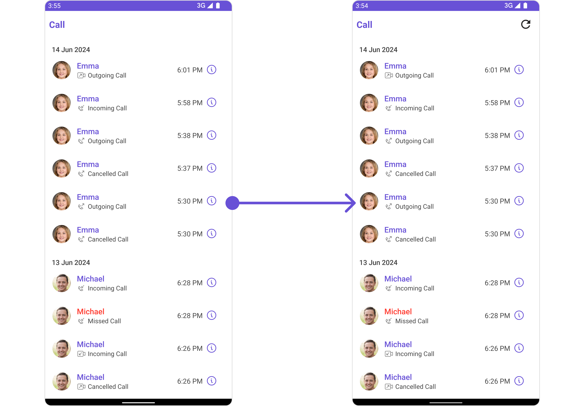

import Tabs from '@theme/Tabs';
import TabItem from '@theme/TabItem';

## Overview

The `CometChatCallLogsWithDetails` is a [Composite Component](/ui-kit/android/components-overview#composite-components) encompassing components such as [Call Logs](/ui-kit/android/call-logs) and [CometChatCallLogsWithDetails](/ui-kit/android/call-log-details). Both of these component contributes to the functionality and structure of the overall `CometChatCallLogsWithDetails` component.



---

## Usage

### Integration

`CometChatCallLogsWithDetails` is a composite component that seamlessly integrates into your application. You can push it onto the navigation stack using a navigation controller. This allows for easy navigation and efficient display of call log details within your application's interface.

`CometChatCallLogsWithDetails` can be launched by adding the following code snippet into the XML layout file.

<Tabs>

<TabItem value="xml" label="XML">

```xml
<com.cometchat.chatuikit.calls.callhistorywithdetails.CometChatCallLogsWithDetails
    android:id="@+id/call_log_with_details"
    android:layout_width="match_parent"
    android:layout_height="match_parent" />
```

</TabItem>

</Tabs>

If you're defining the `CometChatCallLogsWithDetails` within the XML code or in your activity or fragment then you'll need to extract them.

<Tabs>

<TabItem value="Java" label="Java">
```Java
CometChatCallLogsWithDetails cometchatCallLogsWithDetails = binding.callLogWithDetails; // 'binding' is a view binding instance. Initialize it with `binding = YourXmlFileNameBinding.inflate(getLayoutInflater());` to use views like `binding.callLogWithDetails` after enabling view binding.
```
</TabItem>

<TabItem value="Kotlin" label="Kotlin">
```Kotlin
val cometchatCallLogsWithDetails: CometChatCallLogsWithDetails = binding.callLogWithDetails // 'binding' is a view binding instance. Initialize it with `binding = YourXmlFileNameBinding.inflate(layoutInflater)` to use views like `binding.callLogWithDetails` after enabling view binding.
```
</TabItem>

</Tabs>

##### Activity and Fragment

You can integrate `CometChatCallLogsWithDetails` into your Activity and Fragment by adding the following code snippets into the respective classes.

<Tabs>

<TabItem value="Java (Activity)" label="Java (Activity)">

```Java title="YourActivity.java"
CometChatCallLogsWithDetails cometchatCallLogsWithDetails;

@Override
protected void onCreate(Bundle savedInstanceState) {
    super.onCreate(savedInstanceState);

    cometchatCallLogsWithDetails = new CometChatCallLogsWithDetails(this);

    setContentView(cometchatCallLogsWithDetails);
}
```

</TabItem>

<TabItem value="Kotlin (Activity)" label="Kotlin (Activity)">

```Kotlin title="YourActivity.kt"
private lateinit var cometchatCallLogsWithDetails: CometChatCallLogsWithDetails

override fun onCreate(savedInstanceState: Bundle?) {
    super.onCreate(savedInstanceState)

    cometchatCallLogsWithDetails = CometChatCallLogsWithDetails(this)

    setContentView(cometchatCallLogsWithDetails)
}
```

</TabItem>

<TabItem value="Java (Fragment)" label="Java (Fragment)">

```Java title="YourFragment.java"
CometChatCallLogsWithDetails cometchatCallLogsWithDetails;

@Override
public View onCreateView(@NonNull LayoutInflater inflater, ViewGroup container, Bundle savedInstanceState) {

    cometchatCallLogsWithDetails = new CometChatCallLogsWithDetails(requireActivity());

    return cometchatCallLogsWithDetails;
}
```

</TabItem>

<TabItem value="Kotlin (Fragment)" label="Kotlin (Fragment)">

```Kotlin title="YourFragment.kt"
private lateinit var cometchatCallLogsWithDetails: CometChatCallLogsWithDetails

override fun onCreateView(
    inflater: LayoutInflater,
    container: ViewGroup?,
    savedInstanceState: Bundle?
): View {
    cometchatCallLogsWithDetails = CometChatCallLogsWithDetails(requireActivity())

    return cometchatCallLogsWithDetails
}
```

</TabItem>

</Tabs>

---

### Actions

[Actions](/ui-kit/android/components-overview#actions) dictate how a component functions. They are divided into two types: Predefined and User-defined. You can override either type, allowing you to tailor the behavior of the component to fit your specific needs.

##### 1. SetOnItemClickListener

This method proves valuable when users seek to override `setOnItemClickListener()` functionality within CometChatCallLogsWithDetails, empowering them with greater control and customization options.

The `setOnItemClickListener()` action doesn't have a predefined behavior. You can override this action using the following code snippet.

<Tabs>

<TabItem value="Java" label="Java">
```Java
cometchatCallLogsWithDetails.setOnItemClickListener(new OnItemClickListener<CallLog>() {
    @Override
    public void OnItemClick(CallLog callLog, int i) {
        //TODO
    }
});
```
</TabItem>

<TabItem value="Kotlin" label="Kotlin">
```Kotlin
cometchatCallLogsWithDetails.setOnItemClickListener(object :
    OnItemClickListener<CallLog>() {
    override fun OnItemClick(callLog: CallLog, i: Int) {
        //TODO
    }
})
```
</TabItem>

</Tabs>

##### 2. setOnError

You can customize this behavior by using the provided code snippet to override the `setOnError()` and improve error handling.

<Tabs>

<TabItem value="Java" label="Java">
```Java
cometchatCallLogsWithDetails.setOnError(new OnError() {
    @Override
    public void onError(Context context, CometChatException e) {
        //TODO
    }
});
```
</TabItem>

<TabItem value="Kotlin" label="Kotlin">
```Kotlin
cometchatCallLogsWithDetails.setOnError(OnError { context, e ->
    //TODO
})
```
</TabItem>

</Tabs>

---

### Filters

**Filters** allow you to customize the data displayed in a list within a Component. You can filter the list based on your specific criteria, allowing for a more customized. Filters can be applied using RequestBuilders of Chat SDK.

While the `CometChatCallLogsWithDetails` component does not have filters, its components do, For more detail on individual filters of its component refer to [Call Logs](/ui-kit/android/call-logs) and [CometChatCallLogsWithDetails](/ui-kit/android/call-log-details).

By utilizing the [Configurations](#configurations) object of its components, you can apply filters.

##### 1. CallLogRequestBuilder

The [CallLogRequestBuilder](/ui-kit/android/call-logs) enables you to filter and customize the call list based on available parameters in CallLogRequestBuilder. This feature allows you to create more specific and targeted queries during the call. The following are the parameters available in [CallLogRequestBuilder](/ui-kit/android/call-logs)

| Property                      | Description                                    | Code                                    |
| ----------------------------- | ---------------------------------------------- | --------------------------------------- |
| **Call Status Icon Tint**     | Sets the tint color for the call status icon   | `.set(callStatusIconTint: UIColor)`     |
| **Call Status Text Font**     | Sets the font for the call status text         | `.set(callStatusTextFont: UIFont)`      |
| **Call Status Text Color**    | Sets the color for the call status text        | `.set(callStatusTextColor: UIColor)`    |
| **Call Time Text Font**       | Sets the font for the call time text           | `.set(callTimeTextFont: UIFont)`        |
| **Call Time Text Color**      | Sets the color for the call time text          | `.set(callTimeTextColor: UIColor)`      |
| **Date Separator Text Font**  | Sets the font for the date separator text      | `.set(dateSeparatorTextFont: UIFont)`   |
| **Date Separator Text Color** | Sets the color for the date separator text     | `.set(dateSeparatorTextColor: UIColor)` |
| **Empty State Text Font**     | Sets the font for the empty state text         | `.set(emptyStateTextFont: UIFont)`      |
| **Empty State Text Color**    | Sets the color for the empty state text        | `.set(emptyStateTextColor: UIColor)`    |
| **Error State Text Font**     | Sets the font for the error state text         | `.set(errorStateTextFont: UIFont)`      |
| **Error State Text Color**    | Sets the color for the error state text        | `.set(errorStateTextColor: UIColor)`    |
| **Info Icon Tint**            | Sets the tint color for the info icon          | `.set(infoIconTint: UIColor)`           |
| **Incoming Call Icon Tint**   | Sets the tint color for the incoming call icon | `.set(incomingCallIconTint: UIColor)`   |
| **Missed Call Icon Tint**     | Sets the tint color for the missed call icon   | `.set(missedCallIconTint: UIColor)`     |
| **Missed Call Title Tint**    | Sets the tint for the missed call title        | `.set(missedCallTitleTint: UIColor)`    |
| **Outgoing Call Icon Tint**   | Sets the tint color for the outgoing call icon | `.set(outgoingCallIconTint: UIColor)`   |

**Example**

In the example below, we are applying a filter based on limit and calltype.

<!--  -->

<Tabs>

<TabItem value="Java" label="Java">
```Java
CallLogRequest.CallLogRequestBuilder callLogRequestBuilder = new CallLogRequest.CallLogRequestBuilder()
        .setLimit(5)
        .setAuthToken(CometChat.getUserAuthToken())
        .setCallCategory(CometChatCallsConstants.CALL_CATEGORY_CALL);

cometchatCallLogsWithDetails.setCallLogRequestBuilder(callLogRequestBuilder);

````
</TabItem>

<TabItem value="Kotlin" label="Kotlin">
```Kotlin
val callLogRequestBuilder = CallLogRequestBuilder()
    .setLimit(5)
    .setAuthToken(CometChat.getUserAuthToken())
    .setCallCategory(CometChatCallsConstants.CALL_CATEGORY_CALL)

cometchatCallLogsWithDetails.setCallLogRequestBuilder(callLogRequestBuilder)
````

</TabItem>

</Tabs>

---

### Events

[Events](/ui-kit/android/components-overview#events) are emitted by a `Component`. By using event you can extend existing functionality. Being global events, they can be applied in Multiple Locations and are capable of being Added or Removed.

The `CometChatCallLogsWithDetails` component does not have any exposed events.

---

## Customization

To fit your app's design requirements, you can customize the appearance of the conversation component. We provide exposed methods that allow you to modify the experience and behavior according to your specific needs.

### Style

Using Style you can customize the look and feel of the component in your app, These parameters typically control elements such as the color, size, shape, and fonts used within the component.

It's important to note that while `CometChatCallLogsWithDetails` does not provide its own specific styling options, each individual component contained within it offers its own set of styling attributes. This allows for granular customization of each component's appearance to match your application's design requirements and preferences.

##### 1. CallLogs Style

You can customize the appearance of the `CometChatCallLogsWithDetails` Component by applying the `CallLogsStyle` to it using the following code snippet.

<!--  -->

<Tabs>

<TabItem value="Java" label="Java">
```Java
CallLogsStyle callLogsStyle = new CallLogsStyle();
callLogsStyle.setBackground(Color.parseColor("#C0C0C0"));
callLogsStyle.setTitleColor(Color.RED);
callLogsStyle.setBorderColor(Color.RED);
callLogsStyle.setBorderWidth(10);

cometchatCallLogsWithDetails.setStyle(callLogsStyle);

````
</TabItem>

<TabItem value="Kotlin" label="Kotlin">
```Kotlin
val callLogsStyle = CallLogsStyle()
callLogsStyle.setBackground(Color.parseColor("#C0C0C0"))
callLogsStyle.setTitleColor(Color.RED)
callLogsStyle.setBorderColor(Color.RED)
callLogsStyle.setBorderWidth(10)

cometchatCallLogsWithDetails.setStyle(callLogsStyle)
````

</TabItem>

</Tabs>

List of properties exposed by `CallLogsStyle`

| Property               | Description                                    | Code                                    |
| ---------------------- | ---------------------------------------------- | --------------------------------------- |
| callStatusTextFont     | Sets the font for the call status text         | `.set(callStatusTextFont: UIFont)`      |
| missedCallTitleTint    | Sets the tint for the missed call title        | `.set(missedCallTitleTint: UIColor)`    |
| callTimeTextFont       | Sets the font for the call time text           | `.set(callTimeTextFont: UIFont)`        |
| dateSeparatorTextFont  | Sets the font for the date separator text      | `.set(dateSeparatorTextFont: UIFont)`   |
| emptyStateTextFont     | Sets the font for the empty state text         | `.set(emptyStateTextFont: UIFont)`      |
| errorStateTextFont     | Sets the font for the error state text         | `.set(errorStateTextFont: UIFont)`      |
| callStatusTextColor    | Sets the color for the call status text        | `.set(callStatusTextColor: UIColor)`    |
| callStatusIconTint     | Sets the tint color for the call status icon   | `.set(callStatusIconTint: UIColor)`     |
| callTimeTextColor      | Sets the color for the call time text          | `.set(callTimeTextColor: UIColor)`      |
| dateSeparatorTextColor | Sets the color for the date separator text     | `.set(dateSeparatorTextColor: UIColor)` |
| missedCallIconTint     | Sets the tint color for the missed call icon   | `.set(missedCallIconTint: UIColor)`     |
| outgoingCallIconTint   | Sets the tint color for the outgoing call icon | `.set(outgoingCallIconTint: UIColor)`   |
| incomingCallIconTint   | Sets the tint color for the incoming call icon | `.set(incomingCallIconTint: UIColor)`   |
| emptyStateTextColor    | Sets the color for the empty state text        | `.set(emptyStateTextColor: UIColor)`    |
| errorStateTextColor    | Sets the color for the error state text        | `.set(errorStateTextColor: UIColor)`    |
| infoIconTint           | Sets the tint color for the info icon          | `.set(infoIconTint: UIColor)`           |

##### 2. Avatar Styles

To apply customized styles to the `Avatar` component in the `CometChatCallLogsWithDetails` Component, you can use the following code snippet. For further insights on `Avatar` Styles [refer](/ui-kit/android/avatar#avatarstyle)

<Tabs>

<TabItem value="Java" label="Java">
```Java
AvatarStyle avatarStyle = new AvatarStyle();
avatarStyle.setBorderColor(Color.RED);
avatarStyle.setBorderWidth(10);
avatarStyle.setCornerRadius(20);

cometchatCallLogsWithDetails.setAvatarStyle(avatarStyle);

````
</TabItem>

<TabItem value="Kotlin" label="Kotlin">
```Kotlin
val avatarStyle = AvatarStyle()
avatarStyle.setBorderColor(Color.RED)
avatarStyle.setBorderWidth(10)
avatarStyle.setCornerRadius(20f)

cometchatCallLogsWithDetails.setAvatarStyle(avatarStyle)
````

</TabItem>

</Tabs>

---

##### 3. ListItem Styles

To apply customized styles to the `ListItemStyle` component in the `CometChatCallLogsWithDetails` Component, you can use the following code snippet. For further insights on `ListItemStyle` Styles [refer](/ui-kit/android/list-item)

<Tabs>

<TabItem value="Java" label="Java">
```Java
ListItemStyle listItemStyle = new ListItemStyle();
listItemStyle.setBackground(Color.parseColor("#C0C0C0"));
listItemStyle.setSeparatorColor(Color.RED);
listItemStyle.setTitleAppearance(Color.RED);

cometchatCallLogsWithDetails.setListItemStyle(listItemStyle);

````
</TabItem>

<TabItem value="Kotlin" label="Kotlin">
```Kotlin
val listItemStyle = ListItemStyle()
listItemStyle.setBackground(Color.parseColor("#C0C0C0"))
listItemStyle.setSeparatorColor(Color.RED)
listItemStyle.setTitleAppearance(Color.RED)

cometchatCallLogsWithDetails.setListItemStyle(listItemStyle)
````

</TabItem>

</Tabs>

---

### Functionality

These are a set of small functional customizations that allow you to fine-tune the overall experience of the component. With these, you can change text, set custom icons, and toggle the visibility of UI elements.


<Tabs>

<TabItem value="Java" label="Java">
```Java
cometchatCallLogsWithDetails.setTitle("Your Title");

cometchatCallLogsWithDetails.setTitleColor(Color.RED);

cometchatCallLogsWithDetails.showBackButton(true);

cometchatCallLogsWithDetails.backIconTint(Color.RED);

cometchatCallLogsWithDetails.backIcon(AppCompatResources.getDrawable(context, R.drawable.ic_reply));

````
</TabItem>

<TabItem value="Kotlin" label="Kotlin">
```Kotlin
cometchatCallLogsWithDetails.setTitle("Your Title")

cometchatCallLogsWithDetails.setTitleColor(Color.RED)

cometchatCallLogsWithDetails.showBackButton(true)

cometchatCallLogsWithDetails.backIconTint(Color.RED)

cometchatCallLogsWithDetails.backIcon(
    AppCompatResources.getDrawable(
        context,
        R.drawable.ic_reply
    )
)
````

</TabItem>

</Tabs>

---

### Advanced

For advanced-level customization, you can set custom views to the component. This lets you tailor each aspect of the component to fit your exact needs and application aesthetics. You can create and define your views, layouts, and UI elements and then incorporate those into the component.

#### SetEmptyStateView <a data-tooltip-id="my-tooltip-html-prop"> <span class="material-icons red">report</span> </a>

You can set a custom EmptyStateView using `setEmptyStateView()` to match the error view of your app.

<Tabs>

<TabItem value="Java" label="Java">
```Java
 cometchatCallLogsWithDetails.setEmptyStateView();
```
</TabItem>

<TabItem value="Kotlin" label="Kotlin">
```Kotlin
 cometchatCallLogsWithDetails.setEmptyStateView()
```
</TabItem>

</Tabs>

Example



You need to create a `empty_view_layout.xml` as a custom view file. Which we will inflate and pass to `.setEmptyStateView()`.

```xml title="empty_view_layout.xml"
<?xml version="1.0" encoding="utf-8"?>
<LinearLayout xmlns:android="http://schemas.android.com/apk/res/android"
    android:layout_width="match_parent"
    android:layout_height="match_parent"
    android:gravity="center"
    android:orientation="vertical">

    <ImageView
        android:layout_width="70dp"
        android:layout_height="70dp"
        android:layout_above="@+id/txt_title"
        android:layout_centerHorizontal="true"
        android:src="@drawable/ic_error" />

    <TextView
        android:id="@+id/txt_title"
        android:layout_width="wrap_content"
        android:layout_height="wrap_content"
        android:layout_centerInParent="true"
        android:text="Your message"
        android:textColor="@color/cometchat_grey"
        android:textSize="20sp"
        android:textStyle="bold" />

</LinearLayout>
```

You inflate the view and pass it to `setEmptyStateView`. You can get the child view reference and can handle click actions.

<Tabs>

<TabItem value="Java" label="Java">
```Java
cometchatCallLogsWithDetails.setEmptyStateView(R.layout.empty_view_layout);
```
</TabItem>

<TabItem value="Kotlin" label="Kotlin">
```Kotlin
cometchatCallLogsWithDetails.setEmptyStateView(R.layout.empty_view_layout)
```
</TabItem>

</Tabs>

---

#### SetErrorStateView <a data-tooltip-id="my-tooltip-html-prop"> <span class="material-icons red">report</span> </a>

You can set a custom ErrorStateView using `setErrorStateView()` to match the error view of your app.

<Tabs>

<TabItem value="Java" label="Java">
```Java
 cometchatCallLogsWithDetails.setErrorStateView();
```
</TabItem>

<TabItem value="Kotlin" label="Kotlin">
```Kotlin
 cometchatCallLogsWithDetails.setErrorStateView()
```
</TabItem>

</Tabs>

Example



You need to create a `error_state_view_layout.xml` as a custom view file. Which we will inflate and pass to `.setErrorStateView()`.

```xml title="error_state_view_layout.xml"
<?xml version="1.0" encoding="utf-8"?>
<RelativeLayout xmlns:android="http://schemas.android.com/apk/res/android"
    android:layout_width="match_parent"
    android:layout_height="match_parent">

    <ImageView
        android:id="@+id/img_error"
        android:layout_width="100dp"
        android:layout_height="100dp"
        android:layout_centerInParent="true"
        android:src="@drawable/ic_error" />

    <TextView
        android:layout_width="wrap_content"
        android:layout_height="wrap_content"
        android:layout_below="@+id/img_error"
        android:layout_centerHorizontal="true"
        android:layout_marginTop="50dp"
        android:text="Something Went Wrong"
        android:textSize="30sp" />

</RelativeLayout>
```

You inflate the view and pass it to `setErrorStateView`. You can get the child view reference and can handle click actions.

<Tabs>

<TabItem value="Java" label="Java">
```Java
cometchatCallLogsWithDetails.setErrorStateView(R.layout.error_state_view_layout);
```
</TabItem>

<TabItem value="Kotlin" label="Kotlin">
```Kotlin
cometchatCallLogsWithDetails.setErrorStateView(R.layout.error_state_view_layout)
```
</TabItem>

</Tabs>

---

#### Menu

You can set the Custom Menu to add more options to the ` CometChatCallLogsWithDetails` component.

<Tabs>

<TabItem value="Java" label="Java">
```Java
 cometchatCallLogsWithDetails.setMenu();
```
</TabItem>

<TabItem value="Kotlin" label="Kotlin">
```Kotlin
 cometchatCallLogsWithDetails.setMenu()
```
</TabItem>

</Tabs>

Example



You need to create a `view_menu.xml` as a custom view file. Which we will inflate and pass to `.setMenu()`.

```xml title="view_menu.xml"
<?xml version="1.0" encoding="utf-8"?>
<LinearLayout xmlns:android="http://schemas.android.com/apk/res/android"
    xmlns:app="http://schemas.android.com/apk/res-auto"
    xmlns:tools="http://schemas.android.com/tools"
    android:layout_width="match_parent"
    android:layout_height="match_parent"
    android:orientation="horizontal">

    <ImageView
        android:id="@+id/img_refresh"
        android:layout_width="30dp"
        android:layout_height="30dp"
        android:src="@drawable/ic_refresh_black" />

</LinearLayout>
```

You inflate the view and pass it to `setMenu`. You can get the child view reference and can handle click actions.

<Tabs>

<TabItem value="Java" label="Java">

```Java title="YourActivity.java"
View view = getLayoutInflater().inflate(R.layout.view_menu, null);
ImageView imgRefresh = view.findViewById(R.id.img_refresh);
imgRefresh.setOnClickListener(v -> {
    Toast.makeText(this, "Clicked on Refresh", Toast.LENGTH_SHORT).show();
});
cometchatCallLogsWithDetails.setMenu(view);
```

</TabItem>

<TabItem value="Kotlin" label="Kotlin">

```Kotlin title="YourActivity.kt"
val view: View = layoutInflater.inflate(R.layout.view_menu, null)
val imgRefresh = view.findViewById<ImageView>(R.id.img_refresh)
imgRefresh.setOnClickListener { v: View? ->
    Toast.makeText(this, "Clicked on Refresh", Toast.LENGTH_SHORT).show()
}
cometchatCallLogsWithDetails.setMenu(view)
```

</TabItem>

</Tabs>

import { Tooltip } from 'react-tooltip'
import 'react-tooltip/dist/react-tooltip.css'

<Tooltip
  id="my-tooltip-html-prop"
  html="Not available Configuration Object"
/>
