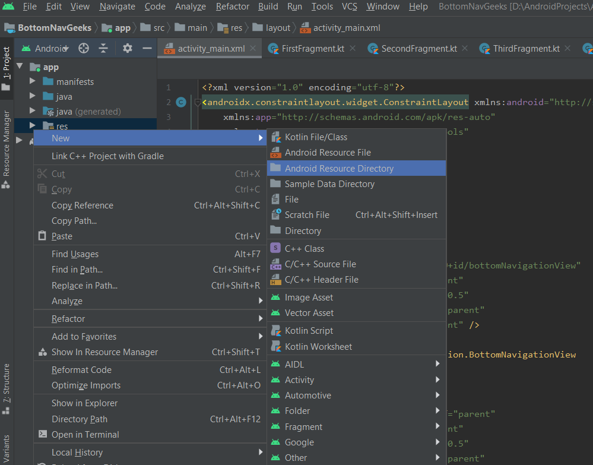
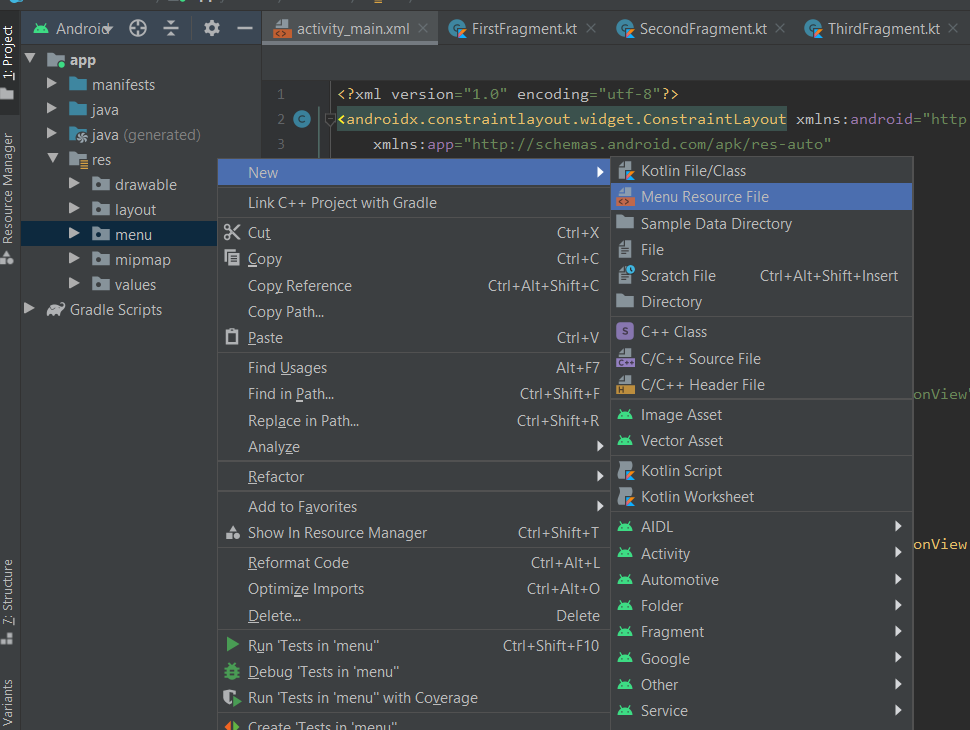

import Tabs from '@theme/Tabs';
import TabItem from '@theme/TabItem';

In this guide you will learn how to create a tabbed layout component using [bottom navigation](https://m2.material.io/components/bottom-navigation#using-tabs) to use widgets like [CometChatUsersWithMessages](./users-with-messages), [CometChatGroupsWithMessages](./groups-with-messages) and [CometChatConversationsWithMessages](./users-with-messages) simultaneously.

:::info

You need to create an account with CometChat to use the components.

Also, ensure initializing CometChatUIKit first and logging in correctly before trying to render any component from the UI Kit package.

Please make sure you have followed our [Integration](../02-getting-started.md) guidelines.

:::

Without further ado, let's get into how we can build this thing.

- First, lets create a Activity, lets call it CometChatUiActivity and add the following code into the xml file of the activity

<Tabs>
<TabItem value="xml" label="XML">

```xml
<?xml version="1.0" encoding="utf-8"?>
<LinearLayout xmlns:android="http://schemas.android.com/apk/res/android"
    xmlns:app="http://schemas.android.com/apk/res-auto"
    android:layout_width="match_parent"
    android:layout_height="match_parent"
    android:orientation="vertical">

    <LinearLayout
        android:id="@+id/container"
        android:layout_width="match_parent"
        android:layout_height="0dp"
        android:layout_weight="1"
        android:orientation="vertical" />

    <com.google.android.material.bottomnavigation.BottomNavigationView
        android:id="@+id/bottomNavigationView"
        android:layout_width="match_parent"
        android:layout_height="wrap_content"
        android:background="@android:color/white"
        android:minHeight="60dp"
        app:itemIconTint="@color/selected_item"
        app:itemTextAppearanceActive="@style/Subtitle2"
        app:itemTextColor="@color/selected_item"
        app:menu="@menu/bottom_nav_menu_item"
        app:tabIndicator="@null"
        app:tabMinWidth="72dp"
        app:tabPaddingBottom="0dp"
        app:tabPaddingEnd="0dp"
        app:tabPaddingStart="0dp"
        app:tabPaddingTop="0dp" />
</LinearLayout>
```

</TabItem>
</Tabs>

Now lets create menu that need to be shown on a Bottom navigation view. To create a **Menu**, first, create a **Menu Directory** **by clicking on the\_** **app**_**-&gt;**_ **\_ res**(right-click) -&gt;\_ _**New**_ _-&gt;_ _**Android Resource Directory**_ _and select_ _**Menu**_ _in the_ _**Resource Type**_.\_



To create a **Menu Resource File** , click on the **app** -&gt; **res** -&gt; **menu**(right-click) -&gt; **New** -&gt; **Menu Resource File** and name it **bottom_nav_menu_item**.



add the below code in **bottom**_\*\*_**\_**nav_menu_item\*\*

<Tabs>
<TabItem value="xml" label="XML">

```xml
<?xml version="1.0" encoding="utf-8"?>
<menu xmlns:android="http://schemas.android.com/apk/res/android">
    <item
        android:id="@+id/chat"
        android:title="@string/chats"
        android:icon="@drawable/cc_ic_chats"/>
    <item
        android:id="@+id/user"
        android:title="@string/users"
        android:icon="@drawable/cc_ic_users"/>
    <item
        android:id="@+id/group"
        android:title="@string/groups"
        android:icon="@drawable/cc_ic_groups"/>
</menu>
```

</TabItem>
</Tabs>

similarly we need to create a **color directory** and need to add a color file with the below code init

<Tabs>
<TabItem value="xml" label="XML">

```xml
<?xml version="1.0" encoding="utf-8"?>
<selector xmlns:android="http://schemas.android.com/apk/res/android">
    <item android:state_checked="true" android:color="@color/primary" />
    <item android:color="@color/accent400"  />
</selector>
```

</TabItem>
</Tabs>

Now create 4 Fragments and load `CometChatConversationsWithMessages`, `CometChatUsersWithMessages`, `CometChatGroupsWithMessages`and `CometChatCallHistoryWithDetails` individually in each of them.

ConversationsWithMessagesFragment.java

<Tabs>
<TabItem value="java" label="Java">

```java
public class ConversationsWithMessagesFragment extends Fragment {

    @Override
    public View onCreateView(LayoutInflater inflater, ViewGroup container,
                             Bundle savedInstanceState) {
        // Inflate the layout for this fragment
        return inflater.inflate(R.layout.fragment_conversation_with_messages, container, false);
    }
}
```

</TabItem>
</Tabs>

<Tabs>
<TabItem value="xml" label="XML">

```xml
<?xml version="1.0" encoding="utf-8"?>
<FrameLayout xmlns:android="http://schemas.android.com/apk/res/android"
    xmlns:tools="http://schemas.android.com/tools"
    android:layout_width="match_parent"
    android:layout_height="match_parent"
    tools:context=".fragments.conversations.ConversationsWithMessagesFragment">

    <com.cometchat.chatuikit.conversationswithmessages.CometChatConversationWithMessages
        android:id="@+id/conversationWithMessages"
        android:layout_width="match_parent"
        android:layout_height="match_parent" />

</FrameLayout>
```

</TabItem>
</Tabs>

UsersWithMessagesFragment.java

<Tabs>
<TabItem value="java" label="Java">

```java
public class UsersWithMessagesFragment extends Fragment {


    @Override
    public View onCreateView(LayoutInflater inflater, ViewGroup container,
                             Bundle savedInstanceState) {
        // Inflate the layout for this fragment
        return inflater.inflate(R.layout.fragment_users_with_messages, container, false);
    }
}
```

</TabItem>
</Tabs>

<Tabs>
<TabItem value="xml" label="XML">

```xml
<?xml version="1.0" encoding="utf-8"?>
<FrameLayout xmlns:android="http://schemas.android.com/apk/res/android"
    xmlns:tools="http://schemas.android.com/tools"
    android:layout_width="match_parent"
    android:layout_height="match_parent"
    tools:context=".fragments.users.UsersWithMessagesFragment">

    <com.cometchat.chatuikit.userswithmessages.CometChatUsersWithMessages
        android:id="@+id/userWithMessages"
        android:layout_width="match_parent"
        android:layout_height="match_parent" />

</FrameLayout>
```

</TabItem>
</Tabs>

GroupsWithMessagesFragment.java

<Tabs>
<TabItem value="java" label="Java">

```java
public class GroupsWithMessagesFragment extends Fragment {

    @Override
    public View onCreateView(LayoutInflater inflater, ViewGroup container,
                             Bundle savedInstanceState) {
        // Inflate the layout for this fragment
        return inflater.inflate(R.layout.fragment_groups_with_messages, container, false);
    }
}
```

</TabItem>
</Tabs>

<Tabs>
<TabItem value="xml" label="XML">

```xml
<?xml version="1.0" encoding="utf-8"?>
<FrameLayout xmlns:android="http://schemas.android.com/apk/res/android"
    xmlns:tools="http://schemas.android.com/tools"
    android:layout_width="match_parent"
    android:layout_height="match_parent"
    tools:context=".fragments.groups.GroupsWithMessagesFragment">

    <com.cometchat.chatuikit.groupswithmessages.CometChatGroupsWithMessages
        android:id="@+id/groupWithMessages"
        android:layout_width="match_parent"
        android:layout_height="match_parent" />

</FrameLayout>
```

</TabItem>
</Tabs>

Now in CometChatUiActivity add the below code.

<Tabs>
<TabItem value="java" label="Java">

```java
import android.os.Bundle;

import androidx.appcompat.app.AppCompatActivity;
import androidx.fragment.app.Fragment;

import com.cometchat.pro.javasampleapp.R;
import com.cometchat.pro.javasampleapp.fragments.calls.CallHistoryWithDetailsFragment;
import com.cometchat.pro.javasampleapp.fragments.conversations.ConversationsWithMessagesFragment;
import com.cometchat.pro.javasampleapp.fragments.groups.GroupsWithMessagesFragment;
import com.cometchat.pro.javasampleapp.fragments.users.UsersWithMessagesFragment;
import com.google.android.material.bottomnavigation.BottomNavigationView;

public class CometChatUiActivity extends AppCompatActivity {

    private BottomNavigationView bottomNavigationView;

    @Override
    protected void onCreate(Bundle savedInstanceState) {
        super.onCreate(savedInstanceState);
        setContentView(R.layout.activity_comet_chat_ui);

        bottomNavigationView = findViewById(R.id.bottomNavigationView);
        loadFragment(new ConversationsWithMessagesFragment());
        bottomNavigationView.setOnItemSelectedListener(item -> {
            switch (item.getItemId()) {
                case R.id.chat:
                    loadFragment(new ConversationsWithMessagesFragment());
                    break;
                case R.id.user:
                    loadFragment(new UsersWithMessagesFragment());
                    break;
                case R.id.group:
                    loadFragment(new GroupsWithMessagesFragment());
                    break;
            }
            return true;
        });
        bottomNavigationView.setSelectedItemId(R.id.chat);
    }

    private void loadFragment(Fragment fragment) {
        if (fragment != null)
            getSupportFragmentManager().beginTransaction().replace(R.id.container, fragment).commit();
    }
}
```

</TabItem>
</Tabs>

Yippee 🎉 !!! We have successfully built a CometChatUi. 🎉
