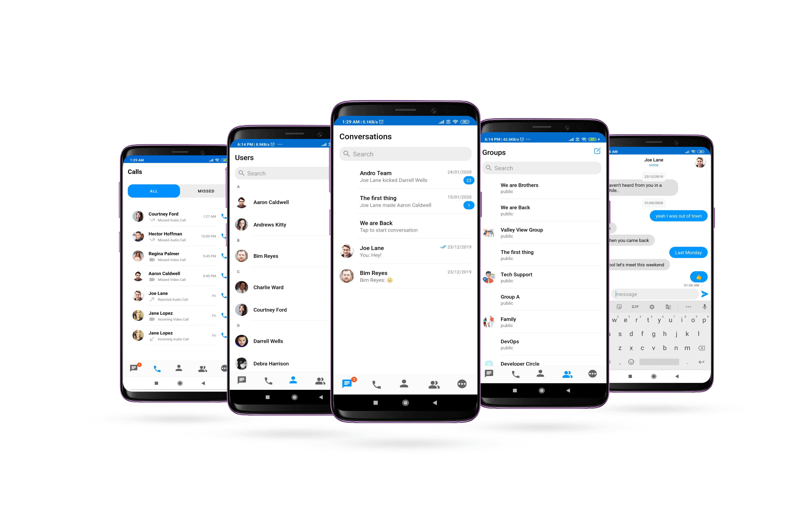
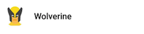
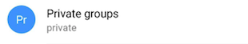
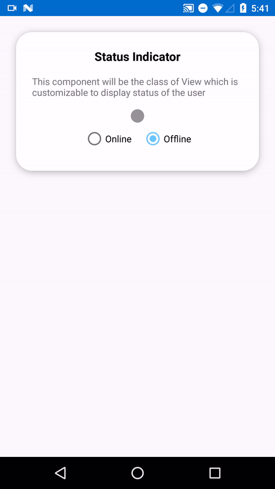

import Tabs from '@theme/Tabs';
import TabItem from '@theme/TabItem';

**UI Components** are building a block of the UI Kit. **UI Components** are a set of custom classes specially designed to build a feature-rich chat app.  To achieve high customizability while building an app one can use the UI Components. There are different UI Components available in the UI Kit library.

## **CometChatUI**

**CometChatUI** is an option to launch a fully functional chat application using the UI Kit. In **CometChatUI** all the UI Components are interlinked and work together to launch a fully functional chat on your mobile application.



CometChatUI is an Activity class, so you can launch `CometChatUI` using the below code snippet   Make sure to add the following code snippet after `onSuccess` of CometChat login.

<Tabs>
<TabItem value="js" label="Kotlin">

```kotlin
startActivity(Intent(this@YourActivity, CometChatUI::class.java))
```

</TabItem>
</Tabs>


:::warning info 

Make sure that the above code snippet is added after `onSuccess` of CometChat login.

:::


---

## **CometChatConversationList**

The **CometChatConversationList** is Fragment which will help you to display a list of recent conversations. The Fragment has all the necessary listeners and methods required to display the list of conversations.

### **Usage**

In your layout file (.xml file) add the following snippet to use the `CometChatConversationList`. Adding the following code snippet will give you a fully working list of conversations.


<Tabs>
<TabItem value="xml" label="XML">

```xml
<fragment
android:id="@+id/conversationList"
android:layout_width="match_parent"
android:layout_height="match_parent"
class=" com.cometchat.pro.uikit.
ui_components.chats.CometChatConversationList "
/>
```
</TabItem>
</Tabs>


:::info  Note About setItemClickListener on CometChatConversationList

To get the click event of the list you must use `setItemClickListener`. The `setItemClickListener` has `OnItemClick()` to handle single click and `OnItemLongClick()` to handle long click events.

:::


<Tabs>
<TabItem value="js" label="Kotlin">

```kotlin
cometChatConversationList.setItemClickListener(object : OnItemClickListener<Any(){
  	override fun OnItemClick(t: Any, position: Int) {
      
		}
  	override fun OnItemLongClick(t: Any, position: Int) {
    	super.OnItemLongClick(t, position)
        
    }
})
```

</TabItem>
</Tabs>


---

## **CometChatUserList**

The `CometChatUserList` is a fragment with a List of users. The Fragment has all the necessary listeners and methods required to display the user's list.

### **Usage**

In your layout file (.xml file) add the following snippet to use the `CometChatUserList`. Adding the following code snippet will give you a fully working list of users.


<Tabs>
<TabItem value="xml" label="XML">
```xml
<fragment
android:id="@+id/userList"
android:layout_width="match_parent"
android:layout_height="match_parent"
class="com.cometchat.pro.uikit
.ui_components.users.user_list.CometChatUserList"
/>
```
</TabItem>
</Tabs>


:::info Note About setItemClickListener on CometChatUserList

To get the click event of the list you must use `setItemClickListener`. The `setItemClickListener` has `OnItemClick()` to handle single click and `OnItemLongClick()` to 
handle long click events.

:::


<Tabs>
<TabItem value="kotlin" label="Kotlin">

```kotlin
cometChatUserList.setItemClickListener(object : OnItemClickListener<Any>() {
  
            override fun OnItemClick(t: Any, position: Int) {
                
            }
            override fun OnItemLongClick(t: Any, position: Int) {
                super.OnItemLongClick(t, position)
            }
        })
```

</TabItem>
</Tabs>


---

## **CometChatGroupList**

The `CometChatGroupList` is a fragment with a List of groups Fragment has all the necessary listeners and methods required to display the list of groups

### **Usage**

In your `layout.xml` add the following snippet to use the `CometChatGroupList`.Adding the following code snippet will give you a full working list of groups.


<Tabs>
<TabItem value="xml" label="XML">
```xml
<fragment
android:id="@+id/groupList"
android:layout_width="match_parent"
android:layout_height="match_parent"
class="com.cometchat.pro.uikit
.ui_components.groups.group_list.CometChatGroupList"
/>
```
</TabItem>
</Tabs>


:::info Note About setItemClickListener on CometChatGroupList

To get the click event of the list you must use `setItemClickListener`. The `setItemClickListener` has `OnItemClick()` to handle single click and `OnItemLongClick()` to handle long click events.

:::


<Tabs>
<TabItem value="js" label="Kotlin">

```kotlin
cometChatGroupList.setItemClickListener(object : OnItemClickListener<Any>() {
  
            override fun OnItemClick(t: Any, position: Int) {
                
            }
            override fun OnItemLongClick(t: Any, position: Int) {
                super.OnItemLongClick(t, position)
            }
        })
```

</TabItem>
</Tabs>


---

## **CometChatMessageList**

`CometChatMessageList` is a fragment that consists of send and received messages. It is capable of sending and receiving different types of messages such as text, image, and documents.

### **Usage**

To use `CometChatMessageList` follow the below code snippets. `CometChatMessageList` is a dynamic so it will require some arguments. Add a `FrameLayout` in your `layout.xml`


<Tabs>
<TabItem value="kotlin" label="Kotlin">

```Kotlin
Intent intent = Intent(this@YOURACTIVITY, CometChatMessageListActivity::class.java);
intent.putExtra(UIKitConstants.IntentStrings.UID, user.getUid());
intent.putExtra(UIKitConstants.IntentStrings.AVATAR, user.getAvatar());
intent.putExtra(UIKitConstants.IntentStrings.STATUS, user.getStatus());
intent.putExtra(UIKitConstants.IntentStrings.NAME, user.getName());
intent.putExtra(UIKitConstants.IntentStrings.LINK,user.getLink());
intent.putExtra(UIKitConstants.IntentStrings.TYPE, CometChatConstants.RECEIVER_TYPE_USER);
startActivity(intent);
```
</TabItem>
</Tabs>


In your activity set the required parameter in the following manner.

<Tabs>
<TabItem value="js" label="Kotlin">

```kotlin
val bundle = Bundle()
bundle.putString(UIKitContracts.IntentStrings.AVATAR, "AvatarUrl")
bundle.putString(UIKitContracts.IntentStrings.NAME,"Name")
bundle.putString(UIKitContracts.IntentStrings.TYPE,CometChatConstants.RECEIVER_TYPE_USER)
bundle.putString(UIKitContracts.IntentStrings.UID,"UID")
bundle.putString(UIKitContracts.IntentStrings.STATUS,"STATUS")
fragment.arguments = bundle
supportFragmentManager.beginTransaction().replace(R.id.ChatFragment, fragment).commit()
```

</TabItem>
</Tabs>


---

## **CometChatCallList**

You can use the CometChatCallList to get a list of all the calls made by the logged-in user to other users and groups.

### **Usage**

Add the following code in your  layout file (.xml file)


<Tabs>
<TabItem value="kotlin" label="Kotlin">

```kotlin
Intent intent = Intent(this@YOURACTIVITY, CometChatMessageListActivity::class.java);
intent.putExtra(UIKitConstants.IntentStrings.UID, user.getUid());
intent.putExtra(UIKitConstants.IntentStrings.AVATAR, user.getAvatar());
intent.putExtra(UIKitConstants.IntentStrings.STATUS, user.getStatus());
intent.putExtra(UIKitConstants.IntentStrings.NAME, user.getName());
intent.putExtra(UIKitConstants.IntentStrings.LINK,user.getLink());
intent.putExtra(UIKitConstants.IntentStrings.TYPE, CometChatConstants.RECEIVER_TYPE_USER);
startActivity(intent);
```
</TabItem>
</Tabs>


---

## **CometChatUserProfile**

`CometChatUserProfile` is a fragment which provides detail about the currently logged-in user in the CometChat.

### **Usage**

Add the following code in your  layout file (.xml file)


<Tabs>
<TabItem value="xml" label="XML">

```xml
<fragment
android:id="@+id/userInfo"
android:layout_width="match_parent"
android:layout_height="match_parent"
class="com.cometchat.pro.uikit
.ui_components.userprofile.CometChatUserProfile"
/>
```
</TabItem>
</Tabs>


---

## **Shared**

There are certain core components that are being used everywhere in `uiKit` library. You will find those components in `shared` folder under `ui_components`. Below are core components that are being used in `uiKit` library.

### **CometChatAvatar**

This is an image view customize only to display Avatar. This view can be used with image URLs as well as with CometChat objects like `User` and `Group`


#### **Usage**

In your `layout.xml` add the following code snippet.

<Tabs>
<TabItem value="js" label="XML">

```xml
<com.cometchat.pro.uikit.ui_components.shared.cometchatAvatar.CometChatAvatar
            android:id="@+id/av_user"
            android:layout_width="60dp"
            app:avatar_shape="@string/circle"
            android:layout_height="60dp" />
```

</TabItem>
</Tabs>


Here  `avatar_shape`  is a static property. It should be either `circle` or `rectangle`. whereas the avatar URL needs to be set dynamically following is the sample code for the same.

<Tabs>
<TabItem value="js" label="Kotlin">

```kotlin
val avatar: CometChatAvatar = findViewById(R.id.av_user)
userViewHolder.avatar.setAvatarUrl("https://randomuser.me/api/portraits/women/44.jpg")
```

</TabItem>
</Tabs>


The CometChatAvatar Component works well with CometChat `User` and `Group` object. The `setAvatar()` method accepts `User` or `Group` object if Avatar of `User` or `Group` is not available it automatically show the initials of the user or group name as a placeholder Avatar.




#### **Common Features**

CometChat Avatar class provides functionality for an Avatar feature. There are commonly used properties to control the look of the Avatar.

| CometChatAvatar field element | Relevant attributes/methods | 
| ---- | ---- | 
| Avatar Shape | `app:avatar_shape` | 
| Avatar | `app:avatar``# setAvatar(@NonNull User)``# setAvatar(@NonNull Group)``# setAvatar(@NonNull String)``# setAvatar(@NonNull Drawable, @NonNull String)` | 
| Avatar Initial | `app:avatar_initials``# setInitials(@NonNull String)` | 
| Border Color | `app:border_color` | 
| Border Width | `app:border_width` | 


---

### **CometChatUserPresence**

This view will be used to show the user status if the user is online or offline. This view will take user status and display the color accordingly.

<!--  -->


#### **Usage**

In your `layout.xml` add the following code

<Tabs>
<TabItem value="js" label="XML">

```xml
<com.cometchat.pro.uikit.ui_components.shared.cometchatUserPresence.CometChatUserPresence
            android:id="@+id/statusIndicator"
            android:layout_width="15dp"
            android:layout_height="15dp"
            app:user_status="@string/offline"
            />
```

</TabItem>
</Tabs>

User status can be set dynamically using the following code.

<Tabs>
<TabItem value="js" label="Kotlin">

```kotlin
val userPresence: CometChatUserPresence = findViewById(R.id.statusIndicator)
 userViewHolder.statusIndicator.setUserStatus(user.status)
```

</TabItem>
</Tabs>
#### **Common Features**

CometChatUserPresence provides `app:user_status` attribute and method `setUserStatus` to set Status of the user.

The `app:user_status` attribute can also be used with DataBinding in the following manner

e.g  `app:user_status="@{user.status}"`   you can also use different objects according to their use case. The attribute will continue to work as long as receives a string parameter

| CometChatUserPresence field element | Relevant attributes/methods | 
| ---- | ---- | 
| User Status | `app:user_status``# setUserStatus(@NonNull String)` | 

---

### **CometChatBadgeCount**

The CometChatBadgeCount component can be used to show an unread count. You can use it in different scenarios according to their use case.


Add the following code to your `layout.xml`

<Tabs>
<TabItem value="js" label="XML">

```xml
<com.cometchat.pro.uikit.ui_components.shared.cometchatBadgeCount.CometChatBadgeCount
                android:id="@+id/badgeCount"
                android:layout_width="wrap_content"
                app:count="2"
                android:layout_height="wrap_content"/>
```

</TabItem>
</Tabs>


The count can be set dynamically using the `setCount` method. The `setCount` method takes an int as a parameter.

<Tabs>
<TabItem value="js" label="Kotlin">

```kotlin
val badgeCount: CometChatBadgeCount = findViewById(R.id.badgecount)
holder.badgeCount.messageCount.setCount(conversation.unreadMessageCount)
```

</TabItem>
</Tabs>
#### **Common Feature**

The CometChatBadgeCount component provides different attributes and methods to control the behavior and appearance of the BadgeCount view.

The attribute `app: count` can also be used with DataBinding

<Tabs>
<TabItem value="js" label="XML">

```xml
/// example with conversation object
    
    <com.cometchat.pro.uikit.ui_components.shared.cometchatBadgeCount.CometChatBadgeCount
                android:id="@+id/badgeCount"
                android:layout_width="wrap_content"
                app:count="@{conversation.unreadMessageCount}"
                android:layout_height="wrap_content"/>
```

</TabItem>
</Tabs>


| CometChatBadgeCount field element | Relevant attributes/methods | 
| ---- | ---- | 
| Count | `app:count``# setCount(int)` | 
| Count Size | `app:count_size``# setCountSize(float)` | 
| Count Background Color | `app:count_background_color``# setCountBackground(@ColorRes color)` | 
| Count Color | `app:count_color``setCountSize(float)` | 


---

### **CometChatUsers**

The `CometChatUsers` is custom **RecyclerView** which helps to display a list of users present in your CometChat app.


:::info Note about CometChatUsers using with DataBinding:

Your project should have DataBinding enabled. You can use `CometChatUsers` using DataBinding in the following manner

:::


In your `layout.xml`  add the following code :

<Tabs>
<TabItem value="js" label="XML">

```xml
<data>
            <import type="androidx.recyclerview.widget.LinearLayoutManager"/>
            <import type="androidx.databinding.ObservableList"/>
            <import type="com.cometchat.pro.models.User"/>
    
            <variable
                name="userList"
                type="ObservableList&lt;User&gt;" />
    
        </data>
    
        <com.cometchat.pro.uikit.ui_components.shared.cometchatUsers.CometChatUsers
            android:id="@+id/cometchatUserList"
            android:layout_width="match_parent"
            app:userlist="@{userList}"
            app:layoutManager="androidx.recyclerview.widget.LinearLayoutManager" 
            android:layout_height="match_parent" />
```

</TabItem>
</Tabs>


In your corresponding activity or fragment  add the following code

<Tabs>
<TabItem value="js" label="Kotlin">

```kotlin
val userList: ObservableArrayList<User> = ObservableArrayList<User>()
binding.setUserList(userList)
```

</TabItem>
</Tabs>


For getting the list of users you can use `UsersRequestBuilder()`. Visit the below link for more details on how to retrieve a list of users.

In `onSuccess` of the `fetchNext` method you can set the data the `ObservableArrayList` you have created. The advantage of using the `ObservableArrayList` is one doesn't have to manually set the data on `binding.setUserList(userList);`   every time you get a new set of data.

<Tabs>
<TabItem value="js" label="Kotlin">

```kotlin
usersRequest.fetchNext(object : CallbackListener<List<User>>() {
            public override fun onSuccess(list: List<User>) {
                Log.d(TAG, "User list received: " + list.size)
                userList.addAll(list)
                //update the ObservableArrayList here 
            }

            public override fun onError(e: CometChatException) {
                Log.d(TAG, "User list fetching failed with exception: " + e.message)
            }
        })
```

</TabItem>
</Tabs>


:::info Note About CometChatUsers Without DataBinding

If you are not using DataBinding in your project you can use the `CometChatUser` in the following manner.

:::


In your `layout.xml`  add the following code

<Tabs>
<TabItem value="js" label="XML">

```xml
<com.cometchat.pro.uikit.ui_components.shared.cometchatUsers.CometChatUsers
      android:id="@+id/cometchatUser"
      android:layout_width="match_parent"    
      app:layoutManager="androidx.recyclerview.widget.LinearLayoutManager" 
      android:layout_height="match_parent" />
```

</TabItem>
</Tabs>


In your corresponding activity or fragment.

<Tabs>
<TabItem value="js" label="Kotlin">

```kotlin
var cometChatUsers: CometChatUsers = findViewById(R.id.cometchatUsers);
cometChatUser.setUserList(list);
// list: fetched using the UsersRequestBuilder
```

</TabItem>
</Tabs>

To get the list of users you can use UsersRequestBuilder(). Visit the link below for more details on [Retrieve Users](/sdk/android/2.0/retrieve-users)

:::info Note About Using setItemClickListener

For getting the click event of `CometChatUsers` you can make use of `setItemClickListener` class.

:::


<Tabs>
<TabItem value="js" label="Kotlin">

```kotlin
cometChatUsers.setItemClickListener(object : OnItemClickListener<Any>() {
  
            override fun OnItemClick(t: Any, position: Int) {
                
            }
            override fun OnItemLongClick(t: Any, position: Int) {
                super.OnItemLongClick(t, position)
            }
        })
```

</TabItem>
</Tabs>


#### **Common Usage**

The `CometChatUser` component provides different properties to control the behavior of
`CometChatUser` view.

| CometChatUser field elements | Relevant attributes/methods | 
| ---- | ---- | 
| Update List | `# setUserList(List<User>)` | 
| Update | `# update (User)` | 
| Remove | `# remove(String)` | 
| Add | `# add(User)` | 


---

### **CometChatGroups**

The `CometChatGroups` is a custom **RecyclerView** that helps you to display a list of groups.


---

:::info  Note About CometChatGroups Using With DataBinding

If you are using DataBinding in your project you can use the `CometChatGroups` in the following manner.

:::


In your `layout.xml`  add the following code snippet

<Tabs>
<TabItem value="js" label="XML">

```xml
<data>
    
            <import type="androidx.recyclerview.widget.LinearLayoutManager"/>
            <import type="androidx.databinding.ObservableList"/>
            <import type="com.cometchat.pro.models.Group"/>
    
            <variable
                name="groupList"
                type="ObservableList&lt;Group&gt;" />
    
        </data>
    
        <com.cometchat.pro.uikit.ui_components.shared.cometchatGroups.CometChatGroups
            android:id="@+id/cometchatGroupList"
            android:layout_width="match_parent"
            app:grouplist="@{groupList}"
            app:layoutManager="androidx.recyclerview.widget.LinearLayoutManager"
            android:layout_height="match_parent" />
```

</TabItem>
</Tabs>


In your corresponding activity or fragment .

<Tabs>
<TabItem value="js" label="Kotlin">

```kotlin
val groupList: ObservableArrayList<Group> = ObservableArrayList<Group>()
binding.setGroupList(groupList)
```

</TabItem>
</Tabs>


For getting the list of groups you can use `GroupsRequestBuilder()`.Visit the below link for more details on how to retrieve a list of group.

In `onSuccess` of the `fetchNext` method you can set the data the `ObservableArrayList` you have created. The advantage of using the `ObservableArrayList` is one doesn't have to manually set the data on `binding.setGroupList(groupList);`   every time you get a new set of data.

<Tabs>
<TabItem value="js" label="Kotlin">

```kotlin
groupsRequest.fetchNext(object : CallbackListener<List<Group>>() {
            public override fun onSuccess(list: List<Group>) {
                Log.d(TAG, "Groups list fetched successfully: " + list.size);
                groupList.addAll(list)
                // update the ObservableArrayList here
            }

            public override fun onError(e: CometChatException) {
                Log.d(TAG, "Groups list fetching failed with exception: " + e.message);
            }
        })
```

</TabItem>
</Tabs>


:::info Note About CometChatGroups Without DataBinding

If you are not using DataBinding in your project you can use the `CometChatGroups` in the following manner.

:::

In your `layout.xml`  add the following code

<Tabs>
<TabItem value="js" label="XML">

```XML
<com.cometchat.pro.uikit.ui_components.shared.cometchatGroups.CometChatGroups
            android:id="@+id/cometchatGroupList"
            android:layout_width="match_parent"
            app:layoutManager="androidx.recyclerview.widget.LinearLayoutManager"
            android:layout_height="match_parent" />
```

</TabItem>
</Tabs>


In your corresponding activity or fragment

<Tabs>
<TabItem value="js" label="Kotlin">

```Kotlin
val cometChatGroups: CometChatGroups = findViewById(R.id.cometchatGroupList)
 cometChatGroups.setGroupList(list)
 // list: fetched using the GroupsRequestBuilder
```

</TabItem>
</Tabs>


You can refer to how to [Retrieve Groups](/sdk/android/2.0/retrieve-groups).

:::info Note About Using setItemClickListener

For getting the click event of `CometChatGroups` you can make use of `setItemClickListener` class.

:::

<Tabs>
<TabItem value="js" label="Kotlin">

```Kotlin
cometChatGroups.setItemClickListener(object : OnItemClickListener<Any>() {
  
            override fun OnItemClick(t: Any, position: Int) {
                
            }
            override fun OnItemLongClick(t: Any, position: Int) {
                super.OnItemLongClick(t, position)
            }
        })
```

</TabItem>
</Tabs>


#### **Common Usage**

The `CometChatGroups` component provides different properties to control the behavior of
`CometChatGroups` view. You can perform different operations like an update, remove, add, etc.

| CometChatGroups field elements | Relevant attributes/methods | 
| ---- | ---- | 
| Update List | `# setGroupList(List<Group>)` | 
| Update | `# update (Group)` | 
| Remove | `# remove(String)` | 
| Add | `# add(Group)` | 

---


### **CometChatConversations**

`CometChatConversations` is a custom **RecyclerView** which will help you to display a list of all the users and groups in which the logged-in user has made any conversation.


:::info Note about CometChatConversations using with DataBinding

If you are using DataBinding in your project you can use the `CometChatConversations` in the following manner.

:::

In your `layout.xml`  add the following code.

<Tabs>
<TabItem value="js" label="XML">

```XML
<data>
    
            <import type="androidx.recyclerview.widget.LinearLayoutManager"/>
            <import type="androidx.databinding.ObservableList"/>
            <import type="com.cometchat.pro.models.Conversation"/>
    
            <variable
                name="conversationList"
                type="ObservableList&lt;Conversation&gt;" />
    
        </data>
    
        <com.cometchat.pro.uikit.ui_components.shared.cometchatConversations.CometChatConversations
            android:id="@+id/cometchatConversationList"
            android:layout_width="match_parent"
            app:conversationlist="@{conversationList}"
            app:layoutManager="androidx.recyclerview.widget.LinearLayoutManager"
            android:layout_height="match_parent" />
```

</TabItem>
</Tabs>


In your corresponding activity or fragment.

<Tabs>
<TabItem value="js" label="Kotlin">

```Kotlin
val conversationList: ObservableArrayList<Conversation> = ObservableArrayList()
binding.setConversationList(conversationList)
```

</TabItem>
</Tabs>


For getting the list of conversation you can use `ConversationsRequestBuilder()` .visit the below link for more details on how to retrieve a list of conversation

In `onSuccess` of the `fetchNext` method you can set the data the `ObservableArrayList` you have created. The advantage of using the `ObservableArrayList` is one doesn't have to manually set the data on `binding.setConversationList(conversationList);` every time you get a new set of data.

<Tabs>
<TabItem value="js" label="Kotlin">

```Kotlin
conversationsRequest.fetchNext(object : CallbackListener<List<Conversation>>() {
            override fun onSuccess(conversations: List<Conversation>) {
                // Handle list of conversations
                conversationList.addAll(conversations)
                // update ObservableArrayList list here
            }

            override fun onError(e: CometChatException) {
                // Handle failure
                Log.d(TAG, "onError: " + e.message)
            }
        })
```

</TabItem>
</Tabs>


:::info  Note About CometChatConversations Without DataBinding

If you are not using DataBinding in your project you can use the `CometChatConversations` in the following manner.

:::


In your `layout.xml`  add the following code

<Tabs>
<TabItem value="js" label="XML">

```XML
<com.cometchat.pro.uikit.ui_components.shared.cometchatConversations.CometChatConversations
            android:id="@+id/cometchatConversation"
            android:layout_width="match_parent"     
            app:layoutManager="androidx.recyclerview.widget.LinearLayoutManager"
            android:layout_height="match_parent" />
```

</TabItem>
</Tabs>


In your corresponding activity or fragment

<Tabs>
<TabItem value="js" label="Kotlin">

```Kotlin
val cometChatConversations: CometChatConversations = findViewById(R.id.cometchatConversations);

cometChatConversationList.setConversationList(conversations);
// list: fetched using the ConversationsRequestBuilder
```

</TabItem>
</Tabs>


In `onSuccess` of the `fetchNext` method of  `ConversationsRequestBuilder`, you can set the data.
You can refer how to [Retrieve Conversations](/sdk/android/2.0/retrieve-conversations)

:::info Note About Using setItemClickListener

For getting the click event of `CometChatConversations` you can make use of the `ConversationItemClickListener` class.

:::

<Tabs>
<TabItem value="js" label="Kotlin">

```Kotlin
cometChatConversations.setItemClickListener(object : OnItemClickListener<Any>() {
  
            override fun OnItemClick(t: Any, position: Int) {
                
            }
            override fun OnItemLongClick(t: Any, position: Int) {
                super.OnItemLongClick(t, position)
            }
        })
```

</TabItem>
</Tabs>


#### **Common Usage**

The `CometChatConversations` component provides different properties to control the behavior of the `CometChatConversations` view. You can perform different operations like an update, remove, add, etc

| CometChatConversations field elements | Relevant attributes/methods | 
| ---- | ---- | 
| Update List | `# setConversationList(List<Conversation>)` | 
| Update | `# update (Conversation)` | 
| Remove | `# remove(Conversation)` | 
| Add | `# add(Conversation)` | 

---
### **CometChatCalls**

`CometChatCalls` is custom **RecyclerView** which will help you to display list of calls.


You can use the `CometChatCalls` in the following manner.

In your `layout.xml`  add the following code :

<Tabs>
<TabItem value="js" label="XML">

```XML
<com.cometchat.pro.uikit.CometChatCalls
        android:id="@+id/cometchatCalls"
        android:layout_width="match_parent"
        app:layoutManager="androidx.recyclerview.widget.LinearLayoutManager"
        android:layout_height="match_parent" />
```

</TabItem>
</Tabs>


In your corresponding activity or fragment

<Tabs>
<TabItem value="js" label="Kotlin">

```Kotlin
val cometChatCalls: CometChatCalls = findViewById(R.id.cometchatCalls);
```

</TabItem>
</Tabs>


In `onSuccess` of the `fetchNext` method of  `MessagesRequestBuilder`  you can set the data. You need to add `setCategory(CometChatConstants.CATEGORY_CALL)` in your `MessagesRequestBuilder` to fetch only call messages

You can refer an **example here.**

<Tabs>
<TabItem value="js" label="Kotlin">

```Kotlin
if (messagesRequest == null)
{
messagesRequest = MessagesRequestBuilder().setCategory(CometChatConstants.CATEGORY_CALL).setLimit(30).build() 
 }
messagesRequest.fetchPrevious(object : CallbackListener<List<BaseMessage>>() {
     override fun onSuccess(baseMessages: List<BaseMessage>) {
     			/*Since the call list received like messages i.e top with older and 
           bottom with the latest message. We will reverse the list */
           Collections.reverse(baseMessages)
                    cometCallList.setCallList(baseMessages)
      }

      override fun onError(e: CometChatException) {
           //Error Message 
           Log.e("onError: ", e.message)
       }
})
```

</TabItem>
</Tabs>


:::info Note About Using CallItemClickListener:

For getting the click event of `CometChatCalls` you can make use of `ItemClickListener` class.

:::


There are two events given by `CometChatCalls`.

This event is performed when clicking on the User or Group item displayed in the call list.

<Tabs>
<TabItem value="js" label="Kotlin">

```Kotlin
cometChatCalls.setItemClickListener(object : OnItemClickListener<Call?>() {
            override fun OnItemClick(t: Any, position: Int) {
            		 // perform your action here
            }
        })
```

</TabItem>
</Tabs>


This event is performed when click on call icon visible after each Group or User
item in call list.

<Tabs>
<TabItem value="js" label="Kotlin">

```Kotlin
cometChatCalls.setItemCallClickListener(object : OnItemClickListener<Call>() {
            override fun OnItemClick(t: Any, position: Int) {
               // perform your action here
            }
        })
```

</TabItem>
</Tabs>


#### **Common Usage:**

The `CometChatCalls` component provides different properties to control the behavior of the `CometChatCalls` view. You can perform different operations like an update, remove.

| CometChatCalls field e | Relevant attributes/methods | 
| ---- | ---- | 
| Update List | setCallList(List) | 
| Update | update (Call) | 
| Remove | remove(Call) | 