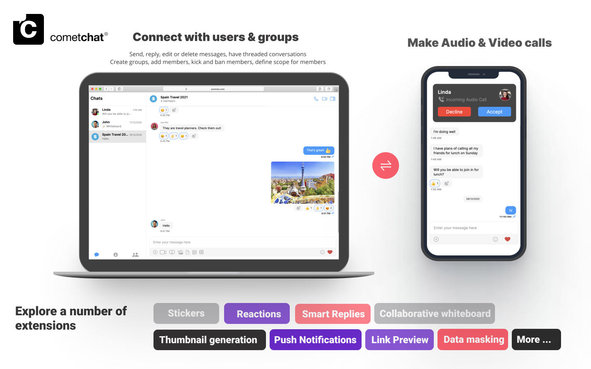

import Tabs from '@theme/Tabs';
import TabItem from '@theme/TabItem';

:::info

V4 UI kits offer modular design, extended functionality & customization for a tailored chat experience. Check out our new UIKits [here](/ui-kit/angular/overview).

:::

The CometChat Angular Chat UI Kit lets developers easily add an Angular chat app with text, voice & video to your mobile or desktop web applications. Included are fully polished Angular chat UI components and the complete business logic.



The UI Kit’s customizable Angular chat UI components simplify the process of integrating text chat and voice/video calling features to your website or mobile application in a few minutes.

<div style={{display: 'flex', boxShadow: '0 0 4px 0 rgb(0 0 0 / 18%)', borderRadius: '3px'}}>
  <div style={{padding: '24px'}}>
    <h4 style={{fontWeight: 'bold'}}>I want to checkout Angular UI Kit</h4>
    <p>Follow the steps mentioned in the <code>README.md</code> file.</p>
    <p>Kindly, click on below button to download our Angular UI Kit.</p>
    <a style={{display: 'inline-block', backgroundColor: '#7c55c9', padding: '8px', textAlign: 'center', textTransform: 'uppercase', border: '1px solid #e3e5e7', borderRadius: '3px', color: 'white', width: '100%', marginBottom: '8px'}} href="https://github.com/cometchat-pro/cometchat-pro-angular-ui-kit/archive/v3.zip">Angular UI Kit</a>
    <a style={{display: 'inline-block', backgroundColor: '#7c55c9', padding: '8px', textAlign: 'center', textTransform: 'uppercase', border: '1px solid #e3e5e7', borderRadius: '3px', color: 'white', width: '100%'}} href="https://github.com/cometchat-pro/cometchat-pro-angular-ui-kit/tree/v3" target="_blank">View on Github</a>
  </div>
  <div style={{padding: '24px', borderLeft: '1px solid #e3e5e7'}}>
    <h4 style={{fontWeight: 'bold'}}>I want to explore the sample app</h4>
    <p>Kindly, click on below button to download our Angular Sample App.</p>
    <a style={{display: 'inline-block', backgroundColor: '#7c55c9', padding: '8px', textAlign: 'center', textTransform: 'uppercase', border: '1px solid #e3e5e7', borderRadius: '3px', color: 'white', width: '100%', marginBottom: '8px'}} href="https://github.com/cometchat-pro/javascript-angular-chat-app/archive/v3.zip">Angular Sample App</a>
    <a style={{display: 'inline-block', backgroundColor: '#7c55c9', padding: '8px', textAlign: 'center', textTransform: 'uppercase', border: '1px solid #e3e5e7', borderRadius: '3px', color: 'white', width: '100%'}} href="https://github.com/cometchat-pro/javascript-angular-chat-app/tree/v3" target="_blank">View on Github</a>
  </div>
</div>


## Prerequisites

1. A text editor. (e.g. Visual Studio Code, Notepad++, Sublime Text, Atom, or VIM)
2. [Node](https://nodejs.org/en/)
3. [npm](https://www.npmjs.com/get-npm)
4. [Angular CLI](https://angular.io/cli)

<Tabs>
<TabItem value="js" label="bash">

```none
npm install -g @angular/cli
```

</TabItem>
</Tabs>


## Installing the Angular Chat UI Kit

:::warning Important

Please follow the steps provided in the [Key Concepts](./key-concepts) to create V3 apps before you proceed.

:::

### Setup

1. Register on CometChat
    a. To install the Angular Chat UI components, you need to first register on the CometChat Dashboard. Click [here](https://app.cometchat.com) to sign up 

2. Get Your Application Keys 🔑
    - Create a new app
    - Head over to the QuickStart or API & Auth Keys section and note the App ID, Auth Key, and Region.

3. Add the CometChat Dependency

<Tabs>
<TabItem value="cli" label="CLI">

```cli
npm install @cometchat-pro/chat@3.0.6 --save
```

</TabItem>
</Tabs>


:::info

Please install `postcss` package using the below command if the Angular version of your project is 11.

:::

<Tabs>
<TabItem value="CLI" label="CLI">

```cli
npm install --save postcss@8.4.27
```

</TabItem>
</Tabs>


### Configure CometChat inside your Angular app

- Import CometChat SDK

<Tabs>
<TabItem value="js" label="javascript">

```javascript
import { CometChat } from "@cometchat-pro/chat";
```

</TabItem>
</Tabs>


- Initialize CometChat 🌟

The `init()` method initializes the settings required for CometChat. We suggest calling the `init()` method on app startup, i.e main.ts file of the application.

<Tabs>
<TabItem value="js" label="javascript">

```javascript
const appID = "APP_ID";
const region = "REGION";
const appSetting = new CometChat.AppSettingsBuilder()
  .subscribePresenceForAllUsers()
  .setRegion(region)
  .build();
CometChat.init(appID, appSetting).then(
  () => {
    console.log("Initialization completed successfully");
    // You can now call login function.
  },
  (error) => {
    console.log("Initialization failed with error:", error);
    // Check the reason for error and take appropriate action.
  }
);
```

</TabItem>
</Tabs>


:::warning Note
Replace APP_ID and REGION with your CometChat App ID and Region in the above code
:::

- Create user 

This method takes a `User` object and the `Auth Key` as input parameters and returns the created `User` object if the request is successful.

<Tabs>
<TabItem value="js" label="javascript">

```javascript
let authKey = "AUTH_KEY";
var uid = "user1";
var name = "Kevin";

var user = new CometChat.User(uid);
user.setName(name);
CometChat.createUser(user, authKey).then(
    user => {
        console.log("user created", user);
    },error => {
        console.log("error", error);
    }
)
```

</TabItem>
</Tabs>


:::warning Note

Replace AUTH_KEY with your CometChat Auth Key in the above code.

:::

- Login your user 👤

This method takes UID and Auth Key as input parameters and returns the User object containing all the information of the logged-in user

<Tabs>
<TabItem value="js" label="javascript">

```javascript
const authKey = "AUTH_KEY";
const uid = "cometchat-uid-1";

CometChat.login(uid, authKey).then(
  (user) => {
    console.log("Login Successful:", { user });
  },
  (error) => {
    console.log("Login failed with exception:", { error });
  }
);
```

</TabItem>
</Tabs>


:::warning Note

Replace AUTH_KEY with your CometChat Auth Key in the above code.

:::


:::info Note
We have set up 5 users for testing having UIDs: cometchat-uid-1, cometchat-uid-2, cometchat-uid-3, cometchat-uid-4, and cometchat-uid-5.
<br /><br />We have used uid cometchat-uid-1 as an example here. You can create a User from CometChat Dashboard as well.
:::

### Add the Angular Chat UI components to your project

- Clone the repository

<Tabs>
<TabItem value="cli" label="CLI">

```CLI
git clone https://github.com/cometchat-pro/cometchat-pro-angular-ui-kit.git
```

</TabItem>
</Tabs>


- Copy the cloned repository into your project src folder.


- Import the Components in the respective module where the component will be used.
- Install @ctrl/ngx-emoji-mart according to the angular version of your project @ctrl/ngx-emoji-mart
- Add these styles to your angular.json
- Wrap all the selectors in a div with class=responsive as shown in the next step

<Tabs>
<TabItem value="js" label="javascript">

```javascript
"styles": [
  "node_modules/@ctrl/ngx-emoji-mart/picker.css",
  "src/cometchat-pro-angular-ui-kit/CometChatWorkspace/src/css/styles.scss"
]
```

</TabItem>
</Tabs>


### Launch CometChat

CometChatUI is an option to launch a fully functional chat application using the Angular Chat UI Kit. In UI Kit all the UI Components are interlinked and work together to launch a fully functional chat on your website/application.


### Usage

<Tabs>
<TabItem value="angular" label="Angular">

```javascript
import { CometChatUI } from "../components/CometChatUI/CometChat-Ui/cometchat-ui.module";

#Use this selector in your html file

<div class="responsive">
  <CometChatUI></CometChatUI>
</div>
```

</TabItem>
</Tabs>


## See our Angular Chat sample app

Visit our [Angular chat sample app](https://github.com/cometchat-pro/javascript-angular-chat-app) repo to see a UI with all the Angular chat components in action.