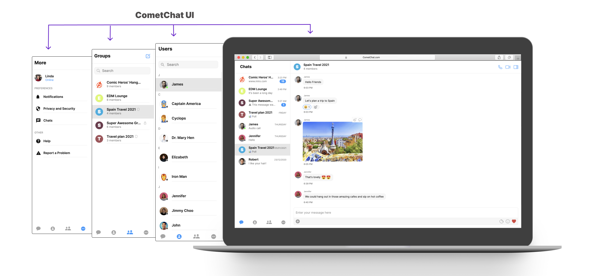
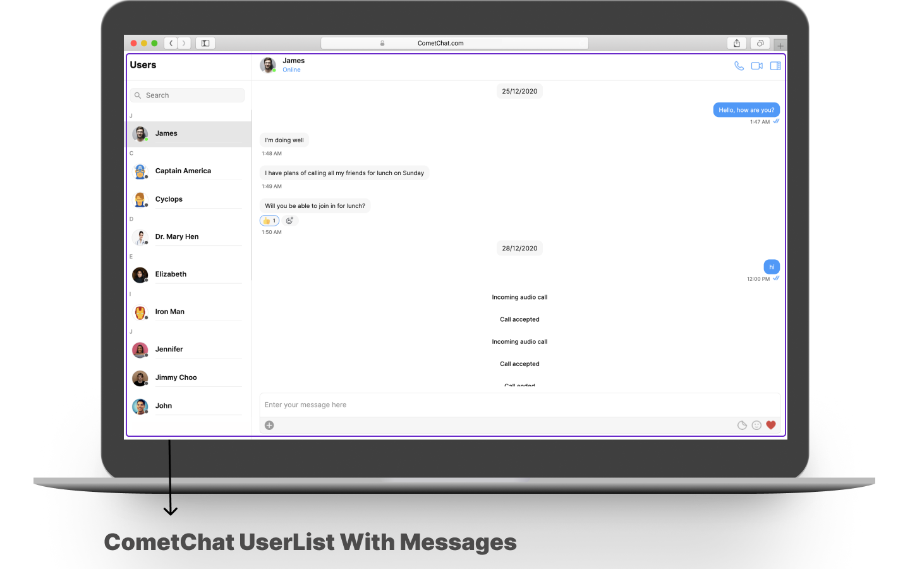
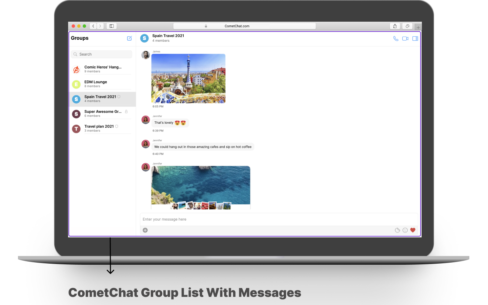
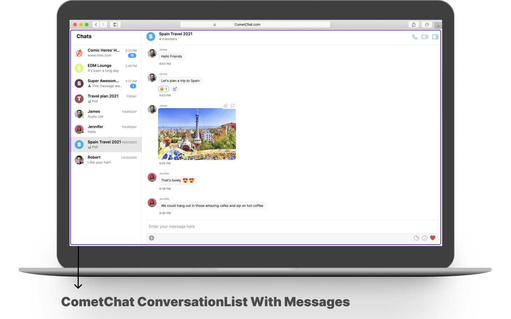
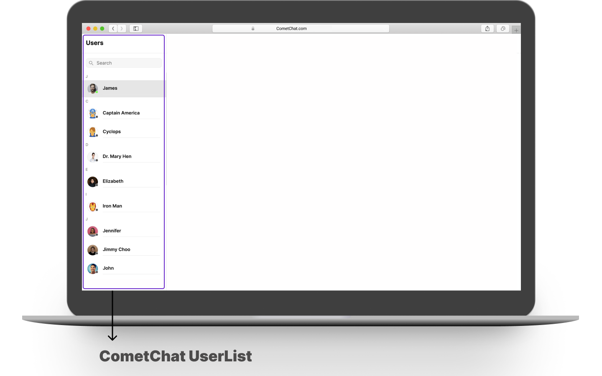
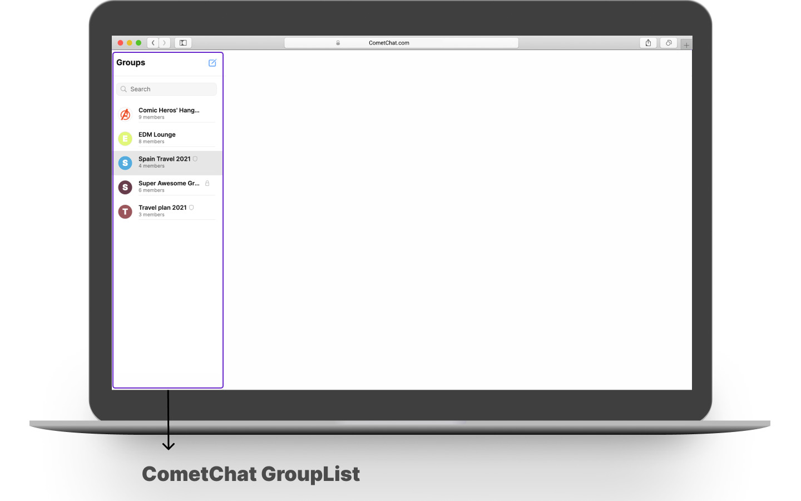
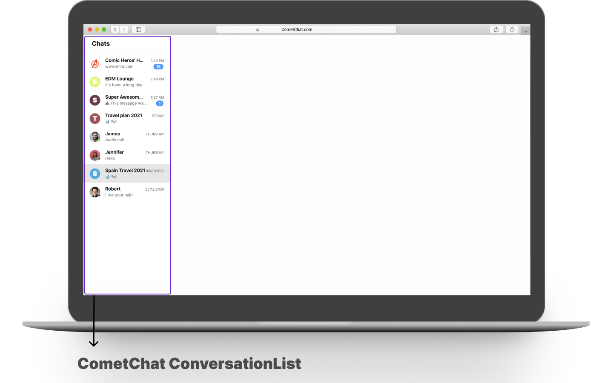

import Tabs from '@theme/Tabs';
import TabItem from '@theme/TabItem';

**UI Components** are building blocks of the UI Kit. **UI Components** are a set of custom classes specially designed to build a rich chat app. There are different UI Components available in the
UI Kit Library. 

## CometChatUI

**CometChatUI** is an option to launch a fully functional chat application using the UI Kit. In **CometChatUI**  all the **UI Components** are interlinked and work together to launch a fully functional chat on your website/application



<Tabs>
<TabItem value="js" label="Angular">

```javascript
import { CometChatUI } from "../components/CometChatUI/CometChat/cometchat-ui.module";

<div>
  <CometChatUI></CometChatUI>
</div>
```

</TabItem>
</Tabs>


## CometChatUserListWithMessages

The `CometChatUserListWithMessages` is a component with a list of users. The component has all the necessary listeners and methods required to display the user's list and shows the set of the messages/chats of the selected user



<Tabs>
<TabItem value="js" label="Angular">

```javascript
import { CometChatUserListWithMessages } from "../components/Users/CometChat-user-list-with-messages/cometchat-user-list-with-messages.module";

<div>
  <cometchat-user-list-with-messages></cometchat-user-list-with-messages>
</div>
```

</TabItem>
</Tabs>


## CometChatGroupListWithMessages

The `CometChatGroupListWithMessages` is a component with a list of groups. The component has all the necessary listeners and methods required to display the group's list and shows the set of the messages/chats of the selected group



<Tabs>
<TabItem value="js" label="Angular">

```javascript
import { CometChatGroupListWithMessages } from "../components/Groups/CometChat-group-with-messages/cometchat-group-list-with-messages.module";
<div>
  <cometchat-group-list-with-messages></cometchat-group-list-with-messages>
</div>
```

</TabItem>
</Tabs>


## CometChatConversationListWithMessages

The `CometChatConversationListWithMessages` is a component with a list of recent conversations. The component has all the necessary listeners and methods required to display the recent conversation list and shows the set of the messages/chats of the selected recent conversation



<Tabs>
<TabItem value="js" label="Angular">

```javascript
import { CometChatConversationListWithMessages } from "../components/Chats/CometChat-conversation-list-with-messages/cometchat-conversation-list-with-messages.module";
<div>
  <cometchat-conversation-list-with-messages></cometchat-conversation-list-with-messages>
</div>
```

</TabItem>
</Tabs>


## CometChatMessages

The `CometChatMessages` is a component with a list of messages/chats and shows the message component header and message composer.


<Tabs>
<TabItem value="js" label="Angular">

```typescript
import { CometChatMessages } from "../components/Messages/CometChat-messages/cometchat-messages.module";
<div>
  <cometchat-messages></cometchat-messages>
</div>
```

</TabItem>
</Tabs>


## CometChatUserList

The `CometChatUserList` is a component that displays the list of users available to chat. You can use this component within your app if you wish to display the list of users.



<Tabs>
<TabItem value="js" label="Angular">

```javascript
import { CometChatUserList } from "../components/Users/CometChat-user-list/cometchat-user-list.module";
<div>
  <cometchat-user-list [friendsOnly]=true> </cometchat-user-list>
</div>
```

</TabItem>
</Tabs>


| Parameter | Description | Type | 
| ---- | ---- | ---- | 
| friendsOnly | This property when set to true will return only the friends of the logged-in user.<br />Value could be _true_ or _false_ | Optional | 


## CometChatGroupList

The `CometChatGroupList` is a component that displays the list of groups available. You can use this component within your app if you wish to display the list of groups.



<Tabs>
<TabItem value="js" label="Angular">

```javascript
import { CometChatGroupList } from "../components/Groups/CometChat-group-list/cometchat-group-list.module";
<div>
  <cometchat-group-list></cometchat-group-list>
</div>
```

</TabItem>
</Tabs>


## CometChatConversationList

You can use the `CometChatConversationList` component to display the list of recent conversations that the logged-in user was a part of.



<Tabs>
<TabItem value="js" label="Angular">

```javascript
import { CometChatConversationList } from "../components/Chats/CometChat-conversation-list/cometchat-conversation-list.module";
<div>
  <cometchat-conversation-list></cometchat-conversation-list>
</div>
```

</TabItem>
</Tabs>


