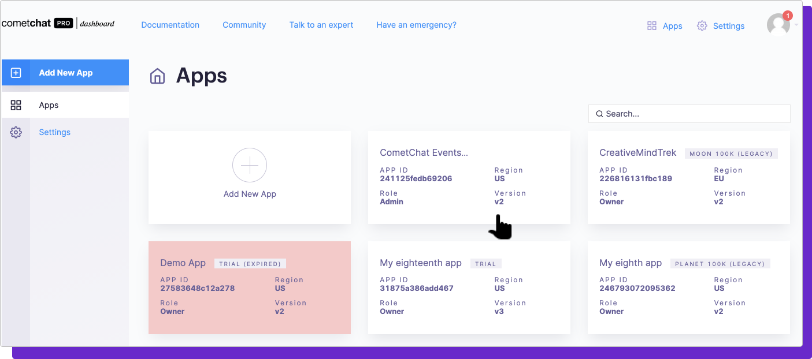
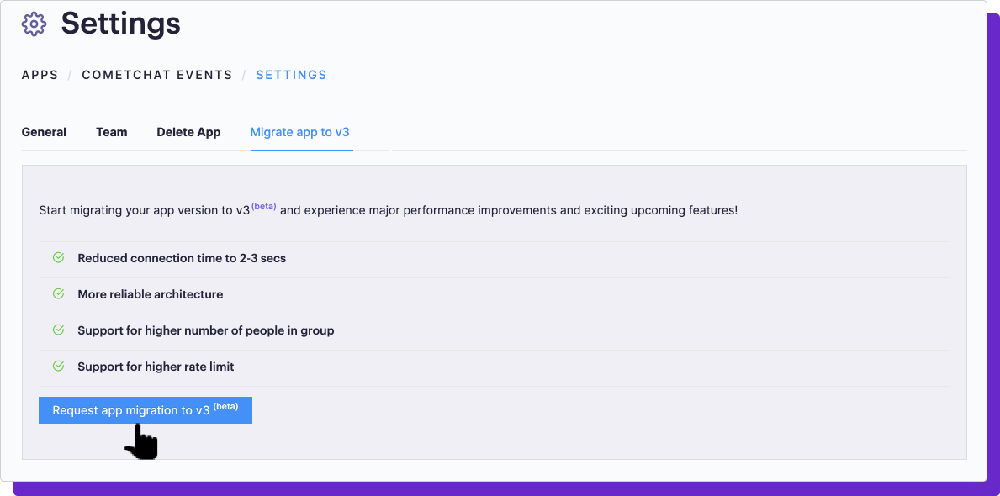
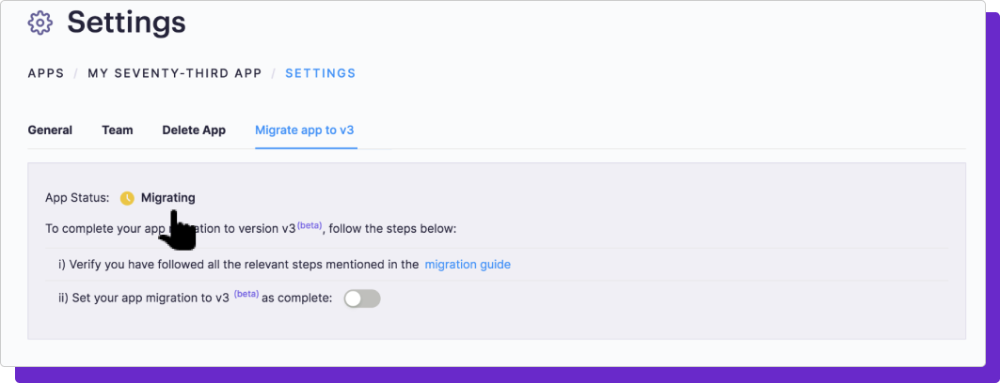
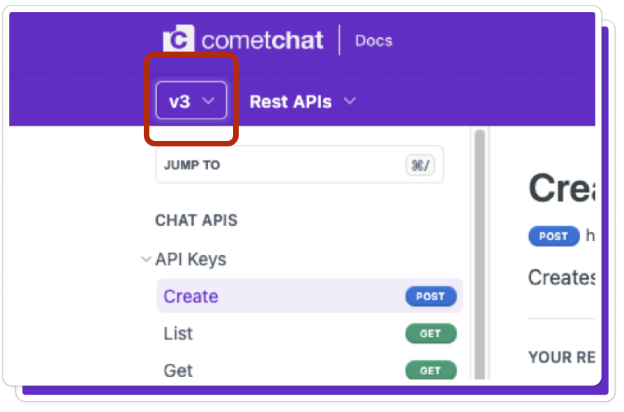
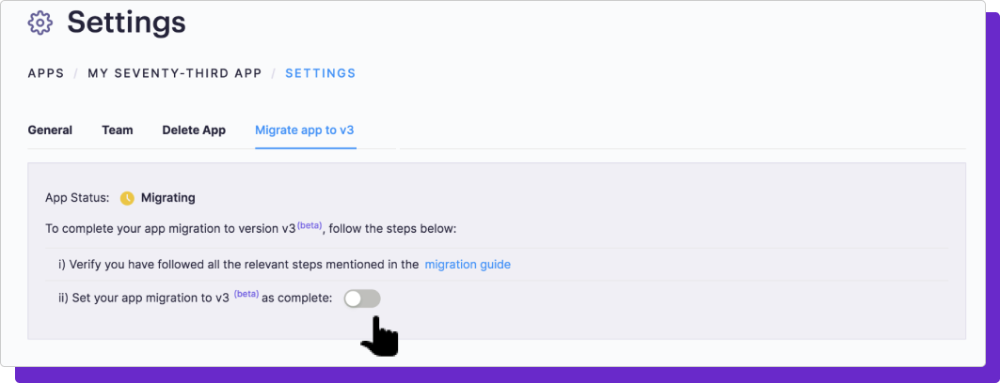

This guide will help you upgrade your application(s) and platform(s) from CometChat v2 to v3. The upgrade process is simple, since there only a few code-level changes required.

Here's what you need to do:

1. Go to the dashboard and make a migration request for your application(s)
2. [Make any required platform-specific code changes](./migration-guide#migrating-your-platform)
3. [Make the API changes](./migration-guide#rest-api-changes-) (Applicable if you are using CometChat Rest APIs)
4. Mark the migration process as complete in the dashboard. We recommend 30 days to complete the migration process

After you begin the migration process, there's a window of time during which your production application will be compatible with both v2 and v3 SDKs and APIs.

During this phase, real-time events (receipts, typing indicator, live reactions, transient messages, and user presence indicators) won’t work cross-version. This means that users with clients using the old v2 SDK won’t get real-time events from users on clients supporting the new v3 SDK, and vice-versa. However, receipts and presence information are still updated in our database, so they'll still be available when fetched via the API.

After you finish making any required changes to your application and mark the migration as complete, your app will only be compatible with v3 SDKs and APIs. Provided all clients have been updated to v3, all real-time events will be supported once more.

Marking the migration as finished is left to your discretion; however, we strongly recommend that after initiating migration, you complete your changes and finish the migration within **30 days**.

## Beginning your migration

1. Open [CometChat Dashboard](https://app.cometchat.com/)
2. Select the existing v2 app you wish to migrate

3. In Settings, select **Migrate App to v3** tab. Then, click on the "Request app migration to v3" button as shown below.
   Once your request is sent, our team will get in touch with you and manually transition the app to a "migrating" status.

4. Once the app status is set to migrating, you'll be ready to begin making platform-specific migration changes. You'll know your app is migrating when you see the following screen in the migration tab in your settings page:

## Migrating your platform

You may have to update a few critical methods in your application code, depending on your platform. Please refer to the links below for platform-specific upgrade guides.

### Chat Widgets

### UI Kits and SDKs

JavaScript: [Upgrading from v2](/sdk/javascript/3.0/resources-upgrading-from-v2)

iOS: [Upgrading from v2](/sdk/ios/upgrading-from-v2)

Android: [Upgrading from v3](/sdk/android/upgrading-from-v3-guide)

React Native: [Upgrading from v2](/sdk/react-native/3.0/resources-upgrading-from-v2)

Ionic Cordova Capacitor: [Upgrading from v2](/sdk/ionic/3.0/resources-upgrading-from-v2)

_Note: if you mark your migration as complete without following the specified upgrade guide fully, your application may become stuck in a broken state, with out-of-sync SDK / API and application versions unable to communicate properly. If this happens, contact support._

## Rest API Changes

This step is only applicable if you are using CometChat Rest APIs. Go to [Rest API documentation](https://api-explorer.cometchat.com/reference/create-apikey) Make sure you have selected V3. Select and update the API URLs applicable to your implementation.

## Finishing your migration

Once you've finished making all needed code changes, go to the dashboard and switch on the toggle to mark your **app migration to v3** as complete.

Once all the steps are done you'll be able to see that your app is migrated to v3, and your migration will be done.

## FAQs

1.  What are the **Benefits** of upgrading?

    1. **Faster** connection & response times
    2. **Higher** rate limits
    3. Supports up to **100K** users in a group
    4. **Unlimited** groups
    5. Support for **Transient** Messages
    6. **Real-time** user & group members count
    7. Support for **1M** concurrent users
    8. v3 provides you with a stronger infrastructure, scalability, and more feature-based solutions to take your chat to the next level!.

2.  What exactly do I need to do, what are the steps?

    - Please refer the [Migration Guide](/articles/migration-guide)

3.  How much effort does it take?
4.      - Per app just the code changes should not take more than 30 mins.

5.  How can I ask for help if I am stuck at some stage?

    - You can reach out to our customer support team for such queries.

6.  What is the transition time you suggest?

    - It depends on how much time it takes for clients using the old v2 SDK to update to v3 SDK.

7.  Will there be any regression during transition?

    - During transition, real-time events (receipts, typing indicator, live reactions, transient messages, and user presence indicators) won’t work cross-version. This means that users with clients using the old v2 SDK won’t get real-time events from users on clients supporting the new v3 SDK, and vice-versa. However, receipts and presence information are still updated in our database, so they'll still be available when fetched via the API.

8.  What all checks do I need to perform before marking V3 complete?
    1. Go to the dashboard and make a migration request for your application(s)
    2. [Make any required platform-specific code changes](/articles/migration-guide#migrating-your-platform)
    3. [Make the API changes (Applicable if you are using CometChat Rest APIs)](https://api-explorer.cometchat.com/reference/create-apikey)
    4. Mark the migration process as complete in the dashboard
