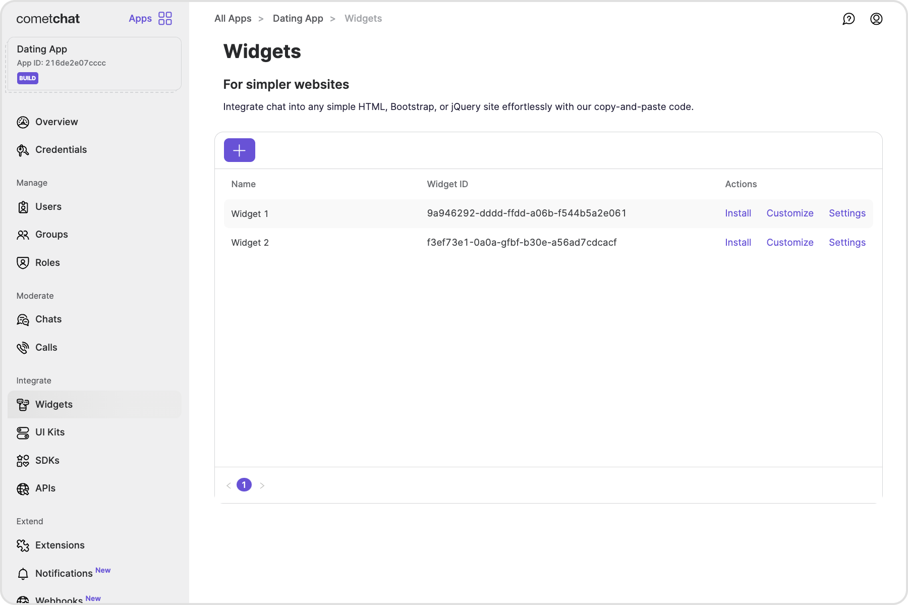

The Widget simplifies the process of integrating a chat functionality on your website.
As a developer, you only need to toggle the widget's settings from our Dashboard and customize it to fit your needs. Within a few minutes, you can get started with our widget.

The Chat Widget is available for the following platforms:

1. HTML / Bootstrap / jQuery
2. WordPress

## Prerequisite

1. [Login](https://app.cometchat.com/login) to CometChat Dashboard and select your app.
2. Click on the **Widgets** tab in the left navigation pane.

3. You can create new widgets as well as see a list of existing ones here.

## Features of Widget

<table border='1' style={{ borderCollapse: 'collapse' }}>
  <thead>
    <tr>
      <th>
        Features
      </th>
      <th>
        Description
      </th>
    </tr>
  </thead>
  <tbody>
    <tr>
      <td>Install</td>
      <td>This provides the required details about a widget so that it can be integrated in your website.</td>
    </tr>
    <tr>
      <td>Customize</td>
      <td>Change the widget's name, docked layout icons and colors, custom JS and CSS.</td>
    </tr>
    <tr>
      <td>Settings</td>
      <td>Configure what shows up in the sidebar as well as in the chat component.</td>
    </tr>
  </tbody>
</table>
