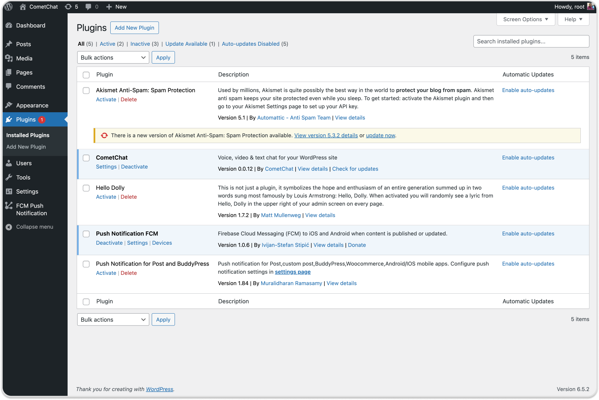
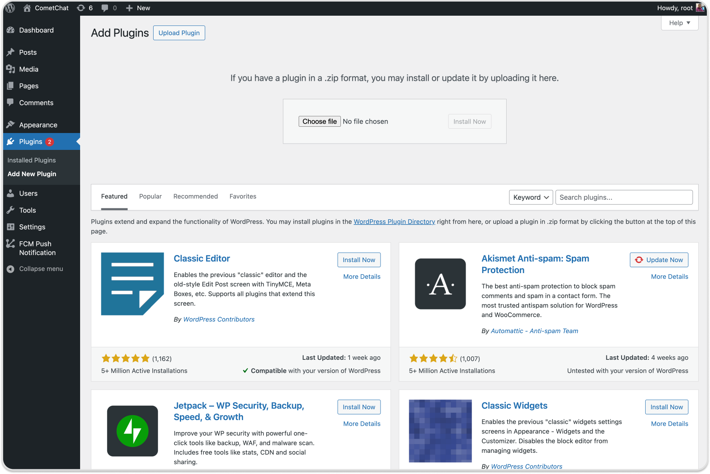
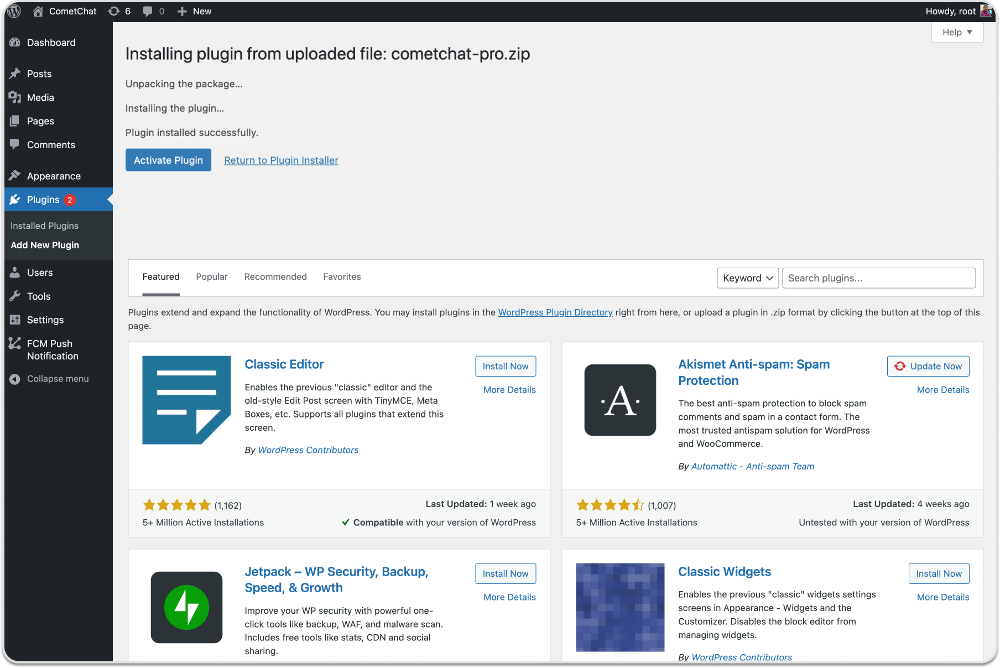
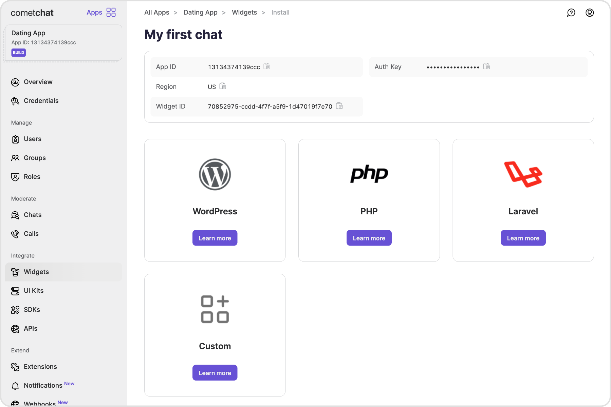
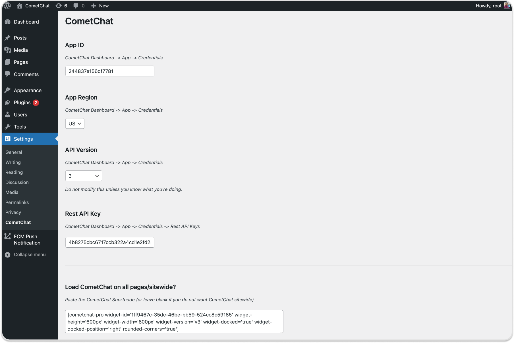
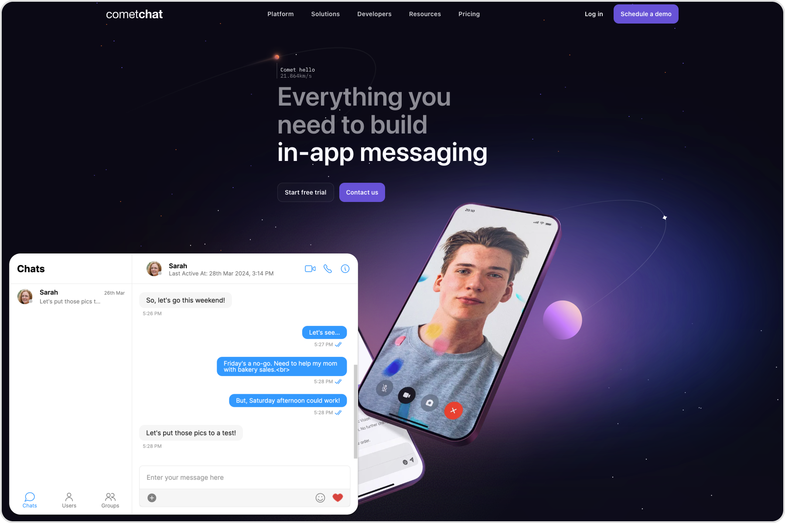
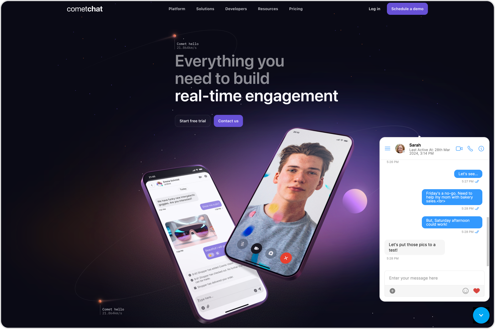

import Tabs from '@theme/Tabs';
import TabItem from '@theme/TabItem';

## Before getting started

Go through the  [overview](./overview) to set up Chat Widget from the CometChat Dashboard

### Installation

1. [Download the CometChat Pro](https://kernl.us/api/v1/archive/64f8862438f073fc92aa72f2) plugin
2. Go to the WordPress Admin section and visit Plugins &gt; Add New



3. Click on the ‘Upload Plugin’ button, here you need to click on the ‘Choose File’ button and select the plugin zip file. After you have selected the file, you need to click on the ‘Install Now’ button.



4. WordPress will now upload the plugin file and install it for you.
5. Once installed, you need to click on the 'Activate Plugin' link to start using the plugin.



## Configuration

1. You can access the App ID, Region, Rest API key and Auth Key from the CometChat Dashboard under Chat Widgets section &gt; Chat Widget App &gt; Under Install tab on the right panel



Visit Settings on WordPress dashboard &gt;&gt; CometChat Pro

- Add CometChat `App ID`,
- Select CometChat `Region`
- Add CometChat `Rest API Key`
- Add CometChat `Auth Key`



2. Once the `Update Settings` button is clicked, the WordPress login user will automatically be registered as a user in the CometChat dashboard
3. You have two options to load the chat widget layout of your choice

- Embedded Layout
- Docked Layout

### Embedded Layout



Use the shortcode to load the Chat Widget in the embedded layout. You need to configure the keys and pass the required values to the keys in the shortcode.

:::warning Warning
 Replace WIDGET_ID with your Widget ID in the below code.
:::

<Tabs>
<TabItem value="WordPress" label="WordPress">

  ```none
[cometchat-pro widget-id='WIDGET_ID' widget-height='600px' widget-width='600px' widget-version='v3']
  ```
</TabItem>
</Tabs>


The list below gives the configurable keys and their description

| Keys | Description | 
| ---- | ---- | 
| widget-id | The ID of the widget can be accessed from the CometChat dashboard | 
| widget-width | Width of the widget | 
| widget-height | Height of the widget | 
| widget-version | Version of the Chat Widget | 


You may pass optional parameters in the short code

| Keys (optional) | Description | 
| ---- | ---- | 
| default-username | The default user with whom the logged In user can start a conversation | 
| default-id | To show a default user or group in your chat <br/><br/> a.Use UID of a user for one-one conversationsb.Use GUID for group conversations | 
| default-type | Either _user_ or _group_ depending upon the default ID | 
| rounded-corners | Boolean value (true/false) that enables/disables rounded corners | 


### Docked Layout



Use the short code to load the Chat Widget in the docked layout. You need to configure the keys and pass the required values to the keys in the short code.

:::warning Warning
 Replace WIDGET_ID with your Widget ID in the below code.
:::

<Tabs>
<TabItem value="WordPress" label="WordPress">

  ```none
[cometchat-pro widget-id='WIDGET_ID' widget-height='600px' widget-width='600px' widget-version='v3' widget-docked='true' widget-docked-position='right' rounded-corners='true']
  ```
</TabItem>
</Tabs>


The list below gives the configurable keys and their description

| Keys | Description | 
| ---- | ---- | 
| widget-id | The ID of the widget can be accessed from the CometChat dashboard | 
| widget-width | Width of the widget | 
| widget-height | Height of the widget | 
| widget-version | A version of the Chat Widget | 
| widget-docked | Boolean value to show or hide the docked layout | 
| widget-docked-position | Alignment of the Chat widget to the left or right of the screen | 


You may pass optional parameters in the short code

| Keys (optional) | Description | 
| ---- | ---- | 
| default-username | The default user with whom the logged In user can start a conversation | 
| default-id | To show a default user or group in your chat <br/><br/> a.Use UID of a user for one-one conversations b.Use GUID for group conversations | 
| default-type | Either user or group depending upon the default ID | 
| rounded-corners | Boolean value (true/false) that enables/disables rounded corners | 


### Show docked layout on all pages

1. Visit WordPress Settings and then to CometChat Pro
2. Copy the above short code and paste under **Load CometChat Pro on all pages/sitewide?**

If the above steps are followed, you should successfully be able to launch the Chat Widget in your WordPress application

## Advanced Features

Open or close chat window

Chat window of docked layout can be opened/closed using the below method.
This method can be triggered on the click event of any element of your web page.

<Tabs>
<TabItem value="Javascript" label="Javascript">

  ```javascript
CometChatWidget.openOrCloseChat(FLAG); //true or false
  ```
</TabItem>
</Tabs>


It takes the following parameters:

| Parameter | Description | Type | 
| ---- | ---- | ---- | 
| FLAG | Value could be _true_ or _false <br/><br/>true_ will open the chat window<br/><br/> _false_ will close the chat window. | Required | 


### Chat with a particular user

This method will open a particular user chat window.
This method can be triggered by the click event of any element of your web page.

<Tabs>
<TabItem value="Javascript" label="Javascript">

  ```javascript
CometChatWidget.chatWithUser(UID);
  ```
</TabItem>
</Tabs>


It takes the following parameters:

| Parameter | Description | Type | 
| ---- | ---- | ---- | 
| UID | The ID of the user you want to chat with | Required | 


### Chat with a particular group

This method will open a particular group chat window.
This method can be triggered by the click event of any element of your web page.

<Tabs>
<TabItem value="Javascript" label="Javascript">

  ```javascript
CometChatWidget.chatWithGroup(GUID);
  ```
</TabItem>
</Tabs>


It takes the following parameters:

| Parameter | Description | Type | 
| ---- | ---- | ---- | 
| GUID | The ID of the group you want to chat with | Required | 


### Initiate calls with a particular user

This method will initiate a call with the user.
This method can be triggered by the click event of any element of your web page.

<Tabs>
<TabItem value="Javascript" label="Javascript">

  ```javascript
CometChatWidget.callUser(UID);
  ```
</TabItem>
</Tabs>


It takes the following parameters:

| Parameter | Description | Type | 
| ---- | ---- | ---- | 
| UID | The ID of the user you want to initiate a call with. | Required | 


### Initiate calls with a particular group

This method will initiate a call with the group.
This method can be triggered by the click event of any element of your web page.

<Tabs>
<TabItem value="Javascript" label="Javascript">

  ```javascript
CometChatWidget.callGroup(GUID);
  ```
</TabItem>
</Tabs>


It takes the following parameters:

| Parameter | Description | Type | 
| ---- | ---- | ---- | 
| GUID | The ID of the group you want to initiate a call with | Required | 


### Message Listener

We have provided a callback that is fired every time a message is received. You can use this to show Custom Notifications on your website or perform some other custom action as per your requirement.

<Tabs>
<TabItem value="Javascript" label="Javascript">

  ```javascript
CometChatWidget.on("onMessageReceived", (args) => {
    console.log("CometChatWidget onMessageReceived", args);
});
  ```
</TabItem>
</Tabs>


### Chat open state listener

We have provided a callback that is fired every time the docked layout of the chat widget is in an open state. You can use this to perform some custom action as per your requirement.

<Tabs>
<TabItem value="Javascript" label="Javascript">

  ```javascript
CometChatWidget.launch({
  // Embedded or Docked layout configuration
}).then(response => {

  // OPTIONAL: This is called in the success callback of launch method
  CometChatWidget.on("openChat", (args) => {
    console.log("CometChatWidget Chat is open", args);
  });
});
  ```
</TabItem>
</Tabs>


### Chat closed state listener

We have provided a callback that is fired every time the docked layout of the chat widget is in a closed state. You can use this to perform some custom action as per your requirement.


<Tabs>
<TabItem value="Javascript" label="Javascript">

  ```javascript
CometChatWidget.launch({
  // Embedded or Docked layout configuration
}).then(response => {

  // OPTIONAL: This is called in the success callback of launch method
  CometChatWidget.on("closeChat", (args) => {
    console.log("CometChatWidget Chat is closed", args);
  });
});
  ```
</TabItem>
</Tabs>


### Localization

With language localization, our Chat Widget adapts to the language of a specific country or region.
Chat Widget allows you to detect the language of your users based on their browser settings and set the language of the widget accordingly.
Currently, we support the following 10 languages for localization:

- English (en, en-US, en-GB)
- Chinese (zh, zh-TW)
- Spanish (es)
- Hindi (hi)
- Russian (ru)
- Arabic (ar)
- Portuguese (pt)
- Malay (ms)
- French (fr)
- German (de)
- Swedish (sv)
- Lithuanian (lt)
- Hungarian (hu)

<Tabs>
<TabItem value="Javascript" label="Javascript">

  ```javascript
CometChatWidget.localize(LANGUAGE_CODE); 
  ```
</TabItem>
</Tabs>


It takes the following parameters:

| Parameter | Description | Type | 
| ---- | ---- | ---- | 
| LANGUAGE_CODE | The language code the texts to be translated into | Required | 
