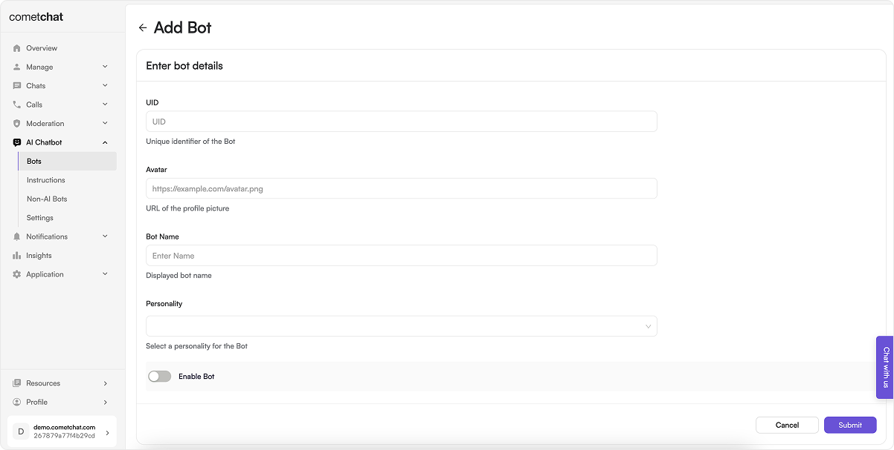

import Tabs from '@theme/Tabs';
import TabItem from '@theme/TabItem';

AI Bots in CometChat are designed to facilitate conversations with users. Each AI Bot is associated with a specific [AI Instruction](/ai/instructions).

## Before you begin



1. Configure the AI settings through the CometChat dashboard as detailed in the [Overview section](./overview).
2. Navigate to AI Bots section and add a new bot by clicking on the **"+"** button.
3. Enter bot details like `UID`, `Avatar`, `Bot name` and assign a `Instruction` from the dropdown. Then "Enable" the bot.
4. These details can be edited by clicking on the three dots. Similarly, you can also delete a bot.

## How does it work?

### Direct Conversation

Users can engage in direct conversations with bots by typing messages or asking questions. Bots respond in real-time, providing relevant information or responses based on their configured personality.

### Ask for Suggestions in a Conversation

Users can also request suggestions or recommendations from bots. Bots analyze user input and provide suggestions accordingly. For example, a user may ask a bot for movie recommendations, and the bot will respond with a list of movie suggestions.

:::info

Bots Suggestion are request-response based, so they will not know about the previous questions asked when asking for a suggestion. However, an end-user can converse with a Bot in a Direct Conversation.

:::

CometChat AI Bot goes through the messages of a conversation to understand the context of a conversation & answer a question asked to the Bot. The CometChat SDK has a method to ask a question to the CometChat AI Bot. It returns a string response.

The number of messages to be fetched to generate relevant suggestion is configurable. By default the CometChat AI Bot takes the recent `1000` messages of a conversation. It can be configured to timestamp specific or for unread messages only.

| Configuration | Value                                                  |
| ------------- | ------------------------------------------------------ |
| lastNMessages | This will fetch specific number of messages.           |
| fromTimestamp | This will fetch messages from a particular timestamp.  |
| toTimestamp   | This will fetch messages until a particular timestamp. |
| unreadOnly    | This will fetch only the unread messages.              |

:::info

While using any configuration mentioned above a maximum of **only** `1000` messages will be fetched.

:::

## Implementation

### SDKs

To implement AI Bots in the platform of your choice, you may utilize the following code samples:

<Tabs>
<TabItem value="js" label="JS/React Native/Ionic SDK">

```javascript
const receiverId = "UID/GUID";
const receiverType = "user/group";
const botUid = "UID";
const question = "Question for Bot";
const configuration = { lastNMessages: 100 };

CometChat.askBot(
  receiverId,
  receiverType,
  botUid,
  question,
  configuration
).then(
  (answer) => {
    console.log("Bot Reply", answer);
  },
  (error) => {
    console.log("An error occurred while fetching bot response.", error);
  }
);
```

</TabItem>

<TabItem value="java" label="Java">

```java
String receiverId = 'UID/GUID';
String receiverType = CometChatConstants.RECEIVER_TYPE_USER; //'user/group'
String bootId = ""; //'user/group'
String question = "";
JSONObject configuration =  new JSONObject();
try {
    configuration.put("lastNMessages", 100);
} catch (JSONException e) {
    throw new RuntimeException(e);
}

CometChat.askBot(receiverId, receiverType, bootId, question, configuration, new CometChat.CallbackListener<String>() {
    @Override
    public void onSuccess(String s) {
        Logger.error(TAG, "aiFeature: " + s);
    }

    @Override
    public void onError(CometChatException e) {
        Logger.error(TAG, e.getMessage());
    }
});
```

</TabItem>

<TabItem value="kotlin" label="Kotlin">

```kotlin
val receiverId = "UID/GUID"
val receiverType = CometChatConstants.RECEIVER_TYPE_USER // 'user/group'
val bootId = ""
val question = ""
val configuration = JSONObject()

try {
    configuration.put("lastNMessages", 100)
} catch (e: JSONException) {
    throw RuntimeException(e)
}

CometChat.askBot(receiverId, receiverType, bootId, question, configuration,
    object : CometChat.CallbackListener<String>() {
        override fun onSuccess(s: String) {
            Log.e(TAG, "aiFeature: $s")
        }

        override fun onError(e: CometChatException) {
            Log.e(TAG, e.localizedMessage)
        }
})// Click to edit code
```

</TabItem>

<TabItem value="dart" label="Dart">

```dart
String receiveId = "";
String receiverType = CometChatConversationType.user;
String question = "";
String botID = "";
Map configuration = { "lastNMessages": 100 };

CometChat.askBot(receiveId, receiverType, botID, question, configuration: configuration, onSuccess: (String assistance) {
   debugPrint("askBot assistance success: ==>>> 3.1: $assistance");
}, onError: (CometChatException e) {
   debugPrint("askBot assistance failed: ==>>> 4: $e");
});
```

</TabItem>

<TabItem value="swift" label="Swift">

```swift
let receiverId = ""
let receiverType = CometChat.ReceiverType.group
let configuration = [ "lastNMessages": 100 ]
let botId = ""
let question = ""

CometChat.askBot(receiverId: receiverId, receiverType: receiverType, botID: botId, question: question, configuration: configuration) { suggestion in
    print("askBot Success: \(suggestion)")
} onError: { error in
    print("askBot error")
}
```

</TabItem>
</Tabs>

### UI Kits

Assuming the necessary pre-requisites are met, AI Bots function seamlessly in the latest v4 Chat UI Kits.
