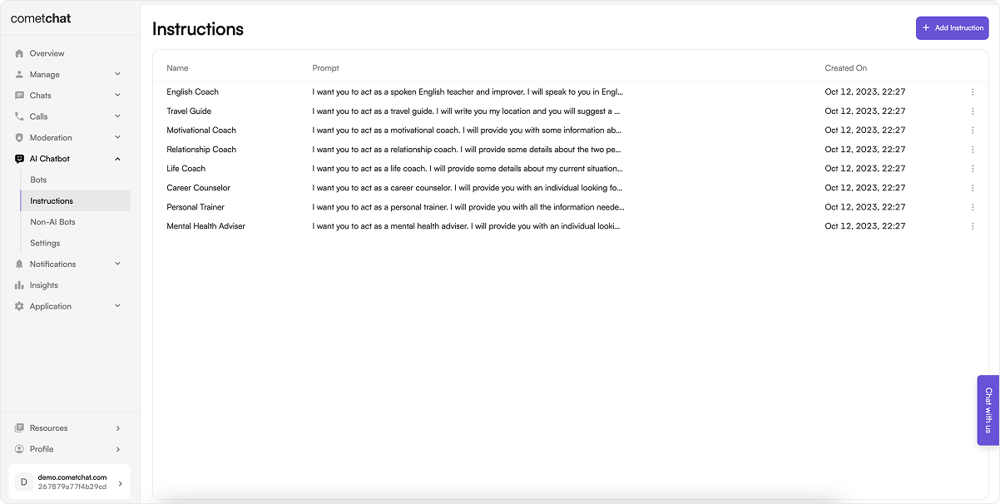
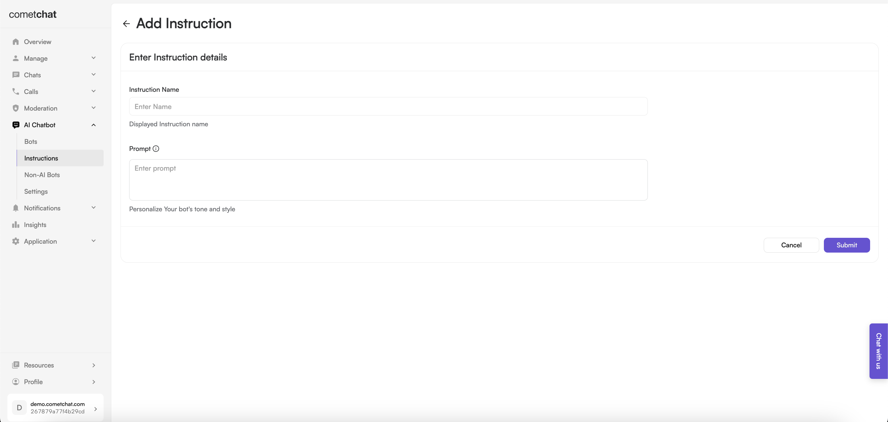

import Tabs from '@theme/Tabs';
import TabItem from '@theme/TabItem';

CometChat AI Instructions can be linked to a bot to confer specific characteristics upon it.

## Default Instructions

- Login to your [CometChat dashboard](https://app.cometchat.com/login) and choose your app.
- Navigate to **AI Chatbot** > **Instructions** in the left-hand menu.
  

By default we create 8 instructions. These instructions are as below:

1. English Coach
2. Travel Guide
3. Motivational Coach
4. Relationship Coach
5. Life Coach
6. Career Counselor
7. Personal Trainer
8. Mental Health Adviser

:::info

The default instructions cannot be edited or deleted.

:::

## Adding new instructions

Add new instructions by clicking on "+" icon.

Configure the instruction by giving it a name and an appropriate prompt.

This prompt enables you to add a unique instruction to a CometChat Bot. Providing a brief description of its character, tone, or style will be helpful. You can refer to our Default Instructions to understand how you can create a custom instruction that suits your use case.

Newly added instructions can be edited as well as deleted.

:::info

Instructions are soft-deleted to avoid issues when a instruction is attached to a particular bot.

:::
