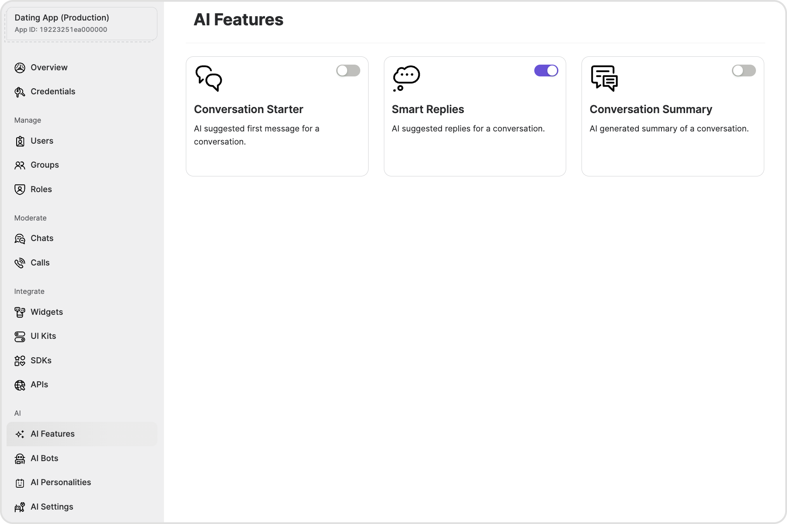

import Tabs from '@theme/Tabs';
import TabItem from '@theme/TabItem';

**Smart Replies** enable the retrieval of an AI-generated response message within a conversation.

## Before you begin

1. Configure the AI settings through the CometChat dashboard as detailed in the [Overview section](./overview).
2. Navigate to AI features and enable **Smart Replies**.

3. Implement the chat functionality in your applications using [CometChat's **v4** Chat SDKs](/sdk/javascript/overview).

## How does it work?

CometChat AI goes through the messages of a conversation to understand the context of a conversation & provide relevant replies. It returns three replies: `positive, negative & neutral`.

The CometChat SDK has a method to fetch the smart replies in a conversation. It returns an object of three replies with keys: `positive, negative & neutral`.

The number of messages to be fetched to generate relevant Smart Replies is configurable. By default the CometChat AI takes the latest `1000` messages. This can be configured to specific timestamps as well.

| Configuration | Value | 
| ---- | ---- | 
| lastNMessages | This will fetch specific number of messages. | 
| fromTimestamp | This will fetch messages from a particular timestamp. | 
| toTimestamp | This will fetch messages until a particular timestamp. | 
| unreadOnly | This will fetch only the unread messages. | 


:::info

While using any configuration mentioned above a maximum of **only** `1000` messages will be fetched.

:::

## Implementation

### SDKs

To implement Smart Replies in the platform of your choice, you may utilize the following code samples:

<Tabs>
<TabItem value="js" label="JS/React Native/Ionic SDK">

```javascript
const receiverId = 'UID/GUID';
const receiverType = 'user/group';
const configuration = {lastNMessages: 100};

CometChat.getSmartReplies(receiverId, receiverType, configuration).then(
	(smartReplies) => {
    const { positive, negative, neutral } = smartReplies;
  	console.log("Positive Reply", positive);
  	console.log("Negative Reply", negative);
  	console.log("Neutral Reply", neutral);
  }, 
  (error) => {
  	console.log("An error occurred while fetching smart replies", error);
  }
);
```

</TabItem>

<TabItem value="java" label="Java">

```java
String receiverId = 'UID/GUID';
String receiverType = 'user/group';
JSONObject configuration =  new JSONObject();
try {
    configuration.put("lastNMessages", 100);
} catch (JSONException e) {
    throw new RuntimeException(e);
}

CometChat.getSmartReplies(receiverId, CometChatConstants.RECEIVER_TYPE_USER, configuration, new CometChat.CallbackListener<HashMap<String, String>>() {
    @Override
    public void onSuccess(HashMap<String, String> smartReplies) {
        Iterator<String> iterator = smartReplies.keySet().iterator();
        for (String s : smartReplies.keySet()) {
            Log.e(TAG, "Smart Reply : " + iterator.next() + " " + smartReplies.get(s));
        }
    }

    @Override
    public void onError(CometChatException e) {
        Logger.error(TAG, e.getMessage());
    }
});
```

</TabItem>

<TabItem value="kotlin" label="Kotlin">

```kotlin
val receiverId: String = 'UID/GUID'
val receiverType: String = 'user/group'
val configuration = JSONObject()
try {
    configuration.put("lastNMessages", 100)
} catch (e: JSONException) {
    throw RuntimeException(e)
}

CometChat.getSmartReplies(
    receiverId,
    CometChatConstants.RECEIVER_TYPE_USER,
    configuration,
    object : CallbackListener<HashMap<String, String>>() {
        override fun onSuccess(smartReplies: HashMap<String, String>) {
            val iterator: Iterator<String> = smartReplies.keys.iterator()
            for (s in smartReplies.keys) {
                Log.e(TAG, "Smart Reply : " + iterator.next() + " " + smartReplies[s])
            }
        }

        override fun onError(e: CometChatException) {
            Logger.error(TAG, e.message)
        }
    }
)
```

</TabItem>

<TabItem value="swift" label="Swift">

```swift
let receiverId = ""
let receiverType = CometChat.ReceiverType.user
let configuration = [ "lastNMessages": 100 ]

CometChat.getSmartReplies(receiverId: receiverId, receiverType: receiverType, configuration: configuration) { smartRepliesMap in
    print("GetSmartReplies success: \(smartRepliesMap)")
} onError: { error in
    print("GetSmartReplies error: \(error?.errorDescription)")
}
```

</TabItem>

<TabItem value="dart" label="Dart">

```dart
String receiveId = "";
String receiverType = CometChatConversationType.user;
Map configuration = { "lastNMessages": 100 };


CometChat.getSmartReplies(receiveId, receiverType, configuration: configuration, onSuccess: (HashMap<String, String> map) {
    debugPrint("getSmartReplies Success: $map");
}, onError: (CometChatException e) {
    debugPrint("getSmartReplies Error: $e");
});
```

</TabItem>
</Tabs>


### UI Kits

Assuming the necessary pre-requisites are met, Smart Replies function seamlessly in the latest v4 Chat UI Kits.
An AI icon should appear on the Message composer. Clicking on that icon should list Smart Replies.