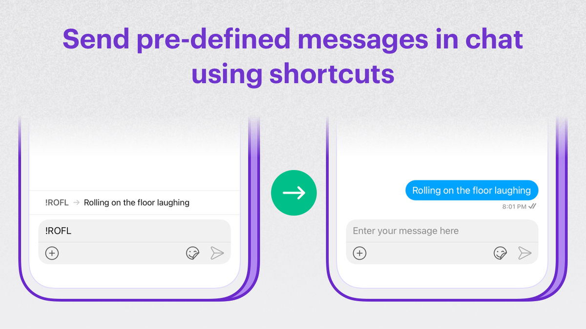

import Tabs from '@theme/Tabs';
import TabItem from '@theme/TabItem';

The Message Shortcuts extension enables your users to send each other predefined messages.

For example, **!hb** can be automatically expanded to **Happy birthday!**



## Extension settings

1. Login to [CometChat](https://app.cometchat.com/login) and select your app.
2. Go to the Extensions section and enable the Message shortcuts extension.
3. Open the settings for this extension.
4. You should a list of Global Message shortcuts.
5. Edit the existing shortcuts or add new ones.
6. Save your settings.

## How does it work?

The shortcuts saved in the Extension's settings are Global message shortcuts that can be accessed by all the users of your app. The shortcuts saved by users are accessible only to them along with the Global message shortcuts.

With the Message Shortcuts extension, you can:

1. Fetch all shortcuts on your user's device.
2. Allow users to edit, define or delete shortcuts.
3. Send predefined message by typing shortcuts.

## Implementation

### 1. Fetch all shortcuts

Once the user has successfully logged in, you can request the shortcuts from the extension. Additionally, you can provide a button to refresh the shortcuts.

Make use of the `callExtension` method exposed by the CometChat SDK to fetch the shortcuts.

<Tabs>
<TabItem value="Javascript" label="Javascript">

```javascript
CometChat.callExtension('message-shortcuts', 'GET', 'v1/fetch', null)
.then(shortcuts => {
 	 // Save these shortcuts locally.
})
.catch(error => {
	// Some error occured
});
```
</TabItem>
<TabItem value="Java" label="Java">

```java
CometChat.callExtension("message-shortcuts", "GET", "/v1/fetch", null,
    new CometChat.CallbackListener<JSONObject>() {
    @Override
    public void onSuccess(JSONObject responseObject) {
        // Shortcuts received here.
    }

    @Override
    public void onError(CometChatException e) {
        // Some error occured.
    }
});
```
</TabItem>
<TabItem value="Swift" label="Swift">

```swift
CometChat.callExtension(slug: "message-shortcuts", type: .get, endPoint: "v1/fetch", body: nil, onSuccess: { (response) in
	print("Stickers",response)
}) { (error) in
  print("Error",error?.errorCode, error?.errorDescription)
}
```
</TabItem>
</Tabs>


The response will have the following JSON structure:

<Tabs>
<TabItem value="JSON" label="JSON">

```json
{
  "shortcuts": {
    "!hbd": "Happy Birthday! 🥳",
    "!cu": "See you later.",
    "!ty": "Hey! Thanks a lot! 😊",
    "!wc": "You're welcome!"
  }
}
```
</TabItem>
</Tabs>


### 2. Modify shortcuts

Shortcuts can be added, edited or deleted by your users. You need to have a section in your front-end application that allows the users to do so. The extension accepts a final list of shortcuts after all the modifications have been done by the user.

Make use of the `callExtension` method exposed by the CometChat SDK to submit the final customized list.

<Tabs>
<TabItem value="Javascript" label="Javascript">

```javascript
const finalList = {
  shortcuts: {
    "!hbd":"Happy birthday! Have fun!"
  }
};

CometChat.callExtension('message-shortcuts', 'POST', 'v1/update', finalList)
.then(response => {
 	 // Updated successfully.
})
.catch(error => {
	// Some error occured
});
```
</TabItem>
<TabItem value="Java" label="Java">

```java
import org.json.simple.JSONObject;

JSONObject finalList = new JSONObject();
JSONObject shortcuts = new JSONObject();

shortcuts.put("!hbd", "Happy birthday! Have fun!");
shortcuts.put("!ttyl", "Talk to you later");

finalList.put("shortcuts", shortcuts);

CometChat.callExtension("message-shortcuts", "POST", "/v1/update", finalList,
 new CometChat.CallbackListener < JSONObject > () {
    @Override
    public void onSuccess(JSONObject jsonObject) {
        //On Success
    }
    @Override
    public void onError(CometChatException e) {
        //On Failure
    }
});
```
</TabItem>
<TabItem value="Swift" label="Swift">

```swift
let finalList = ["shortcuts": ["!hbd": "Happy Birthday!" ,
            "!cu" : "See you later.",
            "!ty", "Hey! Thanks a lot! :blush:",
            "!wc", "You're welcome!"]]
CometChat.callExtension(slug: "message-shortcuts", type: .post, endPoint: "v1/update", body: finalList, onSuccess: { (response) in
	// Updated successfully.
}) { (error) in
	// Error occured
}
```
</TabItem>
</Tabs>


### 3. Use shortcuts

The UI implementation can be as follows:

1. When `!` is typed in the message composer, a list pops up above the message composer with all the available shortcuts and their predefined values.
2. On typing the next letter after the`!` typed earlier, the list gets filtered with the shortcuts that start with that letter.
3. Clicking on any shortcut from the list, expands the corresponding predefined message in the message composer.