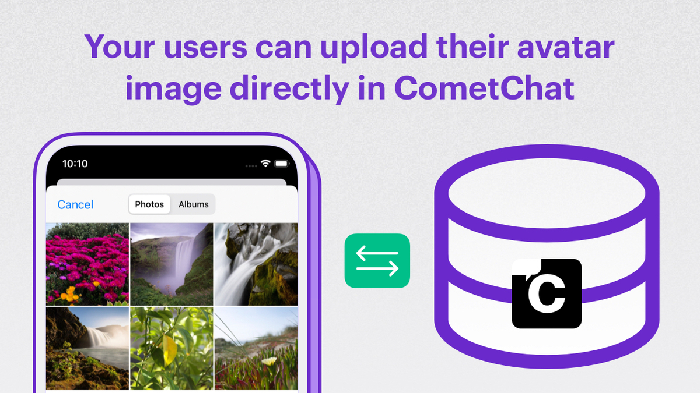

import Tabs from '@theme/Tabs';
import TabItem from '@theme/TabItem';

This extension allows the end-users to upload an avatar image for their profile.

With the Avatars Extension, your users can upload your end-users' avatar directly in CometChat. This extension is useful when you do not have a user profile management feature in your website or mobile app. 



## Extension settings

1. Login to [CometChat](https://app.cometchat.com/login) and select your app.
2. Go to the Extensions section and enable the Avatars extension.

## How does it work?

This extension allows the users to select an image for their avatar on CometChat.

Once the image file is selected for the avatar, it needs to be uploaded in the `base64` format. The extension hosts the image and updates its URL in the avatar section of the user's profile. Also, the avatar URL is sent back in the success response for being updated in your backend.

Image formats allowed by the extension are: `jpg`, `jpeg`, `png`, svg.

Make use of the `callExtension` method provided by the CometChat SDK as shown below.

:::info Max size limit
 The size of the Avatar image file is limited to 2 MB. Please validate the size of the image before uploading it to CometChat via this extension.
:::


<Tabs>
<TabItem value="Javascript" label="Javascript">

```javascript
CometChat.callExtension(
  'avatar',
  'POST',
  'v1/upload',
  {
    avatar:
      'data:image/jpeg;base64,abcd',
  }
).then(response => {
  	// { avatarURL: "https://data-eu.cometchat.io/avatars/photo123.jpg" }
  }).catch(error => {
  	// Error occured
});
```
</TabItem>
<TabItem value="Java" label="Java">

```java
import org.json.simple.JSONObject;
JSONObject body=new JSONObject();

// bytes refer to the selected image bytes
String imageString = Base64.encodeToString(bytes, Base64.NO_WRAP);

// The image type can image/jpg, image/png, etc.
// based on the image file under consideration.
body.put("avatar", "data:image/png;base64,abcd"+imageString);

CometChat.callExtension("avatar", "POST", "/v1/upload", body,
new CometChat.CallbackListener < JSONObject > () {
    @Override
    public void onSuccess(JSONObject jsonObject) {
        // {avatarURL: "https://data-us.cometchat.io/avatars/1a2b3c.jpg"}
    }
    @Override
    public void onError(CometChatException e) {
        // Some error occured
    }
});
```
</TabItem>
<TabItem value="Swift" label="Swift">

```swift
CometChat.callExtension(slug: "avatar", type: .post, endPoint: "/v1/upload", 
  body: ["avatar": "data:image/png;base64,abcd", onSuccess: { (response) in
    // { avatarURL: "https://data-eu.cometchat.io/avatars/1a2b3c.jpg" }
  }) { (error) in
    // Some error occured
  }
}
```
</TabItem>
</Tabs>

