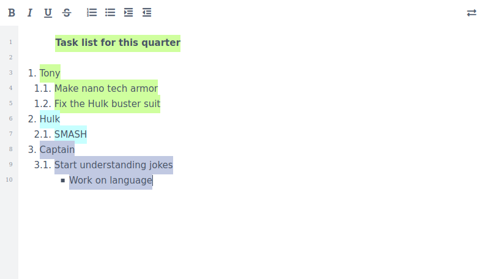

import Tabs from '@theme/Tabs';
import TabItem from '@theme/TabItem';

Learn how to collaborate using a document.

## Extension settings

1. Login to [CometChat](https://app.cometchat.com/login) and select your app.
2. Go to the Extensions section and enable the Collaborative Document extension.

## How does it work?

### Initiating the session

Using the Collaborative Document extension is pretty straight-forward. As an initiator, you only have to create a session. The extension will handle the following for you:

1. Provide you with a link for collaboration.
2. Forward the link as an invitation to the receivers.

You can initiate the session in either one-on-one chat or a group chat. The session can be shared by simply submitting the `receiver` (uid/guid) and `receiverType` (user/group).

This extension uses the `callExtension` method provided by our SDKs.

<Tabs>
<TabItem value="Javascript" label="Javascript">

```javascript
CometChat.callExtension("document", "POST", "v1/create", { 
	"receiver": "UID/GUID",
	"receiverType": "user/group"
}).then(response => {
	// Response with document url
}).catch(error => {
	// Some error occured
});
```

</TabItem>
<TabItem value="Java" label="Java">

```java
import org.json.simple.JSONObject;

JSONObject body=new JSONObject();
body.put("receiverType", "user/group");
body.put("receiver", "uid/guid");

CometChat.callExtension("document", "POST", "/v1/create", body,
	new CometChat.CallbackListener<JSONObject>() {
    @Override
    public void onSuccess(JSONObject responseObject) {
        // The document link to join as an initiator.
    }

    @Override
    public void onError(CometChatException e) {
      	// Some error occured.
    }
});
```

</TabItem>
<TabItem value="Swift" label="Swift">

```swift
CometChat.callExtension(slug: "document", type: .post, endPoint: "v1/create",
body: ["receiverType":"user/group", "receiver":"uid/guid"], onSuccess: { (response) in
        // Success response
      }) { (error) in
        // Some error occured
      }
```
</TabItem>
</Tabs>


### Receiving the details

#### As an initiator

You will be receiving the `document_url` of the session in the success callback of the `callExtension` method as shown in the above code sample.

#### As a collaborator

The receiver (can be a user or group) will get a message with the following properties:

1. category: `custom`
2. type: `extension_document`

You have to implement the Custom message listener to get the message. Please check out our [Receive Messages](/sdk/javascript/receive-message) documentation under the SDK of your choice.

By default, the unread count is not incremented for Custom Messages.

Hence, the `metadata`contains `incrementUnreadCount` with value as `true`. Use this for incrementing the unread count every time a Collaborative Document's custom message is received.

### Document metadata

The metadata section will have the details about the `document_url`.

<Tabs>
<TabItem value="JSON" label="JSON">

```json
"metadata": {
  	"incrementUnreadCount": true,
  	"@injected": {
      "extensions": {
        "document": {
          "document_url": "https://document.cometchat.io/p/uniqdocid"
        }
      }
    }
}
```
</TabItem>
</Tabs>


You can make use of the getMetadata() method for extracting the details. Refer the code samples below:

<Tabs>
<TabItem value="Javascript" label="Javascript">

```javascript
if (metadata != null) {
  var injectedObject = metadata["@injected"];
  if (injectedObject != null && injectedObject.hasOwnProperty("extensions")) {
    var extensionsObject = injectedObject["extensions"];
    if (
      extensionsObject != null &&
      extensionsObject.hasOwnProperty("document")
    ) {
      var documentExtension = extensionsObject["document"];
      var document_url = documentExtension["document_url"];
    }
  }
}
```

</TabItem>
<TabItem value="Java" label="Java">

```java
JSONObject metadata = message.getMetadata();
if (metadata != null) {
  JSONObject injectedObject = metadata.getJSONObject("@injected");
  if (injectedObject != null && injectedObject.has("extensions")) {
    JSONObject extensionsObject = injectedObject.getJSONObject("extensions");
    if (extensionsObject != null && extensionsObject.has("document"))
        {
          JSONObject documentObj = extensionsObject.getJSONObject("document");
          String board_url = documentObj.getString("document_url");
        }
    }
}
```

</TabItem>
<TabItem value="Kotlin" label="Kotlin">

```Kotlin
if (metadata != null) {
  if (metadata.has("@injected")) {
   val injectedJSONObject = metadata.getJSONObject("@injected")
   if (injectedJSONObject != null && injectedJSONObject.has("extensions")) {
   val extensionsObject = injectedJSONObject.getJSONObject("extensions")

   if (extensionsObject != null && extensionsObject.has("document")) {
   val documentObj = extensionsObject.getJSONObject("document")
   val document_url = documentObj.getString("document_url")
         }     
       }
     }
   }
```

</TabItem>
<TabItem value="Swift" label="Swift">

```swift
let textMessage = message as? TextMessage
var metadata : [String : Any]? = textMessage.metaData
if metadata != nil {

    var injectedObject : [String : Any]? = (metadata?["@injected"] as? [String : Any])!
            
    if injectedObject != nil && (injectedObject!["extensions"] != nil){

      var extensionsObject : [String : Any]? = injectedObject?["extensions"] as? [String : Any]

      if extensionsObject != nil && extensionsObject?["document"] != nil             {
        var documentObj = extensionsObject?["document"] as! [String :  Any]

        let document_url = documentObj["document_url"] as! String
      }
   }
}
```
</TabItem>
</Tabs>


### Start collaborating



The Collaborative document has the following editing features:

1. Bold
2. Italic
3. Underline
4. Strikethrough
5. Numbered list
6. Bulleted list
7. Indent and Outdent

You can export your document as:

1. Etherpad
2. HTML
3. Plain text