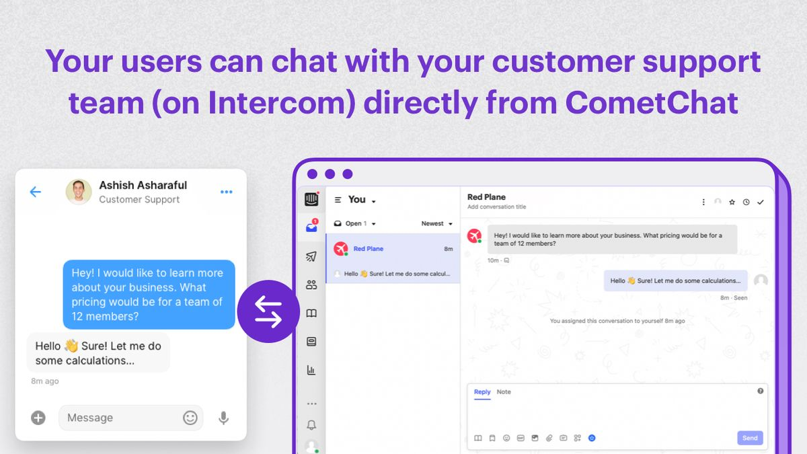
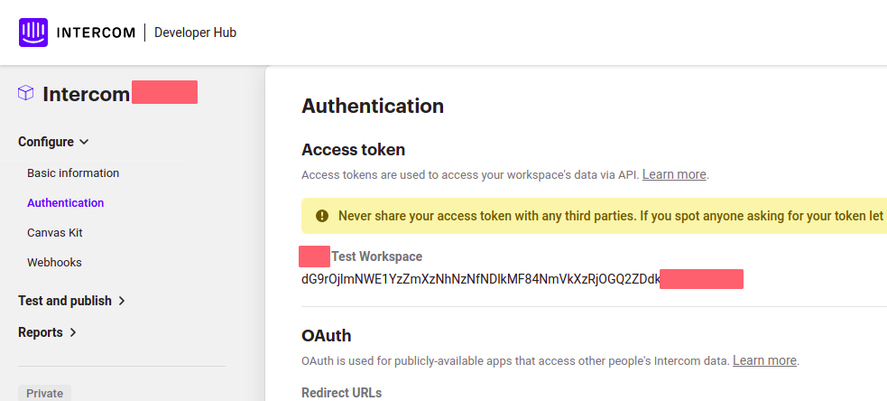
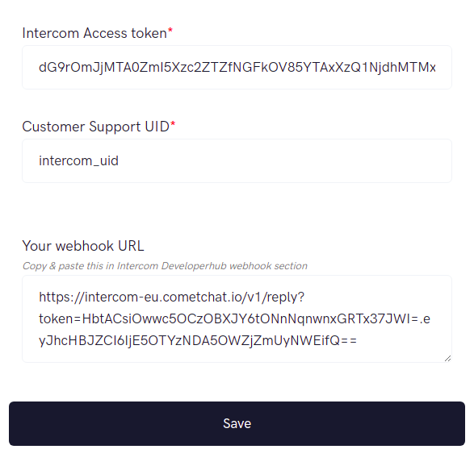
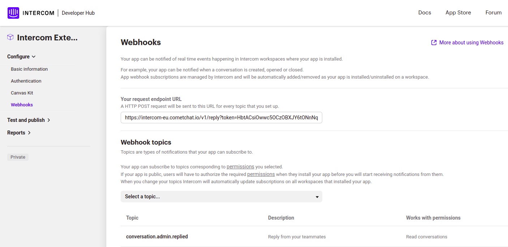

The Intercom extension makes customer support seamless for your users. Instead of having two interfaces- one for chat between users and one for chat with your support team, you can use CometChat as a front-end for your customer support use case as well!

## Before you begin

1. You may have an existing account created with Intercom. If not, sign up with [Intercom](https://intercom.com).
2. Create a test workspace by following these [steps](https://www.intercom.com/help/en/articles/188-create-a-test-workspace-in-intercom) from Intercom's documentation.
3. Once that is done, go back to the settings and expand the Developers section.
4. Click on DeveloperHub and create an app.
5. Select the newly created app and go to the Authentication section.
6. Copy the Access token as this will be required later.

:::info
 The integration works with Intercom API Verion `2.3 (2020-11-12)`. If there's a version mismatch, the extension won't work.
:::

## Extension settings

#### On CometChat Dashboard

1. Login to [CometChat](https://app.cometchat.com/login) and select your app.
2. Go to the Extensions section and enable the Intercom extension.
3. Open the Settings for this extension.
4. Enter the following and save your settings:
    1. **Intercom Access token**: Copied earlier from the Intercom Developer Hub.
    2. **Customer Support UID**: A user on CometChat that is your Customer Support user.

5. Once you save your settings, a Webhook URL will be auto generated for your app.

#### On Intercom Developer Hub

1. Copy the above auto-generated Webhook URL and paste it in the Webhooks section on the Intercom Developer Hub.
2. From the Webhook Topics, select `conversation.admin.replied`

## How does it work?

The end users of your app can send queries to the Custom Support user that you have set in the extension's settings.

These queries will be forwarded to the Intercom dashboard.

Similarly, messages sent from Intercom dashboard by the support team or admin will be sent over to CometChat and received by your end user.

With this, your end users can communicate with each other as well as your Custom support team using the same Chat interface.