## Overview

The Rules Management endpoints in the Moderation Service API provide the functionality to define and manage moderation rules that help in identifying and handling inappropriate content based on a variety of conditions. These endpoints empower app owners and collaborators to create a customized message moderation strategy tailored to the specific needs of their platform. The next section provides a detailed elaboration of the capabilities offered.

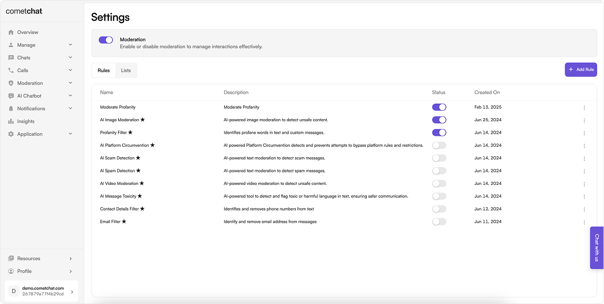

To begin managing rules:

- Login to your [CometChat dashboard](https://app.cometchat.com/login) and choose your app.
- Navigate to **Moderation** > **Settings** in the left-hand menu.
- Select the **Rules** tab.

## Default Rules

Default rules are predefined sets of message moderation conditions that are readily available for use on your platform, and automatically applied to moderate messages when enabled. These default rules form the foundation of an effective message moderation strategy, combining automation with customizable options to ensure a safe, respectful, and compliant environment for platform users. Here are the standard default rules available:

### Profanity Filter

This feature automatically detects and manages text and custom messages containing offensive language, profanity, or derogatory remarks using a predefined list of offensive keywords to block inappropriate content. Ensuring user interactions maintain a respectful tone and comply with community standards, enhances overall platform decency.

**Example**

Before enabling the profanity filter, messages containing profane words are delivered to the receiver, as indicated by double ticks in the message status. After enabling the filter, such messages are not delivered to the receiver, which is indicated by a single tick in the message status.

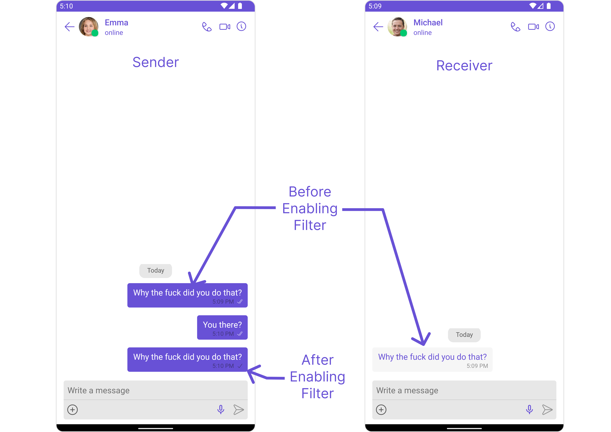

The blocked messages are then visible on the dashboard for monitoring purposes.

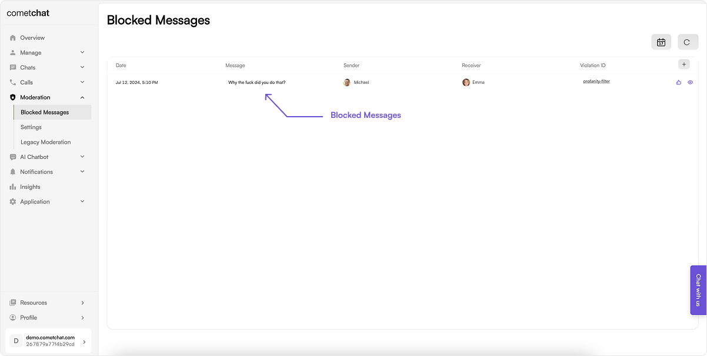

### Contact Details Filter

This feature detects and manages messages containing phone numbers by applying rules to prevent the sharing of private information that could compromise user privacy or security. It protects users from potential misuse of personal data and ensures compliance with data protection regulations.

**Example**

Before enabling the contact details filter, messages containing phone numbers are delivered to the receiver, as indicated by double ticks in the message status. After enabling the filter, such messages are not delivered to the receiver, which is indicated by a single tick in the message status.

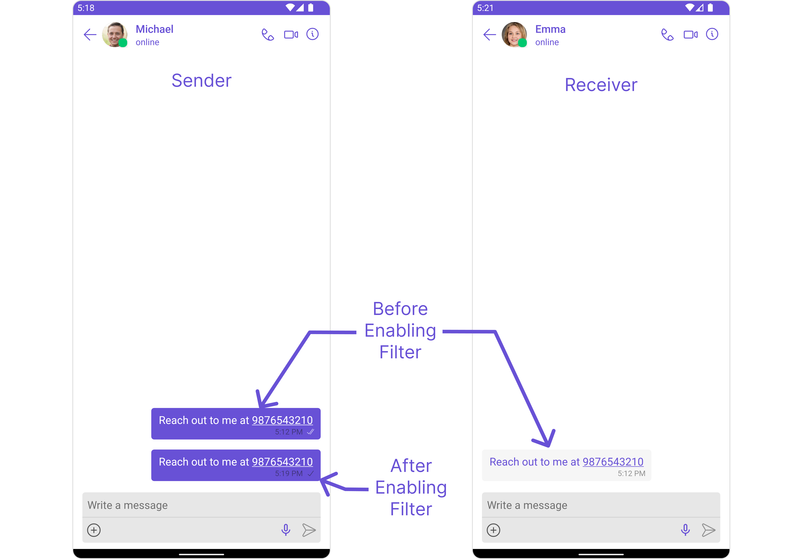

The blocked messages are then visible on the dashboard for monitoring purposes.

### Email Filter

This feature detects and manages messages containing email addresses by applying rules to prevent the sharing of private information that could compromise user privacy or security. It protects users from potential misuse of personal data and ensures compliance with data protection regulations.

**Example**

Before enabling the email filter, a message containing an email address is delivered to the receiver and can be seen on the receiver's chat screen. After enabling the filter, such messages are not delivered to the receiver, like in the example where the personal email isn't delivered to the receiver.

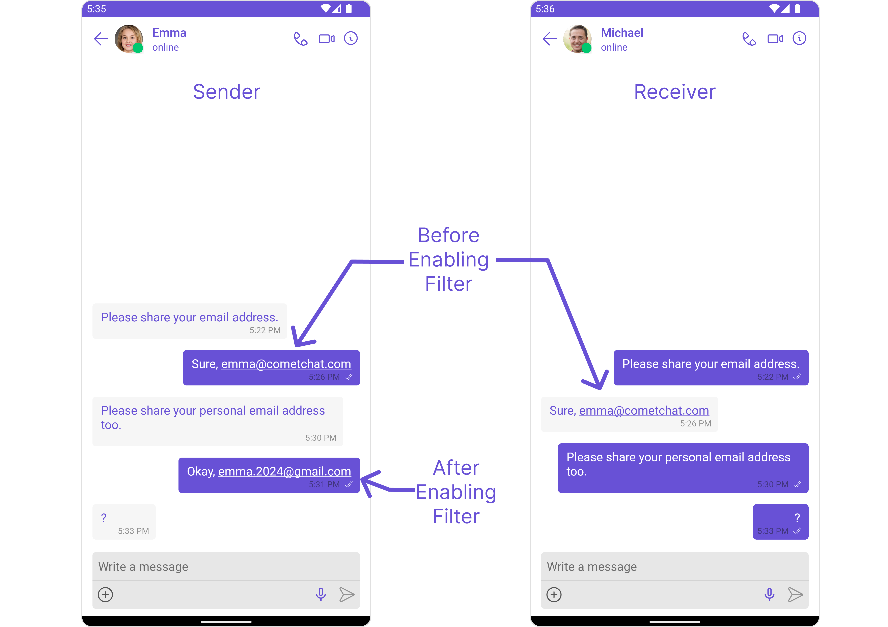

The blocked messages are then visible on the dashboard for monitoring purposes.

### AI-based Image Moderation

This feature identifies and manages image-type messages containing sensitive, explicit, or prohibited content using advanced artificial intelligence algorithms for image recognition. Once detected, the system automatically blocks the images that violate platform guidelines, ensuring that such content is not displayed to users. This proactive approach safeguards users from exposure to harmful visual material, maintaining a safe and compliant environment on the platform.

\*_Example_

Non-violating images are being delivered as seen in the example. Enabling this filter blocks violating images that are not delivered to the receiver, like in the example where the second image is indicated by a single tick in the message status on the sender's screen and isn't delivered to the receiver.

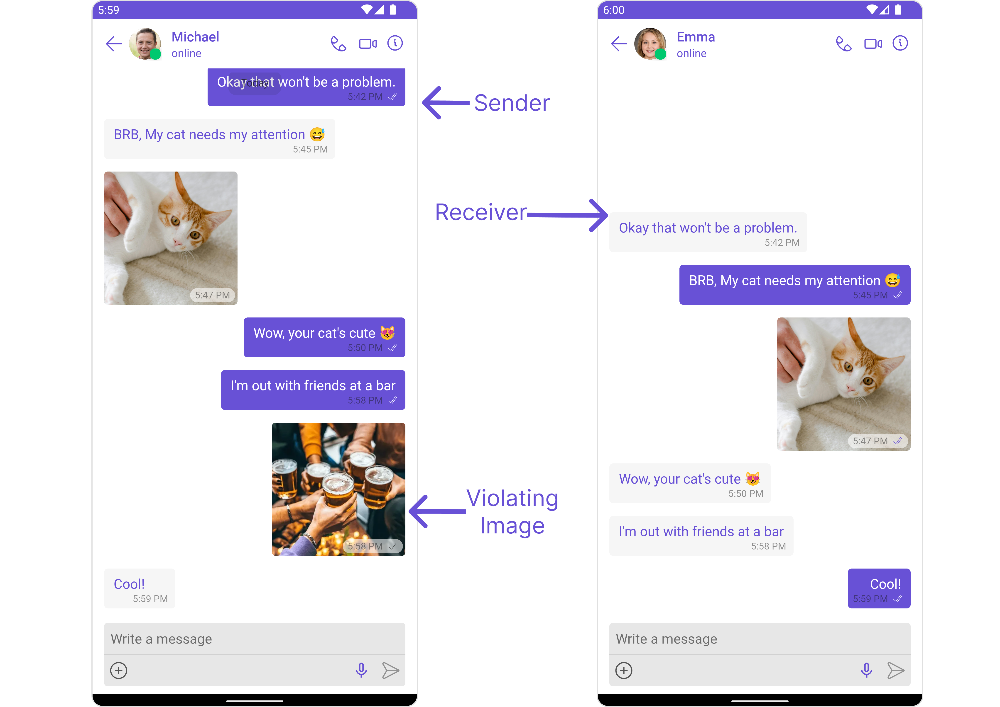

The blocked messages are then visible on the dashboard for monitoring purposes.

### AI-based Video Moderation

This feature identifies and manages video-type messages containing sensitive, explicit, or prohibited content using advanced artificial intelligence algorithms for image recognition. Once detected, the system automatically blocks the images that violate platform guidelines, ensuring that such content is not displayed to users. This proactive approach safeguards users from exposure to harmful visual material, maintaining a safe and compliant environment on the platform.

**Example**

Before enabling the AI-based Video Moderation filter, a message containing violating videos is delivered to the receiver, like in the example where the first video can be seen on the receiver's chat screen. After enabling the filter, such messages are not delivered to the receiver, which is indicated by a single tick in the message status on the sender's chat screen.

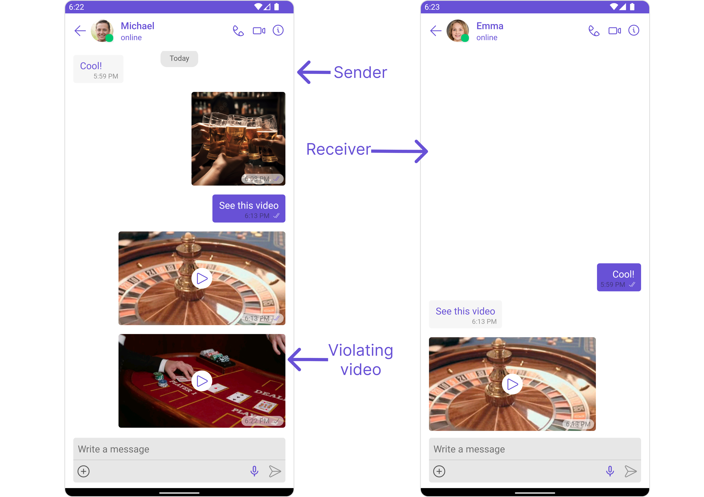

The blocked messages are then visible on the dashboard for monitoring purposes.

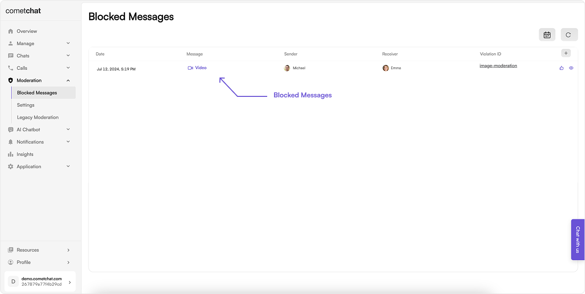

<!--  -->

### AI Message Toxicity

The AI Message Toxicity Detection rule is a powerful, AI-driven tool designed to identify and flag toxic, harmful, or inappropriate language within user-generated messages. This feature analyzes text in real-time, detecting patterns of abusive speech, such as threats, harassment, hate speech, and other forms of offensive communication. By automatically blocking these messages based on predefined moderation rules, the tool helps prevent the spread of toxic content, fostering a safer and more respectful communication environment. This system empowers platform administrators to maintain community standards, allowing them to intervene or moderate flagged messages promptly. It also supports various languages and contexts, ensuring that the platform remains compliant with safety guidelines and user conduct policies.

**Example**

Before enabling the AI message toxicity rule, a message containing a sentence which violates AI message toxicity is delivered to the receiver and can be seen on the receiver's chat screen. After enabling the filter, such messages are not delivered to the receiver.

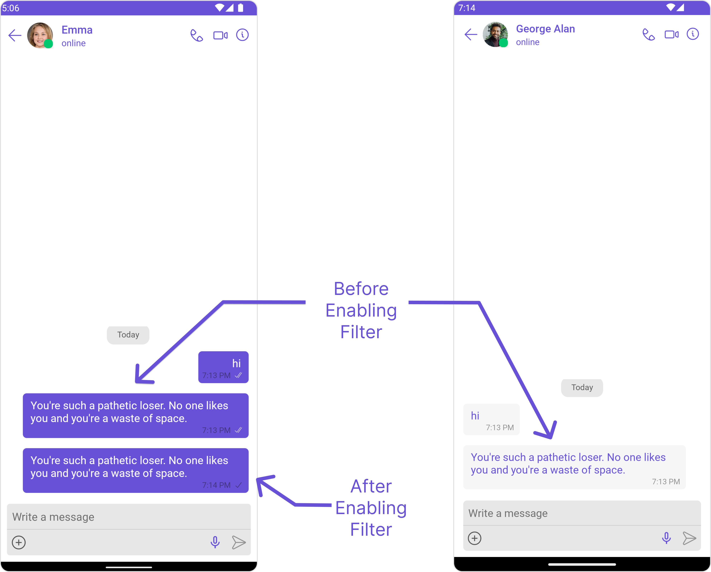

The blocked messages are then visible on the dashboard for monitoring purposes.

### AI Platform Circumvention

The AI Platform Circumvention Rule employs a list of categories related to sentence similarity to identify and manage attempts by users to circumvent platform rules. This filter analyzes user-generated content for patterns and phrases that may indicate efforts to bypass established guidelines. By leveraging AI technology, it compares new submissions against a predefined set of sentence structures and categories to detect similarities that suggest rule violations.

**Example**

Before enabling the platform circumvention filter, a message containing a sentence which violates platform circumvention is delivered to the receiver and can be seen on the receiver's chat screen. After enabling the filter, such messages are not delivered to the receiver.

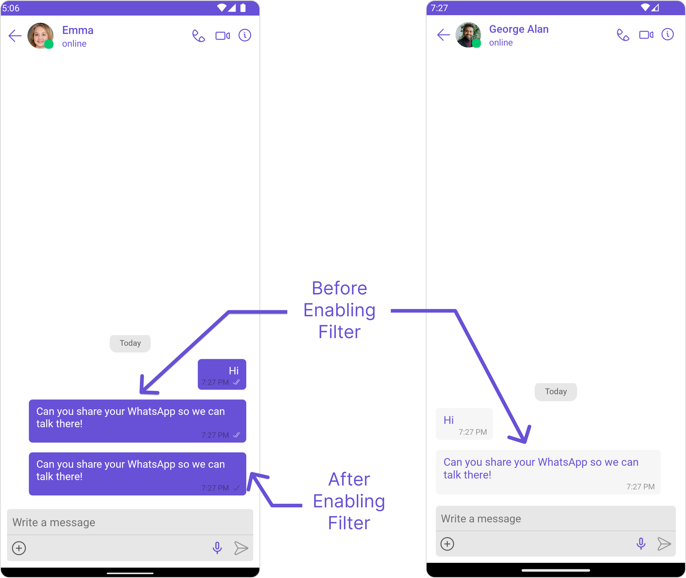

The blocked messages are then visible on the dashboard for monitoring purposes.

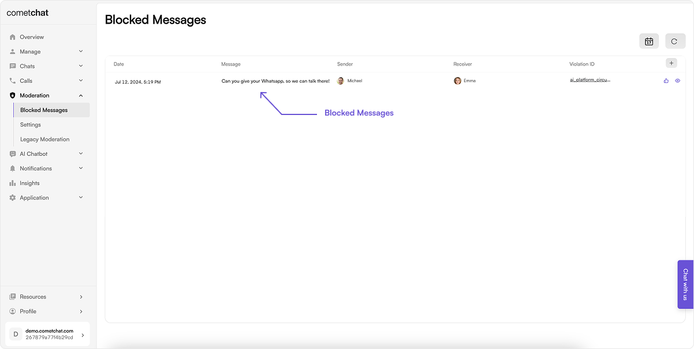

### AI Scam Detection

The AI Scam Detection rule leverages advanced AI-powered text moderation techniques to identify and prevent scam-related messages in real-time. By analyzing message patterns and identifying specific language markers and behaviors commonly associated with scams, this rule ensures that fraudulent schemes are swiftly intercepted before reaching users. This proactive detection system scans for misleading content, phishing attempts, fake offers, and other tactics typically employed by scammers, thereby safeguarding users and maintaining the trust and security of the platform. It also continuously adapts to evolving scam strategies through machine learning, making it more effective over time.

**Example**

Before enabling the AI Scam Detection rule, a message containing a sentence which violates AI Scam Detection rule is delivered to the receiver and can be seen on the receiver's chat screen. After enabling the filter, such messages are not delivered to the receiver.

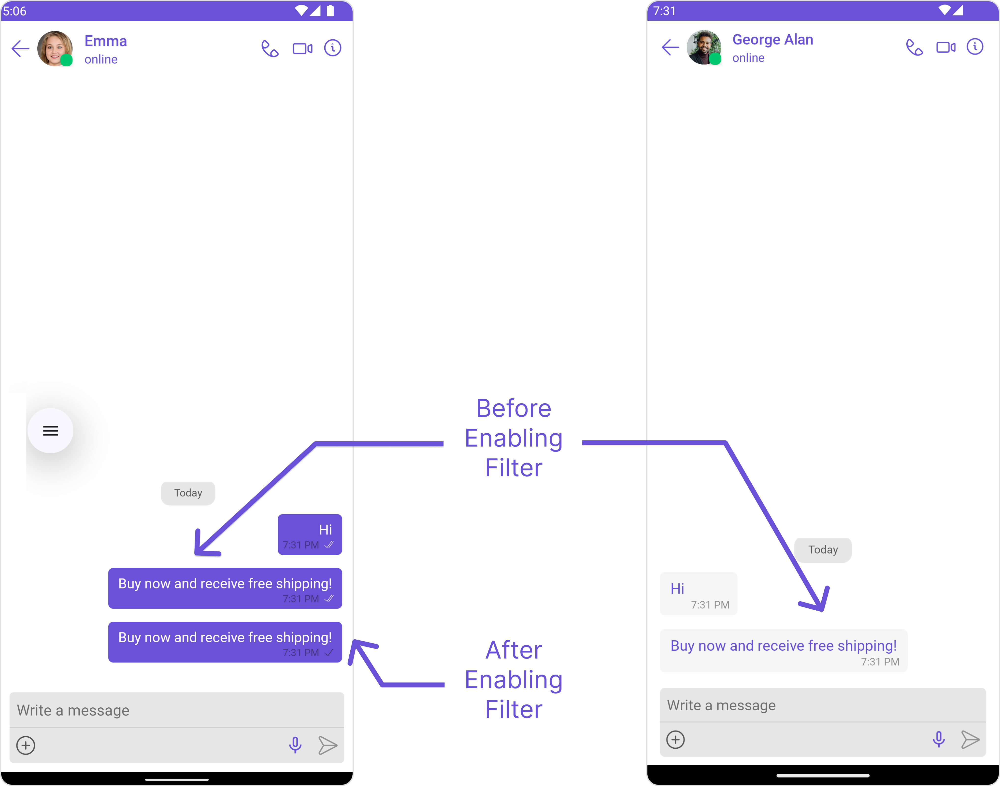

The blocked messages are then visible on the dashboard for monitoring purposes.

### AI Spam Detection

AI Spam Detection uses sophisticated AI algorithms to automatically detect and filter out spam messages in real-time. By analyzing message content and patterns, it effectively identifies unwanted or irrelevant communications, reducing the risk of spam flooding your platform. This feature helps ensure a cleaner, more efficient messaging experience, allowing users to focus on genuine, meaningful interactions.

**Example**

Before enabling the AI Spam Detection rule, a message containing a sentence which violates AI Spam Detection rule is delivered to the receiver and can be seen on the receiver's chat screen. After enabling the filter, such messages are not delivered to the receiver.

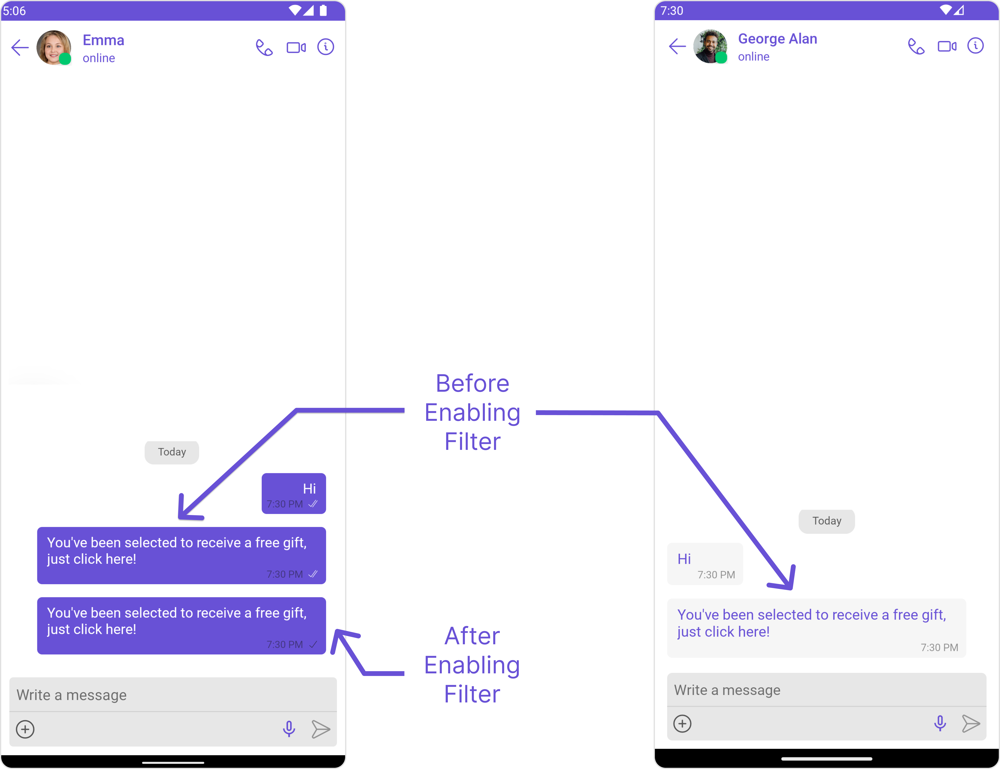

The blocked messages are then visible on the dashboard for monitoring purposes.

## Rule Filters, Conditions and Actions

### Filters

Filters allow you to narrow down messages based on the Sender or Receiver of a message.

For Senders, you can filter by specific properties like UID, Role, Name, and Tags, or see when the sender was created. Similarly, for Receivers, you can filter by properties such as Name, GUID, Tags, Group type or see when the receiver was created, and the Type of receiver (for example, a user or group). This enables targeted filtering based on user or group attributes within the conversation.

### Conditions

Conditions allow you to define criteria for blocking messages based on their type—text, image, video, or custom.

You can select a keyword list, define a list of words or patterns, for text and custom messages.
In addition to selecting specific words, patterns, or lists for text and custom messages, you can also choose filters based on Toxicity, Sentiment, or Sentence Similarity for more advanced moderation and content analysis.
You can refine Toxicity filtering by selecting categories such as Identity Attack, Insult, Obscene, Mild Toxicity, or Severe Toxicity. For Sentiment, you can choose to filter messages based on positive or negative sentiment.
In Sentence Similarity, you have the option to apply a default or custom list.
Additionally, you can set a confidence percentage for each criterion to determine the threshold for blocking messages.

For media messages you can select among categories like Violence, Gambling, Alcohol, Drugs and Tobacco, Rude gestures, Explicity nudity, Non-explicit nudity, Swimwear or underwear, Visually disturbing, Hate symbols or Any unsafe content. Additionally, you can set a confidence percentage for each criterion to determine the threshold for blocking messages.

### Actions

Actions specify what happens when content matches the conditions. In addition to blocking the message by default, actions include options such as banning or kicking a user from a group and blocking a user.

## Configuring rules

### Create Rule

Allows you to define new moderation rules specifying the conditions under which messages should be blocked.

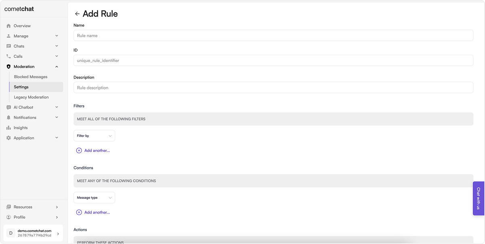

Creating a new rule from the dashboard:

1. Click the Add button within the Rules tab.
2. Configure the Rule by saving the following details:
   - Name: Name for the moderation rule.
   - Rule ID: The unique identifier of the rule.
   - Description: Detailed explanation of the rule's purpose.
   - Filter: List of filters that must be met for the rule to trigger.
   - Condition: List of conditions that must be met for the rule to trigger.
   - Action: Choose from a set of actions to be taken when a violation is detected.
3. Save
4. Enable the Rule to start moderating!

You can also set this up from your end using the [Create Moderation Rule REST API](https://api-explorer.cometchat.com/reference/create-rule).

### List Rules

Fetches the details of the existing list of rules.

You can also set this up from your end using the [List Moderation Rules REST API](https://api-explorer.cometchat.com/reference/list-rules).

### Get Rule

Fetches the details of a rule. You can set this up from your end using the [Get Moderation Rule REST API](https://api-explorer.cometchat.com/reference/get-rule).

### Update Rule

Enables modifications to existing rules. This includes changing conditions, updating actions, or refining parameters to improve accuracy.

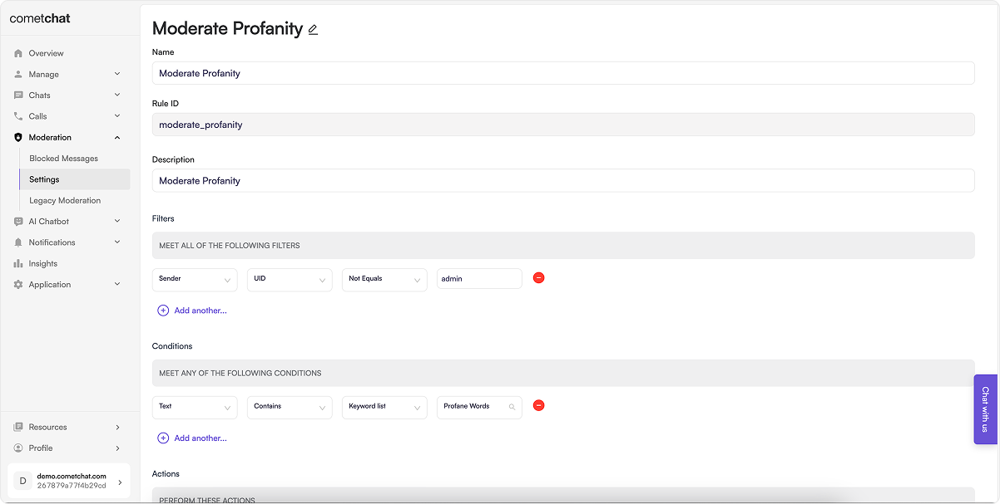

Updating a rule from the dashboard:

1. Click on "Edit" in the action menu of the rule you want to update.
2. Update the Rule by saving the following details:
   - Name: Descriptive name for the moderation rule.
   - Description: Detailed explanation of the rule's purpose.
   - Filter: List of filters that must be met for the rule to trigger.
   - Condition: List of conditions that must be met for the rule to trigger.
   - Action: Choose from a set of actions to be taken when a violation is detected.
3. Save

You can also set this up from your end using the [Update Moderation Rule REST API](https://api-explorer.cometchat.com/reference/update-rule).

### Delete Rule

Permits the deletion of outdated or unnecessary rules from the system. This helps in maintaining an efficient and relevant set of moderation guidelines.

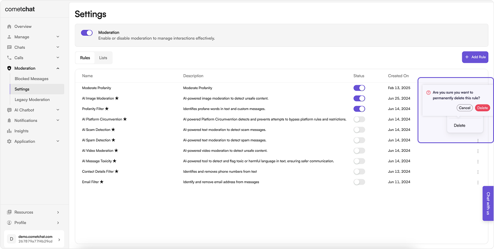

Deleting a rule from the dashboard:

- Click "Delete" in the action menu of the rule you want to remove, then confirm.

You can also set this up from your end using the [Delete Moderation Rule REST API](https://api-explorer.cometchat.com/reference/delete-rule).

### Rule Revisions

The ability to fetch all revisions of a rule in a moderation system allows app owners and collaborators to retrieve a comprehensive history of updates and changes made to specific moderation rules over time. This feature provides detailed insights into how rules have been adjusted and refined to better manage and moderate content on the platform.

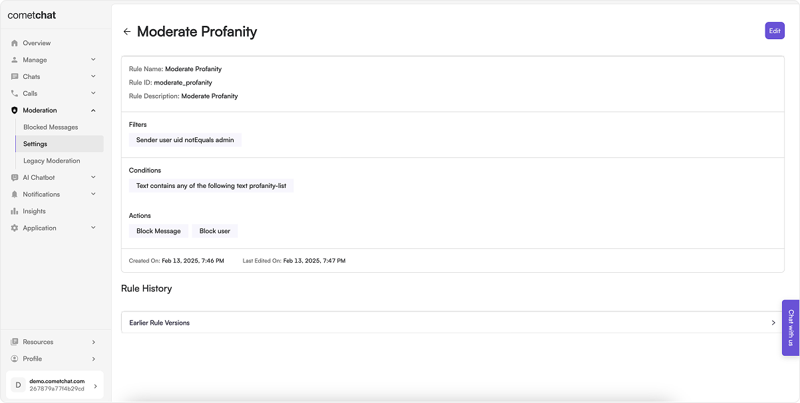

Viewing the rule revisions on the dashboard:

1. Click "View" in the action menu of the rule for which you wish to see revisions.
2. Navigate to the Rule History section.

You can also set this up from your end using the [Get Moderation Rule Revisions REST API](https://api-explorer.cometchat.com/reference/list-rule-revisions).
