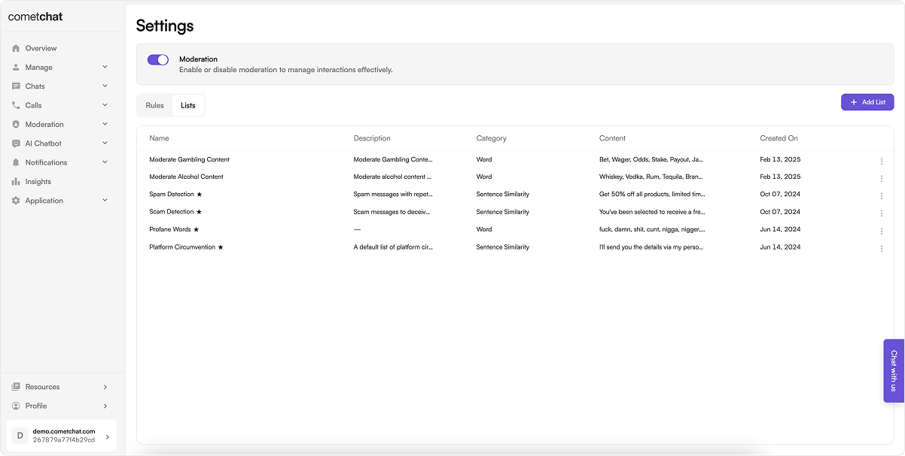
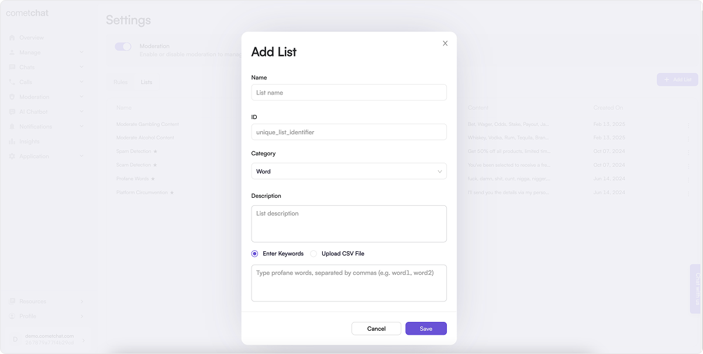
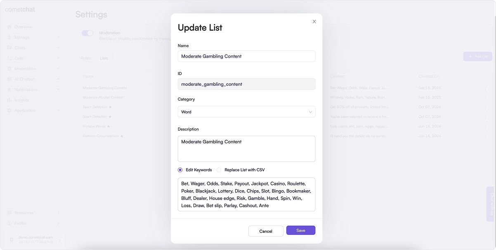
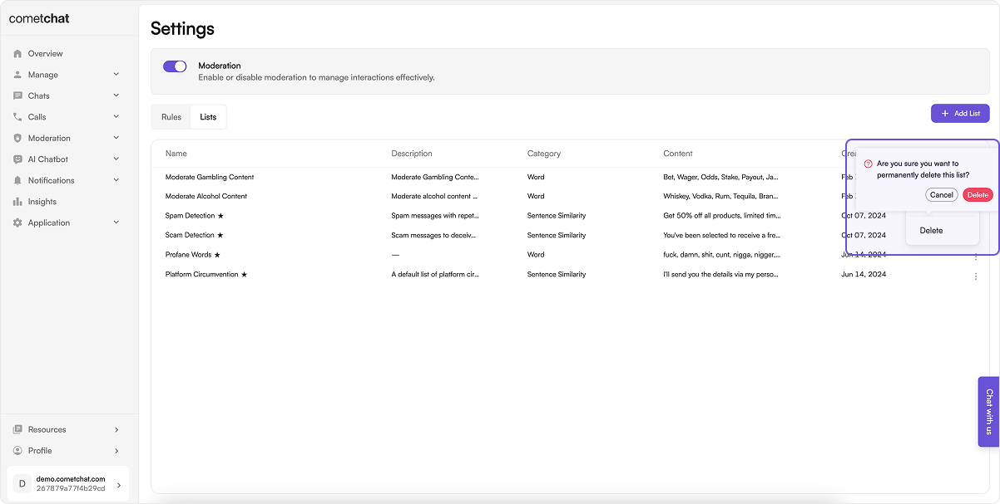

## Overview

The Lists Management endpoints in the Moderation Service API provide essential tools for creating and managing lists of keywords or regex patterns that are crucial for effective message moderation. These endpoints enable app owners and collaborators to define specific terms, phrases, or patterns that, when detected in user-generated content, trigger moderation actions. The next section provides a detailed elaboration of the capabilities offered.

To begin managing lists:

- Login to your [CometChat dashboard](https://app.cometchat.com/login) and choose your app.
- Navigate to **Moderation** > **Settings** in the left-hand menu.
- Select the **Lists** tab.

## Default Lists

Default lists are predefined lists of words, patterns and sentences that are readily available for use on your platform. Here are the standard default lists available:

### Profane Words

Our default list is a comprehensive compilation of predefined profane words and phrases. This list is designed to enhance message moderation efforts by automatically identifying and flagging inappropriate language.

### Platform Circumvention

The Platform Cicurvention list contains a curated set of sentences and words designed to identify attempts to circumvent platform rules and policies. These phrases are used by the AI Platform Circumvention Rule to detect and prevent efforts aimed at bypassing restrictions, ensuring compliance and maintaining platform integrity.

### Spam Detection

The Default Spam Detection List identifies repetitive or irrelevant messages promoting products, services, or schemes without user consent. It helps filter out unwanted content, including bulk messages, phishing attempts, and fraudulent offers, ensuring a cleaner and more secure communication experience.

### Scam Detection

The Default Scam Detection List includes messages crafted to deceive users by creating a sense of urgency, promising false rewards, or impersonating trusted entities. These messages often aim to manipulate users into sharing personal information, making payments, or clicking on malicious links. The list helps identify and block scams, protecting users from fraud, phishing attempts, and other deceptive practices.

## Managing Lists

### Create List

Allows you to define new moderation lists specifying the words or patterns under which text or custom messages should be blocked.

Creating a new list from the dashboard:

1. Click the Add button within the Lists tab.
1. Create the list by saving the following details:
   - Name: Descriptive name for the moderation list.
   - ID: The unique identifier of the list.
   - Category: Choose the type for list, either 'word', 'pattern' or 'sentence similarity'.
   - Description: Detailed explanation of the list.
   - Your Source type for lists could be either words, patterns or sentences, separated by a comma or a CSV file.
1. Save

You can also set this up from your end using the [Create Moderation List REST API](https://api-explorer.cometchat.com/reference/create-rule-keyword).

### Fetch All Lists

Fetches the details of existing list lists.

You can also set this up from your end using the [List Moderation Lists REST API](https://api-explorer.cometchat.com/reference/list-rule-keywords).

### Get List

Fetches the details of an existing list. You can set this up from your end using the [Get Moderation List REST API](https://api-explorer.cometchat.com/reference/get-rule-keyword).

### Update List

Allows you to update existing lists, which includes modifying the list name, category, and individual words or patterns within the list.

Updating a list from the dashboard:

1. Click on "Edit" in the action menu of the List you want to update.
1. Update the list by saving the following details:
   - Name: Descriptive name for the moderation list.
   - Category: Choose the type for List, either 'word', 'pattern' or 'sentence similarity'.
   - Description: Detailed explanation of the list.
   - Your Source type for list could be either words, patterns or sentences separated by a comma or a CSV file.
1. Save

You can also set this up from your end using the [Update Moderation List REST API](https://api-explorer.cometchat.com/reference/update-rule-keyword).

### Delete List

Allows for the removal of lists from the system that are no longer needed.

Deleting a list from the dashboard:

- Click "Delete" in the action menu of the list you want to remove, then confirm.

You can also set this up from your end using the [Delete Moderation List REST API](https://api-explorer.cometchat.com/reference/delete-rule-keyword).
