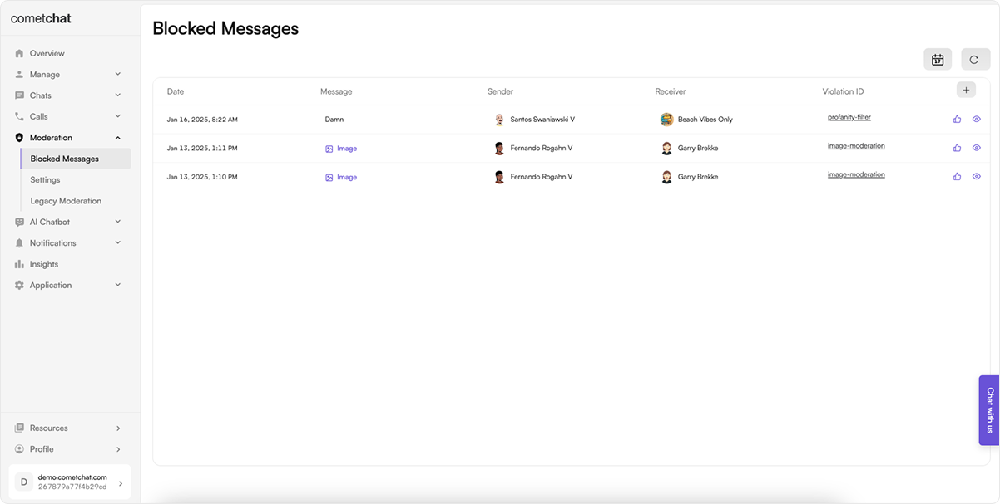

## Overview

The Blocked Messages endpoint in the Moderation Service API provides app owners and collaborators with the capability to retrieve details about messages that have been blocked due to violations of message moderation rules. This endpoint plays a crucial role in enabling platform app owners and collaborators to review and manage content that has been deemed inappropriate, harmful, or non-compliant with platform guidelines.

### List Blocked Messages

Retrieves the list of blocked messages, with the option to search messages within a specified date range.

You can also set this up from your end using the [List Moderation Blocked Message List REST API](https://api-explorer.cometchat.com/reference/list-moderation-blocked-messages).

### Approve Blocked Message

Allows the approval of messages previously blocked due to moderation violations.

You can also set this up from your end using the [Approve Blocked Message REST API](https://api-explorer.cometchat.com/reference/approve-moderation-blocked-messages).
