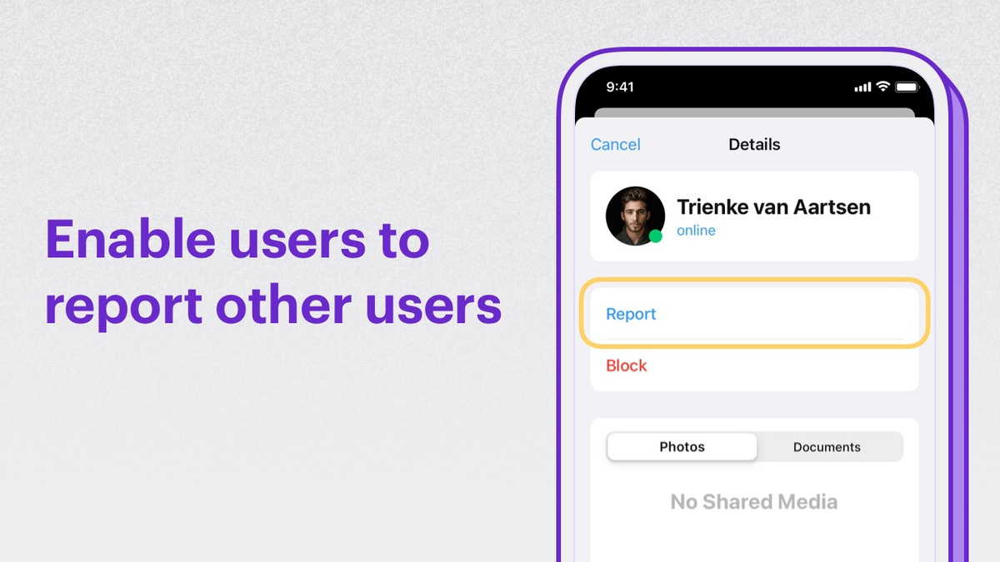
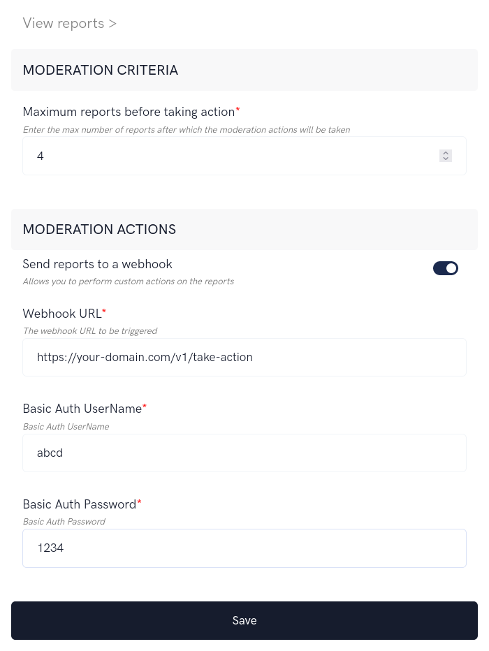
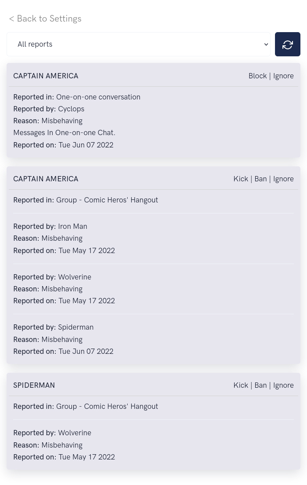

import Tabs from '@theme/Tabs';
import TabItem from '@theme/TabItem';

Enables your users to report users who use offensive or suspicious messages in the chat.



## Extension settings

1. Login to CometChat and select your app.
2. Go to the Extensions section and enable the Report user extension.
3. Open the settings for this extension.
4. The settings page has the following:
    - **Moderation criteria:** The max number of reports after which you want to be notified.
    - **Moderation actions**: Get the list of reports on the configured Webhook URL. 



## How does it work?

The extension has the following functionalities:

1. Allowing end-users to report other users.
2. Allowing admins to login to the Dashboard to take action on the reports.

### 1. Reporting a user

Users can be reported in either group conversations or one-on-one conversations.

By clicking on the user's avatar, you can show an item in the context menu called "Report". Clicking on the "Report" button should open up a modal asking for the reason.

Here's the description of the parameters that need to be passed to the extension:

| Parameters | Value | Description | 
| ---- | ---- | ---- | 
| uid | String | The UID of the user that needs to be reported | 
| reason | String | Reason for reporting. This should be max 150 characters. | 
| guid | String | The GUID of the group in which the user is being reported.If the user is being reported in a one-on-one conversation, this can be skipped. | 


Once you have the user to be reported along with the reason, make use of the callExtension method provided by the SDK to submit the report:


<Tabs>
<TabItem value="Javascript" label="Javascript">

```javascript
CometChat.callExtension('report-user', 'POST', 'v1/report', {
    "uid": "cometchat-uid-3",
  	"reason": "Misbehaving",
  	// "guid": "cometchat-guid-1" // Used only when reporting the user in a group
}).then(response => {
    // { success: true }
})
.catch(error => {
    // Error occurred
});
```

</TabItem>
<TabItem value="Java" label="Java">

```java
import org.json.simple.JSONObject;

JSONObject body=new JSONObject();

body.put("uid", "cometchat-uid-3");
body.put("reason", "Misbehaving");
// body.put("guid", "cometchat-guid-1"); // Used only when reporting the user in a group

CometChat.callExtension("report-user", "POST", "/v1/report", body,
 new CometChat.CallbackListener < JSONObject > () {
    @Override
    public void onSuccess(JSONObject jsonObject) {
        //On Success
    }
    @Override
    public void onError(CometChatException e) {
        //On Failure
    }
});
```

</TabItem>
<TabItem value="Swift" label="Swift">

```swift
CometChat.callExtension(slug: "report-user", type: .post, endPoint: "v1/report", body: [
  "uid": "cometchat-uid-3",
  "reason":"Misbehaving",
  "guid":"cometchat-guid-1" // Used only when reporting the user in a group
] as [String : Any], onSuccess: { (response) in
         // Success
      }) { (error) in
         // Error occured
      }
```
</TabItem>
</Tabs>


### 2. View reports and take action on a reported user



In order to list and take an action on the reported users:

1. Open up the Extension's settings page
2. Click "View Reports" link. This will load all the reports.
3. Select the criteria from the dropdown:
    1. One-on-one conversations =&gt; Lists the users who have been reported in One-on-one conversations.
    2. Group conversations =&gt; List the users who have been reported in a Group.
    3. All reports =&gt; Lists all the reports.

4. The following actions can be taken for users reported in Group:
    1. Kick =&gt; Reported user is kicked out of the group.
    2. Ban =&gt; Reported user is banned from the group.
    3. Ignore =&gt; The report is ignored.

5. The following actions can be take for users reported in one-on-one conversations:
    1. Block =&gt; The reported user is blocked on behalf of the reporter.
    2. Ignore =&gt; The report is ignored.

6. To load new reports, click on the Refresh button.