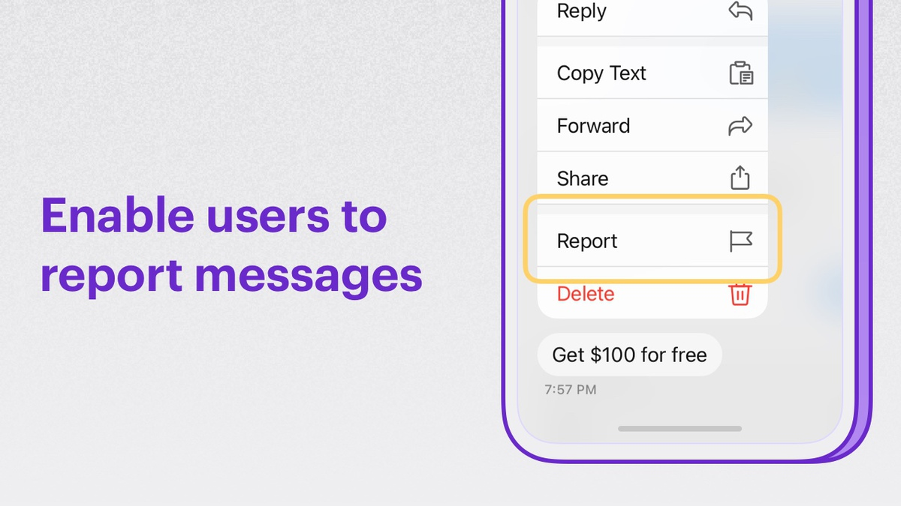
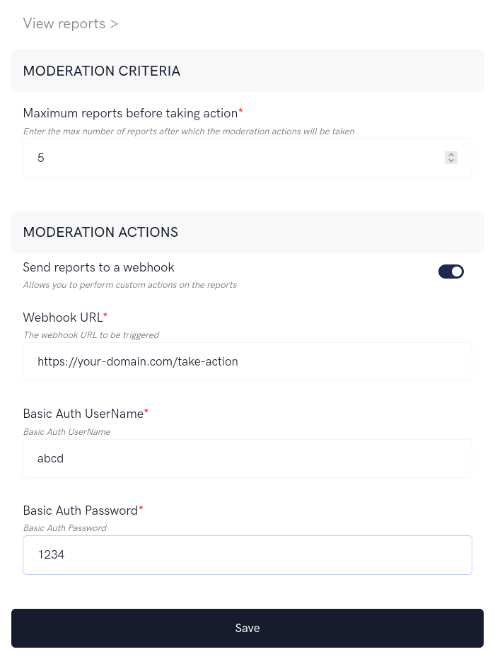
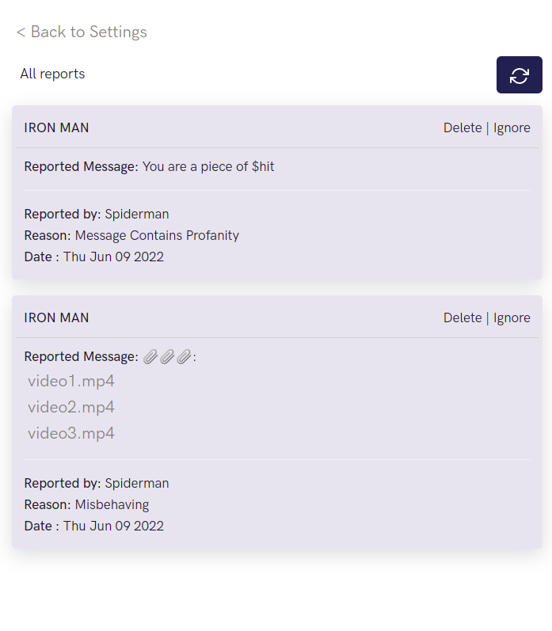

import Tabs from '@theme/Tabs';
import TabItem from '@theme/TabItem';

Enable your users to report messages in a group.



**Extension settings**

1. Login to [CometChat](https://app.cometchat.com/login) and select your app.
2. Go to the Extensions section and enable the Report messages extension.
3. Open the settings for this extension.
4. The settings page has the following:    
    - **Moderation criteria:** The max number of reports after which you want to be notified.
    - **Moderation actions:** Get the list of reports on the configured Webhook URL.



## How does it work?

The extension has the following functionalities:

1. Allowing end-users to report messages.
2. Allowing admins to login to the dashboard to take action on the reports.

### 1. Reporting a message

Messages can be reported in either group conversations or one-on-one conversations.

In the context menu of a message, you can have a "Report" button. Clicking it should open up a modal asking for the reason.

Here's the description of the parameters that need to be passed to the extension:

| Parameters | Value | Description | 
| ---- | ---- | ---- | 
| msgId | Integer | The ID of the message that has to be reported | 
| reason | String | The reason for reporting the message. | 


Once you have the message to be reported along with the reason, make use of the `callExtension`  method provided by the SDK to submit the report:

<Tabs>
<TabItem value="Javascript" label="Javascript">

```javascript
CometChat.callExtension('report-message', 'POST', 'v1/report', {
    "msgId": 123,
  	"reason": "Contains profanity"
}).then(response => {
    // { success: true }
})
.catch(error => {
    // Error occurred
});
```

</TabItem>
<TabItem value="Java" label="Java">

```java
import org.json.simple.JSONObject;

JSONObject body=new JSONObject();

body.put("msgId", 123);
body.put("reason", "Contains profanity");

CometChat.callExtension("report-message", "POST", "/v1/report", body,
 new CometChat.CallbackListener < JSONObject > () {
    @Override
    public void onSuccess(JSONObject jsonObject) {
        //On Success
    }
    @Override
    public void onError(CometChatException e) {
        //On Failure
    }
});
```
</TabItem>
<TabItem value="Swift" label="Swift">

```swift
CometChat.callExtension(slug: "report-message", type: .post, endPoint: "v1/report", body: [
  "msgId": 123,
  "reason":"Contains profanity"
] as [String : Any], onSuccess: { (response) in
         // Success
      }) { (error) in
         // Error occured
      }
```
</TabItem>
</Tabs>


### 2. View reports and take action



In order to list and take action on the reported users:

1. Open up the Extension's settings page
2. Click "View Reports" link. This will load all the reports.
3. The following actions can be taken for users reported in Group:
    1. Delete =&gt; Reported message will be deleted.
    2. Ignore =&gt; The report is ignored.

4. To load new reports, click on the Refresh button.