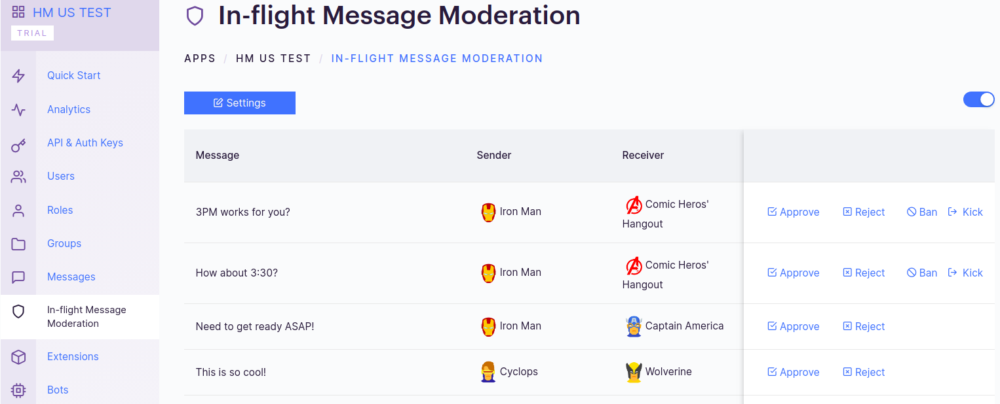

In-flight message Moderation extension allows you to moderate messages manually.

## Settings

1. Login to [CometChat](https://app.cometchat.com/login) and select your app.
2. Go to the Extensions section and enable the In-flight moderation extension.
3. Open the Settings for this extension and set the following:
    1. Moderation Criteria
        1. Moderate all the messages
        2. Moderate only one-on-one messages
        3. Moderate only Group messages

    2. Moderate messages sent BY certain users (Comma-separated UIDs).
    3. Moderate messages sent TO ceratin users (Comma-separated UIDs).
    4. Moderate messages sent TO a certain groups (Comma-separated GUIDs).

## How does it work?

Once the extension is enabled and the settings are saved, navigate to the In-flight Message Moderation section of the Dashboard to manually moderate messages:

All the messages that match the moderation criteria will get listed from oldest to newest.
You can perform the following actions for a particular message:

1. **Approve:** The message gets sent to the Receiver and disappears from the list.
2. **Reject:** The message gets deleted and is not sent to the intended receiver.
3. **Kick:** Available for Group conversations. A notorious user gets kicked out of the group. They can rejoin the group.
4. **Ban:**  Available for Group conversations. A notorious user gets banned from the group. They cannot rejoin later unless they are unbanned.

Apart from the above actions, you can also quickly access the Settings for the Extension.
You can toggle Auto-refresh Messages and also toggle the Switch to Enable/Disable the Moderation.

:::warning Warning
 If you disable the Extension, only the new messages will flow without being routed through the In-flight Message Moderation Section. However, the existing messages that you see in the section will have to be Approved in order to be received by the intended recipient.
:::
